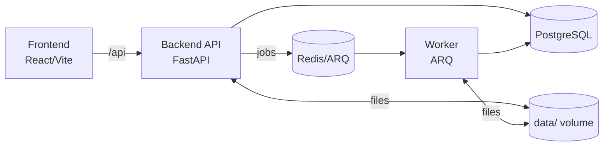

# Kitabim.AI Monorepo

The intelligent Uyghur Digital Library platform for OCR, curation, and RAG-powered reading.

## Structure

- `/services/backend`: FastAPI API service (runs shared backend core).
- `/packages/backend-core`: Shared Python backend package.
  - `app/api`: Book and chat endpoints.
  - `app/services`: PDF OCR, embeddings, spell check, and AI helpers.
  - `app/langchain`: LangChain-native chains and model/embedding adapters.
  - `app/core`: Settings and prompts.
  - `app/db`: PostgreSQL repositories and connection logic.
  - `app/models`: Pydantic schemas.
  - `app/utils`: Text cleaning helpers.
- `/services/worker`: ARQ worker that processes background OCR/embedding/RAG jobs (uses backend-core).
- `/apps/frontend`: React UI (Vite).
  - `src/components`: Library, Reader, Admin, Chat, Spell Check, layout/common UI.
  - `src/hooks`: Global state and data fetching.
  - `src/services`: API clients and Gemini helpers.
- `/packages/shared`: Shared TS types/utilities.
- `/data`: Persistent storage created at runtime (ignored by git).
  - `uploads/`: Original PDF files.
  - `covers/`: Extracted book cover images.
- `/k8s/local`: Local Kubernetes manifests (PostgreSQL on host).

- `AGENTS.md` files in the repo root and each service provide guidance for automated changes.

### Backend Core Layout
```
/packages/backend-core
  /app
    /api
    /services
    /langchain
    /core
    /db
    /models
    /utils
```

### Architecture Diagram


## Core Features

- **SHA-256 deduplication** to avoid re-processing identical PDFs.
- **Gemini OCR pipeline** with resumable tasks, cover extraction, and batch embeddings.
- **Manual OCR start**: uploads are stored as pending; start OCR from the Management page.
- **RAG chat** per book or global, with work-aware context and citations by page.
- **Spell check & correction workflow** for OCR cleanup and embedding regeneration.
- **Admin tools** for reprocessing, deletion, author/volume/category edits, and cover uploads.
- **RTL reader** with inline page editing and page-level reprocess.

## Local Development (Docker Desktop Kubernetes)

### Prerequisites

- **Docker Desktop** with Kubernetes enabled + **kubectl**
- **Note**: Use Docker Desktop Kubernetes for local development.

### Environment Variables (Kubernetes)

All configuration is managed via Kubernetes:

- Secrets: `k8s/local/secrets.yaml`
- Non‑secrets: `k8s/local/configmap.yaml`
- Example secret template: `k8s/local/secrets.yaml` (edit the file directly)

Notes:
- `DATABASE_URL` connects to your **host PostgreSQL** via `host.docker.internal:5432`.
- `GEMINI_API_KEY` is used by the backend only. The frontend proxies AI calls to the backend.
- Use only `GEMINI_API_KEY` (Google’s recommended env var). Do not also set `GOOGLE_API_KEY` to avoid client warnings.
- `.env` files can be used for local script execution, but Kubernetes uses the manifests in `k8s/local`.

### Docker Desktop Kubernetes Quickstart

1. Enable Kubernetes in Docker Desktop (Settings → Kubernetes) and set your context:

```bash
kubectl config use-context docker-desktop
```

2. Update `k8s/local/backend.yaml` and `k8s/local/worker.yaml` if your repo path differs (for the shared `/data` mount).
3. Build images:

```bash
docker build -t kitabim-backend:local -f Dockerfile.backend .
docker build -t kitabim-worker:local -f Dockerfile.worker .
docker build -t kitabim-frontend:local -f apps/frontend/Dockerfile .
```

4. Apply manifests:

```bash
kubectl apply -f k8s/local/
```

5. Update `k8s/local/secrets.yaml` with your `GEMINI_API_KEY` and re-apply if needed.
6. Access services:
   - Frontend: `http://localhost:30080`
   - Backend API: `http://localhost:30800`

### Start / Stop / Restart

```bash
# Start (apply manifests)
kubectl apply -f k8s/local/

# Stop
kubectl delete -f k8s/local/

# Restart (rolling restart all deployments)
kubectl rollout restart deployment/backend deployment/worker deployment/frontend deployment/redis
```

### Logs

```bash
# Backend
kubectl logs -f deployment/backend

# Worker
kubectl logs -f deployment/worker

# Frontend (nginx)
kubectl logs -f deployment/frontend

# Redis
kubectl logs -f deployment/redis
```

### Status

```bash
kubectl -n kitabim get pods
kubectl -n kitabim get svc
```

### Port-Forward (Backend)

```bash
kubectl -n kitabim port-forward svc/backend 8000:8000
```

### Health Checks

```bash
curl -s http://localhost:8000/health
curl -s http://localhost:8000/ready
```

### Tests

```bash
npm test
```

```bash
python3.13 -m pytest services/backend/tests
```

### Troubleshooting

- **docker-desktop context missing**: Enable Kubernetes in Docker Desktop (Settings → Kubernetes), then run `kubectl config get-contexts` and `kubectl config use-context docker-desktop`.
- **Pods stuck in Pending**: Check `k8s/local/backend.yaml` and `k8s/local/worker.yaml` hostPath matches your repo path and that Docker Desktop has file sharing enabled for that path.
- **Backend not ready**: Confirm `kubectl -n kitabim get pods` and check logs with `kubectl -n kitabim logs deployment/backend`.

## Technology Stack

- **Frontend**: React 19, Vite 6, Tailwind (CDN), Lucide, pdf.js.
- **Backend**: FastAPI, PostgreSQL (asyncpg), pgvector, PyMuPDF, LangChain, `langchain-google-genai`, `httpx`, `numpy`.
- **Queue/Worker**: Redis + ARQ.
- **Microservices**: Backend (FastAPI), Worker (ARQ).
- **Local Dev**: Docker Desktop Kubernetes.
