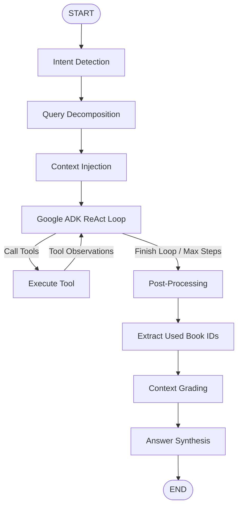

# Kitabim.AI

**Kitabim.AI** is the definitive intelligent knowledge base for Uyghur literature, history, and culture — semantically indexing books published in the Uyghur language and making that knowledge explorable through AI-powered conversation.

---

## Mission & Scale

Uyghur is spoken by millions yet remains severely underrepresented in the digital world. Kitabim.AI is building the most comprehensive and authentic Uyghur-language knowledge base ever assembled, targeting the complete corpus of Uyghur-language publications across literature, history, poetry, science, and culture.

**Target:** books published in Uyghur — the complete written record of a civilization.

This is not a search index or a catalogue. It is a living, queryable knowledge base where the entire body of Uyghur written knowledge can be explored through natural-language conversation.

---

## The Problem We Solve

Uyghur literature, history, and culture exist almost entirely in physical form. Millions of speakers have no way to search, discover, or query the written knowledge of their own civilization — and as physical books become scarce, that knowledge risks being lost entirely. Even where text can be extracted by OCR, a keyword search fails: Uyghur is agglutinative, pronouns are ambiguous, and a reader rarely knows which of hundreds of books holds the answer they need.

**Our solution is a knowledge-base agent** that reasons over the entire corpus before it answers. Instead of a single vector search, a language-model agent decides which tools to call, in which order, to collect enough evidence before forming a response.

---

## Knowledge Base Agent — Agentic RAG with Google ADK

The query assistant interface runs an **agentic loop built on Google ADK** as the primary fallback handler for all questions. Before running the agent, a lightweight preprocessing pipeline determines intent and decomposes compound queries.


```mermaid
graph TD
    START([START]) --> Intent[Intent Detection]
    Intent --> Decompose[Query Decomposition]
    Decompose --> ContextInj[Context Injection]
    ContextInj --> ADKLoop[Google ADK ReAct Loop]
    ADKLoop -->|Call Tools| ExecuteTool[Execute Tool]
    ExecuteTool -->|Tool Observations| ADKLoop
    ADKLoop -->|Finish Loop / Max Steps| PostProcess[Post-Processing]
    PostProcess --> ExtractIDs[Extract Used Book IDs]
    ExtractIDs --> ContextGrade[Context Grading]
    ContextGrade --> GenerateAnswer[Answer Synthesis]
    GenerateAnswer --> END([END])
```

**How Agentic RAG works:**

1. **Preprocessing Pipeline (Intent & Decomposition)**
   - **Intent detection** — detects page-specific questions, metadata queries, and general content search.
   - **Query Decomposition** — for queries containing multiple questions, a cheap LLM call splits them into up to 4 self-contained sub-questions so the agent can retrieve relevant context for all of them.

2. **Context Injection** — before the first LLM call, the agent's query is enriched with a `[Context]` block including the current book ID (if reading), previously-referenced book IDs from the conversation history, and category filters. This helps the agent skip the book-discovery step.

3. **Google ADK Agentic ReAct Loop** — the stateless agent executes a reasoning loop using an `InMemoryRunner`, choosing from 11 specialized retrieval and metadata tools:
   - `search_chunks` — pgvector similarity search over indexed passages in PostgreSQL (L1 + L2 cache).
   - `query_knowledge_graph` — **GraphRAG Tool**: extracts entity terms from the query, then queries **Neo4j** for a 1-hop subgraph of entity connections.
   - `search_books_by_summary` — embedding search over AI-generated book summaries, used to locate books covering a topic (L3 cache).
   - `find_books_by_title` — resolve a book title to internal IDs, titles, authors, and volumes.
   - `get_book_summary` — fetch the full semantic summary for specific books (used to identify characters/persons).
   - `get_current_page` — retrieve raw text of the page currently open in the reader.
   - `rewrite_query` — resolve pronouns and follow-up markers ("چۇ" clitic) via LLM rewrite (L0 cache).
   - `get_sister_volumes` — retrieve other volumes of the same series as a given book.
   - `get_book_author` / `get_books_by_author` — catalog metadata lookups.
   - `search_catalog` — library browsing and general listing queries.

4. **Post-Processing (Grading & Synthesis)**
   - **Deduplication and Grading** — merges retrieved passages and structures them. A relative score-based grading filter filters out low-relevance information.
   - **Answer Synthesis** — generates a streaming response with inline citations pointing to the source books, volumes, and page numbers.

---

## Core Technologies and AI Stack

The platform is built on specialized database, AI, and backend technologies:

- **Google ADK (`google-adk`)**: Serves as the agentic reasoning engine, coordinating the ReAct loop and automated tool dispatching for the RAG assistant.
- **google-genai SDK (`google-genai`)**: Used for all direct LLM generation and embedding calls across the application (OCR pipeline, summarization, entity extraction, text/structured chains).
- **Neo4j**: A graph database storing semantic networks of entities (Persons, Locations, Organizations, Works, Events) extracted from books, queried using Cypher for GraphRAG.
- **pgvector (PostgreSQL)**: PostgreSQL with `pgvector` stores page-chunk embeddings (Gemini Embedding v2) and performs similarity searches.
- **ARQ (Redis)**: Asynchronous task queue running background processing pipelines (OCR, chunking, embedding, summary extraction, and Neo4j ingestion).
- **FastAPI**: Asynchronous Python web framework providing API routes, user auth, rate limits, and streaming responses.

---

## Features

### OCR & Digitization Pipeline
- Upload PDFs and extract Uyghur text page-by-page using Google Gemini Vision.
- Milestone-based processing (`ocr → chunking → embedding`) with resumable jobs and real-time progress tracking.
- Text cleaning tailored for Uyghur script (removes OCR noise, header/footer markers).
- Semantic chunking with overlapping windows; upsert strategy so re-chunking is idempotent.
- AI-generated book summaries stored with embeddings for topic-based book discovery.
- **Knowledge Graph Ingestion (GraphRAG)**: Extracts Person, Location, Organization, Work, and Event entities and their semantic relationships from book chunks, building a knowledge network in Neo4j.

### Curation Workspace
- Per-page spell-check against a Uyghur dictionary with one-click corrections.
- Auto-correction rules for common OCR errors applied in bulk.
- Editor role with review queue; books go public only after editorial sign-off.

### User Management & Admin
- OAuth login (Google, Facebook, X).
- Role-based access: **Admin**, **Editor**, **Reader**, **Guest**.
- JWT access + refresh tokens via httpOnly cookies.
- Admin dashboard with per-book pipeline stats, user management, and user feedback analytics.
- All AI models and thresholds are configurable at runtime via `system_configs` table — no redeploy required.

---

## Quick Start (Docker Compose)

**Prerequisites:** Docker Desktop and a `GEMINI_API_KEY` from [Google AI Studio](https://aistudio.google.com).

```bash
cp .env.template .env
# Fill in GEMINI_API_KEY and other required values

./deploy/local/rebuild-and-restart.sh all
```

| Service | URL |
|---------|-----|
| Web UI | http://localhost:30080 |
| API + Swagger | http://localhost:30800/docs |
| Health check | http://localhost:30800/health |
| Neo4j Bolt | localhost:37687 |
| Neo4j Browser (UI) | http://localhost:37474 |

```bash
# Rebuild a single service after code changes
./deploy/local/rebuild-and-restart.sh [frontend|backend|worker]

# Logs
docker compose logs -f backend
docker compose logs -f worker
```


## Documentation

All architectural and design documents are located under the `docs/` directory.

| Document | Contents |
|----------|----------|
| [docs/main/SYSTEM_DESIGN.md](docs/main/SYSTEM_DESIGN.md) | Architecture overview, data model, key flows, technology stack |
| [docs/main/LLM_ROUTED_RAG_DESIGN.md](docs/main/LLM_ROUTED_RAG_DESIGN.md) | Handler registry, agent tools, loop logic, caching, latency budget |
| [docs/main/QUESTION_ANSWERING_DIAGRAM.md](docs/main/QUESTION_ANSWERING_DIAGRAM.md) | Visual pipeline and handler routing diagrams |
| [docs/main/WORKER_DESIGN.md](docs/main/WORKER_DESIGN.md) | Event-driven pipeline, scanners, jobs, state machine |
| [docs/main/PROJECT_STRUCTURE.md](docs/main/PROJECT_STRUCTURE.md) | Full directory structure, service responsibilities, configuration reference |
| [docs/main/REQUIREMENTS.md](docs/main/REQUIREMENTS.md) | Business requirements and user role permission matrix |
| [docs/main/UI_CSS_STANDARD.md](docs/main/UI_CSS_STANDARD.md) | Frontend CSS and Tailwind conventions |
| [docs/main/openapi.json](docs/main/openapi.json) | OpenAPI 3.0 spec for the REST API |
