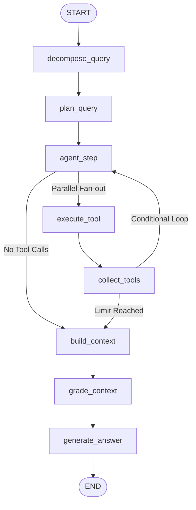

# Kitabim.AI

**Kitabim.AI** is the definitive intelligent knowledge base for Uyghur literature, history, and culture — semantically indexing every book published in the Uyghur language and making that knowledge explorable through AI-powered conversation.

---

## Mission & Scale

Uyghur is spoken by millions yet remains severely underrepresented in the digital world. Kitabim.AI is building the most comprehensive and authentic Uyghur-language knowledge base ever assembled, targeting the complete corpus of Uyghur-language publications across literature, history, poetry, science, and culture.

**Target:** every book published in Uyghur — the complete written record of a civilization.

This is not a search index or a catalogue. It is a living, queryable knowledge base where the entire body of Uyghur written knowledge can be explored through natural-language conversation.

---

## The Problem We Solve

Uyghur literature, history, and culture exist almost entirely in physical form. Millions of speakers have no way to search, discover, or query the written knowledge of their own civilization — and as physical books become scarce, that knowledge risks being lost entirely. Even where text can be extracted by OCR, a keyword search fails: Uyghur is agglutinative, pronouns are ambiguous, and a reader rarely knows which of hundreds of books holds the answer they need.

**Our solution is a knowledge-base agent** that reasons over the entire corpus before it answers. Instead of a single vector search, a language-model agent decides which tools to call, in which order, to collect enough evidence before forming a response.

---

## Knowledge Base Agent — Agentic GraphRAG

The knowledge-base agent chat interface is powered by an **agentic loop built on LangGraph** that runs for every question that isn't resolved by specialized fast-path handlers.


```mermaid
graph TD
    START([START]) --> Decompose[decompose_query]
    Decompose --> Plan[plan_query]
    Plan --> AgentStep[agent_step]
    
    AgentStep -->|Parallel Fan-out| ExecuteTool[execute_tool]
    AgentStep -->|No Tool Calls| BuildContext[build_context]
    
    ExecuteTool --> CollectTools[collect_tools]
    CollectTools -->|Conditional Loop| AgentStep
    CollectTools -->|Limit Reached| BuildContext
    
    BuildContext --> GradeContext[grade_context]
    GradeContext --> GenerateAnswer[generate_answer]
    GenerateAnswer --> END([END])
```

**How Agentic GraphRAG works:**

1. **Context Injection** — before the first LLM call, the agent's opening message is enriched with the current book ID, previously-referenced book IDs from the conversation, and a genre/category filter. This often eliminates the discovery step.

2. **Parallel Tool-Calling Loop** — the LangGraph agent decides which retrieval tools to call and can fan out to execute them in parallel (using LangGraph's `Send` primitive). These tools include:
   - `search_chunks` — pgvector similarity search over indexed passages in PostgreSQL (L1 + L2 cache).
   - `query_knowledge_graph` — **GraphRAG Tool**: extracts key entities (persons, locations, events, organizations, historical eras, or concepts) from the query using Gemini, then executes a Cypher query on **Memgraph** to retrieve a 1-hop subgraph of connections.
   - `search_books_by_summary` — embedding search over AI-generated book summaries, used to discover which books cover a topic (L3 cache).
   - `find_books_by_title` — resolve a book title named in the question to internal IDs.
   - `get_book_summary` — fetch the full semantic summary for a specific book.
   - `get_current_page` — raw text of the page currently open in the reader.
   - `rewrite_query` — resolve Uyghur pronouns and co-references via LLM rewrite (L0 cache).
   - `get_book_author` / `get_books_by_author` — catalog metadata lookups.
   - `search_catalog` — library browsing and general listing queries.

3. **Hybrid Context Fusion & Grading** — raw text chunks from PostgreSQL and structured graph relationships (e.g. `(سۇلتان سەئىدخام: Person) -[GRANDCHILD_OF]-> (يۇنۇسخان: Person)`) from Memgraph are fused together. A `grade_context` node then filters out low-relevance information.

4. **Answer Generation** — a separate LLM call produces a streaming response from the final graded context, complete with inline citations pointing to the source books, volumes, and page numbers.

**Specialized fast-path handlers** (enabled via `rag_fast_handlers_enabled` system config, default off) resolve common patterns before the agent runs:
   - Identity and capability questions
   - "Who wrote X?" and "What did Y write?" metadata lookups
   - Follow-up detection (Uyghur pronouns, "چۇ" topic-shift clitic)
   - In-reader page/volume-scoped questions

**Four-level cache** — query rewrite (L0), query embedding (L1), chunk search results (L2), book summary search results (L3) — minimizes redundant LLM and database calls within a session.

See [docs/main/AGENTIC_RAG_DESIGN.md](docs/main/AGENTIC_RAG_DESIGN.md) for the full design and [docs/feature/create-knowledge-graph/memgraph-knowledge-graph.md](docs/feature/create-knowledge-graph/memgraph-knowledge-graph.md) for details on the Memgraph Knowledge Graph integration.


---

## Core Technologies and AI Stack

The platform is built on several specialized AI and database technologies that power the knowledge-base agent and processing pipelines:

- **LangChain**: The foundation for interfacing with Large Language Models (specifically Google's Gemini). LangChain provides robust prompt templating, schema binding, and standard model integration. Through `ChatGoogleGenerativeAI`, the system executes structured output extraction, mapping model outputs directly into Pydantic models while handling transient generation/formatting errors gracefully via fallback mechanisms.
- **LangGraph**: Models and runs the multi-step agentic RAG query loop. LangGraph provides state-machine control for building stateful graphs with loops, conditional routing, and parallel execution. The query assistant runs as a LangGraph where nodes represent operations (query decomposition, tool execution, context grading) and edges govern execution flow based on state variables.
- **Memgraph**: An in-memory graph database that stores and queries the semantic networks extracted from books. Graph data is ideal for capturing indirect relations between entities (characters, places, organizations) across different chapters or texts. High-performance Cypher statements perform 1-hop subgraph retrieval, which is then fused into the LLM context.
- **Ragas**: The evaluation framework for measuring retrieval-augmented generation quality. Ragas measures metrics like Faithfulness, Context Recall, and Answer Relevance. Evaluations run asynchronously inside the worker queue, with metrics tracked in PostgreSQL and surfaced as aggregate quality scores on the admin dashboard.
- **pgvector (PostgreSQL)**: PostgreSQL with the `pgvector` extension stores page-chunk embeddings and performs similarity searches. It acts as the dense retriever (L2 cache) for semantic text search, enabling fast vector-index scans to retrieve relevant book passages.
- **ARQ (Redis)**: A lightweight, asynchronous task queue built on Redis. ARQ orchestrates the background worker pipeline, driving the multi-stage ingestion workflow (OCR scanner, chunking, vector embedding, graph ingestion) and running scheduled system maintenance.

---

## Features

### OCR & Digitization Pipeline
- Upload PDFs and extract Uyghur text page-by-page using Google Gemini Vision
- Milestone-based processing (`ocr → chunking → embedding`) with resumable jobs and real-time progress tracking
- Text cleaning tailored for Uyghur script (removes OCR noise, header/footer markers)
- Semantic chunking with overlapping windows; upsert strategy so re-chunking is idempotent
- AI-generated book summaries stored with embeddings for topic-based book discovery
- **Knowledge Graph Ingestion (GraphRAG)**: Extracts Person, Location, Organization, Work, and Event entities and their semantic relationships from book chunks, building a knowledge network in Memgraph.

### Curation Workspace
- Per-page spell-check against a Uyghur dictionary with one-click corrections
- Auto-correction rules for common OCR errors applied in bulk
- Editor role with review queue; books go public only after editorial sign-off

### User Management & Admin
- OAuth login (Google, Facebook, X)
- Role-based access: **Admin**, **Editor**, **Reader**, **Guest**
- JWT access + refresh tokens via httpOnly cookies
- Admin dashboard with per-book pipeline stats, user management, and RAG evaluation metrics
- All AI models and thresholds are configurable at runtime via `system_configs` table — no redeploy required

---

## Quick Start (Docker Compose)

**Prerequisites:** Docker Desktop and a `GEMINI_API_KEY` from [Google AI Studio](https://aistudio.google.com).

```bash
cp .env.template .env
# Fill in GEMINI_API_KEY and other required values

./deploy/local/rebuild-and-restart.sh all
```

| Service | URL |
|---------|-----|
| Web UI | http://localhost:30080 |
| API + Swagger | http://localhost:30800/docs |
| Health check | http://localhost:30800/health |
| Memgraph Bolt | localhost:37687 |
| Memgraph Lab (UI) | http://localhost:33000 |

*Note: In production deployments, Memgraph port `7687` is bound only to `127.0.0.1` for security. To connect from your local machine, open an SSH tunnel using:*
```bash
gcloud compute ssh kitabim-prod --zone=us-south1-c -- -L 37687:127.0.0.1:7687 -N
```

```bash
# Rebuild a single service after code changes
./deploy/local/rebuild-and-restart.sh [frontend|backend|worker]

# Logs
docker compose logs -f backend
docker compose logs -f worker
```

---

## Documentation

| Document | Contents |
|----------|----------|
| [docs/main/SYSTEM_DESIGN.md](docs/main/SYSTEM_DESIGN.md) | Architecture overview, data model, key flows, technology stack |
| [docs/feature/create-knowledge-graph/memgraph-knowledge-graph.md](docs/feature/create-knowledge-graph/memgraph-knowledge-graph.md) | Memgraph Knowledge Graph schema, high-performance batch ingestion, and GraphRAG setup |
| [docs/main/AGENTIC_RAG_DESIGN.md](docs/main/AGENTIC_RAG_DESIGN.md) | Handler registry, agent tools, loop logic, caching, latency budget |
| [docs/main/QUESTION_ANSWERING_DIAGRAM.md](docs/main/QUESTION_ANSWERING_DIAGRAM.md) | Visual pipeline and handler routing diagrams |
| [docs/main/WORKER_DESIGN.md](docs/main/WORKER_DESIGN.md) | Event-driven pipeline, scanners, jobs, state machine |
| [docs/main/PROJECT_STRUCTURE.md](docs/main/PROJECT_STRUCTURE.md) | Full directory structure, service responsibilities, configuration reference |
| [docs/main/REQUIREMENTS.md](docs/main/REQUIREMENTS.md) | Business requirements and user role permission matrix |
| [docs/main/UI_CSS_STANDARD.md](docs/main/UI_CSS_STANDARD.md) | Frontend CSS and Tailwind conventions |
| [docs/main/SECURITY_AUDIT.md](docs/main/SECURITY_AUDIT.md) | Security controls and audit findings |
| [docs/main/openapi.json](docs/main/openapi.json) | OpenAPI 3.0 spec for the REST API |

