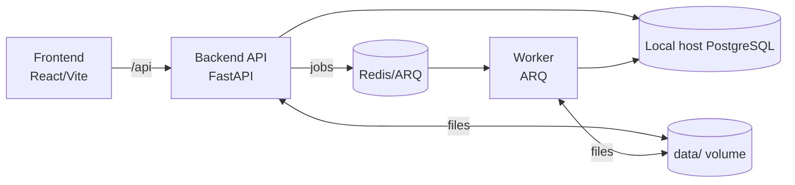

# System Design — Kitabim.AI

## 1) Overview
Kitabim.AI is a monorepo-based platform for OCR, curation, and RAG-powered reading of Uyghur books. The system uses Gemini for OCR, a FastAPI backend with a resumable processing pipeline, and a React/Vite frontend. Background processing is handled through a Redis-backed queue with a dedicated worker service. The backend API and worker share a common Python package (`packages/backend-core`).

## 2) Goals & Non‑Goals
**Goals**
- Reliable ingestion and OCR of PDFs at scale
- High-quality RAG for book- and library-level Q&A
- Maintainable, modular architecture with clear boundaries
- Observability (logging, health checks, trace hooks)

**Non‑Goals (current)**
- Multi-tenant auth and billing
- Fully managed cloud deployments (infrastructure currently automated via Kubernetes)

## 3) Architecture (High-Level)

### Core Services
- **Backend API (`services/backend`)**
  - FastAPI application built on shared backend core
  - Orchestrates upload, OCR, embeddings, and RAG chat
  - Exposes REST endpoints for books, chat, spell‑check, AI OCR
  - Uses PostgreSQL for metadata + embeddings (pgvector)

- **Worker (`services/worker`)**
  - ARQ worker process for background OCR/embedding/RAG jobs
  - Shares code with the backend via `packages/backend-core`

- **Frontend (`apps/frontend`)**
  - React 19 + Vite UI
  - Uses backend APIs; no secrets in browser
  - Proxy `/api` to backend in dev

### Supporting Components
- **Redis + ARQ Queue**
  - Required for background processing
  - Idempotent PDF processing via job locks + retries
- **Shared Data Volume**
  - `data/uploads` for PDFs
  - `data/covers` for cover images

### Architecture Diagram


## 4) Monorepo Structure
```
/apps
  /frontend
/services
  /backend
  /worker
/packages
  /shared
  /backend-core
/k8s/local

/data (runtime)
```

### Backend Core Layout
```
/packages/backend-core
  /app
    /api
    /services
    /langchain
    /core
    /db
    /models
    /utils
```

## 5) Data Model (PostgreSQL)
**Books** (primary table)
- `id`, `content_hash`, `title`, `author`, `volume`
- `status`, `processing_step`, `upload_date`, `last_updated`
- `errors`, `last_error`

**Pages** (detailed book data)
- `book_id`, `page_number`, `text`, `status`, `error`, `is_verified`

**Chunks** (semantic units for RAG)
- `book_id`, `page_number`, `text`, `embedding` (vector type)

**Users** & **Jobs** tables.

**Optional**
- `rag_evaluations` (when `RAG_EVAL_ENABLED=true`)

## 6) Key Flows

### A) PDF Upload & Processing
1. Frontend uploads PDF to `/api/books/upload`
2. Backend stores file in `data/uploads`
3. Backend enqueues job (`process_pdf`) via Redis
4. Worker (ARQ):
    - OCR pages with Gemini prompt
    - Generates embeddings
    - Builds full text + cover image
    - Updates status and writes to PostgreSQL

### B) RAG Chat
1. Frontend sends `/api/chat` request
2. Backend embeds query, retrieves scored pages
3. Context + prompt passed to LLM via LangChain pipeline
4. Response returned to UI

### C) Spell Check
1. User triggers `/api/books/{bookId}/spell-check`
2. Backend uses LLM to extract corrections via structured output parser
3. Corrections returned + optional apply flow

### D) Frontend OCR (Gemini)
1. Frontend sends base64 image to `/api/ai/ocr`
2. Backend calls Gemini OCR prompt
3. Returns cleaned Uyghur text

## 7) LangChain Usage
- LCEL pipelines for categorization and spell‑check
- Structured output parsing with `PydanticOutputParser`
- Optional in‑memory cache (`LANGCHAIN_CACHE=true`)
- Optional LangSmith tracing (`LANGCHAIN_TRACING=true`)
- Gemini provider accessed via `langchain-google-genai` wrappers (no direct SDK calls)

## 8) Reliability & Idempotency
- Job locks stored in PostgreSQL via processing_lock field prevent duplicate processing
- Retry policies managed by ARQ worker
- Circuit breaker around LLM calls to avoid cascading failures
- Processing status and errors persisted to `books` and `jobs`

## 9) Observability
- Structured JSON logging with request correlation IDs
- `/health` and `/ready` endpoints on backend API
- Optional RAG evaluation capture (latency, scores, context size)

## 10) Deployment (Local)
- **Kubernetes**: supported local dev environment (Docker Desktop, minikube, or kind); manifests in `/k8s/local`
- **Manual Run (optional)**: run Redis, backend, worker, frontend for debugging (expects PostgreSQL on host)

## 11) Security & Secrets
- Gemini API key stored in backend only
- Frontend proxies all AI calls through backend
- `.env` files for local development

## 12) Scalability Considerations
- Horizontal scaling of workers for OCR/embedding throughput
- PostgreSQL indexing on key fields
- Pluggable storage abstraction (future S3/MinIO)

## 13) Risks & Future Improvements
- Embeddings stored in PostgreSQL (pgvector) may become large at scale
- OCR quality depends on Gemini model; costs scale with volume
- Vector search performance optimized with HNSW indexes in PostgreSQL
- Add auth, user profiles, and multi‑tenant isolation

## 14) Open Questions
- Should storage be migrated to object storage (S3/MinIO)?
- Do we need per‑user collections or workspaces?
- How should long‑term RAG evaluation be surfaced in UI?
