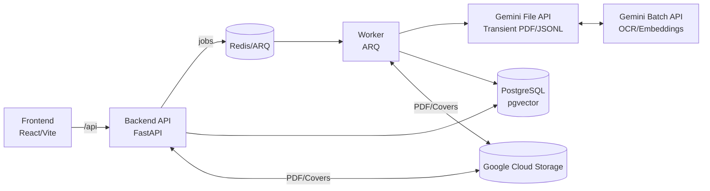

# System Design — Kitabim.AI

## 1) Overview
Kitabim.AI is a monorepo-based platform for OCR, curation, and RAG-powered reading of Uyghur books. The system uses **Gemini Batch API** for high-throughput OCR and embeddings, a FastAPI backend with an asynchronous processing pipeline, and a React/Vite frontend. Background orchestration is handled through a Redis-backed queue with a dedicated worker service. The backend API and worker share a common Python package (`packages/backend-core`).

## 2) Goals & Non‑Goals
**Goals**
- Cost-effective, bulk OCR and indexing of PDFs using Gemini Batch API
- High-quality RAG for book- and library-level Q&A
- Maintainable, modular architecture with clear boundaries
- Standardized file management (scripts in `scripts/`, docs in `docs/`)
- Observability (logging, health checks, batch job tracking)

**Non‑Goals (current)**
- Multi-tenant auth and billing
- Real-time OCR (Batch is preferred for its 50% cost reduction)

## 3) Architecture (High-Level)

### Core Services
- **Backend API (`services/backend`)**
  - FastAPI application built on shared backend core
  - Orchestrates upload, batch job management, and RAG chat
  - Exposes REST endpoints for books, chat, and admin batch monitoring
  - Uses PostgreSQL for metadata + embeddings (pgvector)

- **Worker (`services/worker`)**
  - ARQ worker process for background orchestration
  - **Submission Cycle**: Collects pending work and submits to Gemini Batch API
  - **Polling Cycle**: Checks Gemini for job completion and applies results
  - **Local Processing**: Handles text cleaning and semantic chunking

- **Frontend (`apps/frontend`)**
  - React 19 + Vite UI
  - Real-time status updates for books and individual pages

- **Gemini Infrastructure**
  - **Batch API**: Asynchronous processing of OCR and Embedding requests
  - **File API**: Transient storage for input PDFs and JSONL request/response files

- **Google Cloud Storage (GCS)**
  - Private bucket for original PDFs (source of truth)
  - Public bucket (CDN-enabled) for book covers

### Architecture Diagram


## 4) Monorepo Structure
```
/apps
  /frontend
/services
  /backend
  /worker
/packages
  /shared
  /backend-core
/scripts         # All operational/diagnostic tools
/docs            # All project documentation
/k8s/local       # Kubernetes manifests
```

## 5) Data Model (PostgreSQL)
**Books**
- `status` statuses: `pending`, `ocr_processing`, `ocr_done`, `ready`
- `ocr_done_count`, `error_count` (counters for progress tracking)

**Pages**
- `status` statuses: `pending`, `ocr_processing`, `ocr_done`, `chunked`, `indexed`
- `text`, `is_indexed`, `is_verified`

**Batch Jobs**
- Tracks the lifecycle of a Gemini Batch Job (`ocr` or `embedding`)
- `remote_job_id`, `status` (SUCCEEDED, FAILED, etc.), `input_file_uri`

**Batch Requests**
- Maps individual JSONL requests back to specific `book_id` and `page_number`

**Chunks**
- Semantic units with `pgvector(768)` embeddings

## 6) Key Flows

### A) PDF Processing Workflow (Async Batch)
1. **Upload**: User uploads PDF to Backend → Saved to GCS.
2. **OCR Submission**: Worker picks up `pending` pages, uploads PDF to Gemini File API, submits Batch Job.
3. **Polling**: Worker polls Gemini. On `SUCCEEDED`, downloads JSONL result.
4. **OCR Application**: Worker applies text to `pages`, set status to `ocr_done`.
5. **Local Chunking**: Worker cleans `ocr_done` text and creates `chunks`.
6. **Embedding Submission**: Worker submits batch job for chunks with `NULL` embeddings.
7. **Finalization**: Results applied; book marked `ready` when all pages are `indexed`.

### B) RAG Chat
1. Backend embeds query using interactive Gemini API (LangChain).
2. Performs vector similarity search in PostgreSQL.
3. Context + prompt passed to LLM via LangChain pipeline for answer generation.

## 7) Gemini Integration Strategy
- **Official SDK (`google-genai`)**: Used for **Batch API** and **File API** operations where LangChain support is limited or direct control is required.
- **LangChain**: Used for **Interactive Chat**, **Spell Check**, and **Categorization** (LCEL pipelines, structured output parsing).

## 8) Reliability & Observability
- **Idempotency**: All batch requests use a `custom_id` (e.g., `ocr_{book}_{page}`) to ensure results are mapped correctly even if retried.
- **Cleanup**: Transient files in Gemini File API and local cache are deleted automatically after processing.
- **Circuit Breaker**: Protects interactive services from LLM outages.
- **Batch Tracking**: Admin endpoints allow monitoring of remote job states.

## 9) Scalability
- **Batching**: Reduces API overhead and provides higher throughput compared to sequential page processing.
- **Cloud Storage**: GCS handles the heavy lifting for binary artifacts.
- **Vector Search**: pgvector in PostgreSQL allows scaling retrieval without a separate vector database (using HNSW indexes).

## 10) Security
- All AI keys and GCS credentials are kept server-side.
- JWT-based authentication with role-based access control (Admin, Editor, Reader).
- Private GCS buckets ensure book content isn't exposed directly.
