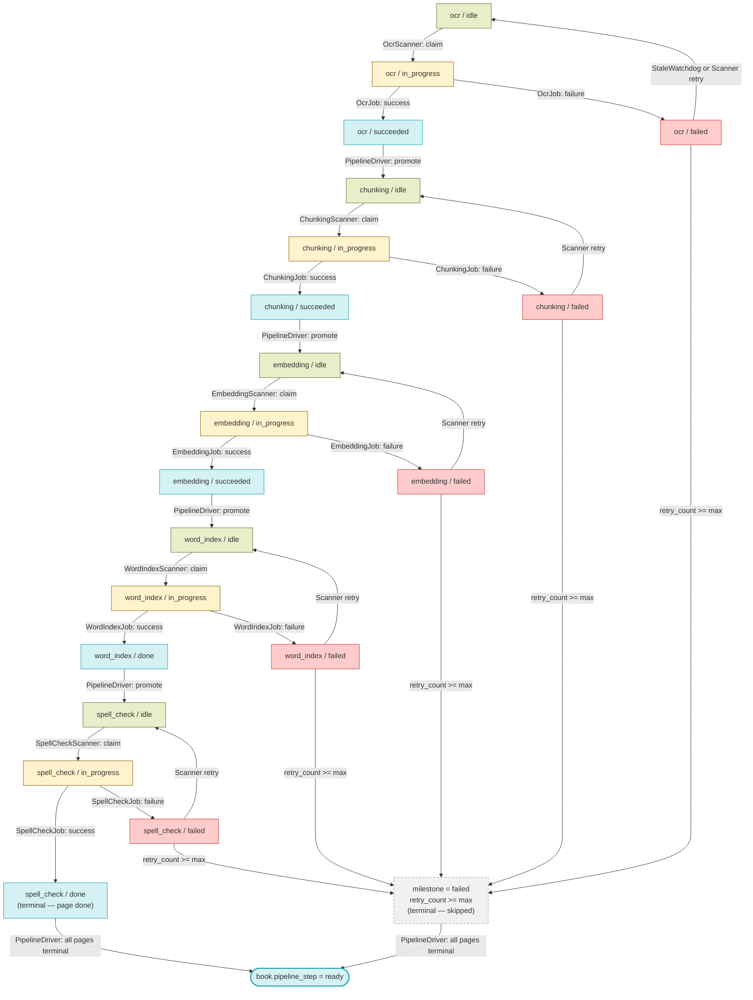

# Worker Design — Event-Driven Pipeline

## Overview

The Kitabim.AI processing pipeline uses a **decoupled, event-driven architecture** based on the **Transactional Outbox Pattern**. This design ensures high reliability, observability, and responsiveness by separating the concern of "what work needs doing" from the "execution of that work."

Key characteristics:
- **`milestone` columns** — each stage (`ocr`, `chunking`, `embedding`, `word_index`, `spell_check`) has its own milestone in the `pages` table.
- **States** — `idle | in_progress | succeeded | failed`.
- **Transactional Outbox** — the `pipeline_events` table captures successful milestones within the same database transaction as the result application.
- **Event Dispatcher** — a low-latency scanner that polls the outbox and immediately enqueues the next required job, bypasses traditional 1-minute cron delays.

---

## Goals

- Clear, unambiguous page and book state at all times
- Per-page retry with exhausted retry detection
- Uniform stale detection across all steps (one rule)
- Each component has a single responsibility
- Adding a new pipeline step requires only a new scanner + job, nothing else changes

## Non-Goals

- Gemini Batch API mode (realtime only)
- Circuit breaker (deferred to a later iteration)
- Backwards compatibility with v1 status columns

---

## Schema
Current implementation uses granular milestone columns on the `pages` table and a `pipeline_step` column on the `books` table.

### `pages` table

| Column | Type | Description |
|---|---|---|
| `ocr_milestone` | `varchar` | State of OCR: `idle \| in_progress \| succeeded \| failed` |
| `chunking_milestone` | `varchar` | State of Chunking: `idle \| in_progress \| succeeded \| failed` |
| `embedding_milestone` | `varchar` | State of Embedding: `idle \| in_progress \| succeeded \| failed` |
| `word_index_milestone` | `varchar` | State of Word Index: `idle \| in_progress \| done \| failed` |
| `spell_check_milestone` | `varchar` | State of Spell Check: `idle \| in_progress \| done \| failed` |
| `retry_count` | `integer` | Number of failed attempts for the current step. |

### `books` table

| Column | Type | Description |
|---|---|---|
| `pipeline_step` | `varchar` | Primary step for progress tracking: `ocr \| chunking \| embedding \| word_index \| spell_check \| ready` |

---

## Architecture

```
worker/
  scanners/
    gcs_discovery_scanner.py ← lists GCS uploads/, registers new books in DB
    pipeline_driver.py       ← state machine: initializes pages, advances steps, marks book ready
    ocr_scanner.py           ← claims idle ocr pages, dispatches OcrJob per book
    chunking_scanner.py      ← claims idle chunking pages, dispatches ChunkingJob
    embedding_scanner.py     ← claims idle embedding pages, dispatches EmbeddingJob
    word_index_scanner.py    ← claims idle word_index pages, dispatches WordIndexJob
    spell_check_scanner.py   ← claims idle spell_check pages, dispatches SpellCheckJob
    event_dispatcher.py      ← monitors outbox, triggers next-step jobs immediately
    stale_watchdog.py        ← resets stale in_progress pages to idle
    maintenance_scanner.py   ← cleans up processed outbox events (daily)
  jobs/
    ocr_job.py            ← downloads PDF, OCRs pages via Gemini Vision
    chunking_job.py       ← chunks page text into DB records
    embedding_job.py      ← generates and stores embeddings
    word_index_job.py     ← builds word frequency index
    spell_check_job.py    ← identifies unknown words and suggests corrections
  worker.py               ← ARQ WorkerSettings
```

---

## Component Responsibilities

### GcsDiscoveryScanner

Polls the GCS bucket and registers books that aren't yet in the database. Runs every 5 minutes.

**Responsibilities:**

1. List all `uploads/*.pdf` files in the GCS data bucket
2. Skip files already known to the DB (by filename or book ID)
3. Download unknown files to compute SHA-256 hash and extract PDF metadata
4. Skip content-hash duplicates (same file under a different name)
5. Standardize the GCS path to `uploads/{book_id}.pdf` (rename if needed)
6. Insert a `Book` record with `status='pending'` and `v2_pipeline_step=NULL`

PipelineDriver picks up the new book on its next run and initializes its pages into `ocr / idle`. No explicit OCR triggering is needed.

The manual admin API (`POST /api/books/storage/sync`) continues to use the existing `DiscoveryService` directly.

---

### PipelineDriver

The single entry point into the pipeline and the only component that advances pipeline steps. Runs every minute as a cron job.

**Responsibilities:**

1. **Initialize** — finds pages with `pipeline_step IS NULL`, sets them to `ocr / idle`
2. **Promote** — advances pages whose current step has succeeded to the next step
3. **Book ready** — marks a book as `ready` when all its pages are terminal

**Promotion rules:**

```
ocr / succeeded        →  chunking / idle
chunking / succeeded   →  embedding / idle
embedding / succeeded  →  word_index / idle
word_index / done      →  spell_check / idle
```

Spell Check is the end of the page pipeline. There is no further step — `spell_check / done` (or `failed`) is the terminal success state for a page.

**Book ready condition:**

A book is marked `pipeline_step = ready` when every page is in a terminal state:
- `pipeline_step = spell_check AND milestone = done`  (processed successfully)
- `milestone = failed AND retry_count >= max_retries`  (exhausted, skipped)

This means a book with a few permanently failed pages is still marked ready and searchable.

---

### Scanners (OcrScanner / ChunkingScanner / EmbeddingScanner)

Each scanner is responsible for one step only: **claim idle pages atomically and dispatch a job**.

**Generic scanner flow (every 1 min):**

```sql
-- Step 1: Atomic claim (prevents double-dispatch)
UPDATE pages
SET <step>_milestone = 'in_progress'
WHERE <step>_milestone = 'idle'
LIMIT <scanner_page_limit>
RETURNING id
```

```python
# Step 2: Dispatch job with claimed page IDs
await redis.enqueue_job("<step>_job", page_ids=[...])
```

**OcrScanner — groups by book:**

OCR requires a PDF file. Processing pages from the same book in one job means one PDF download. The OcrScanner therefore groups idle OCR pages by book and dispatches one `OcrJob` per book.

```
OcrScanner (every 1 min):
  1. Find distinct book_ids where pages have (ocr / idle)
  2. For each book (up to N books per run):
       a. Claim all idle ocr pages for that book → in_progress
       b. Dispatch OcrJob(book_id, page_ids)
```

**ChunkingScanner / EmbeddingScanner:**

Chunking and embedding only need text from the database, so pages from any book can be processed together.

```
ChunkingScanner / EmbeddingScanner (every 1 min):
  1. Claim up to N idle pages across all books → in_progress
  2. Dispatch one job with all claimed page IDs
```

---

### Jobs

Jobs are pure executors — they process pages and report success or failure. They have no knowledge of what step comes next.

**OcrJob(book_id, page_ids):**

```
1. Download PDF once from storage
2. For each page (async, semaphore-limited concurrency):
     a. Render page as image (PyMuPDF, 1.5x zoom)
     b. Call Gemini Vision API
     c. Normalize text (Uyghur character normalization, markdown cleanup)
     d. Save extracted text to page record
     e. Set v2_milestone = 'succeeded'
   On failure:
     e.retry_count++
     f. Set <step>_milestone = 'failed'
3. Update book.pipeline_step = 'ocr' (marks book as actively in OCR step)
```

**ChunkingJob(page_ids):**

```
1. For each page:
     a. Load text from DB
     b. Apply recursive character text splitter
     c. Save Chunk records (embedding = NULL)
     d. Set chunking_milestone = 'succeeded'
   On failure:
     e. retry_count++
     f. Set chunking_milestone = 'failed'
```

**EmbeddingJob(page_ids):**

```
1. For each page:
     a. Load chunks from DB
     b. Generate 768-dim embeddings via Gemini Embeddings API
     c. Store vectors on chunk records
     d. Set embedding_milestone = 'succeeded'
   On failure:
     e. retry_count++
     f. Set embedding_milestone = 'failed'
```

---

### StaleWatchdog

Resets pages that are stuck in `in_progress` (e.g. job crashed, pod restarted). One rule applies to all steps.

```sql
UPDATE pages
SET <step>_milestone = 'idle'
WHERE <step>_milestone = 'in_progress'
  AND updated_at < NOW() - INTERVAL '30 minutes'
```

Runs every 30 minutes.

---

## Cron Schedule

| Scanner | Interval | Notes |
|---|---|---|
| `gcs_discovery_scanner` | Every 5 min | List GCS bucket, register new books |
| `pipeline_driver` | Every 1 min | Initialize + promote + book ready |
| `ocr_scanner` | Every 1 min | Groups by book |
| `chunking_scanner` | Every 1 min | Cross-book |
| `embedding_scanner` | Every 1 min | Cross-book |
| `word_index_scanner` | Every 1 min | Cross-book |
| `spell_check_scanner`| Every 1 min | Cross-book |
| `event_dispatcher` | Startup + 1 min (high frequency pool) | Triggers reactive progression |
| `stale_watchdog` | Every 30 min | Uniform reset for all steps |
| `maintenance_scanner`| Daily at 3 AM | Database house keeping |

---

## State Machine



---

## Retry Logic

Retry state is tracked on the page row via `retry_count`.

| Scenario | Behaviour |
|---|---|
| Job sets `milestone = failed` | `retry_count++` |
| Scanner finds `milestone = failed AND retry_count < max` | Resets to `idle` — page will be retried |
| Scanner finds `milestone = failed AND retry_count >= max` | Skips — page is terminal |
| Stale watchdog fires | Resets `in_progress → idle`, does **not** increment `retry_count` (timeout ≠ failure) |

Max retries is configurable via `system_configs` (e.g. `ocr_max_retry_count`, default `10`).

---

## Why This Is Better

| Concern | v1 | Implementation |
|---|---|---|
| Which step failed? | `status = error` — ambiguous | `milestone = failed` — explicit |
| Stale detection | Step-specific hardcoded timeouts in `maintenance.py` | One rule: `in_progress + timeout → idle` |
| Adding a new pipeline step | Touch `pdf_service`, `maintenance`, `queue`, `worker` | Add one scanner + one job, nothing else changes |
| Per-page retry | Partial — mixed into OCR job logic | First-class: `retry_count` on the row, checked by scanner |
| Monolithic job | `pdf_service.py` does OCR + chunking + embedding | Focused jobs, each does one thing |
| Batch vs realtime code paths | Two parallel code paths | One path — realtime only |
