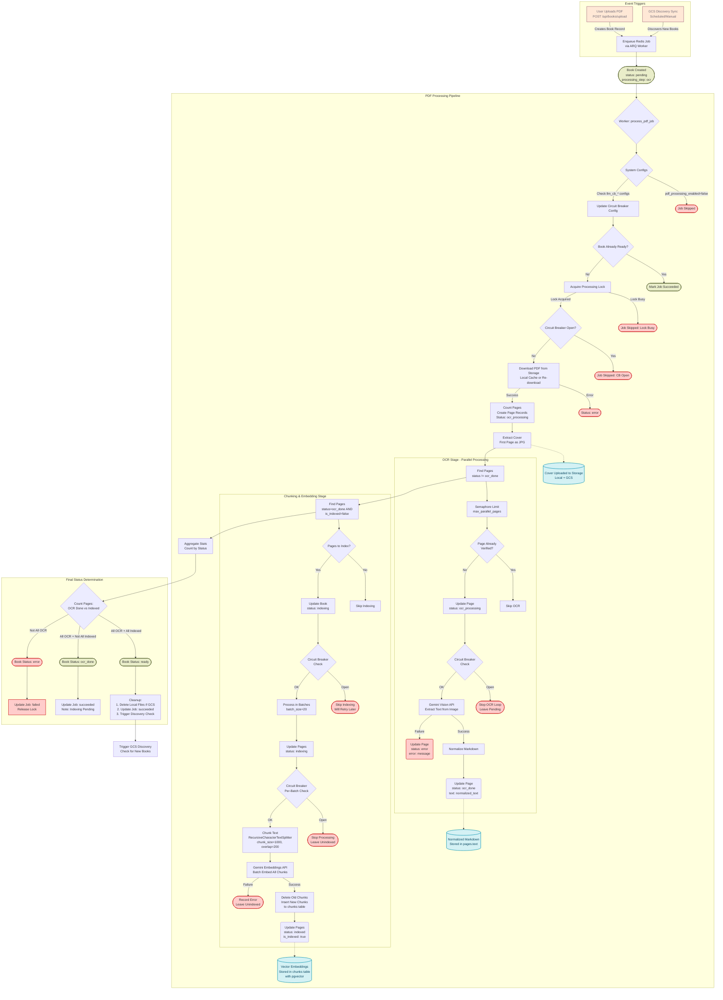

# Book Processing Pipeline Diagram

Here is a visual representation of the book processing pipeline, including triggers, milestone changes, and outputs.

## Overview

The pipeline processes PDF books through multiple stages:
1. **Initialization**: Book upload or discovery → Job enqueue
2. **OCR Stage**: Extract text from PDF pages using Gemini Vision API
3. **Indexing Stage**: Chunk text and generate embeddings using Gemini Embeddings API
4. **Finalization**: Determine final book status and cleanup

## Pipeline Diagram

## Status Flow

### Book Statuses
- `pending` → Initial state after upload/discovery
- `ocr_processing` → OCR in progress
- `indexing` → Embedding generation in progress
- `ocr_done` → OCR complete, but embeddings pending
- `ready` → Fully processed and searchable
- `error` → Processing failed

### Page Statuses
- `pending` → Created but not processed
- `ocr_processing` → OCR in progress for this page
- `ocr_done` → Text extracted, ready for indexing
- `indexing` → Embedding generation in progress
- `indexed` → Fully processed with embeddings
- `error` → OCR failed for this page

## Key Components

### Storage
- **Local**: Temporary cache in `settings.uploads_dir` and `settings.covers_dir`
- **Cloud**: GCS bucket for persistent storage (PDFs and covers)
- **Database**: PostgreSQL with pgvector extension for embeddings

### APIs Used
- **Gemini Vision API**: OCR text extraction from PDF pages
- **Gemini Embeddings API**: Generate vector embeddings for semantic search

### Circuit Breaker
- Prevents overwhelming LLM APIs during outages
- Configurable via `llm_cb_failure_threshold` and `llm_cb_recovery_seconds`
- Checked before OCR and embedding operations

### Processing Lock
- Prevents concurrent processing of the same book
- TTL-based (configurable via `job_lock_ttl_seconds`)
- Auto-releases on job completion or timeout
