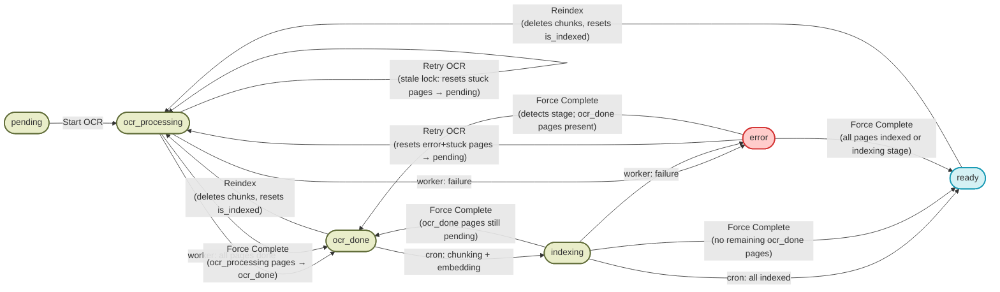
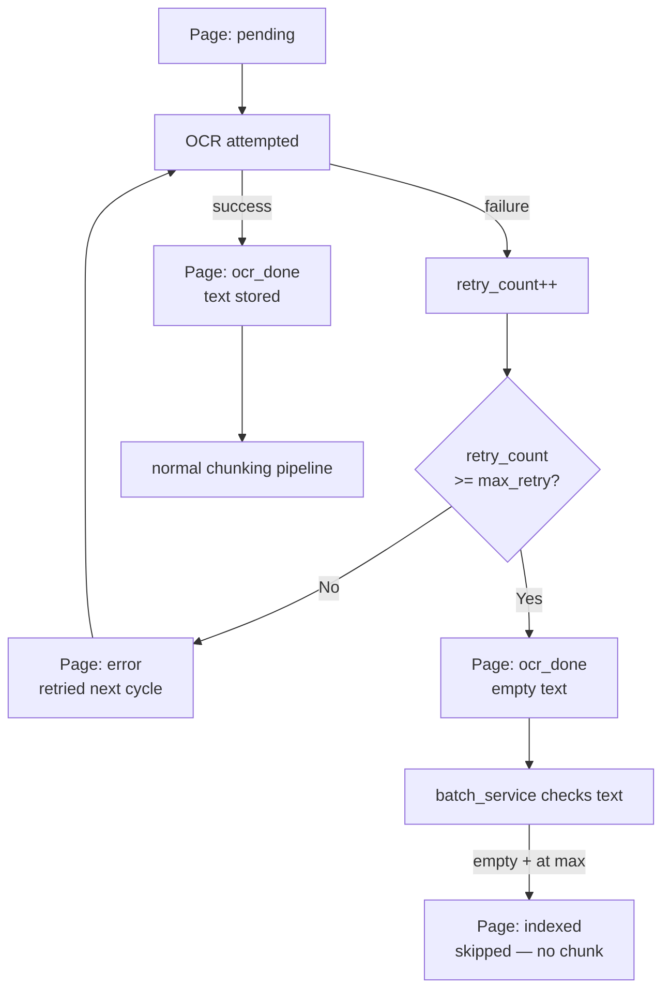

# Book Processing Pipeline Diagram

Visual representation of the book processing pipeline, including triggers, stage transitions, admin recovery actions, and outputs. All processing is synchronous/realtime — no Gemini Batch API is used.

---

## Full Pipeline

```mermaid
flowchart TD
    %% Triggers
    subgraph Triggers [Event Triggers]
        T1[User Uploads PDF\nPOST /api/books/upload] -->|Creates Book Record| InitDB
        T2[GCS Discovery Sync\nScheduled/Manual] -->|Discovers New Books| InitDB
    end

    %% Init
    InitDB([Book: pending\nPages: pending])

    %% Phase 1: Realtime OCR
    subgraph OCR_Phase [Phase 1 — Realtime OCR]
        S1[Book enqueued to ARQ worker queue] --> S2[Worker picks up job]
        S2 --> S3[pdf_service processes each page\nvia Gemini synchronously]
        S3 --> S4[Page: pending → ocr_processing → ocr_done\nBook: pending → ocr_processing → ocr_done]
        S4 --> S5{OCR success?}
        S5 -->|Yes| S6[Page: ocr_done\ntext stored]
        S5 -->|Failure| S7[retry_count++]
        S7 --> S8{retry_count\n>= max?}
        S8 -->|No| S9[Page: error\nretried next attempt]
        S8 -->|Yes| S10[Page: ocr_done\nempty text — auto-skipped]
    end
    InitDB --> S1

    %% Phase 2: Chunking
    subgraph Chunking_Phase [Phase 2 — Chunking — Background Cron]
        C1[chunk_ocr_done_pages\nevery N minutes] --> C2[Find ocr_done pages]
        C2 --> C3{Has text?}
        C3 -->|Yes| C4[Strip Markdown & Clean Text]
        C4 --> C5[Semantic Chunking]
        C5 --> C6[Save Chunks to DB\nembedding = NULL]
        C6 --> C7[Page: chunked]
        C3 -->|No — empty text| CE{retry_count\n>= max?}
        CE -->|Yes| CS[Page: indexed\nis_indexed=true\nno chunk created]
        CE -->|No| CErr[Page: error\nretry_count++]
    end
    S6 --> C1
    S10 --> C1

    %% Phase 3: Realtime Embedding
    subgraph Embed_Phase [Phase 3 — Realtime Embedding — Same Cron Run]
        E1[embed_pending_chunks_realtime] --> E2[Fetch chunks with NULL embedding]
        E2 --> E3[Generate 768-dim vectors\nsynchronously in batches of 20]
        E3 --> E4[Chunks: embedding stored]
    end
    C7 --> E1

    %% Phase 4: Finalization
    subgraph Finalization [Phase 4 — Finalization — Every Minute]
        F1[finalize_indexed_pages\nevery 1 minute] --> F2[Find chunked pages\nwhere all chunks embedded]
        F2 --> F3[Pages: indexed]
        F3 --> F4[Aggregate Book Progress]
        F4 --> F5{indexed + error\n== total_pages?}
        F5 -->|Yes| Ready([Book: ready])
        F5 -->|No| F6[Book stays in current status\nnext cron tick picks up]
    end
    E4 --> F1

    classDef output fill:#d4f1f4,stroke:#189ab4,stroke-width:2px,color:#05445E
    classDef trigger fill:#ffe8d6,stroke:#b5838d,stroke-width:2px,color:#6d6875
    classDef state fill:#e9edc9,stroke:#606c38,stroke-width:2px
    classDef cloud fill:#f1f1f1,stroke:#333,stroke-dasharray:5 5
    classDef skip fill:#fff3cd,stroke:#856404,stroke-width:2px

    class Ready state
    class T1,T2 trigger
    class InitDB state
    class OCR_Phase,Chunking_Phase,Embed_Phase,Finalization cloud
    class S10,CS skip
```

---

## Admin Recovery Actions

Actions available from the admin management table when a book is stuck or failed.

---

## Page Auto-Skip on Max Retry

When a page repeatedly fails OCR, it is automatically skipped after `ocr_max_retry_count` attempts (configurable in System Configs, default `10`). This prevents a single bad page from blocking the entire book.

---

## Status Reference

### Book Statuses

| Status | Meaning | processing_step |
|---|---|---|
| `pending` | Awaiting Start OCR trigger | — |
| `ocr_processing` | Worker running OCR or re-embedding | `ocr` or `rag` |
| `ocr_done` | All pages OCR'd; not yet indexed | `ocr` |
| `indexing` | Embedding/indexing in progress | `rag` |
| `ready` | Fully processed and searchable | — |
| `error` | Pipeline failed at some stage | — |

### Page Statuses

| Status | Meaning |
|---|---|
| `pending` | Waiting to be OCR'd |
| `ocr_processing` | OCR running for this page |
| `ocr_done` | Text extracted; not yet chunked |
| `chunked` | Text split into chunks; awaiting embeddings |
| `indexed` | Fully embedded and searchable |
| `error` | OCR or embedding failed; will be retried up to `ocr_max_retry_count` times |

### Page Fields

| Field | Type | Description |
|---|---|---|
| `retry_count` | `integer` | Number of failed OCR attempts for this page. Auto-incremented on each failure. Page is skipped when this reaches `ocr_max_retry_count`. |

---

## Action Metrics

### Start OCR

| Field | Value |
|---|---|
| Trigger condition | `status === 'pending'` |
| Book status → | `ocr_processing` |
| processing_step → | `ocr` |
| Pages effect | Existing pages deleted; worker creates fresh `pending` pages |
| Worker job | `start_ocr` |

### Retry OCR

| Field | Value |
|---|---|
| Trigger condition | `(hasFailedPages OR status === 'error' OR isStale) AND NOT isActuallyProcessing` |
| Book status → | `ocr_processing` |
| processing_step → | `ocr` |
| Pages effect | Pages with `status IN ('error', 'ocr_processing')` → `pending` (text cleared, is_indexed=false) |
| Special case | `status === 'error'` + no stuck/failed pages → re-enqueues without page changes (`resumed`) |
| Worker job | `retry_failed` or `resume_error` |

> Pages that have reached `ocr_max_retry_count` are no longer in `error` status (they were
> auto-promoted to `ocr_done`), so they are not reset by Retry OCR and do not block the book.

### Reindex

| Field | Value |
|---|---|
| Trigger condition | `status === 'ready' OR status === 'ocr_done'` |
| Book status → | `ocr_processing` |
| processing_step → | `rag` |
| Pages effect | `ocr_done`, `chunked`, `indexed` pages → `ocr_done`, `is_indexed=false` |
| Chunks effect | All chunks deleted |
| Worker job | `reindex` — re-chunks and re-embeds all `ocr_done` pages |

### Force Complete

| Field | Value |
|---|---|
| Trigger condition | Editor/admin AND `(isStale OR status IN ('ocr_processing', 'indexing', 'error'))` |
| Lock cleared | Always (`processing_lock = null`, `processing_lock_expires_at = null`) |

#### Outcome by State

| Current status | Page condition | Pages → | Book status → |
|---|---|---|---|
| `ocr_processing` | — | `ocr_processing` → `ocr_done` | `ocr_done` |
| `indexing` | no remaining `ocr_done` pages | `indexing` → `indexed` (is_indexed=true) | `ready` |
| `indexing` | `ocr_done` pages still unindexed | `indexing` → `indexed` (is_indexed=true) | `ocr_done` |
| `error` | has `ocr_processing` pages | `ocr_processing` → `ocr_done` | `ocr_done` |
| `error` | has `indexing` pages, no `ocr_done` | `indexing` → `indexed` (is_indexed=true) | `ready` |
| `error` | has `indexing` pages + `ocr_done` pages | `indexing` → `indexed` (is_indexed=true) | `ocr_done` |
| `error` | has `ocr_done` pages only | none | `ocr_done` |
| `error` | has `indexed` pages only | none | `ready` |
| `error` | no surviving page states | none | `ocr_done` |

> When force-complete resolves to `ocr_done`, the indexing pipeline automatically picks up
> remaining `ocr_done` pages on the next worker cycle — no further admin action needed.

---

## Key Infrastructure

| Component | Role |
|---|---|
| **ARQ Worker** | Runs realtime OCR jobs (via queue) and periodic chunking/embedding/finalization crons |
| **Google Cloud Storage** | Persistent source for PDFs and covers |
| **PostgreSQL + pgvector** | Stores metadata, page text, chunks, and embeddings |
| **Processing Lock** | `processing_lock` + `processing_lock_expires_at` prevent duplicate jobs; used for stale detection |
| **System Configs** | Admin-configurable runtime settings (e.g. `ocr_max_retry_count`, `batch_submission_interval_minutes`) stored in `system_configs` table |
