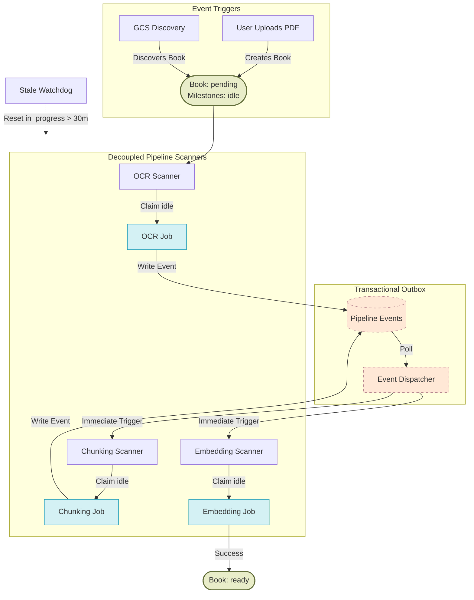
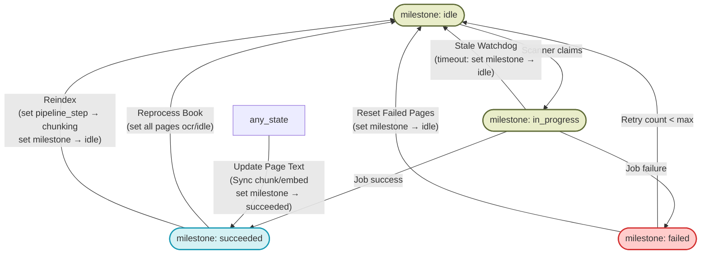
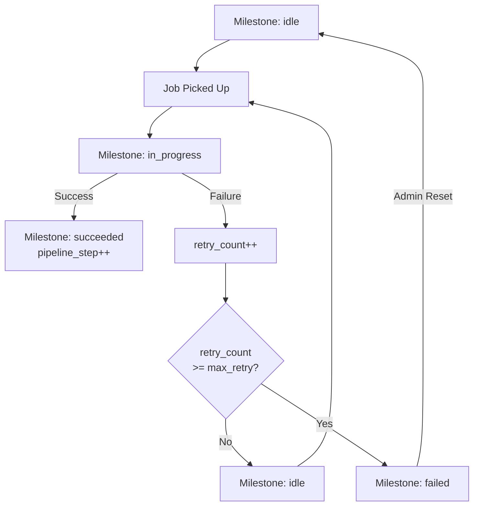

# Book Processing Pipeline Diagram

Visual representation of the book processing pipeline, including triggers, stage transitions, admin recovery actions, and outputs. All processing is synchronous/realtime — no Gemini Batch API is used.

---

## Full Pipeline

---

## Admin Recovery Actions

Actions available from the admin management table when a book is stuck or failed. These actions work by resetting page-level milestones to `idle`, allowing scanners to pick them up.

---

## Page Milestone Transitions

When a page repeatedly fails OCR, it is automatically marked as `failed` after `ocr_max_retry_count` attempts. Admin can then use "Reset Failed Pages" to try again if needed.

---

### Book Statuses

| Status | Meaning |
|---|---|
| `pending` | Waiting for processing to begin |
| `ready` | Fully processed; all pages reached final milestone |
| `error` | Terminal failure at book level (rare; usually page-level) |

### Page Milestones

| Milestone | Meaning |
|---|---|
| `idle` | Awaiting processing by the relevant scanner |
| `in_progress` | Currently being processed by a worker job |
| `succeeded` | Successfully completed current pipeline step |
| `failed` | Max retries reached; manual intervention required |

### Page Pipeline Steps

| Step | Goal |
|---|---|
| `ocr` | Extraction of text from image/PDF |
| `chunking` | Semantic splitting of text |
| `embedding` | Generation of vector embeddings |
| `word_index` | Building per-book word frequency index |
| `spell_check` | Identifying unknown words |

---

### Reprocess Book
| Field | Value |
|---|---|
| Trigger | Admin "Reprocess" button |
| Effect | All pages → `pipeline_step: ocr`, `milestone: idle`, `status: pending` |
| Logic | Preserves text until replaced page-by-page |

### Reindex
| Field | Value |
|---|---|
| Trigger | Admin "Reindex" button |
| Effect | Post-OCR pages → `pipeline_step: chunking`, `milestone: idle`, `is_indexed: false`. Chunks deleted. |

### Reset Failed Pages
| Field | Value |
|---|---|
| Trigger | Admin "Reset Failed" button |
| Effect | Pages with `milestone: failed` → `milestone: idle`, `retry_count: 0` |

### Manual Page Update
| Field | Value |
|---|---|
| Trigger | Editor saves text changes |
| Effect | **Synchronous** re-chunk and re-embed. Sets `milestone: succeeded`. |

---

## Key Infrastructure

| Component | Role |
|---|---|
| **ARQ Worker** | Runs the scanners and specific jobs (via Redis queue) |
| **Pipeline Driver** | Periodically checks book readiness and promotes state |
| **Scanners** | Periodically poll for `idle` pages and dispatch jobs |
| **Event Dispatcher** | Polles Outbox and triggers scanners immediately for low latency |
| **Stale Watchdog** | Recovers `in_progress` pages that timed out |
