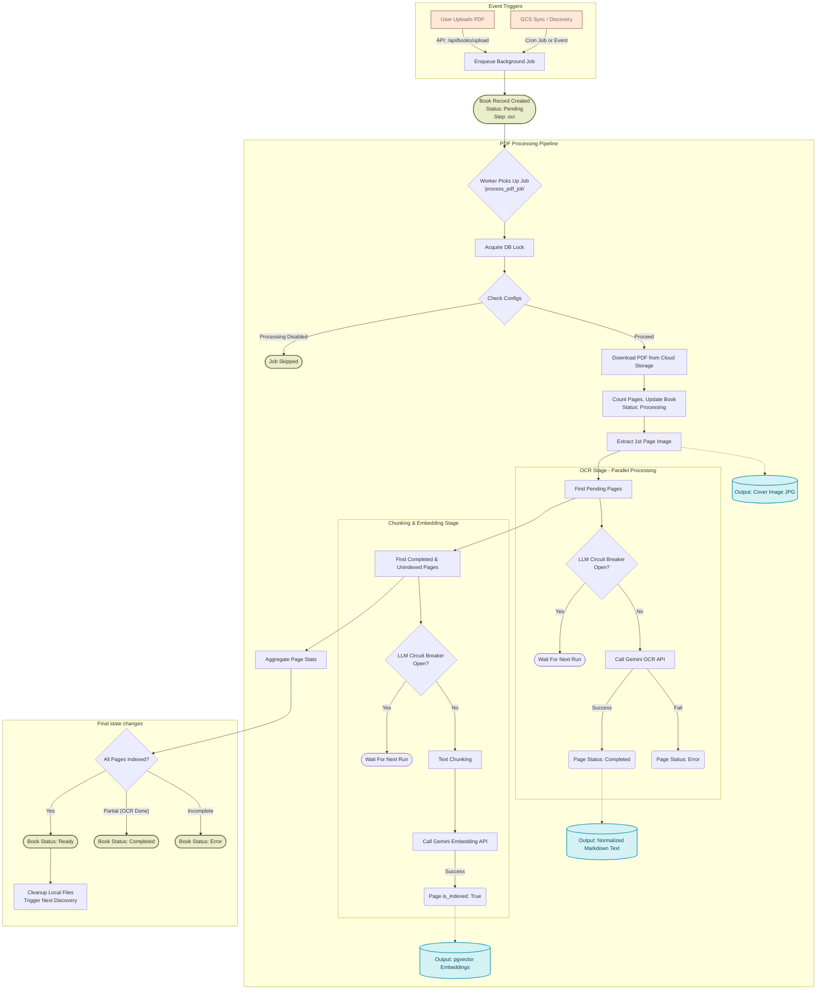

# Book Processing Pipeline Diagram

Here is a visual representation of the book processing pipeline, including triggers, milestone changes, and outputs.

```mermaid
flowchart TD
    %% Triggers
    subgraph Triggers [Event Triggers]
        T1[User Uploads PDF] --> |API: /api/books/upload| Enqueue
        T2[GCS Sync / Discovery] --> |Cron Job or Event| Enqueue
    end

    %% Initialization Stage
    Enqueue[Enqueue Background Job]
    Enqueue --> InitDB([Book Record Created\nStatus: Pending\nStep: ocr])

    %% Job Execution
    InitDB --> WorkerStart{Worker Picks Up Job\n'process_pdf_job'}

    subgraph PDF Processing Pipeline [PDF Processing Pipeline]
        WorkerStart --> Lock[Acquire DB Lock]
        
        Lock --> VerifySettings{Check Configs}
        VerifySettings -- Processing Disabled --> Skipped([Job Skipped])
        VerifySettings -- Proceed --> DownloadCloud[Download PDF from Cloud Storage]
        
        DownloadCloud --> ExtractMeta[Count Pages, Update Book\nStatus: Processing]
        
        ExtractMeta --> CoverExtract[Extract 1st Page Image]
        CoverExtract -.-> OutputCover[(Output: Cover Image JPG)]
        
        %% OCR Stage
        CoverExtract --> OCR_Loop
        subgraph OCR [OCR Stage - Parallel Processing]
            OCR_Loop[Find Pending Pages] --> OCR_Call{LLM Circuit Breaker\nOpen?}
            OCR_Call -- Yes --> AbortOCR([Wait For Next Run])
            OCR_Call -- No --> OCR_Process[Call Gemini OCR API]
            
            OCR_Process -- Success --> PageComplete(Page Status: Completed)
            OCR_Process -- Fail --> PageError(Page Status: Error)
        end
        PageComplete -.-> OutputText[(Output: Normalized Markdown Text)]
        
        %% Embedding Stage
        OCR_Loop --> Embed_Loop
        subgraph Embedding [Chunking & Embedding Stage]
            Embed_Loop[Find Completed & Unindexed Pages]
            Embed_Loop --> Embed_Call{LLM Circuit Breaker\nOpen?}
            Embed_Call -- Yes --> AbortEmbed([Wait For Next Run])
            Embed_Call -- No --> Chunk[Text Chunking]
            Chunk --> EmbedText[Call Gemini Embedding API]
            
            EmbedText -- Success --> ChunkComplete(Page is_indexed: True)
        end
        ChunkComplete -.-> OutputVector[(Output: pgvector Embeddings)]
        
        %% Finalization
        Embed_Loop --> FinalCheck[Aggregate Page Stats]
    end

    %% Milestones / Final State
    subgraph Final State Milestones [Final state changes]
        FinalCheck --> StatusCheck{All Pages Indexed?}
        StatusCheck -- Yes --> Ready([Book Status: Ready])
        StatusCheck -- Partial (OCR Done) --> Completed([Book Status: Completed])
        StatusCheck -- Incomplete --> Error([Book Status: Error])

        Ready --> Cleanup[Cleanup Local Files\nTrigger Next Discovery]
    end
    
    classDef output fill:#d4f1f4,stroke:#189ab4,stroke-width:2px,color:#05445E;
    classDef trigger fill:#ffe8d6,stroke:#b5838d,stroke-width:2px,color:#6d6875;
    classDef state fill:#e9edc9,stroke:#606c38,stroke-width:2px;

    class OutputCover,OutputText,OutputVector output;
    class T1,T2 trigger;
    class InitDB,Ready,Completed,Error,Skipped state;
```
