# Book Processing Pipeline Diagram

Here is a visual representation of the book processing pipeline, including triggers, milestone changes, and outputs. The pipeline now utilizes the **Gemini Batch API** for high-throughput, cost-effective processing.

## Overview

The pipeline processes PDF books through several asynchronous stages:
1.  **Batch Submission**: Pending work (OCR or Embeddings) is collected into JSONL files and submitted to Gemini.
2.  **Polling & Processing**: The system polls Gemini for job completion and applies results back to the database.
3.  **Local Orchestration**: The system handles chunking and finalization between batch stages.

## Pipeline Diagram

```mermaid
flowchart TD
    %% Triggers
    subgraph Triggers [Event Triggers]
        T1[User Uploads PDF<br/>POST /api/books/upload] --> |Creates Book Record| InitDB
        T2[GCS Discovery Sync<br/>Scheduled/Manual] --> |Discovers New Books| InitDB
    end

    %% Initialization Stage
    InitDB([Book Created<br/>status: pending<br/>All pages: pending])

    %% Batch OCR Submission
    subgraph OCR_Submission [Phase 1: OCR Batch Submission]
        S1[Check 'pending' Pages] --> S2{Pages Found?}
        S2 --> |Yes| S3[Download PDF from GCS]
        S3 --> S4[Upload PDF to Gemini File API]
        S4 --> S5[Generate JSONL with Page References]
        S5 --> S6[Submit Gemini Batch Job]
        S6 --> S7[Update Page Status<br/>ocr_processing]
        S7 --> S8[Store Batch Metadata<br/>batch_jobs / batch_requests]
    end
    InitDB --> S1

    %% Polling & Results
    subgraph Polling_Cycle [Phase 2: Polling & Result Application]
        P1[Poll Active Batch Jobs] --> P2{Job SUCCEEDED?}
        P2 --> |Yes| P3[Download JSONL Output]
        P3 --> P4[Map Results to Database]
        
        %% OCR Result handling
        P4 --> |OCR Type| P5[Update Pages<br/>status: ocr_done<br/>text: extracted_text]
        
        %% Embedding Result handling
        P4 --> |Embed Type| P6[Update Chunks<br/>embedding: vector_data]
    end
    S8 -.-> P1

    %% Local Chunking (Orchestration)
    subgraph Local_Processing [Phase 3: Local Orchestration]
        C1[Find 'ocr_done' Pages] --> C2[Strip Markdown & Clean Text]
        C2 --> C3[Semantic Chunking<br/>RecursiveCharacterTextSplitter]
        C3 --> C4[Save Chunks to DB]
        C4 --> C5[Update Page Status<br/>chunked]
    end
    P5 --> C1

    %% Batch Embedding Submission
    subgraph Embed_Submission [Phase 4: Embedding Batch Submission]
        E1[Collect Chunks with NULL Embedding] --> E2[Generate JSONL for Embedding Batch]
        E2 --> E3[Submit Gemini Embedding Job]
        E3 --> E4[Track Batch Metadata]
    end
    C5 --> E1
    E4 -.-> P1

    %% Finalization
    subgraph Finalization [Phase 5: Finalization]
        F1[Find 'chunked' Pages] --> F2{All chunks embedded?}
        F2 --> |Yes| F3[Update Page Status<br/>indexed]
        F3 --> F4[Aggregate Book Progress]
        F4 --> F5{All Pages Indexed?}
        F5 --> |Yes| Ready([Book Status: ready])
    end
    P6 --> F1

    classDef output fill:#d4f1f4,stroke:#189ab4,stroke-width:2px,color:#05445E;
    classDef trigger fill:#ffe8d6,stroke:#b5838d,stroke-width:2px,color:#6d6875;
    classDef state fill:#e9edc9,stroke:#606c38,stroke-width:2px;
    classDef error fill:#ffcccb,stroke:#d32f2f,stroke-width:2px;
    classDef cloud fill:#f1f1f1,stroke:#333,stroke-dasharray: 5 5;

    class Ready state;
    class T1,T2 trigger;
    class InitDB state;
    class OCR_Submission,Embed_Submission,Polling_Cycle cloud;
```

## Status Flow

### Book Statuses
- `pending` → Initial state; pages await OCR batching.
- `ocr_processing` → Pages have been submitted to Gemini for OCR.
- `ocr_done` → OCR results applied; awaiting local chunking.
- `chunked` → Pages chunked; awaiting embedding batching.
- `indexing` → (Legacy/Internal) Now represents embedding processing.
- `ready` → Fully processed and searchable.

### Page Statuses
- `pending` → Created but not batched.
- `ocr_processing` → Submitted to Gemini Batch API for OCR.
- `ocr_done` → OCR Complete; results stored in database.
- `chunked` → Text cleaned and split into chunks; awaiting embeddings.
- `indexed` → All chunks for this page have embeddings.

## Key Components

### Gemini Batch API Integration
- **Direct PDF References**: PDFs are uploaded once to the Gemini File API. Individual page extraction is handled by Gemini via URI references in the batch JSONL.
- **Cost Efficiency**: Batch jobs run at a 50% discount and do not count against rate limits for interactive usage.
- **Polling Loop**: A background process checks `batch_jobs` every few minutes to download and apply results.

### Storage Usage
- **Google Cloud Storage**: Persistent source for PDF files and processed covers.
- **Gemini File API**: Transient storage for PDFs and JSONL request files (deleted after job completion).
- **PostgreSQL**: Stores metadata, page text, and `pgvector` embeddings.

### Background Orchestration
- **ARQ Worker**: Periodically triggers the submission and polling cycles.
- **Idempotency**: The system tracks `remote_job_id` and `custom_id` to ensure results are only applied once and no work is duplicated.
