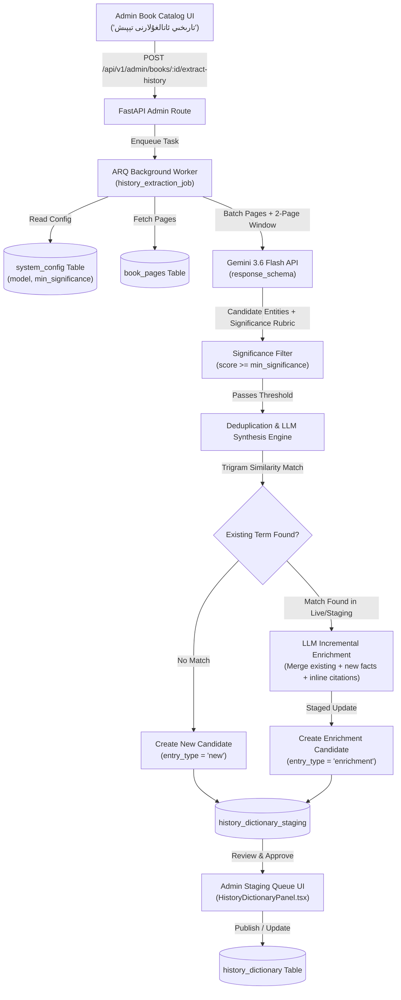

# Design Spec: Uyghur History Dictionary Extraction from Books

- **Date**: 2026-08-02
- **Topic**: Extracting Uyghur historical figures, events, dynasties, and concepts from catalog books to populate and enrich `history_dictionary`
- **Model**: Configurable via `system_config` (default: Gemini 3.6 Flash / `gemini-2.5-flash`)
- **UI Action Label**: `تارىخىي ئاتالغۇلارنى تېپىش`

---

## 1. Overview & Objectives

Currently, the `history_dictionary` table primarily contains translated world history entries but lacks specific Uyghur historical content. Kitabim-AI has a rich catalog of digitized history books.

This design introduces an on-demand, semi-automated extraction and enrichment pipeline:
1. Admins trigger **"تارىخىي ئاتالغۇلارنى تېپىش"** (Find Historical Terms) on any book in the Admin Book Catalog.
2. An ARQ background worker scans the book using Gemini Flash (or configured model from `system_config`), evaluating entities across 4 categories:
   - **Figures** (`شەخسلەر`)
   - **Events** (`ۋەقە-ھادىسىلەر`)
   - **Dynasties & Regimes** (`خانلىقلار`)
   - **Concepts & Places** (`ئاتالغۇ-جاي-ئورۇنلار`)
3. Candidates are filtered against a 4-tier historical significance rubric (default threshold $\ge 5/10$).
4. Duplicate entries found across multiple books or existing records in `history_dictionary` are automatically merged using **LLM Incremental Enrichment**:
   - Gemini synthesizes an updated definition with **Inline Footnote Citations** (e.g. `[1]`, `[2]`) pointing to exact books and pages, appending new source metadata (`sources` JSONB array).
5. Candidates & Enriched updates are written to a `history_dictionary_staging` table (marked with `is_ai_generated = true` and `entry_type = 'new'` or `'enrichment'`) for admin review, editing, and single/bulk approval in the Admin Panel before going live.

---

## 2. Architecture & Data Flow



---

## 3. Detailed Data Models & Multi-Book Citation Schema

### 3.1 Migration: Enhance `public.history_dictionary`
Add the following columns to `public.history_dictionary`:
```sql
ALTER TABLE public.history_dictionary
    ADD COLUMN IF NOT EXISTS category VARCHAR(30) DEFAULT 'general',
    ADD COLUMN IF NOT EXISTS significance_score INTEGER DEFAULT 5,
    ADD COLUMN IF NOT EXISTS is_ai_generated BOOLEAN NOT NULL DEFAULT FALSE,
    ADD COLUMN IF NOT EXISTS sources JSONB DEFAULT '[]'::jsonb;

CREATE INDEX IF NOT EXISTS idx_history_dictionary_category ON public.history_dictionary(category);
CREATE INDEX IF NOT EXISTS idx_history_dictionary_ai_gen ON public.history_dictionary(is_ai_generated);
```

### 3.2 Migration: Create `public.history_dictionary_staging`
```sql
CREATE TABLE IF NOT EXISTS public.history_dictionary_staging (
    id                     SERIAL PRIMARY KEY,
    existing_dictionary_id INTEGER REFERENCES public.history_dictionary(id) ON DELETE SET NULL,
    book_id                VARCHAR(64) NOT NULL,
    term                   VARCHAR(500) NOT NULL,
    transliteration        TEXT,
    definition             TEXT NOT NULL,
    original_definition    TEXT, -- Stashed existing definition for side-by-side diff
    category               VARCHAR(30) NOT NULL DEFAULT 'general',
    significance_score     INTEGER NOT NULL DEFAULT 5,
    significance_reason    TEXT, -- LLM rationale for significance rating
    is_ai_generated        BOOLEAN NOT NULL DEFAULT TRUE,
    entry_type             VARCHAR(20) NOT NULL DEFAULT 'new', -- 'new' or 'enrichment'
    letter_group           VARCHAR(10) NOT NULL,
    sources                JSONB NOT NULL DEFAULT '[]'::jsonb,
    status                 VARCHAR(20) NOT NULL DEFAULT 'pending',
    created_at             TIMESTAMPTZ NOT NULL DEFAULT NOW(),
    updated_at             TIMESTAMPTZ NOT NULL DEFAULT NOW()
);

CREATE INDEX IF NOT EXISTS idx_history_staging_term ON public.history_dictionary_staging(term);
CREATE INDEX IF NOT EXISTS idx_history_staging_status ON public.history_dictionary_staging(status);
CREATE INDEX IF NOT EXISTS idx_history_staging_entry_type ON public.history_dictionary_staging(entry_type);
```

### 3.3 Multi-Book Citation JSONB Structure (`sources`)
```json
[
  {
    "id": 1,
    "book_id": "book-uyghur-history-v2",
    "book_title": "ئۇيغۇر ئومۇمىي تارىخى",
    "volume": 2,
    "pages": [45, 46, 47],
    "extracted_at": "2026-08-02T14:50:00Z"
  },
  {
    "id": 2,
    "book_id": "book-karakhanid-history",
    "book_title": "قاراخانىيلار خانلىقى تارىخى",
    "volume": 1,
    "pages": [102, 108],
    "extracted_at": "2026-08-02T15:10:00Z"
  }
]
```

---

## 4. Historical Significance Evaluation & Extraction Pipeline

### 4.1 Four-Tier Historical Significance Rubric
To guarantee that extracted records are historically significant and not incidental mentions (e.g. a unnamed messenger or single-phrase comment), Gemini evaluates candidates against a strict rubric:

| Score Range | Significance Level | Evaluation Criteria | Action |
| :--- | :--- | :--- | :--- |
| **9 – 10** | **Central Historical Entity** | Major rulers, kings/sultans, pivotal wars/battles, famous authors, central dynasties (e.g. *Sultan Sutuk Bughra Khan*, *Kutadgu Bilig*). | ✅ Automatically Extracted |
| **7 – 8** | **High Significance** | Key generals, regional rulers, major historical cities/fortresses, treaties, key cultural/religious movements. | ✅ Automatically Extracted |
| **5 – 6** | **Standard Significance** | Verifiable secondary historical figures or localized events with documented dates and biographical contributions. | ✅ Extracted (Subject to `min_significance` config) |
| **1 – 4** | **Incidental / Minor** | Unnamed messengers, single-sentence mentions, generic titles, minor characters without historical impact. | ❌ Automatically Filtered Out |

Gemini outputs a `significance_score` (1–10) and a `significance_reason` string explaining the score.

### 4.2 System Configuration Keys (`system_config`)
- `history_extraction_model`: Default `'gemini-2.5-flash'` (or `'gemini-1.5-flash'`).
- `history_extraction_min_significance`: Default `'5'` (Entities with score $< 5$ are automatically dropped).
- `history_extraction_batch_pages`: Default `'15'`.

### 4.3 Split-Page Handling & LLM Incremental Enrichment
1. **Continuous Batching with Overlap**:
   - Reads pages in 15-page blocks with a 2-page sliding overlap window to handle cross-page split narratives.
2. **Incremental Enrichment Logic**:
   - When a term candidate is extracted and passes `significance_score >= min_significance`, the service checks both `history_dictionary_staging` and published `history_dictionary` using normalized trigram similarity (`similarity > 0.85`).
   - If an existing record is matched:
     - Gemini synthesizes an enriched definition with inline citations (`[1]`, `[2]`) corresponding to each source book.
     - Creates/updates an entry in `history_dictionary_staging` with `entry_type = 'enrichment'`, preserving `existing_dictionary_id` and storing `original_definition`.

### 4.4 Admin API Routes (`services/backend/app/routes/admin/history_dictionary.py`)
- `POST /api/v1/admin/books/{book_id}/extract-history`: Enqueue ARQ task.
- `GET /api/v1/admin/history-dictionary/staging`: List pending candidates with filters (`category`, `entry_type`, `is_ai_generated`, `significance`).
- `POST /api/v1/admin/history-dictionary/staging/{id}/approve`: Apply candidate.
- `POST /api/v1/admin/history-dictionary/staging/bulk-approve`: Approve multiple selected IDs.
- `DELETE /api/v1/admin/history-dictionary/staging/{id}`: Reject staging item.

---

## 5. Admin & User UI Design

### 5.1 Book Catalog Action
- Button Label: **"تارىخىي ئاتالغۇلارنى تېپىش"**
- Modal shows book details, dynamic `system_config` model name, and a **Significance Threshold Slider** (default: 5).

### 5.2 Admin Staging Queue (`HistoryDictionaryPanel.tsx`)
- **Location**: `apps/frontend/src/components/admin/dictionary/HistoryDictionaryPanel.tsx`
- **Tab 1 (Staging Queue)**:
  - Table Columns: Term, Transliteration/Dates, Category Badge, Type Badge (`🆕 New` vs `✨ Enrichment`), **Significance Score Badge (with hover tooltip displaying `significance_reason`)**, `🤖 AI Extraction` Badge, Enriched Definition (with inline footnotes `[1]`, `[2]`), Sources, Actions.
  - Actions: **Approve (تەستىقلاش)**, **Edit & Approve (تەھرىرلەپ تەستىقلاش)**, **Reject (رەت قىلىش)**.
  - Bulk approval support.
- **Tab 2 (Published Terms)**: Search and edit live entries in `history_dictionary`.

### 5.3 Public Search View with Interactive Footnotes
- Footnotes `[1]`, `[2]` in definition text are clickable badges that jump to the source citation card and highlight the **"بەتنى ئوقۇش / Read Page"** button.

---

## 6. Verification Plan

### Automated Verification
1. Migration test: Verify `history_dictionary_staging` schema includes `significance_reason`, `existing_dictionary_id`, `entry_type`, and `original_definition`.
2. Significance filtering test: Unit test verifying that candidates with score $< min\_significance$ are dropped automatically.
3. Backend enrichment test: Unit test verifying that extracting new facts for an existing term creates an `enrichment` candidate with inline citations `[1]`, `[2]` and combined sources.

### Manual Verification
1. Run **"تارىخىي ئاتالغۇلارنى تېپىش"** on Book 1 with threshold set to 5.
2. Inspect Staging Queue: verify that minor incidental mentions are excluded, and each candidate has a clear significance score (e.g. 8/10) and explanation tooltip.
3. Approve candidates and verify public search functionality.
