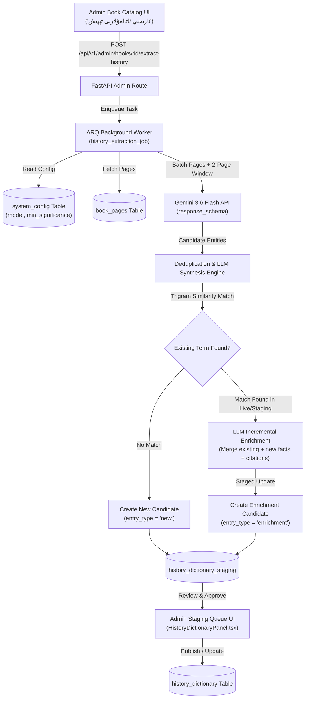

# Design Spec: Uyghur History Dictionary Extraction from Books

- **Date**: 2026-08-02
- **Topic**: Extracting Uyghur historical figures, events, dynasties, and concepts from catalog books to populate and enrich `history_dictionary`
- **Model**: Configurable via `system_config` (default: Gemini 3.6 Flash / `gemini-2.5-flash`)
- **UI Action Label**: `تارىخىي ئاتالغۇلارنى تېپىش`

---

## 1. Overview & Objectives

Currently, the `history_dictionary` table primarily contains translated world history entries but lacks specific Uyghur historical content. Kitabim-AI has a rich catalog of digitized history books.

This design introduces an on-demand, semi-automated extraction and enrichment pipeline:
1. Admins trigger **"تارىخىي ئاتالغۇلارنى تېپىش"** (Find Historical Terms) on any book in the Admin Book Catalog.
2. An ARQ background worker scans the book using Gemini Flash (or configured model from `system_config`), evaluating entities across 4 categories:
   - **Figures** (`شەخسلەر`)
   - **Events** (`ۋەقە-ھادىسىلەر`)
   - **Dynasties & Regimes** (`خانلىقلار`)
   - **Concepts & Places** (`ئاتالغۇ-جاي-ئورۇنلار`)
3. Candidates are filtered for historical significance (default $\ge 5/10$).
4. Duplicate entries found across multiple books or existing records in `history_dictionary` are automatically merged using **LLM Incremental Enrichment**:
   - If new facts/details are discovered for an existing entry (whether already published or in staging), Gemini synthesizes an updated enriched definition and appends new source citations (`sources` JSONB array).
5. Candidates & Enriched updates are written to a `history_dictionary_staging` table (marked with `is_ai_generated = true` and `entry_type = 'new'` or `'enrichment'`) for admin review, editing, and single/bulk approval in the Admin Panel before going live.

---

## 2. Architecture & Data Flow



---

## 3. Detailed Data Models & Migrations

### 3.1 Migration: Enhance `public.history_dictionary`
Add the following columns to `public.history_dictionary`:
```sql
ALTER TABLE public.history_dictionary
    ADD COLUMN IF NOT EXISTS category VARCHAR(30) DEFAULT 'general',
    ADD COLUMN IF NOT EXISTS significance_score INTEGER DEFAULT 5,
    ADD COLUMN IF NOT EXISTS is_ai_generated BOOLEAN NOT NULL DEFAULT FALSE,
    ADD COLUMN IF NOT EXISTS sources JSONB DEFAULT '[]'::jsonb;

CREATE INDEX IF NOT EXISTS idx_history_dictionary_category ON public.history_dictionary(category);
CREATE INDEX IF NOT EXISTS idx_history_dictionary_ai_gen ON public.history_dictionary(is_ai_generated);
```

### 3.2 Migration: Create `public.history_dictionary_staging`
```sql
CREATE TABLE IF NOT EXISTS public.history_dictionary_staging (
    id                     SERIAL PRIMARY KEY,
    existing_dictionary_id INTEGER REFERENCES public.history_dictionary(id) ON DELETE SET NULL,
    book_id                VARCHAR(64) NOT NULL,
    term                   VARCHAR(500) NOT NULL,
    transliteration        TEXT,
    definition             TEXT NOT NULL,
    original_definition    TEXT, -- Stashed existing definition for side-by-side diff
    category               VARCHAR(30) NOT NULL DEFAULT 'general',
    significance_score     INTEGER NOT NULL DEFAULT 5,
    is_ai_generated        BOOLEAN NOT NULL DEFAULT TRUE,
    entry_type             VARCHAR(20) NOT NULL DEFAULT 'new', -- 'new' or 'enrichment'
    letter_group           VARCHAR(10) NOT NULL,
    sources                JSONB NOT NULL DEFAULT '[]'::jsonb,
    status                 VARCHAR(20) NOT NULL DEFAULT 'pending',
    created_at             TIMESTAMPTZ NOT NULL DEFAULT NOW(),
    updated_at             TIMESTAMPTZ NOT NULL DEFAULT NOW()
);

CREATE INDEX IF NOT EXISTS idx_history_staging_term ON public.history_dictionary_staging(term);
CREATE INDEX IF NOT EXISTS idx_history_staging_status ON public.history_dictionary_staging(status);
CREATE INDEX IF NOT EXISTS idx_history_staging_entry_type ON public.history_dictionary_staging(entry_type);
```

---

## 4. Backend Extraction & Incremental Enrichment Pipeline

### 4.1 System Configuration Keys (`system_config`)
The pipeline reads the following dynamic settings from `system_config`:
- `history_extraction_model`: Default `'gemini-2.5-flash'` (or `'gemini-1.5-flash'`).
- `history_extraction_min_significance`: Default `'5'`.
- `history_extraction_batch_pages`: Default `'15'`.

### 4.2 Split-Page Handling & LLM Incremental Enrichment
1. **Continuous Batching with Overlap**:
   - Reads pages in 15-page blocks with a 2-page sliding overlap window to handle cross-page split narratives.
2. **Incremental Enrichment Logic**:
   - When a term candidate is extracted, the service checks both `history_dictionary_staging` and published `history_dictionary` using normalized trigram similarity (`similarity > 0.85`).
   - If an existing record is matched:
     - The service prompts Gemini Flash with the existing definition + the newly discovered facts from the new book page chunks:
       > *"You are given an existing historical definition and new source text from another book. Integrate any new facts, dates, or details into the existing definition without losing existing correct information. Output a comprehensive enriched definition."*
     - Consolidates source citations (`sources` JSONB array).
     - Creates/updates an entry in `history_dictionary_staging` with `entry_type = 'enrichment'`, preserving `existing_dictionary_id` and storing `original_definition` for admin diff comparison.

### 4.3 Admin API Routes (`services/backend/app/routes/admin/history_dictionary.py`)
- `POST /api/v1/admin/books/{book_id}/extract-history`: Enqueue ARQ task.
- `GET /api/v1/admin/history-dictionary/staging`: List pending candidates with filters (`category`, `entry_type`, `is_ai_generated`, `significance`).
- `POST /api/v1/admin/history-dictionary/staging/{id}/approve`: Apply candidate. For `entry_type = 'enrichment'`, updates the existing `history_dictionary` row with the enriched definition, merged sources, and sets `is_ai_generated = true`.
- `POST /api/v1/admin/history-dictionary/staging/bulk-approve`: Approve multiple selected IDs.
- `DELETE /api/v1/admin/history-dictionary/staging/{id}`: Reject staging item.

---

## 5. Admin Frontend UI Design

### 5.1 Book Catalog Action
- Button Label: **"تارىخىي ئاتالغۇلارنى تېپىش"**
- Opens confirmation modal showing target book title, dynamic `system_config` model name, and significance slider.

### 5.2 Admin Staging Queue (`HistoryDictionaryPanel.tsx`)
- **Location**: `apps/frontend/src/components/admin/dictionary/HistoryDictionaryPanel.tsx`
- **Tab 1 (Staging Queue)**:
  - Table Columns: Term (تارىخىي ئاتالغۇ), Transliteration/Dates, Category Badge, Type Badge (`🆕 New` vs `✨ Enrichment`), Significance Badge (1–10), `🤖 AI Extraction` Badge, Enriched Definition, Sources, Actions.
  - **Diff Modal**: For `✨ Enrichment` candidates, clicking "View Diff (تەققىقلاش)" displays a side-by-side text diff of the original definition vs. the proposed enriched definition.
  - Actions: **Approve (تەستىقلاش)**, **Edit & Approve (تەھرىرلەپ تەستىقلاش)**, **Reject (رەت قىلىش)**.
  - Bulk approval support.
- **Tab 2 (Published Terms)**: Search and edit live entries in `history_dictionary`, displaying `is_ai_generated` badges and full source citations.

---

## 6. Verification Plan

### Automated Verification
1. Migration test: Verify `history_dictionary_staging` schema includes `existing_dictionary_id`, `entry_type`, and `original_definition`.
2. Backend enrichment test: Unit test for `history_extraction_service.py` verifying that extracting new facts for an existing term creates an `enrichment` candidate with combined sources and synthesized definition.
3. Approval test: Test that approving an enrichment candidate updates the corresponding live `history_dictionary` row.

### Manual Verification
1. Run **"تارىخىي ئاتالغۇلارنى تېپىش"** on Book 1. Approve term X.
2. Run **"تارىخىي ئاتالغۇلارنى تېپىش"** on Book 2 (which contains additional facts about term X).
3. Verify term X appears in Staging Queue marked as `✨ Enrichment Candidate`. Open the Diff view to inspect added facts and new citations.
4. Approve the enrichment; verify the published term X in `history_dictionary` now contains the unified enriched definition and multi-book sources.
