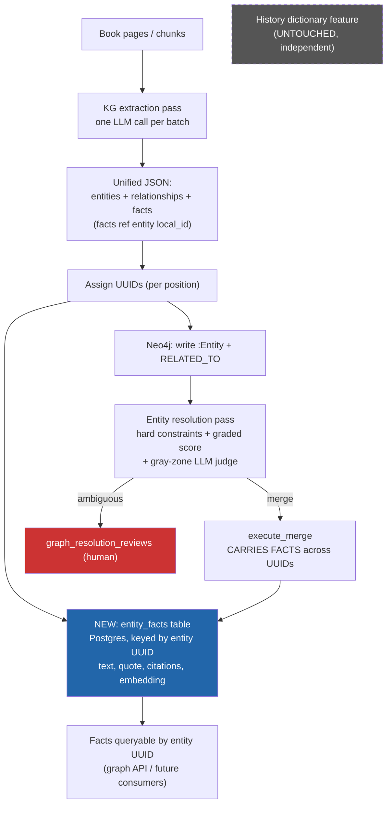

# Knowledge-Graph Fact Extraction - High-Level Design

**Status:** Draft / proposal  
**Date:** 2026-08-06  
**Branch:** `feature/chunking-strategy-change`

---

## 1. Summary

The knowledge-graph extraction pass (`services/worker/jobs/knowledge_graph_job.py`) already scans every book with an LLM to emit `:Entity` nodes + `RELATED_TO` edges into Neo4j. This design **extends that same scan to also emit atomic facts per entity**, stored in a **new Postgres table keyed by the entity's stable UUID** (with optional embeddings for dedup).

Because the graph is the identity anchor, facts are automatically **associated to the correct entity** and inherit the graph's **disambiguation** (the existing resolution pass) - rather than being matched by a name string.

> **Explicitly out of scope - untouched:** the existing history term extraction feature stays exactly as it is: `packages/backend-core/app/services/history_extraction_service.py`, `batch_history_extraction_service.py`, `history_dictionary`, `history_dictionary_staging`, the `extract_book_history_terms_task` job, and all history admin endpoints / UI. Converging or retiring it is deferred to a later, separate effort.

---

## Decisions (locked 2026-08-06)

- **Edge `evidence` replaced** by references to justifying fact(s); **`context_summary` derived** (short synthesis of facts). This intentionally changes the graph edge schema, the graph visualization API, and the `GraphView` UI.
- **Entity scope: `Person` + `Event` only** for the first cut.
- **No fact staging table.** Facts are written directly (like edges); admins get **CRUD to edit / correct** facts, but there is no pending-review queue for fact content. Identity review stays in `graph_resolution_reviews`.
- **Batch/window size is configurable** (a `system_configs` value); tuned later, not hardcoded.
- **Modify the existing `knowledge_graph_job`** - single pipeline, no parallel copy.
- **Recreate the whole graph from scratch** as part of rollout (facts populated in the same pass).
- **Embedding storage still open** (JSON + Python cosine vs `pgvector`).

## Decisions (locked 2026-08-08)

- **Book regeneration must clean up that book's facts, but scoped by citation, not by entity.** `knowledge_graph_job` calls `delete_book_graph(book_id)` unconditionally at the start of every run (first pass and every reprocess) - see §6a. Because an entity's facts can carry citations from more than one book (post-resolution merge), a blanket "delete all facts for this entity" would destroy evidence still supported by other, untouched books. The correct cleanup prunes just this book's entry out of each fact's `citations` array, deleting the fact only if `citations` becomes empty.
- **`entity_facts` writes are decoupled from the Neo4j entity/edge write and fail per-entity, not per-book.** The existing bulk write (`upsert_entities_bulk` + `connect_entities_bulk`) is a Python-level try/except around two independent auto-commit Neo4j calls - not true cross-call atomicity - adopted purely for round-trip performance (see §6b), not as a consistency guarantee. Fact writes/3-tier merge inherit that same tolerance for partial state: one entity's fact-merge failure is logged and skipped, and never fails the book's `graph_milestone` or blocks entities/edges that already wrote successfully.
- **Admin surface includes a Conflicts card**, not just generic fact CRUD - see §6c.
- **Embedding storage: `pgvector`, not JSON** - matches the existing `chunks`/`book_summaries` pattern and supports a concrete future use case (cross-entity fact similarity as a duplicate-entity-discovery signal) without a later migration. See §6.
- **`justifying_fact_ids` is best-effort** - not every edge maps to a fact, since facts are `Person`/`Event`-only but edges connect any entity type. `GraphView` needs an explicit no-evidence fallback. See §6 (Neo4j `RELATED_TO`).
- **Fact deletion cascades and warns** - deleting a fact strips its ID from any referencing edge; the admin is warned first if the fact is still in use. See §6d.

---

## 2. Motivation

- **Facts for (almost) free** - the KG scan happens anyway; adding facts costs only marginal *output* tokens, not a new input scan.
- **Association is native** - facts attach to the entity in the same call via the LLM's in-call `local_id` coreference; no cross-store join, no name matching.
- **Disambiguation is inherited** - facts hang off the resolved UUID, so two same-named people are separated by the graph resolver (`entity_resolution_service.py`: hard constraints + graded score + gray-zone LLM judge + human review), not by fuzzy name matching.
- **Collapses redundant "justification" fields** - edge `evidence` and entity `context_summary` overlap with facts. The atomic fact becomes the single unit of justification: `evidence` -> a reference to the justifying fact(s); `context_summary` -> a derived short synthesis.

> The larger win of eliminating a "second" full book scan only materializes if/when the history feature later converges onto this model - **out of scope here**.

---

## 3. Goals / Non-goals

### Goals
- Extend KG extraction to emit **atomic facts per `Person` / `Event` entity** in the same LLM call.
- Store facts in a **new table keyed by entity UUID**, with cached embeddings.
- **Replace edge `evidence` with references to justifying facts; derive `context_summary` from facts.**
- Reuse graph identity + resolution for association and disambiguation.
- Dedup facts within an entity via a **3-tier merge** (deterministic -> embedding -> LLM), mirroring the proven approach in `history_fact_utils.py`.
- **Admin CRUD to edit / correct facts** (no staging queue).

### Non-goals
- **No changes to the history dictionary feature** - its tables, services, jobs, endpoints, and UI stay exactly as they are.
  - No history -> graph association, no `kg_entity_id`, no history projection (deferred).
- **No fact staging / review workflow** - direct write + admin edit only.
- No new graph store; Neo4j keeps identity + relationships.
- No RAG retrieval-contract change at the API surface.

---

## 4. High-Level Architecture



### Principles
- **KG entity (UUID) is the identity anchor;** facts reference it by UUID.
- **Fact = the atomic unit of justification.** Edges reference `justifying_fact_ids`; `context_summary` becomes a derived short synthesis.
- **Merge carries facts** - folding entity B into A moves B's facts.
- **Facts dedup within a UUID** via the 3-tier merge (deterministic spelling -> embedding similarity -> LLM classify).
- **History feature stays independent and untouched.**

---

## 5. Unified Extraction Schema (shape)

One LLM call per batch emits:

```jsonc
{
  "entities": [
    { "local_id": "e1", "name": "...", "type": "Person",
      "significance_score": 6, "subtype": "Sultan" }
  ],
  "relationships": [
    { "source": "e1", "target": "e2", "rel_type": "SON_OF",
      "justifying_fact_local_ids": ["f1"], "pages": [40] }
  ],
  "facts": [
    { "local_id": "f1", "entity_local_id": "e1",
      "text": "X is the son of Ibrahim.",
      "quote": "he was the son of Ibrahim",   // verbatim - audit figurative vs literal
      "pages": [40] }
  ]
}
```

- `quote` absorbs the edge `evidence` role (verbatim span for figurative-kinship auditing).
- `context_summary` is **no longer extracted** - derived as a short synthesis of the entity's facts.
- Facts carry page citations (the same coordinate as edge `chunk_refs`).

---

## 6. Data Model Changes

### New table - `entity_facts` (Postgres)
| Column | Type | Notes |
|---|---|---|
| `id` | serial PK | |
| `entity_id` | UUID, indexed | The Neo4j `:Entity.id`; the association key |
| `text` | text | Normalized atomic fact |
| `quote` | text, null | Verbatim source span (absorbs edge `evidence`; for figurative/literal audit) |
| `citations` | JSONB | `[{"book_id", pages:[...]}]` |
| `status` | varchar | `'active'` / `'conflict'` |
| `conflict_group` | int, null | Groups conflicting facts for review |
| `embedding` | `Vector(768)`, null | Gemini `text-embedding-004`, same dimension as `chunks`/`book_summaries` |
| `created_at` / `updated_at` | timestamptz | |

Index on `entity_id` (fact lookup by entity). **GIN index on `citations` (required, not optional)** - the book-regeneration cleanup in §6a queries facts by `citations -> book_id`, and that query needs to be efficient, not a sequential scan.
- **Embedding storage: `pgvector`, not JSON.** Reverses the original draft's "mirror history's JSON approach" default. Two reasons: (1) `pgvector` is already the established pattern in this codebase for embeddings (`chunks`, `book_summaries` both use `Vector(768)`) - it's not new infrastructure. (2) There's a concrete future use case beyond in-entity dedup: **cross-entity fact similarity as an additional signal for duplicate-entity discovery** - two entities the name/neighbor/subtype resolver didn't merge might still be the same person if their facts are near-identical. Storing as `Vector(768)` from day one avoids a future migration to get there. Tier-2 in-entity dedup becomes a plain `.cosine_distance()` query, same pattern as chunk similarity search - actually simpler than pulling JSON into Python and calling `history_fact_utils.cosine_similarity` by hand. An `ivfflat` index is not needed yet (per-entity/cross-entity fact volume is small at launch) - add one if/when cross-entity search ships.

### 6a. Book regeneration cleanup (citation-scoped, not entity-scoped)

`knowledge_graph_job` calls `graph_repo.delete_book_graph(book_id)` unconditionally at the start of every run (`knowledge_graph_job.py:156`) - on first extraction and on every reprocess alike. That wipes the book's Neo4j entities/edges and rebuilds them with **fresh UUIDs**. Once `entity_facts` has data, every such reprocess would silently orphan that book's fact rows unless cleanup is wired in alongside it.

Because `entity_facts.citations` can reference multiple books for the same resolved entity, the cleanup cannot be "delete all facts belonging to entities that were in this book" - that would also delete facts still evidenced by other, untouched books. Instead, before (or as part of) the `delete_book_graph` step:

1. Query `entity_facts` where `citations` contains an entry with this `book_id` (the GIN index above makes this cheap).
2. For each matching fact, remove that book's entry from `citations`.
3. If `citations` is now empty, delete the fact. Otherwise, keep the fact (other books still support it) and re-run tier-1/2 dedup only if needed.

This is a self-contained Postgres operation - it does not need to enumerate the book's old Neo4j entity UUIDs first, since `citations` is the authoritative book association independent of the graph.

### 6b. Fact write failure isolation

The existing `knowledge_graph_job` entity/edge write is book-wide, not per-entity: results from every LLM batch accumulate into `all_entities`/`all_relations`, then get flushed in exactly two Neo4j round-trips (`upsert_entities_bulk`, `connect_entities_bulk`) inside one `try/except` (`knowledge_graph_job.py:383-397`). That pattern was chosen for round-trip performance (2 calls per book instead of 2×N batches), not as a deliberate atomicity guarantee - the two calls are independent auto-commit Neo4j sessions with no shared transaction, so a failure in `connect_entities_bulk` after `upsert_entities_bulk` already committed already leaves entities without relationships today. Recovery from the resulting `graph_milestone = "partial"` is a manual admin re-trigger (`graph_scanner.py` does not auto-retry `"partial"` books), not an automatic repair.

Fact writes should **not** inherit this coarse book-wide granularity. `entity_facts` writes (and the 3-tier merge) run **per entity**, decoupled from the Neo4j write: if one entity's fact write or dedup merge throws, log and skip just that entity's facts. It must never fail the whole book's `graph_milestone`, and must never roll back or block entities/edges that already wrote successfully. Facts are enrichment, not identity - losing them for one entity out of a batch shouldn't sacrifice the rest of the book, and this is consistent with the existing system's tolerance for partial graph state.

### 6c. Admin fact conflicts surface

Because there is no staging/review queue for fact content, `status = 'conflict'` / `conflict_group` need an operational surface or they're metadata nobody sees. Add a **Conflicts card to the admin `GraphView`**: count of `status='conflict'` facts (grouped by `conflict_group`, scoped per entity or per book), deep-linking into the fact edit view built in Phase 4. This reuses the fact CRUD rather than introducing a new review workflow.

### 6d. Fact deletion: cascade + confirm

Facts are referenced by edges via `justifying_fact_ids` (§6, Neo4j `RELATED_TO` below). Deleting a fact through the admin CRUD (§6c / Phase 4) without handling that reference leaves a **dangling ID** on any edge that cited it - the edge's derived evidence/`context_summary` would silently fail to resolve.

- **Cascade on delete:** when a fact is deleted, strip its ID from `justifying_fact_ids` on every `RELATED_TO` edge that references it (a fact is realistically referenced by at most a handful of edges - this is a small, bounded Cypher update, not a scan). The edge keeps whatever other justifying facts it has, or falls back to none (best-effort, per §6/Neo4j `RELATED_TO` below - no fact reference is ever required).
- **Warn before deleting:** the fact-delete endpoint/UI must tell the admin *before* deleting if the fact is currently referenced by any edge (e.g. "This fact is used as evidence for N relationship(s). Deleting it will remove it from their evidence. Continue?"). Facts with zero references delete immediately with no prompt. This requires the fact read/detail response to include (or a lightweight endpoint to check) which edges currently reference it.
- This makes fact deletion the first admin CRUD action in this design that reaches into Neo4j, not just Postgres - the delete endpoint isn't a pure Postgres operation.

### Neo4j `RELATED_TO`
- **Replace** the standalone `evidence` string with `justifying_fact_ids` (reference into `entity_facts`); keep `chunk_refs`. Clean replace - the graph is recreated from scratch, so no transitional dual write. The graph visualization API and `GraphView` derive the displayed evidence from the referenced fact(s).
- **`justifying_fact_ids` is best-effort, not mandatory.** Facts are only extracted for `Person`/`Event` entities (see Entity Scope below), but edges connect any entity types - e.g. a `BORN_IN` edge to a `Location` has no fact to reference. Requiring every edge to map to ≥1 fact isn't viable given that scoping. `GraphView` must have an explicit fallback for edges with an empty `justifying_fact_ids` list (show the relationship without an evidence/quote panel) rather than a blank or broken display.

### Entity `context_summary`
- **Derived**, not extracted - a short synthesis of the entity's facts. Stop emitting it from the extraction prompt.

### Entity Scope
- Extract facts **only for `Person` and `Event`** entities in the first cut. Other types (Location, Organization, ...) keep entities + edges but no facts for now.

### Admin fact editing (no staging)
- Facts are written directly (like edges) - **no staging / review table**. Provide admin **CRUD** endpoints to edit / correct / delete a fact on an entity. Identity-level review stays in `graph_resolution_reviews`.

### Configurable window
- The extraction batch/window size is a `system_configs` value (extend `kg_chunk_batch_size` or add a sibling), tunable without a code change.

### History dictionary tables
- **Unchanged.**

### Merge logic - keep history service untouched
- Reuse the **pure, no-I/O** helpers in `history_fact_utils.py` (deterministic similarity, cosine, citation merge) - these are standalone utilities, not history-service state.
- Implement the entity-fact merge in a **new module/service** for the KG path so `HistoryExtractionService` is **not modified**. (Optionally lift the shared 3-tier logic into a common util later - not required now.)

---

## 7. Disambiguation & Merge (reuse existing)

- Candidate lookup: `graph_repository.search_entities_fulltext`.
- Decision path: `check_hard_constraints` (parents / birthplace) -> `graded_score` (name 0.55 / neighbor 0.35 / subtype 0.10) -> gray zone -> `gray_zone_judge` -> `graph_resolution_reviews`.
- **Name alone can never auto-merge** (caps at 0.55 < 0.75 merge threshold) - property preserved.
- **`execute_merge` must carry facts:** when B folds into A, move B's `entity_facts` rows to A (re-point `entity_id`), keep the reversible `graph_merge_log` snapshot, and re-test unmerge.

---

## 8. Cost Analysis

| Dimension | Today (KG only) | With fact extraction | Effect |
|---|---|---|---|
| KG extraction **input** tokens | 1x scan | 1x scan (same) | = unchanged |
| KG extraction **output** tokens | entities + edges | entities + edges + facts | ↑ modest |
| Fact -> entity association | n/a | native (same call) | ↑ free |
| Redundant `evidence` / `context_summary` | extracted | referenced / derived | ↓ output |
| New `entity_facts` writes | - | small Postgres writes | ↑ small |
| Recreate graph + facts | full re-extraction from scratch (chosen) | | ↑ one-time (flagged) |
| History scan | separate, untouched | separate, untouched | = unchanged |

**Net:** facts are effectively a marginal add-on to a scan you already pay for. No reduction of the (separate, untouched) history scan in this phase - that saving is a future convergence.

---

## 9. Risks & Mitigations

| Risk | Mitigation |
|---|---|
| **Combined prompt degrades quality** (relationship + fact + significance in one call) | Structured output schema; eval set measuring edge recall *and* fact recall vs current KG prompt before cutover. |
| **Merge/split must carry facts** | Extend `execute_merge` + `graph_merge_log` snapshot to move `entity_facts`; re-test unmerge. |
| **Losing figurative/literal audit** (evidence removed) | Keep verbatim `quote` on facts (esp. kinship). |
| **Fact dedup needs embeddings** | Add `embedding` column; reuse tier-2 cosine from `history_fact_utils`. |
| **Accidentally touching the history feature** | New module for entity-fact merge; only reuse the *pure* utils; zero edits to `HistoryExtractionService`. |
| **Edge `evidence` -> fact refs changes the read path** | Coordinate the graph viz API + `GraphView` update with the schema change; derive displayed evidence from referenced facts; test the public feed. |
| **Full graph recreation** | Behind a flag; off-peak; snapshot/export the current graph first so it is restorable. |
| **Sparse entities -> more human review** | Accepted; safe direction (no silent merge). |
| **Book regeneration orphans `entity_facts`** - `delete_book_graph` runs on every reprocess, not just a one-time rollout event, and mints fresh entity UUIDs each time | Citation-scoped cleanup (§6a): prune this book's entry from `citations` on every affected fact, delete the fact only when `citations` is empty. Never a blanket entity-scoped delete. |
| **Fact write failure needs finer isolation than the existing book-wide Neo4j write** | Decouple `entity_facts` writes from the Neo4j write (§6b); one entity's fact/dedup failure is logged and skipped, never fails `graph_milestone` or blocks already-written entities/edges. |
| **Deleting a fact leaves a dangling `justifying_fact_ids` reference on edges that cited it** | Cascade-strip the fact ID from referencing edges on delete; warn the admin before deleting a fact that's still in use (§6d). |


## 10. Rollout Plan

1. **Prototype** the extended KG prompt (add `facts` + `quote`); run on a few books; measure edge + fact recall (no writes).
2. **New `entity_facts` table** (+ `embedding` column if doing embedding dedup).
3. **Wire fact write + 3-tier merge** into the KG job, keyed by entity UUID (new module).
4. **Extend `execute_merge`** to carry facts; re-test merge / split / unmerge.
5. **Recreate the graph from scratch** by re-running KG extraction behind a flag; verify entity/fact counts + citations.
6. **Surface** entity facts in the graph API / admin view (with fact edit CRUD).


## 11. Implementation Todo Checklist

### Phase 0 - Validation (no writes)
- [ ] Extend the KG extraction prompt to also emit `facts` (with `entity_local_id`, `text`, `quote`, `pages`) and `relationships.justifying_fact_local_ids`.
- [ ] Update the extraction schema/parser (`KnowledgeExtraction`) tolerantly for the new fields.
- [ ] Build an eval set; measure edge recall + fact recall vs the current KG prompt.
- [ ] Confirm batch/window granularity (KG currently chunk-batches ~5) - decide whether to enlarge for coreference.

### Phase 1 - Data model
- [ ] Migration: create `entity_facts` (UUID `entity_id`, `text`, `quote`, `citations`, `status`, `conflict_group`, `embedding Vector(768)`, timestamps) + index on `entity_id` + GIN on `citations`.
- [ ] Embedding storage: `pgvector` (`Vector(768)`, matching `chunks`/`book_summaries`) - decided, not JSON. Supports future cross-entity fact-similarity search for duplicate-entity discovery, not just in-entity dedup.
- [ ] Add `justifying_fact_ids` to `RELATED_TO`; **remove** standalone `evidence` (clean replace - graph recreated from scratch).
- [ ] Add a `system_configs` key for the extraction window size (configurable).

### Phase 2 - Extraction pipeline (modify existing KG job)
- [ ] Extend `knowledge_graph_job` (single pipeline - no parallel copy) to emit facts and write them to `entity_facts` attached to the entity UUID.
- [ ] Limit fact extraction to **`Person` + `Event`** entities.
- [ ] New entity-fact merge module implementing the 3-tier dedup (deterministic -> embedding -> LLM), **reusing only the pure utils** - no edits to `HistoryExtractionService`.
- [ ] Wire the configurable window size + a feature flag for fact extraction.
- [ ] **Citation-scoped fact cleanup on book regeneration** (§6a): wire into (or run alongside) `delete_book_graph(book_id)` so every reprocess - not just the Phase 5 rollout - prunes this book's citation entries from `entity_facts` and deletes facts left with zero citations.
- [ ] **Decouple fact writes from the Neo4j write** (§6b): per-entity try/except around fact write + dedup merge; failure logs and skips that entity's facts only, never fails `graph_milestone` or blocks entities/edges that already wrote.

### Phase 3 - Resolution & merge
- [ ] Extend `execute_merge` to move `entity_facts` from removed -> kept UUID.
- [ ] Update `graph_merge_log` snapshot + unmerge to restore facts.
- [ ] Re-test hard-constraint conflict (auto-split) and gray-zone -> review with facts present.

### Phase 4 - API / admin surface
- [ ] Read endpoint(s) to fetch an entity's facts by UUID.
- [ ] Graph API + `GraphView`: derive displayed edge evidence from `justifying_fact_ids`; update the public feed for the schema change.
- [ ] Admin **CRUD** endpoints to edit / correct / delete an entity's facts (no staging table).
- [ ] **Conflicts card in admin `GraphView`** (§6c): count of `status='conflict'` facts (grouped by `conflict_group`), deep-linking into the fact edit view - the operational surface for facts that need manual resolution.
- [ ] **Fact deletion: cascade + confirm** (§6d): deleting a fact strips its ID from any edge's `justifying_fact_ids`; the admin UI warns before deleting a fact that's currently referenced by any edge, with a no-prompt fast path when it isn't.

### Phase 5 - Recreate & docs
- [ ] Snapshot/export the current graph first (restorable), then **recreate the graph from scratch** behind the flag; verify counts/citations.
- [ ] Update `docs/main/KNOWLEDGE_GRAPH_DESIGN.md` with the fact model + `evidence` -> fact-ref change.

---

## 12. Open Questions

- **Window/batching strategy - chapter-aware vs. flat N-chunk:** proposal is to batch by book chapter (natural coreference unit) capped by a `system_configs` threshold - chapters under the threshold batch whole, chapters over it fall back to threshold-sized sub-batches. **Blocked on new schema the codebase doesn't have today**: chunking (`chunking_service.py`) detects heading blocks (markdown `#`/`##`, Uyghur "باب") to decide where to start a new chunk, but discards that signal after packing - no `chapter_index`/`heading` field exists on `Chunk`. Implementing this requires (1) persisting a `chapter_index` on `Chunk` from the already-detected heading blocks, and (2) `knowledge_graph_job` grouping by that field instead of flat-slicing `(page_number, chunk_index)` order. Still to decide: fold this into this design as a dependency (reasonable, given the branch is `feature/chunking-strategy-change`), or scope it as a separate prerequisite change? Either way, add "chapter-aware batching vs. flat window" recall comparison to the Phase 0 eval set - don't assume it's better without measuring.
- **Future convergence:** when/how the history feature later moves onto `entity_facts` - explicitly deferred, not a near-term decision (see §3 Non-goals).

### Resolved (2026-08-06)
- Edge `evidence` -> replaced by fact refs; `context_summary` -> derived.
- Entity scope -> `Person` + `Event` first.
- Fact curation -> direct write + admin CRUD, no staging table.
- Batch/window -> configurable.
- Pipeline -> modify existing `knowledge_graph_job`.
- Backfill -> recreate the whole graph from scratch.

### Resolved (2026-08-08)
- Book regeneration fact cleanup -> citation-scoped pruning (§6a), not entity-scoped delete; wired into every reprocess via `delete_book_graph`, not just the Phase 5 one-time rollout.
- Fact write failure isolation -> decoupled from the Neo4j write, fails per-entity (§6b); the existing book-wide bulk write was a performance choice, not an atomicity guarantee, so this doesn't break any existing consistency contract.
- Admin surface -> includes a Conflicts card (§6c), not just generic CRUD.
- Embedding storage -> `pgvector` (`Vector(768)`), matching `chunks`/`book_summaries`; motivated by a concrete future use case (cross-entity fact similarity for duplicate-entity discovery), not just in-entity dedup.
- `justifying_fact_ids` -> best-effort, never mandatory (facts are `Person`/`Event`-only, edges aren't).
- Fact deletion -> cascades (strips the ID from referencing edges) and warns the admin first if the fact is still in use (§6d).
