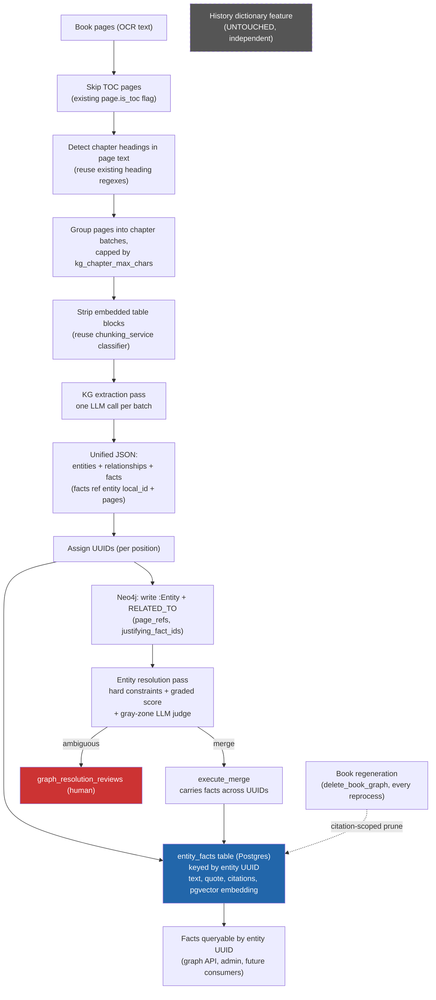

# Knowledge-Graph Fact Extraction - High-Level Design (v2)

**Status:** Draft / proposal
**Date:** 2026-08-08
**Branch:** `feature/chunking-strategy-change`
**Supersedes:** `KNOWLEDGE_GRAPH_FACT_EXTRACTION_DESIGN.md` (v1). The core proposal is unchanged - v1's design discussion surfaced a bigger structural change worth making at the same time: **the KG extraction unit moves from `Chunk` to `Page`.** See §1 for what changed and why.

---

## 1. Summary

The knowledge-graph extraction pass (`services/worker/jobs/knowledge_graph_job.py`) already scans every book with an LLM to emit `:Entity` nodes + `RELATED_TO` edges into Neo4j. This design **extends that same scan to also emit atomic facts per entity**, stored in a **new Postgres table keyed by the entity's stable UUID** (with `pgvector` embeddings for dedup).

Because the graph is the identity anchor, facts are automatically **associated to the correct entity** and inherit the graph's **disambiguation** (the existing resolution pass) - rather than being matched by a name string.

**What's new in v2, and why:** v1 kept the existing `Chunk`-based extraction unit (pre-cut, embedding-sized text pieces originally built for RAG retrieval) and treated "how do we batch by chapter for better coreference" as an open, awkward-to-retrofit question. Working through that question exposed that `Chunk` is the wrong unit for this job:

- Chunks carry ~200 characters of **engineered overlap** at non-heading boundaries (for retrieval continuity). KG batching slices chunks blindly (`chunks[i:i+5]`), so the same overlapping text can land in two different LLM extraction calls with no cross-batch dedup - the same real sentence can be extracted twice today, purely as pipeline noise the entity/fact resolvers then have to clean up.
- Chapter headings are a property of the OCR'd **page** text, not of how a page later got cut into chunks - chapter-aware batching is natural on `Page`, awkward on `Chunk`.
- Citations in the extraction schema are already page numbers (`"pages": [40]`), not chunk indices - `Page` is the citation's native unit.

Switching the extraction unit to `Page` removes the overlap-duplication bug, makes chapter-aware batching close to free, and aligns citations 1:1 with the unit being read - at the cost of reworking the `chunk_refs` / "view source" feature, which is scoped explicitly below (§7).

> **Explicitly out of scope - untouched:** the existing history term extraction feature stays exactly as it is: `packages/backend-core/app/services/history_extraction_service.py`, `batch_history_extraction_service.py`, `history_dictionary`, `history_dictionary_staging`, the `extract_book_history_terms_task` job, and all history admin endpoints / UI. Converging or retiring it is deferred to a later, separate effort.

---

## 2. Decisions (locked)

- **Extraction unit: `Page`, not `Chunk`.** `knowledge_graph_job` reads `Page.text` directly, batched by chapter (see §6), instead of pre-cut `Chunk` rows. RAG retrieval's chunking pipeline (`chunking_service.py`, `embedding_job`) is **completely untouched** - this only changes what `knowledge_graph_job` reads from.
- **Chapter-aware batching, threshold-capped.** Pages are grouped by chapter (detected via heading lines in `Page.text`, reusing the existing heading regexes); a chapter whose combined text exceeds a `system_configs` threshold falls back to threshold-sized consecutive sub-batches. Batch size is no longer a flat chunk count.
- **TOC pages skipped via the existing `Page.is_toc` flag** - no new detection logic; this flag is already set at OCR time and already used the same way by chunking, retrieval, and summarization.
- **Edge `evidence` replaced** by references to justifying fact(s); **`context_summary` derived** (short synthesis of facts). This intentionally changes the graph edge schema, the graph visualization API, and the `GraphView` UI.
- **Edge `chunk_refs` becomes `page_refs`** (`book_id:page_number`, no chunk index) - the coarse, whole-batch provenance fallback for edges that have no linked fact (see §7).
- **`justifying_fact_ids` is best-effort, never mandatory.** Facts are extracted only for `Person`/`Event` entities, but edges connect any entity type (e.g. a `BORN_IN` edge to a `Location`), so many legitimate edges will have zero justifying facts. `GraphView` needs an explicit no-evidence fallback.
- **Entity scope: `Person` + `Event` only** for the first cut.
- **No fact staging table.** Facts are written directly (like edges); admins get **CRUD to edit / correct / delete** facts, but there is no pending-review queue for fact content. Identity review stays in `graph_resolution_reviews`. `status='conflict'`/`conflict_group` get an operational surface via a **Conflicts card in `GraphView`**, not a review queue.
- **Fact deletion cascades and warns.** Deleting a fact strips its ID from any edge's `justifying_fact_ids`; the admin is warned first if the fact is currently referenced by any edge, with a no-prompt fast path when it isn't.
- **Embedding storage: `pgvector` (`Vector(3072)`)**, matching the existing `chunks`/`book_summaries`/`quran_verses` pattern (`gemini-embedding-2`). Motivated by a concrete future use case beyond in-entity dedup: cross-entity fact similarity as an additional signal for duplicate-entity discovery (two entities the name/neighbor/subtype resolver didn't merge might still be the same person if their facts are near-identical).
- **Book regeneration cleans up that book's facts, scoped by citation, not by entity.** `delete_book_graph(book_id)` runs unconditionally at the start of every `knowledge_graph_job` run (first pass and every reprocess), minting fresh entity UUIDs each time. Because a fact's `citations` can span multiple books (post-resolution), cleanup prunes just this book's entry out of each fact's `citations`, deleting the fact only if `citations` becomes empty - never a blanket entity-scoped delete.
- **Fact writes are decoupled from the Neo4j entity/edge write and fail per-entity.** The existing bulk Neo4j write is a Python-level try/except around two independent auto-commit calls - not true cross-call atomicity, adopted purely for round-trip performance, not as a consistency guarantee. Fact writes/3-tier merge inherit that same tolerance for partial state: one entity's fact-merge failure is logged and skipped, never fails `graph_milestone` or blocks entities/edges that already wrote.
- **Batch/window size is configurable** (a `system_configs` value); tuned empirically via the Phase 0 eval set, not hardcoded.
- **Modify the existing `knowledge_graph_job`** - single pipeline, no parallel copy.
- **Recreate the whole graph from scratch** as part of rollout (facts populated in the same pass).

---

## 3. Motivation

- **Facts for (almost) free** - the KG scan happens anyway; adding facts costs only marginal *output* tokens, not a new input scan.
- **Association is native** - facts attach to the entity in the same call via the LLM's in-call `local_id` coreference; no cross-store join, no name matching.
- **Disambiguation is inherited** - facts hang off the resolved UUID, so two same-named people are separated by the graph resolver (`entity_resolution_service.py`: hard constraints + graded score + gray-zone LLM judge + human review), not by fuzzy name matching.
- **Collapses redundant "justification" fields** - edge `evidence` and entity `context_summary` overlap with facts. The atomic fact becomes the single unit of justification: `evidence` -> a reference to the justifying fact(s); `context_summary` -> a derived short synthesis.
- **The `Page` switch removes a live duplication bug and unblocks chapter batching for free** - see §1.

> The larger win of eliminating a "second" full book scan only materializes if/when the history feature later converges onto this model - **out of scope here**.

---

## 4. Goals / Non-goals

### Goals
- Extend KG extraction to emit **atomic facts per `Person` / `Event` entity** in the same LLM call.
- Move the extraction unit from `Chunk` to `Page`, batched by chapter with a configurable size cap.
- Store facts in a **new table keyed by entity UUID**, with `pgvector` embeddings.
- **Replace edge `evidence` with references to justifying facts; derive `context_summary` from facts.**
- Reuse graph identity + resolution for association and disambiguation.
- Dedup facts within an entity via a **3-tier merge** (deterministic -> embedding -> LLM), mirroring the proven approach in `history_fact_utils.py`.
- **Admin CRUD to edit / correct / delete facts** (no staging queue), with a Conflicts surface and safe delete (cascade + warn).

### Non-goals
- **No changes to the history dictionary feature** - its tables, services, jobs, endpoints, and UI stay exactly as they are.
  - No history -> graph association, no `kg_entity_id`, no history projection (deferred).
- **No changes to RAG retrieval's chunking pipeline.** `chunking_service.py`, `Chunk`, and `embedding_job` are untouched - only `knowledge_graph_job`'s input source changes.
- **No fact staging / review workflow** - direct write + admin edit only.
- No new graph store; Neo4j keeps identity + relationships.
- No RAG retrieval-contract change at the API surface.

---

## 5. High-Level Architecture



### Principles
- **`Page` is the extraction unit;** citations are native page numbers, no chunk-index translation.
- **KG entity (UUID) is the identity anchor;** facts reference it by UUID.
- **Fact = the atomic unit of justification.** Edges reference `justifying_fact_ids`; `context_summary` becomes a derived short synthesis.
- **Merge carries facts** - folding entity B into A moves B's facts.
- **Facts dedup within a UUID** via the 3-tier merge (deterministic spelling -> embedding similarity -> LLM classify).
- **Book regeneration prunes facts by citation, not by entity** - entities get fresh UUIDs on every reprocess; facts must not silently orphan.
- **Fact writes never block or fail the entity/edge write** - decoupled, per-entity failure isolation.
- **History feature stays independent and untouched.**

---

## 6. Extraction Pipeline: Page-Based, Chapter-Batched

### 6.1 Reading pages, not chunks
`knowledge_graph_job` queries `Page` rows for the book (`WHERE is_toc IS NOT TRUE`, ordered by `page_number`) instead of `Chunk` rows. This reuses the existing `is_toc` flag exactly as chunking, retrieval, and summarization already do - no new TOC-detection logic.

### 6.2 Table-block filtering
Chunking strips `"table"`-classified blocks before packing (`_filter_retrievable_blocks` in `chunking_service.py`). Reading raw `Page.text` bypasses that cleanup, so a page's embedded tables would otherwise leak into the extraction prompt as noise. The block-classification logic (`_classify_block`) is factored out into a small shared helper both `chunking_service` and `knowledge_graph_job` can call, without pulling in the full packing pipeline.

### 6.3 Chapter detection and batching
Heading lines (`_MARKDOWN_HEADING_RE`, `_UYGHUR_HEADING_RE` - already in `chunking_service.py`) are detected directly against `Page.text`. Each page gets a `chapter_index` (see §7, new `Page` column): the index of the last chapter heading seen up to and including that page, in book reading order.

Batching then groups **consecutive same-`chapter_index` pages** into one LLM call. If a chapter's combined character count exceeds a new `system_configs` threshold (`kg_chapter_max_chars`), that chapter falls back to consecutive sub-batches of threshold size - the same behavior flat windowing has today, just chapter-scoped instead of arbitrary.

This is chapter-aware batching without the retrofit complexity a `Chunk`-based version would have needed: no substring-matching between page text and pre-existing chunk boundaries, because chunks are no longer in the loop at all.

### 6.4 Backfilling `chapter_index` for existing books
The heading-detection logic in `chunking_service.py` is new (landed 2026-08-06, the current branch HEAD) - existing `Chunk` rows in the corpus predate it and don't reliably encode heading boundaries. This is irrelevant now: `chapter_index` is derived straight from `Page.text`, which hasn't changed regardless of when or how a page was chunked. A one-time backfill script walks each book's pages in order, applies the same heading regexes to `Page.text`, and stamps `chapter_index` - a pure Postgres/Python operation, no re-OCR, no re-chunking, no re-embedding, no LLM calls. Because `chapter_index` lives on `Page` (not `Chunk`), it also **survives graph regeneration** untouched - `delete_book_graph` only touches Neo4j, never `Page`, so this backfill runs once, not on every reprocess.

### 6.5 Overlap-duplication is eliminated, not just avoided
Today's `Chunk`-based batching can send the same ~200 characters of engineered chunk-overlap text to the LLM twice, in two different batches, with no cross-batch dedup - a live source of duplicate entity/fact extraction that the resolver and fact-dedup merge then have to absorb. Pages have no engineered overlap at page boundaries, so this duplication path doesn't exist in the page-based design - less noise reaching the dedup systems, not just a theoretical improvement.

---

## 7. Unified Extraction Schema (shape)

One LLM call per batch (a chapter, or a threshold-capped chunk of one) emits:

```jsonc
{
  "entities": [
    { "local_id": "e1", "name": "...", "type": "Person",
      "significance_score": 6, "subtype": "Sultan" }
  ],
  "relationships": [
    { "source": "e1", "target": "e2", "rel_type": "SON_OF",
      "justifying_fact_local_ids": ["f1"], "pages": [40] }
  ],
  "facts": [
    { "local_id": "f1", "entity_local_id": "e1",
      "text": "X is the son of Ibrahim.",
      "quote": "he was the son of Ibrahim",   // verbatim - audit figurative vs literal
      "pages": [40] }
  ]
}
```

- `quote` absorbs the edge `evidence` role (verbatim span for figurative-kinship auditing).
- `context_summary` is **no longer extracted** - derived as a short synthesis of the entity's facts.
- `pages` citations are now native - the batch's unit *is* the page, no chunk-index translation needed.

---

## 8. Data Model Changes

### New table - `entity_facts` (Postgres)
| Column | Type | Notes |
|---|---|---|
| `id` | serial PK | |
| `entity_id` | UUID, indexed | The Neo4j `:Entity.id`; the association key |
| `text` | text | Normalized atomic fact |
| `quote` | text, null | Verbatim source span (absorbs edge `evidence`; for figurative/literal audit) |
| `citations` | JSONB | `[{"book_id", pages:[...]}]` |
| `status` | varchar | `'active'` / `'conflict'` |
| `conflict_group` | int, null | Groups conflicting facts for review |
| `embedding` | `Vector(3072)`, null | `gemini-embedding-2`, same dimension as `chunks`/`book_summaries`/`quran_verses` |
| `created_at` / `updated_at` | timestamptz | |

Index on `entity_id` (fact lookup by entity). **GIN index on `citations`** - the book-regeneration cleanup (§8.1) queries facts by `citations -> book_id`, and that needs to be efficient, not a sequential scan.

**Embedding storage: `pgvector`, not JSON.** `pgvector` is already the established pattern in this codebase (`chunks`, `book_summaries`, `quran_verses` all use `Vector(3072)`, sized for `gemini-embedding-2`) - not new infrastructure. Tier-2 in-entity dedup becomes a plain `.cosine_distance()` query, the same pattern as chunk similarity search. **No ANN index at launch** (fact volume per entity is small - a sequential scan over one entity's facts is fine).

**Note for whoever eventually adds a cross-entity search index:** plain `vector(3072)` cannot be indexed with `ivfflat`/`hnsw` directly - pgvector's native `vector` type caps out at 2000 dimensions for those index types, and 3072 exceeds it. `chunks`/`book_summaries` already hit this and solved it by indexing a `halfvec(3072)` cast instead (`migrations/036_create_embedding_v2_indexes.sql`: `USING hnsw ((embedding_v2::halfvec(3072)) halfvec_cosine_ops)`). Any future `entity_facts.embedding` index must follow the same `halfvec(3072)` cast pattern, not a naive `CREATE INDEX ... USING ivfflat (embedding vector_cosine_ops)` - that would fail outright at this dimension.

### New column - `chapter_index` on `Page`
| Column | Type | Notes |
|---|---|---|
| `chapter_index` | integer, null | Index of the last chapter heading seen up to and including this page, in book reading order. Backfilled once (§6.4); computed live going forward when a page is OCR'd. |

### 8.1 Book regeneration cleanup (citation-scoped, not entity-scoped)
`knowledge_graph_job` calls `delete_book_graph(book_id)` unconditionally at the start of every run - on first extraction and on every reprocess alike. That wipes the book's Neo4j entities/edges and rebuilds them with **fresh UUIDs**. Once `entity_facts` has data, every reprocess would silently orphan that book's fact rows unless cleanup is wired in alongside it.

Because `entity_facts.citations` can reference multiple books for the same resolved entity, the cleanup cannot be "delete all facts belonging to entities that were in this book" - that would also delete facts still evidenced by other, untouched books. Instead, before (or as part of) the `delete_book_graph` step:

1. Query `entity_facts` where `citations` contains an entry with this `book_id` (the GIN index makes this cheap).
2. For each matching fact, remove that book's entry from `citations`.
3. If `citations` is now empty, delete the fact. Otherwise, keep the fact (other books still support it).

Self-contained Postgres operation - doesn't need the book's old Neo4j entity UUIDs first, since `citations` is the authoritative book association independent of the graph.

### 8.2 Fact write failure isolation
The existing `knowledge_graph_job` entity/edge write is book-wide, not per-entity: results from every batch accumulate, then get flushed in exactly two Neo4j round-trips (`upsert_entities_bulk`, `connect_entities_bulk`) inside one `try/except`. That pattern was chosen for round-trip performance, not as a deliberate atomicity guarantee - the two calls are independent auto-commit Neo4j sessions with no shared transaction, so a failure in the second call after the first already committed already leaves entities without relationships today. Recovery from the resulting `graph_milestone = "partial"` is a manual admin re-trigger, not automatic repair.

Fact writes do **not** inherit this coarse book-wide granularity. `entity_facts` writes (and the 3-tier merge) run **per entity**, decoupled from the Neo4j write: if one entity's fact write or dedup merge throws, log and skip just that entity's facts. It must never fail the whole book's `graph_milestone`, and must never roll back or block entities/edges that already wrote successfully.

### 8.3 Admin fact conflicts surface
Because there is no staging/review queue for fact content, `status = 'conflict'` / `conflict_group` need an operational surface or they're metadata nobody sees. A **Conflicts card in the admin `GraphView`**: count of `status='conflict'` facts (grouped by `conflict_group`, scoped per entity or per book), deep-linking into the fact edit view. Reuses the fact CRUD rather than introducing a new review workflow.

### 8.4 Fact deletion: cascade + confirm
Facts are referenced by edges via `justifying_fact_ids`. Deleting a fact without handling that reference leaves a **dangling ID** on any edge that cited it - the edge's derived evidence/`context_summary` would silently fail to resolve.

- **Cascade on delete:** strip the deleted fact's ID from `justifying_fact_ids` on every `RELATED_TO` edge that references it (a fact is realistically referenced by at most a handful of edges - small, bounded, not a scan). The edge keeps whatever other justifying facts it has, or falls back to none (best-effort, per §8.6 below).
- **Warn before deleting:** the fact-delete endpoint/UI tells the admin *before* deleting if the fact is currently referenced by any edge ("This fact is used as evidence for N relationship(s). Deleting it will remove it from their evidence. Continue?"). Facts with zero references delete immediately, no prompt.
- This makes fact deletion the first admin CRUD action in this design that reaches into Neo4j, not just Postgres.

### 8.5 Neo4j `RELATED_TO`
- **Replace** the standalone `evidence` string with `justifying_fact_ids` (reference into `entity_facts`). Clean replace - the graph is recreated from scratch, so no transitional dual write.
- **Replace `chunk_refs` with `page_refs`** (`book_id:page_number`, no chunk index) - the coarse, batch-level provenance fallback for edges with no linked fact. `graph_repository.py`'s existing merge/union semantics on re-run writes (accumulating provenance across books for the same resolved edge) carry over unchanged, just at page granularity instead of chunk granularity.
- The graph visualization API and `GraphView` derive the displayed evidence from the referenced fact(s), falling back to `page_refs` when an edge has none.

### 8.6 `justifying_fact_ids` is best-effort
Facts are only extracted for `Person`/`Event` entities (§8.7), but edges connect any entity types - e.g. a `BORN_IN` edge to a `Location` has no fact to reference. Requiring every edge to map to ≥1 fact isn't viable given that scoping. `GraphView` needs an explicit fallback for edges with an empty `justifying_fact_ids` list (show the relationship via `page_refs`, without an evidence/quote panel) rather than a blank or broken display.

### 8.7 Entity `context_summary`
- **Derived**, not extracted - a short synthesis of the entity's facts. Stop emitting it from the extraction prompt.

### Entity Scope
- Extract facts **only for `Person` and `Event`** entities in the first cut. Other types (Location, Organization, ...) keep entities + edges but no facts for now.

### Admin fact editing (no staging)
- Facts are written directly (like edges) - **no staging / review table**. Admin **CRUD** endpoints to edit / correct / delete a fact on an entity (delete per §8.4). Identity-level review stays in `graph_resolution_reviews`.

### Configurable batching
- `kg_chapter_max_chars` (new `system_configs` key) replaces `kg_chunk_batch_size` as the batching control - a character-count threshold, not a chunk count, since pages vary widely in length. Tunable without a code change.

### History dictionary tables
- **Unchanged.**

### Merge logic - keep history service untouched
- Reuse the **pure, no-I/O** helpers in `history_fact_utils.py` (deterministic similarity, cosine, citation merge) - these are standalone utilities, not history-service state.
- Implement the entity-fact merge in a **new module/service** for the KG path so `HistoryExtractionService` is **not modified**. (Optionally lift the shared 3-tier logic into a common util later - not required now.)

---

## 9. Disambiguation & Merge (reuse existing)

- Candidate lookup: `graph_repository.search_entities_fulltext`.
- Decision path: `check_hard_constraints` (parents / birthplace) -> `graded_score` (name 0.55 / neighbor 0.35 / subtype 0.10) -> gray zone -> `gray_zone_judge` -> `graph_resolution_reviews`.
- **Name alone can never auto-merge** (caps at 0.55 < 0.75 merge threshold) - property preserved.
- **`execute_merge` must carry facts:** when B folds into A, move B's `entity_facts` rows to A (re-point `entity_id`), keep the reversible `graph_merge_log` snapshot, and re-test unmerge.

---

## 10. Cost Analysis

| Dimension | Today (chunk-based, KG only) | With page-based extraction + facts | Effect |
|---|---|---|---|
| KG extraction **input** tokens | 1x scan, includes ~200-char overlap duplication at non-heading chunk boundaries | 1x scan, no engineered overlap | ↓ slightly (removes duplicated overlap text) |
| KG extraction **output** tokens | entities + edges | entities + edges + facts | ↑ modest |
| Batch count | fixed ~5-chunk windows | variable, chapter-sized (capped) | ≈ neutral - fewer calls for naturally short chapters, capped for long ones |
| Duplicate entity/fact extraction from cross-batch overlap | present (unmitigated today) | eliminated by design | ↓ less dedup work downstream |
| Fact -> entity association | n/a | native (same call) | ↑ free |
| Redundant `evidence` / `context_summary` | extracted | referenced / derived | ↓ output |
| New `entity_facts` writes | - | small Postgres writes | ↑ small |
| `chapter_index` backfill | - | one-time, Postgres-only, no LLM calls | ↑ negligible, one-time |
| Recreate graph + facts | full re-extraction from scratch (chosen) | | ↑ one-time (flagged) |
| History scan | separate, untouched | separate, untouched | = unchanged |

**Net:** facts are a marginal add-on to a scan you already pay for; the page-based switch is cost-neutral-to-slightly-positive on tokens, and removes a live duplication bug as a side effect.

---

## 11. Risks & Mitigations

| Risk | Mitigation |
|---|---|
| **Combined prompt degrades quality** (relationship + fact + significance in one call) | Structured output schema; eval set measuring edge recall *and* fact recall vs current KG prompt before cutover, across a range of chapter sizes (not just one fixed window size). |
| **Variable chapter-batch size makes token cost less predictable than fixed chunk windows** | `kg_chapter_max_chars` threshold caps the worst case; measure actual batch-size distribution during Phase 0. |
| **Embedded tables in non-TOC pages leak into the extraction prompt** (chunking's table-block filter is bypassed by reading raw `Page.text`) | Reuse `chunking_service`'s block-classification logic (§6.2) to strip table blocks before extraction. |
| **`chunk_refs` -> `page_refs` and `GET /graph/chunk` -> `GET /graph/page` is a bigger read-path change than a v1-style patch** | Scoped explicitly (§8.5, Phase 4); `GraphView`'s "view source" is reworked to fetch page text instead of chunk text. |
| **Merge/split must carry facts** | Extend `execute_merge` + `graph_merge_log` snapshot to move `entity_facts`; re-test unmerge. |
| **Losing figurative/literal audit** (evidence removed) | Keep verbatim `quote` on facts (esp. kinship). |
| **Accidentally touching the history feature** | New module for entity-fact merge; only reuse the *pure* utils; zero edits to `HistoryExtractionService`. |
| **Full graph recreation** | Behind a flag; off-peak; snapshot/export the current graph first so it is restorable. |
| **Sparse entities -> more human review** | Accepted; safe direction (no silent merge). |
| **Book regeneration orphans `entity_facts`** - `delete_book_graph` runs on every reprocess, not just a one-time rollout event, and mints fresh entity UUIDs each time | Citation-scoped cleanup (§8.1): prune this book's entry from `citations` on every affected fact, delete the fact only when `citations` is empty. Never a blanket entity-scoped delete. |
| **Fact write failure needs finer isolation than the existing book-wide Neo4j write** | Decouple `entity_facts` writes from the Neo4j write (§8.2); one entity's fact/dedup failure is logged and skipped, never fails `graph_milestone` or blocks already-written entities/edges. |
| **Deleting a fact leaves a dangling `justifying_fact_ids` reference on edges that cited it** | Cascade-strip the fact ID from referencing edges on delete; warn the admin before deleting a fact that's still in use (§8.4). |

---

## 12. Rollout Plan

1. **Prototype** the extended, page-based KG prompt (add `facts` + `quote`, chapter-batched); run on a few books; measure edge + fact recall vs. the current chunk-based prompt (no writes).
2. **New `entity_facts` table** (`pgvector` embedding) + `chapter_index` column on `Page` + backfill script.
3. **Wire fact write + 3-tier merge** into the KG job, keyed by entity UUID (new module); wire citation-scoped cleanup into `delete_book_graph`.
4. **Extend `execute_merge`** to carry facts; re-test merge / split / unmerge.
5. **Recreate the graph from scratch** by re-running (now page-based) KG extraction behind a flag; verify entity/fact counts + citations.
6. **Surface** entity facts in the graph API / admin view (with fact edit CRUD, Conflicts card, cascade+warn delete); rework `GraphView`'s view-source path to pages.

---

## 13. Implementation Todo Checklist

### Phase 0 - Validation (no writes)
- [ ] Extend the KG extraction prompt to also emit `facts` (with `entity_local_id`, `text`, `quote`, `pages`) and `relationships.justifying_fact_local_ids`.
- [ ] Update the extraction schema/parser (`KnowledgeExtraction`) tolerantly for the new fields.
- [ ] Prototype page-based, chapter-batched extraction (§6); build an eval set; measure edge recall + fact recall vs the current chunk-based KG prompt, across a range of chapter sizes.
- [ ] Confirm the `kg_chapter_max_chars` threshold value empirically from the eval set's batch-size distribution.

### Phase 1 - Data model
- [ ] Migration: create `entity_facts` (UUID `entity_id`, `text`, `quote`, `citations`, `status`, `conflict_group`, `embedding Vector(3072)`, timestamps) + index on `entity_id` + GIN on `citations`.
- [ ] Migration: add `chapter_index` (integer, null) to `Page`.
- [ ] Backfill script: derive `chapter_index` for existing pages from `Page.text` heading detection (§6.4) - dry-run on a sample first, verify heading-match coverage, before running corpus-wide.
- [ ] Add `justifying_fact_ids` and `page_refs` to `RELATED_TO`; **remove** standalone `evidence` and `chunk_refs` (clean replace - graph recreated from scratch).
- [ ] Add `kg_chapter_max_chars` to `system_configs`.

### Phase 2 - Extraction pipeline (modify existing KG job)
- [ ] Switch `knowledge_graph_job` (single pipeline - no parallel copy) to read `Page` instead of `Chunk`, filtering `is_toc IS NOT TRUE`.
- [ ] Extract `_classify_block` / `_is_table_block` out of `chunking_service.py` into a shared helper module (e.g. `packages/backend-core/app/services/text_block_utils.py`); use it from `knowledge_graph_job` to strip table blocks from page text before extraction (§6.2).
- [ ] Implement chapter-based batching with `kg_chapter_max_chars` fallback sub-batching (§6.3).
- [ ] Emit facts, write them to `entity_facts` attached to the entity UUID.
- [ ] Limit fact extraction to **`Person` + `Event`** entities.
- [ ] New entity-fact merge module implementing the 3-tier dedup (deterministic -> embedding -> LLM), **reusing only the pure utils** - no edits to `HistoryExtractionService`.
- [ ] **Citation-scoped fact cleanup on book regeneration** (§8.1): wire into (or run alongside) `delete_book_graph(book_id)` so every reprocess prunes this book's citation entries from `entity_facts` and deletes facts left with zero citations.
- [ ] **Decouple fact writes from the Neo4j write** (§8.2): per-entity try/except around fact write + dedup merge; failure logs and skips that entity's facts only, never fails `graph_milestone` or blocks entities/edges that already wrote.
- [ ] Feature flag for the new extraction pipeline.

### Phase 3 - Resolution & merge
- [ ] Extend `execute_merge` to move `entity_facts` from removed -> kept UUID.
- [ ] Update `graph_merge_log` snapshot + unmerge to restore facts.
- [ ] Re-test hard-constraint conflict (auto-split) and gray-zone -> review with facts present.

### Phase 4 - API / admin surface
- [ ] Read endpoint(s) to fetch an entity's facts by UUID.
- [ ] Rework `GET /graph/chunk?ref=...` into `GET /graph/page?ref=book_id:page_number`, returning page text.
- [ ] `GraphView`: "view source" fetches/paginates page text instead of chunk text; derive displayed edge evidence from `justifying_fact_ids`, falling back to `page_refs` when empty; update the public feed for the schema change.
- [ ] Admin **CRUD** endpoints to edit / correct / delete an entity's facts (no staging table).
- [ ] **Fact deletion: cascade + confirm** (§8.4): deleting a fact strips its ID from any edge's `justifying_fact_ids`; the admin UI warns before deleting a fact that's currently referenced by any edge, with a no-prompt fast path when it isn't.
- [ ] **Conflicts card in admin `GraphView`** (§8.3): count of `status='conflict'` facts (grouped by `conflict_group`), deep-linking into the fact edit view.

### Phase 5 - Recreate & docs
- [ ] Snapshot/export the current graph first (restorable), then **recreate the graph from scratch** behind the flag; verify counts/citations.
- [ ] Update `docs/main/KNOWLEDGE_GRAPH_DESIGN.md` with the fact model, the `evidence` -> fact-ref change, and the `Chunk` -> `Page` extraction-unit change.

---

## 14. Open Questions

- **`kg_chapter_max_chars` initial value:** to be set from the Phase 0 eval set's actual batch-size/recall data, not guessed upfront.
- **Cross-entity fact-similarity search (duplicate-entity discovery):** `pgvector` storage supports this, but it's a separate future feature - needs its own design for how it plugs into `entity_resolution_service`'s existing scoring (a new signal alongside name/neighbor/subtype), including threshold tuning. Not scoped here.
- **ANN index on `entity_facts.embedding`:** unnecessary at launch volume; revisit if/when cross-entity search ships - must use a `halfvec(3072)` cast (§8), not a plain `vector(3072)` index, since pgvector's `ivfflat`/`hnsw` cap out at 2000 dimensions.
- **`GET /graph/page` response shape:** whole-page text, or a highlighted/excerpted rendering around the cited relationship? Affects the "view source" UX rework in Phase 4.
- **Future convergence:** when/how the history feature later moves onto `entity_facts` - explicitly deferred, not a near-term decision (see §4 Non-goals).
