# Memgraph Knowledge Graph Design & Integration

This document outlines the architecture, data schema, ingestion pipeline, and RAG integration for using **Memgraph** as an in-memory graph database to enable **GraphRAG** in Kitabim.AI.

---

## 1. Overview & Objective

To answer complex queries that span multiple chapters, books, or historical contexts, we complement flat, vector-based chunk retrieval (PostgreSQL + `pgvector`) with a structured **Knowledge Graph** (Memgraph). 

* **PostgreSQL** remains the source of truth for transactional data (users, books, page files, chat histories, configuration).
* **Memgraph** acts as a read-optimized, in-memory property graph store containing entities, themes, and metadata relationships extracted from the book collection.
* **LangGraph** coordinates hybrid retrieval, fetching both text chunks and relevant subgraph contexts to produce highly accurate, context-rich answers.

---

## 2. Architecture & Data Flow

```mermaid
flowchart TD
    subgraph IngestionPipeline ["Ingestion Pipeline (Worker)"]
        OCR["OCR & Text Extraction (Page-level)"] --> Chunk["Postgres: Store Chunks (Page-level)"]
        Chunk --> Embedding["Postgres: Store Embeddings (Page-level)"]
        Embedding --> Ready{"All Pages Done?"}
        Ready -- Yes --> SummaryJob["Worker: summary_job (Book-level)"]
        Ready -- Yes --> KGJob["Worker: knowledge_graph_job (Book-level)"]
        
        BackfillSum["Scanner: summary_scanner"] -.->|"Claim missing"| SummaryJob
        BackfillKG["Scanner: graph_scanner"] -.->|"Claim missing"| KGJob
        
        SummaryJob --> MemgraphWrite[("Memgraph: Store Property Graph")]
        KGJob --> MemgraphWrite
    end

    subgraph RetrievalPipeline ["Retrieval Pipeline (Backend)"]
        Query["User Query"] --> ParseEntities["Extract Target Entities (LLM)"]
        Query --> GenEmbeddings["Generate Query Embeddings"]
        
        GenEmbeddings --> VectorSearch["Postgres: Vector similarity search"]
        ParseEntities --> GraphSearch["Memgraph: Cypher traversal"]
        
        VectorSearch --> Chunks["Text Chunks"]
        GraphSearch --> Subgraph["Graph Facts & Relations"]
        
        Chunks --> Fusion["Context Fusion Engine"]
        Subgraph --> Fusion
        
        Fusion --> Gemini["Gemini Chat Model"]
        Gemini --> Response["Answer Generation"]
    end
```



---

## 3. Database Schema

The graph schema links standard book metadata to extracted concepts and historical entities:

### Nodes
* **`Book`**: Represents a publication volume.
  * *Properties*: `id`, `title`, `author`, `summary`
* **`Author`**: Represents a writer or translator.
  * *Properties*: `name`, `bio`
* **`Chunk`**: Represents a segment of text.
  * *Properties*: `id`, `book_id`, `page_number`, `text_preview` (truncated to first 100 characters to keep database lightweight)
* **`Entity`**: Represents an extracted concept, person, place, or historical marker.
  * *Properties*: `name`, `type` (e.g., `Person`, `Location`, `Event`, `Organization`, `HistoricalEra`, `Concept`), `subtype`

### Relationships
* `(Author)-[:WROTE]->(Book)`
* `(Book)-[:HAS_CHUNK]->(Chunk)`
* `(Chunk)-[:MENTIONS]->(Entity)`
* `(Entity)-[r:RELATED_TO]->(Entity)` (with relationship property `type` specifying the semantic connection, e.g. `GRANDCHILD_OF`, `LIVED_IN`, `INFLUENCED`)
* `(Book)-[r:RELATED_TO]->(Entity)` (with relationship property `type` specifying the global connection, e.g. `HAS_THEME`, `HAS_CHARACTER`, `SET_IN`)

---

## 4. Ingestion & High-Performance Batching

The entity extraction and graph building process runs asynchronously in our worker queue (`services/worker/`):

1. **OCR / Chunk / Embedding Generation**: Once all pages of a book are processed and marked complete, the book status transitions to `ready`.
2. **Concurrent Ingestion & Summary**: The `pipeline_driver` scanner detects that all pages are complete and schedules both `summary_job` and `knowledge_graph_job` concurrently.
3. **High-Performance Ingestion Batching**:
   To avoid network pool starvation and minimize Cypher query latency, chunk data and extracted entities/relationships are pushed to Memgraph using bulk queries with Cypher's `UNWIND` clause. This reduces the network roundtrips from hundreds of serialized queries per batch down to exactly 5:
   * **`upsert_chunks_and_connect_bulk`**: Upserts Chunk nodes and creates `HAS_CHUNK` relationships in a single operation.
   * **`upsert_entities_bulk`**: Creates or updates multiple extracted Entity nodes.
   * **`connect_chunks_entities_bulk`**: Batch-links Chunks to Entities via `MENTIONS` edges.
   * **`connect_entities_bulk`**: Batch-links Entity nodes to each other via semantic `RELATED_TO` edges.
4. **Entity Safety Fallbacks**:
   When relationship extraction returns source or target entities that were not explicitly listed in the main extracted entities block, the ingestion pipeline automatically creates them as `Concept` fallback nodes. This prevents Cypher query matches from failing silently or dropping relationships.
5. **Kinship & Coreference Resolution**:
   Prompts include strict context guidelines for Uyghur historical texts (e.g. translating lineage terms like *"قوزىچىسى"* or *"نەۋرىسى"* correctly into `GRANDCHILD_OF`/`GRANDSON_OF` edges instead of direct parent-child `SON_OF` edges).

---

## 5. Hybrid Retrieval (GraphRAG)

During query processing in `packages/backend-core/app/services/rag/`, retrieval is split into parallel paths:

1. **Vector Retrieval**: Fetches the top $K$ text chunks containing similar embeddings from PostgreSQL.
2. **Graph Retrieval (`query_knowledge_graph` tool)**:
   * The user query triggers entity name extraction using Gemini.
   * The system runs a directed Cypher query to extract 1-hop neighbor relationships for these entity names from Memgraph.
   * *Actual Cypher Query*:
     ```cypher
     MATCH (e:Entity)-[r:RELATED_TO]->(n:Entity)
     WHERE e.name IN $entity_names OR n.name IN $entity_names
     RETURN e.name AS source, e.type AS source_type, r.type AS rel, n.name AS target, n.type AS target_type
     LIMIT 30;
     ```
3. **Context Fusion**:
   * Both data streams are combined. Graph paths are serialized as structured bullet points (e.g. `(Mahmud al-Kashgari: Person) -[LIVED_IN]-> (Karakhanid Empire: HistoricalEra)`), while raw text fragments are listed below them.
4. **Generation**: The fused prompt is passed to the Gemini API, producing a response backed by both local context (chunks) and structural associations (graph).

---

## 6. Development & Ingestion Configurations

These parameters are configured at runtime via the `system_configs` table in PostgreSQL to tune performance:
* **`graph_scanner_batch_size`**: Default `15`. Specifies the number of consecutive book chunks grouped per LLM extraction call.
* **`kg_max_parallel_chunks`**: Default `10`. Specifies the maximum concurrent LLM extraction requests allowed per book during graph generation.

---

## 7. Docker & Local Development Setup

To run Memgraph and Memgraph Lab locally, the following service configuration is defined in `docker-compose.yml`:

```yaml
  # ─── Memgraph (Graph DB) ──────────────────────────────────────────────────
  memgraph:
    image: memgraph/memgraph:3.10.1
    restart: always
    ports:
      - "37687:7687" # Bolt Protocol (host port mapped to internal container port)
    healthcheck:
      test: ["CMD-SHELL", "bash -c '</dev/tcp/localhost/7687' 2>/dev/null"]
      interval: 10s
      timeout: 5s
      retries: 15
      start_period: 30s
    deploy:
      resources:
        limits:
          memory: 1G

  # ─── Memgraph Lab (Visualization UI) ──────────────────────────────────────
  memgraph-lab:
    image: memgraph/lab:latest
    restart: always
    ports:
      - "33000:3000" # Memgraph Lab UI (host port mapped to internal container port)
    environment:
      - QUICK_CONNECT_MG_HOST=memgraph
      - QUICK_CONNECT_MG_PORT=7687
    depends_on:
      memgraph:
        condition: service_healthy
    deploy:
      resources:
        limits:
          memory: 256M
```

### Environment Settings
* `MEMGRAPH_URL`: `bolt://memgraph:7687` (inside Docker network) or `bolt://localhost:37687` (for local scripts/debugging).
* Memgraph Lab runs locally at `http://localhost:33000` to inspect database structure, run Cypher queries, and visualize the graph.

---

## 8. Production Deployment & Security

For security, the production Memgraph instance is bound explicitly to the VM's loopback interface:

```yaml
  memgraph:
    image: memgraph/memgraph:3.10.1
    restart: always
    ports:
      - "127.0.0.1:7687:7687"
```

### Accessing Production Memgraph Locally
Because port `7687` is only bound to `127.0.0.1` on the remote host, you must tunnel connection requests securely over SSH.

Run the following command from your local machine to open a secure tunnel:
```bash
gcloud compute ssh kitabim-prod \
  --zone=us-south1-c \
  -- -L 37687:127.0.0.1:7687 -N
```

Once the tunnel is active, you can connect your local Memgraph Lab desktop app or run local diagnostic scripts pointing to `localhost:37687`.
