# Memgraph Knowledge Graph Design & Integration

This document outlines the architecture, data schema, ingestion pipeline, and RAG integration for using **Memgraph** as an in-memory graph database to enable **GraphRAG** in Kitabim.AI.

---

## 1. Overview & Objective

To answer complex queries that span multiple chapters, books, or historical contexts, we are complementing our flat, vector-based chunk retrieval (PostgreSQL + `pgvector`) with a structured **Knowledge Graph** (Memgraph). 

* **PostgreSQL** remains the source of truth for transactional data (users, books, page files, chat histories, configuration).
* **Memgraph** acts as a read-optimized, in-memory property graph store containing entities, themes, and metadata relationships extracted from the book collection.
* **LangGraph** coordinates hybrid retrieval, fetching both text chunks and relevant subgraph contexts to produce highly accurate, context-rich answers.

---

## 2. Architecture & Data Flow

```mermaid
flowchart TD
    subgraph IngestionPipeline ["Ingestion Pipeline (Worker)"]
        OCR["OCR & Text Extraction (Page-level)"] --> Chunk["Postgres: Store Chunks (Page-level)"]
        Chunk --> Embedding["Postgres: Store Embeddings (Page-level)"]
        Embedding --> Ready{"All Pages Done?"}
        Ready -- Yes --> SummaryJob["Worker: summary_job (Book-level)"]
        Ready -- Yes --> KGJob["Worker: knowledge_graph_job (Book-level)"]
        
        BackfillSum["Scanner: summary_scanner"] -.->|"Claim missing"| SummaryJob
        BackfillKG["Scanner: graph_scanner"] -.->|"Claim missing"| KGJob
        
        SummaryJob --> MemgraphWrite[("Memgraph: Store Property Graph")]
        KGJob --> MemgraphWrite
    end

    subgraph RetrievalPipeline ["Retrieval Pipeline (Backend)"]
        Query["User Query"] --> ParseEntities["Extract Target Entities"]
        Query --> GenEmbeddings["Generate Query Embeddings"]
        
        GenEmbeddings --> VectorSearch["Postgres: Vector similarity search"]
        ParseEntities --> GraphSearch["Memgraph: Cypher traversal"]
        
        VectorSearch --> Chunks["Text Chunks"]
        GraphSearch --> Subgraph["Graph Facts & Relations"]
        
        Chunks --> Fusion["Context Fusion Engine"]
        Subgraph --> Fusion
        
        Fusion --> Gemini["Gemini Chat Model"]
        Gemini --> Response["Answer Generation"]
    end
```



---

## 3. Database Schema

The graph schema links standard book metadata to extracted concepts and historical entities:

### Nodes
* **`Book`**: Represents a publication volume.
  * *Properties*: `id`, `title`, `author`, `summary`
* **`Author`**: Represents a writer or translator.
  * *Properties*: `name`, `bio`
* **`Chunk`**: Represents a segment of text.
  * *Properties*: `id`, `book_id`, `page_number`, `text_preview`
* **`Entity`**: Represents an extracted concept, person, place, or historical marker.
  * *Properties*: `name`, `type` (e.g., `Person`, `Location`, `Event`, `Organization`, `HistoricalEra`, `Concept`), `subtype`

### Relationships
* `(Author)-[:WROTE]->(Book)`
* `(Book)-[:HAS_CHUNK]->(Chunk)`
* `(Chunk)-[:MENTIONS]->(Entity)`
* `(Entity)-[r:RELATED_TO]->(Entity)` (with relationship property `type` specifying the semantic connection, e.g. `GRANDCHILD_OF`, `LIVED_IN`, `INFLUENCED`)
* `(Book)-[r:RELATED_TO]->(Entity)` (with relationship property `type` specifying the global connection, e.g. `HAS_THEME`, `HAS_CHARACTER`, `SET_IN`)

---

## 4. Ingestion & Entity Sync

The entity extraction process runs asynchronously in our worker queue (`services/worker/`):

1. **OCR / Chunk / Embedding Generation**: A book is uploaded and its pages are processed page-by-page. Once all page text is OCR'd, chunked, and embedded in PostgreSQL, the book status transitions to `ready`.
2. **Concurrent Ingestion & Summary**: The `pipeline_driver` scanner detects that all pages are complete and schedules both `summary_job` and `knowledge_graph_job` concurrently.
   * **Page-Level Extraction**: The `knowledge_graph_job` fetches all chunk entries for the book and concurrent-extracts entities (Person, Location, Event, etc.) using Gemini with Structured JSON Output. It records standard unique entities and links them to the respective page chunks via `MENTIONS` edges.
   * **Book-Level Global Extraction**: Once the book summary is generated by the `summary_job`, it saves the text directly to the `Book` node. It then passes the summary to Gemini to identify **Global Entities** (Main Characters, Primary Locations, Core Themes) and links them directly to the `Book` node via dynamic `RELATED_TO` edges (e.g. `HAS_THEME`, `HAS_CHARACTER`).
3. **Lineage / Kinship Resolution**:
   * Prompts include strict context guidelines for Uyghur historical texts (e.g. translating terms like *"قوزىچىسى"* or *"نەۋرىسى"* correctly into `GRANDCHILD_OF`/`GRANDSON_OF` edges instead of direct parent-child `SON_OF` edges).

---

## 5. Hybrid Retrieval (GraphRAG)

During query processing in `packages/backend-core/app/services/rag/`, retrieval is split into parallel paths:

1. **Vector Retrieval**: Fetches the top $K$ text chunks containing similar embeddings from PostgreSQL.
2. **Graph Retrieval**:
   * The user query triggers entity name extraction using Gemini.
   * The system runs a directed Cypher query to extract 1-hop and 2-hop neighbor relationships for these entity names from Memgraph.
   * *Actual Cypher Query*:
     ```cypher
     MATCH (e:Entity)-[r:RELATED_TO]->(n:Entity)
     WHERE e.name IN $entity_names OR n.name IN $entity_names
     RETURN e.name AS source, e.type AS source_type, r.type AS rel, n.name AS target, n.type AS target_type
     LIMIT 30;
     ```
3. **Context Fusion**:
   * Both data streams are combined. Graph paths are serialized as structured bullet points (e.g. `(Mahmud al-Kashgari: Person) -[LIVED_IN]-> (Karakhanid Empire: HistoricalEra)`), while raw text fragments are listed below them.
4. **Generation**: The fused prompt is passed to the Gemini API, producing a response backed by both local context (chunks) and structural associations (graph).

---

## 6. Docker & Local Development Setup

To run Memgraph locally, the following service configuration is appended to the root `docker-compose.yml`:

```yaml
  # ─── Memgraph (Graph DB) ──────────────────────────────────────────────────
  memgraph:
    image: memgraph/memgraph-platform:latest
    restart: always
    ports:
      - "37687:7687" # Bolt Protocol (host port mapped to internal container port)
      - "33000:3000" # Memgraph Lab UI (host port mapped to internal container port)
    volumes:
      - memgraph_data:/var/lib/memgraph
    deploy:
      resources:
        limits:
          memory: 1G
```

### Environment Settings
* `MEMGRAPH_URL`: `bolt://memgraph:7687` (inside Docker network) or `bolt://localhost:37687` (for local scripts/debugging).
* Exposing port `33000` allows developers to run **Memgraph Lab** in their local web browser (`http://localhost:33000`) to inspect graph databases, execute custom Cypher commands, and verify schema compliance.
