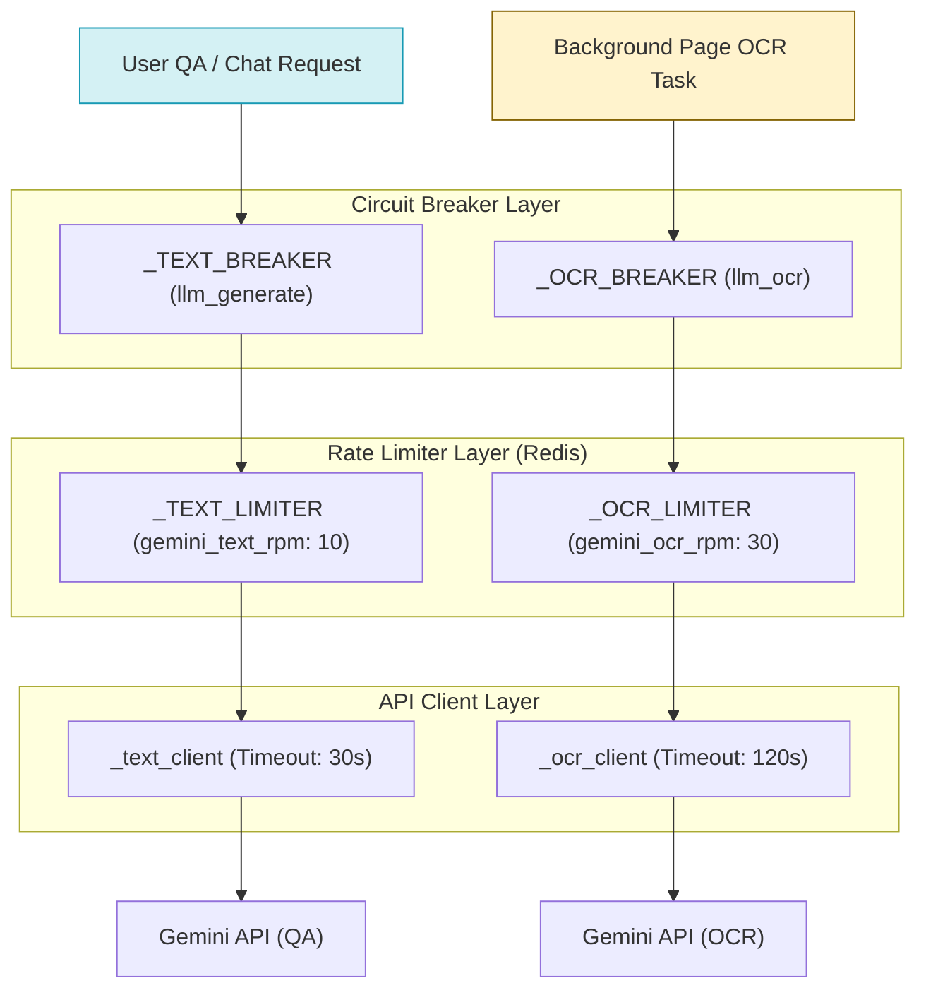

# Gemini API Call Isolation Policy

**Last Updated:** 2026-06-19  
**Status:** ✅ Active  
**Scope:** Architectural Isolation between Background Pipelines (OCR, Embeddings, Summarization) and User-Facing Services (Chat / QA)

---

## Overview

In Kitabim.AI, the **OCR (Optical Character Recognition) pipeline** runs in the background via asynchronous worker tasks to process scanned book PDFs page-by-page. The **Question Answering (QA) / Chat pipeline**, on the other hand, is a real-time, user-facing service. 

Because both pipelines call the Google Gemini API (leveraging shared credentials/accounts), intensive background processing can easily starve, delay, or block user-facing requests if not properly isolated. 

To guarantee that background processing **never degrades the user experience**, the system enforces a strict isolation policy.

---

## Architectural Isolation Mechanisms

The isolation is implemented in [models.py](../../../packages/backend-core/app/llm/models.py) using three layers of defense:

### 1. Dedicated Rate Limiters (Redis-based)
Different operations are isolated into distinct Redis-backed rate limiters (`RedisRateLimiter`) to prevent high-volume processing from exhausting quotas:
- **Text & Chat Calls (`_TEXT_LIMITER`):** Scoped to `gemini_text` using `settings.gemini_text_rpm` (default: 10 RPM).
- **OCR Vision Calls (`_OCR_LIMITER`):** Scoped to `gemini_ocr` using `settings.gemini_ocr_rpm` (default: 30 RPM).
- **Embedding Calls (`_EMBED_LIMITER`):** Scoped to `gemini_embed` using `settings.gemini_embed_rpm` (default: 100 RPM).

> [!NOTE]
> If the background OCR worker hits its limit, only the OCR tasks are paused/delayed. Real-time chat requests continue to use the separate `_TEXT_LIMITER` bucket and execute without delay.

### 2. Isolated Circuit Breakers
If an API error occurs (e.g., permanent quota depletion, service outages, or bad payloads), circuit breakers prevent cascading failures:
- **`_TEXT_BREAKER` (`llm_generate`):** Wraps all general LLM generation and chat calls.
- **`_OCR_BREAKER` (`llm_ocr`):** Wraps all image-to-text OCR vision calls.
- **`_EMBED_BREAKER` (`llm_embed`):** Wraps all pgvector embedding generation calls.

> [!IMPORTANT]
> If a buggy PDF or a temporary spike in page volume trips the `_OCR_BREAKER` (transitioning it to `open` or `half-open`), **user-facing chat is unaffected**. The `_TEXT_BREAKER` remains `closed` (operational), allowing readers to chat with already processed books.

### 3. Separate API Client Instances & Connection Tuning
To prevent thread or connection pool exhaustion, the application uses distinct client instances with tailored HTTP timeouts:
- **Text client (`_text_client`):** Configured with `_INVOKE_TIMEOUT = 30.0` seconds. This ensures prompt failure rather than lingering connections.
- **OCR client (`_ocr_client`):** Configured with `_OCR_INVOKE_TIMEOUT = 120.0` seconds to accommodate complex image rendering and long multimodal payloads.

---

## Guidelines for Developers

When modifying or adding features that invoke Gemini models:

1. **Never share breakers or rate limiters:** Do not run non-OCR tasks through visual/OCR functions, and do not make OCR calls using text-oriented methods.
2. **Implement Jittered Exponential Backoff:** All background workers must catch transient exceptions (429, 503, timeouts) using `is_transient_error()` and retry with random jitter to avoid spaming the API and worsening quota conditions.
3. **Keep configurations distinct:** Ensure that `gemini_ocr_rpm`, `gemini_text_rpm`, and `gemini_embed_rpm` remain configurable independently in `.env` and `system_configs`.
4. **Prefer streaming for user-facing QA:** User chat requests should use `astream()` wrapped in `ProtectedLLM` to begin rendering answers instantly, reducing perceived latency even under system load.
