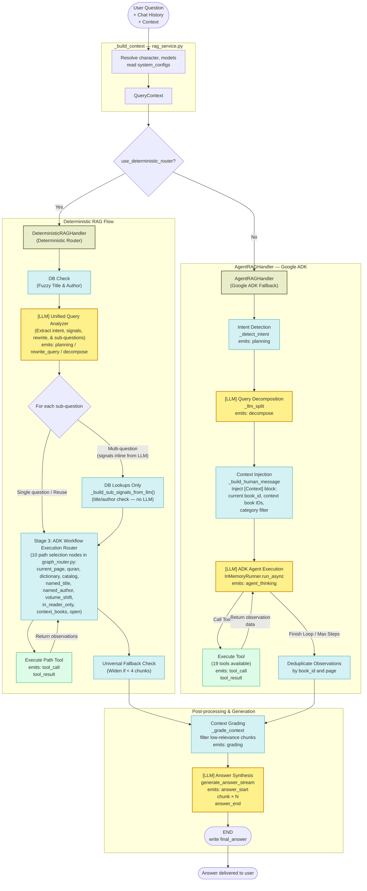
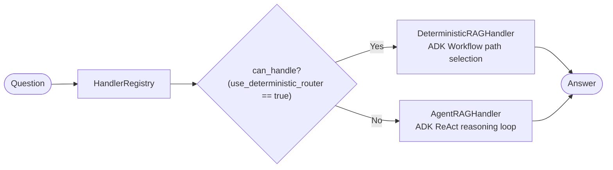

# Question Answering Pipeline Diagram (Deterministic Router & Google ADK)

Visual representation of the RAG question answering pipeline, supporting both the **Deterministic Python Router** and the **Google ADK Agentic Loop** (fallback).

---

## Full Pipeline



---

## Handler Routing Reference

Handler selection is dynamically governed by the `use_deterministic_router` config:



---

## Agentic Retrieval Strategy

This diagram illustrates the agent's internal decision tree for tool selection, governed entirely by the `AGENT_SYSTEM_PROMPT`.

```mermaid
flowchart TD
    Q([User Question]) --> PRON{"Step 1:<br/>Pronouns/چۇ particle<br/>+ chat history?"}

    %% Step 1 — pronoun / co-reference rewrite
    PRON -->|No| INTENT
    PRON -->|Yes| REWRITE["[LLM] Tool: rewrite_query"]
    REWRITE --> RETITLE{"Rewritten question<br/>now names a title?"}
    RETITLE -->|"Yes — MUST use find_books_by_title<br/>do NOT reuse stale context IDs"| FBT_R[Tool: find_books_by_title]
    RETITLE -->|"No — re-evaluate rewritten<br/>question from step 2"| INTENT

    FBT_R --> CHAR_R{"Characters /<br/>plot / themes?"}
    CHAR_R -->|Yes| GBS_R[Tool: get_book_summary] --> STOP
    CHAR_R -->|"No — passages"| SC_R[Tool: search_chunks] --> CHK

    %% Shared intent branch
    INTENT{"Steps 2–4:<br/>Intent + context"}

    %% Step 2 — catalog / metadata
    INTENT -->|"who wrote title? — step 2"| T_AUTH[Tool: get_book_author] --> STOP
    INTENT -->|"what did author write? — step 2"| T_BAUTH[Tool: get_books_by_author] --> STOP
    INTENT -->|"library browsing — step 2"| T_CAT[Tool: search_catalog] --> STOP

    %% Step 3 — current page shortcut
    INTENT -->|"Content on current page<br/>context has current_page — step 3"| T_CUR[Tool: get_current_page] --> STOP

    %% Step 4a — named title + plot/characters/themes
    INTENT -->|"Named title +<br/>plot/characters/themes — 4a"| FBT_A[Tool: find_books_by_title]
    FBT_A -->|IDs| GBS_A[Tool: get_book_summary] --> STOP

    %% Step 4b — named title + passages
    INTENT -->|"Named title +<br/>passages/details — 4b"| FBT_B[Tool: find_books_by_title]
    FBT_B -->|IDs| SC_B[Tool: search_chunks] --> CHK

    %% Step 4c — named author
    INTENT -->|"Named author — 4c"| GBA_C[Tool: get_books_by_author]
    GBA_C -->|IDs| SC_C[Tool: search_chunks] --> CHK

    %% Step 4d — current book_id in context
    INTENT -->|"No title/author;<br/>context: current book_id — 4d"| VOL_D{"Sister volume<br/>question?<br/>next/prev/numbered volume"}
    VOL_D -->|Yes| GSV_D[Tool: get_sister_volumes<br/>with current book_id]
    GSV_D --> SC_D_SIS[Tool: search_chunks<br/>with sister volume book_id] --> CHK
    VOL_D -->|No| SC_D[Tool: search_chunks<br/>with current book_id] --> CHK

    %% Step 4e — previous book IDs + who is X
    INTENT -->|"No title/author;<br/>context: prev book IDs;<br/>who is X / tell me about X — 4e"| SBS_E[Tool: search_books_by_summary<br/>with context_book_ids]
    SBS_E -->|Results — topic still matches| GBS_E[Tool: get_book_summary] --> STOP
    SBS_E -->|No results — topic shifted| SBS_G

    %% Step 4f — previous book IDs, non-character
    INTENT -->|"No title/author;<br/>context: prev book IDs;<br/>non-character question — 4f"| VOL_F{"Sister volume<br/>question?"}
    VOL_F -->|Yes| GSV_F[Tool: get_sister_volumes<br/>with context_book_ids[0]]
    GSV_F --> SC_F_SIS[Tool: search_chunks<br/>with sister volume book_id] --> CHK
    VOL_F -->|No| SC_F[Tool: search_chunks<br/>with context_book_ids] --> CHK

    %% Step 4g — no context / general fallback
    INTENT -->|"No title/author/context<br/>or fallthrough from 4e/4f — 4g"| SBS_G[Tool: search_books_by_summary]
    SBS_G --> WHO{"Who is X /<br/>tell me about X?"}
    WHO -->|Yes| GBS_G[Tool: get_book_summary<br/>max 5 IDs] --> STOP
    WHO -->|No| SC_G[Tool: search_chunks<br/>with returned book_ids] --> CHK

    %% Step 4h — Quran / Dictionary / Graph
    INTENT -->|"Quran search — 4h"| T_Q[Tool: search_quran] --> STOP
    INTENT -->|"Dictionary / language query — 4h"| T_DICT[Tools: lookup_uyghur_word, lookup_history_term,<br/>translate_english_to_uyghur, check_word_spelling,<br/>lookup_uyghur_name, search_language_sources,<br/>lookup_proverbs, lookup_synonyms] --> STOP

    %% Step 4i — retry (search_chunks only, never after get_book_summary)
    CHK{"Step 4i:<br/>search_chunks < 4 results?<br/>Never applies after<br/>get_book_summary"}
    CHK -->|Yes| SC_H[Tool: search_chunks<br/>empty book_ids = entire library] --> STOP
    CHK -->|No — sufficient context| STOP

    STOP([Stop — respond with no tool calls\nto signal completion])

    classDef tool fill:#dcfce7,stroke:#16a34a,stroke-width:2px
    classDef decision fill:#fef9c3,stroke:#854d0e,stroke-width:1px
    classDef stop fill:#fee2e2,stroke:#dc2626,stroke-width:2px
    classDef llm fill:#fef08a,stroke:#ca8a04,stroke-width:2px

    class FBT_R,GBS_R,SC_R,T_AUTH,T_BAUTH,T_CAT,T_CUR,FBT_A,GBS_A,FBT_B,SC_B,GBA_C,SC_C,SC_D,SBS_E,GBS_E,SBS_G,GBS_G,SC_G,SC_H,GSV_D,SC_D_SIS,GSV_F,SC_F_SIS,T_Q,T_DICT tool
    class PRON,RETITLE,CHAR_R,INTENT,WHO,CHK,VOL_D,VOL_F decision
    class STOP stop
    class REWRITE llm
```

---

## Agent Tools Reference (19 Tools Total)

| Tool | Type | Wraps | When agent/router calls it |
|------|------|-------|---------------------|
| `rewrite_query` | Utility | `QueryRewriter` | Question has pronouns or follow-up markers ("چۇ" clitic) and chat history exists. |
| `find_books_by_title` | Content | `BooksRepository` title match | Question explicitly names a book title; returns book IDs, title, author, and volume metadata. |
| `search_books_by_summary` | Content | `BookSummariesRepository` | Finding which books cover a topic; also used with `context_book_ids` to verify a "who is X" question. |
| `search_chunks` | Content | pgvector similarity search + `graph_entity_lookup` | Retrieving passages; uses L1+L2 cache; called directly with `[Context]` book_id when available; automatically runs post-vector `graph_entity_lookup`. |
| `get_book_author` | Metadata | `BooksRepository` | Author lookup for "who wrote X?" questions. |
| `get_books_by_author` | Metadata | `BooksRepository` | Book list for "what did Y write?" questions. |
| `get_book_summary` | Content | `BookSummariesRepository` | Plot, themes, or main characters of specific books; or identifying characters/persons. |
| `get_current_page` | Content | `PagesRepository.find_one` | Raw text of the page the user is currently reading (in-reader mode). |
| `get_sister_volumes` | Content | `BooksRepository` | All volumes of the same series as a given book_id. |
| `search_catalog` | Metadata | `CatalogHandler` | Library browsing and general listing queries. |
| `search_quran` | Content | `quran` table search | Surah/ayah lookup or free-text pgvector search within the Holy Quran. |
| `lookup_uyghur_word` | Dictionary | `DictionaryRepository.lookup_uyghur_definition` | Lookup definitions for Uyghur words. |
| `lookup_history_term` | Dictionary | `DictionaryRepository.lookup_history_term` | Lookup definition for a historical term, person, event, or concept. |
| `translate_english_to_uyghur` | Dictionary | `DictionaryRepository.translate_english_to_uyghur` | Translate English word/phrase to Uyghur. |
| `check_word_spelling` | Dictionary | `DictionaryRepository.check_word_spelling` | Validate word spelling and suggest corrections. |
| `lookup_uyghur_name` | Dictionary | `DictionaryRepository.lookup_name` | Lookup a Uyghur person name or list names starting with a specific letter. |
| `search_language_sources` | Dictionary | `DictionaryRepository.search_language_sources` | Fallback search across all language/dictionary sources. |
| `lookup_proverbs` | Dictionary | `DictionaryRepository.lookup_proverbs` | Lookup Uyghur proverbs and idioms. |
| `lookup_synonyms` | Dictionary | `DictionaryRepository.lookup_synonyms` | Lookup synonyms for Uyghur words. |

---

## Cache Layers

| Level | Key | Populated By | Purpose |
|-------|-----|-------------|---------|
| **L0** | `KEY_RAG_REWRITE` | `rewrite_query` tool | Deduplicate follow-up pronoun rewrites |
| **L1** | `KEY_RAG_EMBEDDING` | First embed call per query | Reuse query embeddings across multiple tools |
| **L2** | `KEY_RAG_SEARCH_SINGLE/MULTI` | `search_chunks` tool | Cache pgvector similarity search results |
| **L3** | `KEY_RAG_SUMMARY_SEARCH` | `search_books_by_summary` tool | Cache summary search results for book selection |

---

## Key Components

| Component | Role |
|-----------|------|
| **HandlerRegistry** | Registry for the active RAG query handler (`AgentRAGHandler`). |
| **AgentRAGHandler** | Main execution driver — performs pre-agent decomposition, invokes ADK runner, collects observations, executes grading, and runs synthesis. |
| **Google ADK Agent** | Stateless agent compiled with tools and system prompts. |
| **InMemoryRunner** | Stateless runner executing the agent ReAct loop. |
| **QueryRewriter** | Resolves pronouns using conversation history (L0 cached). |
| **_grade_context** | Post-processing method applying relative grading thresholds per search tool call to keep diverse topic matches, de-duplicating, and capping at `AGENT_MAX_CONTEXT_CHUNKS` (25 chunks). |
| **retrieval.py** | Shared database retrieval primitives (`embed_query`, `vector_search`, `find_books_by_title_in_question`). |
| **agent/config.py** | Centralized loop constants (`AGENT_MAX_STEPS`, `AGENT_ENOUGH_CHUNKS`, `AGENT_MAX_CONTEXT_CHUNKS`, etc.). |
| **ChunksRepository** | pgvector `similarity_search` against PostgreSQL `chunks` table. |
| **BookSummariesRepository** | pgvector `summary_search` against `book_summaries` for book discovery. |
