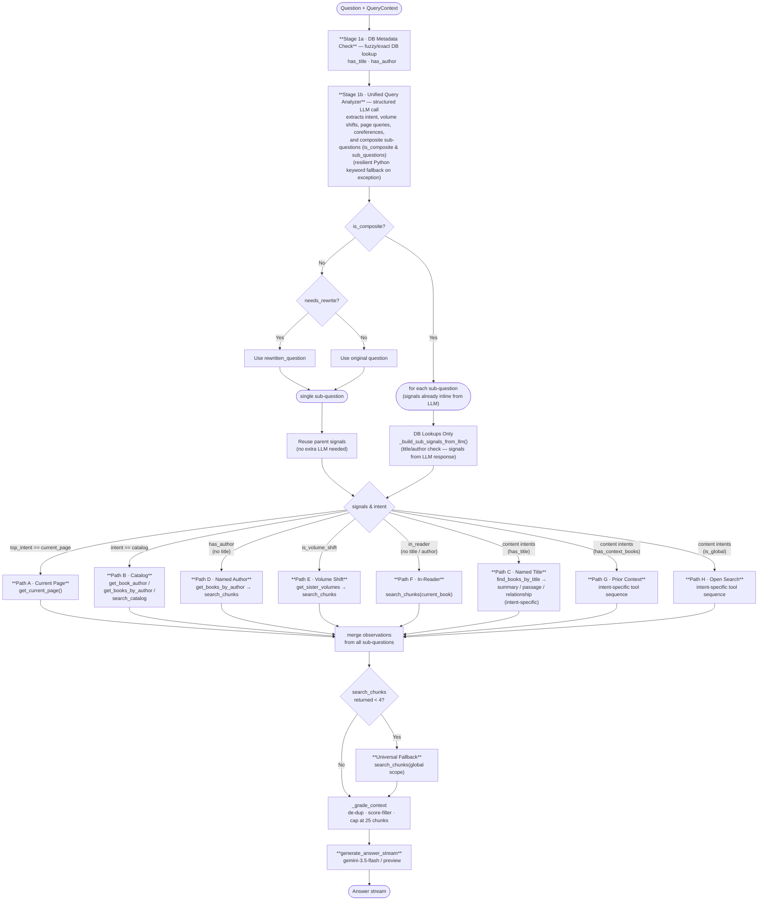

# RAG Deterministic Router — Design

**Status:** Active ✅  
**Replaces:** `AgentRAGHandler._execute_workflow_stream` (ADK agent loop)  
**Files affected:** `packages/backend-core/app/services/rag/agent/deterministic_handler.py`, `prompts.py`

---

## Problem

The original retrieval loop delegated all tool-call sequencing to an LLM (Google ADK agent). The agent interpreted a 118-line natural language prompt to decide which tools to call and in what order. This meant:

- Up to 6 LLM round-trips just for routing (before answer generation)
- Non-deterministic — the same question could take different paths across calls
- Hard to debug ("why did the agent call search_chunks before find_books_by_title?")
- The prompt encoded an **implicit decision tree** — we can just write the tree in code

The prompt review (`RAG_PROMPT_REVIEW.md`) found 11 logic issues in the old prompt — all of which are resolved by this design.

---

## Core Insight

The routing logic in `prompts.py` already *is* a decision tree — it's just written in English. Every step (1–6) is an `if/elif` branch. The only parts that genuinely require an LLM are:

- **Coreference resolution:** Resolving Uyghur pronouns against chat history
- **Intent classification:** Distinguishing "who is X" (identity) vs "what did X do" (passage)
- **Query rewriting:** Standalone question generation from a follow-up
- **Multi-question splitting:** Identifying and breaking down compound queries

Everything else is deterministic given the signals already in `QueryContext`.

---

## Proposed Architecture

Replace the ADK agent loop with a three-stage pipeline:

```
[Question + QueryContext]
        │
        ├──► DB Check (fuzzy title/author)
        ▼
┌───────────────────────────┐
│  1. Unified Query Analyzer│  (structured JSON LLM call — extracts intent, signals, and composite splits)
└───────────────────────────┘  (resilient Python keyword fallback on error)
        │ signals: is_current_page_query, is_volume_shift, target_volume,
        │          needs_rewrite, catalog_subtype, intent, is_composite, sub_questions
        ▼
┌───────────────────────────┐
│  2. Execution Router      │  (pure Python — picks and runs a fixed path A-H per sub-question)
└───────────────────────────┘
        │ observations list (same format as today)
        ▼
[_grade_context → answer_builder]  (unchanged)
```

### Full Flow Diagram



---

## Stage 1: Unified Query Signal Analyzer

A hybrid stage combining deterministic database-level metadata check with a single structured LLM call to extract semantic intent and navigation properties.

### 1a. DB Metadata Check (Deterministic)
- Checks the database for fuzzy or exact matches of titles (`has_title`) and authors (`has_author`) mentioned in the query text.

### 1b. LLM Query Analysis (Semantic)
- Employs a structured LLM call (`_llm_analyze_query`) using `GenerateContentConfig(response_mime_type="application/json")` to extract:
  - `is_current_page_query` (boolean)
  - `is_volume_shift` (boolean)
  - `target_volume` (int | null)
  - `needs_rewrite` (boolean)
  - `rewritten_question` (string | null)
  - `catalog_subtype` ("author_of" | "books_by" | "general" | null)
  - `intent` ("catalog" | "identity" | "summary" | "relationship" | "passage")
  - `is_composite` (boolean)
  - `sub_questions` (`Array<{question, intent, is_current_page_query, is_volume_shift, target_volume, catalog_subtype}> | null`) — each sub-question carries its own signals inline, eliminating a per-sub-question LLM call
- **Resilient Fallback:** If the LLM call fails, the signal analyzer automatically falls back to local Python keyword matching, defaults `intent` to `"passage"`, disables decomposition, and sets `sub_questions = [question]`.

---

## Stage 2: Coreference & Query Decomposition

Coreference resolution and query splitting are merged directly into **Stage 1b**'s unified query analyzer call. 

1. **Pronoun Resolution:** The LLM resolves any pronouns/coreferences in-place against the conversation history.
2. **Decomposition:** If the user's message contains multiple distinct questions (with or without standard punctuation), the LLM sets `is_composite: true` and splits the message into fully self-contained, rewritten sub-questions returned via the `sub_questions` array.

This design saves redundant LLM calls (`_llm_split`) and completely avoids fragile, punctuation-based regex splitting in Python.

**Resilient Fallback:**
If the Stage 1b unified query analyzer fails:
1. Local Python keyword checks for Uyghur pronoun tokens are used to detect `needs_rewrite`.
2. If `needs_rewrite` is true, the standalone `rewrite_query` LLM tool is run.
3. No splitting is attempted; the rewritten question is processed as a single question.

---

## Stage 3: Intent Classifier

Because intent is pre-extracted during **Stage 1b**'s structured query analysis, the `classify_intent` step simply reads the intent from the signals dictionary directly (bypassing any extra LLM calls).

**Resilient Fallback:**
If the Stage 1b LLM query analysis fails, intent classification falls back to:
1. **Python Skip Heuristics:** Automatically routing queries with simple author, volume shift, or active reader signals to their respective default intents (e.g. `passage`).
2. **Intent Classification LLM Call:** Executing a fallback LLM prompt to classify the question's intent (only if the skip heuristics are not met).

---

## Stage 4: Execution Router

Pure Python. Given signals + intent, selects and executes a fixed path. Each path calls tools directly (same tool implementations in `tools.py`) and appends to an `observations` list — identical in format to what the ADK agent produces today.

**Observations envelope format** (must match what `_grade_context` and `_extract_used_book_ids` expect):
```python
observations.append({
    "tool": "search_chunks",          # tool name string
    "result": {
        "ok": True,                   # bool — False if the tool errored
        "data": {                     # tool-specific payload
            "chunks": [...],          # for search_chunks
        },
    },
})
```
Each path executor is responsible for wrapping tool return values in this envelope before appending.

### Path A — Current Page
**Triggers:** `top_intent == current_page` AND `in_reader`
```
get_current_page()
```

---

### Path B — Catalog
**Triggers:** `intent == "catalog"`

| Subtype | Tool sequence |
|---------|--------------|
| `author_of` ("who wrote X") | `get_book_author(question)` |
| `books_by` ("what books does author X") | `get_books_by_author(question)` |
| `general` | `search_catalog(question)` |

---

### Path C — Named Title
**Triggers:** `has_title == True`

| Intent | Tool sequence |
|--------|--------------|
| `identity` | `find_books_by_title → get_book_summary(book_ids)` (falls back to `search_chunks(book_ids)` if summary does not contain info) |
| `summary` | `find_books_by_title → get_book_summary(book_ids)` |
| `passage` | `find_books_by_title → search_chunks(book_ids)` |
| `relationship` AND `graph_available` | `find_books_by_title → query_knowledge_graph(book_ids) → search_chunks(book_ids)` |
| `relationship` AND NOT `graph_available` | `find_books_by_title → search_chunks(book_ids)` |

**Note on Fallbacks & Changes:**
- **`summary` Fallback:** If `find_books_by_title` returns an empty list, fall back to `search_books_by_summary(question) → get_book_summary(top_ids, max=5)`.

---

### Path D — Named Author (no explicit title)
**Triggers:** `has_author == True` AND NOT `has_title`
```
get_books_by_author(question) → search_chunks(returned_book_ids)
```
Fallback if <4 results: widen to `search_chunks(book_ids=None)`.

---

### Path E — Volume Shift
**Triggers:** `is_volume_shift == True` AND (`in_reader` OR `has_context_books`)
```
get_sister_volumes(current_book_id or context_book_ids[0])
→ search_chunks(target_volume_id)  # derived from volume number in question
```

---

### Path F — In-Reader, No Title/Author
**Triggers:** `in_reader == True` AND NOT `has_title` AND NOT `has_author` AND NOT `is_volume_shift`
```
search_chunks(current_book_id)
```

---

### Path G — Prior Context, No Title/Author
**Triggers:** `has_context_books == True` AND NOT `in_reader` AND NOT `has_title` AND NOT `has_author`

| Intent | Tool sequence |
|--------|--------------|
| `identity` | `search_books_by_summary(question, book_ids=context_book_ids)` → if results: `get_book_summary(verified_ids, max=5)` else: fall to G-passage |
| `passage` | `search_chunks(context_book_ids)` |
| `relationship` AND `graph_available` | `query_knowledge_graph → search_chunks(context_book_ids)` |
| `summary` | `get_book_summary(context_book_ids, max=5)` |

---

### Path H — Open / No Context
**Triggers:** `is_global == True` AND NOT `has_title` AND NOT `has_author` AND NOT `has_context_books`

| Intent | Tool sequence |
|--------|--------------|
| `identity` | `search_books_by_summary(question) → get_book_summary(top_ids, max=5)` |
| `passage` | `search_books_by_summary(question) → search_chunks(book_ids)` |
| `relationship` | `query_knowledge_graph → search_books_by_summary(question) → search_chunks(book_ids)` |
| `summary` | `search_books_by_summary(question) → get_book_summary(top_ids, max=5)` |

---

### Universal Fallback

Any path that ends with `search_chunks` and returns <4 results:
1. Re-run `search_books_by_summary(question)` to rediscover books (SKIP this step if `search_books_by_summary` was already called in the primary execution path).
2. Re-run `search_chunks(new_book_ids)` with the new IDs (SKIP if step 1 was skipped).
3. If still <4 (or if steps 1-2 were skipped): run `search_chunks(book_ids=None)` (global scope)

---

### Multi-Question Execution

For multi-question turns (when `is_composite: true` and `len(sub_questions) > 1`), the router is applied **independently per sub-question**, then all observations are merged before `_grade_context`.

1. **Step 1:** Unified Analyzer parses user query and outputs `sub_questions[]`, each item already carrying its own `intent`, `is_volume_shift`, `is_current_page_query`, `target_volume`, and `catalog_subtype` — no second LLM call per sub-question.
2. **Step 2:** For each sub-question, `_build_sub_signals_from_llm()` runs **DB lookups only** (`has_title`, `has_author`) to build the signals dict from the inline LLM fields.
3. **Step 3:** Each sub-question is routed through execution paths A-H using those signals.
4. **Step 4:** Merge all observations and grade the combined contexts.

**LLM cost for N composite sub-questions: always 1 call** (signals are inline in the first response).

---

## Model Assignments

| Role | Model | Reason |
|------|-------|--------|
| Unified Query Analyzer (Decomposition, coreference resolution, signal extraction) | `gemini-3.5-flash` | Structured JSON, fast, strong Uyghur capability |
| Sub-question signal extraction / fallback classifiers | `gemini-3.5-flash` | Fast JSON classification, needs Uyghur support |
| Answer generation (`generate_answer_stream`) | `gemini-3-flash-preview` | Best Uyghur output quality for final answer |

---

## What Stays Unchanged

| Component | Status |
|-----------|--------|
| All tool implementations in `tools.py` | Unchanged |
| `_grade_context` | Unchanged |
| `_extract_used_book_ids` | Unchanged |
| `_populate_ctx_from_observations` | Unchanged |
| `answer_builder.py` | Unchanged |
| `QueryContext` | Unchanged |
| Event protocol (`planning`, `tool_call`, `tool_result`, `result`) | Same shape, emitted by router |
| `_llm_split` (used by AgentRAGHandler fallback) | Unchanged |

---

## LLM Call Budget Comparison

Proposed simple calls use `gemini-3.5-flash`.

| Scenario | Current ADK Agent Loop | Unified Query Analyzer Router |
|----------|------------------------|-------------------------------|
| Catalog question ("who wrote X") | 1–2 agent calls | 1 analyze call |
| Current page question | 1–2 agent calls | 1 analyze call |
| Named title, clear passage | 2–3 agent calls | 1 analyze call |
| Follow-up with pronoun + content | 3–5 agent calls | 1 analyze call |
| Multi-question (3 sub-questions) | 4–6 agent calls | 1 analyze call (sub-question signals inline) |
| Complex relationship + title | 3–4 agent calls | 1 analyze call |
