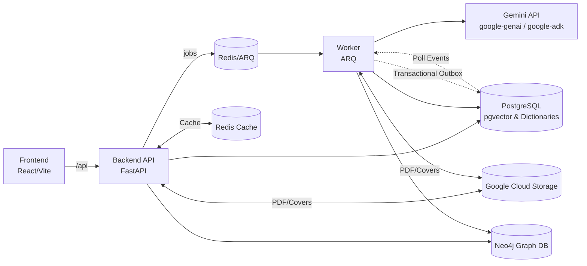

# System Design — Kitabim.AI

## 1) Overview
Kitabim.AI is a monorepo-based platform for OCR, curation, and RAG-powered reading of Uyghur books. The system uses the **Gemini 3.5 Flash** model for high-throughput OCR and embeddings, and **Gemini 3.5 Flash / Gemini 3.0 Flash Preview** for chat. It features a FastAPI backend with an asynchronous processing pipeline, a React/Vite frontend, and a Neo4j database for GraphRAG. 

The core AI layers are built using the first-party **google-genai SDK** (for direct generation/embedding calls, deterministic routing, and semantic classification) and **Google ADK** (as a fallback agentic retrieval loop). Background orchestration is handled through a Redis-backed queue with a dedicated worker service. The backend API and worker share a common Python package (`packages/backend-core`).

## 2) Goals & Non‑Goals
**Goals**
- Efficient, page-level OCR and indexing of PDFs using Gemini API.
- High-quality, robust RAG for book- and library-level Q&A.
- Maintainable, modular architecture using Google first-party AI stack only.
- Standardized file management (operational scripts in `scripts/`, deployment scripts in `deploy/`, docs in `docs/`).
- Observability (request telemetry, user feedback tracking, detailed pipeline statistics).
- Integrated dictionary lookup for Uyghur language definitions, historical terms, person names, spell checking, and translations.

**Non‑Goals (current)**
- Multi-tenant auth and billing.
- Use of Gemini Batch API (real-time/interactive API is preferred for lower latency).
- Automated offline/background RAG metrics scoring (e.g. Ragas).

## 3) Architecture (High-Level)

### Core Services
- **Backend API (`services/backend`)**
   - FastAPI application built on shared backend core.
   - Orchestrates upload, job management, and RAG chat.
   - Exposes REST endpoints for books, chat, dictionary management, and admin dashboard.
   - Uses PostgreSQL for metadata + embeddings (pgvector) + multi-dictionary language sources.
   - **Dictionary Repository (`DictionaryRepository`)**: Performs exact and trigram similarity search across six separate language tables.
   - **Redis Caching Layer**: High-performance caching for books, categories, and query rewrites (L0-L3 caching).
   - **Circuit Breaker**: Resilient protection for Redis and external Gemini API services.
   - **Neo4j Database**: Graph database (Bolt protocol, port 37687/7687) storing book semantic entities and relationships to support GraphRAG.

- **Worker (`services/worker`)**
   - ARQ worker process for background orchestration.
   - **Scanners**: Poll for idle work (OCR, Chunking, Embedding, Spell Check).
   - **Jobs**: Focused executors that perform the actual AI or data processing in real-time.
   - **Event Dispatcher**: Reacts to `PipelineEvent` entries to trigger next-step jobs immediately.
   - **Maintenance**: Automated cleanup and staleness watchdog.

- **Frontend (`apps/frontend`)**
   - React 19 + Vite UI.
   - Real-time status updates for books and individual page milestones.
   - Curation interface with dedicated panels for Uyghur words, definitions, synonyms, names, historical vocabulary, and English translations.

- **Gemini Infrastructure**
   - **Interactive API**: Real-time processing of OCR, Embedding, and Chat requests.
   - **File API**: Transient storage for input images during OCR.

- **Google Cloud Storage (GCS)**
   - Private bucket for original PDFs (source of truth).
   - Public bucket (CDN-enabled) for book covers.

### Architecture Diagram


## 4) Monorepo Structure
```
/apps/frontend         # UI Application (React 19, TypeScript)
/services/backend      # API Service (FastAPI, dictionary / words / synonyms endpoints)
/services/worker       # Pipeline Worker (ARQ spell check job using words table)
/packages/backend-core # Shared logic, db entities, repositories, & LLM services
/scripts               # Diagnostic & operational scripts
/deploy                # Deployment infrastructure & local dev scripts
/docs                  # Architecture & design docs
/docker-compose.yml   # Primary local dev entry point
```

## 5) Data Model

### PostgreSQL

**Books**
- `status` statuses: `pending`, `ocr_processing`, `ocr_done`, `indexing`, `ready`, `error`
- `pipeline_step`: Active pipeline stage (`ocr`, `chunking`, `embedding`, `spell_check`, `ready`)
- `pipeline_stats`: JSONB blob containing page counts per milestone (e.g., `spell_check_active`, `ocr_failed`)

**Pages**
- **Milestones**: `ocr_milestone`, `chunking_milestone`, `embedding_milestone`, `spell_check_milestone`.
- Milestone States: `idle`, `in_progress`, `succeeded`, `failed`, `done`.
- `text`, `is_indexed`.

**Pipeline Events**
- Transactional outbox pattern: `page_id`, `event_type`, `processed`.
- Used to trigger downstream processing immediately after a milestone succeeds.

**Chunks**
- Semantic units with `pgvector(3072)` embeddings (Gemini Embedding v2 / `text-embedding-004`).

**Words (Spell Check Dictionary)**
- `word`: varchar(255) (unique, indexed) — baseline known vocabulary.

**Dictionary (Definitions)**
- `word`: varchar(255) (unique, indexed)
- `definition`: text
- `audio`: varchar(255) (optional link to vocalizations)

**Synonyms**
- `word`: varchar(255) (unique, indexed)
- `letter_group`: varchar(50) (indexed)
- `synonyms`: text ARRAY — array of matching synonyms.

**History Dictionary**
- `term`: varchar(500) (unique, indexed)
- `transliteration`: text (optional)
- `definition`: text
- `letter_group`: varchar(10) (indexed)

**Names Dictionary**
- `name`: varchar(500) (unique, indexed)
- `letter_group`: varchar(20) (indexed)

**English-Uyghur Dictionary**
- `english`: varchar(500) (unique, indexed)
- `uyghur`: text
- `letter_group`: varchar(5) (indexed)

### Neo4j (Knowledge Graph)
Neo4j stores entities and their semantic relationships extracted from book chunks.

**Nodes**
- `Entity`: Represents a conceptual or concrete entity extracted from the text.
  - Properties: `name` (unique canonical name, NFC normalized), `type` (e.g., Person, Location, Event, Organization, HistoricalEra, Concept), `subtype` (optional detail string).

**Relationships**
- `RELATED_TO`: Directed relationship between two `Entity` nodes.
  - Properties: `book_id` (PostgreSQL Book UUID), `type` (the semantic relationship type, e.g., LIVED_IN, BORN_IN, FRIEND_OF).

## 6) Key Flows

### A) PDF Processing Workflow (Realtime Pipeline)
1. **Upload**: User uploads PDF to Backend → Saved to GCS.
2. **OCR Submission**: Worker picks up `idle` pages, renders PDF to images, and calls Gemini Vision API via `google-genai` SDK.
3. **OCR Application**: Worker applies text to `pages`, sets `ocr_milestone` to `succeeded`.
4. **Local Chunking**: Worker cleans text and creates `chunks`. Sets `chunking_milestone` to `succeeded`.
5. **Embedding**: Worker generates and stores vectors for chunks. Sets `embedding_milestone` to `succeeded`.
6. **AI Polish**: Worker performs spell-check identification matching tokens against the `words` table.
7. **Finalization**: Book marked `ready` when all pages reach their terminal milestones.
8. **Summary & Graph Ingestion**: Once marked ready, the worker triggers `summary_job` (generating book summary embeddings) and `knowledge_graph_job` (extracting entity relationships using the `google-genai` structured client and indexing them in Neo4j) concurrently.

### B) RAG Chat

All questions go to `HandlerRegistry`, which routes based on the `use_deterministic_router` config:
1. **Deterministic RAG Handler (`DeterministicRAGHandler`)** (enabled when `use_deterministic_router = True`):
   - **Stage 1a: DB Metadata Check** (pure Python, database metadata lookups): Extracts title matches, author names, volume shifts.
   - **Stage 1b: Unified Signal & Intent Analyzer** (single structured LLM call, `gemini-3.5-flash`): Extracts catalog details, coreferences, pronoun resolutions, splits multi-question queries, and identifies intent (`catalog`, `dictionary`, `identity`, `summary`, `relationship`, or `passage`). For dictionary queries, extracts the subtype (`uyghur_definition`, `history_term`, `english_uyghur`, `spelling`, `names`, `general`) and the target lookup term.
   - **Resilient Fallback**: If the analyzer LLM call fails, the handler falls back to local Python checks (`_looks_like_dictionary_question()`, UYGHUR_PRONOUN_TOKENS) and standalone `rewrite_query` and classification tools.
   - **Stage 2: Coreference Resolution & Query Decomposition**: Resolves pronouns and splits composite queries in a single LLM pass.
   - **Stage 3: Intent Classification**: Selects target execution pathway (Paths A to I).
   - **Stage 4: Execution Router** (pure Python): Directly selects and runs an optimized, fixed tool execution path:
     - **Path A (Current Page)**: `get_current_page()`
     - **Path B (Dictionary / Language Sources)**: Queries the SQL dictionary repository directly via specialized tools (e.g. `lookup_uyghur_word`, `lookup_history_term`, `translate_english_to_uyghur`, `check_word_spelling`, `lookup_uyghur_name`, or `search_language_sources`) depending on the sub-intent, skipping PDF document vectors entirely.
     - **Path C (Catalog)**: Metadata catalog browsing.
     - **Path D (Named Title)**: Scopes vector search to matching book titles.
     - **Path E (Named Author)**: Scopes search to books written by the author.
     - **Path F (Volume Shift)**: Transitions to sister volumes.
     - **Path G (In-Reader)**: Scopes search to the active reader book.
     - **Path H (Prior Context)**: Scopes search to books in recent chat history.
     - **Path I (Open / No Context)**: Broad library-wide retrieval.
   - **Universal Fallback**: Retries book discovery via summaries or expands search scope globally if a path's primary retrieval returns thin results.

2. **Agentic RAG Handler (`AgentRAGHandler`)** (fallback when `use_deterministic_router = False`):
   - **Intent Detection & Query Decomposition**: Detects question scope and decomposes multi-question inputs.
   - **Context Injection**: Pre-injects book metadata, context history, and category filters into a prompt block.
   - **ADK Agent Loop**: Uses an LLM reasoning loop (`gemini-2.5-flash` with Google ADK `InMemoryRunner`) to dynamically sequence tool calls, including the new dictionary tools.

**Post-processing & Generation (Shared by both handlers):**
- **Deduplication and Grading**: Filters and grades retrieved chunks using relative scoring against the highest score.
- **Answer Generation**: Synthesizes the final response stream (using `gemini-3.0-flash-preview` or configured chat model for high-quality Uyghur answer generation) with inline markdown citations.
- **Telemetry Logging**: Writes request metrics, execution steps, and tool execution traces to the `rag_evaluations` table for performance auditing.

## 7) Gemini Integration Strategy
- **google-genai SDK**: Used for direct, non-agentic AI operations:
   - File API for uploading images during OCR.
   - Summarization, text generation, and entity extraction tasks (structured output with Pydantic schemas).
   - Vector embedding generation.
   - Coreference resolution, intent classification, and multi-question splitting within the `DeterministicRAGHandler`.
- **Google ADK**: Used for orchestration of the fallback agentic RAG chat loop in `AgentRAGHandler`. Wires custom Python tools and executes the ReAct reasoning flow.

## 8) Reliability & Observability
- **Idempotency**: All jobs use standardized identifiers (e.g., `ocr_{book}_{page}`) to ensure results are mapped correctly even if retried.
- **Cleanup**: Transient files in Gemini File API and local cache are deleted automatically after processing.
- **Circuit Breaker**: Protects interactive services from LLM outages and Redis failures.
- **Cache Service**: Centralized caching with lazy-loading and monitoring (`get_stats`).
- **Worker Tracking**: Admin dashboard allows monitoring of real-time job states and detailed page-level progress.
- **User Feedback & Telemetry**: RAG requests write telemetry to `rag_evaluations`. Administrators monitor usage statistics and user thumbs-up/down feedback.

## 9) Scalability
- **Concurrency**: ARQ worker processes handles page-level tasks in parallel, providing high throughput.
- **Cloud Storage**: GCS handles the heavy lifting for binary artifacts.
- **Vector Search**: pgvector in PostgreSQL allows scaling retrieval without a separate vector database (using HNSW indexes).
- **Graph Database**: Neo4j handles fast Cypher queries for relational GraphRAG subgraphs.

## 10) Security
- All AI keys and GCS credentials are kept server-side.
- JWT-based authentication with role-based access control (Admin, Editor, Reader).
- Private GCS buckets ensure book content isn't exposed directly.
