# LangGraph Agent — Graph Diagram

## Full Graph

```mermaid
flowchart TD
    START([START]) --> decompose_query

    decompose_query["decompose_query
    ─────────────────
    Heuristic: count ? / ؟
    LLM split only if > 1 question
    Emits: decompose"]

    decompose_query --> plan_query

    plan_query["plan_query
    ─────────────────
    Heuristic intent detection
    No LLM call
    Emits: planning
    Intents: current_page / catalog / content_search"]

    plan_query --> agent_step

    agent_step["agent_step
    ─────────────────
    ReAct LLM call
    Binds AGENT_TOOLS
    Increments step_count and llm_calls"]

    agent_step -->|"has tool_calls (fan-out via Send)"| execute_tool
    agent_step -->|"no tool_calls"| build_context

    execute_tool["execute_tool ×N
    ─────────────────
    Parallel execution
    Runs each tool via dispatch_tool()
    Appends observation + ToolMessage"]

    execute_tool -->|fan-in| collect_tools

    collect_tools["collect_tools
    ─────────────────
    Aggregates results
    Recomputes total_chunks from search observations"]

    collect_tools -->|"total_chunks ≥ 8 OR step_count ≥ 6"| build_context
    collect_tools -->|"else (loop back)"| agent_step

    build_context["build_context
    ─────────────────
    Formats observations into RAG context string
    Extracts used_book_ids"]

    build_context --> grade_context

    grade_context["grade_context
    ─────────────────
    Filters chunks: keep ≥ 85% of top score
    Min 3 chunks · hard cap 25 chunks
    Preserves metadata blocks"]

    grade_context --> generate_answer

    generate_answer["generate_answer
    ─────────────────
    Streams answer tokens
    Uses graded_context (falls back to retrieved_context)
    Emits via StreamWriter"]

    generate_answer --> END_NODE([END])

    style START fill:#2d6a4f,color:#fff,stroke:none
    style END_NODE fill:#1d3557,color:#fff,stroke:none
    style decompose_query fill:#457b9d,color:#fff,stroke:none
    style plan_query fill:#457b9d,color:#fff,stroke:none
    style agent_step fill:#e63946,color:#fff,stroke:none
    style execute_tool fill:#f4a261,color:#000,stroke:none
    style collect_tools fill:#f4a261,color:#000,stroke:none
    style build_context fill:#457b9d,color:#fff,stroke:none
    style grade_context fill:#457b9d,color:#fff,stroke:none
    style generate_answer fill:#2d6a4f,color:#fff,stroke:none
```

## Loop Patterns

| Loop | Nodes | Exit Condition |
|------|-------|----------------|
| **ReAct loop** | `agent_step` ↔ `collect_tools` | `total_chunks ≥ 8` or `step_count ≥ 6` |

## Thresholds

| Constant | Value | Purpose |
|----------|-------|---------|
| `AGENT_MAX_STEPS` | 6 | Max ReAct iterations before forcing answer |
| `AGENT_ENOUGH_CHUNKS` | 8 | Early exit from ReAct loop |
| `AGENT_MAX_CONTEXT_CHUNKS` | 25 | Hard cap on chunks passed to answer LLM |
| `GRADE_RELATIVE_THRESHOLD` | 0.85 | Keep chunks with score ≥ 85% of top |
| `MIN_CHUNKS_AFTER_GRADING` | 3 | Safety floor — never drop below this |

## State Fields

| Field | Type | Written by |
|-------|------|------------|
| `ctx` | QueryContext | caller (input) |
| `messages` | list (add_messages) | agent_step, execute_tool |
| `observations` | list[dict] (add) | execute_tool |
| `total_chunks` | int | collect_tools |
| `llm_calls` | int (add) | agent_step |
| `step_count` | int (add) | agent_step |
| `sub_questions` | list[str] | decompose_query |
| `retrieved_context` | str | build_context |
| `graded_context` | str | grade_context |
| `used_book_ids` | list[str] | build_context |
| `final_answer` | str | generate_answer |
| `stop_reason` | str | error paths |
