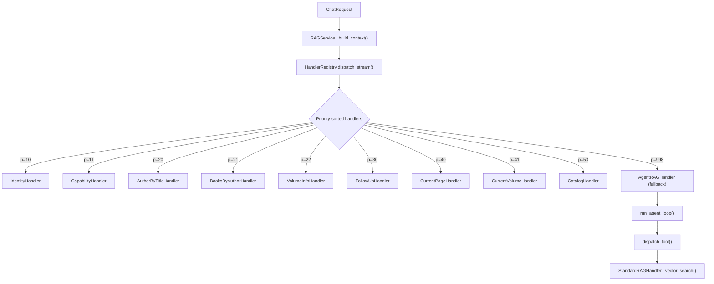

# RAG Implementation Review

> [!NOTE]
> Branch: `feature/optomize-chunking`. Goal: consistency and simplicity — no functional changes.

## Architecture Summary

The RAG system is well-structured. The main flow is:



---

## Issues Found

### 🔴 HIGH: `StandardRAGHandler` is Orphaned

`StandardRAGHandler` (priority=999) is **never added to `build_default_registry()`**. It is only used as a utility bag — `AgentRAGHandler` calls `StandardRAGHandler._vector_search()` and `StandardRAGHandler._find_books_by_title_in_question()` directly as static/instance helpers.

**Problem:** The class pretends to be a `QueryHandler` (has `intent_name`, `priority`, `handle`, `handle_stream`) but it is never registered. The `priority=999` docstring comment in `base_handler.py` still references `StandardRAGHandler` as the "guaranteed fallback," but `AgentRAGHandler` (priority=998) is the actual fallback. The class has 505 lines with full handler boilerplate that is simply never called through the registry.

**Fix:** Move the static utility methods (`_vector_search`, `_find_books_by_title_in_question`, `_summary_search`, `_select_global_books`, etc.) to a dedicated `retrieval.py` module and **delete `StandardRAGHandler` as a handler class**. The retrieval logic is now agent-driven — `StandardRAGHandler` as a handler is dead code.

---

### 🟡 MEDIUM: Duplicate Embedding Logic (`_embed_query` vs `_build_rag_context`)

`StandardRAGHandler._build_rag_context()` and `agent/tools.py::_embed_query()` both implement the same Level-1 embedding cache pattern:

```python
# In standard_rag.py
q_hash = hashlib.md5(retrieval_query.strip().encode()).hexdigest()
emb_cache_key = cache_config.KEY_RAG_EMBEDDING.format(hash=q_hash)
ctx.query_vector = await cache_service.get(emb_cache_key)
if not ctx.query_vector:
    ctx.query_vector = await ctx.embeddings.aembed_query(retrieval_query)
    ...

# In agent/tools.py
q_hash = hashlib.md5(query.strip().encode()).hexdigest()
emb_cache_key = cache_config.KEY_RAG_EMBEDDING.format(hash=q_hash)
vector = await cache_service.get(emb_cache_key)
if not vector:
    vector = await ctx.embeddings.aembed_query(query)
    ...
```

**Fix:** Extract a shared `async def embed_query(query: str, ctx: QueryContext) -> List[float]` into `utils.py` (or a new `retrieval.py`), used by both sites.

---

### 🟡 MEDIUM: `FollowUpHandler` Delegates to `AgentRAGHandler` by Instantiation

`FollowUpHandler` and `CurrentVolumeHandler` both do:
```python
from app.services.rag.agent.handler import AgentRAGHandler
return await AgentRAGHandler().handle(ctx)
```

This instantiates a **new** `AgentRAGHandler` on every request instead of reusing the registry's singleton. It works because the handler is stateless, but it bypasses the registry pattern and is inconsistent with how the registry manages handler instances.

**Fix:** Export a module-level singleton from `agent/handler.py`:
```python
# agent/handler.py (bottom)
agent_rag_handler = AgentRAGHandler()
```
Then handlers import `from app.services.rag.agent.handler import agent_rag_handler` and call it directly.

---

### 🟡 MEDIUM: `handle` and `handle_stream` are Boilerplate in Every Simple Handler

Every handler has this pattern:
```python
async def handle(self, ctx):
    context = await self._get_context(ctx)
    return await generate_answer(context, ...)

async def handle_stream(self, ctx):
    context = await self._get_context(ctx)
    async for chunk in generate_answer_stream(context, ...):
        yield chunk
```

The only difference is `generate_answer` vs `generate_answer_stream`. Simple handlers like `IdentityHandler`, `CapabilityHandler`, `AuthorByTitleHandler`, `BooksByAuthorHandler`, `VolumeInfoHandler` already effectively yield a single string — the `handle_stream` method is pure boilerplate.

**Fix:** Add a default `handle_stream` implementation to `QueryHandler` base class:
```python
# In base_handler.py
async def handle_stream(self, ctx: "QueryContext") -> AsyncIterator[str]:
    """Default: yield the full answer in one chunk. Override for true streaming."""
    yield await self.handle(ctx)
```

The 5 simple handlers drop their `handle_stream` entirely. Only handlers that actually stream (`CurrentPageHandler`, `CatalogHandler`, `AgentRAGHandler`) keep their override.

---

### 🟡 MEDIUM: `_resolve_agent_model` Makes 2-3 Sequential DB Queries per Agentic Request

```python
loop_model = (
    await configs_repo.get_value("gemini_agent_loop_model")
    or await configs_repo.get_value("gemini_agent_model")
    or await configs_repo.get_value("gemini_chat_model")
)
```

Three sequential DB (or cache) queries on every agentic request, called from `AgentRAGHandler.handle()` and `handle_stream()` separately.

**Fix:** Resolve the agent model in `RAGService._build_context()` alongside the other model lookups and store it on `QueryContext` as `agent_model: Optional[str] = None`. This keeps all model resolution in one place and eliminates the per-request lookup.

---

### 🟢 LOW: `_ENOUGH_CHUNKS = 8` and `MAX_CONTEXT_CHUNKS = 15` are Magic Numbers Spread Across Files

- `agent/loop.py`: `_ENOUGH_CHUNKS = 8` (early-exit threshold)
- `agent/context_builder.py`: `MAX_CONTEXT_CHUNKS = 15` (deduplication cap)
- `agent/prompts.py`: `"6–12 passages"` in system prompt text

These are semantically related but defined separately. Changing one requires updating all three.

**Fix:** Centralize in a new `agent/config.py`:
```python
AGENT_MAX_STEPS = 4
AGENT_ENOUGH_CHUNKS = 8
AGENT_MAX_CONTEXT_CHUNKS = 15
```

---

### 🟢 LOW: Stale Comment in `base_handler.py`

Line 18–19:
```python
"""...
``StandardRAGHandler`` uses priority=999 as the guaranteed fallback.
"""
```

`StandardRAGHandler` is not the fallback anymore. `AgentRAGHandler` (priority=998) is. This is misleading.

**Fix:** Update to reference `AgentRAGHandler`.

---

### 🟢 LOW: `format_book_catalog` in `utils.py` is Unused

`utils.py` contains `format_book_catalog(books)` which formats a list of Book ORM objects. This function is never imported or called anywhere — `CatalogHandler` builds its own catalog strings inline.

**Fix:** Delete it.

---

## Summary of Proposed Changes

| Priority | Change | Files Affected |
|---|---|---|
| 🔴 HIGH | Extract retrieval logic from `StandardRAGHandler` into `retrieval.py`; delete the class as a handler | `standard_rag.py`, `registry.py`, `agent/tools.py` |
| 🟡 MED | Extract `embed_query()` shared helper | `utils.py` or `retrieval.py`, `standard_rag.py`, `agent/tools.py` |
| 🟡 MED | Export `agent_rag_handler` singleton; use it in delegating handlers | `agent/handler.py`, `handlers/follow_up.py`, `handlers/current_volume.py` |
| 🟡 MED | Add default `handle_stream` to `QueryHandler` base; drop boilerplate from 5 simple handlers | `base_handler.py`, 5 handler files |
| 🟡 MED | Resolve agent model in `_build_context`, store on `QueryContext` | `rag_service.py`, `context.py`, `agent/handler.py` |
| 🟢 LOW | Centralize agent magic numbers in `agent/config.py` | New `agent/config.py`, `loop.py`, `context_builder.py`, `prompts.py` |
| 🟢 LOW | Fix stale docstring in `base_handler.py` | `base_handler.py` |
| 🟢 LOW | Delete unused `format_book_catalog` from `utils.py` | `utils.py` |

---

## What NOT to Change

- The `HandlerRegistry` priority dispatch pattern — clean and extensible.
- `QueryContext` dataclass — good single-responsibility boundary.
- The 4-level caching strategy (L0 rewrite, L1 embedding, L2 chunk search, L3 summary search).
- `agent/loop.py` ReAct structure — straightforward and correct.
- `agent/tools.py` separation of schema stubs from dispatch implementations.
- `query_rewriter.py` cache logic — already correct.
- `FollowUpHandler.can_handle` heuristics — comprehensive Uyghur pronoun/marker detection.
