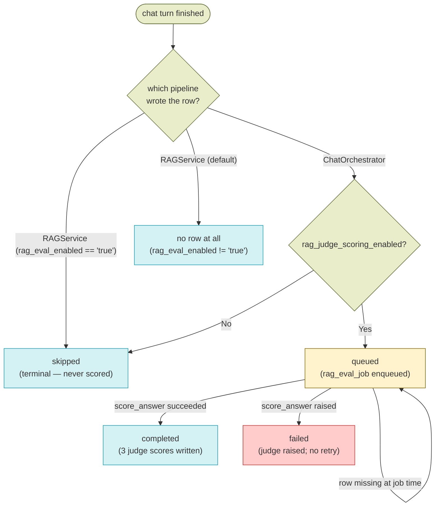

# Chat / RAG Retrieval — Design

See also: [WORKER_DESIGN.md](WORKER_DESIGN.md) for the ingestion pipeline overview. Prior stages that produce everything this stage reads: [DOCUMENT_DISCOVERY_DESIGN.md](DOCUMENT_DISCOVERY_DESIGN.md), [OCR_DESIGN.md](OCR_DESIGN.md), [CHUNKING_DESIGN.md](CHUNKING_DESIGN.md), [EMBEDDING_DESIGN.md](EMBEDDING_DESIGN.md), [SPELLCHECK_DESIGN.md](SPELLCHECK_DESIGN.md), [SUMMARY_DESIGN.md](SUMMARY_DESIGN.md). Next stage: [KNOWLEDGE_GRAPH_DESIGN.md](KNOWLEDGE_GRAPH_DESIGN.md) (also a producer this stage reads from, via `retrieval.graph_entity_lookup` — see Related Docs).

## Overview

Chat / RAG retrieval is the only *read* stage of the pipeline: it consumes the artifacts every prior stage produced (`chunks` + their embeddings, `book_summaries`, `pages.text`, `books` metadata) and turns a user question into a streamed, cited Uyghur answer. It is a synchronous request-path stage in the FastAPI backend — no worker job, no scanner, no page milestones. The one worker job in this doc (`rag_eval_job`) runs *after* the answer has already been streamed and persisted, and never blocks a request.

**Two independent chat pipelines exist today.** Which one serves a request is decided entirely inside `services/backend/api/endpoints/chat_router.py` — there is no shared dispatcher above them:

- **`ChatOrchestrator`** (`packages/backend-core/app/services/chat/orchestrator.py`) — a two-agent Google-ADK pipeline with server-side conversation persistence, an LLM reranker, and async judge scoring. Serves `POST /api/chat/stream` when `system_configs.use_adk_chat_v2 == "true"` **or** the request body carries a `conversationId`. Migration `072_add_conversations.sql` inserts `use_adk_chat_v2 = 'true'` with `ON CONFLICT (key) DO UPDATE SET value = 'true'`, so on any migrated database this is the **default** streaming path.
- **`RAGService` / `HandlerRegistry`** (`packages/backend-core/app/services/rag_service.py`, `rag/registry.py`) — the original pipeline: no conversation persistence, no reranker, no judge scoring. Serves the non-streaming `POST /api/chat/` **always** (that route never consults `use_adk_chat_v2` and never constructs a `ChatOrchestrator`), and serves `POST /api/chat/stream` only when neither `use_v2` condition holds. Within it, `HandlerRegistry` picks the first handler whose `can_handle()` returns `True`: `DeterministicRAGHandler` (matches only when `system_configs.use_deterministic_router == "true"`, seeded `"false"`) or `LLMRoutedRAGHandler`, whose `can_handle()` unconditionally returns `True` and is therefore the default handler on this path.

Key characteristics:

- **The two pipelines share retrieval, not orchestration.** Both build a `QueryContext` (`rag/context.py`), both drive the same 19 ADK tools (`rag/agent/tools.py`) over the same shared primitives (`rag/retrieval.py`: `embed_query`, `vector_search`, `find_books_by_title_in_question`, `graph_entity_lookup`), and both use the same `AGENT_SYSTEM_PROMPT` (`rag/agent/prompts.py`) and the same observation-envelope shape. They diverge in who chooses the tool calls, how context is condensed before answer synthesis, which answer-prompt module is used, and whether the turn is persisted and scored.
- **`ChatOrchestrator` reuses `DeterministicRAGHandler` as a utility, not as a handler.** It calls `DeterministicRAGHandler()._llm_analyze_query()` directly on every request for signal extraction, regardless of `use_deterministic_router`. It never calls `execute_path()`, `graph_router.py`, `handle()`, or `handle_stream()`.
- **Only `ChatOrchestrator` reranks.** `rerank_context` (`rag/agent/reranker.py`) is imported and called from exactly one place: `orchestrator.py`. Both registry-path handlers use the relative-score heuristic `_grade_context` unconditionally.
- **Only `ChatOrchestrator` handles exact-phrase questions.** `phrase_intent.detect_phrase_intent()` classifies a quoted phrase (`"..."` / `«...»` / `"..."`) or the explicit `ChatRequest.exact_phrase` flag as exact-phrase intent; when it fires, `ChatOrchestrator` skips the retrieval agent entirely and answers from a keyword-only leg (`chat/exact_phrase.py` → `retrieval.exact_phrase_chunk_search` → `ChunksRepository.keyword_search`'s `phraseto_tsquery` match). The registry path (`RAGService`/`HandlerRegistry`) never calls `detect_phrase_intent` and has no exact-phrase behavior — a quoted question there is just ordinary question text. Vector search itself (`vector_search` in `retrieval.py`) is vector-only on both pipelines; there is no hybrid vector+keyword fusion anymore (removed along with `rag_hybrid_search_enabled` — see Feature Flags).
- **Only `ChatOrchestrator` triggers the judge.** It writes `rag_evaluations.eval_status = 'queued'` and enqueues `rag_eval_job`. `RAGService._record_eval()` always writes `eval_status = 'skipped'` and never enqueues anything — and it writes no row at all unless `system_configs.rag_eval_enabled == "true"` (migration `044_eval_status_constraint_and_config_seed.sql` seeds it `'false'`).
- **`is_global` is derived differently on each path.** `ChatOrchestrator`'s caller computes `is_global = req.is_global or req.book_id == "global"`; `RAGService._build_context()` uses `is_global = req.book_id == "global"` only, ignoring `req.is_global`. A request with `isGlobal: true` and a real `bookId` is global on the orchestrator path and book-scoped on the registry path.
- **Book summaries drive book routing, not answer content.** `search_books_by_summary` / `get_book_summary` (see [SUMMARY_DESIGN.md](SUMMARY_DESIGN.md)) narrow *which* books to search before `search_chunks` runs; chunk passages remain the citable evidence.

## Feature Flags

All are `system_configs` rows read per request (hot-reloadable, no deploy).

| Flag | Default | Gates |
|---|---|---|
| `use_adk_chat_v2` | `"true"` (forced by migration `072_add_conversations.sql`) | `POST /api/chat/stream` → `ChatOrchestrator` instead of `RAGService`. A request carrying `conversationId` takes the orchestrator regardless of this value. Not present in `app/db/seeds.py` — only the migration sets it. |
| `use_deterministic_router` | `"false"` (`app/db/seeds.py`) | Within the `RAGService`/`HandlerRegistry` path only: `DeterministicRAGHandler.can_handle()` returns this value. Has no effect on `ChatOrchestrator`. |
| `rag_reranker_enabled` | `"true"` (`app/db/seeds.py`) | `ChatOrchestrator` only: use `rerank_context` (one extra Gemini call on the live request path) instead of `_grade_context`. |
| `rag_judge_scoring_enabled` | `"true"` (`app/db/seeds.py`) | `ChatOrchestrator` only: write `eval_status='queued'` and enqueue `rag_eval_job`. `"false"` writes `'skipped'` and enqueues nothing. |
| `rag_eval_enabled` | `"false"` (migration `044_...sql`) | `RAGService._record_eval()` only: whether a `rag_evaluations` row is written at all on the registry path. A missing key is logged as a warning and treated as disabled. |

`rag_hybrid_search_enabled` no longer exists — RRF fusion between a vector leg and a keyword leg was removed from `vector_search()` (it is vector-only now on both pipelines). Keyword (full-text) matching survives only as the separate, orchestrator-only exact-phrase leg gated by phrase intent (quoted text or the `exact_phrase` request flag), not by a system-wide toggle — see the exact-phrase bullet above and `rag_keyword_top_k` / `rag_vector_top_k` / `rag_graph_top_k` in Configuration Reference.

## Schema

This stage **writes** four tables and **reads** the artifacts of every prior stage (`books`, `pages`, `chunks`, `book_summaries`, `quran`, and the dictionary/proverb/synonym tables via the dictionary tools).

### `conversations` (written by `ChatOrchestrator` only)

| Column | Type | Description |
|---|---|---|
| `id` | `varchar(36)`, PK | UUID; also used verbatim as the ADK session id for both the retrieval and answer runners. |
| `user_id` | `varchar(36)`, FK → `users.id` (`CASCADE`) | Owner. Every conversation endpoint checks `conv.user_id == current_user.id`. |
| `book_id` | `varchar(64)`, FK → `books.id` (`SET NULL`), nullable | Set only for reader-mode conversations; `NULL` when `is_global`. |
| `is_global` | `boolean`, not null, default `false` | Library-wide vs. single-book conversation. |
| `title` | `varchar(200)`, nullable | Derived from the first question (`cleaned_q[:37] + "..."` when longer than 40 chars); also backfilled when the existing title is one of the placeholder values `NULL`/`""`/`يېڭى سۆھبەت`/`New Conversation`/`سۆھبەت`. |
| `created_at`, `updated_at` | `timestamptz`, not null, default `CURRENT_TIMESTAMP` | |
| `deleted_at` | `timestamptz`, nullable | Soft delete — `DELETE /api/chat/conversations/{id}` sets this rather than removing the row (added by migration `073_add_conversations_soft_delete.sql`; see note below). |

### `conversation_messages` (written by `ChatOrchestrator` only)

| Column | Type | Description |
|---|---|---|
| `id` | `varchar(36)`, PK | UUID. |
| `conversation_id` | `varchar(36)`, FK → `conversations.id` (`CASCADE`), not null | |
| `role` | `varchar(10)`, not null, `CHECK (role IN ('user','model'))` | Two rows are written per turn by `ConversationRepository.save_turn()`. |
| `content` | `text`, not null | Question text for `user`; citation-fixed answer text for `model`. |
| `agent_steps` | `jsonb`, nullable | `{"llm_calls": <observation count>, "tools": [tool names]}` on the `model` row. |
| `used_book_ids` | `jsonb`, nullable | Output of `_extract_used_book_ids(observations)`. |
| `current_page` | `integer`, nullable | Reader page at ask time, on the `user` row. |
| `eval_id` | `integer`, FK → `rag_evaluations.id` (`SET NULL`), nullable | Links the `model` row to its evaluation. |
| `created_at` | `timestamptz`, not null, default `CURRENT_TIMESTAMP` | |

`conversations` / `conversation_messages` and `rag_evaluations.conversation_id` are created by migration `072_add_conversations.sql`; `conversations.deleted_at` is added separately by `073_add_conversations_soft_delete.sql` (which also creates a partial index filtered on `deleted_at IS NULL`), with `073_rollback_add_conversations_soft_delete.sql` as its paired rollback.

### `rag_evaluations` (written by both pipelines, updated by `rag_eval_job`)

| Column | Type | Description |
|---|---|---|
| `id` | `integer`, PK, autoincrement | Sequential — the `POST /api/chat/feedback` handler therefore ownership-checks before mutating. |
| `book_id`, `is_global`, `question`, `current_page` | `varchar(64)` / `boolean` / `text` / `integer` | Query context. |
| `retrieved_count`, `context_chars`, `scores`, `category_filter` | `integer` / `integer` / `float[]` / `text[]` | Retrieval metrics. Populated differently per pipeline — see Component Responsibilities. |
| `user_id` | `varchar(36)`, FK → `users.id` (`SET NULL`) | Asker. |
| `latency_ms`, `answer_chars` | `integer` | Wall-clock turn latency and answer length. |
| `agent_steps`, `tools_called`, `retry_count`, `final_chunk_count` | `integer` / `text[]` / `integer` / `integer` | Agent-execution metrics. |
| `faithfulness_score`, `answer_relevance_score`, `context_precision_score` | `float`, nullable | Written **only** by `rag_eval_job` from `JudgeScores`. |
| `context_recall_score` | `float`, nullable | Column exists; no code writes it today. |
| `eval_status` | `varchar(20)`, not null, default `'skipped'`, `CHECK (eval_status IN ('queued','skipped','completed','failed'))` | See State Machine. |
| `answer`, `retrieved_context` | `text`, nullable | The final answer and the graded/reranked context — the judge's inputs. |
| `user_feedback` | `varchar(10)`, nullable | `'positive'` / `'negative'` from `POST /api/chat/feedback`. |
| `conversation_id` | `varchar(36)`, FK → `conversations.id` (`SET NULL`), nullable | Set by `ChatOrchestrator` after insert; always `NULL` on the registry path. |
| `is_first_turn` | `boolean`, not null, default `false` | Orchestrator: conversation was just created. Registry path: `not bool(ctx.history)`. |
| `show_on_homepage` | `boolean`, not null, default `false` | Admin-curated flag for the home-page rotator. |
| `ts` | `timestamptz`, not null, default `now()`, indexed | |

### `user_chat_usage` (written by `chat_limit_service`)

| Column | Type | Description |
|---|---|---|
| `id` | `integer`, PK, autoincrement | |
| `user_id` | `varchar(36)`, FK → `users.id` (`CASCADE`), indexed, not null | |
| `usage_date` | `date`, not null, default `current_date`, indexed | Unique together with `user_id`. |
| `count` | `integer`, default `1` | Durable counter; Redis `chat:usage:{user_id}:{date}` is the fast path. |

## Architecture

| File | Purpose |
|---|---|
| `services/backend/api/endpoints/chat_router.py` | All chat HTTP surface **and the pipeline routing decision** (`use_v2 = (use_adk_chat_v2 == "true") or bool(req.conversation_id)`); SSE framing; per-request daily-limit enforcement; conversation and feedback endpoints. |
| `packages/backend-core/app/services/chat/orchestrator.py` | `ChatOrchestrator.stream_response()` — conversation get-or-create, signal pre-processing, retrieval agent run, rerank/grade, answer agent run, citation fix, eval insert + `rag_eval_job` enqueue, turn persistence. |
| `packages/backend-core/app/services/chat/context.py` | `ChatRequestDTO` (frozen dataclass the router builds from `ChatRequest`, now including `exact_phrase: bool = False`) and `ToolDependencies`. |
| `packages/backend-core/app/services/chat/history.py` | `format_history_for_analysis()` — renders `ConversationMessage` rows as `User: …` / `Assistant: …` lines. |
| `packages/backend-core/app/services/chat/exact_phrase.py` | `run_exact_phrase_retrieval()` — wraps `retrieval.exact_phrase_chunk_search` and packages its hits as a `search_chunks`-shaped observation so the normal grading/rerank/answer-agent pipeline can consume them unchanged; `format_page_hits()` — structured payload for the `page_hits` SSE event; `summarize_page_hits_as_text()` — plain-text fallback for conversation persistence when the turn skips answer synthesis. `ChatOrchestrator`-only; the registry path never imports this module. |
| `packages/backend-core/app/services/rag/phrase_intent.py` | `detect_phrase_intent(text, exact_phrase_flag)` → `PhraseIntent(is_exact, phrases, is_page_finding)`. A quoted span (`"..."` / `«...»` / `"..."`) or the explicit `exact_phrase` flag marks exact-phrase intent; multiple quoted phrases are ANDed by the retrieval leg. `«...»` is reserved exclusively for this now — it no longer marks a quoted book title (see `retrieval.find_books_by_title_in_question` / `rag/utils.entity_matches_question`, both changed accordingly). |
| `packages/backend-core/app/services/chat/retrieval_agent.py` | `ALL_TOOLS` (the 19-tool list, defined here) and `build_retrieval_agent()` — ADK `Agent` named `KitabimRetrievalAgent` over `ALL_TOOLS` with `AGENT_SYSTEM_PROMPT` plus appended "Structured Intent Hints" derived from the extracted signals. |
| `packages/backend-core/app/services/chat/answer_agent.py` | `build_answer_agent()` — tool-less ADK `Agent` named `KitabimAnswerAgent`; the graded context is embedded directly into its `instruction`. |
| `packages/backend-core/app/services/chat/answer_prompts.py` | `build_answer_instructions()` — the orchestrator's own citation/grammar instruction builder (a parallel implementation of `answer_builder.build_instructions`). |
| `packages/backend-core/app/services/rag_service.py` | `RAGService` facade: `_build_context()` (character/model/config resolution), `answer_question()`, `answer_question_stream()`, `_record_eval()`. |
| `packages/backend-core/app/services/rag/registry.py` | `HandlerRegistry._select()` / `dispatch()` / `dispatch_stream()`; `build_default_registry()` = `[DeterministicRAGHandler(), LLMRoutedRAGHandler()]`; process-wide singleton via `get_registry()`. |
| `packages/backend-core/app/services/rag/base_handler.py` | `QueryHandler` ABC — `intent_name`, sync no-I/O `can_handle()`, abstract `handle()`, default `handle_stream()`. |
| `packages/backend-core/app/services/rag/context.py` | `QueryContext` dataclass + `set_current_query_context()` / `get_current_query_context()` ContextVar (the fallback path tools use when ADK state is empty). |
| `packages/backend-core/app/services/rag/retrieval.py` | Shared, LLM-free retrieval primitives: `embed_query` (L1 cache), `vector_search` (L2 cache, vector-only, per-book isolated-session quotas, threshold retry, dev-only fuzzy fallback, Quran merge), `exact_phrase_chunk_search` (keyword-only, ANDed-phrase leg behind `ChatOrchestrator`'s exact-phrase gate), `graph_entity_lookup` (own Redis cache, prefix + IDF scoring, Neo4j fuzzy fallback), `find_books_by_title_in_question`. |
| `packages/backend-core/app/services/rag/agent/tools.py` | The 19 ADK tool declarations, `_execute_and_record_tool` (writes `tool_context.state["observations"]`), `_dispatch_tool_with_retry` (name→implementation switch), and every `_run_*` implementation. |
| `packages/backend-core/app/services/rag/agent/prompts.py` | `AGENT_SYSTEM_PROMPT` — the 8-step retrieval decision tree plus `_HARD_LIMITS`, shared by `LLMRoutedRAGHandler` and the orchestrator's retrieval agent. |
| `packages/backend-core/app/services/rag/agent/adk_agent.py` | `build_rag_agent()` — `LLMRoutedRAGHandler`'s ADK `Agent` (`kitabim_retrieval_agent`, `temperature=0.0`), over its own local copy of the same 19-tool list (it does not import `ALL_TOOLS`). |
| `packages/backend-core/app/services/rag/agent/llm_routed_handler.py` | `LLMRoutedRAGHandler` plus the post-processing helpers **both** registry handlers and the orchestrator import: `_build_human_message`, `_grade_context`, `_extract_used_book_ids`, `_populate_ctx_from_observations`. |
| `packages/backend-core/app/services/rag/agent/deterministic_handler.py` | `DeterministicRAGHandler` — `_llm_analyze_query`, `extract_signals`, `classify_intent`, the ten `_path_*` methods, `_run_universal_fallback`, composite sub-question fan-out (`_merge_sub_question_streams`). |
| `packages/backend-core/app/services/rag/agent/graph_router.py` | `_select_route()` precedence chain, `build_path_selection_workflow()` / `run_path_selection_workflow()` (ADK `Workflow`), and the `types.Content` progress-event bridge (`_to_progress_content` / `decode_progress_event`). |
| `packages/backend-core/app/services/rag/agent/reranker.py` | `rerank_context()` — LLM reranker; raises on any failure so the caller can fall back. **Called only from `orchestrator.py`.** |
| `packages/backend-core/app/services/rag/agent/config.py` | Numeric constants: `AGENT_MAX_STEPS`, `AGENT_ENOUGH_CHUNKS`, `AGENT_MAX_CONTEXT_CHUNKS`, `GRADE_RELATIVE_THRESHOLD`, `MIN_CHUNKS_AFTER_GRADING`, `RERANK_MAX_INPUT_CHUNKS`, `CONTEXT_SWITCH_SCORE_THRESHOLD`. `RRF_K` was removed along with RRF fusion (see `retrieval.py`). |
| `packages/backend-core/app/services/rag/answer_builder.py` | `Document`, `format_document()` (the `[BookID: …, Page: N]` header the citation instructions reference), `build_instructions()`, `generate_answer_stream()` — the registry path's answer synthesis. |
| `packages/backend-core/app/services/rag/query_rewriter.py` | `QueryRewriter.rewrite()` — L0-cached follow-up rewriting behind the `rewrite_query` tool. |
| `packages/backend-core/app/services/rag/judge.py` | `JudgeScores` dataclass + `score_answer()` — single combined faithfulness/answer_relevance/context_precision LLM call. Called only from the worker. |
| `packages/backend-core/app/services/rag/handlers/catalog.py` | `CatalogHandler` — static helpers `_build_catalog_context()` / `_prepend_current_book()` behind the `search_catalog` tool. Despite its name and module docstring it is **not** a `QueryHandler` and is not registered in `HandlerRegistry`; the only real handlers are the two under `rag/agent/`. |
| `packages/backend-core/app/services/rag/llm_resources.py` | Cached `get_embeddings` / `get_rag_chain` / `get_rewrite_chain` factories. |
| `packages/backend-core/app/services/rag/keywords.py`, `utils.py` | Uyghur keyword/pronoun lists and `normalize_uyghur` / `format_chat_history` / `fuzzy_token_similar` / `is_islam_or_quran_query`. |
| `packages/backend-core/app/services/chat_limit_service.py` | `ChatLimitService` singleton — per-role daily limits, Redis+Postgres usage counters (atomic Lua `INCR`+`EXPIRE`). |
| `packages/backend-core/app/db/repositories/conversation_repository.py` | `create_conversation`, `get_conversation`, `list_user_conversations`, `add_message`, `get_conversation_messages` (full history, oldest-first — what the messages endpoint serves), `get_recent_messages` (the last N turns the orchestrator feeds to signal extraction), `save_turn`, `update_title`, `delete_conversation` (soft). |
| `packages/backend-core/app/db/repositories/rag_evaluations_repository.py` | `create_evaluation`, `update_feedback`, `get_recent_standalone_questions`, `get_questions_paginated`, `toggle_show_on_homepage`, `get_featured_questions`, plus the generic `get` / `update_one` inherited from `BaseRepository` (the only two `rag_eval_job` uses). |
| `services/worker/jobs/rag_eval_job.py` | `rag_eval_job(ctx, eval_id)` — post-turn async judge scoring. Not a pipeline/cron job. |
| `services/backend/api/endpoints/questions_router.py` | Admin/public views over `rag_evaluations` questions (curation + home-page rotator). |
| `services/backend/main.py` | Startup: builds the ADK `DatabaseSessionService` into `app.state.adk_session_service` (falls back to `None` on failure); mounts `chat_router` at `/api/chat`, `ai_router` at `/api/ai`, `questions_router` at `/api/questions`. |

### Agent Tools

All 19 tools are registered in both `adk_agent.py::build_rag_agent()` (`LLMRoutedRAGHandler`) and `chat/retrieval_agent.py::build_retrieval_agent()` (`ChatOrchestrator`) — two separate but currently identical lists, not one shared constant: `ALL_TOOLS` is defined only in `retrieval_agent.py`, while `build_rag_agent()` builds its own local `tools` list. Adding a tool means editing both. Every tool function lives in `packages/backend-core/app/services/rag/agent/tools.py` and dispatches through `_execute_and_record_tool`, which appends the call to `tool_context.state["observations"]`. Cache tiers referenced below are the L0/L1/L2 layers defined in [Cache Layers](#cache-layers).

**Content Retrieval**

| Tool | Wraps | Cache | Description |
|---|---|---|---|
| `search_chunks` | `vector_search` (pgvector `ChunksRepository.similarity_search`, vector-only — no keyword fusion) | L1 (`embed_query`) + L2 (`vector_search` results) | Vector-search passages; the primary retrieval tool for both pipelines. Also appends knowledge-graph facts via `graph_entity_lookup` (own Redis cache, no LLM call, capped by `rag_graph_top_k`) as extra chunk-shaped results titled `Knowledge Graph` — see [KNOWLEDGE_GRAPH_DESIGN.md](KNOWLEDGE_GRAPH_DESIGN.md). Exact-phrase (quoted) questions bypass this tool entirely on the `ChatOrchestrator` path — see the exact-phrase leg in Overview. |
| `search_books_by_summary` | `BookSummariesRepository.summary_search` (pgvector over `book_summaries.embedding`) | L1 (`embed_query`) only — the search results themselves are not cached; `KEY_RAG_SUMMARY_SEARCH` is defined but never written (see Cache Layers) | Find which book(s) cover a topic when book scope is unknown ("book routing" — see [SUMMARY_DESIGN.md](SUMMARY_DESIGN.md)). |
| `find_books_by_title` | `find_books_by_title_in_question` (`retrieval.py`) plus a fuzzy-keyword fallback over `Book` when strict matching finds nothing | In-request only (`ctx._title_cache`, a plain dict — not a Redis tier) | Resolve a book title mentioned in the question to internal book IDs via fuzzy word-prefix matching; includes a false-positive guard for lone single-word matches. Quoting the title (`«...»`) no longer has any special effect here — it resolves the same whether quoted or not, since `«...»` now signals exact-phrase-search intent elsewhere in the pipeline (see `phrase_intent.py`). |
| `get_book_summary` | `BookSummariesRepository.get_summaries_for_books`, with a `PagesRepository.find_first_pages_with_text` intro-excerpt fallback | none | Full semantic summary text for specific books, with server-side sister-volume expansion; falls back to a ≤2,000-char intro excerpt per book when no summary row exists yet. |
| `get_current_page` | `PagesRepository` | none | Raw text of the page currently open in the reader (reader mode only). |
| `get_sister_volumes` | `BooksRepository.find_sister_volumes` | none | Other volumes of the same series as a given `book_id`. |
| `rewrite_query` | `QueryRewriter.rewrite` | L0 (`KEY_RAG_REWRITE`) | Resolves co-references/pronouns using conversation history. |

**Catalog & Metadata**

| Tool | Wraps | Cache | Description |
|---|---|---|---|
| `get_book_author` | `BooksRepository.find_author_by_title_in_question` | none | Author lookup for "who wrote X?" questions; falls back to the current reader-mode book on a deictic reference ("this book"). |
| `get_books_by_author` | `BooksRepository.find_books_by_author_in_question` | none | Book list for "what did Y write?" questions. |
| `search_catalog` | `CatalogHandler._build_catalog_context` / `_prepend_current_book` | none | Library browsing/general listing queries. Despite its module name, `CatalogHandler` is not a `QueryHandler` and is not registered in `HandlerRegistry` — it exists only behind this tool. |

**Dictionary & Language (8 tools)**

| Tool | Wraps | Cache | Description |
|---|---|---|---|
| `lookup_uyghur_word` | `DictionaryRepository.lookup_uyghur_definition` (`dictionary` table) | none | Uyghur word definition lookup. |
| `lookup_history_term` | `DictionaryRepository.lookup_history_term`, falling back to `search_language_sources` when empty | none | Historical term/person/event/place lookup. |
| `translate_english_to_uyghur` | `DictionaryRepository.translate_english_to_uyghur` | none | English → Uyghur translation. |
| `check_word_spelling` | `DictionaryRepository.check_word_spelling` (`words` table — spellcheck's own dictionary, see [SPELLCHECK_DESIGN.md](SPELLCHECK_DESIGN.md)) | none | Uyghur spelling validity check, with suggested corrections. |
| `search_language_sources` | `DictionaryRepository.search_language_sources` (fans out across dictionary/history/English/names sources) | none | Fallback dictionary search across sources when the source type is unclear. |
| `lookup_uyghur_name` | `DictionaryRepository.lookup_name`, or a direct `NamesDictionary` letter-group query | none | Uyghur person-name lookup (meaning, or listing by starting letter). |
| `lookup_proverbs` | `ProverbsRepository` (`get_random_proverb`, or a direct regex `Proverb` query) | none | Uyghur proverb/saying lookup, with volume/page reference when available. |
| `lookup_synonyms` | `SynonymsRepository` (`lookup_word` / `search_fuzzy` / `list_by_letter_group`) | none | Synonym-dictionary lookup. |

**Quran**

| Tool | Wraps | Cache | Description |
|---|---|---|---|
| `search_quran` | Direct `quran` table query: surah/ayah lookup, or pgvector semantic search with an `ILIKE` keyword fallback | L1 (`embed_query`) when doing semantic search; no dedicated results cache | Surah/ayah lookup or free-text search within the Quran (a source separate from the book library); also returns surah metadata (total ayah count, Uyghur/Arabic/English surah names) for every surah touched by the results. |

7 + 3 + 8 + 1 = 19 tools total, matching the count referenced throughout this doc's Data Flow, Component Responsibilities, and Testing sections.

## Data Flow

```mermaid
flowchart TD
    Q(["ChatRequest<br/>question ≤ 500 chars, Arabic script<br/>bookId / isGlobal / currentPage / characterId /<br/>conversationId / contextBookIds / history / exactPhrase"])
    LIMIT{"chat_limit_service:<br/>has_reached_limit?"}
    L429["429 (POST /) or<br/>SSE {error} (POST /stream)"]
    EP{"which endpoint?"}
    V2{"use_adk_chat_v2 == 'true'<br/>OR conversationId present?"}

    subgraph Orchestrator ["ChatOrchestrator — orchestrator.py"]
        CONV[("conversations:<br/>get-or-create + title,<br/>load last 6 messages")]
        OCTX["Build QueryContext<br/>+ set_current_query_context"]
        PGATE{"phrase_intent.is_exact?<br/>(quoted text, or<br/>exactPhrase flag)"}
        EXACT["exact_phrase_chunk_search<br/>(keyword-only leg, phrases<br/>ANDed via chunks.text_search)"]
        PAGEQ{"phrase_intent.is_page_finding?"}
        PAGEHITS["format_page_hits →<br/>{type:page_hits} SSE event;<br/>summarize_page_hits_as_text<br/>— no answer-agent call"]
        SIG["_llm_analyze_query<br/>(DeterministicRAGHandler used<br/>as a utility) → planning"]
        RETR["KitabimRetrievalAgent<br/>ADK Runner (SSE) over 19 tools<br/>→ tool_call / tool_result / agent_thinking"]
        RERANK{"rag_reranker_enabled?"}
        RR["rerank_context<br/>(LLM, max_chunks = rag_vector_top_k)"]
        GC1["_grade_context<br/>(max_chunks = rag_vector_top_k)"]
        ANSA["KitabimAnswerAgent<br/>tool-less ADK Agent, graded context<br/>in instruction → answer_start / chunk / answer_end"]
        PERSIST[("rag_evaluations insert<br/>+ conversation_messages ×2<br/>(save_turn)")]
        JUDGE{"rag_judge_scoring_enabled?"}
        ENQ["enqueue rag_eval_job<br/>(_job_id=rag_eval:&lt;eval_id&gt;)"]
    end

    subgraph Registry ["RAGService / HandlerRegistry — rag_service.py + registry.py"]
        RCTX["_build_context:<br/>character, chat/embedding/agent models,<br/>use_deterministic_router, book lookup"]
        SEL{"first handler whose<br/>can_handle() is True"}
        DET["DeterministicRAGHandler<br/>signals → _select_route →<br/>1 of 10 ADK Workflow path nodes<br/>→ universal fallback"]
        LLMR["LLMRoutedRAGHandler<br/>_detect_intent → _llm_split →<br/>ADK ReAct loop (InMemoryRunner)"]
        GC2["_grade_context<br/>(AGENT_MAX_CONTEXT_CHUNKS = 25)"]
        SYN["generate_answer_stream<br/>answer_builder.py"]
        EVAL{"rag_eval_enabled == 'true'?"}
        REC[("rag_evaluations insert<br/>eval_status='skipped'")]
        NOREC["no row written"]
    end

    subgraph Shared ["Shared retrieval — rag/agent/tools.py + rag/retrieval.py"]
        TOOLS["19 tools: search_chunks, search_books_by_summary,<br/>find_books_by_title, rewrite_query, get_book_author,<br/>get_books_by_author, search_catalog, get_book_summary,<br/>get_sister_volumes, get_current_page, search_quran,<br/>+ 8 dictionary tools"]
        VS["embed_query (L1) → vector_search (L2, vector-only,<br/>per-book isolated DB sessions)<br/>+ Quran merge; then, in _run_search_chunks,<br/>graph_entity_lookup (own Redis cache, prefix + IDF<br/>scoring, Neo4j fuzzy fallback; capped by rag_graph_top_k)"]
        DATA[("chunks / book_summaries / pages /<br/>books / quran / dictionary tables")]
    end

    WORKER["rag_eval_job (arq worker):<br/>score_answer → faithfulness /<br/>answer_relevance / context_precision"]
    OUT(["SSE stream to client:<br/>chunk × N then<br/>done {usage, contextBookIds, evalId,<br/>+ conversationId on the orchestrator path only}"])
    INC["chat_limit_service.increment_usage"]

    Q --> LIMIT
    LIMIT -- Yes --> L429
    LIMIT -- No --> EP
    EP -- "POST /api/chat/stream" --> V2
    EP -- "POST /api/chat/ (never checks the flag)" --> RCTX
    V2 -- Yes --> CONV
    V2 -- No --> RCTX

    CONV --> OCTX --> PGATE
    PGATE -- No --> SIG --> RETR --> RERANK
    PGATE -- Yes --> EXACT --> PAGEQ
    PAGEQ -- Yes --> PAGEHITS --> PERSIST
    PAGEQ -- No --> RERANK
    RERANK -- Yes --> RR
    RERANK -- "No, or rerank_context raised" --> GC1
    RR --> ANSA
    GC1 --> ANSA
    ANSA --> PERSIST --> JUDGE
    JUDGE -- Yes --> ENQ --> WORKER
    JUDGE -- No --> OUT
    ENQ --> OUT

    RCTX --> SEL
    SEL -- "use_deterministic_router == 'true'" --> DET
    SEL -- "default (always matches)" --> LLMR
    DET --> GC2
    LLMR --> GC2
    GC2 --> SYN --> EVAL
    EVAL -- Yes --> REC --> OUT
    EVAL -- No --> NOREC --> OUT

    RETR --> TOOLS
    DET --> TOOLS
    LLMR --> TOOLS
    TOOLS --> VS --> DATA

    OUT --> INC

    classDef idle fill:#e9edc9,stroke:#606c38
    classDef active fill:#fff3cd,stroke:#856404
    classDef done fill:#d4f1f4,stroke:#189ab4
    classDef fail fill:#ffcccb,stroke:#d32f2f

    class Q,LIMIT,EP,V2,PGATE,PAGEQ,RERANK,SEL,JUDGE,EVAL idle
    class OCTX,SIG,RETR,EXACT,RR,GC1,ANSA,ENQ,RCTX,DET,LLMR,GC2,SYN,TOOLS,VS,WORKER,INC active
    class CONV,PERSIST,PAGEHITS,REC,DATA,OUT,NOREC done
    class L429 fail
```



## Component Responsibilities

### ChatOrchestrator Pipeline

**`chat_router.chat_with_book_stream(req, ...)` — the routing decision:**

```
1. require_reader auth dependency resolves current_user.
2. usage_status = chat_limit_service.get_user_usage_status(user, session).
   IF has_reached_limit: return a StreamingResponse whose only event is
   {"error": t("errors.daily_limit_reached")} (HTTP 200, not 429 — the
   non-streaming POST / raises 429 instead).
3. Inside event_generator():
     config_value = SystemConfigsRepository.get_value("use_adk_chat_v2")
     use_v2 = (config_value == "true") or bool(req.conversation_id)
4. IF use_v2:
     orchestrator = ChatOrchestrator(session_service=
                      getattr(request.app.state,"adk_session_service",None))
     dto = ChatRequestDTO(..., is_global = req.is_global or
                                           req.book_id == "global", ...)
     stream orchestrator.stream_response(dto, session); on the "done" event
     increment usage and emit the SSE done payload; RETURN.
5. ELSE: stream rag_service.answer_question_stream(req, session,
   user_id, metadata_out=stream_meta) — see the next sub-section.
```

**`ChatOrchestrator.stream_response(request_dto, db_session, model_name="gemini-2.5-flash")`:**

```
0. conv = get_conversation(conversation_id) if provided. IF None:
   create_conversation(user_id, book_id (None when is_global), is_global,
   title = first 37 chars + "..." when the cleaned question exceeds 40),
   is_first_turn = True. ELSE IF the existing title is a placeholder
   (None/""/"يېڭى سۆھبەت"/"New Conversation"/"سۆھبەت"): update_title.
1. history_msgs = get_recent_messages(conv_id, limit=6);
   history_str = format_history_for_analysis(history_msgs).
2. Resolve character (CHARACTERS[character_id] or DEFAULT_CHARACTER_ID
   "librarian") → persona_prompt, character_categories. Load the Book row
   when not global. Read gemini_chat_model (falling back to the
   model_name argument), gemini_agent_loop_model (→ chat_model),
   gemini_embedding_model (→ getattr(settings,
   "gemini_embedding_model", "text-embedding-004") — and settings has no
   such attribute, so in practice the fallback is always the literal
   "text-embedding-004"). Note: unlike RAGService, missing model configs
   do NOT raise here.
3. Build QueryContext and set_current_query_context(ctx) — the ContextVar
   is how tools reach the context if ADK session state is unavailable.
4. phrase_intent = detect_phrase_intent(question, exact_phrase_flag=
   request_dto.exact_phrase) — a quoted span («...», "...", "...") in the
   question, OR the explicit exactPhrase request flag, marks exact-phrase
   intent (multiple quoted phrases are ANDed).
5. Scope: IF not is_global and book_id → ctx.context_book_ids=[book_id];
   ELIF is_global and request context_book_ids → carry them forward.
6. IF phrase_intent.is_exact — the retrieval agent is skipped entirely:
   a. yield {"type":"planning","intent":"exact_phrase"}; yield
      {"type":"tool_call","tool":"exact_phrase_search"}.
   b. rag_keyword_top_k = int(system_configs "rag_keyword_top_k",
      default "10").
   c. hits, observation = run_exact_phrase_retrieval(db_session,
      phrase_intent, book_ids=ctx.context_book_ids,
      categories=ctx.character_categories, limit=rag_keyword_top_k,
      is_global=is_global) — wraps retrieval.exact_phrase_chunk_search
      (one ChunksRepository.keyword_search call per phrase, intersected
      by (book_id, page, chunk_index)); when the book-scoped search finds
      nothing and the turn is global, retries once with book_ids=None.
      Packages the hits as a single search_chunks-shaped observation so
      the existing grading/rerank/answer pipeline can consume them
      unchanged. observations = [observation].
   d. yield {"type":"tool_result","tool":"exact_phrase_search",
      "found": len(hits)}.
   ELSE (the normal path, unchanged):
   a. signals = DeterministicRAGHandler()._llm_analyze_query(question,
      ctx); yield {"type":"planning","intent": signals["intent"] or
      "open"}. (Runs on every non-exact-phrase request; independent of
      use_deterministic_router.)
   b. retrieval_agent = build_retrieval_agent(agent_model, signals).
      Runner: the app-level ADK DatabaseSessionService when present
      (session id = conv_id, created if absent), else a fresh
      InMemorySessionService. Seed adk_session.state["query_context"]=ctx,
      ["observations"]=[].
   c. Run runner.run_async(new_message=_build_human_message(ctx, question)
      wrapped as types.Content, RunConfig(streaming_mode=SSE)). The
      [Context] block from _build_human_message is required — without it
      the agent cannot tell it is in reader mode. From the event stream,
      yield tool_call / agent_thinking on non-partial events, and for
      every function response append {"tool","result"} to a local
      observations list and yield tool_result with result["found_count"].
7. skip_answer_synthesis = phrase_intent.is_exact AND
   phrase_intent.is_page_finding (a "find pages with…" / "which pages
   mention…" / "show me where" style question — see
   phrase_intent._PAGE_FINDING_MARKERS).
8. used_book_ids = _extract_used_book_ids(observations).
   IF skip_answer_synthesis: graded_context, before_count, after_count =
   "", 0, 0 (grading/reranking is skipped entirely). ELSE: rag_top_k =
   int(system_configs "rag_vector_top_k", default str(settings.rag_top_k))
   — same config key vector_search reads, renamed from rag_top_k.
   IF rag_reranker_enabled: rerank_context(_extract_effective_question(
   question, observations), observations, gemini_reranker_model,
   max_chunks=rag_top_k) — on ANY exception, log a warning and fall back
   to _grade_context(observations, max_chunks=rag_top_k).
   ELSE: _grade_context(observations, max_chunks=rag_top_k).
   IF before_count > 0: yield {"type":"grading","before","after"}.
9. yield {"type":"answer_start"}.
   IF skip_answer_synthesis: page_hits = format_page_hits(hits); yield
   {"type":"page_hits","hits":page_hits}; accumulated_text =
   summarize_page_hits_as_text(hits, phrase=", ".join(
   phrase_intent.phrases)) — a plain i18n-templated listing of book/page
   hits, built with NO LLM call.
   ELSE: build_answer_agent(chat_model, graded_context, persona_prompt,
   is_global, has_categories) and run it through the same shared session
   service (or an InMemoryRunner), yielding {"type":"chunk","text"} per
   partial part; fall back to non-partial parts if no partial events
   arrived. yield answer_end either way.
10. fixed_text = fix_malformed_citations(accumulated_text) — a no-op on
    page-hit text, which carries no citations to fix.
11. create_evaluation(... retrieved_count=len(observations),
    context_chars=len(graded_context) (0 for a page-hit turn),
    scores=[1.0]*len(observations) (placeholders, not real similarities),
    category_filter=request context_book_ids, agent_steps=len(observations),
    tools_called=[obs["tool"] ...], eval_status="queued" if
    rag_judge_scoring_enabled else "skipped", answer=fixed_text,
    retrieved_context=graded_context, is_first_turn). Set
    eval_record.conversation_id = conv_id; flush; commit.
12. IF rag_judge_scoring_enabled: create a short-lived arq pool from
    settings.redis_url, enqueue_job("rag_eval_job", eval_id=eval_id,
    _job_id=f"rag_eval:{eval_id}"), aclose it. Any exception here is
    logged at ERROR and swallowed — the turn still succeeds.
13. save_turn(conv_id, question, fixed_text, used_book_ids, eval_id,
    current_page, agent_steps={"llm_calls":len(observations),
    "tools":[...]}); commit.
14. yield {"type":"done","eval_id","conversation_id","used_book_ids"} —
    the router converts this into the SSE done payload and increments
    the user's daily usage.
```

Exact-phrase handling is entirely `ChatOrchestrator`-local: the registry path (`RAGService`/`HandlerRegistry`) never calls `detect_phrase_intent`, so a quoted question routed there is just ordinary question text with no special keyword-only behavior.

**`rag_eval_job(ctx, eval_id)` — post-turn, off the request path:**

```
1. Open its own worker session (async_session_factory).
2. row = RAGEvaluationsRepository.get(eval_id). IF missing: warn, return.
3. model = system_configs "gemini_judge_model" (default
   "gemini-3.1-flash-lite").
4. scores = judge.score_answer(row.question, row.answer or "",
   row.retrieved_context or "", model) — one LLM call with
   RAG_JUDGE_PROMPT and response_mime_type="application/json"; each score
   clamped to [0,1]; raises on a missing JSON object or invalid fields.
5. update_one(eval_id, faithfulness_score, answer_relevance_score,
   context_precision_score, eval_status="completed"); commit.
6. ON EXCEPTION: update_one(eval_id, eval_status="failed"); commit; log
   ERROR; do NOT re-raise — single attempt, no arq retry, no backfill
   scanner. The answer was already delivered; scoring is best-effort.
```

### RAGService / HandlerRegistry Pipeline

**`RAGService._build_context(req, session, user_id) → QueryContext`:**

```
1. is_global = (req.book_id == "global") — req.is_global is NOT consulted
   on this path.
2. character = CHARACTERS.get(req.character_id or DEFAULT_CHARACTER_ID)
   → persona_prompt, character_categories.
3. From system_configs: gemini_chat_model and gemini_embedding_model are
   REQUIRED (each raises RuntimeError if unset); gemini_agent_loop_model
   falls back to gemini_chat_model; agent_max_steps (default "6") and
   agent_enough_chunks (default "8") are parsed with an int() guard;
   use_deterministic_router (default "false") → bool.
4. IF not is_global: BooksRepository.get(req.book_id); raise
   ValueError(t("errors.book_not_found")) when missing — the router maps
   this to HTTP 404.
5. Return QueryContext with rag_chain / rewrite_chain / embeddings from
   llm_resources, chat_history_str = format_chat_history(req.history),
   context_book_ids = req.context_book_ids, request_id, start_ts.
```

**`RAGService.answer_question` / `answer_question_stream`:**

```
1. ctx = _build_context(...).
2. Non-stream: answer = registry.dispatch(ctx) → handler.handle(ctx).
   Stream: iterate registry.dispatch_stream(ctx) → handler.handle_stream(ctx),
   forwarding str chunks and dict events untouched, accumulating answer
   text from str events and from dicts with type=="chunk".
3. In a finally block (stream) / immediately after (non-stream):
   _record_eval(ctx, answer).
4. Stream only: populate metadata_out["used_book_ids"] = ctx.used_book_ids
   and ["eval_id"] when an eval row was written.
```

**`HandlerRegistry._select(ctx)`:**

```
1. For each handler in [DeterministicRAGHandler(), LLMRoutedRAGHandler()]:
     IF handler.can_handle(ctx): log intent_name, return it.
2. Raise RuntimeError — unreachable in practice, since
   LLMRoutedRAGHandler.can_handle() returns True unconditionally.
   can_handle() is documented as sync and must perform no I/O, which is
   why use_deterministic_router is resolved earlier, in _build_context.
```

**`RAGService._record_eval(ctx, answer)`:**

```
1. IF ctx.session is None: return None.
2. enabled = system_configs "rag_eval_enabled". IF the key is absent: log
   a WARNING and return None. IF its value.lower() != "true": return None
   (this is the default — migration 044 seeds it "false").
3. create_evaluation(..., eval_status="skipped", answer=answer,
   retrieved_context=ctx.graded_context, is_first_turn=not
   bool(ctx.history), latency_ms from ctx.start_ts); commit; return id.
   No rag_eval_job is ever enqueued from this path, and
   ctx.context_chars is left at its default 0 (no handler sets it).
4. ON EXCEPTION: log WARNING, return None — never fails the request.
```

#### Deterministic Handler

`DeterministicRAGHandler.can_handle(ctx)` returns `ctx.use_deterministic_router`. Its `handle()` / `handle_stream()` both drive `_execute_workflow_stream()`; `handle()` simply discards the progress events and keeps the `result` event.

**`_execute_workflow_stream(ctx, question, observations)`:**

```
1. Stage 1 — signals = extract_signals(question, ctx):
   a. _llm_analyze_query(question, ctx): one structured-JSON Gemini call
      via _get_text_client().aio.models.generate_content with
      temperature=0.0 and two callable tools (find_books_by_title,
      get_books_by_author), automatic_function_calling DISABLED so the
      loop is driven manually. At most 3 model turns; after the first
      turn that invoked a tool, config.tools is set to None and
      response_mime_type to "application/json" to force final JSON.
      Exhausting all 3 turns raises ValueError("Too many tool call
      iterations in query analysis"). The JSON is repaired for unescaped
      inner quotes (repair_json_unescaped_quotes) before json.loads.
      Returns intent, is_current_page_query, is_volume_shift,
      target_volume, needs_rewrite/rewritten_question, catalog_subtype,
      dictionary_subtype/dictionary_term, quran_surah/ayah/query,
      is_composite/sub_questions, plus has_title/has_author and the
      deduplicated matched_books / matched_author_books captured from the
      tool calls.
   b. ON ANY EXCEPTION: fall back to direct DB lookups
      (find_books_by_title_in_db, BooksRepository.
      find_books_by_author_in_question) plus pure-Python keyword/regex
      heuristics over normalize_uyghur(question.lower()) —
      PAGE_QUERY_PATTERNS, CATALOG_AUTHOR_QUERIES/CATALOG_BOOKS_QUERIES,
      VOLUME_SHIFT_KEYWORDS with next/previous volume arithmetic,
      UYGHUR_PRONOUN_TOKENS for needs_rewrite, a Quran keyword list, and
      _looks_like_dictionary_question/_guess_dictionary_subtype/
      _extract_dictionary_term. intent defaults to "passage".
   yield {"type":"planning","intent": top_intent}.
2. Stage 2 — coreference: IF needs_rewrite and ctx.history: use
   signals["rewritten_question"] when it differs from the original
   (recorded as a synthetic rewrite_query observation plus tool_call /
   tool_result events so the UI animation is unchanged); when the LLM
   returned none, run the real rewrite_query tool instead and clear
   ctx.enriched_question if the result is identical to the input.
3. Stage 3 — decomposition: IF is_composite and len(sub_questions) > 1:
   yield {"type":"decompose","count"}. ELSE sub_questions =
   [ctx.enriched_question or ctx.question].
4. Build one RunnerServices() for the whole turn (shared in-memory ADK
   session/artifact/memory backends). For a single sub-question, run
   _run_sub_question directly; for several, run them CONCURRENTLY through
   _merge_sub_question_streams (asyncio.Queue fan-in) so events interleave
   by arrival, each with its own isolated observations list (shared lists
   would race the duplicate-tool-call dedup checks), then merge the
   per-sub-question observations back in original sub-question order.
5. Per sub-question: classify_intent(signals, q, ctx) returns
   signals["intent"] when present; otherwise skip-heuristics
   (has_author and not has_title → passage; is_volume_shift → passage;
   in_reader and neither → passage) and finally a dedicated few-shot
   classification LLM call via build_text_llm(ctx.agent_model),
   defaulting to "passage" on failure.
6. Stage 4 — execute_path() delegates to
   graph_router.run_path_selection_workflow(): _select_route() picks a
   route by pure-Python precedence, then a freshly built ADK Workflow
   runs the matching _path_* node. Tool-lifecycle dicts are wrapped as
   types.Content (ADK allows only one output-bearing yield per node) and
   unwrapped by decode_progress_event on the way out, reproducing the
   same tool_call / tool_result stream.
7. graded_context, before, after = _grade_context(observations) — with NO
   max_chunks argument, so the cap is the AGENT_MAX_CONTEXT_CHUNKS
   constant (25), not the rag_vector_top_k system config.
8. ctx.used_book_ids = _extract_used_book_ids(observations);
   _populate_ctx_from_observations(ctx, observations, graded_context,
   llm_calls); yield the terminal {"type":"result", ...} event.
9. handle_stream then emits grading (when before_count > 0),
   answer_start, chunk × N from generate_answer_stream, answer_end.
   handle() concatenates the same tokens and applies
   fix_malformed_citations. IF no result event ever arrived,
   graded_context falls back to the literal string
   "NO RELEVANT DOCUMENTS FOUND IN THE LIBRARY."
```

**`_select_route(intent, signals)` — precedence, top to bottom (`graph_router.py`):**

| Route | Condition | `_path_*` tool sequence |
|---|---|---|
| `current_page` | `top_intent == "current_page"` and `in_reader` | `get_current_page` |
| `quran` | `intent == "quran"` | `search_quran(surah, ayah, q)` |
| `dictionary` | `intent == "dictionary"` | one tool per `dictionary_subtype` (`lookup_uyghur_word`, `lookup_history_term` → `search_language_sources` when empty, `translate_english_to_uyghur`, `check_word_spelling`, `lookup_uyghur_name`, `lookup_proverbs`, `lookup_synonyms`, else `search_language_sources`); if every dictionary tool found nothing → `search_chunks(book_ids=None)` |
| `named_title` | `has_title` — **checked before `catalog`**, so a resolved title beats a catalog-shaped question | `find_books_by_title` (skipped when signals already carry `matched_books`, or reused from an earlier identical call this turn); then by intent: `summary` → `get_book_summary` (+ `search_chunks` if no summaries); `identity` → `get_book_summary` then `search_chunks`; `relationship`/`passage` → `search_chunks` |
| `catalog` | `intent == "catalog"` | `catalog_subtype` → `get_book_author` / `get_books_by_author` / `search_catalog`; if that strict match found nothing → inline `search_books_by_summary` → `search_chunks` → `_run_universal_fallback` |
| `named_author` | `has_author` and not `has_title` | `get_books_by_author` (reused if already called) → `search_chunks(author_book_ids)` |
| `volume_shift` | `is_volume_shift` and (`in_reader` or `has_context_books`) | `BooksRepository.find_sister_volumes` + a traced `get_sister_volumes` call → `search_chunks(target_volume_id or all sister ids)` |
| `in_reader_only` | `in_reader` and not `has_title` and not `has_author` | `get_book_summary([current_book_id])` for `summary`/`identity`, then `search_chunks([current_book_id])` |
| `context_books` | `has_context_books` | `identity` → `search_books_by_summary(book_ids=context)` → `get_book_summary(verified[:5])` → `search_chunks(verified)`, else `search_chunks(context)`; `summary` → `get_book_summary(context[:5])` (+ `search_chunks` if empty); `relationship`/`passage` → `search_chunks(context)` |
| `open` (`DEFAULT_ROUTE`) | nothing above matched | `identity` → `search_books_by_summary` → `get_book_summary(top[:5])` → `search_chunks(top_ids)`; `summary` → same minus the final search unless no summaries; `relationship` → `search_books_by_summary` → `search_chunks(top_ids)`; `passage` → `search_chunks(book_ids=None)` |

Ten routes / ten `_path_*` methods exist. **Five** of them — `named_title`, `named_author`, `volume_shift`, `context_books`, `open` — carry the unconditional graph edge into the shared `universal_fallback_node` (`_FALLBACK_ROUTES` in `graph_router.py`). `in_reader_only` does **not**, and `catalog` calls the fallback inline and conditionally instead. The module docstrings in `graph_router.py` and `deterministic_handler.py` still say "9 branches" and "six of the nine" and list `in_reader_only` among them; the code is the five-route set above.

**`_run_universal_fallback(question, ctx, observations)`:**

```
1. Return immediately unless the LAST observation is a successful
   search_chunks call.
2. Return if it already yielded >= 4 chunks AND its top score >=
   CONTEXT_SWITCH_SCORE_THRESHOLD (0.72).
3. IF search_books_by_summary has not run this turn: run it, then re-run
   search_chunks with the rediscovered book IDs.
4. IF still < 4 chunks or the top score is still below the threshold:
   run search_chunks(book_ids=None) — global scope.
```

`_path_open` passes **all** book IDs returned by `search_books_by_summary` (up to its `limit=30`) to `search_chunks`; only `get_book_summary` is capped at 5. `vector_search` gives each book its own quota — `max(rag_vector_top_k // len(book_ids), 3)` — so a book-level cutoff here would drop legitimately relevant books rather than prevent dilution.

#### LLM-Routed Handler

`LLMRoutedRAGHandler.can_handle()` returns `True` unconditionally, making it the registry's terminal fallback and — since `use_deterministic_router` defaults to `"false"` — the default handler for the whole `RAGService` path.

**`_execute_workflow_stream(ctx, question)`:**

```
1. intent = _detect_intent(question, ctx) — a pure-Python check
   (ctx.current_page is not None AND a PAGE_QUERY_PATTERNS match) used
   only for the planning UI event; it does not constrain the agent.
   yield {"type":"planning","intent"}.
2. Decomposition: IF the question contains more than one "?"/"؟" OR
   matches _COMPARISON_PATTERNS (commonalit|similar|differ|compar|
   contrast|vs|versus|both|between, ئوخشاشلىق|پەرق|سېلىشتۇر|ئىككىسى),
   call _llm_split (generate_text with _SPLIT_PROMPT) for up to
   _MAX_SUB_QUESTIONS = 4 self-contained questions. On any failure the
   original question is kept. When more than one came back, yield
   {"type":"decompose","count"} and append a numbered [Sub-questions]
   block to the prompt.
3. agent = build_rag_agent(ctx.agent_model) — ADK Agent
   "kitabim_retrieval_agent", AGENT_SYSTEM_PROMPT, temperature=0.0, all
   19 tools. Run through InMemoryRunner with a session whose state holds
   {"query_context": ctx, "observations": []}, message =
   _build_human_message(ctx, question) (the [Context] block: current book
   title/author/volume + book_id, current page, prior-turn book IDs,
   category filter, "Chat history: Available").
4. Observations are collected INLINE from the event stream rather than
   read back from session.state, because InMemoryRunner does not reliably
   persist state across a run. Non-partial events yield tool_call and
   agent_thinking; every function response appends {"tool","result"} and
   yields tool_result with found_count.
5. ctx.used_book_ids = _extract_used_book_ids(observations);
   graded_context, before, after = _grade_context(observations) (again
   with no max_chunks → the 25-chunk constant); llm_calls =
   len(observations); _populate_ctx_from_observations(...); yield the
   terminal result event.
6. handle_stream emits grading / answer_start / chunk × N
   (generate_answer_stream) / answer_end; handle joins the tokens and
   applies fix_malformed_citations. Same
   "NO RELEVANT DOCUMENTS FOUND IN THE LIBRARY." fallback as the
   deterministic handler.
```

The agent's tool-selection order is governed entirely by prose in `AGENT_SYSTEM_PROMPT`: co-reference (1) → current page (2) → Quran (3) → dictionary (4) → catalog (5) → content retrieval paths a–h (6) → stop at sufficient context (7) → remaining sub-questions (8), plus `_HARD_LIMITS` ("at most 6 tool calls total; 10 for turns with `[Sub-questions]`", never open with a global `book_ids=[]` search, don't re-search a topic that already returned ≥ 25 results). These are **soft, model-followed limits** — nothing in Python enforces a step ceiling on this path. Its step order matches `_select_route`'s for current-page/Quran/dictionary but diverges on catalog vs. named title: the prompt checks catalog (step 5) before title resolution (step 6), while `_select_route` checks `has_title` first.

**Shared post-processing — `_grade_context(observations, max_chunks=None)` (`llm_routed_handler.py`, used by all three orchestrations):**

```
1. Collect metadata_parts: result["data"]["context"] (or result["context"])
   from every successful observation — this is how catalog, dictionary,
   Quran, current-page and summary tool output reaches the answer prompt,
   since none of those produce "chunks".
2. Per search_chunks observation, in isolation: build Documents, sort by
   (rrf_score, score) desc, compute top_score, and keep docs whose score
   >= top_score * GRADE_RELATIVE_THRESHOLD (0.85) OR that have
   rrf_score > 0 OR a keyword rank. This `rrf_score`/`rank` clause is a
   leftover from the removed hybrid-fusion path — no current chunk
   producer sets either field (vector_search dropped `rrf_score`, and
   `run_exact_phrase_retrieval`'s wrapped observation doesn't carry a
   `rank`), so in practice only the relative-score check applies today.
   IF fewer than MIN_CHUNKS_AFTER_GRADING (3) survive, keep the top 3
   of that call regardless.
3. Deduplicate across calls by (book_id, page), re-sort globally by
   (rrf_score, score), truncate to max_chunks or AGENT_MAX_CONTEXT_CHUNKS
   (25).
4. Join metadata_parts + formatted chunks with "\n\n---\n\n", or return
   "NO RELEVANT DOCUMENTS FOUND IN THE LIBRARY." when empty. Returns
   (graded_context, total_raw_chunks, kept_count).
```

**`rerank_context(question, observations, model, max_chunks=None)` (`reranker.py`) — orchestrator only:**

```
1. _pool_and_dedup: pool every search_chunks chunk, dedup by
   (book_id, page); no relevance filtering (that is the reranker's job).
2. IF no docs: return the metadata-only context, (total, 0).
3. IF more than RERANK_MAX_INPUT_CHUNKS (50) candidates, keep the top 50
   by (rrf_score, score) to bound prompt size/cost.
4. One build_text_llm(model) call with RAG_RERANK_PROMPT and
   response_schema=list[int]; parse with JSONDecoder().raw_decode from
   the first "[" so trailing commentary can't over-capture; coerce
   unambiguous numeric strings; RAISE on a missing array, invalid JSON,
   a non-list, or an out-of-range index; skip duplicate indices.
5. IF the model judged 0 of N relevant, pad back up to
   MIN_CHUNKS_AFTER_GRADING (3) by original score — a partial selection
   is never padded.
6. Truncate to max_chunks (the orchestrator passes rag_top_k) and return
   the same (context, before, after) tuple _grade_context returns, so it
   is a drop-in replacement.
```

**Shared retrieval — `vector_search(ctx, book_ids, query_vector)` (`retrieval.py`), reached by every `search_chunks` call from any pipeline. Vector-only — there is no keyword/hybrid fusion here (see `exact_phrase_chunk_search` below for the separate keyword-only leg):**

```
1. Return [] when the effective vector is empty, or when book_ids is an
   explicit empty list (discovery found nothing — do NOT silently widen
   to a global scan; None means global).
2. Read rag_vector_top_k from system_configs (falling back to
   settings.rag_top_k) — renamed from rag_top_k.
3. Build an L2 cache key: single-book reader searches with no category
   filter use KEY_RAG_SEARCH_SINGLE, everything else
   KEY_RAG_SEARCH_MULTI (hashing the sorted book IDs plus a category
   hash). On a hit, return it.
4. For more than one book, run one _search_book_isolated per book
   concurrently with per_book_limit = max(rag_vector_top_k // n_books, 3)
   and merge, sorting by similarity; a single global top-K would let the
   highest-scoring book crowd the others out. Each per-book call opens
   its OWN `async_session_factory()` session rather than sharing
   ctx.session — the single shared connection was serializing what
   looked like concurrent per-book searches into N sequential ones (the
   dominant cost in a since-fixed production slowdown where multi-book
   questions took minutes instead of seconds). A single-book search still
   uses one call with limit=rag_vector_top_k directly on ctx.session's
   ChunksRepository.similarity_search(threshold=settings.rag_score_threshold).
5. IF zero chunks came back, retry the same shape with threshold=0.0.
6. Dev-only: still zero, book_ids present, and settings.environment !=
   "production" → fuzzy-match the question's ≥3-char tokens against
   Chunk.text in Postgres (TOC pages excluded), synthesizing scores of
   0.8 + 0.05 × match_count. These results are NEVER cached, so they
   cannot shadow real embeddings once backfilled.
7. IF is_islam_or_quran_query(question or enriched_question): pgvector
   search the `quran` table, keep ayahs at/above
   settings.rag_score_threshold, merge, re-sort by score, truncate to
   rag_vector_top_k.
8. Cache and return.
```

`_run_search_chunks` adds two things on top: a **context-switch rescue** (when a global turn reused the previous answer's `context_book_ids` verbatim and the top score is below `CONTEXT_SWITCH_SCORE_THRESHOLD`, rediscover books via `search_books_by_summary` and re-search), and a **knowledge-graph entity lookup** (`graph_entity_lookup`, capped by `rag_graph_top_k` — no LLM call — appended as chunk-shaped dicts titled `Knowledge Graph`; any failure is logged and ignored).

`graph_entity_lookup` lives in `retrieval.py` but is called from `_run_search_chunks` in `tools.py`, *after* `vector_search` returns — it is not part of `vector_search`, and its results are never written to the L2 search cache; it keeps its own separate cache (`rag_graph_lookup:{md5(question)}`, TTL 60s, holding the full uncapped result set so a later call with a different `top_k` isn't stuck with a stale truncated list). Its matching has three stages:

- **B1 — prefix-based Redis lookup.** The question is normalized (`normalize_uyghur`), split into ≥3-char tokens, and each token contributes progressively shorter normalized prefixes (down to length 4) plus adjacent-word bigrams (and the full phrase, for 3+ word questions) as candidate `graph:alias:{alias}` keys — a looser match than the old exact-alias lookup, so a name typed with a case/possessive suffix attached can still hit a shorter cached prefix.
- **B2 — token-intersection & IDF specificity scoring.** For each entity ID surfaced by B1, the set of matched word positions is tracked; entities matching the same (maximal) number of tokens survive, phrase/bigram matches or ≥2-token matches score higher (0.95) than single-token matches (0.85), and both are down-weighted by an IDF-style factor (`1 / (1 + 0.1·ln(min_alias_doc_freq))`) when the matched alias is shared by many entities — a common word matching hundreds of aliases scores lower than a specific one matching a handful.
- **B3 — miss-only Neo4j full-text fuzzy fallback.** Only when B1/B2 produced zero candidates: `GraphRepository.search_entities_fulltext` runs a fuzzy (edit-distance-1) full-text query over ≥4-char, non-honorific tokens, capped at 5 hits, each scored a flat 0.80. Any failure here is logged and swallowed (empty result), not raised.
- **Ambiguity is still deliberately not resolved.** Facts for every surviving entity ID are fetched in bulk (`get_entities_facts_for_citation_bulk`, falling back to a per-entity call on a partial miss) and returned, each carrying its own `book_id`/`page` citation; the existing per-turn answer LLM call disambiguates from the question wording, exactly as it does for any other retrieved chunk. The final list is sorted by score and truncated to `top_k` (from `rag_graph_top_k`, default `10`).

**Exact-phrase leg — `exact_phrase_chunk_search(chunks_repo, phrases, book_ids, categories, limit)` (`retrieval.py`), reached only through `chat/exact_phrase.py` → `ChatOrchestrator`, never through `search_chunks` / the registry path:**

```
1. Run one ChunksRepository.keyword_search(phrase=...) call per phrase
   concurrently (asyncio.gather) — keyword-only, no vector or graph
   fusion. keyword_search itself matches `chunks.text_search` (a
   generated tsvector column, migration 074) against
   phraseto_tsquery('simple', phrase) — a contiguous phrase match, not
   an OR-based any-word match.
2. Multiple phrases are ANDed: intersect each leg's results by
   (book_id, page, chunk_index) rather than concatenating/de-duping —
   a result must contain every quoted phrase.
3. Sort the intersection by rank (Postgres ts_rank) descending, and
   truncate to limit (from rag_keyword_top_k, default 10).
```

`run_exact_phrase_retrieval` (`chat/exact_phrase.py`) wraps this: on a book-scoped miss for a global turn, it retries once with `book_ids=None` before giving up, then packages the hits as a single `search_chunks`-shaped observation (`{"tool":"search_chunks","result":{"ok":True,"data":{"chunks":[...]},"found_count":N}}`) so `_grade_context` / `rerank_context` can consume it exactly like an ordinary tool call.

## State Machine

`rag_evaluations.eval_status` is the one persisted state this stage owns (`CHECK (eval_status IN ('queued','skipped','completed','failed'))`, column default `'skipped'`).



`queued` is not self-healing: if `rag_eval_job` never runs (Redis unavailable at enqueue time, worker down), the row stays `queued` forever — there is no scanner or sweeper that re-picks stale `queued` rows.

## Error Handling & Retries

| Scenario | Behavior |
|---|---|
| User is over their daily limit | `POST /api/chat/` raises `HTTPException(429, t("errors.daily_limit_reached"))`. `POST /api/chat/stream` returns HTTP 200 with a single SSE `{"error": ...}` event instead — the frontend must read the error out of the stream body, not the status code. |
| `gemini_chat_model` or `gemini_embedding_model` unset in `system_configs` | `RAGService._build_context` raises `RuntimeError` → generic `500 t("errors.system_busy_generic")` and a `record_book_error(..., "chat")` entry. `ChatOrchestrator` does **not** raise: it falls back to the `model_name` argument (`"gemini-2.5-flash"`) and to `"text-embedding-004"` for embeddings. |
| Book not found (non-global request) | `_build_context` raises `ValueError` → `404` on `POST /api/chat/`; on `/stream` it is caught as a validation error and emitted as an SSE `{"error": ...}`. |
| Gemini returns 429 / `RESOURCE_EXHAUSTED` | `POST /api/chat/` maps it to `HTTPException(429, t("errors.system_busy"))` before the generic 500 branch. `/stream` has no such special case — every non-`ValueError` becomes the generic `t("errors.system_busy_generic")` SSE error, followed by a `record_book_error(..., "chat_stream")` attempt. |
| `_llm_analyze_query` fails (any exception) | `extract_signals` falls back to direct DB title/author lookups plus pure-Python keyword/regex heuristics; the turn proceeds with `intent = "passage"` and no rewrite. |
| `_llm_analyze_query` exceeds 3 model turns without final JSON | Raises `ValueError("Too many tool call iterations in query analysis")` — caught by the same `extract_signals` fallback above. In `ChatOrchestrator`, which calls `_llm_analyze_query` **directly** with no such wrapper, the exception propagates out of `stream_response` and surfaces as the generic SSE error. |
| Intent-classification LLM call fails | Logged as a warning; intent defaults to `"passage"`. |
| `_llm_split` (decomposition) fails | Logged as a warning; the original question is used unsplit. |
| `rerank_context` raises (call error, no JSON array, malformed JSON, non-list, out-of-range index) | `ChatOrchestrator` logs a warning and falls back to `_grade_context(observations, max_chunks=rag_top_k)` — same return shape, no user-visible change. Covered by `test_stream_response_falls_back_to_grade_context_when_reranker_fails`. |
| Reranker judged 0 of N candidates relevant | Not treated as an error: pad back to `MIN_CHUNKS_AFTER_GRADING` (3) by original score. A partial selection (e.g. 2 of 3) is respected as-is. |
| Vector search with the strict threshold returns nothing | Automatically retried with `threshold=0.0` (same scope and shape). |
| Exact-phrase leg (`ChunksRepository.keyword_search`, e.g. a statement-timeout backstop firing on a pathological term) errors | Not caught by `exact_phrase_chunk_search` or `run_exact_phrase_retrieval` — unlike the removed hybrid keyword leg, there is no per-leg fallback here; the exception propagates out of `stream_response` and is caught by the router's generic exception handler, surfacing as the standard `t("errors.system_busy_generic")` SSE error. |
| Vector search raises | Logged, `ctx.session.rollback()` attempted, then re-raised — the tool call fails. |
| A tool raises inside the ADK loop | `_execute_and_record_tool` logs a warning, appends `{"ok": False, "error": ...}` to observations, and re-raises so ADK reports the failure to the model. `DeterministicRAGHandler._execute_tool` does the same and additionally yields a `tool_result` with `found=0` before re-raising. Note that despite its name, `_dispatch_tool_with_retry` carries **no** retry decorator — `_log_retry` and `TRANSIENT_EXCEPTIONS` in `tools.py` are unused leftovers, and a tool exception is a single-attempt failure. |
| `graph_entity_lookup` fails (Redis or Neo4j) | Logged as a warning inside `_run_search_chunks`; retrieval continues with text results only. |
| No handler produced a `result` event | Both handlers log a warning and synthesize an answer from the literal context `"NO RELEVANT DOCUMENTS FOUND IN THE LIBRARY."` rather than erroring. |
| Answer stream produced no content | `generate_answer_stream` yields `build_empty_response_message()` so the client always receives text. |
| One sub-question of a composite question raises | `_merge_sub_question_streams` re-raises the first exception after that generator's stream ends and cancels the rest — events already yielded stay visible to the user. Covered by `test_composite_sub_question_failure_propagates`. |
| `rag_eval_job` enqueue fails (Redis down) | Logged at ERROR and swallowed; the turn still streams and persists. The row is left at `eval_status='queued'` and is never re-picked. |
| `rag_eval_job` cannot find its row | Logged as a warning; returns without updating anything. |
| `score_answer` raises (call error, no JSON object, missing/invalid score fields) | Row set to `eval_status='failed'`, committed, error logged, **not** re-raised — deliberately single-attempt, since a stale quality signal is preferable to arq retry noise. |
| `_record_eval` fails for any reason | Logged as a warning and swallowed; the answer is already returned to the user. |
| ADK `DatabaseSessionService` fails to initialize at startup | `app.state.adk_session_service = None`; `ChatOrchestrator` transparently falls back to a per-request `InMemorySessionService`, so conversation *rows* still persist but the ADK-side session state does not. |

## Configuration Reference

| Key | Default | Used by |
|---|---|---|
| `rag_vector_top_k` (`system_configs`) / `settings.rag_top_k` (env `RAG_TOP_K`, `app/core/config.py`) | `"25"` seeded in `app/db/seeds.py`; env/code default **`25`** (verified in `config.py`) | Renamed from `rag_top_k` (see `rag_keyword_top_k` / `rag_graph_top_k` below for the other two legs' independent caps). `vector_search` (per-call `limit`, and `max(rag_vector_top_k // n_books, 3)` per book on multi-book searches; also the Quran merge cap) and `ChatOrchestrator`'s `max_chunks` for rerank/grade. The DB key wins; `settings.rag_top_k` (the env var name itself was not renamed) is the fallback when the key is absent or unparseable. **Not** consulted by the registry-path handlers' own `_grade_context` calls. |
| `rag_keyword_top_k` (`system_configs`) | `"10"` (seeded) | `ChatOrchestrator`'s exact-phrase leg only: caps `run_exact_phrase_retrieval`'s `exact_phrase_chunk_search` call, independent of `rag_vector_top_k`. Falls back to the literal `10` on a missing/unparseable value. |
| `rag_graph_top_k` (`system_configs`) | `"10"` (seeded) | `_run_search_chunks`'s `graph_entity_lookup(query, top_k=...)` call — caps knowledge-graph facts fed into RAG context per turn, highest-scoring first. Falls back to `10` on a missing/unparseable value. |
| `settings.rag_score_threshold` (env `RAG_SCORE_THRESHOLD`) | `0.50` | Minimum cosine similarity for `ChunksRepository.similarity_search` and for Quran ayah inclusion. Raising it trades recall for precision; a zero-hit result is automatically retried at `threshold=0.0`, so it mostly controls *ordering pressure* rather than hard availability. |
| `settings.rag_max_chars_per_book` (env `RAG_MAX_CHARS_PER_BOOK`) | `6000` | Defined in `config.py`; no chat/RAG code path reads it today. |
| `settings.summary_threshold` (env `SUMMARY_THRESHOLD`) | `0.30` | `_run_search_books_by_summary` → `BookSummariesRepository.summary_search(threshold=...)`; the book-routing cut-off. |
| `settings.summary_top_k` (env `SUMMARY_TOP_K`) | `5` | Defined in `config.py`; `_run_search_books_by_summary` hardcodes `limit=30` instead and does not read it. |
| `settings.cache_ttl_rag_query` (env `CACHE_TTL_RAG_QUERY`) | `3600` (seconds) | TTL for the L1 embedding cache, the L2 search cache, and the L0 rewrite cache. |
| `settings.cache_ttl_summary_search` (env `CACHE_TTL_SUMMARY_SEARCH`) | `1800` | Only referenced as `cache_config.TTL_SUMMARY_SEARCH`; no code sets a value under `KEY_RAG_SUMMARY_SEARCH`, so summary searches are uncached (see Cache Layers). |
| `gemini_chat_model` (`system_configs`) | `"gemini-3.1-flash-lite"` (seeded by `seed_system_configs()`) | Answer synthesis chain / `KitabimAnswerAgent`. No code-level fallback on the `RAGService` path (raises `RuntimeError` if the key is unset); `ChatOrchestrator` instead falls back to its `model_name` argument (`"gemini-2.5-flash"`) if the key is unset. |
| `gemini_embedding_model` (`system_configs`) | `"gemini-embedding-2"` (seeded by `seed_system_configs()`; see [EMBEDDING_DESIGN.md](EMBEDDING_DESIGN.md)) | `embed_query` — must match the model that embedded `chunks` and `book_summaries`. No code-level fallback on the `RAGService` path (raises if the key is unset); `ChatOrchestrator` instead falls back to `"text-embedding-004"` if the key is unset (its `getattr(settings, "gemini_embedding_model", ...)` lookup never resolves — `Settings` is a frozen dataclass with no such field, by design: model names are `system_configs`-only). |
| `gemini_agent_loop_model` (`system_configs`) | Unset; falls back to `gemini_chat_model` | `ctx.agent_model` — the retrieval agent / ReAct loop / signal-extraction / intent-classification / decomposition model on both pipelines. |
| `gemini_reranker_model` (`system_configs`) | `"gemini-3.1-flash-lite"` (seeded, and repeated as the code default) | `rerank_context`. |
| `gemini_judge_model` (`system_configs`) | `"gemini-3.1-flash-lite"` (seeded, and repeated as the code default) | `rag_eval_job` → `score_answer`. |
| `chat_limit_reader`, `chat_limit_editor` (`system_configs`) | `20` and `100` (rows present in migration `001_initial_baseline.sql`; **not** in `seeds.py`) | `ChatLimitService.get_limit_for_role` reads `f"chat_limit_{role}"`. Hardcoded fallbacks if absent: editor `100`, reader `20`, unknown role `10`. `ADMIN` returns `None` (unlimited) before any DB read. |
| `agent_max_steps` (`system_configs`) | `"6"` (seeded) | Read into `QueryContext.agent_max_steps` by `_build_context` and then **never consumed** — dead config. The real ceiling is the prose "at most 6 tool calls" in `AGENT_SYSTEM_PROMPT`, which only the model enforces. |
| `agent_enough_chunks` (`system_configs`) | `"8"` (seeded) | Same: read into `QueryContext.agent_enough_chunks` and never consumed. |
| `AGENT_MAX_STEPS`, `AGENT_ENOUGH_CHUNKS` (`rag/agent/config.py`) | `6`, `8` | Constants with no importers today — the code-level counterparts of the two dead configs above. |
| `AGENT_MAX_CONTEXT_CHUNKS` (`rag/agent/config.py`) | `25` | The chunk cap `_grade_context` applies when `max_chunks` is omitted — i.e. on both registry-path handlers — and `rerank_context`'s fallback cap. |
| `GRADE_RELATIVE_THRESHOLD` (`rag/agent/config.py`) | `0.85` | `_grade_context` keeps chunks scoring at or above `top_score × 0.85` within each `search_chunks` call. |
| `MIN_CHUNKS_AFTER_GRADING` (`rag/agent/config.py`) | `3` | Floor per search call in `_grade_context`, and the total-rejection floor in `rerank_context`. |
| `RERANK_MAX_INPUT_CHUNKS` (`rag/agent/config.py`) | `50` | Caps the deduped candidate set sent to the reranker — bounds prompt size and cost on turns with many `search_chunks` calls. |
| `CONTEXT_SWITCH_SCORE_THRESHOLD` (`rag/agent/config.py`) | `0.72` | Weak-match cut-off for the universal fallback and for `_run_search_chunks`'s context-switch rescue. Calibrated from observed scores (good match ≈ 0.75+, topic mismatch ≈ 0.62). |
| `_MAX_SUB_QUESTIONS` (`llm_routed_handler.py`) | `4` | Cap on `_llm_split`'s output. |
| `ChatRequest` validators (`app/models/schemas.py`) | 500 chars; must contain at least one Arabic-script codepoint | Rejects the request with a 422 before any LLM call. `exact_phrase: bool = False` (API: `exactPhrase`) is unvalidated — it only affects `ChatOrchestrator`, which also independently detects a quoted phrase in `question` regardless of this flag. |
| `settings.redis_url` (env `REDIS_URL`) | `redis://localhost:6379/0` | The short-lived arq pool `ChatOrchestrator` builds to enqueue `rag_eval_job`, and the Redis backing every cache layer. |

### Cache Layers

| Level | Key template (`app/core/cache_config.py`) | Written by | Purpose |
|---|---|---|---|
| L0 | `rag:rewrite:{hash}` (`KEY_RAG_REWRITE`) | `QueryRewriter.rewrite` (hash of history + question) | Reuse follow-up rewrites. |
| L1 | `rag:embedding:{hash}` (`KEY_RAG_EMBEDDING`) | `embed_query` (MD5 of the stripped query) | Reuse query embeddings across tools; also memoized per request on `ctx._query_embeddings`. |
| L2 | `rag:search:{book_id}:{hash}` / `rag:search:multi:{book_ids_hash}:{hash}` (`KEY_RAG_SEARCH_SINGLE` / `KEY_RAG_SEARCH_MULTI`) | `vector_search` (never for dev-only fuzzy-fallback results) | Cache pgvector (vector-only) results. |
| — | `rag_graph_lookup:{md5(question)}` | `graph_entity_lookup` (TTL 60s) | Cache the full uncapped B1/B2/B3 knowledge-graph match set, independent of the L2 search cache and of `top_k` truncation. |
| — | `rag:summary_search:{hash}` (`KEY_RAG_SUMMARY_SEARCH`) | **nothing** | Defined and invalidated (`books_router.py`, `cache_router.py` call `delete_pattern("rag:summary_search:*")`) but never populated or read — summary searches hit Postgres every time. |

Exact-phrase leg hits (`exact_phrase_chunk_search`) are never cached at any tier — every quoted-phrase turn re-queries Postgres.

## API Endpoints

All chat routes are mounted at `/api/chat` (`services/backend/main.py`), `questions_router` at `/api/questions`, `ai_router` at `/api/ai`.

| Endpoint | Role required | Effect |
|---|---|---|
| `POST /api/chat/` | `Depends(require_reader)` (ADMIN, EDITOR, or READER) | Non-streaming chat. Enforces the daily limit (429), then **always** `RAGService.answer_question` — this route never checks `use_adk_chat_v2` and cannot reach `ChatOrchestrator`. Applies `fix_malformed_citations`, increments usage on success, returns `{answer, usage}`. Maps `ValueError` → 404, Gemini 429/`RESOURCE_EXHAUSTED` → 429, anything else → 500 plus a `record_book_error(..., "chat")` entry. |
| `POST /api/chat/stream` | `Depends(require_reader)` | SSE chat. Limit check emits an error event rather than a status code. Computes `use_v2` and dispatches to `ChatOrchestrator` or `RAGService.answer_question_stream`; `req.exact_phrase` is forwarded to the orchestrator DTO (ignored on the registry path). Response headers `Cache-Control: no-cache`, `Connection: keep-alive`, `X-Accel-Buffering: no` (nginx buffering off). On the legacy path only, a post-stream `{"correction": ...}` event is emitted when `fix_malformed_citations` changed the accumulated text. On the orchestrator path, an exact-phrase "find pages with…" question also emits a `{"type":"page_hits", "hits":[...]}` event instead of `chunk` events. Terminal event `{done, usage, contextBookIds, evalId}`, plus `conversationId` on the orchestrator path only. Non-`ValueError` failures also record a `record_book_error(..., "chat_stream")` entry (best-effort — a failure to record is itself only logged). |
| `GET /api/chat/usage` | `Depends(require_reader)` | `ChatUsageStatus` = `{usage, limit, has_reached_limit}` for the caller. |
| `POST /api/chat/feedback` | `Depends(require_reader)` | Records `'positive'`/`'negative'` on `rag_evaluations.user_feedback`. Rejects other values with 400. **Loads the row and verifies `record.user_id == current_user.id` before mutating**, returning 404 otherwise — `eval_id` is a sequential integer, so without this check any reader could write feedback onto another user's turn. |
| `GET /api/chat/recent-questions` | **None** — no auth dependency | Recent distinct first-turn questions for the public home-page rotator (`get_recent_standalone_questions`). Deliberately public. |
| `POST /api/chat/conversations` | `Depends(require_reader)` | Creates an empty conversation owned by the caller; returns camelCase fields including `bookTitle`. |
| `GET /api/chat/conversations` | `Depends(require_reader)` | Lists **only the caller's** conversations (`list_user_conversations(current_user.id, ...)`), filterable by `book_id` / `is_global`, paginated. |
| `GET /api/chat/conversations/{conversation_id}/messages` | `Depends(require_reader)` | Message history. Returns 404 (`t("errors.conversation_not_found")`) when the conversation is missing **or** not owned by the caller. |
| `DELETE /api/chat/conversations/{conversation_id}` | `Depends(require_reader)` | Soft-deletes via `delete_conversation(conversation_id, current_user.id)` — the ownership check is inside the repository query, so a non-owner gets 404. |
| `GET /api/questions/admin/questions` | `Depends(require_admin)` | Paginated, newest-first admin view of all `rag_evaluations` questions, optional text `query` filter. |
| `PATCH /api/questions/admin/questions/{eval_id}/featured` | `Depends(require_admin)` | Sets/clears `show_on_homepage`; 404 when the row doesn't exist. |
| `GET /api/questions/featured` | **None** — no auth dependency | Questions flagged `show_on_homepage`, for the home page. Deliberately public. |
| `POST /api/ai/ocr` | `Depends(require_editor)` (ADMIN or EDITOR) | Not part of the chat/RAG request path: an ad-hoc single-image Gemini OCR helper for the editor UI (base64 in, cleaned text out), using `gemini_ocr_model`/`gemini_ocr_timeout`. Listed here only because `ai_router.py` is often assumed to host chat endpoints — it does not. See [OCR_DESIGN.md](OCR_DESIGN.md). |

## Security Considerations

- **Every chat route is authenticated.** `require_reader` = `require_role(ADMIN, EDITOR, READER)`; there is no anonymous chat. The only unauthenticated endpoints in this stage are the two read-only public question lists (`GET /api/chat/recent-questions`, `GET /api/questions/featured`), which expose curated/aggregated question text only — never answers, users, or retrieved context.
- **Per-user daily rate limiting** (`chat_limit_service.py`). The limit is per role, read from `system_configs` (`chat_limit_reader` = 20, `chat_limit_editor` = 100) with code fallbacks (100/20/10) if the key is missing; `ADMIN` is unlimited. Enforcement is *pre-flight* (`has_reached_limit` before any LLM call) and the counter is incremented only on a successful answer, so a failed turn is not billed to the user. The counter is dual-written: Postgres `user_chat_usage` (durable, unique on `(user_id, usage_date)`) and Redis `chat:usage:{user_id}:{date}` via an atomic Lua `INCR` + conditional `EXPIRE` (TTL to local midnight), so concurrent requests cannot lose increments. Redis is only a read accelerator — on a miss the DB value is authoritative and backfilled. Because `get_usage` reads Redis first and the check is not transactional with the increment, a burst of simultaneous requests can each pass the check at the limit boundary; the limit is a cost guard, not a hard quota.
- **Request-shape validation before any model call.** `ChatRequest.validate_question` rejects questions over 500 characters and questions containing no Arabic-script codepoint (422). This caps prompt size and blocks the most common Latin-script injection payloads outright — but it is a language filter, not a safety filter: an injection written in Uyghur script passes.
- **Prompt-injection surface: book content flows into LLM context.** OCR'd book text is untrusted input from a third-party document, and it reaches the model verbatim through `search_chunks` → `_grade_context`/`rerank_context` → the answer prompt, and through `get_current_page` (raw `pages.text`, markdown-stripped). There is no sanitization, escaping, or instruction-hierarchy marker on retrieved passages; the only structural separation is the `[BookID: …, Book: …, Page: N]` header `format_document` prepends and the `\n\n---\n\n` joiner. Three consequences are worth naming explicitly:
  - The **answer agent** receives the retrieved context *inside its own system instruction* (`build_answer_agent` concatenates `f"{base_instructions}\n\nRetrieved Library Context:\n{graded_context}"`), so book text sits at the same prompt level as the citation and grammar rules rather than in a user turn.
  - The **reranker** and the **judge** both interpolate retrieved passages into their prompts (`RAG_RERANK_PROMPT`, `RAG_JUDGE_PROMPT`), so a crafted passage could influence its own relevance ranking or its turn's quality score. Both parse strictly-typed output (`response_schema=list[int]`; three clamped floats) and raise on anything unexpected, which bounds the damage to a fallback or a `failed` row rather than arbitrary behavior.
  - Tool *arguments* are model-chosen, but no tool takes free-form SQL. Every retrieval path goes through SQLAlchemy bound parameters, including the raw-SQL Quran query in `retrieval.py` (`sa_text(...)` with `:embedding` / `:limit` bind params), the category filter (`sa_text("categories && CAST(:cats AS text[])").bindparams(...)`), and `ChunksRepository.keyword_search`'s `phraseto_tsquery('simple', :phrase)` used by the exact-phrase leg — a user-supplied phrase becomes a bound tsquery parameter, not interpolated SQL. `book_ids` from the model are coerced with `str()` and used only as bound `IN` values.
- **Cross-user data access is checked per row, not just per role.** `POST /api/chat/feedback` re-reads the `RAGEvaluation` and compares `user_id` before updating (the code comments call out the sequential-integer enumeration risk). Conversation read/delete both scope by `current_user.id`. Note that `RAGEvaluation.user_id` is a nullable `SET NULL` FK, so rows whose user was deleted can never be matched by the feedback ownership check.
- **Admin-only curation surface.** `GET/PATCH /api/questions/admin/questions*` require `require_admin` — these expose every user's raw questions, so the role gate is the only thing preventing cross-user question disclosure through the admin list.
- **Answer-side output handling.** `fix_malformed_citations` rewrites model-emitted citation links into the expected `ref:book_id:page` form; it is a formatting repair, not a sanitizer. Rendering safety for markdown/links is the frontend's responsibility.
- **Secrets and cross-service calls.** No API key or model name is ever echoed into an SSE event; failures are surfaced as i18n keys (`t("errors.system_busy")`, `t("errors.system_busy_generic")`) rather than raw provider errors. Raw exception text is logged server-side via `log_json` and recorded with `record_book_error` — stage `"chat"` from `POST /api/chat/`, stage `"chat_stream"` from `POST /api/chat/stream`.

## Testing

Backend-core service/handler tests (`packages/backend-core/tests/app/services/`):

- `test_adk_orchestrator.py` — the `ChatOrchestrator` suite: `test_chat_request_dto_immutability`, `test_build_agents`, `test_orchestrator_initialization`, `test_stream_response_builds_query_context_and_persists_turn`, `test_stream_response_reader_mode_sends_context_block_to_retrieval_agent`, `test_stream_response_yields_streaming_chunks_with_sse_run_config`, `test_stream_response_enqueues_rag_eval_job_when_scoring_enabled`, `test_stream_response_skips_rag_eval_job_when_scoring_disabled`, `test_stream_response_uses_reranker_when_enabled`, `test_stream_response_uses_grade_context_when_reranker_disabled`, `test_stream_response_falls_back_to_grade_context_when_reranker_fails`, `test_stream_response_exact_phrase_uses_configured_rag_keyword_top_k`, `test_stream_response_page_finding_exact_phrase_yields_page_hits_and_skips_answer_agent`, `test_stream_response_non_page_finding_exact_phrase_still_synthesizes_answer`.
- `chat_exact_phrase_test.py` — `chat/exact_phrase.py` in isolation: `test_run_exact_phrase_retrieval_wraps_hits_as_search_chunks_observation`, `test_format_page_hits_shapes_payload`, `test_summarize_page_hits_as_text_no_hits`, `test_summarize_page_hits_as_text_with_hits`.
- `rag_phrase_intent_test.py` — `phrase_intent.detect_phrase_intent`: plain/quoted (straight, guillemet, curly) detection, multiple quoted phrases, the explicit `exact_phrase` flag, and page-finding phrase classification.
- `rag_service_main_test.py` — the `RAGService` facade end-to-end with a mocked registry: `test_answer_question_catalog_query`, `test_answer_question_current_page_only`, `test_answer_question_stream`.
- `deterministic_router_test.py` — the largest single file in this stage (38 tests) covering `extract_signals`, `classify_intent`, every `_path_*` branch, and `_run_universal_fallback`.
- `graph_router_test.py` — `graph_router.py`'s own responsibilities: `_select_route` precedence (`test_select_route_current_page/_quran/_dictionary/_catalog/_named_title_takes_precedence_over_catalog/_catalog_without_title/_named_title_takes_precedence_over_author/_named_author_only/_volume_shift/_in_reader_only/_context_books/_default_open`) and the progress-event bridge (`test_progress_event_round_trip`, `test_decode_progress_event_ignores_non_marker_content`, `test_decode_progress_event_handles_missing_content`).
- `composite_sub_question_test.py` — `test_composite_sub_questions_run_concurrently_and_preserve_order`, `test_composite_sub_question_failure_propagates`.
- `rag_reranker_test.py` — 14 tests over `rerank_context`: ordering, dedup by `(book_id, page)`, no-chunk short-circuit, empty/zero-relevant handling and the `MIN_CHUNKS_AFTER_GRADING` floor, `RERANK_MAX_INPUT_CHUNKS` trimming, the `AGENT_MAX_CONTEXT_CHUNKS` cap, the integer-array `response_schema`, and every raise path (no JSON array, out-of-range index, malformed JSON, trailing commentary).
- `rag_judge_test.py` — `score_answer` happy path, clamping, and malformed-output raises.
- `rag_system_config_top_k_test.py` — `test_vector_search_uses_dynamic_rag_top_k`, `test_rerank_context_honors_max_chunks`, `test_grade_context_honors_max_chunks`.
- `rag_retrieval_test.py` — `retrieval.py` primitives: `exact_phrase_chunk_search` (single phrase, multi-phrase AND intersection, no-intersection empty result, limit, no-phrases short-circuit) and `graph_entity_lookup`'s B1 (prefix enumeration), B2 (token-intersection noise suppression), B3 (miss-only fuzzy fallback), and `top_k` truncation.
- `rag_service_caching_test.py` — L1/L2 cache key construction and hit/miss behavior, plus `test_vector_search_is_vector_only_never_calls_keyword_search` asserting `vector_search` never touches `ChunksRepository.keyword_search`.
- `test_retrieval_subset_matching.py` — `find_books_by_title_in_question`: `test_find_books_by_title_subset_filtering`, `test_find_books_by_title_quoted_multiple_titles`, `test_find_books_by_title_quoted_no_match_returns_none`, `test_find_books_by_title_quoted_title_with_suffix_still_matches`, `test_find_books_by_title_quoted_and_unquoted_give_same_result` (quoting no longer changes matching behavior — `«...»` now means phrase-search intent, not a title quote), `test_find_books_by_title_orders_by_volume`.
- `rag_agent_tools_test.py` — the `_run_*` tool implementations, including the `get_book_summary` sister-volume expansion and intro-excerpt fallbacks.
- `lookup_synonyms_tool_test.py` — the `lookup_synonyms` tool path.
- `rag_adk_agent_test.py` — the registered tool list: `test_knowledge_graph_tool_not_offered`, `test_lookup_synonyms_tool_included`.
- `rag_service_utils_test.py` — `rag/utils.py` helpers plus `CatalogHandler._build_catalog_context`.
- `chat_limit_service_test.py` — 8 tests: per-role limits, the hardcoded fallback, Redis hit/miss with DB fallback, `is_within_limit`, `increment_usage`, `get_user_usage_status`.

Endpoint tests (`services/backend/tests/api/endpoints/`):

- `chat_router_test.py` — `test_chat_endpoint_uses_injected_rag_service`, `test_chat_stream_endpoint_uses_injected_rag_service`, `test_delete_conversation_endpoint_calls_repository_soft_delete`.
- `chat_router_deterministic_graph_test.py` — end-to-end `/api/chat/stream` with `use_adk_chat_v2="false"`, `use_deterministic_router="true"`, `rag_eval_enabled="false"`: `test_chat_stream_with_deterministic_router_surfaces_tool_events`. This is the one test that exercises the router's pipeline-selection logic against the legacy path.

Worker test:

- `services/worker/tests/jobs/rag_eval_job_test.py` — `test_rag_eval_job_success`, `test_rag_eval_job_row_not_found`, `test_rag_eval_job_judge_failure_marks_failed_without_raising`, `test_rag_eval_job_handles_missing_answer_and_context`.

Retrieval-quality eval suite (`packages/backend-core/tests/deterministic_eval/`):

- `test_deterministic_router.py` — a single parametrized `test_deterministic_evaluation` driven by `google.adk.evaluation.AgentEvaluator` over the JSON case files in `cases/` (`catalog.test.json`, `content.test.json`, `dictionary.test.json`, `quran.test.json`), with a custom Uyghur/Arabic-aware ROUGE tokenizer and `parallelism=1` plus a 4-second per-case sleep to stay under Gemini rate limits. It builds a production-equivalent `QueryContext` via `RAGService()._build_context` against the real local dev Postgres and forces `use_deterministic_router = True`, so it needs a populated database and live API credentials — it is a quality-regression suite, not a unit test.

No dedicated test file exists for `HandlerRegistry` selection itself, for `RAGService._record_eval`, for the conversation list/messages endpoints, or for the `questions_router` endpoints.

## Related Docs

- [SUMMARY_DESIGN.md](SUMMARY_DESIGN.md) — produces `book_summaries`, which this stage consumes through `search_books_by_summary` (vector search over summary embeddings, `settings.summary_threshold` = 0.30, `limit=30`) and `get_book_summary` (full summary text, server-side sister-volume expansion, intro-excerpt fallback when no summary row exists). This is the "which book(s) is the question about" step that precedes chunk retrieval.
- [EMBEDDING_DESIGN.md](EMBEDDING_DESIGN.md) — produces the `chunks.embedding` vectors `vector_search` queries; the `gemini_embedding_model` used here must match the one used there.
- [CHUNKING_DESIGN.md](CHUNKING_DESIGN.md) — defines the chunk boundaries and `chunks.text` that become the citable passages, the generated `chunks.text_search` tsvector column (migration `074_add_chunks_text_search.sql`) this stage's exact-phrase leg queries, and the TOC exclusion this stage also honors.
- [OCR_DESIGN.md](OCR_DESIGN.md) — produces `pages.text`, read directly by `get_current_page` and by the dev-only fuzzy fallback in `vector_search`. Also the actual home of `POST /api/ai/ocr`.
- [SPELLCHECK_DESIGN.md](SPELLCHECK_DESIGN.md) — the auto-correct pass that improves the text this stage retrieves; `check_word_spelling` reuses the same word/dictionary tables from the read side.
- [DOCUMENT_DISCOVERY_DESIGN.md](DOCUMENT_DISCOVERY_DESIGN.md) — how a book enters the library in the first place.
- [KNOWLEDGE_GRAPH_DESIGN.md](KNOWLEDGE_GRAPH_DESIGN.md) documents the Neo4j `Entity` graph, `entity_resolution_service`, and the `graph:alias:{alias}` Redis cache that `retrieval.graph_entity_lookup` reads via prefix enumeration (B1) before falling back to a Neo4j full-text fuzzy query on a miss (B3). Graph facts ride the existing `search_chunks` call as extra chunk-shaped results titled `Knowledge Graph`, capped by `rag_graph_top_k`; there is no separate graph tool exposed to either agent (`rag_adk_agent_test.py::test_knowledge_graph_tool_not_offered` asserts this), and the LLM-routed handler does not query the graph itself. The exact-phrase leg does not query the graph either — it is keyword-only by design.
- [WORKER_DESIGN.md](WORKER_DESIGN.md) — the arq worker that runs `rag_eval_job`, plus shared job conventions.
- [SYSTEM_DESIGN.md](SYSTEM_DESIGN.md) — service topology, auth, and cross-cutting concerns.
