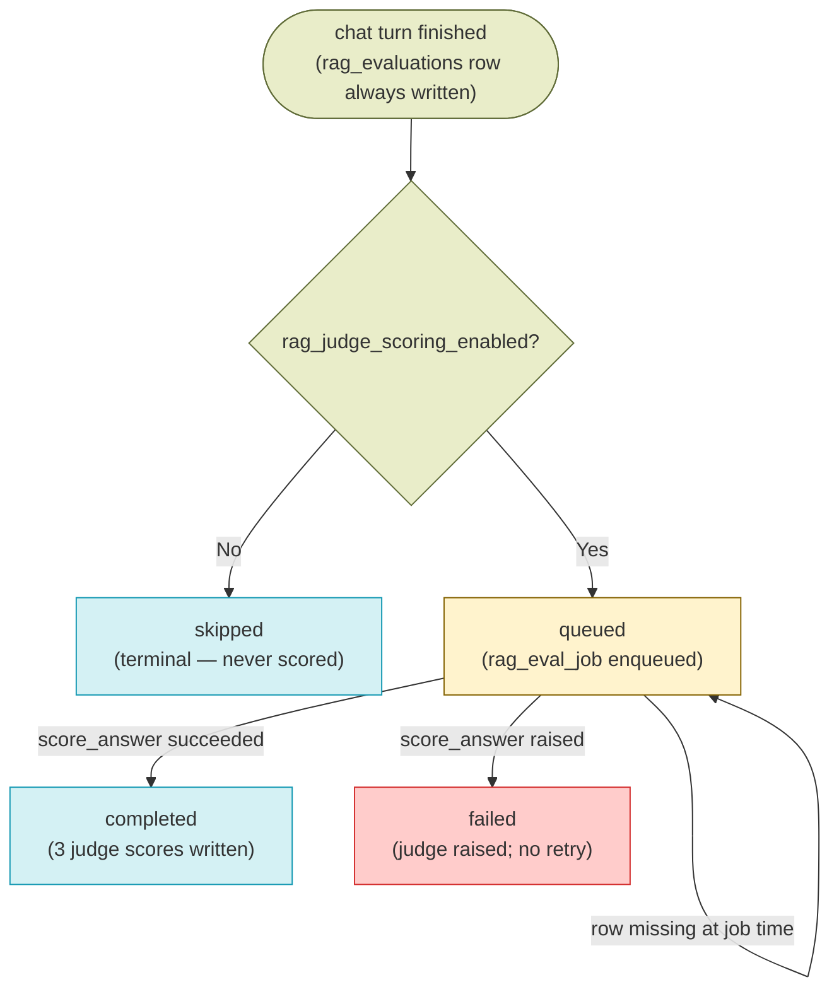

# Chat / RAG Retrieval — Design

See also: [WORKER_DESIGN.md](WORKER_DESIGN.md) for the ingestion pipeline overview. Prior stages that produce everything this stage reads: [DOCUMENT_DISCOVERY_DESIGN.md](DOCUMENT_DISCOVERY_DESIGN.md), [OCR_DESIGN.md](OCR_DESIGN.md), [CHUNKING_DESIGN.md](CHUNKING_DESIGN.md), [EMBEDDING_DESIGN.md](EMBEDDING_DESIGN.md), [SPELLCHECK_DESIGN.md](SPELLCHECK_DESIGN.md), [SUMMARY_DESIGN.md](SUMMARY_DESIGN.md). Next stage: [KNOWLEDGE_GRAPH_DESIGN.md](KNOWLEDGE_GRAPH_DESIGN.md) (also a producer this stage reads from, via `retrieval.graph_entity_lookup` — see Related Docs).

## Overview

Chat / RAG retrieval is the only *read* stage of the pipeline: it consumes the artifacts every prior stage produced (`chunks` + their embeddings, `book_summaries`, `pages.text`, `books` metadata) and turns a user question into a streamed, cited Uyghur answer. It is a synchronous request-path stage in the FastAPI backend — no worker job, no scanner, no page milestones. The one worker job in this doc (`rag_eval_job`) runs *after* the answer has already been streamed and persisted, and never blocks a request.

**One chat pipeline serves every request.** `ChatOrchestrator` (`packages/backend-core/app/services/chat/orchestrator.py`) — a two-agent Google-ADK pipeline with server-side conversation persistence, an LLM reranker, per-turn LLM cost tracking, and async judge scoring — is constructed unconditionally by both `POST /api/chat/` (via its non-streaming `answer()` wrapper) and `POST /api/chat/stream` (via `stream_response()`) in `services/backend/api/endpoints/chat_router.py`. There is no feature flag and no alternate pipeline; a prior split-brain design (a flag-gated legacy `RAGService`/`HandlerRegistry` path that the non-streaming endpoint never even consulted) was consolidated away — see the note at the end of this section.

Key characteristics:

- **Retrieval is tool-driven, not hand-routed.** `ChatOrchestrator` builds a `QueryContext` (`rag/context.py`) and drives all 20 ADK tools (`rag/agent/tools.py`, listed via `ALL_TOOLS` in `chat/retrieval_agent.py`) over shared primitives (`rag/retrieval.py`: `embed_query`, `vector_search`, `find_books_by_title_in_question`, `graph_entity_lookup`), using `AGENT_SYSTEM_PROMPT` (`rag/agent/prompts.py`). A single-shot structured LLM call (`analyze_query_signals`, `chat/query_signals.py`) extracts pre-processing signals (intent, catalog/dictionary/Quran subtype hints, resolved book/author matches) before the retrieval agent runs. `signals["intent"]` is read directly for the `planning` SSE event, and `_resolve_catalog_shortcut()` reads `catalog_subtype`/`has_title`/`has_author`/`matched_books`/`matched_author_books`/`is_composite` directly to decide whether to skip the retrieval agent entirely (see the catalog-shortcut bullet below) — the rest of the extracted signal dict feeds the retrieval agent's system-prompt hints (see `build_retrieval_agent`).
- **Exact-phrase questions bypass the retrieval agent — unless the quoted text is actually a catalog book title.** `phrase_intent.detect_phrase_intent()` classifies a quoted phrase (`"..."` / `«...»` / `"..."`) or the explicit `ChatRequest.exact_phrase` flag as exact-phrase intent. Before honoring that intent, `ChatOrchestrator` runs a **catalog-first check**: when the phrase came from quotes (not the explicit flag) and the question isn't page-finding, it calls `find_books_by_title_in_question` directly; a match scopes the turn to those book(s) (`ctx.context_book_ids`) and flips `phrase_intent.is_exact` back to `False`, so the turn is routed through the normal retrieval agent (vector + graph) instead. Only when no book title matches — or the explicit `exact_phrase` flag/page-finding phrasing was used — does `ChatOrchestrator` answer from the keyword-only leg (`chat/exact_phrase.py` → `retrieval.exact_phrase_chunk_search` → `ChunksRepository.keyword_search`'s `phraseto_tsquery` match) instead. Vector search itself (`vector_search` in `retrieval.py`) is vector-only; there is no hybrid vector+keyword fusion (removed along with `rag_hybrid_search_enabled` — see Feature Flags). The retrieval agent does have its own separate lexical-assist tool, `search_keyword_phrase` (→ `agent_keyword_search` in `retrieval.py`), which it may call *alongside* `search_chunks` (never as a fusion within it) when a question names a distinguishing proper noun/date/term vector similarity might blur — see the Agent Tools table.
- **A named short-work (poem/song) title also bypasses both agents — deterministically, via the book's own table of contents.** On every turn (not gated on `phrase_intent.is_exact`), `detect_short_work_intent()` (`rag/short_work_intent.py`) looks for a quoted title next to a "find/show/give the full text of" locate verb — one quoted span is the candidate title, or the second of two quoted spans for the "«book» ناملىق ئەسەردىكى «work»" shape (the first span is presumed already resolved as a book title by the catalog-first check above). A match is then resolved against the scoped book's OCR'd ToC by `resolve_short_work()` (`rag/toc_lookup_service.py`), which walks `Page.is_toc` pages, matches the title exactly, and only accepts entries short enough to be a "work" rather than a chapter (`toc_short_work_max_pages`, default 10 printed pages) — verifying the resolved start page actually contains the matched heading before returning it. A resolved `ShortWorkMatch` short-circuits `ChatOrchestrator.stream_response()` completely: it skips the retrieval agent, the exact-phrase leg, grading/reranking, *and* the answer agent — `_format_short_work_answer()` builds the final answer directly from the ToC-resolved page text (block-quoted verbatim) plus a deterministic citation, with **no LLM call in the loop at all**, because Gemini's own reluctance to reproduce a full poem/song verbatim proved resistant to prompting it to do so. A miss at any stage (no ToC, no title match, entry too long) is a pure no-op — the turn falls through to the normal `phrase_intent.is_exact` / retrieval-agent path unaffected.
- **A clean author/book-catalog lookup also bypasses both agents — deterministically, reusing the signal-extraction call's own tool results.** `analyze_query_signals`'s single-shot classification already calls `find_books_by_title` / `get_books_by_author` when it detects `catalog_subtype` `"author_of"` / `"books_by"`, returning `matched_books` / `matched_author_books` alongside the classification. `_resolve_catalog_shortcut()` (`orchestrator.py`) checks that already-computed result for a clean, non-composite match — for `"author_of"`, every matched row (one per volume on a multi-volume title) must share the same book title; for `"books_by"`, at least one matched book must carry a resolved author name — and on a match, `_format_catalog_answer()` templates the final answer directly (`t("rag.author_of_book")` or `t("rag.books_by_author_header")` plus a per-book `volume_label`/`pages_suffix` line) with **no LLM call at all**, folding into the same `skip_answer_synthesis` short-circuit the short-work gate uses: the retrieval agent, reranking/grading, and the answer agent are all skipped. This exists purely to cut cost/latency for a query the retrieval agent could already answer via its own `get_book_author`/`get_books_by_author` tools, but only after paying for two full LLM turns (the agent loop plus the answer agent) on top of the signal-extraction call that already had the data. Anything not cleanly resolved — multiple distinct matched titles, no match, or a composite question — falls straight through to the normal retrieval-agent path, unaffected.
- **The judge is opt-in per turn, not per pipeline.** Every turn writes a `rag_evaluations` row; `rag_judge_scoring_enabled` decides whether that row is `eval_status='queued'` (and `rag_eval_job` gets enqueued) or `'skipped'`.
- **Every turn's LLM token usage is tracked for cost estimation.** `QueryContext.cost_tracker` (a `CostTracker`, `app/llm/cost_tracker.py`) accumulates a `CostEntry` (stage, model, input/output tokens) from every Gemini call the turn makes — query-signal extraction, the retrieval agent's ADK run, the reranker, the answer agent's ADK run, and an estimated per-call cost for embeddings (which carry no `usage_metadata`, so `GeminiEmbeddings.aembed_query` estimates `len(text)//4` input tokens). `ProtectedLLM.ainvoke`/`.astream` (`app/llm/models.py`) auto-attribute usage to the active turn's `CostTracker` via the same `get_current_query_context()` ContextVar the retrieval tools use. Cost is priced from a static table (`app/llm/pricing.py`'s `MODEL_PRICING`, $/1M tokens, falling back to the default chat model's rate for an unrecognized model) and totalled via `cost_tracker.as_dict()` into `rag_evaluations.input_tokens` / `output_tokens` / `cost_usd` at turn-persistence time — see Schema. The async judge call (`rag_eval_job`, off the request path, outside any `QueryContext`) reports its own usage back through an explicit `usage_out` dict parameter instead, backfilled into `rag_evaluations.judge_cost_usd`.
- **Book summaries drive book routing, not answer content.** `search_books_by_summary` / `get_book_summary` (see [SUMMARY_DESIGN.md](SUMMARY_DESIGN.md)) narrow *which* books to search before `search_chunks` runs; chunk passages remain the citable evidence.
- **Composite/multi-part question decomposition no longer exists as a distinct mechanism.** An earlier design ran an explicit LLM-driven question-splitting step and fanned sub-questions out concurrently. That machinery was part of the deleted legacy pipeline and was never wired into `ChatOrchestrator`; `analyze_query_signals` still asks the model for `is_composite`/`sub_questions` in its structured JSON response, but nothing reads those two fields today. A compound question is handled implicitly by the retrieval agent's own multi-turn tool-calling loop, not by a dedicated splitting/fan-out step.

> **Prior design note:** before the ADK-chat consolidation, this stage ran two independent pipelines — `ChatOrchestrator` and a legacy `RAGService`/`HandlerRegistry` combination (itself dispatching to a `DeterministicRAGHandler` or `LLMRoutedRAGHandler`) — selected per-request by a `use_adk_chat_v2` flag and `conversationId` presence, with the non-streaming endpoint unable to reach `ChatOrchestrator` at all regardless of the flag. That legacy pipeline, its ADK agent duplicate (`rag/agent/adk_agent.py`), and its dead `agent_max_steps`/`agent_enough_chunks`/`use_deterministic_router` config keys have been deleted; `ChatOrchestrator` is now the only implementation. See `docs/superpowers/plans/2026-08-12-adk-chat-consolidation.md` for the migration.

## Feature Flags

All are `system_configs` rows read per request (hot-reloadable, no deploy).

| Flag | Default | Gates |
|---|---|---|
| `rag_reranker_enabled` | `"true"` (`app/db/seeds.py`) | Use `rerank_context` (one extra Gemini call on the live request path) instead of `_grade_context`. |
| `rag_judge_scoring_enabled` | `"true"` (`app/db/seeds.py`) | Write `eval_status='queued'` and enqueue `rag_eval_job`. `"false"` writes `'skipped'` and enqueues nothing. |

`rag_hybrid_search_enabled` no longer exists — RRF fusion between a vector leg and a keyword leg was removed from `vector_search()` (it is vector-only). Keyword (full-text) matching survives only as the separate exact-phrase leg gated by phrase intent (quoted text or the `exact_phrase` request flag), not by a system-wide toggle — see the exact-phrase bullet above and `rag_keyword_top_k` / `rag_vector_top_k` / `rag_graph_top_k` in Configuration Reference.

`use_adk_chat_v2`, `use_deterministic_router`, and `rag_eval_enabled` no longer exist *in code that reads them* — they selected between pipelines/handlers that have since been deleted (see the prior design note above). `agent_max_steps` and `agent_enough_chunks` were never true feature flags (nothing consumed the `QueryContext` fields they populated) and are also gone from `seeds.py`. Migrations `072_add_conversations.sql`, `044_eval_status_constraint_and_config_seed.sql`, and `052_add_use_deterministic_router_config.sql` still insert `use_adk_chat_v2` / `rag_eval_enabled` / `use_deterministic_router` rows respectively on any environment that runs migrations from scratch — harmless rows nothing reads, but they do come back on a fresh database (see `docs/superpowers/plans/2026-08-12-adk-chat-consolidation.md` Task 7 Step 4).

## Schema

This stage **writes** four tables and **reads** the artifacts of every prior stage (`books`, `pages`, `chunks`, `book_summaries`, `quran`, and the dictionary/proverb/synonym tables via the dictionary tools).

### `conversations` (written by `ChatOrchestrator` only)

| Column | Type | Description |
|---|---|---|
| `id` | `varchar(36)`, PK | UUID; also used verbatim as the ADK session id for both the retrieval and answer runners. |
| `user_id` | `varchar(36)`, FK → `users.id` (`CASCADE`) | Owner. Every conversation endpoint checks `conv.user_id == current_user.id`. |
| `book_id` | `varchar(64)`, FK → `books.id` (`SET NULL`), nullable | Set only for reader-mode conversations; `NULL` when `is_global`. |
| `is_global` | `boolean`, not null, default `false` | Library-wide vs. single-book conversation. |
| `title` | `varchar(200)`, nullable | Derived from the first question (`cleaned_q[:37] + "..."` when longer than 40 chars); also backfilled when the existing title is one of the placeholder values `NULL`/`""`/`يېڭى سۆھبەت`/`New Conversation`/`سۆھبەت`. |
| `created_at`, `updated_at` | `timestamptz`, not null, default `CURRENT_TIMESTAMP` | |
| `deleted_at` | `timestamptz`, nullable | Soft delete — `DELETE /api/chat/conversations/{id}` sets this rather than removing the row (added by migration `073_add_conversations_soft_delete.sql`; see note below). |

### `conversation_messages` (written by `ChatOrchestrator` only)

| Column | Type | Description |
|---|---|---|
| `id` | `varchar(36)`, PK | UUID. |
| `conversation_id` | `varchar(36)`, FK → `conversations.id` (`CASCADE`), not null | |
| `role` | `varchar(10)`, not null, `CHECK (role IN ('user','model'))` | Two rows are written per turn by `ConversationRepository.save_turn()`. |
| `content` | `text`, not null | Question text for `user`; citation-fixed answer text for `model`. |
| `agent_steps` | `jsonb`, nullable | `{"llm_calls": <observation count>, "tools": [tool names]}` on the `model` row. |
| `used_book_ids` | `jsonb`, nullable | Output of `_extract_used_book_ids(observations)`. |
| `current_page` | `integer`, nullable | Reader page at ask time, on the `user` row. |
| `eval_id` | `integer`, FK → `rag_evaluations.id` (`SET NULL`), nullable | Links the `model` row to its evaluation. |
| `created_at` | `timestamptz`, not null, default `CURRENT_TIMESTAMP` | |

`conversations` / `conversation_messages` and `rag_evaluations.conversation_id` are created by migration `072_add_conversations.sql`; `conversations.deleted_at` is added separately by `073_add_conversations_soft_delete.sql` (which also creates a partial index filtered on `deleted_at IS NULL`), with `073_rollback_add_conversations_soft_delete.sql` as its paired rollback. `rag_evaluations`'s four cost columns are added by `092_add_llm_cost_tracking_to_rag_evaluations.sql` (paired rollback `092_rollback_add_llm_cost_tracking_to_rag_evaluations.sql`), which also seeds the `rag_chat_cost_enabled` system_configs row — see Configuration Reference. The ORM also declares `ConversationMessage.evaluation` (a `lazy="selectin"` relationship to `RAGEvaluation` via `eval_id`), which `GET /api/chat/conversations/{id}/messages` uses to surface each message's `cost` and `feedback` without an extra query per row.

### `rag_evaluations` (written by `ChatOrchestrator`, updated by `rag_eval_job`)

| Column | Type | Description |
|---|---|---|
| `id` | `integer`, PK, autoincrement | Sequential — the `POST /api/chat/feedback` handler therefore ownership-checks before mutating. |
| `book_id`, `is_global`, `question`, `current_page` | `varchar(64)` / `boolean` / `text` / `integer` | Query context. |
| `retrieved_count`, `context_chars`, `scores`, `category_filter` | `integer` / `integer` / `float[]` / `text[]` | Retrieval metrics. Populated differently per pipeline — see Component Responsibilities. |
| `user_id` | `varchar(36)`, FK → `users.id` (`SET NULL`) | Asker. |
| `latency_ms`, `answer_chars` | `integer` | Wall-clock turn latency and answer length. |
| `agent_steps`, `tools_called`, `retry_count`, `final_chunk_count` | `integer` / `text[]` / `integer` / `integer` | Agent-execution metrics. |
| `faithfulness_score`, `answer_relevance_score`, `context_precision_score` | `float`, nullable | Written **only** by `rag_eval_job` from `JudgeScores`. |
| `context_recall_score` | `float`, nullable | Column exists; no code writes it today. |
| `eval_status` | `varchar(20)`, not null, default `'skipped'`, `CHECK (eval_status IN ('queued','skipped','completed','failed'))` | See State Machine. |
| `answer`, `retrieved_context` | `text`, nullable | The final answer and the graded/reranked context — the judge's inputs. |
| `user_feedback` | `varchar(10)`, nullable | `'positive'` / `'negative'` from `POST /api/chat/feedback`. |
| `conversation_id` | `varchar(36)`, FK → `conversations.id` (`SET NULL`), nullable | Set by `ChatOrchestrator` after insert. |
| `is_first_turn` | `boolean`, not null, default `false` | `True` when the conversation was just created this turn. |
| `show_on_homepage` | `boolean`, not null, default `false` | Admin-curated flag for the home-page rotator. |
| `input_tokens`, `output_tokens` | `integer`, not null, default `0` | Summed token usage for the synchronous chat turn (query-signal extraction, retrieval agent, reranker, answer agent, estimated embedding) — from `ChatOrchestrator`'s `ctx.cost_tracker.as_dict()`. Added by migration `092_add_llm_cost_tracking_to_rag_evaluations.sql`. |
| `cost_usd` | `numeric(12,6)`, not null, default `0` | Estimated USD cost of the same turn, priced via `app/llm/pricing.py`'s static `MODEL_PRICING` table. Not a billing-grade reconciliation — a best-effort estimate for trend/eval purposes. |
| `judge_cost_usd` | `numeric(12,6)`, nullable | Estimated cost of the async judge call, written **only** by `rag_eval_job` (`usage_out` reported back from `judge.score_answer`) — `NULL` until that job runs, same lifecycle as the three judge scores. |
| `ts` | `timestamptz`, not null, default `now()`, indexed | |

### `user_chat_usage` (written by `chat_limit_service`)

| Column | Type | Description |
|---|---|---|
| `id` | `integer`, PK, autoincrement | |
| `user_id` | `varchar(36)`, FK → `users.id` (`CASCADE`), indexed, not null | |
| `usage_date` | `date`, not null, default `current_date`, indexed | Unique together with `user_id`. |
| `count` | `integer`, default `1` | Durable counter; Redis `chat:usage:{user_id}:{date}` is the fast path. |

## Architecture

| File | Purpose |
|---|---|
| `services/backend/api/endpoints/chat_router.py` | All chat HTTP surface: builds a `ChatOrchestrator` per request (unconditionally — no flag, no branch) for both `POST /api/chat/` (via `answer()`) and `POST /api/chat/stream` (via `stream_response()`); SSE framing; per-request daily-limit enforcement; conversation and feedback endpoints. |
| `packages/backend-core/app/services/chat/orchestrator.py` | `ChatOrchestrator.stream_response()` — conversation get-or-create, phrase-intent/catalog-first/short-work/catalog-shortcut gates, signal pre-processing, retrieval agent run, rerank/grade, answer agent run, citation fix, eval insert (now including token/cost totals) + `rag_eval_job` enqueue, turn persistence. `_format_short_work_answer()` renders a resolved `ShortWorkMatch` as the final answer with no LLM call. `_resolve_catalog_shortcut()` / `_format_catalog_answer()` do the same for a clean `author_of`/`books_by` catalog signal from `analyze_query_signals` — see Overview. `ChatOrchestrator.answer()` — non-streaming wrapper that drains `stream_response()` and returns `{answer, conversation_id, used_book_ids, eval_id}` (cost is dropped in this wrapper — only the streaming `done` event carries `cost`), used by `POST /api/chat/`. |
| `packages/backend-core/app/services/chat/context.py` | `ChatRequestDTO` (frozen dataclass the router builds from `ChatRequest`, now including `exact_phrase: bool = False`) and `ToolDependencies`. |
| `packages/backend-core/app/services/chat/context_grading.py` | `_build_human_message()`, `_grade_context()`, `_extract_used_book_ids()` — context formatting/grading helpers imported by `orchestrator.py`. |
| `packages/backend-core/app/services/chat/query_signals.py` | `analyze_query_signals()` — the single-shot structured-JSON signal-extraction LLM call, plus `repair_json_unescaped_quotes()`; imported by `orchestrator.py`. Records its own token usage onto `ctx.cost_tracker` under `stage="query_signals"`. |
| `packages/backend-core/app/services/chat/history.py` | `format_history_for_analysis()` — renders `ConversationMessage` rows as `User: …` / `Assistant: …` lines. |
| `packages/backend-core/app/services/chat/exact_phrase.py` | `run_exact_phrase_retrieval()` — wraps `retrieval.exact_phrase_chunk_search` and packages its hits as a `search_chunks`-shaped observation so the normal grading/rerank/answer-agent pipeline can consume them unchanged; `format_page_hits()` — structured payload for the `page_hits` SSE event; `summarize_page_hits_as_text()` — plain-text fallback for conversation persistence when the turn skips answer synthesis. |
| `packages/backend-core/app/services/rag/phrase_intent.py` | `detect_phrase_intent(text, exact_phrase_flag)` → `PhraseIntent(is_exact, phrases, is_page_finding)`. A quoted span (`"..."` / `«...»` / `"..."`) or the explicit `exact_phrase` flag marks exact-phrase intent; multiple quoted phrases are ANDed by the retrieval leg. `«...»` is reserved exclusively for this now — it no longer marks a quoted book title (see `retrieval.find_books_by_title_in_question` / `rag/utils.entity_matches_question`, both changed accordingly). |
| `packages/backend-core/app/services/rag/short_work_intent.py` | `detect_short_work_intent(text)` → `ShortWorkIntent(applies, title)` — a deterministic, non-LLM gate for "locate this named poem/song" questions: a quoted title next to a locate verb (`تېپىپ بەر`, `كۆرسەت`, `تولۇق تېكىستى`, `تېكىستى قانداق`, `مەزمۇنى`), excluding authorship-question phrasings. Run unconditionally by `ChatOrchestrator`, independent of `phrase_intent.is_exact`. |
| `packages/backend-core/app/services/rag/toc_lookup_service.py` | `resolve_short_work(session, title, book_id=None)` → `Optional[ShortWorkMatch]` — resolves a short-work title straight to its exact page range via the book's OCR'd table of contents (`Page.is_toc`, `parse_toc_entries`), rejecting ToC entries that span more than `toc_short_work_max_pages` printed pages (a chapter, not a short work) and verifying the resolved start page actually contains the matched heading. A pure additive shortcut — every miss returns `None` rather than asserting the content doesn't exist, so callers must fall through to the normal retrieval agent. |
| `packages/backend-core/app/services/chat/retrieval_agent.py` | `ALL_TOOLS` (the 20-tool list, defined here) and `build_retrieval_agent()` — ADK `Agent` named `KitabimRetrievalAgent` over `ALL_TOOLS` with `AGENT_SYSTEM_PROMPT` plus appended "Structured Intent Hints" derived from the extracted signals. |
| `packages/backend-core/app/services/chat/answer_agent.py` | `build_answer_agent()` — tool-less ADK `Agent` named `KitabimAnswerAgent`; the graded context is embedded directly into its `instruction`. |
| `packages/backend-core/app/services/chat/answer_prompts.py` | `build_answer_instructions()` — the orchestrator's own citation/grammar instruction builder (a parallel implementation of `answer_builder.build_instructions`). Also instructs the Answer Agent to reproduce a requested work's full text verbatim (blockquoted, original line breaks preserved) rather than refuse or hedge with a copyright disclaimer — a fallback for verbatim-quote requests the deterministic short-work ToC gate (`rag/short_work_intent.py` / `rag/toc_lookup_service.py`) doesn't catch, e.g. a work not present in the book's ToC. |
| `packages/backend-core/app/services/rag/context.py` | `QueryContext` dataclass + `set_current_query_context()` / `get_current_query_context()` ContextVar (the fallback path tools use when ADK state is empty). Also holds `cost_tracker: CostTracker` (default-constructed per turn) — see `llm/cost_tracker.py`. Still declares `agent_max_steps: int = 6` / `agent_enough_chunks: int = 8` fields — dead, nothing sets or reads them now that the config keys that used to populate them are gone. |
| `packages/backend-core/app/services/rag/retrieval.py` | Shared, LLM-free retrieval primitives: `embed_query` (L1 cache), `vector_search` (L2 cache, vector-only, per-book isolated-session quotas, threshold retry, dev-only fuzzy fallback, Quran merge), `exact_phrase_chunk_search` (keyword-only, ANDed-phrase leg behind `ChatOrchestrator`'s exact-phrase gate), `graph_entity_lookup` (own Redis cache, prefix + IDF scoring, Neo4j fuzzy fallback), `find_books_by_title_in_question`. |
| `packages/backend-core/app/services/rag/agent/tools.py` | The 20 ADK tool declarations, `_execute_and_record_tool` (writes `tool_context.state["observations"]`), `_dispatch_tool_with_retry` (name→implementation switch), and every `_run_*` implementation. |
| `packages/backend-core/app/services/rag/agent/prompts.py` | `AGENT_SYSTEM_PROMPT` — the 8-step retrieval decision tree plus `_HARD_LIMITS`, used by the retrieval agent. |
| `packages/backend-core/app/services/rag/agent/reranker.py` | `rerank_context()` — LLM reranker; raises on any failure so the caller can fall back. Called only from `orchestrator.py`. |
| `packages/backend-core/app/services/rag/agent/config.py` | Numeric constants: `AGENT_MAX_STEPS`, `AGENT_ENOUGH_CHUNKS`, `AGENT_MAX_CONTEXT_CHUNKS`, `GRADE_RELATIVE_THRESHOLD`, `MIN_CHUNKS_AFTER_GRADING`, `RERANK_MAX_INPUT_CHUNKS`, `CONTEXT_SWITCH_SCORE_THRESHOLD`. `RRF_K` was removed along with RRF fusion (see `retrieval.py`). `AGENT_MAX_STEPS`/`AGENT_ENOUGH_CHUNKS` have no importers anywhere in the repo today — dead code, the constant-level counterparts of the dead `QueryContext` fields above. |
| `packages/backend-core/app/services/rag/answer_builder.py` | `Document`, `format_document()` (the `[BookID: …, Page: N]` header the citation instructions reference), `build_instructions()`. Also still defines `generate_answer_stream()`, the deleted legacy pipeline's answer synthesis — now dead code with zero callers anywhere in the repo (`ChatOrchestrator` builds its answers through `KitabimAnswerAgent` instead), not yet removed. |
| `packages/backend-core/app/services/rag/query_rewriter.py` | `QueryRewriter.rewrite()` — L0-cached follow-up rewriting behind the `rewrite_query` tool. |
| `packages/backend-core/app/services/rag/judge.py` | `JudgeScores` dataclass + `score_answer(question, answer, context, model, usage_out=None)` — single combined faithfulness/answer_relevance/context_precision LLM call. Called only from the worker; `usage_out` (a dict the caller passes in) is how `rag_eval_job` reads back this call's token usage, since the worker runs outside any live turn's `QueryContext`/`CostTracker`. |
| `packages/backend-core/app/services/rag/handlers/catalog.py` | `CatalogHandler` — static helpers `_build_catalog_context()` / `_prepend_current_book()` behind the `search_catalog` tool. Despite its module docstring calling it a handler, it is a plain static-method helper class, not an ADK agent or a routing construct. |
| `packages/backend-core/app/services/rag/llm_resources.py` | Cached `get_embeddings` / `get_rag_chain` / `get_rewrite_chain` factories. |
| `packages/backend-core/app/services/rag/keywords.py`, `utils.py` | Uyghur keyword/pronoun lists and `normalize_uyghur` / `format_chat_history` / `fuzzy_token_similar` / `is_islam_or_quran_query`. |
| `packages/backend-core/app/llm/cost_tracker.py` | `CostTracker` (a list of `CostEntry(stage, model, input_tokens, output_tokens, estimated)`) — the per-turn token/cost accumulator attached to `QueryContext.cost_tracker`. `.add()` is a no-op for a zero-token call; `.as_dict()` returns the totals `orchestrator.py` writes into `rag_evaluations`. |
| `packages/backend-core/app/llm/pricing.py` | Gemini pricing module + `estimate_cost_usd(model, input_tokens, output_tokens)`. Configured dynamically via `system_configs` key `sys_llm_model_pricing` (with Redis cache) and falls back to `DEFAULT_MODEL_PRICING` / `_FALLBACK_PRICE` ($ per 1M tokens) if unconfigured or unparseable. |
| `packages/backend-core/app/llm/models.py` | `ProtectedLLM.ainvoke()` / `.astream()` — the shared Gemini call wrapper (circuit breaker, timeout, retry). Also `_record_usage()`, called after every call: reads `response.usage_metadata`, attributes it to the active turn's `CostTracker` via `get_current_query_context()` when one exists, and/or writes it into a caller-supplied `usage_out` dict (for callers like `rag_eval_job` that run outside a turn's `QueryContext`). `GeminiEmbeddings.aembed_query` estimates embedding cost the same way (`len(text)//4` input tokens, `estimated=True`), since Gemini's `embedContent` response carries no `usage_metadata`. |
| `packages/backend-core/app/services/chat_limit_service.py` | `ChatLimitService` singleton — per-role daily limits, Redis+Postgres usage counters (atomic Lua `INCR`+`EXPIRE`). |
| `packages/backend-core/app/db/repositories/conversation_repository.py` | `create_conversation`, `get_conversation`, `list_user_conversations`, `add_message`, `get_conversation_messages` (full history, oldest-first — what the messages endpoint serves), `get_recent_messages` (the last N turns the orchestrator feeds to signal extraction), `save_turn`, `update_title`, `delete_conversation` (soft). |
| `packages/backend-core/app/db/repositories/rag_evaluations_repository.py` | `create_evaluation` (now also takes `input_tokens` / `output_tokens` / `cost_usd`, all defaulting to `0`), `update_feedback`, `get_recent_standalone_questions`, `get_questions_paginated`, `toggle_show_on_homepage`, `get_featured_questions`, plus the generic `get` / `update_one` inherited from `BaseRepository` (the only two `rag_eval_job` uses — `update_one` is how it writes `judge_cost_usd` alongside the three judge scores). |
| `services/worker/jobs/rag_eval_job.py` | `rag_eval_job(ctx, eval_id)` — post-turn async judge scoring; also estimates and backfills `judge_cost_usd` via `pricing.estimate_cost_usd()` from the `usage_out` dict `score_answer` fills in. Not a pipeline/cron job. |
| `services/backend/api/endpoints/questions_router.py` | Admin/public views over `rag_evaluations` questions (curation + home-page rotator). |
| `services/backend/main.py` | Startup: builds the ADK `DatabaseSessionService` into `app.state.adk_session_service` (falls back to `None` on failure); mounts `chat_router` at `/api/chat`, `ai_router` at `/api/ai`, `questions_router` at `/api/questions`. |

### Agent Tools

All 20 tools are registered once, in `ALL_TOOLS` (`chat/retrieval_agent.py`), and passed to the single retrieval agent `build_retrieval_agent()` builds. Every tool function lives in `packages/backend-core/app/services/rag/agent/tools.py` and dispatches through `_execute_and_record_tool`, which appends the call to `tool_context.state["observations"]`. Cache tiers referenced below are the L0/L1/L2 layers defined in [Cache Layers](#cache-layers).

**Content Retrieval**

| Tool | Wraps | Cache | Description |
|---|---|---|---|
| `search_chunks` | `vector_search` (pgvector `ChunksRepository.similarity_search`, vector-only — no keyword fusion) | L1 (`embed_query`) + L2 (`vector_search` results) | Vector-search passages; the primary retrieval tool. Also appends knowledge-graph facts via `graph_entity_lookup` (own Redis cache, no LLM call, capped by `rag_graph_top_k`) as extra chunk-shaped results titled with the i18n key `rag.knowledge_graph_title` (`t("rag.knowledge_graph_title", default="بىلىم گىرافى")` — Uyghur "بىلىم گىرافى" by default and for the `ug` locale; `en.json` has it as the English "Knowledge Graph") — see [KNOWLEDGE_GRAPH_DESIGN.md](KNOWLEDGE_GRAPH_DESIGN.md). Exact-phrase (quoted) questions bypass this tool entirely on the `ChatOrchestrator` path — see the exact-phrase leg in Overview. |
| `search_keyword_phrase` | `agent_keyword_search` (`retrieval.py`) → `ChunksRepository.keyword_search` (same `phraseto_tsquery` phrase match and `rag_keyword_top_k` cap as the exact-phrase leg, but no vector fusion) | none (Postgres queried every call) | A supplement the agent calls *alongside* `search_chunks` (never instead of it) for a short (2-6 word), specific, distinguishing phrase — a proper noun, exact date, or rare term vector similarity might blur or miss. An explicit empty `book_ids` list is treated the same "broaden to the whole library" way `search_chunks` treats it (see `vector_search` below), not as "return nothing." Added in a separate commit (`9486b61`, 2026-08-24) after the last full doc sync. |
| `search_books_by_summary` | `BookSummariesRepository.summary_search` (pgvector over `book_summaries.embedding`) | L1 (`embed_query`) only — the search results themselves are not cached; `KEY_RAG_SUMMARY_SEARCH` is defined but never written (see Cache Layers) | Find which book(s) cover a topic when book scope is unknown ("book routing" — see [SUMMARY_DESIGN.md](SUMMARY_DESIGN.md)). |
| `find_books_by_title` | `find_books_by_title_in_question` (`retrieval.py`) plus a fuzzy-keyword fallback over `Book` when strict matching finds nothing | In-request only (`ctx._title_cache`, a plain dict — not a Redis tier) | Resolve a book title mentioned in the question to internal book IDs via fuzzy word-prefix matching; includes a false-positive guard for lone single-word matches. Quoting the title (`«...»`) no longer has any special effect on this tool's own matching — it resolves the same whether quoted or not, since `«...»` now primarily signals exact-phrase-search intent elsewhere in the pipeline (see `phrase_intent.py`). Note this is distinct from `ChatOrchestrator`'s own catalog-first check (see Overview and the `stream_response` pseudocode step 6), which calls the same `find_books_by_title_in_question` primitive directly — outside this tool — specifically to decide whether a quoted phrase should be treated as a book title instead of an exact-phrase search. |
| `get_book_summary` | `BookSummariesRepository.get_summaries_for_books`, with a `PagesRepository.find_first_pages_with_text` intro-excerpt fallback | none | Full semantic summary text for specific books, with server-side sister-volume expansion; falls back to a ≤2,000-char intro excerpt per book when no summary row exists yet. |
| `get_current_page` | `PagesRepository` | none | Raw text of the page currently open in the reader (reader mode only). |
| `get_sister_volumes` | `BooksRepository.find_sister_volumes` | none | Other volumes of the same series as a given `book_id`. |
| `rewrite_query` | `QueryRewriter.rewrite` | L0 (`KEY_RAG_REWRITE`) | Resolves co-references/pronouns using conversation history. |

**Catalog & Metadata**

| Tool | Wraps | Cache | Description |
|---|---|---|---|
| `get_book_author` | `BooksRepository.find_author_by_title_in_question` | none | Author lookup for "who wrote X?" questions; falls back to the current reader-mode book on a deictic reference ("this book"). |
| `get_books_by_author` | `BooksRepository.find_books_by_author_in_question` | none | Book list for "what did Y write?" questions. |
| `search_catalog` | `CatalogHandler._build_catalog_context` / `_prepend_current_book` | none | Library browsing/general listing queries. Despite its module name, `CatalogHandler` is a plain static-method helper class, not an ADK agent — it exists only behind this tool. |

**Dictionary & Language (8 tools)**

| Tool | Wraps | Cache | Description |
|---|---|---|---|
| `lookup_uyghur_word` | `DictionaryRepository.lookup_uyghur_definition` (`dictionary` table) | none | Uyghur word definition lookup. |
| `lookup_history_term` | `DictionaryRepository.lookup_history_term`, falling back to `search_language_sources` when empty | none | Historical term/person/event/place lookup. |
| `translate_english_to_uyghur` | `DictionaryRepository.translate_english_to_uyghur` | none | English → Uyghur translation. |
| `check_word_spelling` | `DictionaryRepository.check_word_spelling` (`words` table — spellcheck's own dictionary, see [SPELLCHECK_DESIGN.md](SPELLCHECK_DESIGN.md)) | none | Uyghur spelling validity check, with suggested corrections. |
| `search_language_sources` | `DictionaryRepository.search_language_sources` (fans out across dictionary/history/English/names sources) | none | Fallback dictionary search across sources when the source type is unclear. |
| `lookup_uyghur_name` | `DictionaryRepository.lookup_name`, or a direct `NamesDictionary` letter-group query | none | Uyghur person-name lookup (meaning, or listing by starting letter). |
| `lookup_proverbs` | `ProverbsRepository` (`get_random_proverb`, or a direct regex `Proverb` query) | none | Uyghur proverb/saying lookup, with volume/page reference when available. |
| `lookup_synonyms` | `SynonymsRepository` (`lookup_word` / `search_fuzzy` / `list_by_letter_group`) | none | Synonym-dictionary lookup. |

**Quran**

| Tool | Wraps | Cache | Description |
|---|---|---|---|
| `search_quran` | Direct `quran` table query: surah/ayah lookup, or pgvector semantic search with an `ILIKE` keyword fallback | L1 (`embed_query`) when doing semantic search; no dedicated results cache | Surah/ayah lookup or free-text search within the Quran (a source separate from the book library); also returns surah metadata (total ayah count, Uyghur/Arabic/English surah names) for every surah touched by the results. |

8 + 3 + 8 + 1 = 20 tools total, matching the count referenced throughout this doc's Data Flow, Component Responsibilities, and Testing sections.

## Data Flow

```mermaid
flowchart TD
    Q(["ChatRequest<br/>question ≤ 500 chars, Arabic script<br/>bookId / isGlobal / currentPage / characterId /<br/>conversationId / contextBookIds / history / exactPhrase"])
    LIMIT{"chat_limit_service:<br/>has_reached_limit?"}
    L429["429 (POST /) or<br/>SSE {error} (POST /stream)"]
    EP["POST /api/chat/ (via answer())<br/>or POST /api/chat/stream (via stream_response())<br/>— both build a ChatOrchestrator unconditionally"]

    subgraph Orchestrator ["ChatOrchestrator — orchestrator.py"]
        CONV[("conversations:<br/>get-or-create + title,<br/>load last 6 messages")]
        OCTX["Build QueryContext<br/>+ set_current_query_context<br/>(incl. cost_tracker)"]
        PGATE{"phrase_intent.is_exact?<br/>(quoted text, or<br/>exactPhrase flag)"}
        CATFIRST{"Catalog-first: quoted (not<br/>explicit flag), not page-finding,<br/>AND find_books_by_title_in_question<br/>matches a book?"}
        SWGATE{"detect_short_work_intent<br/>(quoted title + locate verb)?<br/>AND resolve_short_work<br/>(book's ToC) matches?"}
        SWANS["_format_short_work_answer:<br/>ToC page text quoted verbatim<br/>+ citation — NO LLM call"]
        PBRANCH{"phrase_intent.is_exact?<br/>(re-checked after catalog-first<br/>+ short-work, either may<br/>have flipped it to false)"}
        EXACT["exact_phrase_chunk_search<br/>(keyword-only leg, phrases<br/>ANDed via chunks.text_search)"]
        PAGEQ{"phrase_intent.is_page_finding?"}
        PAGEHITS["format_page_hits →<br/>{type:page_hits} SSE event;<br/>summarize_page_hits_as_text<br/>— no answer-agent call"]
        SIG["analyze_query_signals<br/>(chat/query_signals.py) → planning<br/>(records query_signals cost)"]
        CATGATE{"_resolve_catalog_shortcut:<br/>author_of/books_by signal +<br/>unambiguous matched_books/<br/>matched_author_books?"}
        CATANS["_format_catalog_answer:<br/>title/author templated from<br/>signals — NO LLM call"]
        RETR["KitabimRetrievalAgent<br/>ADK Runner (SSE) over 20 tools<br/>→ tool_call / tool_result / agent_thinking<br/>(records retrieval_agent cost)"]
        RERANK{"rag_reranker_enabled?"}
        RR["rerank_context<br/>(LLM, max_chunks = rag_vector_top_k;<br/>records reranker cost)"]
        GC1["_grade_context<br/>(max_chunks = rag_vector_top_k)"]
        ANSA["KitabimAnswerAgent<br/>tool-less ADK Agent, graded context<br/>in instruction → answer_start / chunk / answer_end<br/>(records answer_agent cost)"]
        PERSIST[("rag_evaluations insert<br/>(incl. input_tokens/output_tokens/cost_usd<br/>from ctx.cost_tracker) +<br/>conversation_messages ×2 (save_turn)")]
        JUDGE{"rag_judge_scoring_enabled?"}
        ENQ["enqueue rag_eval_job<br/>(_job_id=rag_eval:&lt;eval_id&gt;)"]
    end

    subgraph Shared ["Shared retrieval — rag/agent/tools.py + rag/retrieval.py"]
        TOOLS["20 tools: search_chunks, search_keyword_phrase,<br/>search_books_by_summary, find_books_by_title, rewrite_query,<br/>get_book_author, get_books_by_author, search_catalog,<br/>get_book_summary, get_sister_volumes, get_current_page,<br/>search_quran, + 8 dictionary tools"]
        VS["embed_query (L1, estimated cost) →<br/>vector_search (L2, vector-only,<br/>per-book isolated DB sessions)<br/>+ Quran merge; then, in _run_search_chunks,<br/>graph_entity_lookup (own Redis cache, prefix + IDF<br/>scoring, Neo4j fuzzy fallback; capped by rag_graph_top_k)"]
        DATA[("chunks / book_summaries / pages /<br/>books / quran / dictionary tables")]
    end

    WORKER["rag_eval_job (arq worker):<br/>score_answer → faithfulness /<br/>answer_relevance / context_precision<br/>+ judge_cost_usd backfill"]
    OUT(["response to client:<br/>SSE chunk × N + done {usage, contextBookIds,<br/>evalId, conversationId, cost} on /stream,<br/>or a single {answer, usage} JSON body on POST /"])
    INC["chat_limit_service.increment_usage"]

    Q --> LIMIT
    LIMIT -- Yes --> L429
    LIMIT -- No --> EP
    EP --> CONV

    CONV --> OCTX --> PGATE
    PGATE -- "Yes (quoted, not flag,<br/>not page-finding)" --> CATFIRST
    PGATE -- "No (flag / page-finding /<br/>not quoted)" --> SWGATE
    CATFIRST -- "Match: scope to book(s),<br/>is_exact → false" --> SWGATE
    CATFIRST -- "No match" --> SWGATE
    SWGATE -- "Match: is_exact → false,<br/>scope to matched book" --> SWANS --> PERSIST
    SWGATE -- No match --> PBRANCH
    PBRANCH -- Yes --> EXACT
    PBRANCH -- No --> SIG --> CATGATE
    CATGATE -- Match --> CATANS --> PERSIST
    CATGATE -- "No match" --> RETR --> RERANK
    EXACT --> PAGEQ
    PAGEQ -- Yes --> PAGEHITS --> PERSIST
    PAGEQ -- No --> RERANK
    RERANK -- Yes --> RR
    RERANK -- "No, or rerank_context raised" --> GC1
    RR --> ANSA
    GC1 --> ANSA
    ANSA --> PERSIST --> JUDGE
    JUDGE -- Yes --> ENQ --> WORKER
    JUDGE -- No --> OUT
    ENQ --> OUT

    RETR --> TOOLS
    TOOLS --> VS --> DATA

    OUT --> INC

    classDef idle fill:#e9edc9,stroke:#606c38
    classDef active fill:#fff3cd,stroke:#856404
    classDef done fill:#d4f1f4,stroke:#189ab4
    classDef fail fill:#ffcccb,stroke:#d32f2f

    class Q,LIMIT,EP,PGATE,CATFIRST,SWGATE,PBRANCH,PAGEQ,RERANK,JUDGE,CATGATE idle
    class OCTX,SIG,RETR,EXACT,RR,GC1,ANSA,ENQ,TOOLS,VS,WORKER,INC active
    class CONV,PERSIST,PAGEHITS,SWANS,CATANS,DATA,OUT done
    class L429 fail
```



`POST /api/chat/`'s non-streaming `answer()` internally drives the exact same graph as `POST /api/chat/stream`'s `stream_response()` — it drains the same generator and concatenates `chunk` events into a single string rather than forwarding them over SSE. Both endpoints persist a conversation turn on every call, including the first turn on either endpoint (no more first-turn-only-on-stream split, and no more non-streaming endpoint that skipped conversation persistence entirely).

## Component Responsibilities

### ChatOrchestrator Pipeline

**`chat_router.chat_with_book_stream(req, ...)` (`POST /api/chat/stream`):**

```
1. require_reader auth dependency resolves current_user.
2. usage_status = chat_limit_service.get_user_usage_status(user, session).
   IF has_reached_limit: return a StreamingResponse whose only event is
   {"error": t("errors.daily_limit_reached")} (HTTP 200, not 429 — the
   non-streaming POST / raises 429 instead).
3. Inside event_generator(): unconditionally build
     orchestrator = ChatOrchestrator(session_service=
                      getattr(request.app.state,"adk_session_service",None))
     dto = ChatRequestDTO(..., is_global = req.is_global or
                                           req.book_id == "global", ...)
     stream orchestrator.stream_response(dto, session); on the "done" event
     increment usage and emit the SSE done payload.
```

**`chat_router.chat_with_book_api(req, ...)` (`POST /api/chat/`):**

```
1. require_reader auth dependency resolves current_user.
2. usage_status = chat_limit_service.get_user_usage_status(user, session).
   IF has_reached_limit: raise HTTPException(429, t("errors.daily_limit_reached")).
3. Build the same ChatOrchestrator + ChatRequestDTO as the stream endpoint,
   then result = await orchestrator.answer(dto, session) — this drains
   stream_response() internally, concatenating "chunk" events into a
   single string and reading conversation_id/used_book_ids/eval_id off
   the "done" event, returning {"answer", "conversation_id",
   "used_book_ids", "eval_id"}.
4. answer = fix_malformed_citations(result["answer"]); increment usage;
   return {"answer", "usage"}.
```

**`ChatOrchestrator.stream_response(request_dto, db_session, model_name="gemini-3.5-flash-lite")`:**

```
0. conv = get_conversation(conversation_id) if provided. IF None:
   create_conversation(user_id, book_id (None when is_global), is_global,
   title = first 37 chars + "..." when the cleaned question exceeds 40),
   is_first_turn = True. ELSE IF the existing title is a placeholder
   (None/""/"يېڭى سۆھبەت"/"New Conversation"/"سۆھبەت"): update_title.
1. history_msgs = get_recent_messages(conv_id, limit=6);
   history_str = format_history_for_analysis(history_msgs).
2. Resolve character (CHARACTERS[character_id] or DEFAULT_CHARACTER_ID
   "librarian") → persona_prompt, character_categories. Load the Book row
   when not global. Read rag_gemini_chat_model (falling back to the
   model_name argument), gemini_agent_loop_model (→ chat_model),
   embed_gemini_model (→ getattr(settings,
   "embed_gemini_model", "text-embedding-004") — and settings has no
   such attribute, so in practice the fallback is always the literal
   "text-embedding-004"). Missing model configs do NOT raise here — they
   silently fall back to the literal defaults above.
3. Build QueryContext and set_current_query_context(ctx) — the ContextVar
   is how tools reach the context if ADK session state is unavailable.
4. phrase_intent = detect_phrase_intent(question, exact_phrase_flag=
   request_dto.exact_phrase) — a quoted span («...», "...", "...") in the
   question, OR the explicit exactPhrase request flag, marks exact-phrase
   intent (multiple quoted phrases are ANDed).
5. Scope: IF not is_global and book_id → ctx.context_book_ids=[book_id];
   ELIF is_global and request context_book_ids → carry them forward.
6. Catalog-first phrase resolution: ONLY IF phrase_intent.is_exact came
   from quoted text (not the explicit exactPhrase flag) AND the question
   is not page-finding: call find_books_by_title_in_question(question,
   db_session, categories=ctx.character_categories) directly — the same
   primitive the find_books_by_title tool wraps, but invoked here in the
   orchestrator, outside the retrieval agent. IF it matches book(s):
   ctx.context_book_ids = the matched book IDs, and phrase_intent.is_exact
   is flipped to False — the turn falls through to step 6b and, absent a
   short-work match there, to step 7's normal retrieval-agent path, scoped
   to those books, instead of the exact-phrase leg. An explicit
   exactPhrase flag or page-finding phrasing always skips this check.
6b. Named short-work (poem/song) lookup gate — deterministic, and run on
    EVERY turn regardless of phrase_intent.is_exact (deliberately NOT
    gated on it: the real-world shape this exists for is "«book» ناملىق
    ئەسەردىكى «work»" — TWO quotes, where step 6 already matched the
    first quote as a real book title and, correctly for its own purpose,
    flipped is_exact to False; gating this step on is_exact made it
    unreachable for exactly that case, confirmed in production).
    short_work_intent = detect_short_work_intent(question)
    (rag/short_work_intent.py) — a quoted title next to a locate verb
    ("تېپىپ بەر" / "كۆرسەت" / "تولۇق تېكىستى" / "تېكىستى قانداق" /
    "مەزمۇنى"), excluding authorship-question phrasings. IF it applies and
    yields a title: scoped_book_id = ctx.context_book_ids[0] when exactly
    one book is already scoped, else None; short_work_match =
    resolve_short_work(db_session, title, book_id=scoped_book_id)
    (rag/toc_lookup_service.py) — resolves the title against the book's
    OCR'd table of contents (Page.is_toc rows, parsed via
    parse_toc_entries), rejecting entries spanning more than
    toc_short_work_max_pages (default 10) printed pages as "too long to
    be a short work," and verifying the resolved start page actually
    contains the matched heading before returning it. IF short_work_match
    is not None: phrase_intent.is_exact is flipped to False too (a
    resolved short-work match always wins over the exact-phrase leg).
7. IF short_work_match is not None — both the retrieval agent AND the
   exact-phrase leg are skipped entirely:
   a. yield {"type":"planning","intent":"short_work_lookup"}; yield
      {"type":"tool_call","tool":"toc_lookup"}.
   b. Package the match as a single search_chunks-shaped observation
      (one chunk: the ToC-resolved page text, score=1.0) purely so
      _extract_used_book_ids / rag_evaluations record-keeping see this
      turn's book like any other — the text itself is never handed to an
      LLM (see step 10). observations = [that observation].
      ctx.context_book_ids = [short_work_match.book_id].
   c. yield {"type":"tool_result","tool":"toc_lookup","found":1}.
   ELIF phrase_intent.is_exact — the retrieval agent is skipped entirely:
   a. yield {"type":"planning","intent":"exact_phrase"}; yield
      {"type":"tool_call","tool":"exact_phrase_search"}.
   b. rag_keyword_top_k = int(system_configs "rag_keyword_top_k",
      default "10").
   c. hits, observation = run_exact_phrase_retrieval(db_session,
      phrase_intent, book_ids=ctx.context_book_ids,
      categories=ctx.character_categories, limit=rag_keyword_top_k,
      is_global=is_global) — wraps retrieval.exact_phrase_chunk_search
      (one ChunksRepository.keyword_search call per phrase, intersected
      by (book_id, page, chunk_index)); when the book-scoped search finds
      nothing and the turn is global, retries once with book_ids=None.
      Packages the hits as a single search_chunks-shaped observation so
      the existing grading/rerank/answer pipeline can consume them
      unchanged. observations = [observation].
   d. yield {"type":"tool_result","tool":"exact_phrase_search",
      "found": len(hits)}.
   ELSE (the normal path — including turns that fell through from the
   catalog-first check in step 6 and/or the short-work gate in step 6b):
   a. TRY signals = analyze_query_signals(question, ctx)
      (chat/query_signals.py); ON ANY EXCEPTION (e.g. a plain
      ValueError("Too many tool call iterations in query analysis") or a
      json.JSONDecodeError), log a warning ("analyze_query_signals
      failed, proceeding without signal hints") and continue with
      signals={} rather than propagating — a transient signal-extraction
      failure degrades gracefully instead of failing the whole turn
      (regression-covered by
      test_stream_response_tolerates_analyze_query_signals_failure).
      yield {"type":"planning","intent": signals.get("intent","open")}.
      Runs on every non-exact-phrase request. Only signals["intent"] is
      read directly here — the full signal dict (including
      is_composite/sub_questions, which nothing consumes) is passed on to
      build_retrieval_agent below for its prompt hints.
   a2. catalog_match = _resolve_catalog_shortcut(signals) — a deterministic
      gate reusing signals already computed by step a's own tool calls
      (find_books_by_title / get_books_by_author), NOT a re-detection of
      intent from question text. Returns a match dict ONLY when: NOT
      signals["is_composite"], AND EITHER catalog_subtype=="author_of"
      WITH has_title AND every row in matched_books sharing the same
      title (find_books_by_title returns one row per volume, so a
      multi-volume book is still unambiguous) AND that row has a
      non-empty author; OR catalog_subtype=="books_by" WITH has_author
      AND matched_author_books non-empty AND the first row has a
      non-empty author. Anything else (no match, ambiguous/multiple
      distinct titles, composite question) returns None and step b below
      runs exactly as before.
      IF catalog_match is not None: skip building/running the retrieval
      agent entirely (steps b-c below do not run) — proceed straight to
      step 8, which also skips grading/reranking/the answer agent for
      this case.
      ELSE:
   b. retrieval_agent = build_retrieval_agent(agent_model, signals).
      Runner: the app-level ADK DatabaseSessionService when present
      (session id = conv_id, created if absent), else a fresh
      InMemorySessionService. Seed adk_session.state["query_context"]=ctx,
      ["observations"]=[].
   c. Run runner.run_async(new_message=_build_human_message(ctx, question)
      wrapped as types.Content, RunConfig(streaming_mode=SSE)). The
      [Context] block from _build_human_message is required — without it
      the agent cannot tell it is in reader mode. From the event stream,
      yield tool_call / agent_thinking on non-partial events, and for
      every function response append {"tool","result"} to a local
      observations list and yield tool_result with result["found_count"].
8. skip_answer_synthesis = (phrase_intent.is_exact AND
   phrase_intent.is_page_finding (a "find pages with…" / "which pages
   mention…" / "show me where" style question — see
   phrase_intent._PAGE_FINDING_MARKERS)) OR short_work_match is not None
   OR catalog_match is not None
   — a resolved short-work match skips grading/reranking/the answer agent
   for a different reason than page-finding: the text is already
   known-correct (deterministically resolved via the ToC), so reranking
   it is a pointless LLM call, and the Answer Agent risks refusing/
   hedging on reproducing a poem verbatim instead of just returning it.
   A resolved catalog_match skips the same stages for yet another reason:
   it's already a complete, correct title/author DB lookup — there is
   nothing left for either agent to add, and no content passages exist
   to grade or rerank in the first place (observations stays empty for
   this branch, since neither analyze_query_signals nor the retrieval
   agent produced a search_chunks-shaped result).
9. used_book_ids = _extract_used_book_ids(observations).
   IF skip_answer_synthesis: graded_context, before_count, after_count =
   "", 0, 0 (grading/reranking is skipped entirely). ELSE: rag_top_k =
   int(system_configs "rag_vector_top_k", default str(settings.rag_top_k))
   — same config key vector_search reads, renamed from rag_top_k.
   IF rag_reranker_enabled: rerank_context(_extract_effective_question(
   question, observations), observations, rag_gemini_reranker_model,
   max_chunks=rag_top_k) — on ANY exception, log a warning and fall back
   to _grade_context(observations, max_chunks=rag_top_k).
   ELSE: _grade_context(observations, max_chunks=rag_top_k).
   IF before_count > 0: yield {"type":"grading","before","after"}.
10. yield {"type":"answer_start"}.
    IF short_work_match is not None: accumulated_text =
    _format_short_work_answer(short_work_match) — t("rag.short_work_intro",
    title=...) + the ToC page text block-quoted verbatim (each line
    prefixed "> ") + t("rag.short_work_truncated_note") when truncated by
    toc_short_work_max_pages + a deterministic
    [citation](ref:book_id:pages) footer. yield
    {"type":"chunk","text":accumulated_text} — again, NO LLM call.
    ELIF catalog_match is not None: accumulated_text =
    _format_catalog_answer(catalog_match) — t("rag.author_of_book",
    title=..., author=...) plus a "**مەنبە:** title (author)" citation
    line for "author_of"; or t("rag.books_by_author_header", author=...)
    plus one bullet line per matched book ("- «title» (N-توم)، M بەت")
    for "books_by". yield {"type":"chunk","text":accumulated_text} —
    again, NO LLM call.
    ELIF skip_answer_synthesis (the page-finding case): page_hits =
    format_page_hits(hits); yield {"type":"page_hits","hits":page_hits};
    accumulated_text = summarize_page_hits_as_text(hits, phrase=", ".join(
    phrase_intent.phrases)) — a plain i18n-templated listing of book/page
    hits, built with NO LLM call.
    ELSE: build_answer_agent(chat_model, graded_context, persona_prompt,
    is_global, has_categories) and run it through the same shared session
    service (or an InMemoryRunner), yielding {"type":"chunk","text"} per
    partial part (each partial event with usage_metadata records
    "answer_agent" cost onto ctx.cost_tracker); fall back to non-partial
    parts if no partial events arrived. yield answer_end either way.
11. fixed_text = fix_malformed_citations(accumulated_text) — a no-op on
    page-hit, short-work, and catalog-shortcut text, none of which carry
    LLM-emitted citations to fix (each is already well-formed).
12. cost = ctx.cost_tracker.as_dict() — {input_tokens, output_tokens,
    cost_usd} totalled across every stage that recorded usage this turn
    (query_signals, retrieval_agent, reranker, answer_agent, and
    estimated embedding calls).
    create_evaluation(... retrieved_count=len(observations),
    context_chars=len(graded_context) (0 for a page-hit or short-work
    turn), scores=[1.0]*len(observations) (placeholders, not real
    similarities), category_filter=request context_book_ids,
    agent_steps=len(observations), tools_called=[obs["tool"] ...],
    eval_status="queued" if rag_judge_scoring_enabled else "skipped",
    answer=fixed_text, retrieved_context=graded_context, is_first_turn,
    input_tokens=cost["input_tokens"], output_tokens=cost["output_tokens"],
    cost_usd=cost["cost_usd"]). Set eval_record.conversation_id = conv_id;
    flush; commit.
13. IF rag_judge_scoring_enabled: create a short-lived arq pool from
    settings.redis_url, enqueue_job("rag_eval_job", eval_id=eval_id,
    _job_id=f"rag_eval:{eval_id}"), aclose it. Any exception here is
    logged at ERROR and swallowed — the turn still succeeds.
14. save_turn(conv_id, question, fixed_text, used_book_ids, eval_id,
    current_page, agent_steps={"llm_calls":len(observations),
    "tools":[...]}); commit.
15. yield {"type":"done","eval_id","conversation_id","used_book_ids",
    "cost"} — the router converts this into the SSE done payload
    (camelCased as {inputTokens, outputTokens, costUsd}) and increments
    the user's daily usage. The non-streaming answer() wrapper reads
    conversation_id/used_book_ids/eval_id off this event but drops
    "cost" — only the streaming endpoint's done payload carries it.
```

**`rag_eval_job(ctx, eval_id)` — post-turn, off the request path:**

```
1. Open its own worker session (async_session_factory).
2. row = RAGEvaluationsRepository.get(eval_id). IF missing: warn, return.
3. model = system_configs "rag_gemini_judge_model" (default
   "gemini-3.1-flash-lite").
4. usage = {}; scores = judge.score_answer(row.question, row.answer or "",
   row.retrieved_context or "", model, usage_out=usage) — one LLM call
   with RAG_JUDGE_PROMPT and response_mime_type="application/json"; each
   score clamped to [0,1]; raises on a missing JSON object or invalid
   fields. usage is filled in as a side effect (this call runs outside
   any live turn's QueryContext, so there's no cost_tracker to attribute
   to automatically). judge_cost_usd = pricing.estimate_cost_usd(model,
   usage.get("input_tokens",0), usage.get("output_tokens",0)).
5. update_one(eval_id, faithfulness_score, answer_relevance_score,
   context_precision_score, eval_status="completed", judge_cost_usd);
   commit.
6. ON EXCEPTION: update_one(eval_id, eval_status="failed"); commit; log
   ERROR; do NOT re-raise — single attempt, no arq retry, no backfill
   scanner. The answer was already delivered; scoring is best-effort.
```

**Context grading — `_grade_context(observations, max_chunks=None)` (`chat/context_grading.py`):**

```
1. Collect metadata_parts: result["data"]["context"] (or result["context"])
   from every successful observation — this is how catalog, dictionary,
   Quran, current-page and summary tool output reaches the answer prompt,
   since none of those produce "chunks".
2. Per search_chunks observation, in isolation: build Documents, sort by
   (rrf_score, score) desc, compute top_score, and keep docs whose score
   >= top_score * GRADE_RELATIVE_THRESHOLD (0.85) OR that have
   rrf_score > 0 OR a keyword rank. This `rrf_score`/`rank` clause is a
   leftover from the removed hybrid-fusion path — no current chunk
   producer sets either field (vector_search dropped `rrf_score`, and
   `run_exact_phrase_retrieval`'s wrapped observation doesn't carry a
   `rank`), so in practice only the relative-score check applies today.
   IF fewer than MIN_CHUNKS_AFTER_GRADING (3) survive, keep the top 3
   of that call regardless.
3. Deduplicate across calls by (book_id, page), re-sort globally by
   (rrf_score, score), truncate to max_chunks or AGENT_MAX_CONTEXT_CHUNKS
   (25).
4. Join metadata_parts + formatted chunks with "\n\n---\n\n", or return
   "NO RELEVANT DOCUMENTS FOUND IN THE LIBRARY." when empty. Returns
   (graded_context, total_raw_chunks, kept_count).
```

**`rerank_context(question, observations, model, max_chunks=None)` (`reranker.py`) — orchestrator only:**

```
1. _pool_and_dedup: pool every search_chunks chunk, dedup by
   (book_id, page); no relevance filtering (that is the reranker's job).
2. IF no docs: return the metadata-only context, (total, 0).
3. IF more than RERANK_MAX_INPUT_CHUNKS (50) candidates, keep the top 50
   by (rrf_score, score) to bound prompt size/cost.
4. One build_text_llm(model) call with RAG_RERANK_PROMPT and
   response_schema=list[int]; parse with JSONDecoder().raw_decode from
   the first "[" so trailing commentary can't over-capture; coerce
   unambiguous numeric strings; RAISE on a missing array, invalid JSON,
   a non-list, or an out-of-range index; skip duplicate indices.
5. IF the model judged 0 of N relevant, pad back up to
   MIN_CHUNKS_AFTER_GRADING (3) by original score — a partial selection
   is never padded.
6. Truncate to max_chunks (the orchestrator passes rag_top_k) and return
   the same (context, before, after) tuple _grade_context returns, so it
   is a drop-in replacement.
```

**Shared retrieval — `vector_search(ctx, book_ids, query_vector)` (`retrieval.py`), reached by every `search_chunks` call. Vector-only — there is no keyword/hybrid fusion here (see `exact_phrase_chunk_search` below for the separate keyword-only leg):**

```
1. Return [] when the effective vector is empty. An explicit empty
   book_ids list is now treated as the agent's documented "broaden to the
   whole library" signal (AGENT_SYSTEM_PROMPT tells it to retry
   search_chunks with an empty book_ids list after a scoped search or
   book-discovery step comes up empty) — coerced to None (global) rather
   than short-circuited to []. This is a reversal of the prior behavior
   (previously an explicit [] meant "discovery found nothing, do not
   widen to a global scan"); `agent_keyword_search` was changed
   identically, in the same commit.
2. Read rag_vector_top_k from system_configs (falling back to
   settings.rag_top_k) — renamed from rag_top_k.
3. Build an L2 cache key: single-book reader searches with no category
   filter use KEY_RAG_SEARCH_SINGLE, everything else
   KEY_RAG_SEARCH_MULTI (hashing the sorted book IDs plus a category
   hash). On a hit, return it.
4. For more than one book, run one _search_book_isolated per book
   concurrently with per_book_limit = max(rag_vector_top_k // n_books, 3)
   and merge, sorting by similarity; a single global top-K would let the
   highest-scoring book crowd the others out. Each per-book call opens
   its OWN `async_session_factory()` session rather than sharing
   ctx.session — the single shared connection was serializing what
   looked like concurrent per-book searches into N sequential ones (the
   dominant cost in a since-fixed production slowdown where multi-book
   questions took minutes instead of seconds). A single-book search still
   uses one call with limit=rag_vector_top_k directly on ctx.session's
   ChunksRepository.similarity_search(threshold=settings.rag_score_threshold).
5. IF zero chunks came back, retry the same shape with threshold=0.0.
6. Dev-only: still zero, book_ids present, and settings.environment !=
   "production" → fuzzy-match the question's ≥3-char tokens against
   Chunk.text in Postgres (TOC pages excluded), synthesizing scores of
   0.8 + 0.05 × match_count. These results are NEVER cached, so they
   cannot shadow real embeddings once backfilled.
7. IF is_islam_or_quran_query(question or enriched_question): pgvector
   search the `quran` table, keep ayahs at/above
   settings.rag_score_threshold, merge, re-sort by score, truncate to
   rag_vector_top_k.
8. Cache and return.
```

`_run_search_chunks` adds two things on top: a **context-switch rescue** (when a global turn reused the previous answer's `context_book_ids` verbatim and the top score is below `CONTEXT_SWITCH_SCORE_THRESHOLD`, rediscover books via `search_books_by_summary` and re-search), and a **knowledge-graph entity lookup** (`graph_entity_lookup`, capped by `rag_graph_top_k` — no LLM call — appended as chunk-shaped dicts titled `t("rag.knowledge_graph_title", default="بىلىم گىرافى")`, i.e. the Uyghur "بىلىم گىرافى" in production; any failure is logged and ignored). `fix_malformed_citations` (`app/utils/citation_fixer.py`) also rewrites any stray English "Knowledge Graph" text the model emits anyway into this same Uyghur label before the answer reaches the client.

`graph_entity_lookup` lives in `retrieval.py` but is called from `_run_search_chunks` in `tools.py`, *after* `vector_search` returns — it is not part of `vector_search`, and its results are never written to the L2 search cache; it keeps its own separate cache (`rag_graph_lookup:{md5(question)}`, TTL 60s, holding the full uncapped result set so a later call with a different `top_k` isn't stuck with a stale truncated list). Its matching has three stages:

- **B1 — prefix-based Redis lookup.** The question is normalized (`normalize_uyghur`), split into ≥3-char tokens, and each token contributes progressively shorter normalized prefixes (down to length 4) plus adjacent-word bigrams (and the full phrase, for 3+ word questions) as candidate `graph:alias:{alias}` keys — a looser match than the old exact-alias lookup, so a name typed with a case/possessive suffix attached can still hit a shorter cached prefix.
- **B2 — token-intersection & IDF specificity scoring.** For each entity ID surfaced by B1, the set of matched word positions is tracked; entities matching the same (maximal) number of tokens survive, phrase/bigram matches or ≥2-token matches score higher (0.95) than single-token matches (0.85), and both are down-weighted by an IDF-style factor (`1 / (1 + 0.1·ln(min_alias_doc_freq))`) when the matched alias is shared by many entities — a common word matching hundreds of aliases scores lower than a specific one matching a handful.
- **B3 — miss-only Neo4j full-text fuzzy fallback.** Only when B1/B2 produced zero candidates: `GraphRepository.search_entities_fulltext` runs a fuzzy (edit-distance-1) full-text query over ≥4-char, non-honorific tokens, capped at 5 hits, each scored a flat 0.80. Any failure here is logged and swallowed (empty result), not raised.
- **Ambiguity is still deliberately not resolved.** Facts for every surviving entity ID are fetched in bulk (`get_entities_facts_for_citation_bulk`, falling back to a per-entity call on a partial miss) and returned, each carrying its own `book_id`/`page` citation; the existing per-turn answer LLM call disambiguates from the question wording, exactly as it does for any other retrieved chunk. The final list is sorted by score and truncated to `top_k` (from `rag_graph_top_k`, default `10`).

**Exact-phrase leg — `exact_phrase_chunk_search(chunks_repo, phrases, book_ids, categories, limit)` (`retrieval.py`), reached only through `chat/exact_phrase.py`, never through the `search_chunks` tool:**

```
1. Run one ChunksRepository.keyword_search(phrase=...) call per phrase
   concurrently (asyncio.gather) — keyword-only, no vector or graph
   fusion. keyword_search itself matches `chunks.text_search` (a
   generated tsvector column, migration 074) against
   phraseto_tsquery('simple', phrase) — a contiguous phrase match, not
   an OR-based any-word match.
2. Multiple phrases are ANDed: intersect each leg's results by
   (book_id, page, chunk_index) rather than concatenating/de-duping —
   a result must contain every quoted phrase.
3. Sort the intersection by rank (Postgres ts_rank) descending, and
   truncate to limit (from rag_keyword_top_k, default 10).
```

`run_exact_phrase_retrieval` (`chat/exact_phrase.py`) wraps this: on a book-scoped miss for a global turn, it retries once with `book_ids=None` before giving up, then packages the hits as a single `search_chunks`-shaped observation (`{"tool":"search_chunks","result":{"ok":True,"data":{"chunks":[...]},"found_count":N}}`) so `_grade_context` / `rerank_context` can consume it exactly like an ordinary tool call.

## State Machine

`rag_evaluations.eval_status` is the one persisted state this stage owns (`CHECK (eval_status IN ('queued','skipped','completed','failed'))`, column default `'skipped'`).



`queued` is not self-healing: if `rag_eval_job` never runs (Redis unavailable at enqueue time, worker down), the row stays `queued` forever — there is no scanner or sweeper that re-picks stale `queued` rows.

## Error Handling & Retries

| Scenario | Behavior |
|---|---|
| User is over their daily limit | `POST /api/chat/` raises `HTTPException(429, t("errors.daily_limit_reached"))`. `POST /api/chat/stream` returns HTTP 200 with a single SSE `{"error": ...}` event instead — the frontend must read the error out of the stream body, not the status code. |
| `rag_gemini_chat_model` or `embed_gemini_model` unset in `system_configs` | `ChatOrchestrator` does not raise: it falls back to the `model_name` argument (`"gemini-3.5-flash-lite"`) and to `"text-embedding-004"` for embeddings. |
| Book not found (non-global request) | `ChatOrchestrator` does not validate `book_id` — `BooksRepository.get(book_id)` returning `None` just leaves `ctx.book = None`, and downstream code (e.g. `_build_human_message`) already guards on `ctx.book` truthiness, so the turn proceeds without a book-context block rather than erroring with a 404. |
| Gemini returns 429 / `RESOURCE_EXHAUSTED` | `POST /api/chat/` maps it to `HTTPException(429, t("errors.system_busy"))` before the generic 500 branch. `/stream` has no such special case — every non-`ValueError` becomes the generic `t("errors.system_busy_generic")` SSE error, followed by a `record_book_error(..., "chat_stream")` attempt. |
| `analyze_query_signals` fails (any exception, including exceeding 3 model turns without final JSON — `ValueError("Too many tool call iterations in query analysis")` — or a `json.JSONDecodeError`) | `ChatOrchestrator` wraps the call in a try/except: logs a warning and proceeds with `signals={}` (so `intent` falls back to `"open"` and `build_retrieval_agent` gets no signal hints) rather than propagating — the turn still completes. Covered by `test_stream_response_tolerates_analyze_query_signals_failure`. |
| `rerank_context` raises (call error, no JSON array, malformed JSON, non-list, out-of-range index) | `ChatOrchestrator` logs a warning and falls back to `_grade_context(observations, max_chunks=rag_top_k)` — same return shape, no user-visible change. Covered by `test_stream_response_falls_back_to_grade_context_when_reranker_fails`. |
| Reranker judged 0 of N candidates relevant | Not treated as an error: pad back to `MIN_CHUNKS_AFTER_GRADING` (3) by original score. A partial selection (e.g. 2 of 3) is respected as-is. |
| Vector search with the strict threshold returns nothing | Automatically retried with `threshold=0.0` (same scope and shape). |
| Exact-phrase leg (`ChunksRepository.keyword_search`, e.g. a statement-timeout backstop firing on a pathological term) errors | Not caught by `exact_phrase_chunk_search` or `run_exact_phrase_retrieval` — unlike the removed hybrid keyword leg, there is no per-leg fallback here; the exception propagates out of `stream_response` and is caught by the router's generic exception handler, surfacing as the standard `t("errors.system_busy_generic")` SSE error. |
| Short-work ToC lookup (`resolve_short_work`) finds no ToC, no title match, or a too-long entry | Returns `None` — a pure additive miss, by design. `short_work_match` stays `None` and the turn falls straight through to the normal `phrase_intent.is_exact` / retrieval-agent branch, exactly as if the gate had never run. Never surfaced as an error. |
| `_resolve_catalog_shortcut` sees an ambiguous or unresolved `author_of`/`books_by` signal (multiple distinct matched titles, no match, or a composite question) | Returns `None` — a pure additive miss, same design as the short-work gate. `catalog_match` stays `None` and the turn falls straight through to the normal retrieval-agent path (which still has `get_book_author`/`get_books_by_author` available as ordinary tools), exactly as if the gate had never run. Never surfaced as an error. |
| Vector search raises | Logged, `ctx.session.rollback()` attempted, then re-raised — the tool call fails. |
| A tool raises inside the ADK loop | `_execute_and_record_tool` logs a warning, appends `{"ok": False, "error": ...}` to observations, and re-raises so ADK reports the failure to the model. Note that despite its name, `_dispatch_tool_with_retry` carries **no** retry decorator — `_log_retry` and `TRANSIENT_EXCEPTIONS` in `tools.py` are unused leftovers, and a tool exception is a single-attempt failure. |
| `graph_entity_lookup` fails (Redis or Neo4j) | Logged as a warning inside `_run_search_chunks`; retrieval continues with text results only. |
| No chunks/context retrieved for a turn | `_grade_context` returns the literal context `"NO RELEVANT DOCUMENTS FOUND IN THE LIBRARY."` rather than an empty string, so the answer agent still has something to work from rather than erroring. |
| `rag_eval_job` enqueue fails (Redis down) | Logged at ERROR and swallowed; the turn still streams and persists. The row is left at `eval_status='queued'` and is never re-picked. |
| `rag_eval_job` cannot find its row | Logged as a warning; returns without updating anything. |
| `score_answer` raises (call error, no JSON object, missing/invalid score fields) | Row set to `eval_status='failed'`, committed, error logged, **not** re-raised — deliberately single-attempt, since a stale quality signal is preferable to arq retry noise. |
| ADK `DatabaseSessionService` fails to initialize at startup | `app.state.adk_session_service = None`; `ChatOrchestrator` transparently falls back to a per-request `InMemorySessionService`, so conversation *rows* still persist but the ADK-side session state does not. |

## Configuration Reference

| Key | Default | Used by |
|---|---|---|
| `rag_vector_top_k` (`system_configs`) / `settings.rag_top_k` (env `RAG_TOP_K`, `app/core/config.py`) | `"25"` seeded in `app/db/seeds.py`; env/code default **`25`** (verified in `config.py`) | Renamed from `rag_top_k` (see `rag_keyword_top_k` / `rag_graph_top_k` below for the other two legs' independent caps). `vector_search` (per-call `limit`, and `max(rag_vector_top_k // n_books, 3)` per book on multi-book searches; also the Quran merge cap) and `ChatOrchestrator`'s `max_chunks` for rerank/grade. The DB key wins; `settings.rag_top_k` (the env var name itself was not renamed) is the fallback when the key is absent or unparseable. |
| `rag_keyword_top_k` (`system_configs`) | `"10"` (seeded) | `ChatOrchestrator`'s exact-phrase leg only: caps `run_exact_phrase_retrieval`'s `exact_phrase_chunk_search` call, independent of `rag_vector_top_k`. Falls back to the literal `10` on a missing/unparseable value. |
| `rag_graph_top_k` (`system_configs`) | `"10"` (seeded) | `_run_search_chunks`'s `graph_entity_lookup(query, top_k=...)` call — caps knowledge-graph facts fed into RAG context per turn, highest-scoring first. Falls back to `10` on a missing/unparseable value. |
| `settings.rag_score_threshold` (env `RAG_SCORE_THRESHOLD`) | `0.50` | Minimum cosine similarity for `ChunksRepository.similarity_search` and for Quran ayah inclusion. Raising it trades recall for precision; a zero-hit result is automatically retried at `threshold=0.0`, so it mostly controls *ordering pressure* rather than hard availability. |
| `settings.rag_max_chars_per_book` (env `RAG_MAX_CHARS_PER_BOOK`) | `6000` | Defined in `config.py`; no chat/RAG code path reads it today. |
| `settings.summary_threshold` (env `SUMMARY_THRESHOLD`) | `0.30` | `_run_search_books_by_summary` → `BookSummariesRepository.summary_search(threshold=...)`; the book-routing cut-off. |
| `settings.summary_top_k` (env `SUMMARY_TOP_K`) | `5` | Defined in `config.py`; `_run_search_books_by_summary` hardcodes `limit=30` instead and does not read it. |
| `settings.cache_ttl_rag_query` (env `CACHE_TTL_RAG_QUERY`) | `3600` (seconds) | TTL for the L1 embedding cache, the L2 search cache, and the L0 rewrite cache. |
| `settings.cache_ttl_summary_search` (env `CACHE_TTL_SUMMARY_SEARCH`) | `1800` | Only referenced as `cache_config.TTL_SUMMARY_SEARCH`; no code sets a value under `KEY_RAG_SUMMARY_SEARCH`, so summary searches are uncached (see Cache Layers). |
| `rag_gemini_chat_model` (`system_configs`) | `"gemini-3.1-flash-lite"` (seeded by `seed_system_configs()`) | Answer synthesis chain / `KitabimAnswerAgent`. `ChatOrchestrator` falls back to its `model_name` argument (`"gemini-3.5-flash-lite"`) if the key is unset — never raises. |
| `embed_gemini_model` (`system_configs`) | `"gemini-embedding-2"` (seeded by `seed_system_configs()`; see [EMBEDDING_DESIGN.md](EMBEDDING_DESIGN.md)) | `embed_query` — must match the model that embedded `chunks` and `book_summaries`. `ChatOrchestrator` falls back to `"text-embedding-004"` if the key is unset (its `getattr(settings, "embed_gemini_model", ...)` lookup never resolves — `Settings` is a frozen dataclass with no such field, by design: model names are `system_configs`-only). Never raises. |
| `gemini_agent_loop_model` (`system_configs`) | Unset; falls back to `rag_gemini_chat_model` | `ctx.agent_model` — the retrieval agent and the signal-extraction model. |
| `rag_gemini_reranker_model` (`system_configs`) | `"gemini-3.1-flash-lite"` (seeded, and repeated as the code default) | `rerank_context`. |
| `rag_gemini_judge_model` (`system_configs`) | `"gemini-3.1-flash-lite"` (seeded, and repeated as the code default) | `rag_eval_job` → `score_answer`. |
| `toc_short_work_max_pages` (`system_configs`) | `"10"` (seeded) | `toc_lookup_service.resolve_short_work` — the maximum printed-page span a ToC entry may cover to still be treated as a lookup-able short work; also caps how much page content is fetched/quoted for a matched entry (beyond it, truncated with `rag.short_work_truncated_note` rather than dropped). Falls back to `10` on a missing/unparseable value. |
| `rag_chat_cost_enabled` (`system_configs`) | `"true"` (seeded by `seed_system_configs()`, and inserted redundantly by migration `092_add_llm_cost_tracking_to_rag_evaluations.sql`'s own `ON CONFLICT DO NOTHING`) | Read once by `GET /api/config` (`services/backend/main.py`, not by `ChatOrchestrator`) and returned as `showChatCost` — a pure frontend display toggle for whether the chat UI renders token/cost info. Token/cost tracking and `rag_evaluations` persistence happen unconditionally regardless of this flag. |
| `chat_limit_reader`, `chat_limit_editor` (`system_configs`) | `20` and `100` (rows present in migration `001_initial_baseline.sql`; **not** in `seeds.py`) | `ChatLimitService.get_limit_for_role` reads `f"chat_limit_{role}"`. Hardcoded fallbacks if absent: editor `100`, reader `20`, unknown role `10`. `ADMIN` returns `None` (unlimited) before any DB read. |
| `sys_llm_model_pricing` (`system_configs`) | JSON dictionary mapping model names to `{"input": float, "output": float}` rates per 1M tokens (seeded by `seed_system_configs()` and migration `094_seed_model_pricing_system_config.sql`). Falls back to `DEFAULT_MODEL_PRICING` and `_FALLBACK_PRICE` in `app/llm/pricing.py`. | `estimate_cost_usd()` — dynamically loaded via `get_model_pricing_from_repo()`, cached in Redis. Strips `models/` prefix. Allows runtime rate updates without redeployment. |
| `AGENT_MAX_STEPS`, `AGENT_ENOUGH_CHUNKS` (`rag/agent/config.py`) | `6`, `8` | Constants with no importers anywhere in the repo — dead code. The `agent_max_steps`/`agent_enough_chunks` `system_configs` keys that used to feed the equivalent (also-unread) `QueryContext` fields have been removed; the real ceiling on tool-call count is the prose "at most 6 tool calls" in `AGENT_SYSTEM_PROMPT`, which only the model enforces. |
| `AGENT_MAX_CONTEXT_CHUNKS` (`rag/agent/config.py`) | `25` | The chunk cap `_grade_context` applies when `max_chunks` is omitted, and `rerank_context`'s fallback cap. |
| `GRADE_RELATIVE_THRESHOLD` (`rag/agent/config.py`) | `0.85` | `_grade_context` keeps chunks scoring at or above `top_score × 0.85` within each `search_chunks` call. |
| `MIN_CHUNKS_AFTER_GRADING` (`rag/agent/config.py`) | `3` | Floor per search call in `_grade_context`, and the total-rejection floor in `rerank_context`. |
| `RERANK_MAX_INPUT_CHUNKS` (`rag/agent/config.py`) | `50` | Caps the deduped candidate set sent to the reranker — bounds prompt size and cost on turns with many `search_chunks` calls. |
| `CONTEXT_SWITCH_SCORE_THRESHOLD` (`rag/agent/config.py`) | `0.72` | Weak-match cut-off for `_run_search_chunks`'s context-switch rescue. Calibrated from observed scores (good match ≈ 0.75+, topic mismatch ≈ 0.62). |
| `ChatRequest` validators (`app/models/schemas.py`) | 500 chars; must contain at least one Arabic-script codepoint | Rejects the request with a 422 before any LLM call. `exact_phrase: bool = False` (API: `exactPhrase`) is unvalidated — it only affects `ChatOrchestrator`, which also independently detects a quoted phrase in `question` regardless of this flag. |
| `settings.redis_url` (env `REDIS_URL`) | `redis://localhost:6379/0` | The short-lived arq pool `ChatOrchestrator` builds to enqueue `rag_eval_job`, and the Redis backing every cache layer. |

### Cache Layers

| Level | Key template (`app/core/cache_config.py`) | Written by | Purpose |
|---|---|---|---|
| L0 | `rag:rewrite:{hash}` (`KEY_RAG_REWRITE`) | `QueryRewriter.rewrite` (hash of history + question) | Reuse follow-up rewrites. |
| L1 | `rag:embedding:{hash}` (`KEY_RAG_EMBEDDING`) | `embed_query` (MD5 of the stripped query) | Reuse query embeddings across tools; also memoized per request on `ctx._query_embeddings`. |
| L2 | `rag:search:{book_id}:{hash}` / `rag:search:multi:{book_ids_hash}:{hash}` (`KEY_RAG_SEARCH_SINGLE` / `KEY_RAG_SEARCH_MULTI`) | `vector_search` (never for dev-only fuzzy-fallback results) | Cache pgvector (vector-only) results. |
| — | `rag_graph_lookup:{md5(question)}` | `graph_entity_lookup` (TTL 60s) | Cache the full uncapped B1/B2/B3 knowledge-graph match set, independent of the L2 search cache and of `top_k` truncation. |
| — | `rag:summary_search:{hash}` (`KEY_RAG_SUMMARY_SEARCH`) | **nothing** | Defined and invalidated (`books_router.py`, `cache_router.py` call `delete_pattern("rag:summary_search:*")`) but never populated or read — summary searches hit Postgres every time. |

Exact-phrase leg hits (`exact_phrase_chunk_search`) are never cached at any tier — every quoted-phrase turn re-queries Postgres.

## API Endpoints

All chat routes are mounted at `/api/chat` (`services/backend/main.py`), `questions_router` at `/api/questions`, `ai_router` at `/api/ai`.

| Endpoint | Role required | Effect |
|---|---|---|
| `POST /api/chat/` | `Depends(require_reader)` (ADMIN, EDITOR, or READER) | Non-streaming chat. Enforces the daily limit (429), then unconditionally builds a `ChatOrchestrator` and calls `answer()`. Applies `fix_malformed_citations`, increments usage on success, returns `{answer, usage}`. Persists the conversation turn like the streaming endpoint does — this route used to skip conversation persistence entirely, before the consolidation. Maps `ValueError` → 404, Gemini 429/`RESOURCE_EXHAUSTED` → 429, anything else → 500 plus a `record_book_error(..., "chat")` entry. |
| `POST /api/chat/stream` | `Depends(require_reader)` | SSE chat. Limit check emits an error event rather than a status code. Unconditionally builds a `ChatOrchestrator` and streams `stream_response()`; `req.exact_phrase` is forwarded on the DTO. Response headers `Cache-Control: no-cache`, `Connection: keep-alive`, `X-Accel-Buffering: no` (nginx buffering off). An exact-phrase "find pages with…" question emits a `{"type":"page_hits", "hits":[...]}` event instead of `chunk` events; a resolved named-short-work lookup (see Overview) emits its verbatim-quoted answer as ordinary `chunk` events with no LLM call behind them. Terminal event `{done, usage, contextBookIds, evalId, conversationId, cost: {inputTokens, outputTokens, costUsd}}` — every turn gets a `conversationId` now, including the first turn (a prior flag-gated design left first-turn stream requests without one). Non-`ValueError` failures also record a `record_book_error(..., "chat_stream")` entry (best-effort — a failure to record is itself only logged). |
| `GET /api/chat/usage` | `Depends(require_reader)` | `ChatUsageStatus` = `{usage, limit, has_reached_limit}` for the caller. |
| `POST /api/chat/feedback` | `Depends(require_reader)` | Records `'positive'`/`'negative'` on `rag_evaluations.user_feedback`. Rejects other values with 400. **Loads the row and verifies `record.user_id == current_user.id` before mutating**, returning 404 otherwise — `eval_id` is a sequential integer, so without this check any reader could write feedback onto another user's turn. |
| `GET /api/chat/recent-questions` | **None** — no auth dependency | Recent distinct first-turn questions for the public home-page rotator (`get_recent_standalone_questions`). Deliberately public. |
| `POST /api/chat/conversations` | `Depends(require_reader)` | Creates an empty conversation owned by the caller; returns camelCase fields including `bookTitle`. |
| `GET /api/chat/conversations` | `Depends(require_reader)` | Lists **only the caller's** conversations (`list_user_conversations(current_user.id, ...)`), filterable by `book_id` / `is_global`, paginated. |
| `GET /api/chat/conversations/{conversation_id}/messages` | `Depends(require_reader)` | Message history. Returns 404 (`t("errors.conversation_not_found")`) when the conversation is missing **or** not owned by the caller. Each `model` row also carries `cost` ({inputTokens, outputTokens, costUsd}, `null` when all-zero) and `feedback`, both read off the joined `RAGEvaluation` via `ConversationMessage.evaluation` (a `lazy="selectin"` relationship). |
| `DELETE /api/chat/conversations/{conversation_id}` | `Depends(require_reader)` | Soft-deletes via `delete_conversation(conversation_id, current_user.id)` — the ownership check is inside the repository query, so a non-owner gets 404. |
| `GET /api/questions/admin/questions` | `Depends(require_admin)` | Paginated, newest-first admin view of all `rag_evaluations` questions, optional text `query` filter. |
| `PATCH /api/questions/admin/questions/{eval_id}/featured` | `Depends(require_admin)` | Sets/clears `show_on_homepage`; 404 when the row doesn't exist. |
| `GET /api/questions/featured` | **None** — no auth dependency | Questions flagged `show_on_homepage`, for the home page. Deliberately public. |
| `POST /api/ai/ocr` | `Depends(require_editor)` (ADMIN or EDITOR) | Not part of the chat/RAG request path: an ad-hoc single-image Gemini OCR helper for the editor UI (base64 in, cleaned text out), using `ocr_gemini_model`/`ocr_gemini_timeout`. Listed here only because `ai_router.py` is often assumed to host chat endpoints — it does not. See [OCR_DESIGN.md](OCR_DESIGN.md). |

## Security Considerations

- **Every chat route is authenticated.** `require_reader` = `require_role(ADMIN, EDITOR, READER)`; there is no anonymous chat. The only unauthenticated endpoints in this stage are the two read-only public question lists (`GET /api/chat/recent-questions`, `GET /api/questions/featured`), which expose curated/aggregated question text only — never answers, users, or retrieved context.
- **Per-user daily rate limiting** (`chat_limit_service.py`). The limit is per role, read from `system_configs` (`chat_limit_reader` = 20, `chat_limit_editor` = 100) with code fallbacks (100/20/10) if the key is missing; `ADMIN` is unlimited. Enforcement is *pre-flight* (`has_reached_limit` before any LLM call) and the counter is incremented only on a successful answer, so a failed turn is not billed to the user. The counter is dual-written: Postgres `user_chat_usage` (durable, unique on `(user_id, usage_date)`) and Redis `chat:usage:{user_id}:{date}` via an atomic Lua `INCR` + conditional `EXPIRE` (TTL to local midnight), so concurrent requests cannot lose increments. Redis is only a read accelerator — on a miss the DB value is authoritative and backfilled. Because `get_usage` reads Redis first and the check is not transactional with the increment, a burst of simultaneous requests can each pass the check at the limit boundary; the limit is a cost guard, not a hard quota.
- **Request-shape validation before any model call.** `ChatRequest.validate_question` rejects questions over 500 characters and questions containing no Arabic-script codepoint (422). This caps prompt size and blocks the most common Latin-script injection payloads outright — but it is a language filter, not a safety filter: an injection written in Uyghur script passes.
- **Prompt-injection surface: book content flows into LLM context.** OCR'd book text is untrusted input from a third-party document, and it reaches the model verbatim through `search_chunks` → `_grade_context`/`rerank_context` → the answer prompt, and through `get_current_page` (raw `pages.text`, markdown-stripped). There is no sanitization, escaping, or instruction-hierarchy marker on retrieved passages; the only structural separation is the `[BookID: …, Book: …, Page: N]` header `format_document` prepends and the `\n\n---\n\n` joiner. Three consequences are worth naming explicitly:
  - The **answer agent** receives the retrieved context *inside its own system instruction* (`build_answer_agent` concatenates `f"{base_instructions}\n\nRetrieved Library Context:\n{graded_context}"`), so book text sits at the same prompt level as the citation and grammar rules rather than in a user turn.
  - The **reranker** and the **judge** both interpolate retrieved passages into their prompts (`RAG_RERANK_PROMPT`, `RAG_JUDGE_PROMPT`), so a crafted passage could influence its own relevance ranking or its turn's quality score. Both parse strictly-typed output (`response_schema=list[int]`; three clamped floats) and raise on anything unexpected, which bounds the damage to a fallback or a `failed` row rather than arbitrary behavior.
  - Tool *arguments* are model-chosen, but no tool takes free-form SQL. Every retrieval path goes through SQLAlchemy bound parameters, including the raw-SQL Quran query in `retrieval.py` (`sa_text(...)` with `:embedding` / `:limit` bind params), the category filter (`sa_text("categories && CAST(:cats AS text[])").bindparams(...)`), and `ChunksRepository.keyword_search`'s `phraseto_tsquery('simple', :phrase)` used by the exact-phrase leg — a user-supplied phrase becomes a bound tsquery parameter, not interpolated SQL. `book_ids` from the model are coerced with `str()` and used only as bound `IN` values.
- **Cross-user data access is checked per row, not just per role.** `POST /api/chat/feedback` re-reads the `RAGEvaluation` and compares `user_id` before updating (the code comments call out the sequential-integer enumeration risk). Conversation read/delete both scope by `current_user.id`. Note that `RAGEvaluation.user_id` is a nullable `SET NULL` FK, so rows whose user was deleted can never be matched by the feedback ownership check.
- **Admin-only curation surface.** `GET/PATCH /api/questions/admin/questions*` require `require_admin` — these expose every user's raw questions, so the role gate is the only thing preventing cross-user question disclosure through the admin list.
- **Answer-side output handling.** `fix_malformed_citations` rewrites model-emitted citation links into the expected `ref:book_id:page` form; it is a formatting repair, not a sanitizer. Rendering safety for markdown/links is the frontend's responsibility.
- **Secrets and cross-service calls.** No API key or model name is ever echoed into an SSE event; failures are surfaced as i18n keys (`t("errors.system_busy")`, `t("errors.system_busy_generic")`) rather than raw provider errors. Raw exception text is logged server-side via `log_json` and recorded with `record_book_error` — stage `"chat"` from `POST /api/chat/`, stage `"chat_stream"` from `POST /api/chat/stream`.

## Testing

Backend-core service/handler tests (`packages/backend-core/tests/app/services/`):

- `test_adk_orchestrator.py` — the `ChatOrchestrator` suite: `test_chat_request_dto_immutability`, `test_build_agents`, `test_knowledge_graph_tool_not_offered`, `test_lookup_synonyms_tool_included`, `test_orchestrator_initialization`, `test_stream_response_builds_query_context_and_persists_turn`, `test_stream_response_reader_mode_sends_context_block_to_retrieval_agent`, `test_stream_response_yields_streaming_chunks_with_sse_run_config`, `test_stream_response_tolerates_analyze_query_signals_failure` (regression: `analyze_query_signals` raising must not fail the turn), `test_stream_response_enqueues_rag_eval_job_when_scoring_enabled`, `test_stream_response_skips_rag_eval_job_when_scoring_disabled`, `test_stream_response_uses_reranker_when_enabled`, `test_stream_response_uses_grade_context_when_reranker_disabled`, `test_stream_response_falls_back_to_grade_context_when_reranker_fails`, `test_stream_response_exact_phrase_uses_configured_rag_keyword_top_k`, `test_stream_response_page_finding_exact_phrase_yields_page_hits_and_skips_answer_agent`, `test_stream_response_non_page_finding_exact_phrase_still_synthesizes_answer`, `test_answer_concatenates_chunks_and_returns_done_metadata` (the non-streaming `answer()` wrapper), `test_answer_falls_back_to_page_hits_text_when_no_chunks` (regression: `answer()` must also accumulate text from `page_hits` events, not just `chunk` events), `test_stream_response_short_work_lookup_hit_bypasses_retrieval_agent_and_answer_llm`, `test_stream_response_short_work_lookup_fires_even_when_catalog_first_already_matched_book` (regression for the production bug the short-work gate exists to fix — see Overview), `test_stream_response_short_work_lookup_miss_falls_through_to_exact_phrase`, `test_stream_response_unquoted_short_work_question_never_attempts_toc_lookup`. Catalog-shortcut coverage (`_resolve_catalog_shortcut` / `_format_catalog_answer`, pure-function): single-match, multi-volume-same-title, ambiguous-titles, no-match, missing-author, and composite-question cases for both `author_of` and `books_by`, plus formatting tests for each subtype's output text. Integration: `test_stream_response_catalog_author_of_shortcut_skips_agents`, `test_stream_response_catalog_books_by_shortcut_skips_agents` (assert the retrieval agent and answer agent `Runner`s are never invoked — a call would raise `AssertionError` via the mock), `test_stream_response_catalog_ambiguous_falls_back_to_retrieval_agent` (asserts `build_retrieval_agent` IS called when the matched titles are ambiguous).
- `chat_exact_phrase_test.py` — `chat/exact_phrase.py` in isolation: `test_run_exact_phrase_retrieval_wraps_hits_as_search_chunks_observation`, `test_format_page_hits_shapes_payload`, `test_summarize_page_hits_as_text_no_hits`, `test_summarize_page_hits_as_text_with_hits`.
- `short_work_intent_test.py` — `detect_short_work_intent`: single/double quoted-phrase title extraction, locate-verb gating, and the authorship-marker exclusion.
- `toc_lookup_service_test.py` — `resolve_short_work`: title match via ToC, book-scoped vs. unscoped (fuzzy phrase) lookup, `toc_short_work_max_pages` rejection of long entries, the start-page heading-verification guard, and page-range/`content_page_offset` math.
- `answer_prompts_test.py` — `chat/answer_prompts.py`'s `build_answer_instructions`: asserts it authorizes verbatim blockquoted reproduction of a work's full text and explicitly forbids a copyright-hedging refusal (`test_build_answer_instructions_authorizes_verbatim_reproduction_of_source_text` — regression for a production case where Gemini substituted a generic essay for the retrieved poem instead of quoting it), and that the unrelated `strict_no_answer` branch is unaffected.
- `rag_phrase_intent_test.py` — `phrase_intent.detect_phrase_intent`: plain/quoted (straight, guillemet, curly) detection, multiple quoted phrases, the explicit `exact_phrase` flag, and page-finding phrase classification.
- `rag_reranker_test.py` — 14 tests over `rerank_context`: ordering, dedup by `(book_id, page)`, no-chunk short-circuit, empty/zero-relevant handling and the `MIN_CHUNKS_AFTER_GRADING` floor, `RERANK_MAX_INPUT_CHUNKS` trimming, the `AGENT_MAX_CONTEXT_CHUNKS` cap, the integer-array `response_schema`, and every raise path (no JSON array, out-of-range index, malformed JSON, trailing commentary).
- `rag_judge_test.py` — `score_answer` happy path, clamping, and malformed-output raises.
- `rag_system_config_top_k_test.py` — `test_vector_search_uses_dynamic_rag_top_k`, `test_rerank_context_honors_max_chunks`, `test_grade_context_honors_max_chunks`.
- `rag_retrieval_test.py` — `retrieval.py` primitives: `exact_phrase_chunk_search` (single phrase, multi-phrase AND intersection, no-intersection empty result, limit, no-phrases short-circuit) and `graph_entity_lookup`'s B1 (prefix enumeration), B2 (token-intersection noise suppression), B3 (miss-only fuzzy fallback), and `top_k` truncation.
- `rag_service_caching_test.py` — L1/L2 cache key construction and hit/miss behavior, plus `test_vector_search_is_vector_only_never_calls_keyword_search` asserting `vector_search` never touches `ChunksRepository.keyword_search`.
- `test_retrieval_subset_matching.py` — `find_books_by_title_in_question`: `test_find_books_by_title_subset_filtering`, `test_find_books_by_title_quoted_multiple_titles`, `test_find_books_by_title_quoted_no_match_returns_none`, `test_find_books_by_title_quoted_title_with_suffix_still_matches`, `test_find_books_by_title_quoted_and_unquoted_give_same_result` (quoting no longer changes matching behavior — `«...»` now means phrase-search intent, not a title quote), `test_find_books_by_title_orders_by_volume`.
- `rag_agent_tools_test.py` — the `_run_*` tool implementations, including the `get_book_summary` sister-volume expansion and intro-excerpt fallbacks.
- `lookup_synonyms_tool_test.py` — the `lookup_synonyms` tool path.
- `rag_service_utils_test.py` — `rag/utils.py` helpers, `CatalogHandler._build_catalog_context`, and `_grade_context` (imported from `chat/context_grading.py`).
- `chat_limit_service_test.py` — 8 tests: per-role limits, the hardcoded fallback, Redis hit/miss with DB fallback, `is_within_limit`, `increment_usage`, `get_user_usage_status`.

Endpoint tests (`services/backend/tests/api/endpoints/`):

- `chat_router_test.py` — `test_chat_endpoint_uses_chat_orchestrator`, `test_chat_stream_endpoint_uses_chat_orchestrator`, `test_delete_conversation_endpoint_calls_repository_soft_delete`.

Worker test:

- `services/worker/tests/jobs/rag_eval_job_test.py` — `test_rag_eval_job_success`, `test_rag_eval_job_row_not_found`, `test_rag_eval_job_judge_failure_marks_failed_without_raising`, `test_rag_eval_job_handles_missing_answer_and_context`.

No dedicated test file exists for the conversation list/messages endpoints or for the `questions_router` endpoints.

## Related Docs

- [SUMMARY_DESIGN.md](SUMMARY_DESIGN.md) — produces `book_summaries`, which this stage consumes through `search_books_by_summary` (vector search over summary embeddings, `settings.summary_threshold` = 0.30, `limit=30`) and `get_book_summary` (full summary text, server-side sister-volume expansion, intro-excerpt fallback when no summary row exists). This is the "which book(s) is the question about" step that precedes chunk retrieval.
- [EMBEDDING_DESIGN.md](EMBEDDING_DESIGN.md) — produces the `chunks.embedding` vectors `vector_search` queries; the `embed_gemini_model` used here must match the one used there.
- [CHUNKING_DESIGN.md](CHUNKING_DESIGN.md) — defines the chunk boundaries and `chunks.text` that become the citable passages, the generated `chunks.text_search` tsvector column (migration `074_add_chunks_text_search.sql`) this stage's exact-phrase leg queries, and the TOC exclusion this stage also honors.
- [OCR_DESIGN.md](OCR_DESIGN.md) — produces `pages.text`, read directly by `get_current_page` and by the dev-only fuzzy fallback in `vector_search`. Also the actual home of `POST /api/ai/ocr`.
- [SPELLCHECK_DESIGN.md](SPELLCHECK_DESIGN.md) — the auto-correct pass that improves the text this stage retrieves; `check_word_spelling` reuses the same word/dictionary tables from the read side.
- [DOCUMENT_DISCOVERY_DESIGN.md](DOCUMENT_DISCOVERY_DESIGN.md) — how a book enters the library in the first place.
- [KNOWLEDGE_GRAPH_DESIGN.md](KNOWLEDGE_GRAPH_DESIGN.md) documents the Neo4j `Entity` graph, `entity_resolution_service`, and the `graph:alias:{alias}` Redis cache that `retrieval.graph_entity_lookup` reads via prefix enumeration (B1) before falling back to a Neo4j full-text fuzzy query on a miss (B3). Graph facts ride the existing `search_chunks` call as extra chunk-shaped results titled with the Uyghur `t("rag.knowledge_graph_title", default="بىلىم گىرافى")` label (English "Knowledge Graph" only under the `en` locale), capped by `rag_graph_top_k`; there is no separate graph tool exposed to the agent (`test_adk_orchestrator.py::test_knowledge_graph_tool_not_offered` asserts this). The exact-phrase leg does not query the graph either — it is keyword-only by design.
- [WORKER_DESIGN.md](WORKER_DESIGN.md) — the arq worker that runs `rag_eval_job`, plus shared job conventions.
- [SYSTEM_DESIGN.md](SYSTEM_DESIGN.md) — service topology, auth, and cross-cutting concerns.
