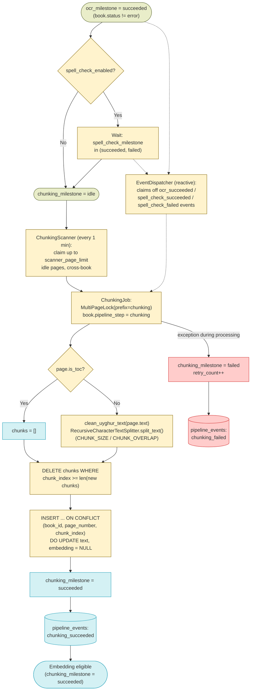
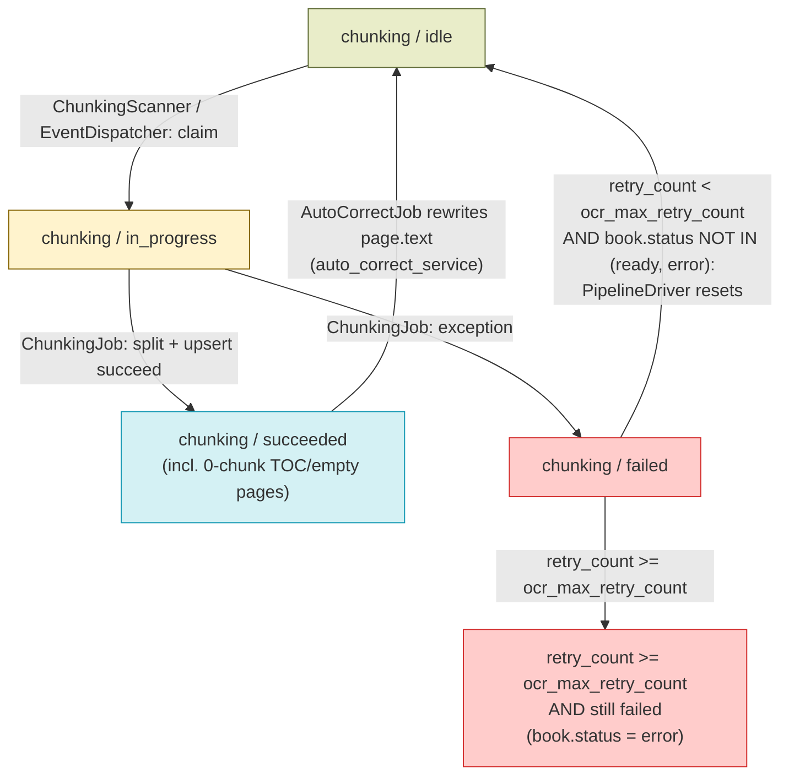

# Chunking — Design

See also: [WORKER_DESIGN.md](WORKER_DESIGN.md) for the full pipeline overview and [BOOK_PROCESSING_DIAGRAM.md](BOOK_PROCESSING_DIAGRAM.md) for the cross-stage diagram this stage's Data Flow is scoped from. Previous stage: [OCR_DESIGN.md](OCR_DESIGN.md). Next stage: [EMBEDDING_DESIGN.md](EMBEDDING_DESIGN.md).

## Overview

Chunking is the second mandatory pipeline step. It begins once a page has `ocr_milestone='succeeded'` and ends when the page's OCR text has been split into `chunks` rows (or, for empty/table-of-contents pages, zero rows) and `chunking_milestone='succeeded'`. Handoff to Embedding happens per-page, via the transactional outbox, the moment a page succeeds.

Key characteristics:

- **`ChunkingScanner` claims pages across all books, not book-by-book.** Unlike `OcrScanner` (which groups by book because a PDF download is shared across a book's pages), chunking only needs the `text` already stored on each `Page` row, so `ChunkingScanner` claims up to `scanner_page_limit` idle chunking pages from any book in a single pass.
- **Splitting uses an in-house recursive character splitter** (`RecursiveCharacterTextSplitter` in `chunking_service.py`), not a third-party library. It recursively tries separators `["\n\n", "\n", ". ", " ", ""]` in order, merging adjacent splits up to `CHUNK_SIZE` characters with `CHUNK_OVERLAP` characters of overlap between consecutive chunks (env vars, default `1500` / `300`).
- **Table-of-contents pages are skipped entirely.** `is_toc`, set during OCR (see [OCR_DESIGN.md](OCR_DESIGN.md)), makes `ChunkingJob` produce zero chunks for that page without ever calling the splitter — TOC text is structurally useless for retrieval.
- **Chunks are upserted on `(book_id, page_number, chunk_index)`, and a text change resets `embedding` to `NULL`.** `ChunkingJob` always deletes any existing chunk rows whose `chunk_index` is beyond the new split's chunk count first (so a page that produces fewer chunks after a re-run doesn't leave stale trailing rows), then `INSERT ... ON CONFLICT DO UPDATE`s the rest, explicitly setting `embedding=NULL` on every updated row. This is what forces `EmbeddingScanner` to re-embed a chunk whose text actually changed, since embedding eligibility is driven by `chunking_milestone`/`embedding_milestone`, not by a text diff.
- **`ready` books remain eligible for re-chunking.** Both `ChunkingScanner` and the reactive `EventDispatcher` explicitly exclude only `book.status == 'error'` — they do not exclude `status='ready'`. This is required because `apply_auto_corrections_to_page` (`auto_correct_service.py`), which `AutoCorrectJob` runs after spell-check corrections are approved, rewrites `page.text` and resets `chunking_milestone`/`embedding_milestone` back to `idle` on the corrected page regardless of the book's current status — so a `ready` book's corrected page must still be pickable up by `ChunkingScanner` or it would get stuck at `idle` forever.
- **Chunking can also be gated on spell check.** When `spell_check_enabled` (`system_configs`) is `"true"`, both `ChunkingScanner`'s poll-based claim and the reactive `EventDispatcher` additionally require `spell_check_milestone IN ('succeeded', 'failed')` before a page is eligible — spell check can rewrite `page.text` via auto-correct, and chunking text that's about to be corrected would build chunks from stale content with no re-chunk trigger to fix it after the fact.

## Schema

### `pages` table (columns this stage reads/writes)

| Column | Type | Description |
|---|---|---|
| `text` | `text`, nullable | Read-only input to this stage — the OCR'd (and Uyghur-normalized) transcription. Not modified by chunking. |
| `is_toc` | `boolean`, default `false` | Read-only input — when `true`, `ChunkingJob` skips splitting and produces zero chunks for the page. |
| `chunking_milestone` | `varchar(20)`, default `"idle"` | `idle \| in_progress \| succeeded \| failed`. |
| `retry_count` | `integer`, default `0` | Shared failure counter across OCR/chunking/embedding/spell-check; incremented on every `chunking_milestone='failed'` transition. |
| `worker_id` / `claimed_at` | `varchar(255)` / `timestamptz`, nullable | Set by `ChunkingScanner` (or the reactive `EventDispatcher`) when it claims a page (`chunking_milestone → in_progress`), then overwritten by `ChunkingJob` itself with the executing worker's ID once the job starts running. |
| `pipeline_step` | `varchar(20)`, nullable | Set to `"chunking"` on the owning `Book` (not the page) by `ChunkingJob` when it starts processing; not read by `ChunkingScanner`/`ChunkingJob` to gate work. |
| `error` | `text`, nullable | Last chunking error message (truncated to 500 chars). |

### `books` table (columns this stage reads/writes)

| Column | Type | Description |
|---|---|---|
| `chunking_milestone` | `varchar(20)`, default `"idle"` | Book-level rollup of page `chunking_milestone`s (`idle \| in_progress \| complete \| partial_failure \| failed`), recomputed by `BookMilestoneService.update_book_milestone_for_step(session, book_id, "chunking")` after every claim and after every `ChunkingJob` run. |
| `pipeline_step` | `varchar(20)`, nullable | Set to `"chunking"` by `ChunkingJob` when it starts processing a batch that includes pages from this book. |
| `status` | `varchar`, default `"pending"` | Read (not written) by `ChunkingScanner`/`EventDispatcher` as an eligibility filter — only `status == 'error'` excludes a book's pages from being claimed; `status='ready'` books remain eligible (see Overview). |

### `chunks` table

| Column | Type | Description |
|---|---|---|
| `id` | `integer`, PK, autoincrement | Surrogate key. |
| `book_id` | `varchar(64)`, FK → `books.id` (`ondelete=CASCADE`), indexed | Owning book. |
| `page_number` | `integer`, not null | The 1-based page this chunk was split from. |
| `chunk_index` | `integer`, default `0`, not null | Position of this chunk within the page's split output. |
| `text` | `text`, not null | The chunk's text content. |
| `embedding` | `vector(3072)`, nullable | pgvector embedding; `NULL` until `EmbeddingJob` (next stage) fills it in. Reset to `NULL` by `ChunkingJob` whenever an existing chunk's `text` is updated. |
| `created_at` | `timestamptz` | Row creation timestamp; not updated on conflict-upsert. |

Unique constraint `chunks_book_id_page_number_chunk_index_key` on `(book_id, page_number, chunk_index)` is the conflict target for `ChunkingJob`'s upsert.

`chunks` no longer has a `text_search` column — the generated `tsvector` + GIN index added by migration `074_add_chunks_text_search.sql` was dropped by migration `083_drop_chunks_text_search.sql` once keyword search (both the home Content-tab search and the RAG chat exact-phrase leg) moved to `pages.text_search` instead (added by migration `076_add_pages_text_search.sql`, mirroring 074's shape: `GENERATED ALWAYS AS (to_tsvector('simple', text)) STORED` + GIN index `idx_pages_text_search`). A `pages.text_search` hit is one whole page rather than one chunk, so it needs no chunk-side dedup for phrases matching multiple chunks on the same page. This column is not read or written by chunking itself — see [CHAT_RAG_DESIGN.md](CHAT_RAG_DESIGN.md#schema) and `PagesRepository.search_content_pages` / `ChunksRepository.keyword_search` for its consumers.

## Architecture

| File | Purpose |
|---|---|
| `services/worker/scanners/chunking_scanner.py` | `run_chunking_scanner` — claims idle chunking pages across all books (cross-book, not grouped), dispatches one `ChunkingJob`. |
| `services/worker/jobs/chunking_job.py` | `chunking_job` — splits each claimed page's text into chunks and upserts them into `chunks`, one page at a time in its own session. |
| `services/worker/scanners/event_dispatcher.py` | `run_event_dispatcher` — reactively claims and dispatches `chunking_job` immediately off `ocr_succeeded` (or, when spell check is enabled, `spell_check_succeeded`/`spell_check_failed`) outbox events, instead of waiting for `ChunkingScanner`'s next 1‑minute poll. |
| `packages/backend-core/app/services/chunking_service.py` | `chunking_service` (a `ChunkingService` instance) — wraps `RecursiveCharacterTextSplitter`, configured from `settings.chunk_size` / `settings.chunk_overlap`; `split_text()` is the only method `ChunkingJob` calls. |
| `packages/backend-core/app/db/repositories/chunks_repository.py` | `ChunksRepository` — generic chunk CRUD, similarity search (used by RAG retrieval). **Not used by `ChunkingJob`**, which upserts/deletes chunk rows directly via raw SQLAlchemy `insert(...).on_conflict_do_update(...)` / `delete(...)` for per-page transactional control. Its `keyword_search` method lives on this class for historical reasons but no longer queries `chunks` at all — it queries `pages.text_search` (see [CHAT_RAG_DESIGN.md](CHAT_RAG_DESIGN.md)). |
| `packages/backend-core/app/db/repositories/pages_repository.py` | `PagesRepository` — generic page CRUD/upsert, plus `search_content_pages` (the home Content-tab keyword search over `pages.text_search`). **Not used by chunking's page-claiming or update logic** — `chunking_scanner.py` and `chunking_job.py` both issue raw `select`/`update` statements against `Page` directly. |
| `packages/backend-core/app/services/auto_correct_service.py` | `apply_auto_corrections_to_page` — not a chunking-stage file, but the reason `ready` books stay eligible for chunking: it resets `chunking_milestone`/`embedding_milestone` to `idle` on corrected pages. |
| `services/backend/api/endpoints/books_router.py` | Hosts `POST /{book_id}/reprocess/chunking`, the admin-facing chunking recovery endpoint. |

## Data Flow



## Component Responsibilities

**ChunkingScanner — `run_chunking_scanner(ctx)`:**

```
1. Fetch scanner_page_limit (system_configs, default 100) and
   spell_check_enabled (system_configs; code fallback "false" if unset,
   but seeded "true" on every startup — see Configuration Reference).
2. SELECT Page.id, Page.book_id JOIN Book WHERE
     ocr_milestone = 'succeeded'
     AND chunking_milestone = 'idle'
     AND book.status != 'error'
     [AND spell_check_milestone IN ('succeeded', 'failed'), only if spell_check_enabled]
   FOR UPDATE SKIP LOCKED LIMIT scanner_page_limit.
   (Cross-book: no grouping/limit per book.)
3. If no rows, return.
4. UPDATE those pages: chunking_milestone='in_progress',
   worker_id=<this worker>, claimed_at=now().
5. For each distinct book_id among the claimed pages, recompute the
   book's rolled-up chunking_milestone
   (BookMilestoneService.update_book_milestone_for_step).
6. Commit, then enqueue chunking_job(page_ids=<all claimed ids>) via ARQ.
```

**EventDispatcher's chunking-relevant slice — `run_event_dispatcher(ctx)`:**

```
1. Poll up to 100 unprocessed pipeline_events, FOR UPDATE SKIP LOCKED.
2. Determine chunking_trigger_types: ('ocr_succeeded',) normally, or
   ('spell_check_succeeded', 'spell_check_failed') if spell_check_enabled
   (mirrors ChunkingScanner's own gating condition).
3. Collect candidate page IDs from events matching those types.
4. Atomically re-claim the subset still chunking_milestone='idle' AND
   book.status != 'error' (same SKIP LOCKED + flip-to-in_progress pattern
   as the scanner) — this exists so a reactive dispatch and the scanner's
   own poll never both enqueue a job for the same page.
5. Mark processed events; commit.
6. If any pages were claimed, enqueue chunking_job(page_ids=<claimed>).
```

**ChunkingJob — `chunking_job(ctx, page_ids)`:**

```
1. Acquire a MultiPageLock (Redis SET NX, prefix="chunking", 1h expiry)
   for page_ids; pages whose lock couldn't be acquired are dropped from
   this run (picked up again next scanner tick / event). If zero locks
   acquired, exit.
2. Overwrite worker_id/claimed_at on the locked pages with this
   executing worker's ID.
3. Load the Page rows for the locked IDs.
4. Set pipeline_step='chunking' on every distinct Book among these pages.
5. For each page (sequential, own session per page):
     a. IF page.is_toc: chunks = [] (skip splitting entirely).
        ELSE: text = clean_uyghur_text(page.text or "");
              chunks = chunking_service.split_text(text)
              (returns [] immediately if text is empty).
     b. DELETE FROM chunks WHERE book_id=page.book_id
        AND page_number=page.page_number AND chunk_index >= len(chunks)
        — removes stale trailing rows if this page now produces fewer
        chunks than a previous run.
     c. IF chunks: INSERT INTO chunks (book_id, page_number, chunk_index,
        text) VALUES <one row per chunk> ON CONFLICT
        (book_id, page_number, chunk_index) DO UPDATE SET text=excluded.text,
        embedding=NULL.
     d. UPDATE the page: chunking_milestone='succeeded'. Emit a
        'chunking_succeeded' pipeline event (payload: duration_ms). Commit.
     e. ON EXCEPTION (any step a-d): UPDATE the page:
        chunking_milestone='failed', retry_count+=1, error=<message,
        truncated to 500 chars>. Emit a 'chunking_failed' pipeline event
        (payload: duration_ms, error). Commit.
6. After all pages processed, recompute the book's rolled-up
   chunking_milestone for every distinct book_id
   (BookMilestoneService.update_book_milestone_for_step).
7. Release the MultiPageLock (finally block).
```

`RecursiveCharacterTextSplitter.split_text()` (`chunking_service.py`) tries separators in order `["\n\n", "\n", ". ", " ", ""]`, splitting on the first one present in the text, recursively re-splitting any piece still longer than `chunk_size` with the remaining separators, then merges adjacent pieces up to `chunk_size` characters with `chunk_overlap` characters carried over between consecutive merged chunks. `chunking_service` is instantiated once at import time as `ChunkingService(chunk_size=settings.chunk_size, chunk_overlap=settings.chunk_overlap)` — i.e. it always uses the env-configured `CHUNK_SIZE`/`CHUNK_OVERLAP`, not the class's own constructor defaults.

## State Machine



`EXHAUSTED` is a mandatory-step failure — `PipelineDriver` marks the whole book `status='error'` once any page has an exhausted OCR/chunking/embedding failure (see `WORKER_DESIGN.md`). The `CHUNK_OK -> CHUNK_IDLE` transition triggered by `AutoCorrectJob` is what keeps `ready` books' corrected pages flowing back through chunking (see Overview) — it is a text-content trigger, not a retry. **The `CHUNK_FAIL -> CHUNK_IDLE` retry transition does not apply to `ready` books:** `PipelineDriver`'s Reset step excludes any book whose `status` is `'ready'` or `'error'`, so if a `ready` book's auto-correct-reopened page then fails chunking, that page stays `CHUNK_FAIL` regardless of `retry_count` — see Error Handling & Retries for the gap this creates.

## Error Handling & Retries

| Scenario | Behavior |
|---|---|
| `chunking_service.split_text()` or the DB upsert raises any exception, **on a book whose `status` is not `'ready'` or `'error'`** | Page set `chunking_milestone='failed'`, `retry_count+=1`, `error=<message, truncated 500 chars>`. Emits `chunking_failed`. `PipelineDriver`'s Reset step resets it to `idle` on its next run if `retry_count < ocr_max_retry_count`, so `ChunkingScanner` reclaims it — this never blocks the book while retries remain. |
| Same exception, **on a book whose `status == 'ready'`** (e.g. a page reopened by `AutoCorrectJob` per Overview) | Page set `chunking_milestone='failed'`, `retry_count+=1`, same as above — but `PipelineDriver`'s Reset step (`services/worker/scanners/pipeline_driver.py`) filters every reset query with `~Book.status.in_(_V1_READY_STATUSES)`, where `_V1_READY_STATUSES = ("ready", "error")`; a `ready` book is excluded regardless of `retry_count`. `BookMilestoneService.update_book_milestone_for_step` (`packages/backend-core/app/services/book_milestone_service.py`) never writes `book.status`, so nothing else flips the book off `'ready'` either. **Gap: the page is never auto-retried** — it stays `chunking_milestone='failed'` until an admin reprocesses it (`POST /{book_id}/reprocess/chunking`) or the book's `status` otherwise changes. |
| `retry_count >= ocr_max_retry_count` (shared pipeline-level retry budget key, `system_configs`, default `10`) after a chunking failure | Page stays `chunking_milestone='failed'` permanently; `PipelineDriver` marks the whole book `status='error'` (chunking is a mandatory step). No soft-skip path exists for chunking — unlike OCR, an exhausted chunking failure always leaves the page genuinely failed. |
| Page has empty `text` (soft-skipped by OCR) or `is_toc=True` | Not a failure — `chunking_service.split_text("")` and the `is_toc` branch both produce `chunks=[]`; the page succeeds with zero chunk rows and flows to Embedding as a page with nothing to embed. |
| A page's Redis lock can't be acquired (another `ChunkingJob` already holds it) | That page is silently dropped from this run (not marked failed) — it stays `in_progress` and is picked up again once the lock expires (1h) or `StaleWatchdog` resets it. |
| A page re-runs (reprocess, or auto-correct reopening a `ready` book's page) and produces fewer chunks than the previous run | The `DELETE ... WHERE chunk_index >= len(chunks)` step removes the now-stale trailing chunk rows before the upsert, so no orphaned old chunks remain. |
| A page re-runs and a given `chunk_index`'s text actually changed | The upsert's `ON CONFLICT DO UPDATE` overwrites `text` and sets `embedding=NULL`, which is what makes that chunk `embedding_milestone`-eligible again for `EmbeddingJob` (see [EMBEDDING_DESIGN.md](EMBEDDING_DESIGN.md)). |

## Configuration Reference

| Key | Default | Used by |
|---|---|---|
| `scanner_page_limit` (`system_configs`) | `100` (code fallback; no seed row exists in `packages/backend-core/app/db/seeds.py`) | `chunking_scanner` — idle pages claimed per run, across all books. Also used by `embedding_scanner`/`spell_check_scanner`. |
| `spell_check_enabled` (`system_configs`) | `"true"` — seeded by `seed_system_configs()` (`packages/backend-core/app/db/seeds.py`, lines 56–60), which runs on every backend startup (`services/backend/main.py`, lines 129–134) and every worker startup (`packages/backend-core/app/queue.py`, lines 57–61) and inserts the row whenever the key is absent. The code-level fallback passed to `config_repo.get_value("spell_check_enabled", "false")` is `"false"`, but that path is only reached if seeding has never run — in practice the effective default is spell-check gating **enabled**. | `chunking_scanner` / `event_dispatcher` — when `"true"`, adds the `spell_check_milestone IN ('succeeded', 'failed')` eligibility condition described in Overview. |
| `ocr_max_retry_count` (`system_configs`) | `10` (seeded in `seeds.py`) | `PipelineDriver` — the same shared pipeline-level retry budget used by OCR also governs when a `chunking_milestone='failed'` page is reset to `idle` vs. left exhausted. There is no chunking-specific retry-count key. |
| `CHUNK_SIZE` (env, `packages/backend-core/app/core/config.py`) | `1500` | `chunking_service` — `RecursiveCharacterTextSplitter`'s target maximum chunk length in characters. |
| `CHUNK_OVERLAP` (env, `packages/backend-core/app/core/config.py`) | `300` | `chunking_service` — characters of overlap carried between consecutive merged chunks. |

## API Endpoints

| Endpoint | Role required | Effect |
|---|---|---|
| `POST /{book_id}/reprocess/chunking` | `Depends(require_editor)` (ADMIN or EDITOR) | Resets `chunking_milestone`, `embedding_milestone`, and `spell_check_milestone` to `idle` and `retry_count=0` for every page on the book; sets `is_indexed=False`; sets `book.status='pending'`, `book.pipeline_step='chunking'`. Non-destructive — existing OCR `text` and existing `chunks` rows are left in place until `ChunkingJob` deletes/upserts them per page on its next run. Also invalidates the book's cache entry and RAG search caches. |

## Testing

- `services/worker/tests/jobs/chunking_job_test.py` — currently a placeholder scaffold (`test_chunking_job_basic`, `assert True`); no behavioral coverage of `ChunkingJob` exists in this file as of this writing.
- `services/worker/tests/scanners/chunking_scanner_test.py` — `ChunkingScanner`: `test_chunking_scanner_dispatches_job_for_idle_pages`, `test_chunking_scanner_no_idle_pages`, `test_chunking_scanner_requires_spell_check_done_when_enabled`, `test_chunking_scanner_omits_spell_check_filter_when_disabled`.
- `packages/backend-core/tests/app/services/chunking_service_test.py` — `RecursiveCharacterTextSplitter` / `ChunkingService`: `test_recursive_splitter_simple`, `test_chunking_service_basic`, `test_chunking_service_empty`, `test_splitter_recursion`, `test_merge_splits_overlap`.
- `services/worker/tests/scanners/event_dispatcher_test.py` — covers `EventDispatcher`'s reactive chunking dispatch alongside embedding.

## Related Docs

- [OCR_DESIGN.md](OCR_DESIGN.md) — previous stage; provides the `text`/`is_toc` this stage reads and the `ocr_succeeded` event that (absent spell check) triggers reactive dispatch.
- [EMBEDDING_DESIGN.md](EMBEDDING_DESIGN.md) — next stage; claims chunks once `chunking_milestone='succeeded'` and fills in `chunks.embedding`.
- [WORKER_DESIGN.md](WORKER_DESIGN.md) — full pipeline, `PipelineDriver`, `MultiPageLock`, `StaleWatchdog`, and the shared milestone/state-machine conventions.
- [BOOK_PROCESSING_DIAGRAM.md](BOOK_PROCESSING_DIAGRAM.md) — cross-stage diagram; this doc's Data Flow is the chunking-only slice of its "Full Pipeline" diagram.
