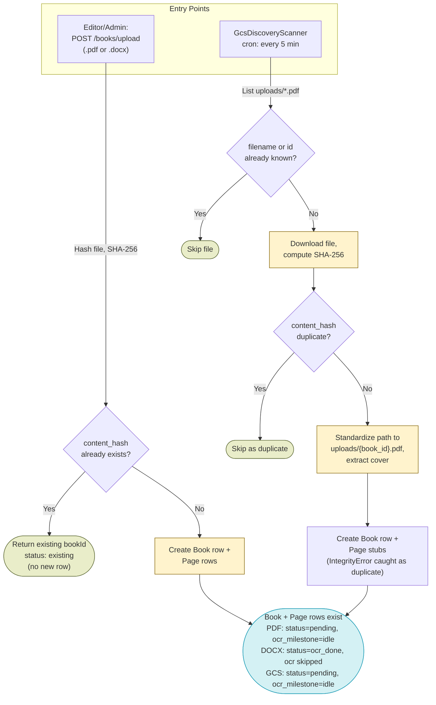

# Document Discovery — Design

See also: [WORKER_DESIGN.md](WORKER_DESIGN.md) for the full pipeline overview, and [book_processing_diagram.md](book_processing_diagram.md) for the cross-stage diagram this stage's Data Flow is scoped from. Next stage: [OCR_DESIGN.md](OCR_DESIGN.md).

## Overview

Document Discovery is how a book enters the Kitabim.AI pipeline. There are two independent entry points, and both converge on the same outcome — a `Book` row plus its `Page` rows:

- **Manual upload** — an editor/admin calls `POST /books/upload` with a `.pdf` or `.docx` file. Handled entirely inline in the request (`upload_pdf` in `services/backend/api/endpoints/books_router.py`).
- **GCS bucket discovery** — `GcsDiscoveryScanner` (`services/worker/scanners/gcs_discovery_scanner.py`) polls the storage backend's `uploads/` prefix every 5 minutes on a worker cron job and registers any `.pdf` file that isn't already a known book.

Key characteristics:

- **Duplicate detection is two-layered**: a fast filename/ID check (DB-only, no download) followed by a SHA-256 content-hash check (`books.content_hash` has a unique DB constraint, so even a race between two concurrent inserts is caught by an `IntegrityError` rather than producing duplicate rows).
- **PDF vs. DOCX diverge after creation**: PDF uploads (both entry points) create empty `Page` stubs and enter the pipeline at OCR. DOCX uploads (manual upload only — the GCS scanner only discovers `.pdf` files) extract page text immediately and skip OCR entirely, entering the pipeline at chunking.
- **This stage does not trigger OCR itself.** Both paths only create rows; `PipelineDriver` (documented in `WORKER_DESIGN.md`) is what initializes idle pages into the OCR step on its next run.
- **No feature flag gates this stage** — neither the upload endpoint nor `GcsDiscoveryScanner` checks a `system_configs` flag before running.

## Schema

### `books` table (columns set at creation)

| Column | Type | Description |
|---|---|---|
| `id` | `varchar(64)` | GCS path: `hashlib.md5(f"{file_name}{utcnow}").hexdigest()[:12]`. Manual upload: `secrets.token_hex(6)`. |
| `content_hash` | `varchar(64)`, unique | SHA-256 of the uploaded file bytes; the primary duplicate-detection key. |
| `title` | `text` | Filename stem (`.pdf`/`.docx` suffix stripped), normalized via `normalize_uyghur_chars`. PDF metadata title is read by the GCS scanner but not currently used to choose the title. |
| `author` | `text`, nullable | GCS path: PDF metadata author if present. Manual upload: always `""`. |
| `total_pages` | `integer` | PDF page count (PyMuPDF) or DOCX extracted-page count. |
| `status` | `varchar(20)`, default `"pending"` | GCS path and manual PDF upload: `"pending"`. Manual DOCX upload: `"ocr_done"` (OCR skipped). |
| `file_name` | `text`, nullable | Original uploaded filename. |
| `file_type` | `varchar(10)`, default `"pdf"` | Manual upload sets explicitly (`"pdf"`/`"docx"`); GCS discovery relies on the column default since it only ever creates PDF books. |
| `source` | `text`, nullable | `"gcs_sync"` (GCS discovery) or `"upload"` (manual upload). |
| `pipeline_step` | `varchar(20)`, nullable | GCS path and manual PDF upload: `NULL`. Manual DOCX upload: `"chunking"` (`PIPELINE_STEP_CHUNKING`), since OCR is skipped. |
| `ocr_milestone` / `chunking_milestone` / `embedding_milestone` / `spell_check_milestone` | `varchar(20)`, default `"idle"` | Book-level milestones use a distinct vocabulary from page-level milestones: `idle \| in_progress \| complete \| partial_failure \| failed` (see `BOOK_MILESTONE_*` in `packages/backend-core/app/core/pipeline.py`), vs. pages' `idle \| in_progress \| succeeded \| failed`. GCS discovery leaves all four at the column default `"idle"`. Manual PDF upload explicitly sets `ocr_milestone="idle"` (the other three are also set to `"idle"`). Manual DOCX upload sets `ocr_milestone="complete"` (a literal string, matching `BOOK_MILESTONE_COMPLETE` but not imported as a constant at that call site) since OCR is bypassed; the other three milestones are set to `"idle"`. |
| `cover_url` | `text`, nullable | `NULL` if extraction failed on either path. Otherwise the two paths diverge: manual upload stores the raw relative path `remote_cover_path` (`covers/{book_id}.jpg`); GCS discovery stores `storage.get_public_url(remote_cover_path)`, which resolves to `/api/covers/{book_id}.jpg` locally or `https://storage.googleapis.com/{bucket}/covers/{book_id}.jpg` on GCS. |
| `categories` | `text[]` | `[]` on creation from both entry points. |
| `visibility` | `varchar(20)`, default `"private"` | Manual upload sets it explicitly (`visibility="private"`). GCS discovery does not pass it to `create()` and relies on the column default. Both paths land on the same value (`"private"`), but via different mechanisms. |
| `upload_date` / `last_updated` | `timestamptz` | Set to `datetime.now(timezone.utc)` by both paths. |
| `created_by` / `updated_by` | `varchar(255)`, nullable | Manual upload only: the uploading user's email. GCS discovery leaves these `NULL`. |

### `pages` table (stub row shape at creation)

| Column | Type | Description |
|---|---|---|
| `book_id` | `varchar(64)` | FK to `books.id`. |
| `page_number` | `integer` | `1..total_pages`, one row per PDF page (or per extracted DOCX page). |
| `text` | `text`, nullable | PDF stubs: `NULL` (filled in by OCR). DOCX rows: pre-filled with the extracted page text. |
| `status` | `varchar(20)`, default `"pending"` | PDF stubs: left at the column default `"pending"`. DOCX rows: explicitly `"ocr_done"`. |
| `pipeline_step` | `varchar(20)`, nullable | PDF stubs: `NULL`. DOCX rows: `"chunking"`. |
| `milestone` | `varchar(20)`, nullable | PDF stubs: `NULL`. DOCX rows: `"idle"`. |
| `ocr_milestone` | `varchar(20)`, default `"idle"` | PDF stubs: left at the column default `"idle"`. DOCX rows: explicitly `"succeeded"` (`PAGE_MILESTONE_SUCCEEDED`) since text is already present. |
| `chunking_milestone` / `embedding_milestone` / `spell_check_milestone` | `varchar(20)`, default `"idle"` | Both creation paths leave these at `"idle"` (PDF stubs via column default, DOCX rows via explicit assignment). |

Row construction: `create_page_stubs(session, book_id, page_count)` in `packages/backend-core/app/services/pdf_service.py` builds the empty PDF stub rows (`Page(book_id=book_id, page_number=n)` for `n in range(1, page_count + 1)`); the DOCX branch in `upload_pdf` constructs fully-populated `Page` objects directly instead of calling `create_page_stubs`.

## Architecture

| File | Purpose |
|---|---|
| `services/worker/scanners/gcs_discovery_scanner.py` | `run_gcs_discovery_scanner` — cron job (every 5 min) that lists the storage backend's `uploads/` prefix, dedupes against existing books, and registers new PDF books. |
| `packages/backend-core/app/services/storage_service.py` | Storage abstraction (`FileSystemStorageProvider` / `GCSStorageProvider`, selected by `STORAGE_BACKEND`) used by both entry points to list, upload, and download files. |
| `packages/backend-core/app/services/pdf_service.py` | Shared PDF helpers used by both entry points: `read_pdf_page_count`, `extract_pdf_cover`, `create_page_stubs`. |
| `packages/backend-core/app/services/docx_service.py` | `extract_docx_pages`, `extract_docx_cover` — used only by the manual upload endpoint's DOCX branch (not part of the original research file list, but invoked directly by `upload_pdf`). |
| `packages/backend-core/app/db/repositories/books_repository.py` | `BooksRepository` — `find_by_hash`/`find_by_filename` duplicate lookups and `create()`, used by both entry points. |
| `services/backend/api/endpoints/books_router.py` | Hosts `POST /books/upload` (`upload_pdf`), the manual upload endpoint. |

## Data Flow



`InitDB` is where this stage ends — `PipelineDriver` (see `WORKER_DESIGN.md`) picks up idle-OCR pages on its next run.

## Component Responsibilities

**GcsDiscoveryScanner — `run_gcs_discovery_scanner(ctx)`:**

```
1. List all files under uploads/ via storage.list_files("uploads/");
   filter to those ending in ".pdf".
2. For each PDF file, fast DB-only checks (no download):
   - Skip if a Book with this file_name already exists (find_by_filename).
   - Skip if the filename stem matches an existing Book id (books_repo.get).
3. Download the file to a temp path under settings.data_dir; compute SHA-256.
   Skip as a duplicate if a Book with this content_hash already exists
   (find_by_hash).
4. Extract PDF title/author/page-count via PyMuPDF metadata
   (falls back to None/None/0 on failure). The final title is always the
   filename stem, not the extracted PDF-metadata title.
5. Generate book_id = md5(file_name + utcnow)[:12]. Extract a cover JPEG
   from page 1 and upload it to covers/{book_id}.jpg if successful.
6. Standardize the file's storage path to uploads/{book_id}.pdf
   (re-upload + delete original) if it wasn't already there.
7. In one transaction: create the Book row (status="pending",
   source="gcs_sync") and one Page stub per PDF page (create_page_stubs),
   then commit. IntegrityError (concurrent creation) is caught and
   counted as a duplicate rather than raised.
8. Delete the local temp download file in a finally block. Log
   discovered/skipped/duplicate counts at the end of the run.
```

**Manual upload endpoint — `upload_pdf` (`POST /books/upload`):**

```
1. Validate the filename extension is .pdf or .docx (case-insensitive);
   reject anything else with HTTPException(400, "errors.invalid_file_type").
2. Stream the upload to a temp path in 1 MB chunks, incrementally
   computing its SHA-256 hash.
3. Look up an existing Book by that hash (find_by_hash). If found, delete
   the temp file and return {"bookId": existing.id, "status": "existing"}
   without creating anything new.
4. Generate book_id = secrets.token_hex(6).
5. PDF branch: read page count (PyMuPDF), extract a cover, upload the
   PDF to uploads/{book_id}.pdf.
   DOCX branch: extract page texts (extract_docx_pages), extract a
   cover, upload the DOCX to uploads/{book_id}.docx.
6. Create the Book row. PDF: status="pending", pipeline_step=None,
   ocr_milestone="idle" (pipeline starts at OCR). DOCX: status="ocr_done",
   pipeline_step="chunking", ocr_milestone="complete" (OCR is skipped).
7. Create Page rows. PDF: empty stubs via create_page_stubs (one per
   page, all milestones default to idle). DOCX: fully populated rows
   with text pre-filled and ocr_milestone="succeeded" so chunking can
   start immediately.
8. Commit; bump the "books:list" and "category" cache namespaces
   (cache_service.bump_namespace_version); return
   {"bookId": book_id, "status": "uploaded"}.
```

## Error Handling & Retries

| Scenario | Behavior |
|---|---|
| Concurrent discovery of the same file (race between two scanner runs, or upload + scanner) | `books_repo.create()` raises `IntegrityError` on the `content_hash` unique constraint; the GCS scanner catches it, logs at `DEBUG`, and counts it as a duplicate — no duplicate row is created. |
| PDF metadata extraction fails (corrupt PDF, PyMuPDF error) | `_extract_pdf_metadata` catches the exception, logs a `WARNING`, and falls back to `(None, None, 0)`; discovery still proceeds and creates a `Book` row (with `total_pages=0`) using the filename as the title. |
| Cover extraction fails | `extract_pdf_cover` returns `False`; the book is created with `cover_url=None`. Not fatal on either path. |
| Any other unexpected exception while processing a GCS file (download failure, storage error, etc.) | Caught by the outer `try/except` in `run_gcs_discovery_scanner`, logged at `ERROR` with the file path, and the loop continues to the next file. The file remains undiscovered in `uploads/` and is retried on the next 5-minute cron tick. |
| Manual upload: unsupported file extension | `upload_pdf` raises `HTTPException(400, ...)` before any temp file is written. |
| Manual upload: exception during file write/hash/storage upload | Re-raised after the temp file is deleted (`temp_path.unlink(missing_ok=True)`); no `Book` row is created since `books_repo.create()` only runs after the file upload to storage succeeds. |
| Manual upload: duplicate content hash | Returns `{"bookId": existing.id, "status": "existing"}` (HTTP 200) — not treated as an error. |

## Configuration Reference

| Key | Default | Used by |
|---|---|---|
| `run_gcs_discovery_scanner` cron cadence | Hardcoded `minute={0,5,10,...,55}` in `WorkerSettings.cron_jobs` | `services/worker/worker.py` (effectively every 5 minutes) |
| `gcs_auto_sync_interval_minutes` (`system_configs`) | `5` (seeded in `packages/backend-core/migrations/001_initial_baseline.sql`) | Not read by any code path found in this repo — the actual cadence is the hardcoded cron above, not this config row. |
| `gcs_last_sync_at` (`system_configs`) | seed timestamp | Also not read or written by any code found in this repo — appears unused. |
| `STORAGE_BACKEND` | `"local"` | `get_storage_provider()` in `storage_service.py` — `"gcs"` selects `GCSStorageProvider`, anything else uses `FileSystemStorageProvider`. |
| `GCS_DATA_BUCKET` / `GCS_MEDIA_BUCKET` | none (required when `STORAGE_BACKEND=gcs`) | `get_storage_provider()`. |
| `DATA_DIR` | `<repo_root>/data` | `settings.data_dir` — both entry points write temp download/cover files under here before upload to storage. |
| `client_max_body_size` (nginx) | `512M` | `deploy/gcp/nginx/conf.d/kitabim.conf`, `apps/frontend/nginx.conf` — the only size cap on the uploaded book file for `POST /books/upload`; there is no application-level size check on the file itself. |

## API Endpoints

| Endpoint | Role required | Effect |
|---|---|---|
| `POST /books/upload` | `Depends(require_editor)` (ADMIN or EDITOR) | Uploads a `.pdf` or `.docx` file; dedupes by SHA-256 content hash; creates a `Book` row and its `Page` rows (empty PDF stubs, or pre-filled/OCR-skipped rows for DOCX). |

## Security Considerations

- **File-type validation is extension-based only.** Both entry points check the filename suffix (`.pdf`, and `.docx` for manual upload) case-insensitively — there is no MIME-type sniffing or magic-byte validation of file contents.
- **No application-level upload size limit.** The only ceiling on `POST /books/upload` is nginx's `client_max_body_size 512M`; the endpoint itself does not check `Content-Length` or truncate the stream.
- **No signed URLs.** `GCSStorageProvider.get_public_url` returns a direct public URL only for the media (covers) bucket; the private data bucket (where `uploads/` lives) returns an internal `/api/storage/{path}` reference. There is no `generate_signed_url` call anywhere in `storage_service.py`.
- **Content-hash duplicate detection doubles as an integrity/de-dup control**: `books.content_hash` has a unique DB constraint, so even a race between two concurrent inserts is caught by `IntegrityError` rather than allowing a second book to reference the same file content.
- **`POST /books/upload` is role-gated** (`require_editor`); `GcsDiscoveryScanner` has no such gate since it is an internal cron job, not a user-facing endpoint.
- No content/malware scanning of uploaded files was found in either path.

## Testing

- `services/worker/tests/scanners/gcs_discovery_scanner_test.py` — `GcsDiscoveryScanner`.
- `packages/backend-core/tests/app/services/pdf_service_test.py` and `packages/backend-core/tests/app/services/pdf_docx_services_test.py` — `pdf_service.py` (and `docx_service.py`).
- `packages/backend-core/tests/app/services/storage_service_test.py` — `storage_service.py`.
- `packages/backend-core/tests/app/db/books_repository_test.py` — `find_by_hash`/`find_by_filename` duplicate-detection lookups.
- No dedicated test file exists for the `POST /books/upload` handler itself as of 2026-07-29 — `services/backend/tests/api/endpoints/books_router_test.py` (the router's test file) has no upload-related test, and no `test_upload*`/`*upload*_test.py` file was found under `services/backend/tests`.

## Related Docs

- [OCR_DESIGN.md](OCR_DESIGN.md) — next stage; begins once a page's `ocr_milestone` is `idle` (skipped for DOCX uploads).
- [WORKER_DESIGN.md](WORKER_DESIGN.md) — full pipeline, `PipelineDriver`, and the shared milestone/state-machine conventions.
- [book_processing_diagram.md](book_processing_diagram.md) — cross-stage diagram; this doc's Data Flow is the discovery-only slice of its `Triggers` subgraph.
