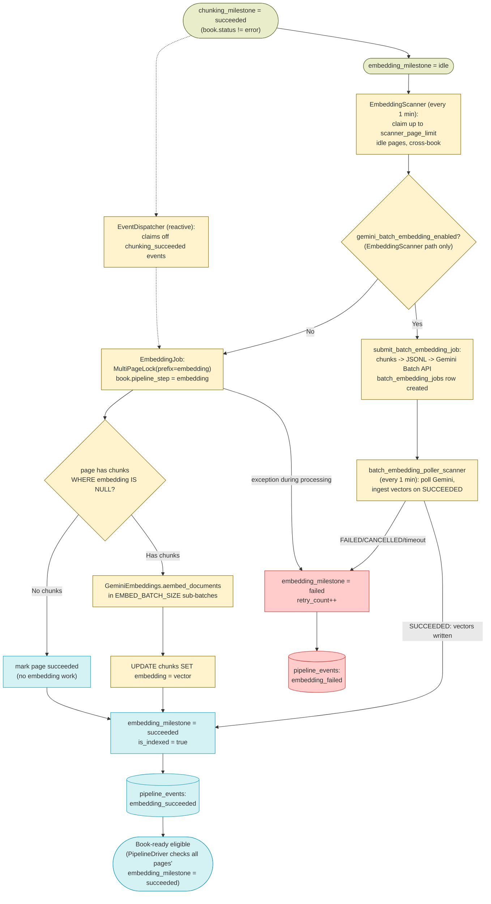
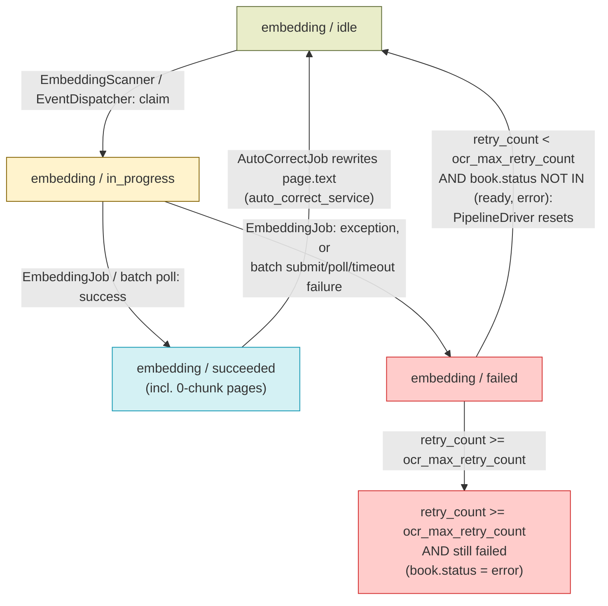

# Embedding — Design

See also: [WORKER_DESIGN.md](WORKER_DESIGN.md) for the full pipeline overview and [book_processing_diagram.md](book_processing_diagram.md) for the cross-stage diagram this stage's Data Flow is scoped from. Previous stage: [CHUNKING_DESIGN.md](CHUNKING_DESIGN.md).

## Overview

Embedding is the third and terminal step of the mandatory pipeline (`ocr → chunking → embedding`). It begins once a page has `chunking_milestone='succeeded'` and ends when every chunk belonging to that page has a pgvector `embedding` filled in (or the page has zero chunks) and `embedding_milestone='succeeded'`. There is no further mandatory step after embedding — `PipelineDriver` (see [WORKER_DESIGN.md](WORKER_DESIGN.md)) treats `embedding_milestone='succeeded'` on every page of a book as the condition for `book.status='ready'`, which in turn enqueues `summary_job` for the newly-ready book.

Key characteristics:

- **`EmbeddingScanner` claims pages across all books, not book-by-book** — same cross-book claiming pattern as `ChunkingScanner`, since embedding only needs chunk text already stored in `chunks`, not any book-level resource.
- **The embedding call itself is chunk-level, not page-level.** `EmbeddingJob` loads a page's chunks with `embedding IS NULL`, then calls the Gemini embedding API in sub-batches of `EMBED_BATCH_SIZE` (env, default `50`) chunks at a time via `GeminiEmbeddings.aembed_documents`.
- **Two independent submission paths exist, gated by `gemini_batch_embedding_enabled`:** the default interactive path dispatches `embedding_job` (an ARQ job that calls the Gemini interactive API synchronously per chunk batch); the optional path submits a `batch_embedding_jobs` row via the Gemini Batch API (async submit + poll) instead. Both paths are chosen by `EmbeddingScanner` at claim time.
- **The reactive `EventDispatcher` path is interactive-only.** Unlike `EmbeddingScanner`, `EventDispatcher`'s `chunking_succeeded`-triggered dispatch always enqueues `embedding_job` directly — it does not check `gemini_batch_embedding_enabled` or ever submit a batch job. So when batch mode is enabled, a page only goes through the batch path if `EmbeddingScanner`'s 1-minute poll claims it before the reactive dispatcher does; the reactive path (which usually wins the race, since it fires within seconds of `chunking_succeeded`) always uses the interactive API regardless of the flag.
- **`chunks.embedding` is `vector(3072)`, produced by the current default model `gemini-embedding-2`.** The column started as `vector(768)` in the initial baseline schema and was migrated to a 3072-dim column (`embedding_v2` → renamed to `embedding`) by migrations 035/037/038; `gemini_embedding_model` was cut over from `models/gemini-embedding-001` to `gemini-embedding-2` in the same migration (037), and a later migration (051) stripped the `models/` prefix from the stored config value. Note: `embedding_job.py`'s module docstring still says "generates and stores 768-dim embeddings" and `chunks_repository.py`'s `similarity_search` docstring still says "768-dimensional" — both are stale comments left over from the pre-cutover schema; the actual column, index casts (`::halfvec(3072)`), and `_get_embedding_dimensionality()`/`GeminiEmbeddings` dimension logic all agree on 3072 for the current `gemini-embedding-2` model.
- **`ready` books remain eligible for re-embedding**, for the same reason as chunking: `apply_auto_corrections_to_page` (`auto_correct_service.py`) resets `embedding_milestone` to `idle` on a corrected page regardless of book status, and `ChunkingJob` sets `embedding=NULL` on any chunk whose text changed. Neither `EmbeddingScanner` nor `EventDispatcher` excludes `book.status == 'ready'` — only `status == 'error'` is excluded.

## Feature Flags

| Flag | Default | Gates |
|---|---|---|
| `gemini_batch_embedding_enabled` (`system_configs`) | `"false"` (seeded by `seed_system_configs()`) | `EmbeddingScanner` — when `"true"`, claimed pages are submitted via `batch_embedding_service.submit_batch_embedding_job` (Gemini Batch API, async) instead of dispatching `embedding_job` directly. Does **not** affect `EventDispatcher`'s reactive path (see Overview). |

## Schema

### `pages` table (columns this stage reads/writes)

| Column | Type | Description |
|---|---|---|
| `chunking_milestone` | `varchar(20)`, default `"idle"` | Read-only input — dependency gate; embedding eligibility requires `chunking_milestone='succeeded'`. |
| `embedding_milestone` | `varchar(20)`, default `"idle"` | `idle \| in_progress \| succeeded \| failed`. |
| `is_indexed` | `boolean`, default `false` | Set `true` by `EmbeddingJob`/`batch_embedding_service` when the page's embedding work succeeds (including the zero-chunk case). Also reset to `false` by the chunking and embedding reprocess endpoints. |
| `retry_count` | `integer`, default `0` | Shared failure counter across OCR/chunking/embedding/spell-check; incremented on every `embedding_milestone='failed'` transition. |
| `worker_id` / `claimed_at` | `varchar(255)` / `timestamptz`, nullable | Set by `EmbeddingScanner` (or `EventDispatcher`) when it claims a page (`embedding_milestone → in_progress`), then overwritten by `EmbeddingJob` with the executing worker's ID once the job starts running. |
| `pipeline_step` | `varchar(20)`, nullable | Set to `"embedding"` on the owning `Book` (not the page) by `EmbeddingJob` when it starts processing. |
| `error` | `text`, nullable | Last embedding error message (truncated to 500 chars). |

### `books` table (columns this stage reads/writes)

| Column | Type | Description |
|---|---|---|
| `embedding_milestone` | `varchar(20)`, default `"idle"` | Book-level rollup of page `embedding_milestone`s (`idle \| in_progress \| complete \| partial_failure \| failed`), recomputed by `BookMilestoneService.update_book_milestone_for_step(session, book_id, "embedding")` after every claim and after every `EmbeddingJob`/batch-submit/batch-poll run. |
| `pipeline_step` | `varchar(20)`, nullable | Set to `"embedding"` by `EmbeddingJob` when it starts processing a batch that includes pages from this book. Set to `"ready"` by `PipelineDriver` once the book fully completes (see Related Docs / `WORKER_DESIGN.md`). |
| `status` | `varchar`, default `"pending"` | Read (not written) by `EmbeddingScanner`/`EventDispatcher` as an eligibility filter — only `status == 'error'` excludes a book's pages from being claimed; `status='ready'` books remain eligible (see Overview). |

### `chunks` table (columns this stage writes)

| Column | Type | Description |
|---|---|---|
| `embedding` | `vector(3072)`, nullable | pgvector embedding; `NULL` until this stage fills it in (or until `ChunkingJob` resets it to `NULL` on a text change — see [CHUNKING_DESIGN.md](CHUNKING_DESIGN.md)). Filled in by `EmbeddingJob` (`UPDATE chunks SET embedding = ...`) or, in batch mode, by `batch_embedding_service.poll_and_process_batch_embedding_jobs` once the Gemini Batch API job succeeds. |

Full column list and the rest of `chunks` (`id`, `book_id`, `page_number`, `chunk_index`, `text`, `text_search`, `created_at`) is documented in [CHUNKING_DESIGN.md](CHUNKING_DESIGN.md#schema), which owns the row's creation.

### `batch_embedding_jobs` table (batch mode only)

| Column | Type | Description |
|---|---|---|
| `id` | `varchar(64)`, PK | UUID generated at submission time; also used as the JSONL/GCS object key prefix. |
| `gemini_batch_id` | `varchar(255)`, nullable, unique | The Gemini Batch API job name (`client.batches.create_embeddings(...)` result), set once submission succeeds. |
| `book_ids` / `page_ids` / `chunk_ids` | `text[]` / `integer[]` / `integer[]` | The books/pages/chunks covered by this sub-batch. |
| `status` | `varchar(20)`, default `"submitting"` | `submitting \| submitted \| running \| succeeded \| failed \| cancelled` (`check_batch_embedding_jobs_status`). |
| `gcs_input_uri` / `gcs_output_uri` | `text`, nullable | GCS locations of the submitted JSONL request payload and the Gemini-produced result payload. |
| `total_chunks` / `processed_chunks` | `integer`, default `0` | Chunk counts for progress tracking. |
| `error` | `text`, nullable | Submission or polling failure message. |
| `submitted_at` / `completed_at` | `timestamptz`, nullable | Set when submission succeeds / when polling reaches a terminal state. |
| `created_at` / `updated_at` | `timestamptz` | Row bookkeeping. |

## Architecture

| File | Purpose |
|---|---|
| `services/worker/scanners/embedding_scanner.py` | `run_embedding_scanner` — claims idle embedding pages across all books, then either dispatches `embedding_job` (interactive) or calls `submit_batch_embedding_job` (batch), depending on `gemini_batch_embedding_enabled`. |
| `services/worker/jobs/embedding_job.py` | `embedding_job` — interactive path: for each claimed page, loads unembedded chunks, calls `GeminiEmbeddings.aembed_documents` in `EMBED_BATCH_SIZE` sub-batches, persists vectors, sets `embedding_milestone='succeeded'`. One page at a time, own session per page. |
| `packages/backend-core/app/services/batch_embedding_service.py` | `submit_batch_embedding_job` / `poll_and_process_batch_embedding_jobs` — batch path: builds and submits a Gemini Batch API JSONL embedding dataset, and later polls/ingests the results. |
| `services/worker/scanners/batch_embedding_poller_scanner.py` | `run_batch_embedding_poller_scanner` — every-1-minute cron wrapper that calls `poll_and_process_batch_embedding_jobs`; no-op if there are no `submitting/submitted/running` `batch_embedding_jobs` rows. |
| `services/worker/scanners/event_dispatcher.py` | `run_event_dispatcher` — reactively claims and dispatches `embedding_job` off `chunking_succeeded` outbox events, interactive-only (see Overview), instead of waiting for `EmbeddingScanner`'s next 1-minute poll. |
| `packages/backend-core/app/llm/models.py` | `GeminiEmbeddings` — thin wrapper around the Gemini `batchEmbedContents` REST endpoint; `aembed_documents(texts)` is the only method `EmbeddingJob` calls. Derives `dimensions = 3072 if "gemini-embedding-2" in model_name else 768` and passes it as `outputDimensionality`. |
| `packages/backend-core/app/db/repositories/chunks_repository.py` | `ChunksRepository` — generic chunk CRUD, similarity/keyword search (used by RAG retrieval, out of scope here). **Not used by `EmbeddingJob`**, which reads/updates `Chunk` rows directly via raw SQLAlchemy `select`/`update`. Its `upsert_many` docstring claims it's "used during OCR processing," but neither `ChunkingJob` nor `EmbeddingJob` calls it — see the equivalent note in [CHUNKING_DESIGN.md](CHUNKING_DESIGN.md#architecture). |
| `services/worker/scanners/stale_watchdog_scanner.py` | Resets pages stuck `embedding_milestone='in_progress'` back to `idle` — except pages covered by an active (`submitting/submitted/running`) `batch_embedding_jobs` row, which are exempted since the batch poller's own timeout handles their recovery. |
| `services/backend/api/endpoints/books_router.py` | Hosts `POST /{book_id}/reprocess/embedding`, the admin-facing embedding recovery endpoint. |

## Data Flow



## Component Responsibilities

**EmbeddingScanner — `run_embedding_scanner(ctx)`:**

```
1. Fetch scanner_page_limit (system_configs, default 100) and
   gemini_batch_embedding_enabled (system_configs, default "false").
2. SELECT Page.id, Page.book_id JOIN Book WHERE
     chunking_milestone = 'succeeded'
     AND embedding_milestone = 'idle'
     AND book.status != 'error'
   FOR UPDATE SKIP LOCKED LIMIT scanner_page_limit.
   (Cross-book: no grouping/limit per book.)
3. If no rows, return.
4. UPDATE those pages: embedding_milestone='in_progress',
   worker_id=<this worker>, claimed_at=now().
5. For each distinct book_id among the claimed pages, recompute the
   book's rolled-up embedding_milestone
   (BookMilestoneService.update_book_milestone_for_step).
6. Commit.
7. IF gemini_batch_embedding_enabled: call
   batch_embedding_service.submit_batch_embedding_job(session, page_ids)
   in a fresh session.
   ELSE: enqueue embedding_job(page_ids=<all claimed ids>) via ARQ.
```

**EventDispatcher's embedding-relevant slice — `run_event_dispatcher(ctx)`:**

```
1. Poll up to 100 unprocessed pipeline_events, FOR UPDATE SKIP LOCKED.
2. Collect candidate page IDs from events with event_type = 'chunking_succeeded'.
3. Atomically re-claim the subset still embedding_milestone='idle' AND
   book.status != 'error' (same SKIP LOCKED + flip-to-in_progress pattern
   as the scanner) — this exists so a reactive dispatch and the scanner's
   own poll never both enqueue a job for the same page.
4. Mark processed events; commit.
5. If any pages were claimed, enqueue embedding_job(page_ids=<claimed>)
   directly — always interactive, regardless of gemini_batch_embedding_enabled
   (see Overview).
```

**EmbeddingJob — `embedding_job(ctx, page_ids)`:**

```
1. Acquire a MultiPageLock (Redis SET NX, prefix="embedding", 1h expiry)
   for page_ids; pages whose lock couldn't be acquired are dropped from
   this run. If zero locks acquired, exit.
2. Overwrite worker_id/claimed_at on the locked pages with this
   executing worker's ID.
3. Fetch gemini_embedding_model from system_configs — no fallback;
   raises RuntimeError if unset.
4. Load the Page rows for the locked IDs.
5. Set pipeline_step='embedding' on every distinct Book among these pages.
6. Instantiate GeminiEmbeddings(gemini_embedding_model) once for the job.
7. For each page (sequential, own session per page):
     a. SELECT chunks WHERE book_id=page.book_id AND page_number=
        page.page_number AND embedding IS NULL, ORDER BY chunk_index.
     b. IF no chunks: UPDATE page embedding_milestone='succeeded',
        is_indexed=true. Emit 'embedding_succeeded' (duration_ms). Commit.
        Continue to next page.
     c. ELSE: for i in range(0, len(chunks), EMBED_BATCH_SIZE):
          vectors = await embeddings_model.aembed_documents(
            [c.text for c in chunks[i:i+EMBED_BATCH_SIZE]])
        (accumulates all_vectors across sub-batches)
     d. For each (chunk, vector) pair: UPDATE chunks SET embedding=vector
        WHERE id=chunk.id.
     e. UPDATE page: embedding_milestone='succeeded', is_indexed=true.
        Emit 'embedding_succeeded' (duration_ms). Commit.
     f. ON EXCEPTION (any step a-e): UPDATE page: embedding_milestone=
        'failed', retry_count+=1, error=<message, truncated 500 chars>.
        Emit 'embedding_failed' (duration_ms, error). Commit.
8. After all pages processed, recompute the book's rolled-up
   embedding_milestone for every distinct book_id
   (BookMilestoneService.update_book_milestone_for_step).
9. Release the MultiPageLock (finally block).
```

**`batch_embedding_service.submit_batch_embedding_job(session, page_ids)`:**

```
1. Fetch gemini_embedding_model (required, no fallback) and
   gemini_batch_embedding_max_chunks_per_job (default 100).
2. Strip any "models/" prefix; compute output_dim via
   _get_embedding_dimensionality(model) = 3072 if "gemini-embedding-2" in
   model else 768.
3. SELECT chunks JOIN pages WHERE page.id IN page_ids AND
   chunk.embedding IS NULL, ordered by chunk.id.
4. IF none found: mark all pages embedding_milestone='succeeded',
   is_indexed=true immediately, emit embedding_succeeded per page,
   recompute book milestones, return [].
5. Group chunks by page, then pack into sub-batches without splitting a
   page's chunks across two sub-batches, each sub-batch capped at
   gemini_batch_embedding_max_chunks_per_job chunks.
6. For each sub-batch:
   a. Build one JSONL line per chunk: {"custom_id": "chunk_<id>",
      "request": {"content": {"parts": [{"text": chunk.text}]},
      "output_dimensionality": output_dim}}.
   b. Upload the JSONL to GCS (audit copy) and to the Gemini Files API.
   c. client.batches.create_embeddings(model=model, src=uploaded file).
   d. Create a BatchEmbeddingJob row (status='submitted', or 'failed' if
      the API call raised) recording gemini_batch_id, book/page/chunk IDs,
      gcs_input_uri.
   e. IF submission failed: mark that sub-batch's pages
      embedding_milestone='failed', retry_count+=1; recompute book
      milestones.
7. Return the created BatchEmbeddingJob rows.
```

**`batch_embedding_service.poll_and_process_batch_embedding_jobs(session)`** (invoked every 1 min by `batch_embedding_poller_scanner`):

```
1. Fetch gemini_batch_embedding_timeout_hours (default 24) and
   gemini_batch_embedding_max_retry_count (default 3).
2. SELECT all BatchEmbeddingJob rows WHERE status IN
   ('submitting','submitted','running').
3. For each active job:
   a. IF now - created_at > timeout_hours: mark job failed, mark all its
      pages embedding_milestone='failed', retry_count+=1; recompute book
      milestones; continue.
   b. IF no gemini_batch_id: continue (still submitting).
   c. client.batches.get(name=job.gemini_batch_id) to poll Gemini.
   d. IF state contains "RUNNING": set job.status='running'; continue.
   e. IF state contains "SUCCEEDED":
        - Download the result JSONL (via Files API output_file, or the
          GCS output URI).
        - IF download fails entirely: mark job/pages failed.
        - Parse each JSONL line: "chunk_<id>" -> embedding values, or an
          "error" entry -> failed_chunk_ids.
        - UPDATE chunks SET embedding=<vector> for every succeeded
          chunk_id.
        - Per page: if any of its chunks failed AND
          page.retry_count+1 < max_retries, mark that page failed
          (retry_count+=1) — otherwise mark it succeeded anyway (to avoid
          indefinitely blocking on a few bad chunks).
        - Mark succeeded pages embedding_milestone='succeeded',
          is_indexed=true, emit embedding_succeeded per page.
        - Mark job.status='succeeded'; recompute book milestones.
   f. IF state contains "FAILED" or "CANCELLED": mark job and all its
      pages failed (retry_count+=1); recompute book milestones.
4. Return count of jobs reaching a terminal outcome this run.
```

## State Machine



`EXHAUSTED` is a mandatory-step failure — `PipelineDriver` marks the whole book `status='error'` once any page has an exhausted OCR/chunking/embedding failure (see [WORKER_DESIGN.md](WORKER_DESIGN.md)). The `EMB_OK -> EMB_IDLE` transition is a text-content trigger (re-embedding a chunk whose text changed via auto-correct), not a retry — see [CHUNKING_DESIGN.md](CHUNKING_DESIGN.md) for the `chunking_milestone`/`embedding_milestone` reset chain. **The `EMB_FAIL -> EMB_IDLE` retry transition does not apply to `ready` books:** `PipelineDriver`'s Reset step excludes any book whose `status` is `'ready'` or `'error'` (`_V1_READY_STATUSES`), so if a `ready` book's auto-correct-reopened page then fails embedding, that page stays `EMB_FAIL` regardless of `retry_count` — same gap documented for chunking in [CHUNKING_DESIGN.md](CHUNKING_DESIGN.md#error-handling--retries).

## Error Handling & Retries

| Scenario | Behavior |
|---|---|
| `GeminiEmbeddings.aembed_documents()` or the chunk `UPDATE` raises any exception (interactive path), **on a book whose `status` is not `'ready'` or `'error'`** | Page set `embedding_milestone='failed'`, `retry_count+=1`, `error=<message, truncated 500 chars>`. Emits `embedding_failed`. `PipelineDriver`'s Reset step resets it to `idle` on its next run if `retry_count < ocr_max_retry_count`, so `EmbeddingScanner`/`EventDispatcher` reclaims it. |
| Same exception, **on a book whose `status == 'ready'`** | Same page-level failure as above, but `PipelineDriver`'s Reset step excludes `status IN ('ready', 'error')` books outright — the page is never auto-retried until an admin reprocesses it (`POST /{book_id}/reprocess/embedding`) or the book's status otherwise changes. Same gap as chunking (see [CHUNKING_DESIGN.md](CHUNKING_DESIGN.md#error-handling--retries)). |
| `retry_count >= ocr_max_retry_count` (shared pipeline-level retry budget, `system_configs`, default `10`) after an embedding failure | Page stays `embedding_milestone='failed'` permanently; `PipelineDriver` marks the whole book `status='error'` (embedding is a mandatory step). |
| Batch submission fails (`client.batches.create_embeddings` raises) | All pages in that sub-batch marked `embedding_milestone='failed'`, `retry_count+=1`, `error="Batch embedding submission failed: <msg>"`. The `BatchEmbeddingJob` row itself is recorded `status='failed'`. |
| A submitted batch job exceeds `gemini_batch_embedding_timeout_hours` (default `24`) without reaching a terminal Gemini state | Job marked `status='failed'`; all its pages marked `embedding_milestone='failed'`, `retry_count+=1`, `error="Batch embedding job timed out"`. |
| Batch job `SUCCEEDED` but a per-chunk entry has an `error` field (or is missing from the results) | That chunk is added to `failed_chunk_ids`. Per affected page: if `retry_count + 1 >= gemini_batch_embedding_max_retry_count` (default `3`), the page is marked **succeeded anyway** (to avoid indefinitely blocking on a handful of bad chunks — some chunks on that page permanently keep `embedding=NULL`); otherwise the page is marked `embedding_milestone='failed'`, `retry_count+=1`, for another pass. |
| Batch job reaches Gemini state `FAILED` or `CANCELLED` | Job marked `status='failed'`; all its pages marked `embedding_milestone='failed'`, `retry_count+=1`, `error="Gemini batch job failed (<state>)"`. |
| Page has zero chunks (e.g. it was `is_toc` or had empty OCR text) | Not a failure — both the interactive path (`EmbeddingJob`) and the batch submit path immediately mark the page `embedding_milestone='succeeded'`, `is_indexed=true` without calling the embedding API. |
| A page's Redis lock can't be acquired (another `EmbeddingJob` already holds it) | That page is silently dropped from this run (not marked failed) — it stays `in_progress` and is picked up again once the lock expires (1h) or `StaleWatchdog` resets it. |
| A page is locked by an active `batch_embedding_jobs` submission when `StaleWatchdog` runs | `StaleWatchdog` explicitly exempts any page ID present in a `submitting`/`submitted`/`running` `BatchEmbeddingJob.page_ids` array, so it is not force-reset to `idle` mid-batch — the batch poller's own `gemini_batch_embedding_timeout_hours` timeout is the sole recovery mechanism for those pages. |

## Configuration Reference

| Key | Default | Used by |
|---|---|---|
| `scanner_page_limit` (`system_configs`) | `100` (code fallback; no seed row) | `embedding_scanner` — idle pages claimed per run, across all books. Also used by `chunking_scanner`/`spell_check_scanner`. |
| `gemini_embedding_model` (`system_configs`) | `"gemini-embedding-2"` (seeded by `seed_system_configs()`, migrated from `models/gemini-embedding-001` via migration 037, `models/` prefix stripped by migration 051) | `embedding_job` and `batch_embedding_service` — no code-level fallback; both raise `RuntimeError` if unset. Determines the embedding dimensionality (3072 for any model name containing `"gemini-embedding-2"`, else 768) used both by `GeminiEmbeddings` (interactive) and `_get_embedding_dimensionality()` (batch). |
| `EMBED_BATCH_SIZE` (env, `packages/backend-core/app/core/config.py`) | `50` | `embedding_job` — number of chunks sent per interactive Gemini embedding API call. |
| `gemini_batch_embedding_enabled` (`system_configs`) | `"false"` (seeded) | `embedding_scanner` — routes claimed pages through `submit_batch_embedding_job` instead of `embedding_job` when `"true"`. See Feature Flags. |
| `gemini_batch_embedding_max_chunks_per_job` (`system_configs`) | `100` (seeded) | `batch_embedding_service.submit_batch_embedding_job` — max chunks packed into a single Gemini Batch API sub-job (a book's/page's chunks are never split across sub-batches, so an individual sub-batch can slightly exceed this if one page alone has more chunks). |
| `gemini_batch_embedding_timeout_hours` (`system_configs`) | `24` (seeded) | `poll_and_process_batch_embedding_jobs` — wall-clock timeout after which a stuck batch job's pages are marked failed. Also referenced by `StaleWatchdog`'s exemption logic. |
| `gemini_batch_embedding_max_retry_count` (`system_configs`) | `3` (seeded) | `poll_and_process_batch_embedding_jobs` — per-page retry ceiling for a batch job with partially-failed chunks before that page is marked succeeded-with-gaps instead of retried again. |
| `ocr_max_retry_count` (`system_configs`) | `10` (seeded; code fallback in `pipeline_driver.py` is `3`, only reached if seeding never ran) | `PipelineDriver` — the same shared pipeline-level retry budget used by OCR/chunking also governs when an `embedding_milestone='failed'` page is reset to `idle` vs. left exhausted. There is no embedding-specific retry-count key. |

## API Endpoints

| Endpoint | Role required | Effect |
|---|---|---|
| `POST /{book_id}/reprocess/embedding` | `Depends(require_editor)` (ADMIN or EDITOR) | Resets `embedding_milestone` and `spell_check_milestone` to `idle`, `retry_count=0`, `is_indexed=False` for every page on the book; sets every chunk's `embedding=NULL` (`UPDATE chunks SET embedding=NULL WHERE book_id=...`); sets `book.status='pending'`, `book.pipeline_step='embedding'`. Non-destructive to chunk text — only vectors are cleared. Invalidates the book's RAG search caches (`rag:search:{book_id}:*`, `rag:summary_search:*`). |

## Testing

- `services/worker/tests/jobs/embedding_job_test.py` — currently a placeholder scaffold (`test_embedding_job_basic`, `assert True`); no behavioral coverage of `EmbeddingJob` exists in this file as of this writing.
- `services/worker/tests/scanners/embedding_scanner_test.py` — currently a placeholder scaffold (`test_embedding_scanner_basic`, `assert True`); no behavioral coverage of `EmbeddingScanner` exists in this file as of this writing.
- `packages/backend-core/tests/app/services/batch_embedding_service_test.py` — the substantive coverage for this stage's batch path: `test_embedding_dimensionality_helper`, `test_submit_batch_embedding_job_success`, `test_submit_batch_embedding_job_no_chunks`, `test_submit_batch_embedding_job_submission_failure`, `test_submit_batch_embedding_job_page_boundary_packing`, `test_poll_and_process_batch_embedding_jobs_success`, `test_poll_and_process_batch_embedding_jobs_timeout`, `test_poll_and_process_batch_embedding_jobs_dest_object`, `test_poll_and_process_batch_embedding_jobs_failed_state`, `test_poll_and_process_batch_embedding_jobs_no_active_jobs`.
- `services/worker/tests/scanners/event_dispatcher_test.py` — covers `EventDispatcher`'s reactive embedding dispatch, including `test_event_dispatcher_dispatches_embedding_job_for_chunking_succeeded` and `test_event_dispatcher_embedding_succeeded_triggers_no_dispatch` (confirms `embedding_succeeded` events are a dead end for the dispatcher, matching `PipelineDriver` being the sole consumer of book-ready detection).
- `services/worker/tests/scanners/stale_watchdog_scanner_test.py` — includes `test_stale_watchdog_exempts_active_batch_embedding_pages`, covering the batch-mode exemption described in Error Handling & Retries.
- No dedicated test file exists for `batch_embedding_poller_scanner.py`'s thin cron wrapper itself (`run_batch_embedding_poller_scanner`) as of this writing — its behavior is exercised indirectly through `batch_embedding_service_test.py`'s coverage of `poll_and_process_batch_embedding_jobs`, which the wrapper calls unconditionally.

## Related Docs

- [CHUNKING_DESIGN.md](CHUNKING_DESIGN.md) — previous stage; provides the `chunks` rows (with `embedding=NULL`) this stage fills in, and the `chunking_succeeded` event that triggers reactive dispatch.
- [WORKER_DESIGN.md](WORKER_DESIGN.md) — full pipeline, `PipelineDriver` (book-ready / book-error detection once embedding is terminal for every page), `MultiPageLock`, `StaleWatchdog`, and the shared milestone/state-machine conventions.
- [book_processing_diagram.md](book_processing_diagram.md) — cross-stage diagram; this doc's Data Flow is the embedding-only slice of its "Full Pipeline" and "Batch OCR & Batch Embedding" diagrams.
- Spell check and Summary Generation design docs (not yet written as of this doc) will cover, respectively, the independent quality layer that runs alongside chunking/embedding, and `summary_job` — the job `PipelineDriver` enqueues once a book's embedding work is fully terminal and the book transitions to `status='ready'`.
