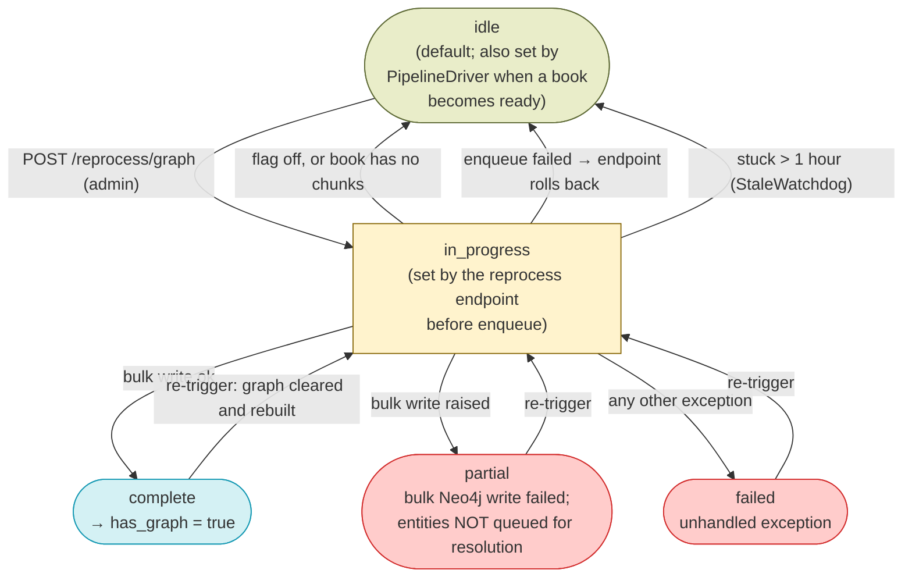
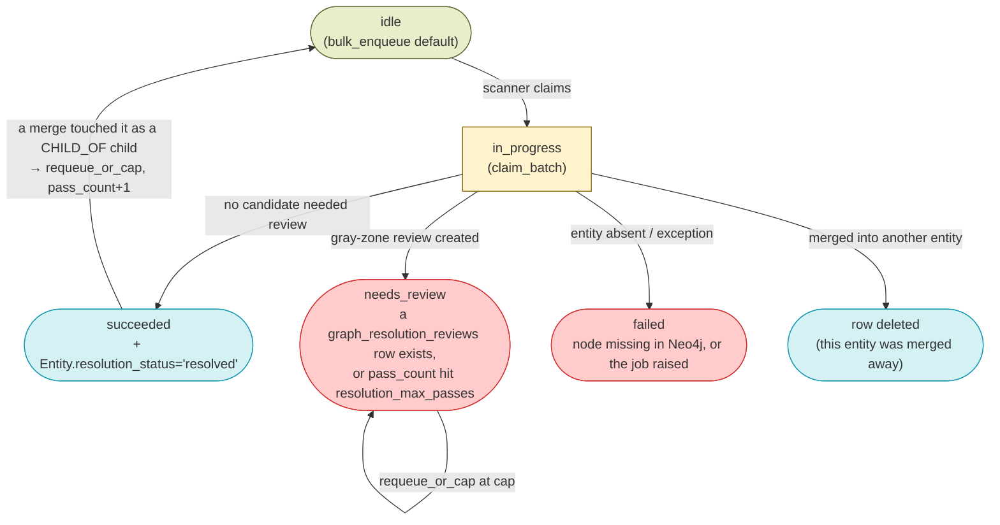

# Knowledge Graph — Design

See also: [WORKER_DESIGN.md](WORKER_DESIGN.md) for the full pipeline overview. Prior stages: [DOCUMENT_DISCOVERY_DESIGN.md](DOCUMENT_DISCOVERY_DESIGN.md), [OCR_DESIGN.md](OCR_DESIGN.md), [CHUNKING_DESIGN.md](CHUNKING_DESIGN.md), [EMBEDDING_DESIGN.md](EMBEDDING_DESIGN.md), [SPELLCHECK_DESIGN.md](SPELLCHECK_DESIGN.md), [SUMMARY_DESIGN.md](SUMMARY_DESIGN.md). Consumer: [CHAT_RAG_DESIGN.md](CHAT_RAG_DESIGN.md).

## Overview

Knowledge graph generation is a post-pipeline, book-level stage that reads a `ready` book's `chunks` rows, asks an LLM to extract entities and directed relationships from batches of chunk text, and writes them into Neo4j as `Entity` nodes joined by `RELATED_TO` edges. Nothing else goes into Neo4j — there are no `Book`, `Author`, or `Chunk` nodes; chunk text stays in Postgres and each edge carries `chunk_refs` strings (`book_id:page_number:chunk_index`) so a graph fact can be cited back to the exact chunk it came from. The whole stage is feature-flagged off by default and is not part of the mandatory pipeline: a book reaches `status = 'ready'` and is fully searchable whether or not it has a graph.

**Extraction and entity resolution are two distinct sub-pipelines, connected by one Postgres queue.** This is the single most important structural fact about this stage:

- **Bulk extraction** (`knowledge_graph_job`) is per-book, admin-triggered, and does **no deduplication whatsoever**. Every extracted entity gets a fresh `uuid4()` assigned by position, even when two batches (or two books) clearly describe the same person. Coreference resolution happens only *inside* one LLM call, expressed by the model reusing the same `local_id`. The job's last act is to bulk-insert one `graph_resolution_queue` row per entity it created.
- **Entity resolution** (`graph_resolution_scanner` → `graph_resolution_job` → `entity_resolution_service.resolve_entity`) is a continuously-running, entity-at-a-time second pass driven off that queue. It is where cross-batch/cross-book duplicates are actually merged, using fuzzy candidate lookup against a Neo4j full-text index, hard-constraint checks on resolved facts, a graded similarity score, and — only in the gray zone between the two score thresholds — a single-shot LLM judge. Ambiguous outcomes are not guessed: they become `graph_resolution_reviews` rows for a human admin.

Other key characteristics:

- **Entities are keyed by a stable `id` (uuid), never by name.** `canonical_name`/`aliases` are display-only. `init_constraints` explicitly *drops* the old `entity_name_unique` constraint in favour of `entity_id_unique`, precisely because two distinct real-world entities can legitimately share a name.
- **`scope` is a required, human-supplied parameter**, not an inferred one. The admin passes `"fiction"` or `"nonfiction"` when triggering `POST /{book_id}/reprocess/graph`; it is validated at both the request-schema level and the top of the job, and stamped onto every entity created in that run.
- **Fiction namespacing is done with an `Entity.book_id` property, not by mangling names.** For `scope = "fiction"`, every entity created in that run gets `book_id = <this book's id>`; for `nonfiction`, `book_id` is `null`. Candidate selection during resolution filters on `scope` and — when `book_id` is non-null — on the same `book_id`, so a fictional character resolves only within its own book while non-fiction historical figures resolve across the whole library. No `Person`-specific special case, no `"Name (Book Title)"` renaming, and no `fictional_categories` lookup exists in the current code (see the correction in [Related Docs](#related-docs)).
- **Extraction is a single bulk write.** All batches' entities and relations are accumulated in memory and flushed in exactly two Neo4j round-trips per book (`upsert_entities_bulk`, then `connect_entities_bulk`), after `delete_book_graph` has cleared the book's previous edges.
- **Merges are reversible.** Every merge snapshots the removed node and all its edges into `graph_merge_log` *before* deleting anything, so `POST /api/admin/graph/merge-log/{id}/unmerge` can recreate it.
- **Query-time consumption is LLM-free and cache-first.** `retrieval.graph_entity_lookup` reads a Redis `graph:alias:{alias}` map (populated by the resolution service after every merge/split/unmerge/resolution), then fetches that entity's facts from Neo4j as chunk-shaped dicts titled `Knowledge Graph`. It rides the existing `search_chunks` agent tool — there is no separate graph tool.

## Feature Flags

| Flag | Default | Gates |
|---|---|---|
| `knowledge_graph_enabled` (`system_configs`; seeded `'false'` by migration `045_add_graph_milestone_to_books.sql`) | `"false"` | All four graph entry points check it and no-op unless the value is exactly the string `"true"`: `knowledge_graph_job` (sets the book's `graph_milestone` back to `idle`, logs a warning, returns — no exception), `graph_scanner` (logs at DEBUG, returns before claiming any book), `graph_resolution_scanner` (logs at DEBUG, returns before claiming any queue row), and `POST /api/books/{book_id}/reprocess/graph` (returns HTTP 400 `"Knowledge Graph generation is currently disabled."`). Admin merge/split/rename/unmerge/review endpoints are **not** flag-gated — they operate on whatever is already in Neo4j. |

> Knowledge graph extraction is off in a fresh environment and must be enabled in `system_configs` before either the admin "Reprocess Graph" action or the resolution scanner will do anything.

## Schema

Neo4j is a labeled property graph, so the graph store is described below as node/relationship property sets rather than as tables. Postgres holds only the coordination/audit state; Neo4j holds the entity data itself.

### Neo4j — `(:Entity)` node

Written by `GraphRepository.upsert_entities_bulk` (`MERGE (e:Entity {id: ...})` + `SET` of every property below). All string values are NFC-normalized before write.

| Property | Type | Description |
|---|---|---|
| `id` | string (uuid4) | Stable identity, assigned in Python at extraction time. The only MERGE key. Unique constraint `entity_id_unique`. Never changes — not on rename, not on merge. |
| `canonical_name` | string | Display name in the source script (Uyghur Perso-Arabic for Uyghur texts — the prompt forbids transliteration). Display-only; not unique. |
| `aliases` | list&lt;string&gt; | Starts as `[canonical_name]`. Grows when a rename folds in the old name, and when a merge folds in the removed node's name + aliases. |
| `type` | string | One of `Person`, `Location`, `Event`, `Organization`, `HistoricalEra`, `Concept`, `Other` — the `EntityType` enum in `knowledge_graph_service.py`, whose `_missing_` hook coerces a wide range of model-emitted synonyms (`character`, `city`, `dynasty`, `theme`, …) onto those seven values. Falls back to `Other`. |
| `subtype` | string \| null | Free-text refinement (e.g. `City`, `Sultan`). Used as a weak (0.10-weight) resolution signal. |
| `context_summary` | string \| null | One-line role/era/relationship hint the extraction prompt asks for specifically to help the later resolution pass (e.g. "son of Ibrahim, governor of Kashgar"). Also surfaced in the public graph API. |
| `scope` | `"fiction"` \| `"nonfiction"` | Copied from the job argument. Resolution never compares entities across scopes. |
| `book_id` | string \| null | The owning book for `fiction` scope; `null` for `nonfiction`. This is the fiction namespacing mechanism. |
| `year_hijri` | int \| null | Set only when the model reported a specific Hijri year. |
| `year_gregorian` | int \| null | Derived from `year_hijri` via `hijri_to_gregorian()` (`round(y - y/33.7 + 622)`, ±1 year). Never model-supplied. |
| `century_gregorian` | int \| null | Set only when a Gregorian century was reported *and* no Hijri year (the two are mutually exclusive by prompt instruction and by the job's `elif`). |
| `resolution_status` | `"unresolved"` \| `"resolving"` \| `"resolved"` | Written `unresolved` at extraction, flipped to `resolving` while `resolve_entity` works on it, then `resolved`. Candidate selection skips nodes currently `resolving`. |
| `fastrp_embedding`, `profile_embedding` | list&lt;float&gt; | Property names referenced by the GDS helper methods on `GraphRepository`; no code path currently writes or reads them (see [Architecture](#architecture)). |

### Neo4j — `(:Entity)-[:RELATED_TO]->(:Entity)` relationship

Written by `GraphRepository.connect_entities_bulk`. The MERGE key is the pair `{rel_type, book_id}` between two endpoint ids — deliberately *not* `book_id` alone, so two different facts about the same pair in the same book don't collide.

| Property | Type | Description |
|---|---|---|
| `id` | string (uuid4) | Stable edge identity, `ON CREATE`-only so a re-run never regenerates it. Used by split, unmerge (snapshot matching), and the admin delete-relationship endpoint. |
| `rel_type` | string | The actual semantic type, in `UPPER_SNAKE_CASE` (`SON_OF`, `FATHER_OF`, `BORN_IN`, `CONQUERED`, `RULED`, `STUDIED_UNDER`, …). Because the Neo4j relationship *label* is always `RELATED_TO`, all type filtering is a property predicate, not a label match. |
| `book_id` | string | The book this edge was extracted from (always set for extraction-created edges). Makes `delete_book_graph` able to remove one book's edges without touching shared entities. |
| `chunk_refs` | list&lt;string&gt; | `book_id:page_number:chunk_index` strings for the batch that produced the edge. Accumulated, never overwritten: since no APOC plugin is installed, `connect_entities_bulk` does a read-before-write, unions existing refs with new ones in Python, and writes the merged list via `ON MATCH SET`. |
| `evidence` | string \| null | The verbatim source fragment supporting the claim — the prompt requires it, mainly so figurative kinship ("loved me like a father") can be audited and filtered. `ON CREATE`-only. |
| `parent_role` | `"father"` \| `"mother"` \| null | Only meaningful when `rel_type = 'CHILD_OF'`; ignored otherwise. |
| `year_hijri`, `year_gregorian`, `century_gregorian` | int \| null | Same semantics as on the node, for when the *relationship* is dated. `ON CREATE`-only, so a re-run never clobbers an edge's original dating. |

Indexes/constraints created by `init_constraints` (9 statements, idempotent, `ClientError` swallowed at DEBUG): `DROP CONSTRAINT entity_name_unique IF EXISTS`; `entity_id_unique` on `Entity.id`; B-tree indexes on `Entity.canonical_name` and `Entity.aliases`; a native `FULLTEXT INDEX entity_search_idx` on `[canonical_name, aliases]` (used by the resolution pass's Lucene fuzzy lookup — chosen because Cypher has no trigram operator and no APOC plugin is installed); and B-tree indexes on `RELATED_TO.book_id`, `.rel_type`, `.id`, `.chunk_refs`.

### Postgres — `books.graph_milestone`

| Column | Type | Description |
|---|---|---|
| `graph_milestone` | `varchar(20)`, not null, default/server-default `'idle'` (migration `045_add_graph_milestone_to_books.sql`) | `idle` \| `in_progress` \| `complete` \| `partial` \| `failed`. The book-level state for this stage. `has_graph` in every API response is derived from `graph_milestone == 'complete'` in Postgres (`books_repository.py`, and a direct `BookDB.graph_milestone == "complete"` query in the list endpoint) — there is never a Neo4j round-trip to compute it. |

### Postgres — `graph_resolution_queue`

Created by migration `075_add_entity_resolution_tables.sql`; ORM model `GraphResolutionQueue`. This is the handoff between the two sub-pipelines.

| Column | Type | Description |
|---|---|---|
| `id` | `serial`, PK | |
| `entity_id` | `uuid`, not null, **unique** | The Neo4j `Entity.id`. No FK possible (cross-store). Uniqueness makes `bulk_enqueue`'s `ON CONFLICT DO NOTHING` safe. |
| `scope` | `text`, not null, CHECK `IN ('fiction','nonfiction')` | Copied from the entity; the scanner groups its enqueued batches by this. |
| `book_id` | `text`, FK → `books.id` `ON DELETE CASCADE`, nullable | Non-null for fiction only — deleting a book cascades away its fiction queue rows. |
| `sort_year` | `integer`, nullable | The entity's `year_hijri` when present, else `NULL`. Drives oldest-generation-first claiming so a parent is resolved before its children. |
| `status` | `text`, not null, default `'idle'`, indexed, CHECK `IN ('idle','in_progress','succeeded','failed','needs_review')` | See [State Machine](#state-machine). |
| `pass_count` | `integer`, not null, default `0` | Incremented by `requeue_or_cap` on each re-propagation; compared against `resolution_max_passes`. |
| `last_updated` | `timestamptz`, not null, default `now()`, `onupdate now()` | |

Indexes: `graph_resolution_queue_status_idx (status)`, `graph_resolution_queue_sort_idx (scope, sort_year)`.

### Postgres — `graph_resolution_reviews`

| Column | Type | Description |
|---|---|---|
| `id` | `serial`, PK | |
| `entity_a_id`, `entity_b_id` | `uuid`, not null | The pair the resolver could not confidently decide. `entity_a_id` is the entity being resolved (the "keep" side if approved), `entity_b_id` the candidate. |
| `scope` | `text`, not null, CHECK `IN ('fiction','nonfiction')` | |
| `evidence` | `jsonb`, not null | Everything the decision was based on: `graded_score`, `hard_constraint`, the judge's `verdict`/`confidence`/`reasoning`, and both entity names. |
| `suggested_action` | `text`, not null, CHECK `IN ('merge','split','unsure')` | Derived from the judge verdict (`same` → `merge`, `different` → `split`, else `unsure`). |
| `status` | `text`, not null, default `'pending'`, indexed, CHECK `IN ('pending','approved','rejected')` | |
| `reviewed_by` | `text`, FK → `users.id` `ON DELETE SET NULL`, nullable | |
| `reviewed_at`, `created_at` | `timestamptz` | |

### Postgres — `graph_merge_log`

| Column | Type | Description |
|---|---|---|
| `id` | `serial`, PK | Returned to the caller as `mergeLogId`; the handle for unmerge. |
| `kept_entity_id`, `removed_entity_id` | `uuid`, not null (`removed_entity_id` indexed) | |
| `removed_entity_snapshot` | `jsonb`, not null | Full property map of the removed node, captured **before** deletion. `restore_entity_from_snapshot` replays it verbatim via `CREATE (e:Entity) SET e = $props`. |
| `removed_edges_snapshot` | `jsonb`, not null | Every `RELATED_TO` edge touching the removed node in either direction, each tagged `direction: 'out'|'in'`, `other_endpoint_id`, and its stable edge `id`. |
| `performed_by` | `text`, nullable | The admin's email for manual merges, or the literal `"system:resolution_job"` for automatic ones. |
| `performed_at` | `timestamptz`, not null, default `now()` | |
| `reverted_at` | `timestamptz`, nullable | Set by `mark_reverted`; a second unmerge attempt on the same row raises. |

### Redis — alias lookup cache

`graph:alias:{normalized_alias}` (`cache_config.KEY_GRAPH_ALIAS_LOOKUP`) → JSON list of entity ids, TTL `settings.cache_ttl_rag_query` (`CACHE_TTL_RAG_QUERY`, default 3600s). Written by `update_alias_cache` after every resolution/merge/split/unmerge/rename; read at query time by `retrieval.graph_entity_lookup`. Normalization is `unicodedata.normalize("NFC", alias).strip().lower()`.

## Architecture

| File | Purpose |
|---|---|
| `packages/backend-core/app/services/knowledge_graph_service.py` | Despite the name, holds **no orchestration logic** — it is the shared Pydantic extraction schema module: `EntityType` (with its synonym-coercing `_missing_`), `ExtractedEntity`, `ExtractedRelation`, `KnowledgeExtraction` (chunk-level), `GlobalRelation`/`GlobalMetadataExtraction` (book-level), and `parse_and_clean_json_from_exception` — a brace-matching JSON salvager that strips malformed entity/relation objects out of a failed structured response and re-validates. Its module docstring says `summary_job` imports from here too; it does not (`summary_job.py` imports nothing from this module), so `GlobalRelation`/`GlobalMetadataExtraction` are exercised only by `robust_parsing_test.py`. |
| `packages/backend-core/app/services/entity_resolution_service.py` | The resolution algorithm and every graph-mutating operation: `normalize_alias`, `_name_similarity`, `_check_hard_constraints`, `_graded_score`, `_gray_zone_judge`, `update_alias_cache`, `execute_merge`, `execute_split`, `execute_unmerge`, `resolve_entity`. Shared by the worker job and the admin endpoints so merge/split execution, audit logging, re-propagation, and cache refresh happen in exactly one place. |
| `packages/backend-core/app/db/repositories/graph_repository.py` | All Cypher. Class-level shared `AsyncGraphDatabase` driver (pool size 20, `max_connection_lifetime=300`, `liveness_check_timeout=0`, `connection_timeout=30`; credentials parsed out of `NEO4J_URL` if embedded). `close()` is a deliberate no-op — the driver is closed once at app shutdown via `close_driver()`. Grouped into: bulk write (`init_constraints`, `upsert_entities_bulk`, `connect_entities_bulk`, `delete_book_graph`); resolution/admin reads (`get_entity_by_id`, `get_entity_names_by_ids`, `get_entity_facts`, `get_entity_facts_for_citation`, `find_resolution_candidates`, `get_entity_edges_snapshot`, `get_children_via_child_of`, `set_resolution_status`); mutations (`merge_entities_by_id`, `split_entities` + its `_connected_components` union-find, `restore_entity_from_snapshot`, `rename_entity`, `delete_relationship_by_id`, `delete_relationships_by_ids`); and RAG/visualization reads (`query_subgraph`, `query_paths`, `check_books_exist`). Six Neo4j GDS wrappers also exist (`project_gds_graph`, `run_gds_node_similarity`, `run_gds_fastrp`, `store_profile_embeddings_bulk`, `run_gds_knn_similarity`, `run_gds_wcc_clustering`); no application code calls any of them, and no test covers them — the live resolution path uses `find_resolution_candidates`' full-text lookup. `query_paths` and `check_books_exist` likewise have no callers today, and `query_subgraph` is referenced only by its own unit test. |
| `packages/backend-core/app/db/repositories/graph_resolution_repository.py` | The three Postgres coordination repositories: `GraphResolutionQueueRepository` (`bulk_enqueue`, `claim_batch` with `FOR UPDATE SKIP LOCKED`, `mark_status`, `delete_by_entity_id`, `requeue_or_cap`), `GraphResolutionReviewsRepository` (`create_review`, `list_pending`, `set_status`, `resolve_reviews_for_merge`), `GraphMergeLogRepository` (`log_merge`, `mark_reverted`). |
| `services/worker/jobs/knowledge_graph_job.py` | `knowledge_graph_job(ctx, book_id, scope)` — bulk extraction for one book. Owns the extraction prompt inline (kinship-vs-figurative rules, Uyghur kinship term glossary, directed-edge semantics, year/century rules, script preservation). |
| `services/worker/scanners/graph_scanner.py` | `run_graph_scanner` — claims `ready` books whose `graph_milestone` is `idle`/`failed` and enqueues extraction. **Written and unit-tested but not registered** in `worker.py`'s `cron_jobs`, so it never runs; its `enqueue_job` call also omits the now-required `scope` argument (its test asserts that exact call shape). |
| `services/worker/scanners/graph_resolution_scanner.py` | `run_graph_resolution_scanner` — every 5 minutes, claims `graph_resolution_queue` rows and dispatches one `graph_resolution_job` per scope. Registered in `cron_jobs`. |
| `services/worker/jobs/graph_resolution_job.py` | `graph_resolution_job(ctx, entity_ids)` — loops the claimed ids, one fresh Postgres session per entity, delegating to `resolve_entity`; per-entity error isolation. |
| `services/worker/scanners/stale_watchdog_scanner.py` | Resets any book stuck at `graph_milestone = 'in_progress'` with `last_updated` older than 1 hour back to `idle`. |
| `packages/backend-core/app/core/prompts.py` | `ENTITY_RESOLUTION_JUDGE_PROMPT` — the gray-zone same/different/unsure judge prompt (precision-over-recall, "silence is not evidence of difference", strict JSON-only output). |
| `packages/backend-core/app/services/rag/retrieval.py` | `graph_entity_lookup(question)` — the query-time consumer: whitespace/punctuation tokenization into unigrams+bigrams (min length 3), Redis alias-cache lookup, then `get_entity_facts_for_citation` per matched id, returned as chunk-shaped dicts (`score` hardcoded `0.9`, `title` `"Knowledge Graph"`). |
| `services/backend/api/endpoints/books_router.py` | Public graph read (`GET /graph`), chunk drill-down (`GET /graph/chunk`), admin merge/relationship-delete/entity-rename, and `POST /{book_id}/reprocess/graph`. |
| `services/backend/api/endpoints/graph_admin_router.py` | Mounted at `/api/admin/graph` (`main.py`): split, unmerge, and the review queue (list/approve/reject). Merge deliberately stays on `/api/books/graph/merge`. |
| `apps/frontend/src/components/graph/GraphView.tsx` | The graph UI (force-directed view via `react-force-graph`): public search/browse of nodes+links, chunk-evidence drill-down, and — gated on `useIsAdmin()` — merge (with an "undo last merge" button driven by the returned `mergeLogId`), split, rename, relationship delete, and a `reviews` tab wired to the review queue. |
| `docker-compose.yml` | `neo4j` service, image `neo4j:5.26.0`, `NEO4J_AUTH=none`, `NEO4J_PLUGINS=["graph-data-science"]`, `gds.*` procedures unrestricted, heap 256m/512m + 256m pagecache, host ports `37687` (Bolt) / `37474` (Browser). Backend and worker both wait on its healthcheck and reach it at `bolt://neo4j:7687`. |

## Data Flow

```mermaid
flowchart TD
    subgraph Extraction ["Bulk extraction — per book, admin-triggered"]
        ADMIN(["Admin: POST /{book_id}/reprocess/graph<br/>body: {scope: fiction | nonfiction}"])
        FLAG{"knowledge_graph_enabled<br/>== 'true'?"}
        MILE["books.graph_milestone = 'in_progress'<br/>(set by the endpoint, before enqueue)"]
        ENQ["enqueue knowledge_graph_job<br/>(_job_id=knowledge_graph:&lt;book_id&gt;)"]
        JFLAG{"knowledge_graph_enabled<br/>== 'true'? (re-checked inside the job)"}
        BOOKSEL["SELECT the Book row"]
        BOOKGONE(["Book missing: return;<br/>graph_milestone left AS-IS<br/>(the only exit path that<br/>does not reset it)"])
        LOAD["Load all Chunk rows for the book<br/>ORDER BY page_number, chunk_index"]
        CLEAR["delete_book_graph(book_id)<br/>+ init_constraints()"]
        BATCH["Group into batches of kg_chunk_batch_size;<br/>asyncio.Semaphore(kg_max_parallel_chunks)"]
        LLM["Per batch: Gemini generate_content<br/>response_schema=KnowledgeExtraction, temperature=0<br/>(salvage parse on validation failure)"]
        IDS["Assign id=uuid4() per entity by position;<br/>map relation local_ids → those uuids<br/>(NO dedup here)"]
        WRITE[("Neo4j: upsert_entities_bulk<br/>then connect_entities_bulk<br/>— 2 round-trips total")]
        QUEUE[("Postgres: graph_resolution_queue<br/>bulk_enqueue (one row per entity)")]
        DONE["graph_milestone = 'complete'<br/>(or 'partial' if the bulk write failed)"]
        NOOP["graph_milestone = 'idle';<br/>warning logged, no exception"]
    end

    subgraph Resolution ["Entity resolution — continuous, entity-at-a-time"]
        SCAN["graph_resolution_scanner (every 5 min):<br/>claim_batch(resolution_batch_size)<br/>ORDER BY scope, sort_year NULLS LAST<br/>FOR UPDATE SKIP LOCKED → status='in_progress'"]
        DISPATCH["enqueue graph_resolution_job per scope<br/>(_job_id=graph_resolution:&lt;scope&gt;:batch)"]
        RESOLVE["resolve_entity(entity_id):<br/>set resolution_status='resolving'"]
        CAND["find_resolution_candidates:<br/>fulltext entity_search_idx, term~edit_distance,<br/>same scope, same book_id if fiction,<br/>skip nodes already 'resolving' — LIMIT 20"]
        HARD{"_check_hard_constraints<br/>(shared parent? shared birthplace?)"}
        SCORE["_graded_score:<br/>0.55*name + 0.35*neighbor overlap<br/>+ 0.10*subtype (+parent boost)"]
        JUDGE["_gray_zone_judge:<br/>single-shot Gemini structured call<br/>→ same | different | unsure + confidence"]
        MERGE[("execute_merge:<br/>snapshot → graph_merge_log,<br/>redirect edges, DETACH DELETE removed,<br/>requeue CHILD_OF children")]
        REVIEW[("graph_resolution_reviews row;<br/>queue status = 'needs_review'")]
        OK["resolution_status='resolved';<br/>queue status='succeeded'"]
        CACHE[("Redis: graph:alias:{alias} → [entity_id]")]
    end

    subgraph Consumer ["Query time — no LLM call"]
        LOOKUP["retrieval.graph_entity_lookup(question):<br/>unigram/bigram alias cache read"]
        FACTS["get_entity_facts_for_citation:<br/>one fact sentence per edge,<br/>tagged with book_id/page from chunk_refs"]
        CHUNKS(["Appended to search_chunks results<br/>as title='Knowledge Graph'"])
    end

    ADMIN --> FLAG
    FLAG -- No --> REJ["HTTP 400: feature disabled"]
    FLAG -- Yes --> MILE --> ENQ --> JFLAG
    JFLAG -- No --> NOOP
    JFLAG -- Yes --> BOOKSEL
    BOOKSEL -->|"missing"| BOOKGONE
    BOOKSEL -->|"found"| LOAD
    LOAD -->|"zero chunks"| NOOP
    LOAD --> CLEAR --> BATCH --> LLM --> IDS --> WRITE --> QUEUE --> DONE

    QUEUE --> SCAN --> DISPATCH --> RESOLVE --> CAND
    CAND --> HARD
    HARD -- conflict --> NEXT["skip candidate"]
    HARD -- match/none --> SCORE
    SCORE -->|">= 0.75"| MERGE
    SCORE -->|"<= 0.25"| NEXT
    SCORE -->|"gray zone"| JUDGE
    JUDGE -->|"same, conf >= 0.75"| MERGE
    JUDGE -->|"different, conf >= 0.75"| NEXT
    JUDGE -->|"unsure, or low confidence"| REVIEW
    MERGE --> OK
    NEXT --> OK
    OK --> CACHE
    MERGE --> CACHE
    CACHE --> LOOKUP --> FACTS --> CHUNKS

    classDef idle fill:#e9edc9,stroke:#606c38
    classDef active fill:#fff3cd,stroke:#856404
    classDef done fill:#d4f1f4,stroke:#189ab4
    classDef fail fill:#ffcccb,stroke:#d32f2f

    class ADMIN,FLAG,HARD,JFLAG,BOOKGONE idle
    class MILE,ENQ,LOAD,CLEAR,BATCH,LLM,IDS,SCAN,DISPATCH,RESOLVE,CAND,SCORE,JUDGE,LOOKUP,FACTS,BOOKSEL active
    class WRITE,QUEUE,DONE,MERGE,OK,CACHE,CHUNKS,NEXT done
    class REJ,NOOP,REVIEW fail
```



## Component Responsibilities

**1. KnowledgeGraphJob — `knowledge_graph_job(ctx, book_id, scope)`:**

```
1. Log start. IF scope not in {"fiction","nonfiction"}: raise ValueError
   (before any DB/Neo4j work — an invalid scope is a programming error,
   not a data condition).
2. Open a session:
   a. knowledge_graph_enabled (default "false"). IF != "true":
      UPDATE books SET graph_milestone='idle', commit, log WARNING, return.
   b. Read gemini_kg_extraction_model (default "gemini-3.1-flash-lite"),
      kg_max_parallel_chunks (default "5"), kg_chunk_batch_size (default "5").
   c. SELECT the Book row. IF missing: log WARNING, return (milestone left
      as-is — the only exit path that does not reset it).
   d. SELECT all Chunk rows for the book ORDER BY page_number, chunk_index
      (so batches are contiguous runs of text). Close the session.
3. IF no chunks: reset graph_milestone='idle' in a new session, log WARNING,
   return.
4. IF settings.gemini_api_key is unset: raise RuntimeError (→ step 12).
5. GraphRepository(): delete_book_graph(book_id) — deletes this book's
   RELATED_TO edges, then sweeps every now-orphaned Entity node — then
   init_constraints().
6. Slice chunks into batches of kg_chunk_batch_size; create
   asyncio.Semaphore(kg_max_parallel_chunks); gather extract_batch(batch)
   over all batches:
     - skip batches whose chunks all have empty text (returns None)
     - join the batch's texts with "[Page N, Part K]" headers so the model
       has positional context
     - one Gemini generate_content call: response_mime_type=application/json,
       response_schema=KnowledgeExtraction, temperature=0.0
     - on any exception: retry parsing via
       parse_and_clean_json_from_exception over the raw text (or the
       exception string); log INFO if salvaged, WARNING if not. A failed
       batch is skipped, never retried, and never fails the job.
7. For each (batch, extraction), in batch order:
     - per entity with a non-empty name and local_id: id=uuid4();
       record local_id → id for THIS batch only; build the property map
       (canonical_name, aliases=[name], type, subtype, context_summary,
       scope, book_id=<book_id if fiction else None>,
       resolution_status='unresolved'); year_hijri → also year_gregorian
       via hijri_to_gregorian, ELIF century_gregorian → century_gregorian.
       Append a queue row {entity_id, scope, book_id, sort_year=year_hijri}.
     - per relation: require source_entity, target_entity, relation_type,
       and that both local_ids were emitted as entities in the same
       response — otherwise skip the relation entirely. Attach book_id,
       chunk_refs (book_id:page:chunk_index for every non-empty chunk in
       the batch), evidence, parent_role (CHILD_OF only), and year fields.
8. Single bulk write: upsert_entities_bulk(all_entities) then
   connect_entities_bulk(all_relations). On exception: save_errors += 1,
   log ERROR (the job continues — it does not re-raise here).
9. finally: graph_repo.close() (a no-op; the driver is process-shared).
10. IF queue_rows AND save_errors == 0: new session →
    GraphResolutionQueueRepository.bulk_enqueue(queue_rows). A failed
    Neo4j write therefore never queues entities that don't exist.
11. UPDATE books SET graph_milestone = 'partial' if save_errors > 0 else
    'complete'; commit; log completion (chunk_count, batch_count,
    batch_size).
12. ON any unhandled exception: log ERROR, best-effort UPDATE
    graph_milestone='failed' (its own failure is logged, not raised),
    then re-raise so arq records the job as failed.
```

**2. GraphScanner — `run_graph_scanner(ctx)` (implemented, unit-tested, not scheduled):**

```
1. Open a session; read knowledge_graph_enabled (default "false").
   IF != "true": log DEBUG, return.
2. Read graph_scanner_batch_size (default "5").
3. SELECT books.id WHERE status='ready' AND graph_milestone IN
   ('idle','failed') FOR UPDATE SKIP LOCKED LIMIT batch_size.
4. IF none: return.
5. UPDATE those books SET graph_milestone='in_progress'; commit — the claim
   is what stops the next tick re-enqueuing the same books.
6. Outside the session, per book: enqueue_job("knowledge_graph_job",
   book_id=book_id, _job_id=f"knowledge_graph:{book_id}"). enqueue_job
   returns None when arq dedupes an already-queued/running job id; those
   are logged at DEBUG and not counted.
7. Log the newly-enqueued ids.

Note: this enqueue passes no `scope`, which `knowledge_graph_job` requires
as a positional parameter — so a job enqueued by this scanner would fail on
invocation. It is unreachable in practice because the scanner is absent from
worker.py's cron_jobs; the only live extraction trigger is the admin endpoint.
```

**3. GraphResolutionScanner — `run_graph_resolution_scanner(ctx)` (every 5 min):**

```
1. Open a session; read knowledge_graph_enabled (default "false").
   IF != "true": log DEBUG, return.
2. Read resolution_batch_size (default "20").
3. claim_batch(batch_size): SELECT graph_resolution_queue WHERE
   status='idle' ORDER BY scope, sort_year ASC NULLS LAST
   FOR UPDATE SKIP LOCKED LIMIT batch_size, then UPDATE those rows to
   status='in_progress', last_updated=now(); commit.
   (Oldest-generation-first means a parent is normally resolved before its
   children, so "same father" evidence is checked against an already-
   resolved father.)
4. IF nothing claimed: return.
5. Group the claimed entity_ids by scope; per scope enqueue
   graph_resolution_job(entity_ids=[...]) with
   _job_id=f"graph_resolution:{scope}:batch".
6. Log the total enqueued count; a None return (arq dedup) is logged at
   DEBUG.
```

**4. GraphResolutionJob — `graph_resolution_job(ctx, entity_ids)`:**

```
1. Construct one GraphRepository for the whole batch.
2. For each entity_id: open a FRESH Postgres session and call
   resolve_entity(session, graph_repo, entity_id); count success.
3. On per-entity exception: log ERROR, then in another fresh session mark
   that entity's queue row 'failed'. The loop continues — one bad entity
   never aborts the batch. A failure while marking 'failed' is itself only
   logged.
4. finally: graph_repo.close(). Log succeeded/failed counts.
```

**5. `resolve_entity(session, graph_repo, entity_id)` — the algorithm:**

```
0. get_entity_by_id. IF the node is gone (crash mid-merge, or removed by
   delete_book_graph's orphan sweep): mark the queue row 'failed', return.
1. Read the node's scope/book_id; read resolution_similarity_threshold
   (default "2"); set resolution_status='resolving' so concurrent
   candidate lookups skip this node.
2. find_resolution_candidates: for each term in [canonical_name, *aliases],
   query the entity_search_idx fulltext index with Lucene fuzzy
   `term~<edit_distance>`; keep nodes with a different id, the same scope,
   resolution_status != 'resolving', and (book_id IS NULL OR same book_id);
   rank by best score, LIMIT 20.
3. get_entity_facts(entity_id) once: parent links (CHILD_OF/SON_OF/
   DAUGHTER_OF outgoing, FATHER_OF/MOTHER_OF incoming, normalized to a
   parent_role), BORN_IN, DIED_IN, and up to 20 relationship neighbors.
4. For each candidate, in score order:
     a. Re-fetch it (an earlier iteration may have merged it away → skip).
     b. _check_hard_constraints on resolved facts: disjoint known parents
        → 'conflict'; overlapping → 'match'; if parents are unknown on
        either side, fall back to the same test on BORN_IN; otherwise
        'none'. 'conflict' → leave separate, next candidate.
     c. _graded_score = 0.55*best name/alias similarity (difflib ratio over
        NFC-lowercased strings) + 0.35*Jaccard neighbor-id overlap +
        0.10*exact subtype match; a hard 'match' adds +0.15, discounted to
        +0.05 when either side has >10 neighbors (a hub ancestor shared by
        everyone is weak evidence). Capped at 1.0, rounded to 4dp.
     d. score >= 0.75 → merge. score <= 0.25 → leave. Otherwise call
        _gray_zone_judge (raw generate_content, response_schema=
        EntityResolutionVerdict, temperature 0; any failure returns
        verdict='unsure', confidence=0.0 so a bad LLM call always routes to
        a human instead of silently deciding):
          - 'same' with confidence >= 0.75      → merge
          - 'different' with confidence >= 0.75 → leave
          - otherwise → create_review(entity, candidate, scope, evidence,
            suggested_action) and stop scanning further candidates.
     e. On merge: execute_merge(keep_id=entity_id, remove_id=candidate_id,
        performed_by="system:resolution_job"), then re-read entity_facts so
        subsequent candidates are compared against the enriched node.
5. IF a review was created: mark the queue row 'needs_review', return
   (resolution_status stays 'resolving').
   ELSE: resolution_status='resolved', queue row 'succeeded',
   update_alias_cache(entity_id).
```

**6. `execute_merge(session, graph_repo, keep_id, remove_id, performed_by, user_id)`:**

```
1. Fetch both nodes; IF either is missing return None (no-op).
2. get_entity_edges_snapshot(remove_id) — every edge in either direction
   with its stable id, direction, and other endpoint.
3. log_merge → graph_merge_log row, written BEFORE any deletion.
4. combined_aliases = keep.aliases + remove.canonical_name + remove.aliases,
   de-duplicated, with keep.canonical_name filtered out.
5. Collect get_children_via_child_of for BOTH nodes (kinship children via
   CHILD_OF/SON_OF/DAUGHTER_OF outgoing or FATHER_OF/MOTHER_OF incoming).
6. merge_entities_by_id: re-create the removed node's edges from keep's
   perspective through connect_entities_bulk (so a pre-existing identical
   (rel_type, endpoint, book_id) edge on keep absorbs the redirected edge's
   chunk_refs instead of duplicating), SET keep.aliases, then
   DETACH DELETE the removed node.
7. delete_by_entity_id(remove_id) — drop its queue row, otherwise every
   later scan's existence check would mark it 'failed' forever.
8. resolve_reviews_for_merge: approve any pending review between the two;
   re-point other pending reviews naming remove_id onto keep_id, or approve
   them if an equivalent (keep_id, other) review already exists.
9. For each collected child (deduplicated), requeue_or_cap(child_id,
   resolution_max_passes): status='idle', pass_count+1 if under the cap;
   else force 'needs_review' so a flip-flopping node stops looping.
10. update_alias_cache(keep_id); log; return the merge_log row id.
```

**7. `execute_split(graph_repo, entity_id, split_point_edge_id)` and `execute_unmerge(session, graph_repo, merge_log_id)`:**

```
split:
1. GraphRepository.split_entities: snapshot all edges; the split-point edge
   is removed from consideration; union-find over the rest, grouping edges
   that share a book_id or share an other_endpoint_id.
2. Cluster A = the component anchored on the split-point edge's book/endpoint
   (stays put). Cluster B = the largest component containing an edge with the
   SAME rel_type but a DIFFERENT endpoint (the contradicting evidence).
3. Create a new Entity (fresh uuid, same canonical_name/type/subtype/scope/
   book_id, aliases = [canonical_name] ONLY — carrying the full alias list
   would make the new node re-match as a merge candidate on the next pass and
   silently undo the split, resolution_status='unresolved'); redirect cluster
   B's edges to it and delete the originals.
4. Edges in neither cluster stay on the original node and are returned as
   unclustered_edge_ids for manual admin reassignment — never guessed.
5. update_alias_cache for the original and (if one was created) the new node.

unmerge:
1. Load the graph_merge_log row; raise if missing or already reverted.
2. restore_entity_from_snapshot: CREATE the node from its property snapshot,
   then per snapshotted edge — look it up by its stable id, delete it, and
   re-CREATE it against the restored node in its original direction. Edges
   whose id no longer exists (absorbed into a pre-existing edge on the kept
   node during the merge) cannot be re-pointed and are returned as
   unrecoverable_edge_ids: a known, reported provenance gap.
3. mark_reverted, then update_alias_cache for both the kept and restored ids.
```

## State Machine

`books.graph_milestone` — owned by this stage:



`graph_resolution_queue.status` — owned by the resolution sub-pipeline:



## Error Handling & Retries

| Scenario | Behavior |
|---|---|
| `knowledge_graph_enabled` is not `"true"` | Every entry point no-ops. `knowledge_graph_job` additionally resets `graph_milestone` to `idle` and commits, so a book left `in_progress` by an endpoint call made just before the flag was flipped off does not stay stuck. |
| Invalid `scope` passed to `knowledge_graph_job` | `ValueError` raised before any DB or Neo4j access; arq records the job failed. The API also rejects it earlier via the `ReprocessGraphRequest.scope` field validator (HTTP 422). |
| Book row not found | Logged as a warning, function returns normally. This is the only exit path that leaves `graph_milestone` untouched — a book deleted mid-flight keeps whatever value it had. |
| Book has zero chunks | `graph_milestone` reset to `idle`, warning logged, no exception. |
| `GEMINI_API_KEY` unset | `RuntimeError` → the outer handler sets `graph_milestone='failed'` and re-raises. |
| One batch's LLM call fails or returns unparseable JSON | `parse_and_clean_json_from_exception` attempts a salvage (brace-matched JSON extraction, then dropping entity objects missing `local_id`/`name`/`type` and relation objects missing their triple, then re-validating). If salvage succeeds an INFO is logged; if not, a WARNING is logged and **that batch is silently skipped** — no retry, no failure. The book can therefore end at `complete` with only part of its text represented. |
| A relation references a `local_id` the same response didn't emit as an entity | The relation is dropped (there is nothing to resolve it to). Logged only implicitly via the counts. |
| The bulk Neo4j write raises | `save_errors=1`; ERROR logged; the job does **not** re-raise. `graph_milestone='partial'` and — critically — `bulk_enqueue` is skipped, so no resolution queue rows are created for entities that may not exist. |
| Any other unhandled exception in `knowledge_graph_job` | ERROR logged, best-effort `graph_milestone='failed'`, exception re-raised. There is no `retry_count` column or automatic reset for this stage; recovery is a fresh admin re-trigger (which clears and rebuilds the book's graph from scratch). |
| A book is stuck at `graph_milestone='in_progress'` | `StaleWatchdog` resets it to `idle` once `last_updated` is more than 1 hour old. |
| Two extraction triggers for the same book race | arq's `_job_id=f"knowledge_graph:{book_id}"` dedupes; `enqueue_job` returns `None` for the second while the first is queued/running. |
| Re-extracting a book that already has a graph | `delete_book_graph` deletes only that book's `RELATED_TO` edges (edges carry `book_id`), then deletes every `Entity` left with no edges at all. Because that orphan sweep is global rather than book-scoped, an entity from another book that had already lost all its edges is also removed. Any `graph_resolution_queue` row pointing at a swept node is caught by `resolve_entity`'s step 0 and marked `failed`. |
| `resolve_entity` finds the Neo4j node gone | Queue row marked `failed`; no exception. |
| One entity in a resolution batch raises | `graph_resolution_job` logs it, marks only that row `failed`, and continues with the rest of the batch. |
| The gray-zone LLM judge call fails | Caught inside `_gray_zone_judge`, which returns `verdict='unsure', confidence=0.0` — which always routes to a human review row. A judge outage can never cause a silent merge or a silent leave-separate. |
| An entity keeps being re-queued by successive merges | `requeue_or_cap` increments `pass_count` and force-marks the row `needs_review` once it reaches `resolution_max_passes` (default 5), breaking flip-flop loops. |
| A resolution batch job is deduped by arq while rows were already claimed | `claim_batch` has already flipped the rows to `in_progress` and commits before enqueuing, and `_job_id=f"graph_resolution:{scope}:batch"` is a fixed per-scope id. If a job with that id is still queued/running, the newly claimed rows are logged at DEBUG and stay `in_progress` with no job to process them — there is no watchdog that resets stale `graph_resolution_queue` rows (unlike `books.graph_milestone`). The same applies if the worker dies mid-batch, which additionally leaves the in-flight `Entity.resolution_status` at `'resolving'`, excluding that node from other entities' candidate lookups. |
| Unmerge cannot re-point an edge | Its id is returned in `unrecoverableEdgeIds` and logged — the accepted consequence of the merge-time `chunk_refs` union collapsing two edges into one. |
| Neo4j unreachable at query time | `graph_entity_lookup` catches per-entity fetch failures and skips them (WARNING); a Redis failure returns `[]`. `_run_search_chunks` wraps the whole call in its own try/except, so retrieval degrades to text-only results. `GET /api/books/graph` returns `{"nodes": [], "links": []}` instead of an error. |

## Configuration Reference

| Key | Default | Used by |
|---|---|---|
| `knowledge_graph_enabled` (`system_configs`) | `"false"` (seeded by migration `045`) | The master flag — see [Feature Flags](#feature-flags). Compared as an exact string; any value other than `"true"` disables. |
| `gemini_kg_extraction_model` (`system_configs`) | `"gemini-3.1-flash-lite"` (both the `seeds.py` value and the in-code fallback) | `knowledge_graph_job` — the extraction model. |
| `kg_chunk_batch_size` (`system_configs`) | `"5"` (`seeds.py` and the in-code fallback agree; the job's own module docstring says 10, which is stale) | `knowledge_graph_job` — chunks combined into one LLM call. Higher values mean fewer API calls and better in-call coreference resolution, at the cost of a larger prompt and a coarser blast radius when one batch fails (all its chunks are skipped together). |
| `kg_max_parallel_chunks` (`system_configs`) | `"5"` | `knowledge_graph_job` — `asyncio.Semaphore` size, i.e. concurrent extraction calls in flight. Bounded partly by the Neo4j pool comment's assumption in `graph_repository.py`. |
| `graph_scanner_batch_size` (`system_configs`) | `"5"` | `graph_scanner` — books claimed per run. Inert while the scanner is unregistered. |
| `resolution_batch_size` (`system_configs`, seeded by migration `075`) | `"20"` | `graph_resolution_scanner` — queue rows claimed per 5-minute tick. |
| `resolution_max_passes` (`system_configs`, migration `075`) | `"5"` | `execute_merge` → `requeue_or_cap` — re-propagation passes allowed for one entity before it is force-marked `needs_review`. |
| `resolution_similarity_threshold` (`system_configs`, migration `075`) | `"2"` | `resolve_entity` → `find_resolution_candidates` — the Lucene fuzzy edit distance appended as `term~N` against `entity_search_idx`. Raising it widens recall and increases gray-zone judge calls (cost). |
| `gemini_entity_resolution_model` (`system_configs`, migration `075`) | `"gemini-3.1-flash-lite"` | `_gray_zone_judge` — the same/different/unsure judge model. |
| `GEMINI_API_KEY` (env → `settings.gemini_api_key`) | none — required | Both the extraction call and the judge call. `knowledge_graph_job` raises `RuntimeError` if unset; `_gray_zone_judge` degrades to `unsure`. |
| `NEO4J_URL` (env → `settings.neo4j_url`) | `"bolt://localhost:37687"` | `GraphRepository`. Credentials may be embedded in the URI — they are parsed out and passed as `auth` because the driver rejects them inline. In Docker Compose both backend and worker override this to `bolt://neo4j:7687`. |
| `CACHE_TTL_RAG_QUERY` (env → `settings.cache_ttl_rag_query`) | `3600` (seconds) | `update_alias_cache` — TTL of each `graph:alias:{alias}` entry. When an alias entry expires, `graph_entity_lookup` simply finds no match and retrieval falls back to text search; nothing re-populates it until that entity is resolved/merged/renamed again. |
| `STRONG_MERGE_SCORE` / `STRONG_LEAVE_SCORE` / `GRAY_ZONE_CONFIDENCE_THRESHOLD` (module constants, `entity_resolution_service.py`) | `0.75` / `0.25` / `0.75` | `resolve_entity`. Not configurable at runtime — narrowing the gray band trades human review volume against judge-call cost. |
| Candidate/neighbor caps (hardcoded) | candidates `LIMIT 20`; `get_entity_facts` neighbors truncated to 20; judge prompt gets 10 neighbor names; `query_subgraph` `LIMIT 30`; `query_paths` `LIMIT 40`; `GET /api/books/graph` `LIMIT 150` | Respective methods in `graph_repository.py` / `books_router.py`. |

## API Endpoints

Roles are read directly from each route's auth dependency.

| Endpoint | Role required | Effect |
|---|---|---|
| `GET /api/books/graph?q=` | `Depends(get_current_user_optional)` — optional auth; the result does not vary by user and guests are served | Public visualization feed. Runs one Cypher query over `(:Entity)-[:RELATED_TO]->(:Entity)` (`LIMIT 150`), optionally filtered by a case-insensitive `CONTAINS` on either endpoint's `canonical_name`, and reshapes it into `{nodes, links}` with node `id/label/type/year_*/century_gregorian/context_summary` and link `id/source/target/label/book_id/chunk_refs/evidence/year_*`. Any Neo4j error returns empty arrays rather than a 5xx. |
| `GET /api/books/graph/chunk?ref=` | **No auth dependency** — session only | Resolves a graph edge's `chunk_refs` entry back to the original chunk text: parses `book_id:page:chunk_index` (falling back to a numeric `chunks.id`), returns `{id, bookId, bookTitle, pageNumber, chunkIndex, text}`. `400` on an unparseable ref, `404` if no such chunk. This is how GraphView's evidence drill-down works. |
| `POST /api/books/graph/merge` | `Depends(require_admin)` | Body `{keepId, removeId}` (camelCase aliases via `to_camel`). Delegates to `entity_resolution_service.execute_merge` with `performed_by=current_user.email` and `user_id=current_user.id`, so a manual merge gets the same snapshot/audit/re-propagation/cache-refresh treatment as an automatic one. Returns `{status, message, mergeLogId}`; `400` if either entity is missing (`execute_merge` returned `None`), `500` on any other failure. Merge intentionally lives here rather than on `/api/admin/graph`. |
| `POST /api/books/graph/relationship/delete` | `Depends(require_admin)` | Body `{edgeId}`. Deletes one `RELATED_TO` edge by its stable `id`; `400` (i18n `errors.relationship_not_found`) if no such edge. |
| `POST /api/books/graph/entity/rename` | `Depends(require_admin)` | Body `{entityId, newName}`. NFC-normalizes the new name, folds the previous `canonical_name` into `aliases` (so old citations keep resolving), then refreshes the alias cache. `400` if the entity doesn't exist. |
| `POST /api/books/{book_id}/reprocess/graph` | `Depends(require_admin)` | Body `{scope}` — required, validated to `fiction`/`nonfiction`. `404` if the book is unknown; `400` if `knowledge_graph_enabled != "true"`. Otherwise sets `graph_milestone='in_progress'` (plus `last_updated`/`updated_by`) and commits *before* enqueuing `knowledge_graph_job(book_id, scope)` on a short-lived inline arq pool; on enqueue failure the milestone is rolled back to `idle` and a `500` (i18n `errors.graph_enqueue_failed`) is raised. This is the only live extraction trigger. |
| `POST /api/admin/graph/entities/{entity_id}/split` | `Depends(require_admin)` | Body `{splitPointEdgeId}`. Runs `execute_split`; returns `{status, newEntityId, movedEdgeIds, unclusteredEdgeIds}`. `newEntityId` is `null` when no contradicting cluster was found (a no-op split). `400` on a missing entity/edge. |
| `POST /api/admin/graph/merge-log/{merge_log_id}/unmerge` | `Depends(require_admin)` | Runs `execute_unmerge`; returns `{status, restoredEntityId, unrecoverableEdgeIds}`. `400` if the log row is missing or already reverted. |
| `GET /api/admin/graph/review-queue?skip=&limit=` | `Depends(require_admin)` | Paginated `status='pending'` reviews, oldest first (`limit` 1–100, default 20). Entity display names are resolved through a 5-step fallback chain (`_resolve_entity_name`): the Neo4j names map → the stored `evidence` names → `graph_merge_log.removed_entity_snapshot->>'canonical_name'` (for an entity already merged away) → the first single-quoted phrase in the judge's `reasoning` → `Entity (<first 8 chars of id>)`. |
| `POST /api/admin/graph/review-queue/{review_id}/approve` | `Depends(require_admin)` | `404` if unknown, `400` if already decided. Executes the merge **only** when `suggested_action == 'merge'` (keeping `entity_a_id`, removing `entity_b_id`); `split`/`unsure` suggestions are marked approved without any graph mutation, because neither a split-point edge nor a merge-log id can be inferred from the review row. |
| `POST /api/admin/graph/review-queue/{review_id}/reject` | `Depends(require_admin)` | Marks the review `rejected` and leaves both entities untouched. `404`/`400` as above. |

## Security Considerations

- **Prompt-injection surface.** Extraction feeds OCR'd book text straight into an LLM prompt (`combined_text` interpolated at the end of a long instruction block), and the resolution judge feeds model-generated entity names, subtypes and neighbor names into another prompt as JSON. Text in a scanned book can therefore attempt to steer either call. The blast radius is bounded structurally rather than by input sanitization: both calls are constrained to a Pydantic `response_schema` with `temperature=0.0`, so the worst outcome is bad graph content (spurious entities/edges, a wrong merge suggestion) — no tool calls, no code execution, and no free-form text is ever passed back into an executable position. A poisoned judge response still cannot force a merge on its own unless it also clears the 0.75 confidence bar; anything short of that becomes a human review row. Graph facts do reach end users through `graph_entity_lookup`, where they are rendered as ordinary retrieved "chunks" titled `Knowledge Graph` and are subject to the same answer-synthesis prompt as any other retrieved text.
- **Every mutating graph endpoint is admin-only.** All seven write routes (`merge`, `relationship/delete`, `entity/rename`, `reprocess/graph`, `split`, `unmerge`, review `approve`/`reject`) use `Depends(require_admin)`. `GraphView.tsx` additionally hides the corresponding controls behind `useIsAdmin()`, but that is UX only — the server dependency is the actual control. (Note: `persistenceService.reprocessGraph`'s client-side error text says "Editor access required" on a 403; the endpoint requires admin.)
- **The two graph read endpoints are effectively public.** `GET /api/books/graph` uses `get_current_user_optional` and `GET /api/books/graph/chunk` declares no auth dependency at all, so unauthenticated callers can enumerate entities/relationships and read the referenced chunk text for any book — including books that are not `public`/`ready`, since neither route consults `Book.visibility` or `Book.status`. `/graph` is capped at 150 rows per call; `/graph/chunk` returns one chunk's full text per call and is not rate-limited beyond whatever applies globally.
- **No raw SQL with user input.** The one `text()` query in `graph_admin_router._resolve_entity_name` binds `:eid`; all Cypher goes through driver parameters (`$id`, `$terms`, …). The `query_paths` helper does f-string-interpolate a `rel_filter`, but only from a boolean argument choosing between two hardcoded clauses.
- **Cross-store integrity is eventual, not transactional.** Postgres queue/audit rows and Neo4j nodes are written in separate commits, so a crash between them leaves reconcilable-but-inconsistent state (a queue row for a deleted node → `failed`; an entity whose queue insert never landed is simply never resolved). Both are recorded and logged rather than silently repaired.
- **Neo4j runs with authentication disabled in local Docker Compose** (`NEO4J_AUTH=none`) with the Bolt port and Browser UI published on the host (`37687`/`37474`), and `gds.*` procedures unrestricted. `settings.neo4j_url` supports embedded credentials for environments that do enable auth.

## Testing

All of the following pass against the current working tree (82 tests across the eight graph-specific files, plus 11 graph-related cases in `books_router_test.py`).

- `packages/backend-core/tests/app/db/graph_repository_test.py` — 18 tests, all mocking `AsyncGraphDatabase.driver` (no live Neo4j) with an autouse fixture that resets the class-level driver. **This file was modified alongside the code it covers and its current content does match this doc**: `test_graph_repository_init_constraints` asserts exactly 9 statements and specifically that `DROP CONSTRAINT entity_name_unique`, `CREATE CONSTRAINT entity_id_unique` and `CREATE FULLTEXT INDEX entity_search_idx` are among them; `..._connect_entities_bulk_unions_chunk_refs` / `..._no_existing_edge` / `..._carries_evidence` cover the read-before-write union and the `ON CREATE`-only `evidence`; `..._merge_entities_by_id_redirects_edges_and_deletes`, `..._split_entities_partitions_and_flags_unclustered`, `..._connected_components_groups_by_shared_book_and_endpoint`, `..._restore_entity_from_snapshot_repoints_matching_edges` / `..._reports_unrecoverable`, `..._rename_entity_folds_old_name_into_aliases`, `..._delete_relationship_by_id_*`, and `..._find_resolution_candidates_queries_fulltext_index` / `..._no_terms_returns_empty` cover the rest. Not covered: `upsert_entities_bulk`'s NFC normalization details beyond the happy path, `get_entity_facts`, `get_entity_facts_for_citation`, `delete_book_graph`, `query_paths`, `check_books_exist`, and all six GDS methods. `test_graph_repository_query_subgraph` is the only reference to `query_subgraph` anywhere outside the repository itself.
- `packages/backend-core/tests/app/services/entity_resolution_service_test.py` — 22 tests: the pure helpers (`normalize_alias`, `_check_hard_constraints` conflict/match/none/`born_in` fallback, `_graded_score` high/low), `update_alias_cache` union and missing-entity no-op, `execute_merge` no-op plus the happy path asserting the merge log is written *before* the delete and that children are re-queued, `execute_split` cache refresh for both nodes, `execute_unmerge` restore/mark-reverted/missing/already-reverted, and `resolve_entity` across every branch (missing entity → failed, no candidates → succeeded, hard conflict skip, hard match merge, gray-zone unsure → review + `needs_review`, gray-zone confident-same → merge) plus the judge's exception fallback.
- `packages/backend-core/tests/app/db/graph_resolution_repository_test.py` — 14 tests over all three repositories: `bulk_enqueue` empty/insert, `claim_batch` claim-and-update vs. empty, `requeue_or_cap` under-cap/at-cap/missing-row, `list_pending`, `set_status` found/missing, `log_merge`, `mark_reverted` found/missing, and `resolve_reviews_for_merge`.
- `services/worker/tests/jobs/knowledge_graph_job_test.py` — 9 tests: invalid scope raises, flag-disabled path, book-not-found, no-chunks, the non-fiction and fiction success paths (the latter asserting `scope`/`book_id` are stamped on both the entity and its queue row), a relation with an unresolvable `local_id` being skipped, `CHILD_OF` carrying `parent_role`, and the failure path.
- `services/worker/tests/jobs/graph_resolution_job_test.py` — 3 tests: one session per entity, one failure not aborting the batch, empty list still closing the repo.
- `services/worker/tests/scanners/graph_resolution_scanner_test.py` — 4 tests: flag-disabled, nothing claimed, one job enqueued per scope, and the arq-dedup (`None` return) path.
- `services/worker/tests/scanners/graph_scanner_test.py` — 3 tests (flag-disabled, no books, with books). `test_run_graph_scanner_enabled_with_books` asserts the enqueue call as `("knowledge_graph_job", book_id=..., _job_id=...)` — i.e. it locks in the call shape that omits the `scope` argument `knowledge_graph_job` now requires.
- `services/backend/tests/api/endpoints/graph_admin_router_test.py` — 9 tests: split success and missing-edge `400`, unmerge success and not-found `400`, review-queue pagination, approve-with-merge, approve missing `404`, approve already-decided `400`, reject success.
- `services/backend/tests/api/endpoints/books_router_test.py` — the graph-related subset (11 cases): `test_reprocess_graph_disabled`, `test_reprocess_graph_request_rejects_invalid_scope`, merge success / missing-entity `400` / camelCase alias acceptance, relationship-delete success / not-found / camelCase, and entity-rename success / error / camelCase.
- `packages/backend-core/tests/app/services/robust_parsing_test.py` — covers `parse_and_clean_json_from_exception` and `EntityType` coercion for both `KnowledgeExtraction` and `GlobalMetadataExtraction`.
- No dedicated test exists for `retrieval.graph_entity_lookup`, for `GET /api/books/graph` / `GET /api/books/graph/chunk`, or for `GraphView.tsx`. `packages/backend-core/tests/app/services/rag_adk_agent_test.py::test_knowledge_graph_tool_not_offered` asserts the negative on the consumer side: no graph tool is exposed to the agent.

## Related Docs

- **Corrections to stale cross-doc claims.** [WORKER_DESIGN.md](WORKER_DESIGN.md)'s `KnowledgeGraphJob` pseudocode still describes two steps that no longer exist in the code: (a) "for books whose category is in the configurable `fictional_categories` list, namespace Person entities as `Name (Book Title)`" — the current job does no name mangling and never reads `fictional_categories` (the key is still seeded in `seeds.py` but nothing consumes it); fiction isolation is the `Entity.book_id` property described in [Schema](#schema), driven by the admin-supplied `scope`. And (b) "if more than one Person occurrence was extracted, run a second LLM pass to resolve/deduplicate person names … with Roman numerals" — that in-job pass is gone; the `NameResolutionResponse`/`EntityOccurrenceResolution` schemas it used no longer exist in `knowledge_graph_service.py`, and cross-batch dedup is now the resolution sub-pipeline's job. `WORKER_DESIGN.md` also still lists `knowledge_graph_job` as taking only `book_id`; it takes `(book_id, scope)`. Separately, [NEO4J_CONNECTION.md](NEO4J_CONNECTION.md) documents a uniqueness constraint on `Entity.name` and a `name` property — the current schema has no `name` property (it is `canonical_name` + `aliases`), and `init_constraints` explicitly drops `entity_name_unique` in favour of `entity_id_unique` on `id`; that doc's Cypher recipes and connection details remain useful, its schema table does not.
- [CHAT_RAG_DESIGN.md](CHAT_RAG_DESIGN.md) — the consumer. Graph facts reach an answer only via `retrieval.graph_entity_lookup` riding the `search_chunks` agent tool; there is no separate graph tool for either handler, and the LLM-routed handler never queries the graph itself. Note the known limitation documented there and in `retrieval.py`: alias matching is exact against whitespace/punctuation-split unigrams and bigrams, so Uyghur agglutinative suffixes attached to a name will not match a bare cached alias.
- [SUMMARY_DESIGN.md](SUMMARY_DESIGN.md) — the other post-`ready`, book-level, non-mandatory stage. It is triggered automatically by `PipelineDriver` (this stage is not) and shares no state with the graph, despite `knowledge_graph_service.py`'s docstring implying `summary_job` reuses its schemas.
- [WORKER_DESIGN.md](WORKER_DESIGN.md) — cron schedule, `PipelineDriver`, `StaleWatchdog`, and the shared worker conventions.
- [SYSTEM_DESIGN.md](SYSTEM_DESIGN.md) — `system_configs`-driven model selection and the overall service topology.
- [EMBEDDING_DESIGN.md](EMBEDDING_DESIGN.md) / [CHUNKING_DESIGN.md](CHUNKING_DESIGN.md) — the `chunks` rows this stage reads and the `book_id:page_number:chunk_index` addressing that `chunk_refs` reuses for citations.
