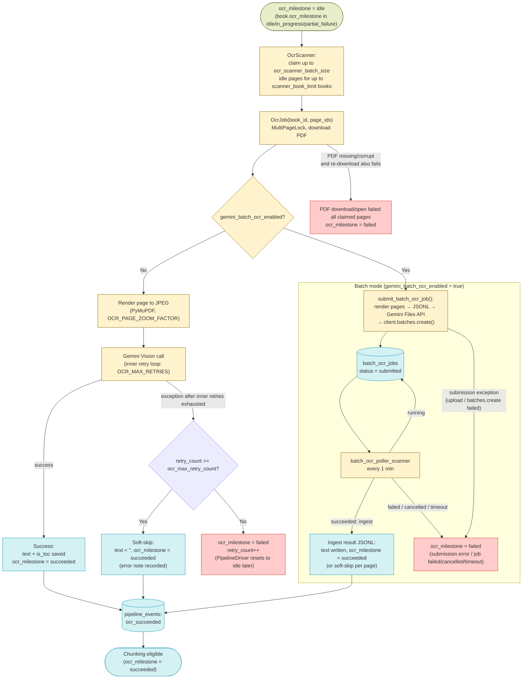
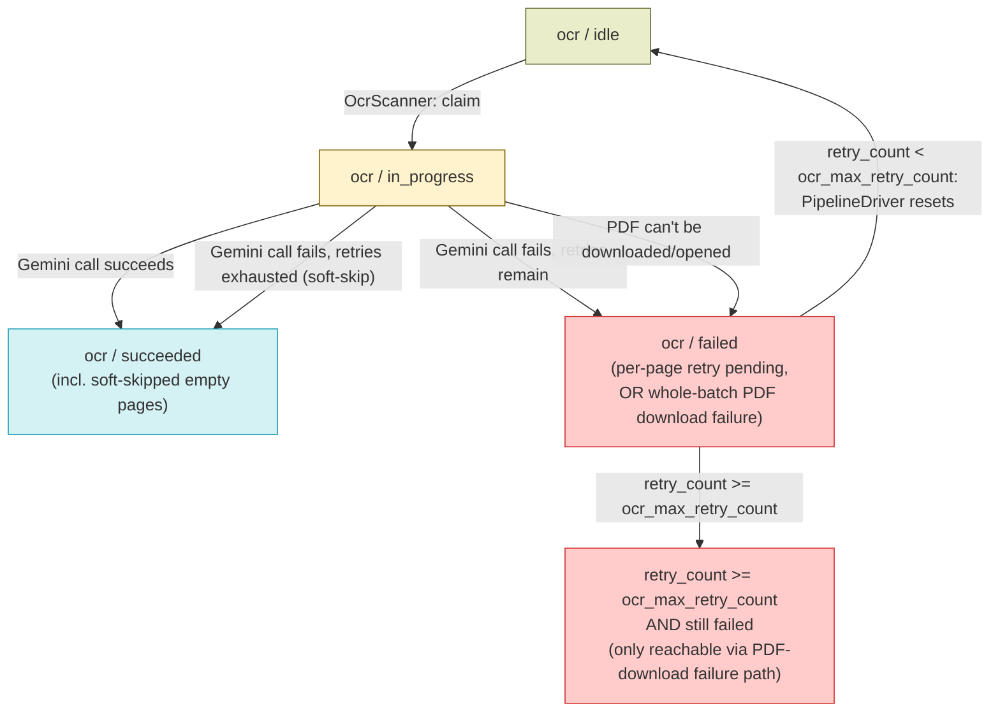

# OCR — Design

See also: [WORKER_DESIGN.md](WORKER_DESIGN.md) for the full pipeline overview and [BOOK_PROCESSING_DIAGRAM.md](BOOK_PROCESSING_DIAGRAM.md) for the cross-stage diagram this stage's Data Flow is scoped from. Previous stage: [DOCUMENT_DISCOVERY_DESIGN.md](DOCUMENT_DISCOVERY_DESIGN.md). Next stage: [CHUNKING_DESIGN.md](CHUNKING_DESIGN.md).

## Overview

OCR is the first mandatory pipeline step. It begins once a `Book` and its empty `Page` stubs already exist (Document Discovery) and ends when every page on the book has `ocr_milestone='succeeded'` — either with real transcribed text or, for pages that never succeed, with a deliberately empty "soft-skipped" page. Handoff to Chunking happens per-page, via the transactional outbox, the moment a page succeeds.

Key characteristics:

- **OCR renders each PDF page to an image (PyMuPDF) and transcribes it with Gemini Vision** — there is no local/offline OCR engine; every page is a single LLM call (or one Gemini Batch API request in batch mode).
- **`OcrScanner` groups claimed work by book, not by page.** Every other cross-stage scanner (Chunking, Embedding, Spell Check) claims pages across all books; OCR claims book-by-book because a book's pages all share one PDF download.
- **Two independent retry loops exist at different levels**: an inner transient-error retry loop per single Gemini Vision call (`OCR_MAX_RETRIES`, env var), and an outer pipeline-level retry budget per page (`ocr_max_retry_count`, `system_configs`) that governs how many times `OcrJob` as a whole will re-attempt a page across separate job runs.
- **Degenerate OCR output is detected and retried like a transient error.** `is_degenerate_ocr_output` (in `app/utils/text.py`) flags output that looks like a runaway repetition/reasoning-leak loop — text longer than 10,000 chars, or a single word repeated ≥50 times and making up ≥30% of all words. The inline path raises `DegenerateOcrOutputError` from `ocr_page_with_gemini`, which the inner retry loop treats as retryable exactly like a transient API error; the batch path applies the same check to each ingested result line.
- **Exhausting the outer retry budget on a single page is a soft-skip, not a failure.** The page is marked `ocr_milestone='succeeded'` with empty text rather than `'failed'`, so a single unreadable page never blocks the book. The only way OCR can genuinely leave a page (in fact, the whole claimed batch) `ocr_milestone='failed'` in a way that can exhaust retries and push the book to `status='error'` is if the book's PDF itself can't be downloaded/opened at all.
- **Optional Gemini Batch API mode** (`gemini_batch_ocr_enabled`, default `false`) replaces the inline per-page Gemini Vision call with an async submit-then-poll cycle against the Gemini Batch API, trading latency for a 50% API cost discount on high-volume ingestion.
- **Table-of-contents detection runs inline during OCR** (`is_toc_page`), setting `pages.is_toc` so Chunking can skip splitting those pages later.
- **The OCR prompt is dynamically augmented with frequent auto-correction rules.** `_build_ocr_prompt` fills the `OCR_PROMPT` template's `{frequent_corrections}` placeholder from `AutoCorrectRulesRepository.get_frequent_corrections_block()` (a cached, formatted block of the active `auto_correct_rules` pairs), steering the model away from common transcription mistakes at the source rather than relying solely on the post-hoc `auto_correct_scanner`.

## Feature Flags

| Flag | Default | Gates |
|---|---|---|
| `gemini_batch_ocr_enabled` | `false` | `ocr_job` — when `"true"`, `ocr_job` delegates every claimed page to `batch_ocr_service.submit_batch_ocr_job()` (Gemini Batch API) instead of OCR'ing pages inline via `ocr_page_with_gemini`. |

## Schema

### `pages` table (columns this stage reads/writes)

| Column | Type | Description |
|---|---|---|
| `text` | `text`, nullable | Set to the OCR'd (and Uyghur-normalized) transcription on success; set to `""` on soft-skip. |
| `is_toc` | `boolean`, default `false` | Set from `is_toc_page(text)` after a successful OCR call (not set on soft-skip, where it's explicitly `false`). |
| `ocr_milestone` | `varchar(20)`, default `"idle"` | `idle \| in_progress \| succeeded (incl. soft-skip) \| failed`. |
| `retry_count` | `integer`, default `0` | Shared failure counter across OCR/chunking/embedding/spell-check; incremented on every `ocr_milestone='failed'` transition and on every soft-skip. |
| `worker_id` / `claimed_at` | `varchar(255)` / `timestamptz`, nullable | Set by `OcrScanner` when it claims a page (`ocr_milestone → in_progress`), then overwritten by `OcrJob` itself with the executing worker's ID once the job starts running. Used by `StaleWatchdog` (see `WORKER_DESIGN.md`) to detect dead workers. |
| `pipeline_step` | `varchar(20)`, nullable | Not read by `OcrScanner`/`OcrJob` to gate work (milestones are authoritative); set for display purposes. |
| `error` | `text`, nullable | Last OCR error message (truncated to 500 chars), including the soft-skip note. |

### `books` table (columns this stage reads/writes)

| Column | Type | Description |
|---|---|---|
| `ocr_milestone` | `varchar(20)`, default `"idle"` | Book-level rollup of page `ocr_milestone`s (`idle \| in_progress \| complete \| partial_failure \| failed`), recomputed by `BookMilestoneService.update_book_milestone_for_step(session, book_id, "ocr")` after every `OcrJob` run. `OcrScanner` reads this column (not a page join) to find books with eligible work. |
| `pipeline_step` | `varchar(20)`, nullable | Set to `"ocr"` by `OcrJob` when it starts processing a book. |

### `batch_ocr_jobs` table (batch mode only)

| Column | Type | Description |
|---|---|---|
| `id` | `varchar(64)`, PK | UUID generated at submission time. |
| `gemini_batch_id` | `varchar(255)`, unique, nullable | The Gemini Batch API job name (`batch_job.name`); `NULL` if submission itself failed. |
| `book_id` | `varchar(64)`, FK | References `books.id`, `ON DELETE CASCADE`. |
| `page_ids` | array of `integer` | The `Page.id`s included in this sub-batch. |
| `status` | `varchar(20)` | `submitting \| submitted \| running \| succeeded \| failed \| cancelled` (`check_batch_ocr_jobs_status` constraint). |
| `gcs_input_uri` / `gcs_output_uri` | `text`, nullable | Storage location of the request JSONL (input) and, when applicable, the result JSONL (output). |
| `total_pages` / `processed_pages` | `integer`, default `0` | Page counts for progress tracking. |
| `error` | `text`, nullable | Submission or polling failure message. |
| `submitted_at` / `completed_at` | `timestamptz`, nullable | Lifecycle timestamps. |
| `created_at` / `updated_at` | `timestamptz` | Row lifecycle timestamps; `updated_at` auto-updates on every change. |

## Architecture

| File | Purpose |
|---|---|
| `services/worker/scanners/ocr_scanner.py` | `run_ocr_scanner` — claims idle OCR pages grouped by book, dispatches one `OcrJob` per book. |
| `services/worker/jobs/ocr_job.py` | `ocr_job` — downloads the book's PDF, OCRs each claimed page via Gemini Vision (or delegates to batch submission), marks each page succeeded/soft-skipped/failed. |
| `services/worker/scanners/batch_ocr_poller_scanner.py` | `run_batch_ocr_poller_scanner` — polls in-flight `batch_ocr_jobs`, ingests completed results (no-op unless batch mode has been used). |
| `packages/backend-core/app/services/ocr_service.py` | `ocr_page_with_gemini` — renders one PDF page to a JPEG and calls Gemini Vision, with an inner retry loop covering both transient API errors and degenerate/repetitive output. Used by the inline (non-batch) path. |
| `packages/backend-core/app/services/batch_ocr_service.py` | `submit_batch_ocr_job` / `poll_and_process_batch_ocr_jobs` — builds and submits Gemini Batch API JSONL requests, and polls/ingests results. |
| `packages/backend-core/app/db/repositories/pages_repository.py` | `PagesRepository` — generic page CRUD/upsert; OCR's page-claiming itself uses raw `SELECT ... FOR UPDATE SKIP LOCKED` in `ocr_scanner.py`, not this repository. |
| `services/backend/api/endpoints/books_router.py` | Hosts `POST /{book_id}/reprocess/ocr` and `POST /{book_id}/pages/{page_num}/reset`, the admin-facing OCR recovery endpoints. |

## Data Flow



## Component Responsibilities

**OcrScanner — `run_ocr_scanner(ctx)`:**

```
1. Fetch scanner_book_limit (system_configs, default 2) and
   ocr_scanner_batch_size (system_configs, default 10).
2. Select up to scanner_book_limit books with book.ocr_milestone in
   ('idle', 'in_progress', 'partial_failure'), oldest upload_date first
   (a denormalized column read, not a join against pages).
3. For each selected book, in its own transaction:
     a. SELECT Page.id WHERE book_id=? AND ocr_milestone='idle'
        FOR UPDATE SKIP LOCKED LIMIT ocr_scanner_batch_size.
     b. If no rows, skip this book.
     c. UPDATE those pages: ocr_milestone='in_progress',
        worker_id=<this worker>, claimed_at=now().
     d. Recompute the book's rolled-up ocr_milestone
        (BookMilestoneService.update_book_milestone_for_step) to 'in_progress'.
     e. Commit, then enqueue ocr_job(book_id, page_ids) via ARQ.
```

**OcrJob — `ocr_job(ctx, book_id, page_ids)`:**

```
1. Acquire a MultiPageLock (Redis SET NX, prefix="ocr", 1h expiry) for
   page_ids; pages whose lock couldn't be acquired are dropped from this
   run (picked up again next scanner tick). If zero locks acquired, exit.
2. Overwrite worker_id/claimed_at on the locked pages with this executing
   worker's ID (the scanner's claim may have been made by a different
   worker instance that only enqueued the job).
3. Fetch system_configs: gemini_ocr_model (required, no fallback —
   raises RuntimeError if unset), ocr_max_parallel_pages (default 4 via
   the job's own fallback constant, but seeded to 1 in system_configs —
   see Configuration Reference), gemini_ocr_timeout, ocr_max_retry_count
   (default 3 via fallback, but seeded to 10), gemini_batch_ocr_enabled,
   gemini_batch_ocr_batch_size.
4. Set book.pipeline_step = 'ocr'.
5. Download the book's PDF to settings.uploads_dir/{book_id}.pdf if not
   already cached locally, trying uploads/{book_id}.pdf, then
   uploads/{file_name}, then uploads/{title}.pdf as fallback remote
   paths; also re-download if the cached file fails to open with fitz.
   ON FAILURE (PDF can't be obtained via any candidate path):
     - Mark ALL locked pages ocr_milestone='failed', retry_count+=1,
       emit 'ocr_failed' events for each.
     - Recompute the book's rolled-up ocr_milestone.
     - Return — nothing further runs for this job invocation.
6. Load the Page rows for the locked IDs.
7. IF gemini_batch_ocr_enabled: for each sub-batch of up to
   gemini_batch_ocr_batch_size pages, call
   batch_ocr_service.submit_batch_ocr_job(); on a submission exception,
   mark that sub-batch's pages ocr_milestone='failed', retry_count+=1,
   emit 'ocr_failed' events, and recompute the book milestone. Close the
   PDF doc and return — batch_ocr_poller_scanner takes over from here.
8. ELSE, for each page (concurrently, semaphore-limited to
   ocr_max_parallel_pages):
     a. Render the page to a JPEG via PyMuPDF
        (zoom = OCR_PAGE_ZOOM_FACTOR, default 1.5x).
     b. Call ocr_page_with_gemini(page, model, timeout) — Gemini Vision
        with its own inner retry loop (transient errors AND degenerate/
        repetitive output both retried, then raised if still failing).
     c. ON SUCCESS: run is_toc_page() on the cleaned text; UPDATE the page
        (text, is_toc, ocr_milestone='succeeded'); emit an 'ocr_succeeded'
        pipeline event.
     d. ON EXCEPTION (transient error or DegenerateOcrOutputError,
        exhausted): next_retry_count = page.retry_count + 1.
          IF next_retry_count >= ocr_max_retry_count:
            SOFT-SKIP — UPDATE the page: text='', is_toc=False,
            ocr_milestone='succeeded' (NOT 'failed'), retry_count=next,
            error="OCR failed after {N} retries: {msg}. Page skipped.".
            Emit an 'ocr_succeeded' event (payload extra_fields:
            skipped=true, error=<msg>).
          ELSE:
            UPDATE the page: ocr_milestone='failed', retry_count=next,
            error=<msg>. Emit an 'ocr_failed' event.
9. After all pages processed, recompute the book's rolled-up
   ocr_milestone (BookMilestoneService.update_book_milestone_for_step)
   and call PagesRepository.sync_content_page_offset(book_id) to
   recompute book.content_page_offset from MAX(page_number) WHERE
   is_toc IS TRUE.
10. Release the MultiPageLock (finally block).
```

The exhaustion check (step 8d) is the exact branch that decides soft-skip vs. hard failure: `next_retry_count >= ocr_max_retry_count` always lands the page on `ocr_milestone='succeeded'` with empty text, never on `'failed'`. `ocr_milestone='failed'` for an *individual page* processed inline only ever happens on an attempt that has *not yet* exhausted the retry budget — it is a transient state `PipelineDriver` resets back to `idle`. The only way OCR leaves pages durably `failed` (and thus eligible to push the book to `status='error'` once `retry_count >= ocr_max_retry_count`) is the PDF-download failure in step 5, which marks the entire claimed batch failed at once without going through the per-page soft-skip logic at all.

**`batch_ocr_service.submit_batch_ocr_job(session, book_id, pages, doc, gemini_ocr_model)`:**

```
1. Build one JSONL line per page: render to JPEG (PyMuPDF, same
   OCR_PAGE_ZOOM_FACTOR), base64-encode, embed alongside the OCR prompt
   as a Gemini Batch API request entry (custom_id="page_{id}",
   thinking disabled via `disabled_thinking_config(model)` —
   thinking_budget=0 for pre-3.x models, thinking_level="MINIMAL" for
   Gemini 3.x+ which reject thinking_budget=0 — to avoid silent empty
   output from reasoning burn-through).
2. Upload the JSONL to storage as an audit copy
   (batch_ocr/inputs/{job_id}.jsonl).
3. Upload the same JSONL to the Gemini Files API and call
   client.batches.create(model=..., src=uploaded_file.name).
4. Create a BatchOCRJob row (status='submitted' on success, 'failed' on
   any exception during upload/create) recording gemini_batch_id,
   page_ids, gcs_input_uri, total_pages.
5. IF submission failed: mark all pages in this sub-batch
   ocr_milestone='failed', retry_count+=1, and recompute the book
   milestone.
```

**`batch_ocr_poller_scanner` → `batch_ocr_service.poll_and_process_batch_ocr_jobs(session)`:**

```
1. Fetch gemini_batch_ocr_timeout_hours (default 24) and
   ocr_max_retry_count (default 10, via the same shared config key OCR
   uses inline).
2. Load all BatchOCRJob rows with status IN
   ('submitting', 'submitted', 'running').
3. For each job:
     a. IF (now - created_at) > timeout_hours: mark the job 'failed',
        mark every page in it ocr_milestone='failed'/retry_count+=1,
        recompute the book milestone, continue to the next job.
     b. Call client.batches.get(name=job.gemini_batch_id).
     c. RUNNING → update local status only.
     d. PENDING/SUBMITTED → no-op this tick.
     e. SUCCEEDED → download the result JSONL (Files API or GCS output
        URI); for each result line:
          - On a per-item error, an empty response after cleaning, or
            degenerate/repetitive output (is_degenerate_ocr_output):
            apply the same soft-skip-at-exhaustion rule as the inline
            path (_record_page_ocr_failure) — mark 'failed'/
            retry_count+=1 if retries remain, or soft-skip to
            'succeeded' with empty text once ocr_max_retry_count is
            reached.
          - On success: write text/is_toc, ocr_milestone='succeeded',
            emit 'ocr_succeeded' (payload: batch=true).
        Mark the BatchOCRJob 'succeeded' and recompute the book milestone.
     f. FAILED/CANCELLED → mark the job 'failed', mark every page in it
        ocr_milestone='failed'/retry_count+=1, recompute the book
        milestone.
```

## State Machine



`EXHAUSTED` is the state that can push `book.status='error'` (via `PipelineDriver`, see `WORKER_DESIGN.md`). Because per-page Gemini failures always soft-skip to `OCR_OK` before reaching that point, `EXHAUSTED` is in practice only reached through the PDF-download-failure path.

## Error Handling & Retries

| Scenario | Behavior |
|---|---|
| Gemini Vision call raises a transient error (network, 429, 503, "overloaded", "resource_exhausted"), or the output looks degenerate/repetitive (`is_degenerate_ocr_output` — >10,000 chars, or a single word repeated ≥50 times making up ≥30% of all words, raised as `DegenerateOcrOutputError`) | Retried inside `ocr_page_with_gemini`'s own loop, up to `OCR_MAX_RETRIES` (env, default 4) attempts with exponential backoff + jitter, *before* the exception ever reaches `ocr_job`. |
| Gemini Vision call fails after inner retries are exhausted, and `retry_count + 1 < ocr_max_retry_count` | Page set `ocr_milestone='failed'`, `retry_count+=1`. `PipelineDriver` resets it to `idle` on its next run so `OcrScanner` reclaims it. This never blocks the book — it's a transient state. |
| Gemini Vision call fails and `retry_count + 1 >= ocr_max_retry_count` | **Soft-skip**: page set `ocr_milestone='succeeded'` with `text=''`, `is_toc=False`, and an `error` note ("...Page skipped."). Emits `ocr_succeeded` (not `ocr_failed`) so the page flows through Chunking/Embedding as an empty, harmless page. This is the behavior that keeps a single unreadable page from ever exhausting the *mandatory-step* failure that `PipelineDriver` checks for. |
| Book's PDF file can't be downloaded from any candidate storage path, or can't be opened by PyMuPDF even after a fresh re-download | **The one genuine hard-failure path.** Every page claimed by this job run is marked `ocr_milestone='failed'`, `retry_count+=1` — no soft-skip logic applies here since the failure isn't per-page. If retries are exhausted, this is what can push `book.status='error'`. |
| Batch OCR submission itself fails (upload/`client.batches.create` exception) | The affected sub-batch's pages are marked `ocr_milestone='failed'`, `retry_count+=1`, same as the inline PDF-download failure — not a soft-skip, since nothing about this page specifically failed. |
| Batch OCR job exceeds `gemini_batch_ocr_timeout_hours` (default 24h) while still `submitting`/`submitted`/`running` | All pages in the batch job marked `ocr_milestone='failed'`, `retry_count+=1`; the `BatchOCRJob` row is marked `'failed'`. |
| Batch OCR job reaches Gemini state `FAILED`/`CANCELLED` | Same as timeout — all pages in the job marked `ocr_milestone='failed'`, `retry_count+=1`. |
| Batch OCR per-item result has an `error` field, the transcription is empty after cleaning, or the transcription is degenerate/repetitive (`is_degenerate_ocr_output`) | `_record_page_ocr_failure` applies the identical soft-skip-at-exhaustion rule as the inline path: `failed`/`retry_count+=1` while budget remains, soft-skip to `succeeded` with empty text once exhausted. |
| A page's Redis lock can't be acquired (another job already holds it) | That page is silently dropped from this `OcrJob` run (not marked failed) — it stays `in_progress` and is picked up again once the lock expires (1h) or `StaleWatchdog` resets it. |

## Configuration Reference

| Key | Default | Used by |
|---|---|---|
| `ocr_max_retry_count` (`system_configs`) | `10` | `ocr_scanner`'s dependency check is book-level only; `ocr_job` and `batch_ocr_service` both use this as the pipeline-level retry budget that decides soft-skip vs. genuine failure. Both call sites also carry their own in-code fallback of `"3"`, used only if the key is ever missing from `system_configs` — the seeded default is `10`. |
| `ocr_max_parallel_pages` (`system_configs`) | `1` | `ocr_job` — pages OCR'd concurrently within one job via `asyncio.Semaphore`. The job's own fallback constant if the key is missing is `4`, but the seeded default is `1` (sequential). |
| `ocr_scanner_batch_size` (`system_configs`) | `10` | `ocr_scanner` — idle pages claimed per book per run. |
| `scanner_book_limit` (`system_configs`) | `2` | `ocr_scanner` — books dispatched per run. (Code fallback if unset is `10`; the seeded value is `2`.) |
| `gemini_ocr_timeout` (`system_configs`) | `300` (seconds) | `ocr_job` — per-page Gemini Vision call timeout, passed through to `ocr_page_with_gemini`. |
| `gemini_ocr_model` (`system_configs`) | `gemini-3.5-flash` | `ocr_job` / `batch_ocr_service` — required with no code fallback; `ocr_job` raises `RuntimeError` if unset. |
| `OCR_MAX_RETRIES` (env, `packages/backend-core/app/core/config.py`) | `4` | `ocr_service.ocr_page_with_gemini` — inner transient-error retry loop for a single Gemini Vision call, independent of and nested inside the outer `ocr_max_retry_count` budget. |
| `OCR_PAGE_ZOOM_FACTOR` (env) | `1.5` | `ocr_service` / `batch_ocr_service` — PyMuPDF render resolution multiplier for both the inline and batch page-image rendering. |
| `OCR_MAX_OUTPUT_TOKENS` (env, `packages/backend-core/app/core/config.py`) | `4096` | `generate_text_with_image` (inline) and the batch request's `generation_config` — hard ceiling on Gemini output tokens per page, to stop a runaway model from generating (and billing) unboundedly. |
| `gemini_batch_ocr_enabled` (`system_configs`) | `false` | `ocr_job` — routes OCR through the Gemini Batch API instead of the inline per-page call. |
| `gemini_batch_ocr_batch_size` (`system_configs`) | `50` | `ocr_job` — pages per submitted Gemini Batch API sub-job. |
| `gemini_batch_ocr_timeout_hours` (`system_configs`) | `24` | `batch_ocr_poller_scanner` — wall-clock timeout before a stuck batch job's pages are marked failed. |

**Note:** the plan for this doc anticipated a `gemini_batch_ocr_max_retry_count` key mirroring embedding's `gemini_batch_embedding_max_retry_count`, but no such key exists in `packages/backend-core/app/db/seeds.py` or anywhere in `batch_ocr_service.py` — batch-mode per-item retries reuse the same `ocr_max_retry_count` budget as the inline OCR path (see `_record_page_ocr_failure` in `batch_ocr_service.py`). This key is omitted from the table above since it does not exist in the current code.

## API Endpoints

| Endpoint | Role required | Effect |
|---|---|---|
| `POST /{book_id}/reprocess/ocr` | `Depends(require_admin)` (ADMIN only) | Resets OCR and all downstream page milestones (`ocr`/`chunking`/`embedding`/`spell_check`) to `idle`, `retry_count=0`; sets `book.status='pending'`, `book.pipeline_step='ocr'`. Non-destructive — existing `text` is preserved until `OcrScanner`/`OcrJob` overwrite it. |
| `POST /{book_id}/pages/{page_num}/reset` | `Depends(require_editor)` (ADMIN or EDITOR) | Resets a single page: `status='pending'`, `text=None`, `is_indexed=False`, `pipeline_step='ocr'`, all four milestones back to `idle`, `retry_count=0`. Recomputes book-level milestones and sets `book.status='pending'` so `OcrScanner` picks the page back up from scratch. |

Note the role asymmetry: `/reprocess/ocr` requires ADMIN while the otherwise-equivalent `/reprocess/chunking`, `/reprocess/embedding`, and `/reprocess/spell-check` endpoints (and `/pages/{page_num}/reset` itself) only require EDITOR — re-running OCR is gated more strictly since it's the most expensive step to redo at scale.

## Testing

- `services/worker/tests/jobs/ocr_job_test.py` — `OcrJob`, including `test_ocr_job_success`, `test_ocr_job_failure_retry`, `test_ocr_job_failure_exhausted_skip` (the soft-skip path), `test_ocr_job_batch_mode_delegates_to_batch_submission`, `test_ocr_job_batch_mode_submission_error_marks_pages_failed`.
- `services/worker/tests/scanners/ocr_scanner_test.py` — `OcrScanner`.
- `packages/backend-core/tests/app/services/ocr_service_test.py` — `ocr_page_with_gemini` (inline OCR + inner retry loop), including `test_ocr_page_with_gemini_retries_on_degenerate_output` and `test_ocr_page_with_gemini_raises_after_exhausting_retries_on_degenerate_output`.
- `packages/backend-core/tests/app/services/batch_ocr_service_test.py` — `submit_batch_ocr_job`, `poll_and_process_batch_ocr_jobs`, including `test_submit_batch_ocr_job_uses_thinking_level_for_v3_model` and `test_poll_and_process_batch_ocr_jobs_degenerate_response_marks_failed`.

## Related Docs

- [DOCUMENT_DISCOVERY_DESIGN.md](DOCUMENT_DISCOVERY_DESIGN.md) — previous stage; provides the `Book` + `Page` stub rows OCR operates on.
- [CHUNKING_DESIGN.md](CHUNKING_DESIGN.md) — next stage; claims pages once `ocr_milestone='succeeded'`.
- [WORKER_DESIGN.md](WORKER_DESIGN.md) — full pipeline, `PipelineDriver`, `MultiPageLock`, `StaleWatchdog`, and the shared milestone/state-machine conventions.
- [BOOK_PROCESSING_DIAGRAM.md](BOOK_PROCESSING_DIAGRAM.md) — cross-stage diagram; this doc's Data Flow is the OCR-only slice of its "Full Pipeline" and "Batch OCR & Batch Embedding" diagrams.
