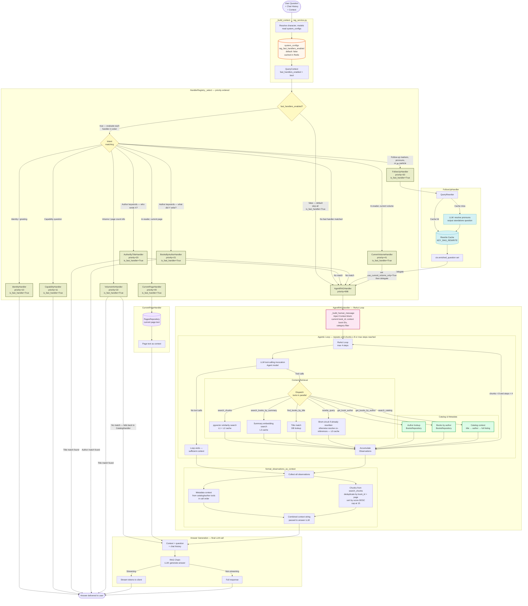
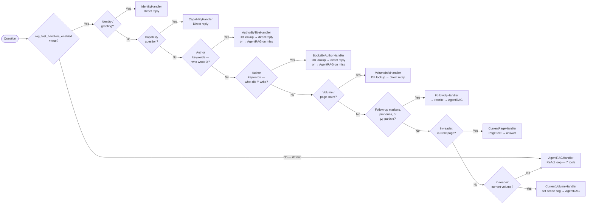
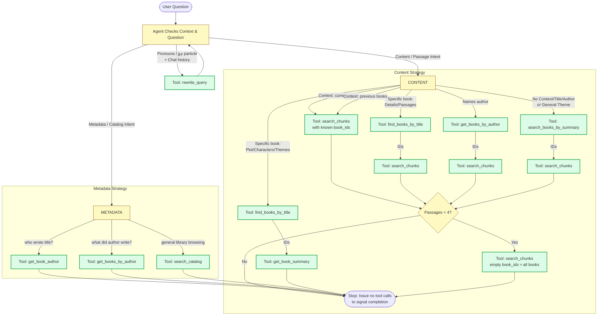

# Question Answering Pipeline Diagram — v3

Visual representation of the current RAG question answering pipeline after introducing the `rag_fast_handlers_enabled` feature flag.

**Changes from v2:**
- `rag_fast_handlers_enabled` system_config added (default `"false"`) — when off, all 8 keyword-based fast-path handlers are skipped and every query goes directly to `AgentRAGHandler`
- `QueryHandler` base class gains `is_fast_handler: bool = False`; all 8 non-agent handlers set it to `True`
- `HandlerRegistry._select()` skips any handler where `is_fast_handler=True and not ctx.fast_handlers_enabled`
- `QueryContext` gains `fast_handlers_enabled: bool = False`, resolved from `system_configs` in `_build_context()` (Redis-cached via `cache_ttl_system_config`)
- No handler logic or tool set changed — fast handlers are fully intact and re-activate the moment the flag is set to `"true"`

**Changes from v1 (carried forward):**
- `StandardRAGHandler` removed from registry (agent is now the sole fallback)
- `CatalogHandler` removed from registry — converted to `search_catalog` agent tool
- `AuthorByTitleHandler` and `BooksByAuthorHandler` kept as fast-path handlers (priority 20/21) **and** exposed as agent tools for compound queries
- `FollowUpHandler` and `CurrentVolumeHandler` now delegate to `AgentRAGHandler`
- Three new agent tools: `get_book_author`, `get_books_by_author`, `search_catalog`
- `context_builder` accumulates both metadata context (catalog/author tools) and chunk context
- `AGENT_MAX_CONTEXT_CHUNKS = 15` cap applied after score-sort
- LLM "categorize question" call eliminated entirely
- `FollowUpHandler` now also detects the "چۇ" topic-shift clitic ("what about X?") as heuristic 3
- Context injection: agent's first message includes `[Context]` block (current book, context book IDs, category filter) — agent skips book-discovery step when book is known
- `rewrite_query` tool short-circuits when `ctx.enriched_question` is already set (pre-rewritten by `FollowUpHandler`)

---

## Full Pipeline

---

## Handler Routing Reference

---

## Agentic Retrieval Strategy

This diagram illustrates the agent's internal decision tree for tool selection, governed entirely by the `AGENT_SYSTEM_PROMPT`.

---

## Agent Tools Reference

| Tool | Type | Wraps | When agent calls it |
|------|------|-------|---------------------|
| `rewrite_query` | Utility | `QueryRewriter` | Question has pronouns or "چۇ" particle and chat history exists; short-circuits if already rewritten by `FollowUpHandler` |
| `find_books_by_title` | Content | `BooksRepository` title match | Question explicitly names a book title and no book_id in `[Context]` |
| `search_books_by_summary` | Content | `BookSummariesRepository` | Finding which books cover a topic; skipped when `[Context]` provides book IDs |
| `search_chunks` | Content | pgvector similarity search | Retrieving passages; uses L1+L2 cache; called directly with `[Context]` book_id when available |
| `get_book_author` | Metadata | `BooksRepository` | All author queries when `rag_fast_handlers_enabled=false`; compound queries when flag is on |
| `get_books_by_author` | Metadata | `BooksRepository` | All books-by-author queries when flag is off; compound queries when flag is on |
| `search_catalog` | Metadata | `CatalogHandler._build_catalog_context` | Library browsing, listing, general catalog questions |

---

## Cache Layers

| Level | Key | Populated By | Purpose |
|-------|-----|-------------|---------|
| **L0** | `KEY_RAG_REWRITE` | `rewrite_query` tool / FollowUpHandler | Deduplicate follow-up rewrites |
| **L1** | `KEY_RAG_EMBEDDING` | First embed call per query | Reuse embeddings across all tools |
| **L2** | `KEY_RAG_SEARCH_SINGLE/MULTI` | `search_chunks` tool | Reuse pgvector search results |
| **L3** | `KEY_RAG_SUMMARY_SEARCH` | `search_books_by_summary` tool | Reuse book-selection results |
| **config** | `config:rag_fast_handlers_enabled` | `SystemConfigsRepository.get_value` | Avoids DB hit on every request; invalidated by `set_value` |

---

## LLM Calls (in execution order)

| # | Call | Triggered By | Condition | Purpose |
|---|------|-------------|-----------|---------|
| 1 | Query rewrite | FollowUpHandler | Follow-up detected **and** `rag_fast_handlers_enabled=true` | Resolve pronouns → standalone question |
| 2 | Agent ReAct loop (1–4×) | AgentRAGHandler | Always — every query when flag is off; unmatched intents when flag is on | Tool-calling loop — choose and invoke retrieval tools |
| 3 | Answer generation | AgentRAGHandler (final) | Always | Generate answer from accumulated context |

> **Removed vs v1:** LLM call "Categorize question" (StandardRAGHandler) no longer exists.

---

## Key Components

| Component | Role |
|-----------|------|
| **HandlerRegistry** | Evaluates `can_handle()` in priority order; skips handlers where `is_fast_handler=True` when `ctx.fast_handlers_enabled=False` |
| **QueryHandler.is_fast_handler** | Class-level flag (`False` on base, `True` on all 8 non-agent handlers); used by registry to apply the feature gate |
| **QueryContext.fast_handlers_enabled** | Resolved from `system_configs` once per request in `_build_context()`; gates all fast handlers |
| **QueryRewriter** | LLM-based standalone question generator; resolves pronouns using conversation history |
| **AuthorByTitleHandler** | Fast path for "who wrote X?" — keyword detect + DB lookup, zero agent calls; falls back to AgentRAG on miss; gated by feature flag |
| **BooksByAuthorHandler** | Fast path for "list books by Y" — keyword detect + DB lookup, zero agent calls; falls back to AgentRAG on miss; gated by feature flag |
| **FollowUpHandler** | Detects follow-up signals (markers, pronouns, "چۇ" clitic); rewrites question via LLM; delegates to AgentRAG; gated by feature flag |
| **AgentRAGHandler** | Handles every query when flag is off (`is_fast_handler=False`, never skipped); fallback for unmatched intents when flag is on; injects `[Context]` block; runs ReAct loop with 7 tools |
| **_build_human_message** | Enriches the agent's first HumanMessage with current book_id, context book IDs, and category filter; enables agent to skip book-discovery step |
| **format_observations_as_context** | Combines metadata context (catalog/author tools) + deduplicated, score-sorted chunks (cap 15) |
| **AnswerBuilder** | Formats chunks into LangChain documents; invokes final RAG chain (streaming or batch) |
| **retrieval.py** | Shared I/O primitives (`embed_query`, `vector_search`, `find_books_by_title_in_question`) used by agent tools |
| **agent/config.py** | Centralized ReAct loop magic numbers (`AGENT_MAX_STEPS`, `AGENT_ENOUGH_CHUNKS`, `AGENT_MAX_CONTEXT_CHUNKS`) |
| **ChunksRepository** | pgvector `similarity_search` against `chunks` table |
| **BookSummariesRepository** | pgvector `summary_search` against `book_summaries` for book selection |
| **CatalogHandler** | Utility class (not in registry); used by `search_catalog` tool and VolumeInfoHandler fallback |
| **QueryContext** | Mutable dataclass threaded through the pipeline; accumulates enriched question, vector, book IDs, scores, agent metrics, and `fast_handlers_enabled` flag |

---

## Feature Flag Reference

| Config key | Table | Default | Effect when `"true"` |
|------------|-------|---------|----------------------|
| `rag_fast_handlers_enabled` | `system_configs` | `"false"` | Enables all 8 keyword-based fast-path handlers in priority order before the agent fallback |

To enable: `UPDATE system_configs SET value = 'true' WHERE key = 'rag_fast_handlers_enabled';`
Change propagates within `cache_ttl_system_config` seconds — no restart required.
