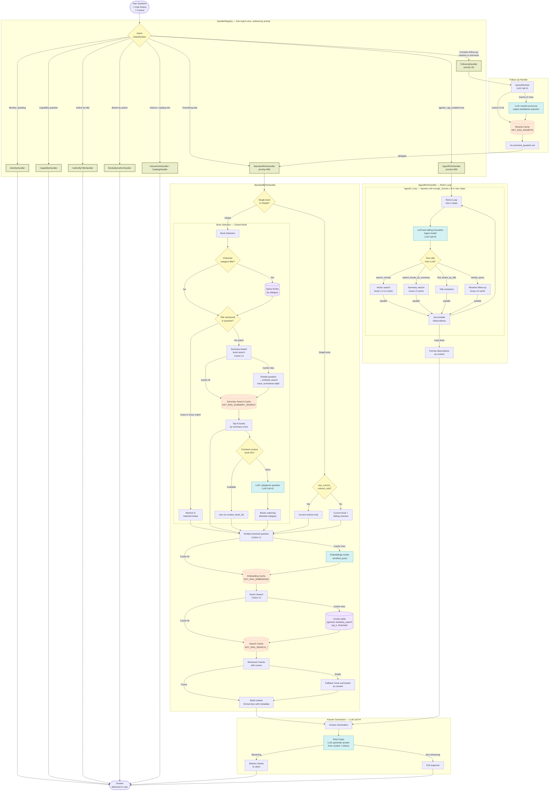
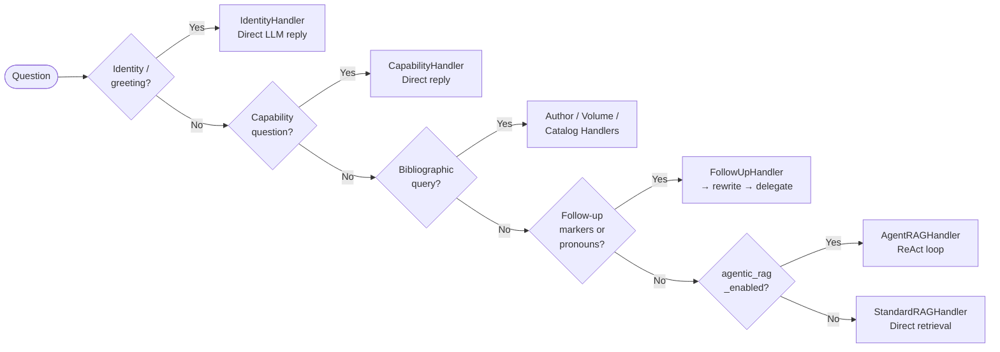

# Question Answering Pipeline Diagram

Visual representation of the RAG question answering pipeline — from user question to streamed answer — including handler routing, query rewriting, book selection, vector search, agentic loop, and answer generation.

---

## Full Pipeline

---

## Handler Routing Reference

---

## Cache Layers

| Level | Key | Populated By | Invalidated After | Purpose |
|-------|-----|-------------|-------------------|---------|
| **L0** | `KEY_RAG_REWRITE` | QueryRewriter | `cache_ttl_rag_query` | Deduplicate follow-up rewrites |
| **L1** | `KEY_RAG_EMBEDDING` | First embed call | `cache_ttl_rag_query` | Reuse expensive embeddings across handlers/tools |
| **L2** | `KEY_RAG_SEARCH_SINGLE/MULTI` | Vector search | `cache_ttl_rag_query` | Reuse pgvector search results |
| **L3** | `KEY_RAG_SUMMARY_SEARCH` | Summary book search | `cache_ttl_rag_query` | Reuse book-selection results |

All caches degrade gracefully: on failure, the pipeline continues uncached with a warning log.

---

## LLM Calls (in execution order)

| # | Call | Handler | Condition | Purpose |
|---|------|---------|-----------|---------|
| 1 | Query rewrite | FollowUpHandler | Follow-up detected | Resolve pronouns → standalone question |
| 2 | Categorize question | StandardRAGHandler | No books found via title/summary/context | Auto-detect book categories to restrict search |
| 3 | Agent ReAct loop (1–4×) | AgentRAGHandler | `agentic_rag_enabled=true` | Tool-calling loop to iteratively retrieve chunks |
| 4 | Answer generation | All handlers (final) | Always | Generate answer from retrieved context |

---

## Key Components

| Component | Role |
|-----------|------|
| **HandlerRegistry** | Evaluates `can_handle()` for each handler in priority order; dispatches to first match |
| **QueryRewriter** | LLM-based standalone question generator; resolves pronouns using conversation history |
| **StandardRAGHandler** | Primary retrieval path: hierarchical book selection → embed → vector search → answer |
| **AgentRAGHandler** | Agentic path: LLM decides which tools to call in a ReAct loop until sufficient chunks collected |
| **AnswerBuilder** | Formats retrieved chunks into LangChain documents; invokes final RAG chain (streaming or batch) |
| **ChunksRepository** | pgvector `similarity_search` against the `chunks` table using cosine distance |
| **BookSummariesRepository** | pgvector `summary_search` against `book_summaries` for coarse book selection |
| **QueryContext** | Mutable dataclass threaded through the whole pipeline; accumulates enriched question, vector, book IDs, scores |
