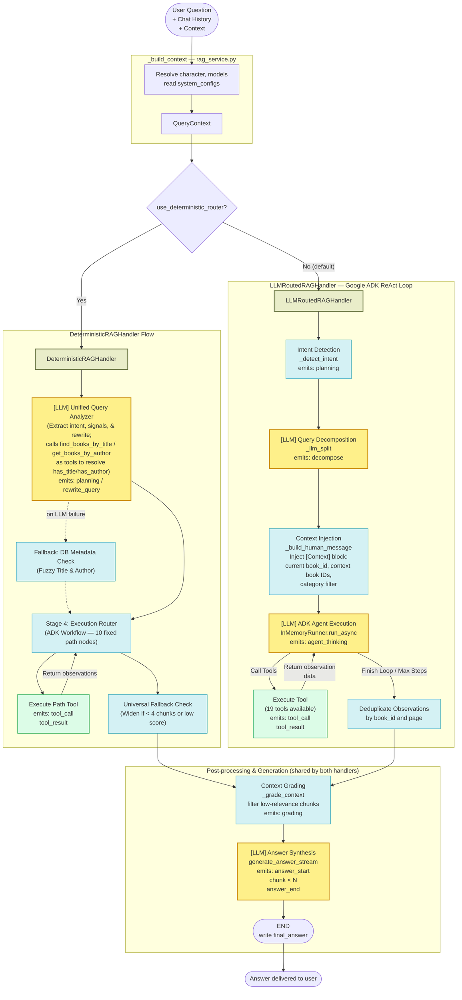
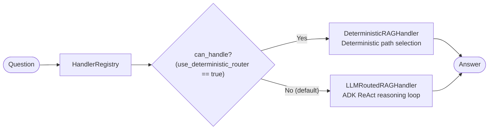
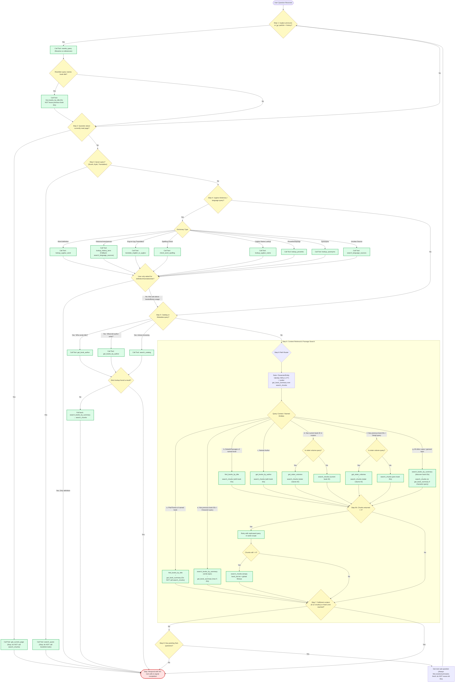

# Question Answering Pipeline Diagram

Visual representation of the RAG question answering pipeline, covering both `DeterministicRAGHandler` and `LLMRoutedRAGHandler`. Which one handles a given request is decided per-request by `HandlerRegistry` based on the `use_deterministic_router` system config (default `false`, so `LLMRoutedRAGHandler` is the default active handler).

---

## Full Pipeline

```mermaid
flowchart TD
    %% Entry
    Q(["User Question<br/>+ Chat History<br/>+ Context"]) --> BUILD

    %% Context build
    subgraph ContextBuild ["_build_context — rag_service.py"]
        BUILD["Resolve character, models<br/>read system_configs"] --> CTX[QueryContext]
    end

    CTX --> ROUTE{use_deterministic_router?}

    ROUTE -- Yes --> H_DET["DeterministicRAGHandler"]
    ROUTE -- No (default) --> H_AG["LLMRoutedRAGHandler"]

    %% Deterministic Router Flow
    subgraph DetRouter ["DeterministicRAGHandler Flow"]
        H_DET --> S1_LLM["[LLM] Unified Query Analyzer<br/>(Extract intent, signals, & rewrite;<br/>calls find_books_by_title / get_books_by_author<br/>as tools to resolve has_title/has_author)<br/>emits: planning / rewrite_query"]
        S1_LLM -.->|on LLM failure| S1_DB["Fallback: DB Metadata Check<br/>(Fuzzy Title & Author)"]
        S1_DB -.-> S4
        S1_LLM --> S4["Stage 4: Execution Router<br/>(ADK Workflow — 10 fixed path nodes)"]
        S4 --> T_DET["Execute Path Tool<br/>emits: tool_call<br/>tool_result"]
        T_DET -->|Return observations| S4
        S4 --> DET_MERGE["Universal Fallback Check<br/>(Widen if < 4 chunks or low score)"]
    end

    %% LLM-Routed RAG — Google ADK Execution Flow
    subgraph LLMRoutedRAG ["LLMRoutedRAGHandler — Google ADK ReAct Loop"]
        H_AG --> INTENT["Intent Detection<br/>_detect_intent<br/>emits: planning"]
        INTENT --> DECOMP["[LLM] Query Decomposition<br/>_llm_split<br/>emits: decompose"]
        DECOMP --> CTX_INJ["Context Injection<br/>_build_human_message<br/>Inject [Context] block:<br/>current book_id, context book IDs,<br/>category filter"]
        CTX_INJ --> ADK["[LLM] ADK Agent Execution<br/>InMemoryRunner.run_async<br/>emits: agent_thinking"]

        ADK -->|Call Tools| TOOL["Execute Tool<br/>(19 tools available)<br/>emits: tool_call<br/>tool_result"]
        TOOL -->|Return observation<br/>data| ADK

        ADK -->|Finish Loop / Max Steps| DEDUP["Deduplicate Observations<br/>by book_id and page"]
    end

    DET_MERGE --> GRADE
    DEDUP --> GRADE

    subgraph PostProcess ["Post-processing & Generation (shared by both handlers)"]
        GRADE["Context Grading<br/>_grade_context<br/>filter low-relevance chunks<br/>emits: grading"]
        GRADE --> SYNTHESIS["[LLM] Answer Synthesis<br/>generate_answer_stream<br/>emits: answer_start<br/>chunk × N<br/>answer_end"]
        SYNTHESIS --> END_AG(["END<br/>write final_answer"])
    end

    END_AG --> ANS(["Answer delivered to user"])

    classDef handler fill:#e9edc9,stroke:#606c38,stroke-width:2px
    classDef tool fill:#dcfce7,stroke:#16a34a,stroke-width:1px
    classDef process fill:#d4f1f4,stroke:#189ab4,stroke-width:1px
    classDef llm fill:#fef08a,stroke:#ca8a04,stroke-width:2px

    class H_AG,H_DET handler
    class TOOL,T_DET tool
    class INTENT,CTX_INJ,DEDUP,GRADE,S1_DB,S4,DET_MERGE process
    class DECOMP,ADK,SYNTHESIS,S1_LLM llm
```

---

## Handler Routing Reference

```mermaid
flowchart LR
    Q([Question]) --> REG["HandlerRegistry"]
    REG --> CAN_DET{"can_handle?<br/>(use_deterministic_router == true)"}
    CAN_DET -- Yes --> DET["DeterministicRAGHandler<br/>Deterministic path selection"]
    CAN_DET -- No (default) --> ADK["LLMRoutedRAGHandler<br/>ADK ReAct reasoning loop"]
    DET --> ANS([Answer])
    ADK --> ANS([Answer])
```

---

## LLMRoutedRAGHandler Prompt Decision Tree

This diagram illustrates the agent's internal decision tree for tool selection, governed entirely by `AGENT_SYSTEM_PROMPT` in `packages/backend-core/app/services/rag/agent/prompts.py`. The step order below (current page → Quran → dictionary → catalog → content) mostly mirrors `DeterministicRAGHandler`'s route precedence, with one known divergence — see the note under Step 5.

```mermaid
flowchart TD
    %% Entry & Step 1: Co-reference
    Start([User Question Received]) --> Step1{"Step 1: Uyghur pronouns or 'چۇ' particle + history?"}
    Step1 -- "Yes" --> Rewrite["Call Tool: rewrite_query (Resolve co-references)"]
    Rewrite --> CheckTitle{"Rewritten query names book title?"}
    CheckTitle -- "Yes" --> FindTitle["Call Tool: find_books_by_title (Do NOT reuse previous book IDs)"]
    FindTitle --> Step2
    CheckTitle -- "No" --> Step2
    Step1 -- "No" --> Step2

    %% Step 2: Current Page Reading (highest priority)
    Step2{"Step 2: Question about currently read page?"}
    Step2 -- "Yes" --> ToolCurrentPage["Call Tool: get_current_page (Stop; do NOT call search_chunks)"] --> Stop
    Step2 -- "No" --> Step3

    %% Step 3: Quran Queries
    Step3{"Step 3: Quran query? (Surah, Ayah, Translation)"}
    Step3 -- "Yes" --> ToolQuran["Call Tool: search_quran (Stop; do NOT call book/dict tools)"] --> Stop
    Step3 -- "No" --> Step4

    %% Step 4: Dictionary & Language
    Step4{"Step 4: Uyghur dictionary / language query?"}
    Step4 -- "Yes" --> DictRouter{"Dictionary Type"}
    DictRouter -- "Word definition" --> ToolLookupWord["Call Tool: lookup_uyghur_word"]
    DictRouter -- "Historical term/person" --> ToolLookupHist["Call Tool: lookup_history_term (Fallback: search_language_sources)"]
    DictRouter -- "Eng-to-Uyg Translation" --> ToolTranslate["Call Tool: translate_english_to_uyghur"]
    DictRouter -- "Spelling Check" --> ToolSpelling["Call Tool: check_word_spelling"]
    DictRouter -- "Uyghur Name Lookup" --> ToolLookupName["Call Tool: lookup_uyghur_name"]
    DictRouter -- "Proverbs/Sayings" --> ToolProverbs["Call Tool: lookup_proverbs"]
    DictRouter -- "Synonyms" --> ToolSynonyms["Call Tool: lookup_synonyms"]
    DictRouter -- "Unclear Source" --> ToolSearchLang["Call Tool: search_language_sources"]

    ToolLookupWord --> DictStop{"User only asked for definition/translation/etc?"}
    ToolLookupHist --> DictStop
    ToolTranslate --> DictStop
    ToolSpelling --> DictStop
    ToolLookupName --> DictStop
    ToolProverbs --> DictStop
    ToolSynonyms --> DictStop
    ToolSearchLang --> DictStop

    DictStop -- "Yes: Only definition" --> Stop
    DictStop -- "No: Also ask about books/library usage" --> Step5
    Step4 -- "No" --> Step5

    %% Step 5: Catalog & Metadata
    Step5{"Step 5: Catalog or Metadata query?"}
    Step5 -- "Yes: 'Who wrote title?'" --> ToolAuthor["Call Tool: get_book_author"] --> CatalogStop
    Step5 -- "Yes: 'What did author write?'" --> ToolBooksAuthor["Call Tool: get_books_by_author"] --> CatalogStop
    Step5 -- "Yes: Library browsing" --> ToolCatalog["Call Tool: search_catalog"] --> CatalogStop
    CatalogStop{"Strict lookup found a result?"}
    CatalogStop -- "No" --> CatalogFallback["Fall back: search_books_by_summary → search_chunks"] --> Stop
    CatalogStop -- "Yes" --> Stop
    Step5 -- "No" --> Step6

    %% Step 6: Content Retrieval
    subgraph Step6Content ["Step 6: Content Retrieval & Passage Search"]
        Step6{"Step 6 Path Router"}

        Step6 --> Modifiers["Note: Character/Entity Identity ('Who is X?')<br/>-> prefer get_book_summary over search_chunks"]

        Modifiers --> PathRouter{"Query Context / Named Entities"}

        PathRouter -- "a. Plot/Theme of named book" --> PathA["find_books_by_title<br/>↓<br/>get_book_summary (Do NOT call search_chunks)"] --> Step7

        PathRouter -- "b. Details/Passages of named book" --> PathB["find_books_by_title<br/>↓<br/>search_chunks (with book IDs)"] --> CheckChunks

        PathRouter -- "c. Named Author" --> PathC["get_books_by_author<br/>↓<br/>search_chunks (with book IDs)"] --> CheckChunks

        PathRouter -- "d. Has current book ID in context" --> PathD{"Is sister volume query?"}
        PathD -- "Yes" --> PathDSis["get_sister_volumes<br/>↓<br/>search_chunks (sister volume ID)"] --> CheckChunks
        PathD -- "No" --> PathDCur["search_chunks (current book ID)"] --> CheckChunks

        PathRouter -- "e. Has previous book IDs + Character query" --> PathE["search_books_by_summary (verify topic)<br/>↓<br/>get_book_summary (max 5 IDs)"] --> Step7

        PathRouter -- "f. Has previous book IDs + Detail query" --> PathF{"Is sister volume query?"}
        PathF -- "Yes" --> PathFSis["get_sister_volumes<br/>↓<br/>search_chunks (sister volume ID)"] --> CheckChunks
        PathF -- "No" --> PathFCur["search_chunks (prev book IDs)"] --> CheckChunks

        PathRouter -- "g. All other cases / general topic" --> PathG["search_books_by_summary (discover book IDs)<br/>↓<br/>search_chunks (or get_book_summary if character query)"]
        PathG --> CheckChunks

        CheckChunks{"Step 6h: Chunks returned < 4?"}
        CheckChunks -- "Yes" --> RetryRephrased["Retry with rephrased query in same scope"]
        RetryRephrased --> CheckChunks2{"Chunks still < 4?"}
        CheckChunks2 -- "Yes" --> Broaden["search_chunks (empty book_ids list = global library)"] --> Step7
        CheckChunks2 -- "No" --> Step7
        CheckChunks -- "No" --> Step7
    end

    %% Step 7/8/Limits: Stopping and Loops
    Step7{"Step 7: Sufficient context (6-12 chunks) or Hard Limit reached?"}
    Step7 -- "No" --> Step8{"Step 8: Has pending Sub-questions?"}
    Step8 -- "Yes" --> Step8Loop["Get next sub-question (Always find_books/summaries fresh; do NOT reuse old IDs)"] --> Step1
    Step8 -- "No" --> Stop
    Step7 -- "Yes" --> Stop

    Stop([Stop: Respond with NO tool calls to signal completion])

    classDef tool fill:#dcfce7,stroke:#16a34a,stroke-width:2px
    classDef decision fill:#fef9c3,stroke:#854d0e,stroke-width:1px
    classDef stop fill:#fee2e2,stroke:#dc2626,stroke-width:2px
    classDef llm fill:#fef08a,stroke:#ca8a04,stroke-width:2px

    class Rewrite,FindTitle,ToolAuthor,ToolBooksAuthor,ToolCatalog,ToolCurrentPage,ToolQuran,ToolLookupWord,ToolLookupHist,ToolTranslate,ToolSpelling,ToolLookupName,ToolProverbs,ToolSynonyms,ToolSearchLang,PathA,PathB,PathC,PathDSis,PathDCur,PathE,PathFSis,PathFCur,PathG,RetryRephrased,Broaden,CatalogFallback tool
    class Step1,CheckTitle,Step2,Step3,Step4,Step5,DictRouter,DictStop,CatalogStop,PathRouter,PathD,PathF,CheckChunks,CheckChunks2,Step7,Step8 decision
    class Stop stop
```

### Key Prompt Rules

* **Co-reference Resolution (Step 1)**:
  * **When to Call**: Pronoun or topic-shift clitic present, AND `[Context]` explicitly shows `Chat history: Available`.
  * **When NOT to Call**: No chat history present, or if the pronoun's antecedent is already named in the same turn (e.g., *"Yunus Khan is who? How many children did he have?"*).
  * **Post-Rewrite**: If the rewritten question resolves to a book title, the agent MUST immediately invoke `find_books_by_title` rather than reusing stale context IDs.
* **Priority order (Steps 2–5)**: current-page questions are checked first, then Quran, then dictionary, then catalog. This matches `DeterministicRAGHandler`'s `_select_route()` precedence for current-page/Quran/dictionary, but **diverges on catalog vs. named title**: `_select_route()` now checks `has_title` before `intent == "catalog"` (a resolved title match wins even on catalog-shaped questions like "who wrote «X»"), while this prompt still checks catalog (Step 5) before content/title resolution (Step 6). A "who wrote «X»" question can therefore route to `get_book_author` here but to `find_books_by_title` → `get_book_summary`/`search_chunks` under the deterministic router — same underlying data, different tool path.
* **Separation of Sources (Steps 3 & 4)**:
  * Quran queries (Step 3) are strictly routed to `search_quran` and terminate immediately.
  * Dictionary definitions, translations, name checks, proverb and synonym lookups (Step 4) run their respective dictionary tools and stop immediately unless a book-level usage is explicitly queried.
* **Catalog fallback (Step 5)**: if the strict `get_book_author` / `get_books_by_author` / `search_catalog` lookup finds nothing, fall back to `search_books_by_summary` → `search_chunks` rather than returning empty.
* **Character Identity Optimization (Step 6e/g)**: Biographical queries (*"Who is X?"*) use `get_book_summary` instead of raw text chunks (`search_chunks`), preventing irrelevant context.
* **Broadening (Step 6h)**: Global library search (`book_ids=[]`) is strictly forbidden as a first action and serves only as a fallback when scoped retrieval yields `< 4` passages.
* **Hard Limits**: The agent is bounded by a maximum of 6 tool calls per turn (increased to 10 for turns containing multiple `[Sub-questions]`).

---

## Agent Tools Reference (19 tools)

| Tool | Type | Wraps | When it's called |
|------|------|-------|---------------------|
| `rewrite_query` | Utility | `QueryRewriter` | Question has pronouns or follow-up markers ("چۇ" clitic) and chat history exists. |
| `get_current_page` | Content | `PagesRepository` | Raw text of the page the user is currently reading (in-reader mode). |
| `search_quran` | Content | Quran verse table | Surah/ayah lookup or free-text search within the Quran — a source separate from the book library. Also returns surah metadata (verse count, Uyghur/English/Arabic names). |
| `lookup_uyghur_word` | Dictionary | Dictionary repository | Uyghur word definition lookup. |
| `lookup_history_term` | Dictionary | Dictionary repository | Historical term/person/event/place lookup. |
| `translate_english_to_uyghur` | Dictionary | Dictionary repository | English → Uyghur translation. |
| `check_word_spelling` | Dictionary | Dictionary repository | Uyghur spelling validity check. |
| `lookup_uyghur_name` | Dictionary | Dictionary repository | Uyghur person-name lookup. |
| `lookup_proverbs` | Dictionary | Dictionary repository | Uyghur proverb/saying lookup. |
| `lookup_synonyms` | Dictionary | Dictionary repository | Synonym-dictionary lookup. |
| `search_language_sources` | Dictionary | Dictionary repository | Fallback dictionary search when the source type is unclear. |
| `get_book_author` | Metadata | `BooksRepository` | Author lookup for "who wrote X?" questions. |
| `get_books_by_author` | Metadata | `BooksRepository` | Book list for "what did Y write?" questions. |
| `search_catalog` | Metadata | Catalog query helpers | Library browsing and general listing queries. |
| `find_books_by_title` | Content | `BooksRepository` title match | Question explicitly names a book title; returns book IDs, title, author, and volume metadata. |
| `search_books_by_summary` | Content | `BookSummariesRepository` | Finding which books cover a topic; also used with `context_book_ids` to verify a "who is X" question. |
| `search_chunks` | Content | pgvector similarity search | Retrieving passages; uses L1+L2 cache; called directly with `[Context]` book_id when available. |
| `get_book_summary` | Content | `BookSummariesRepository` | Plot, themes, or main characters of specific books; or identifying characters/persons. |
| `get_sister_volumes` | Content | `BooksRepository` | All volumes of the same series as a given book_id. |

---

## Cache Layers

| Level | Key | Populated By | Purpose |
|-------|-----|-------------|---------|
| **L0** | `KEY_RAG_REWRITE` | `rewrite_query` tool | Deduplicate follow-up pronoun rewrites |
| **L1** | `KEY_RAG_EMBEDDING` | First embed call per query | Reuse query embeddings across multiple tools |
| **L2** | `KEY_RAG_SEARCH_SINGLE/MULTI` | `search_chunks` tool | Cache pgvector similarity search results |
| **L3** | `KEY_RAG_SUMMARY_SEARCH` | `search_books_by_summary` tool | Cache summary search results for book selection |

---

## LLM Calls (in execution order, `LLMRoutedRAGHandler`)

| # | Call | Triggered By | Condition | Purpose |
|---|------|-------------|-----------|---------|
| 1 | Query decomposition | Pre-processing (`_llm_split`) | Only when input has > 1 `?`/`؟`, or compares multiple entities | Split multi-question inputs into sub-questions. |
| 2 | Agent ReAct loop (1–6×) | ADK Agent run | Always | Reasoning loop — choose and invoke retrieval tools. |
| 3 | Answer generation | Post-processing (`generate_answer_stream`) | Always | Stream final answer from accumulated context. |

`DeterministicRAGHandler`'s LLM call sequence is documented in `RAG_DETERMINISTIC_ROUTER_DESIGN.md`.

---

## Key Components

| Component | Role |
|-----------|------|
| **HandlerRegistry** | Routes each request to the first matching handler — `DeterministicRAGHandler` if `use_deterministic_router` is enabled, otherwise `LLMRoutedRAGHandler`. |
| **LLMRoutedRAGHandler** | Pre-agent decomposition, invokes the ADK `InMemoryRunner`, collects observations, runs grading and synthesis. |
| **DeterministicRAGHandler** | Signal extraction, intent classification, and ADK-`Workflow`-driven fixed path execution; shares grading/synthesis with `LLMRoutedRAGHandler`. |
| **Google ADK Agent** | Stateless agent compiled with tools and system prompt (used by `LLMRoutedRAGHandler`). |
| **InMemoryRunner** | Stateless runner executing the agent ReAct loop. |
| **QueryRewriter** | Resolves pronouns using conversation history (L0 cached). |
| **_grade_context** | Shared post-processing: applies a relative grading threshold per search call, deduplicates by `(book_id, page)`, caps at `AGENT_MAX_CONTEXT_CHUNKS` (25 chunks). |
| **retrieval.py** | Shared database retrieval primitives (`embed_query`, `vector_search`, `find_books_by_title_in_question`). |
| **agent/config.py** | Centralized numeric constants (`AGENT_MAX_STEPS`, `AGENT_ENOUGH_CHUNKS`, `AGENT_MAX_CONTEXT_CHUNKS`, `GRADE_RELATIVE_THRESHOLD`, `CONTEXT_SWITCH_SCORE_THRESHOLD`). |
| **ChunksRepository** | pgvector `similarity_search` against the PostgreSQL `chunks` table. |
| **BookSummariesRepository** | pgvector summary search against `book_summaries` for book discovery. |
