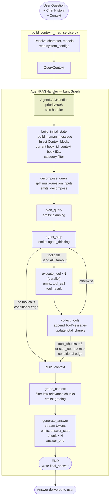
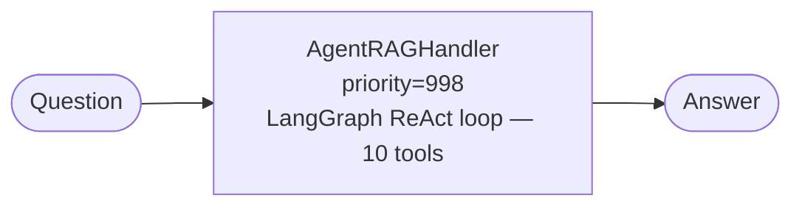

# Question Answering Pipeline Diagram

Visual representation of the current RAG question answering pipeline.

---

## Full Pipeline

```mermaid
flowchart TD
    %% Entry
    Q([User Question\n+ Chat History\n+ Context]) --> BUILD

    %% Context build
    subgraph ContextBuild [_build_context — rag_service.py]
        BUILD[Resolve character, models\nread system_configs] --> CTX[QueryContext]
    end

    CTX --> H_AG

    %% Agentic RAG — LangGraph graph
    subgraph AgentRAG [AgentRAGHandler — LangGraph]
        H_AG[AgentRAGHandler\npriority=998\nsole handler] --> INIT[build_initial_state\n_build_human_message\nInject Context block:\ncurrent book_id, context book IDs,\ncategory filter]
        INIT --> DQ[decompose_query\nsplit multi-question inputs\nemits: decompose]
        DQ --> PQ[plan_query\nemits: planning]
        PQ --> AS[agent_step\nemits: agent_thinking]

        AS -->|no tool calls\nconditional edge| BC[build_context]
        AS -->|tool calls\nSend API fan-out| ET["execute_tool ×N\n(parallel)\nemits: tool_call\ntool_result"]

        ET --> CT[collect_tools\nappend ToolMessages\nupdate total_chunks]
        CT -->|total_chunks ≥ 8\nor step_count ≥ max\nconditional edge| BC
        CT -->|otherwise| AS

        BC --> GC[grade_context\nfilter low-relevance chunks\nemits: grading]
        GC --> GA[generate_answer\nstream tokens\nemits: answer_start\nchunk × N\nanswer_end]
        GA --> GRAPH_END([END\nwrite final_answer])
    end

    GRAPH_END --> ANS([Answer delivered to user])

    classDef handler fill:#e9edc9,stroke:#606c38,stroke-width:2px
    classDef llm fill:#d4f1f4,stroke:#189ab4,stroke-width:1px
    classDef decision fill:#fef9c3,stroke:#854d0e,stroke-width:1px

    class H_AG handler
```

---

## Handler Routing Reference

All questions route directly to `AgentRAGHandler`. There is no feature flag and no fast-path routing.

```mermaid
flowchart LR
    Q([Question]) --> RAGENT[AgentRAGHandler\npriority=998\nLangGraph ReAct loop — 10 tools]
    RAGENT --> ANS([Answer])
```

---

## Agentic Retrieval Strategy

This diagram illustrates the agent's internal decision tree for tool selection, governed entirely by the `AGENT_SYSTEM_PROMPT`.

```mermaid
flowchart TD
    Q([User Question]) --> PRON{Step 1:\nPronouns/چۇ particle\n+ chat history?}

    %% Step 1 — pronoun / co-reference rewrite
    PRON -->|No| INTENT
    PRON -->|Yes| REWRITE[Tool: rewrite_query]
    REWRITE --> RETITLE{Rewritten question\nnow names a title?}
    RETITLE -->|Yes — MUST use find_books_by_title\ndo NOT reuse stale context IDs| FBT_R[Tool: find_books_by_title]
    RETITLE -->|No — re-evaluate rewritten\nquestion from step 2| INTENT

    FBT_R --> CHAR_R{Characters /\nplot / themes?}
    CHAR_R -->|Yes| GBS_R[Tool: get_book_summary] --> STOP
    CHAR_R -->|No — passages| SC_R[Tool: search_chunks] --> CHK

    %% Shared intent branch
    INTENT{Steps 2–4:\nIntent + context}

    %% Step 2 — catalog / metadata
    INTENT -->|who wrote title? — step 2| T_AUTH[Tool: get_book_author] --> STOP
    INTENT -->|what did author write? — step 2| T_BAUTH[Tool: get_books_by_author] --> STOP
    INTENT -->|library browsing — step 2| T_CAT[Tool: search_catalog] --> STOP

    %% Step 3 — current page shortcut
    INTENT -->|Content on current page\ncontext has current_page — step 3| T_CUR[Tool: get_current_page] --> STOP

    %% Step 4a — named title + plot/characters/themes
    INTENT -->|Named title +\nplot/characters/themes — 4a| FBT_A[Tool: find_books_by_title]
    FBT_A -->|IDs| GBS_A[Tool: get_book_summary] --> STOP

    %% Step 4b — named title + passages
    INTENT -->|Named title +\npassages/details — 4b| FBT_B[Tool: find_books_by_title]
    FBT_B -->|IDs| SC_B[Tool: search_chunks] --> CHK

    %% Step 4c — named author
    INTENT -->|Named author — 4c| GBA_C[Tool: get_books_by_author]
    GBA_C -->|IDs| SC_C[Tool: search_chunks] --> CHK

    %% Step 4d — current book_id in context
    INTENT -->|No title/author;\ncontext: current book_id — 4d| VOL_D{Sister volume\nquestion?\nnext/prev/numbered volume}
    VOL_D -->|Yes| GSV_D[Tool: get_sister_volumes\nwith current book_id]
    GSV_D --> SC_D_SIS[Tool: search_chunks\nwith sister volume book_id] --> CHK
    VOL_D -->|No| SC_D[Tool: search_chunks\nwith current book_id] --> CHK

    %% Step 4e — previous book IDs + who is X
    INTENT -->|No title/author;\ncontext: prev book IDs;\nwho is X / tell me about X — 4e| SBS_E[Tool: search_books_by_summary\nwith context_book_ids]
    SBS_E -->|Results — topic still matches| GBS_E[Tool: get_book_summary] --> STOP
    SBS_E -->|No results — topic shifted| SBS_G

    %% Step 4f — previous book IDs, non-character
    INTENT -->|No title/author;\ncontext: prev book IDs;\nnon-character question — 4f| VOL_F{Sister volume\nquestion?}
    VOL_F -->|Yes| GSV_F[Tool: get_sister_volumes\nwith context_book_ids[0]]
    GSV_F --> SC_F_SIS[Tool: search_chunks\nwith sister volume book_id] --> CHK
    VOL_F -->|No| SC_F[Tool: search_chunks\nwith context_book_ids] --> CHK

    %% Step 4g — no context / general fallback
    INTENT -->|No title/author/context\nor fallthrough from 4e/4f — 4g| SBS_G[Tool: search_books_by_summary]
    SBS_G --> WHO{Who is X /\ntell me about X?}
    WHO -->|Yes| GBS_G[Tool: get_book_summary\nmax 5 IDs] --> STOP
    WHO -->|No| SC_G[Tool: search_chunks\nwith returned book_ids] --> CHK

    %% Step 4h — retry (search_chunks only, never after get_book_summary)
    CHK{Step 4h:\nsearch_chunks < 4 results?\nNever applies after\nget_book_summary}
    CHK -->|Yes| SC_H[Tool: search_chunks\nempty book_ids = entire library] --> STOP
    CHK -->|No — sufficient context| STOP

    STOP([Stop — respond with no tool calls\nto signal completion])

    classDef tool fill:#dcfce7,stroke:#16a34a,stroke-width:2px
    classDef decision fill:#fef9c3,stroke:#854d0e,stroke-width:1px
    classDef stop fill:#fee2e2,stroke:#dc2626,stroke-width:2px

    class REWRITE,FBT_R,GBS_R,SC_R,T_AUTH,T_BAUTH,T_CAT,T_CUR,FBT_A,GBS_A,FBT_B,SC_B,GBA_C,SC_C,SC_D,SBS_E,GBS_E,SBS_G,GBS_G,SC_G,SC_H,GSV_D,SC_D_SIS,GSV_F,SC_F_SIS tool
    class PRON,RETITLE,CHAR_R,INTENT,WHO,CHK,VOL_D,VOL_F decision
    class STOP stop
```

---

## Agent Tools Reference

| Tool | Type | Wraps | When agent calls it |
|------|------|-------|---------------------|
| `rewrite_query` | Utility | `QueryRewriter` | Question has pronouns or "چۇ" particle and chat history exists; short-circuits if `ctx.enriched_question` is already set. After returning, agent re-evaluates the rewritten question from step 2 — if a title is now explicit, `find_books_by_title` is mandatory and stale context IDs must not be reused |
| `find_books_by_title` | Content | `BooksRepository` title match | Question explicitly names a book title (including after rewrite resolves a pronoun to a title) |
| `search_books_by_summary` | Content | `BookSummariesRepository` | Finding which books cover a topic; also used with `context_book_ids` to verify a "who is X" question still matches the previous topic (step 4e) |
| `search_chunks` | Content | pgvector similarity search | Retrieving passages; uses L1+L2 cache; called directly with `[Context]` book_id when available. Step 4h retry (empty book_ids) applies only when `search_chunks` returned < 4 results — never triggered after `get_book_summary` |
| `get_book_author` | Metadata | `BooksRepository` | Author lookup for who-wrote-X questions |
| `get_books_by_author` | Metadata | `BooksRepository` | Book list for what-did-Y-write questions |
| `get_book_summary` | Content | `BookSummariesRepository.get_summaries_for_books` | Plot, themes, or main characters of a specific book (step 4a); or "who is X / tell me about X" questions (steps 4e, 4g). After `get_book_summary` completes for a "who is X" question, the agent stops immediately — no further tools |
| `get_current_page` | Content | `PagesRepository.find_one` | Raw text of the page the user is currently reading; only available in single-book in-reader mode (step 3) |
| `get_sister_volumes` | Content | `BooksRepository.find_sister_volumes` | All volumes of the same title+author series as a given book_id; called when the question references a different volume (next/previous/numbered) of the current or previously-discussed book — gives the agent the correct book_id before calling `search_chunks` |
| `search_catalog` | Metadata | `CatalogHandler._build_catalog_context` | Library browsing, listing, general catalog questions only — never for person/character lookups |

---

## Cache Layers

| Level | Key | Populated By | Purpose |
|-------|-----|-------------|---------|
| **L0** | `KEY_RAG_REWRITE` | `rewrite_query` tool via `QueryRewriter` | Deduplicate follow-up rewrites |
| **L1** | `KEY_RAG_EMBEDDING` | First embed call per query | Reuse embeddings across all tools |
| **L2** | `KEY_RAG_SEARCH_SINGLE/MULTI` | `search_chunks` tool | Reuse pgvector search results |
| **L3** | `KEY_RAG_SUMMARY_SEARCH` | `search_books_by_summary` tool | Reuse book-selection results |

---

## LLM Calls (in execution order)

| # | Call | Triggered By | Condition | Purpose |
|---|------|-------------|-----------|---------|
| 1 | Query decomposition | `decompose_query` node | Only when input has > 1 `?`/`؟` | Split multi-question inputs into sub-questions; zero-cost for single questions |
| 2 | Agent ReAct loop (1–4×) | AgentRAGHandler | Always — every query | Tool-calling loop — choose and invoke retrieval tools |
| 3 | Answer generation | AgentRAGHandler | Always | Stream answer from accumulated context |

---

## Key Components

| Component | Role |
|-----------|------|
| **HandlerRegistry** | Single registered handler (`AgentRAGHandler`, priority=998); `_select()` always returns it |
| **AgentRAGHandler** | Sole handler — builds LangGraph initial state, invokes graph via `ainvoke` or `astream` |
| **LangGraph StateGraph** | Compiled graph: `decompose_query → plan_query → agent_step → execute_tool → collect_tools → build_context → grade_context → generate_answer` |
| **QueryRewriter** | LLM-based standalone question generator; resolves pronouns using conversation history; called via `rewrite_query` tool |
| **_build_human_message** | Enriches the agent's first HumanMessage with current book_id, context book IDs, and category filter; enables agent to skip book-discovery step |
| **format_observations_as_context** | Combines metadata context (catalog/author tools) + deduplicated, score-sorted chunks (cap 15) |
| **retrieval.py** | Shared I/O primitives (`embed_query`, `vector_search`, `find_books_by_title_in_question`) used by agent tools |
| **agent/config.py** | Centralized loop constants (`AGENT_MAX_STEPS`, `AGENT_ENOUGH_CHUNKS`, `AGENT_MAX_CONTEXT_CHUNKS`, `GRADE_RELATIVE_THRESHOLD`, `MIN_CHUNKS_AFTER_GRADING`, `CONTEXT_SWITCH_SCORE_THRESHOLD`) |
| **ChunksRepository** | pgvector `similarity_search` against `chunks` table |
| **BookSummariesRepository** | pgvector `summary_search` against `book_summaries` for book selection |
| **CatalogHandler** | Utility class (not in registry); used by `search_catalog` tool |
| **QueryContext** | Mutable dataclass threaded through the pipeline; accumulates enriched question, vector, book IDs, scores, and agent metrics |
