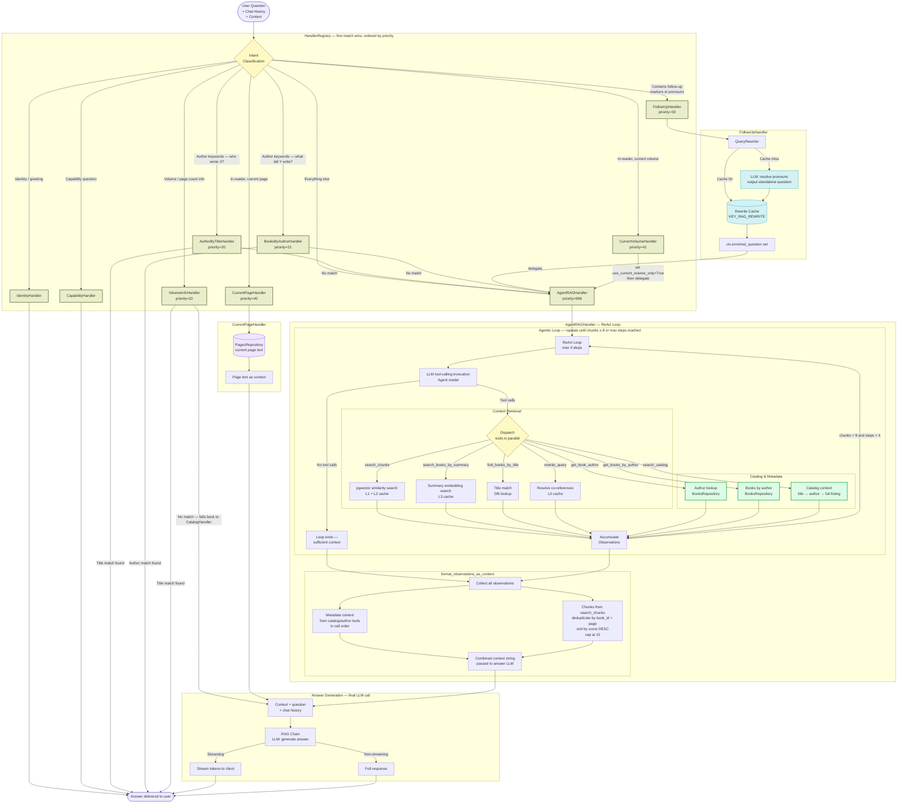
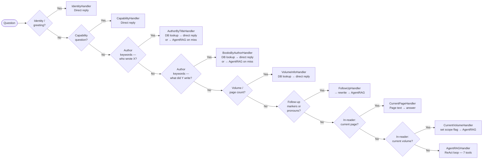

# Question Answering Pipeline Diagram — v2

Visual representation of the current RAG question answering pipeline after agentic RAG promotion and handler consolidation.

**Changes from v1:**
- `StandardRAGHandler` removed from registry (agent is now the sole fallback)
- `CatalogHandler` removed from registry — converted to `search_catalog` agent tool
- `AuthorByTitleHandler` and `BooksByAuthorHandler` kept as fast-path handlers (priority 20/21) **and** exposed as agent tools for compound queries
- `FollowUpHandler` and `CurrentVolumeHandler` now delegate to `AgentRAGHandler`
- Three new agent tools: `get_book_author`, `get_books_by_author`, `search_catalog`
- `context_builder` accumulates both metadata context (catalog/author tools) and chunk context
- `MAX_CONTEXT_CHUNKS = 15` cap applied after score-sort
- LLM "categorize question" call eliminated entirely

---

## Full Pipeline

---

## Handler Routing Reference

---

## Agent Tools Reference

| Tool | Type | Wraps | When agent calls it |
|------|------|-------|---------------------|
| `rewrite_query` | Utility | `QueryRewriter` | Question has Uyghur pronouns and chat history exists |
| `find_books_by_title` | Content | `BooksRepository` title match | Question explicitly names a book title |
| `search_books_by_summary` | Content | `BookSummariesRepository` | Finding which books cover a topic before chunk search |
| `search_chunks` | Content | pgvector similarity search | Retrieving passages; uses L1+L2 cache |
| `get_book_author` | Metadata | `BooksRepository` | Compound queries needing author as a step (fast-path handler handles the simple case) |
| `get_books_by_author` | Metadata | `BooksRepository` | Compound queries needing book list as a step (fast-path handler handles the simple case) |
| `search_catalog` | Metadata | `CatalogHandler._build_catalog_context` | Library browsing, listing, general catalog questions |

---

## Cache Layers

| Level | Key | Populated By | Purpose |
|-------|-----|-------------|---------|
| **L0** | `KEY_RAG_REWRITE` | `rewrite_query` tool / FollowUpHandler | Deduplicate follow-up rewrites |
| **L1** | `KEY_RAG_EMBEDDING` | First embed call per query | Reuse embeddings across all tools |
| **L2** | `KEY_RAG_SEARCH_SINGLE/MULTI` | `search_chunks` tool | Reuse pgvector search results |
| **L3** | `KEY_RAG_SUMMARY_SEARCH` | `search_books_by_summary` tool | Reuse book-selection results |

---

## LLM Calls (in execution order)

| # | Call | Triggered By | Condition | Purpose |
|---|------|-------------|-----------|---------|
| 1 | Query rewrite | FollowUpHandler | Follow-up detected | Resolve pronouns → standalone question |
| 2 | Agent ReAct loop (1–4×) | AgentRAGHandler | Always | Tool-calling loop — choose and invoke retrieval tools |
| 3 | Answer generation | AgentRAGHandler (final) | Always | Generate answer from accumulated context |

> **Removed vs v1:** LLM call #2 "Categorize question" (StandardRAGHandler) no longer exists.

---

## Key Components

| Component | Role |
|-----------|------|
| **HandlerRegistry** | Evaluates `can_handle()` in priority order; dispatches to first match |
| **QueryRewriter** | LLM-based standalone question generator; resolves pronouns using conversation history |
| **AuthorByTitleHandler** | Fast path for "who wrote X?" — keyword detect + DB lookup, zero agent calls; falls back to AgentRAG on miss |
| **BooksByAuthorHandler** | Fast path for "list books by Y" — keyword detect + DB lookup, zero agent calls; falls back to AgentRAG on miss |
| **AgentRAGHandler** | Fallback for all unmatched intents; runs a ReAct loop with 7 tools; always-on |
| **format_observations_as_context** | Combines metadata context (catalog/author tools) + deduplicated, score-sorted chunks (cap 15) |
| **AnswerBuilder** | Formats chunks into LangChain documents; invokes final RAG chain (streaming or batch) |
| **ChunksRepository** | pgvector `similarity_search` against `chunks` table |
| **BookSummariesRepository** | pgvector `summary_search` against `book_summaries` for book selection |
| **CatalogHandler** | Utility class (not in registry); used by `search_catalog` tool and VolumeInfoHandler fallback |
| **StandardRAGHandler** | Utility class (not in registry); used by `search_chunks` and `find_books_by_title` tools |
| **QueryContext** | Mutable dataclass threaded through the pipeline; accumulates enriched question, vector, book IDs, scores, agent metrics |
