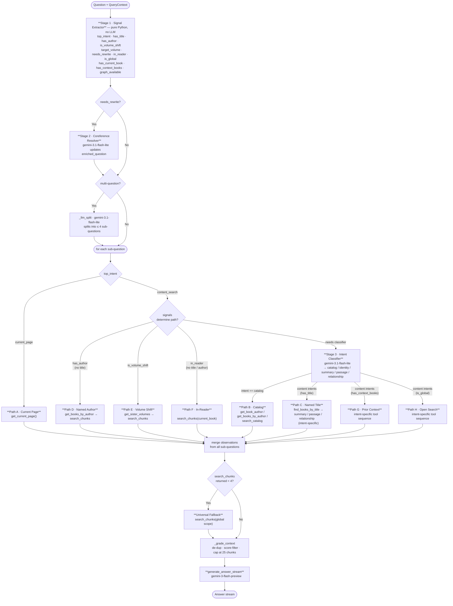

# RAG Deterministic Router — Design

**Status:** Proposal  
**Replaces:** `AgentRAGHandler._execute_workflow_stream` (ADK agent loop)  
**Files affected:** `packages/backend-core/app/services/rag/agent/handler.py`, `prompts.py`

---

## Problem

The current retrieval loop delegates all tool-call sequencing to an LLM (Google ADK agent). The agent interprets a 118-line natural language prompt to decide which tools to call and in what order. This means:

- Up to 6 LLM round-trips just for routing (before answer generation)
- Non-deterministic — the same question can take different paths across calls
- Hard to debug ("why did the agent call search_chunks before find_books_by_title?")
- The prompt encodes an **implicit decision tree** — we can just write the tree in code

The prompt review (`RAG_PROMPT_REVIEW.md`) found 11 logic issues in the current prompt — all of which are resolved by this design, since `AGENT_SYSTEM_PROMPT` is replaced entirely.

---

## Core Insight

The routing logic in `prompts.py` already *is* a decision tree — it's just written in English. Every step (1–6) is an `if/elif` branch. The only parts that genuinely require an LLM are:

| Step | Why LLM is needed |
|------|------------------|
| Coreference resolution | Resolving Uyghur pronouns against chat history |
| Intent classification | Distinguishing "who is X" (identity) vs "what did X do" (passage) |
| Query rewriting | Standalone question generation from a follow-up |
| Multi-question splitting | Already handled separately in `_llm_split` |

Everything else is deterministic given the signals already in `QueryContext`.

---

## Proposed Architecture

Replace the ADK agent loop with a three-stage pipeline:

```
[Question + QueryContext]
        │
        ▼
┌─────────────────────┐
│  1. Signal Extractor │  (pure Python, no LLM)
└─────────────────────┘
        │ signals: has_title, has_author, is_volume_shift,
        │          needs_rewrite, graph_available, in_reader, ...
        ▼
┌───────────────────────────┐
│  2. Coreference Resolver  │  (conditional LLM — only when needs_rewrite=True)
└───────────────────────────┘
        │ possibly updates enriched_question
        ▼
┌───────────────────────────┐
│  3. Intent Classifier     │  (conditional LLM — only for content questions
└───────────────────────────┘    when signals alone are insufficient)
        │ intent: identity | summary | passage | relationship
        ▼
┌───────────────────────────┐
│  4. Execution Router      │  (pure Python — picks and runs a fixed path)
└───────────────────────────┘
        │ observations list (same format as today)
        ▼
[_grade_context → answer_builder]  (unchanged)
```

### Full Flow Diagram



---

## Stage 1: Signal Extractor

Pure Python, no LLM. Extracts all the signals needed for routing from `QueryContext` and the question text. The input question is first normalized using `normalize_uyghur()` to ensure matching is robust against visual variants.

| Signal | Source | How |
|--------|--------|-----|
| `top_intent` | `_detect_intent()` | Already exists: `current_page / content_search` |
| `catalog_subtype` | Pattern matching | `"كىم يازغان"` → `author_of` \| `"نىمە يازغان"` → `books_by` \| default → `general` |
| `has_title` | `find_books_by_title_in_question()` | Already done server-side |
| `has_author` | Author name patterns | Reuse existing `BooksRepository.find_books_by_author_in_question` |
| `is_volume_shift` | Keyword patterns | `توم`, `كەيىنكى توم`, `ئالدىنقى توم`, `2-توم`, `next volume`, etc. |
| `target_volume` | Keyword + regex in question | `"2-توم"` / `"volume 2"` → 2 (regex `\d+`); `"كەيىنكى توم"` / `"next volume"` → `current_volume + 1` (default to `1` if `current_volume` is `None`); `"ئالدىنقى توم"` / `"prev volume"` → `current_volume - 1` (default to `1` if `current_volume` is `None`). Guard against `NoneType` math errors. |
| `needs_rewrite` | Pronoun patterns + history | Uyghur pronouns (ئۇ، بۇ، شۇ، ئۇنىڭ، بۇنىڭ, etc.) stripped of boundary punctuation, with no in-question antecedent AND `ctx.history` non-empty |
| `in_reader` | `ctx.current_page is not None` | Already in `QueryContext` |
| `has_current_book` | `ctx.book_id and not ctx.is_global` | Already in `QueryContext` |
| `has_context_books` | `ctx.context_book_ids` | Already in `QueryContext` |
| `is_global` | `ctx.is_global` | Already in `QueryContext` |
| `graph_available` | `ctx.book.graph_milestone == "complete"` | Already computed in `_build_human_message` |

---

## Stage 2: Coreference Resolver

Called only when `needs_rewrite=True`. Identical to the current `rewrite_query` tool call — no change to the underlying `QueryRewriter`. Updates `ctx.enriched_question`.

**When triggered:**
- Question contains Uyghur pronouns (ئۇ، بۇ، شۇ، ئۇنىڭ، بۇنىڭ، ئۇنى، بۇنى) OR topic-shift particle (چۇ)
- AND the pronoun's antecedent is NOT already named within the same question
- AND `ctx.history` is non-empty

**Model:** `gemini-3.1-flash-lite` (same model used for intent classification and `_llm_split`)  
**Cost:** 1 LLM call (same as today, but now explicit rather than agent-discretionary)

---

## Stage 3: Intent Classifier

A single small LLM call with **structured output** (JSON). Only triggered for `content_search` questions when signal extraction alone cannot determine the execution path.

**When skipped — not a `content_search` question:**
- `top_intent == current_page` → always Path A, no classification needed

**When skipped — `content_search` but signals already determine the path:**
- `has_author` and no title → always Path D
- `is_volume_shift` → always Path E
- `in_reader` and no title/author → always Path F

**When triggered (signals insufficient to pick a path):**
- `has_title` → need to distinguish catalog vs summary vs passage vs relationship
- No title, `has_context_books` → need to distinguish catalog vs identity vs passage vs off-topic
- No title, no context, global mode → need to distinguish catalog vs identity vs passage vs relationship

**Classifier prompt (condensed):**

```
Classify this Uyghur/English question into ONE intent.

Intents:
- catalog     : asking about book metadata, authors of books, book listings, or what books exist in the library (e.g. who wrote X, do you have book Y)
- identity    : asking who/what a person or character IS (biography, role, background)
- summary     : asking about the plot, themes, or main characters of a book
- relationship: asking about connections, lineages, family trees, or how X and Y relate
- passage     : asking for specific events, facts, quotes, or details — including "tell me about X's actions"

Examples:
- "زوردۇن سابىر كىم؟" -> {"intent": "identity"}
- "سادات بوۋاي كىمنىڭ ئوغلى؟" -> {"intent": "relationship"}
- "ئانا يۇرت رومانىنىڭ باش تېمىسى نېمە؟" -> {"intent": "summary"}
- "ئانا يۇرت رومانى قاچان يېزىلغان؟" -> {"intent": "passage"}
- "يۇلتۇزلۇق تۈنلەر رومانى كىمنىڭ؟" -> {"intent": "catalog"}
- "سەندە قانداق كىتابلار بار؟" -> {"intent": "catalog"}

Question: {question}
Context signals: {signals_summary}

Return JSON: {"intent": "<one of the above>"}
```

**Model:** `gemini-3.1-flash-lite` (strong Uyghur support, fast classification — same model used for coreference resolution and `_llm_split`)  
**Cost:** 0 or 1 LLM call per turn

---

## Stage 4: Execution Router

Pure Python. Given signals + intent, selects and executes a fixed path. Each path calls tools directly (same tool implementations in `tools.py`) and appends to an `observations` list — identical in format to what the ADK agent produces today.

**Observations envelope format** (must match what `_grade_context` and `_extract_used_book_ids` expect):
```python
observations.append({
    "tool": "search_chunks",          # tool name string
    "result": {
        "ok": True,                   # bool — False if the tool errored
        "data": {                     # tool-specific payload
            "chunks": [...],          # for search_chunks
        },
    },
})
```
Each path executor is responsible for wrapping tool return values in this envelope before appending. The ADK runner did this automatically via `function_responses`; in the router it must be explicit.

### Path A — Current Page
**Triggers:** `top_intent == current_page` AND `in_reader`
```
get_current_page()
```

---

### Path B — Catalog
**Triggers:** `intent == "catalog"`

| Subtype | Tool sequence |
|---------|--------------|
| `author_of` ("who wrote X") | `get_book_author(question)` |
| `books_by` ("what books does author X") | `get_books_by_author(question)` |
| `general` | `search_catalog(question)` |

**Note:** `handlers/catalog.py` (`CatalogHandler._build_catalog_context`) already implements the DB queries for all three subtypes (title match → author info, author match → book list, fallback → full catalog). Path B's tool implementations should delegate to or inline this logic rather than re-implementing it.

---

### Path C — Named Title
**Triggers:** `has_title == True`

| Intent | Tool sequence |
|--------|--------------|
| `identity` | `find_books_by_title → get_book_summary(book_ids)` (falls back to `search_chunks(book_ids)` if summary does not contain info) |
| `summary` | `find_books_by_title → get_book_summary(book_ids)` [fallback if `book_ids` empty] |
| `passage` | `find_books_by_title → search_chunks(book_ids)` → [fallback if <4] |
| `relationship` AND `graph_available` | `find_books_by_title → query_knowledge_graph(book_ids) → search_chunks(book_ids)` |
| `relationship` AND NOT `graph_available` | `find_books_by_title → search_chunks(book_ids)` → [fallback if <4] |

**Note on Fallbacks & Changes:**
- **`summary` Fallback:** If `find_books_by_title` returns an empty list, fall back to `search_books_by_summary(question) → get_book_summary(top_ids, max=5)`.
- **Knowledge Graph Scope:** The implementation `_run_query_knowledge_graph` in `tools.py` must be modified to read and apply the optional `book_ids` parameter from tool arguments, rather than relying solely on `ctx.book_id`.

---

### Path D — Named Author (no explicit title)
**Triggers:** `has_author == True` AND NOT `has_title`
```
get_books_by_author(question) → search_chunks(returned_book_ids)
```
Fallback if <4 results: widen to `search_chunks(book_ids=None)`.

---

### Path E — Volume Shift
**Triggers:** `is_volume_shift == True` AND (`in_reader` OR `has_context_books`)
```
get_sister_volumes(current_book_id or context_book_ids[0])
→ search_chunks(target_volume_id)  # derived from volume number in question
```

---

### Path F — In-Reader, No Title/Author
**Triggers:** `in_reader == True` AND NOT `has_title` AND NOT `has_author` AND NOT `is_volume_shift`
```
search_chunks(current_book_id)
→ [if <4 results]: search_books_by_summary(question) → search_chunks(new_book_ids)
```

---

### Path G — Prior Context, No Title/Author
**Triggers:** `has_context_books == True` AND NOT `in_reader` AND NOT `has_title` AND NOT `has_author`

| Intent | Tool sequence |
|--------|--------------|
| `identity` | `search_books_by_summary(question, book_ids=context_book_ids)` → if results: `get_book_summary(verified_ids, max=5)` else: fall to G-passage |
| `passage` | `search_chunks(context_book_ids)` → [if <4: `search_books_by_summary → search_chunks(new_ids)`] |
| `relationship` AND `graph_available` | `query_knowledge_graph → search_chunks(context_book_ids)` |
| `summary` | `get_book_summary(context_book_ids, max=5)` |

---

### Path H — Open / No Context
**Triggers:** `is_global == True` AND NOT `has_title` AND NOT `has_author` AND NOT `has_context_books`

| Intent | Tool sequence |
|--------|--------------|
| `identity` | `search_books_by_summary(question) → get_book_summary(top_ids, max=5)` |
| `passage` | `search_books_by_summary(question) → search_chunks(book_ids)` |
| `relationship` | `query_knowledge_graph → search_books_by_summary(question) → search_chunks(book_ids)` |
| `summary` | `search_books_by_summary(question) → get_book_summary(top_ids, max=5)` |

---

### Universal Fallback

Any path that ends with `search_chunks` and returns <4 results:
1. Re-run `search_books_by_summary(question)` to rediscover books (SKIP this step if `search_books_by_summary` was already called in the primary execution path, e.g., Path H, Path F/G fallbacks).
2. Re-run `search_chunks(new_book_ids)` with the new IDs (SKIP if step 1 was skipped).
3. If still <4 (or if steps 1-2 were skipped): run `search_chunks(book_ids=None)` (global scope)

The transparent context-switch logic already in `_run_search_chunks` stays unchanged and handles topic-shift silently within step 1.

---

### Multi-Question

The existing `_llm_split` decomposition stays unchanged. For multi-question turns, the router is applied **independently per sub-question**, then all observations are merged before `_grade_context`. No more injecting sub-questions into an agent prompt.

**Ordering:** Coreference resolution (Stage 2) runs on the **original question** before splitting. If `needs_rewrite=True`, the rewritten `ctx.enriched_question` is what gets split by `_llm_split`. Sub-questions inherit the resolved context — each sub-question is NOT independently checked for `needs_rewrite`.

```
# Stage 2: rewrite original question first (if needed)
if needs_rewrite:
    await resolve_coreference(ctx)          # updates ctx.enriched_question

question = ctx.enriched_question or ctx.question

# Multi-question split on the rewritten question
if is_multi_question(question):
    sub_questions = await _llm_split(question, ctx.agent_model)
else:
    sub_questions = [question]

# Stage 3+4: classify and route each sub-question independently
for sub_q in sub_questions:
    signals = extract_signals(sub_q, ctx)   # needs_rewrite always False here
    intent = await classify_intent(signals, sub_q)
    sub_observations = await execute_path(intent, sub_q, ctx)
    all_observations.extend(sub_observations)

graded_context = _grade_context(all_observations)  # unchanged
```

---

## Model Assignments

| Role | Model | Reason |
|------|-------|--------|
| Coreference resolution (Stage 2) | `gemini-3.1-flash-lite` | Simple rewrite, needs Uyghur support |
| Intent classification (Stage 3) | `gemini-3.1-flash-lite` | Fast JSON classification, needs Uyghur support |
| Multi-question split (`_llm_split`) | `gemini-3.1-flash-lite` | Simple extraction, needs Uyghur support |
| Answer generation (`generate_answer_stream`) | `gemini-3-flash-preview` | Best Uyghur output quality for final answer |

All three simple-call roles use the same model, so a single `SIMPLE_LLM_MODEL` env var (defaulting to `gemini-3.1-flash-lite`) covers them all. The answer generation model is already governed by `ctx.rag_chain`, which is built upstream from a separate env var.

**Note on the existing `AGENT_MODEL` env var:** This currently defaults to `gemini-2.5-flash` and drives the ADK agent. In `DeterministicRAGHandler`, `ctx.agent_model` is reused for `_llm_split` — it should be updated to `gemini-3.1-flash-lite` (or remapped to `SIMPLE_LLM_MODEL`).

---

## What Stays Unchanged

| Component | Status |
|-----------|--------|
| All tool implementations in `tools.py` | Unchanged |
| `_grade_context` | Unchanged |
| `_extract_used_book_ids` | Unchanged |
| `_populate_ctx_from_observations` | Unchanged |
| `answer_builder.py` | Unchanged |
| `QueryContext` | Unchanged |
| Event protocol (`planning`, `tool_call`, `tool_result`, `result`) | Same shape, emitted by router |
| `_llm_split` multi-question decomposition | Unchanged |
| Transparent context-switch in `_run_search_chunks` | Unchanged |

---

## What Is Removed

| Component | Replaced by |
|-----------|-------------|
| `AGENT_SYSTEM_PROMPT` (118-line prompt) | Signal extractor + classifier prompt (~10 lines) |
| Google ADK `InMemoryRunner` + `build_rag_agent` | Direct async tool calls |
| Agent loop (up to 6 LLM-driven tool call decisions) | Fixed path execution |
| `adk_agent.py` | Can be deleted |
| `agent/state.py`, `agent/graph.py` | Empty stub files — can be deleted |

Google ADK becomes an optional dependency — can be removed or kept for future experimentation.

**Note on `handlers/` pycache:** There are compiled `.pyc` files for 9 handler modules (author_by_title, books_by_author, capabilities, current_page, current_volume, follow_up, identity, standard_rag, volume_info) with no corresponding source files — a prior partial implementation was cleaned up. The `.pyc` files are safe to ignore; they will be evicted on the next clean build. `DeterministicRAGHandler` starts fresh from this design.

---

## LLM Call Budget Comparison

Current agent calls use `gemini-2.5-flash`. Proposed simple calls use `gemini-3.1-flash-lite`.

| Scenario | Current (`gemini-2.5-flash`) | Proposed (`gemini-3.1-flash-lite`) |
|----------|---------|----------|
| Catalog question ("who wrote X") | 1–2 agent calls | 0 LLM calls |
| Current page question | 1–2 agent calls | 0 LLM calls |
| Named title, clear passage | 2–3 agent calls | 1 classify call |
| Follow-up with pronoun + content | 3–5 agent calls | 1 rewrite + 1 classify |
| Multi-question (3 sub-questions) | 4–6 agent calls (shared budget) | 1 split + 1 classify × 3 = 4 calls |
| Complex relationship + title | 3–4 agent calls | 1 classify call |

---

## Risks and Trade-offs

**What we lose:**
- The agent can reason about edge cases that fall between categories. A deterministic router with a wrong-intent classification has no self-correction.
- Novel question types not covered by the intent set default to `passage`, which may not be optimal.

**Mitigations:**
- The intent classifier's fallback is `passage` — the most commonly correct path. Wrong identity→passage is recoverable (passages contain character descriptions too).
- The universal fallback ensures we always retry with broader scope if results are thin.
- The current prompt already has gap cases where the agent picks the wrong path anyway — and those are resolved by this design.

**Rollout approach:**
- Implement the router as a new class `DeterministicRAGHandler`
- Keep `AgentRAGHandler` in place
- Toggle via a feature flag (e.g. `settings.use_deterministic_router`) for A/B comparison
- Evaluate on the existing `rag_evaluations` table

---

## Open Questions & Resolved Solutions

1. **Intent classifier model & few-shot examples (Resolved):**
   Standard model classification (Haiku/Flash level) works very well. To make it highly robust in Uyghur, we will utilize **few-shot prompt examples** within the classification prompt, defining exact sample Uyghur inputs mapping to each of the four target intents (`identity`, `summary`, `relationship`, `passage`).

2. **`identity` vs `passage` boundary (Resolved):**
   Few-shot examples mapping explicit Uyghur lookups (e.g. comparing `"زوردۇن سابىر كىم؟"` -> `identity` vs `"زوردۇن سابىر ئانا يۇرت رومانىنى قاچان يېزىلغان؟"` -> `passage`) will be built directly into the system prompt configuration.

3. **`needs_rewrite` pronoun detection (Resolved):**
   To catch all Uyghur inflected/suffixed forms of pronouns reliably without false-positive matches, the Signal Extractor will tokenize the input, strip standard punctuation boundary characters (`_PUNCT = '«»،؟!()[]{}"' "''"`), and check the clean words against `UYGHUR_PRONOUN_TOKENS`. The set includes base pronouns, inflected case forms, and topic-shift clitics:
   ```python
   UYGHUR_PRONOUN_TOKENS = {
       "ئۇ", "بۇ", "شۇ", 
       "ئۇنىڭ", "بۇنىڭ", "شۇنىڭ",
       "ئۇنى", "بۇنى", "شۇنى",
       "ئۇنىڭغا", "بۇنىڭغا", "شۇنىڭغا",
       "ئۇنىڭدا", "بۇنىڭدا", "شۇنىڭدا",
       "ئۇنىڭدىن", "بۇنىڭدىن", "شۇنىڭدىن",
       "ئۇلار", "بۇلار", "شۇلار",
       "ئۇلارنىڭ", "بۇلارنىڭ", "شۇلارنىڭ",
       "ئۇلارنى", "بۇلارنى", "شۇلارنى",
       "ئۇلارغا", "بۇلارغا", "شۇلارغا",
       "ئۇلاردا", "بۇلاردا", "شۇلاردا",
       "ئۇلاردىن", "بۇلاردىن", "شۇلاردىن",
       "ئۇچۇ", "بۇچۇ", "شۇچۇ",
       "ئۇلارچۇ", "بۇلارچۇ", "شۇلارچۇ"
   }
   ```

4. **Graph scope in Path C (relationship) (Resolved):**
   The `query_knowledge_graph` tool in `tools.py` must be updated to accept `book_ids` inside its input dictionary `args`. If passed, `_run_query_knowledge_graph` will narrow the query subgraph to the matched book volumes, falling back to global scope or `ctx.book_id` if omitted.
