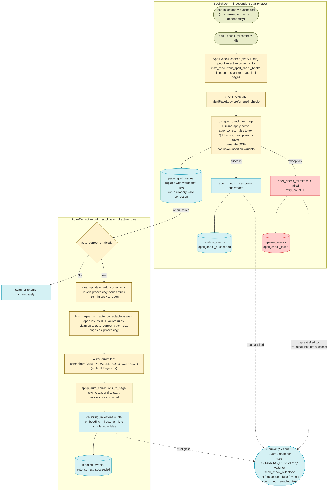
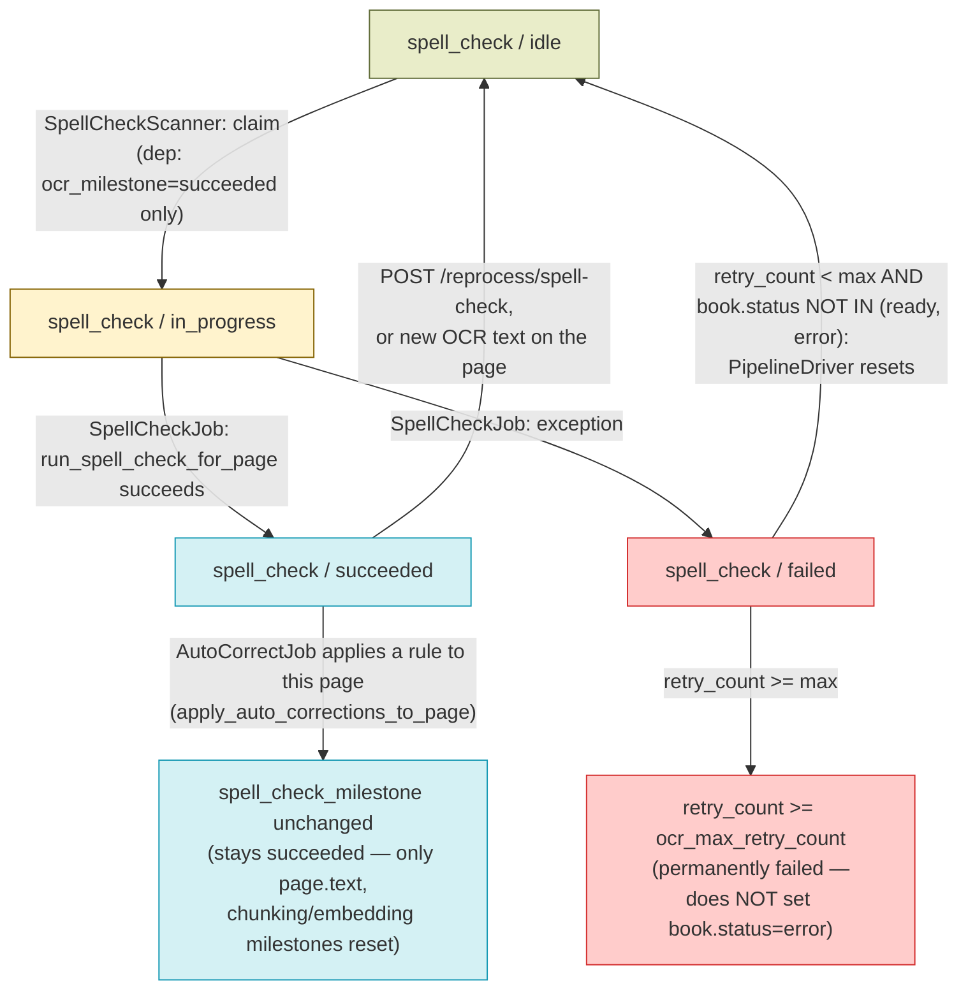
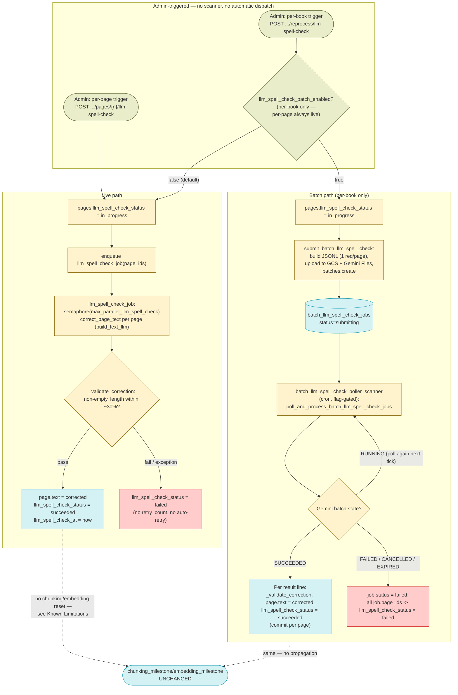
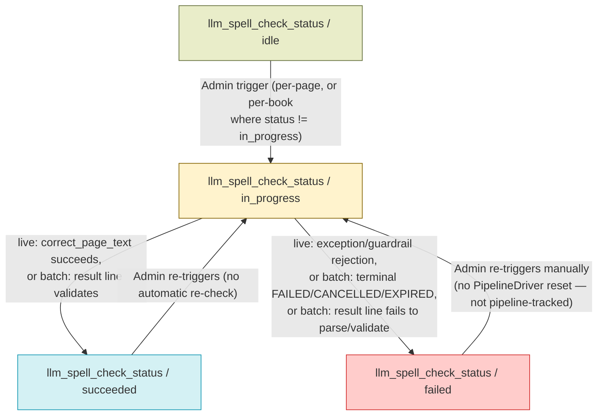

# Spellcheck, Auto-Correct & LLM Spell Correction — Design

See also: [WORKER_DESIGN.md](WORKER_DESIGN.md) for the full pipeline overview and [BOOK_PROCESSING_DIAGRAM.md](BOOK_PROCESSING_DIAGRAM.md) for the cross-stage diagram this stage's Data Flow is scoped from. Prior stages: [OCR_DESIGN.md](OCR_DESIGN.md), [CHUNKING_DESIGN.md](CHUNKING_DESIGN.md), [EMBEDDING_DESIGN.md](EMBEDDING_DESIGN.md). Next stage: [SUMMARY_DESIGN.md](SUMMARY_DESIGN.md).

This doc covers **three** distinct text-quality mechanisms that all end up writing `pages.text`, in order of introduction:

1. **Dictionary-based spellcheck** (`SpellCheckScanner`/`SpellCheckJob`) — automatic, pipeline-scanner-driven, detects unknown words.
2. **Auto-correct** (`AutoCorrectScanner`/`AutoCorrectJob`) — automatic, batch-applies admin-curated corrections to spellcheck's findings.
3. **LLM spell correction** (`llm_spell_check_job` / `batch_llm_spell_check_service`) — **on-demand, admin-triggered only**, added later (migrations 090/091) to catch context-dependent real-word errors the first two structurally cannot. See [LLM Spell Correction](#llm-spell-correction-on-demand-layer) below.

## Overview

Spellcheck and auto-correct are two cooperating stages that form an independent quality layer on top of OCR'd text — they run in parallel with (not after) chunking/embedding and never gate `book.status`. They are documented together because auto-correct exists solely to act on the issues spellcheck finds.

- **Spellcheck's only dependency is `ocr_milestone = 'succeeded'`.** `SpellCheckScanner` (`services/worker/scanners/spell_check_scanner.py`) claims a page once OCR has succeeded on it — it does not read `chunking_milestone` or `embedding_milestone` at all, and does not filter on `book.status`. A book can already be `status='ready'` (or still mid-chunking) while its pages are still being spell-checked in the background. The scanner module's own docstring is stale here — it says a page is eligible when "pipeline_step='embedding'", but the actual `WHERE` clause only checks `ocr_milestone == 'succeeded'` and `spell_check_milestone == 'idle'`; there is no `pipeline_step` filter in the code.
- **The dependency runs the other way for chunking, when `spell_check_enabled` is on.** This is the detail most often missed: `ChunkingScanner` and `EventDispatcher`'s reactive OCR-triggered dispatch both add `spell_check_milestone IN ('succeeded', 'failed')` to their eligibility filter whenever `spell_check_enabled = 'true'` — chunking will not claim a page until spellcheck has reached a terminal state on it. The reason (per `chunking_scanner.py`'s own docstring) is that spellcheck can rewrite `page.text` in place via inline auto-correct-rule application (see below), and chunking text that's about to change would build chunks from stale content. `spell_check_enabled` is effectively on by default (see Configuration Reference), so in practice chunking is usually gated behind spellcheck's first pass, even though spellcheck itself has no reciprocal dependency on chunking. This is already documented from chunking's side in [CHUNKING_DESIGN.md](CHUNKING_DESIGN.md#overview); this doc is spellcheck's own canonical description of the same mechanism.
- **Spellcheck detects, it does not (by itself) invalidate downstream chunks/embeddings.** `run_spell_check_for_page` (`spell_check_service.py`), the function both `SpellCheckJob` and the on-demand `POST /{book_id}/pages/{page_num}/spell-check/trigger` endpoint call, does two things in one pass: (1) it immediately rewrites `page.text` for any substring matching an **active** `auto_correct_rules` entry (via a Uyghur-aware regex substitution), then (2) tokenizes the resulting text and flags remaining unknown words that have at least one dictionary-valid OCR-confusion correction as new `page_spell_issues` rows. Step (1) mutates `page.text` but does **not** reset `chunking_milestone`/`embedding_milestone`/`is_indexed` — unlike `apply_auto_corrections_to_page` (below), which does. In the common case this is harmless because chunking is still gated behind spellcheck finishing (previous bullet), so chunking naturally picks up the already-corrected text on its first pass. But if a page is re-spell-checked after it has already been chunked/embedded (e.g. via `POST /{book_id}/reprocess/spell-check`, which resets `spell_check_milestone` to `idle` for every page regardless of its chunking/embedding state), and that re-check applies a rule that changes the text, the newly-corrected text is **not** automatically re-chunked/re-embedded — only the two `apply_auto_corrections_to_page` call sites (`AutoCorrectJob`, and the `GET .../spell-check` page-view endpoint) reset those milestones.
- **Auto-correct is the batch mechanism that both rewrites text for open issues and re-opens chunking/embedding.** `apply_auto_corrections_to_page` (`auto_correct_service.py`) finds a page's open/processing `page_spell_issues` that match an active `auto_correct_rules` entry, rewrites `page.text` end-to-start (to preserve character offsets), marks those issues `corrected`, and sets `chunking_milestone = 'idle'`, `embedding_milestone = 'idle'`, `is_indexed = false` on the page — this is exactly why `ChunkingScanner`/`EmbeddingScanner` do **not** exclude `book.status = 'ready'` books (see [CHUNKING_DESIGN.md](CHUNKING_DESIGN.md#overview) / [EMBEDDING_DESIGN.md](EMBEDDING_DESIGN.md#overview)): a `ready` book's page can be silently reopened for re-chunking/re-embedding by auto-correct at any time.
- **Spellcheck's exhaustion never affects `book.status`.** `PipelineDriver` (`services/worker/scanners/pipeline_driver.py`) computes book-ready/book-error purely from `ocr_milestone`/`chunking_milestone`/`embedding_milestone` (its `terminal_case`/`success_case`/`failed_case` SQL expressions never reference `spell_check_milestone`). `spell_check_milestone` is, however, included in `PipelineDriver`'s separate Reset step: a page with `spell_check_milestone` in `('failed', 'error')` and `retry_count < ocr_max_retry_count` is reset to `idle` (same shared `retry_count` counter and the same `~Book.status.in_(('ready','error'))` reset-eligibility gate used for OCR/chunking/embedding) — so spellcheck does get automatic retries, it just never determines whether the book itself is ready or errored.
- **`auto_correct_rules` also feeds the OCR prompt, independent of the auto-correct pipeline described here.** `AutoCorrectRulesRepository.get_frequent_corrections_block()` formats all active rules into the `{frequent_corrections}` placeholder of `OCR_PROMPT` (`ocr_service.py`), cached under `cache_config.KEY_OCR_FREQUENT_CORRECTIONS` and invalidated by every rule create/update/delete. This is a second, independent consumer of the same rules table — not part of the spellcheck/auto-correct job flow — see [OCR_DESIGN.md](OCR_DESIGN.md).
- **LLM spell correction is a third, fully independent layer — not a rename or successor of the above.** Added in migrations `090`/`091` (2026-09-08), it runs neither before nor after the dictionary-based stages, is never dispatched by a scanner, and does not read or write `spell_check_milestone`, `page_spell_issues`, or `auto_correct_rules` at all. It has its own status column (`pages.llm_spell_check_status`) and is triggered exclusively by an admin action (per-page or per-book), never automatically. It exists to catch **context-dependent real-word errors** — a valid Uyghur word substituted for a different valid word that breaks the sentence's meaning — which the dictionary-based `find_unknown_words` check structurally cannot catch (both words are "known"). See [LLM Spell Correction](#llm-spell-correction-on-demand-layer) for the full design.
- **The three layers are uncoordinated and can race.** All three write `page.text` and none locks against the others: `run_spell_check_for_page`'s inline rule pass, `apply_auto_corrections_to_page`, and the LLM job's text overwrite can all touch the same page's text with no mutual exclusion. This was an accepted, low-probability trade-off for the LLM layer specifically (each of the three is triggered independently — automatically for the first two, manually for the third).
- **"Dictionary" is two different tables — a naming trap worth calling out.** The table spellcheck actually checks for "is this word known" is `words` (SQLAlchemy model `Word`, `unnest(...) NOT EXISTS (SELECT 1 FROM words WHERE word = w)` in `spell_check_service.find_unknown_words`). The `dictionary` table (model `Dictionary`, columns `word`/`definition`/`audio`) is an unrelated word-definitions table used only by `DictionaryRepository`/`dictionary_router.py` for RAG/UI lookups — it plays no role in spellcheck's unknown-word detection. Migration `058_rename_dictionary_to_words_and_create_new_dictionary.sql` is the origin of this split: it renamed the original spellcheck word list from `dictionary` to `words`, then created a brand-new `dictionary` table for definitions. The spell-check editor UI's "add to dictionary" action (`is_dictionary_addition` in `POST /{book_id}/pages/{page_num}/spell-check/apply`) inserts into `words`, not `dictionary`, despite the name. One exception to "`dictionary_router.py` plays no role in spellcheck": `GET /api/dictionary/check-spelling` (`DictionaryRepository.check_word_spelling`) queries the `words` table directly — it's a public word-known/suggestions lookup for the home search box's "Spell Check" tab and the `check_word_spelling` chat tool, not part of the page-scanning pipeline described in this doc, but it does share the `words` table.

## Feature Flags

| Flag | Effective default | Gates |
|---|---|---|
| `spell_check_enabled` (`system_configs`) | `"true"` — present as a seed row in `seed_system_configs()` (`packages/backend-core/app/db/seeds.py`), which runs on every backend/worker startup and inserts the row whenever it's absent; also present in the `001_initial_baseline.sql` data dump. The code-level fallback passed to `config_repo.get_value("spell_check_enabled", "false")` in both `spell_check_scanner.py` and `chunking_scanner.py`/`event_dispatcher.py` is `"false"`, but that path is only reached if the row was never seeded. | `SpellCheckScanner` — returns immediately if not `"true"`. Also read by `ChunkingScanner`/`EventDispatcher` to decide whether to add the `spell_check_milestone` eligibility gate (see Overview). |
| `auto_correct_enabled` (`system_configs`) | `"true"` — present as a data row in `001_initial_baseline.sql` (`auto_correct_enabled true Enable automatic spell check corrections`), but **not** one of the keys `seed_system_configs()` re-inserts on startup. The code fallback in `auto_correct_scanner.py` (`config_repo.get_value("auto_correct_enabled", "false")`) is `"false"`. In any environment seeded from the baseline migration the effective default is enabled; an environment where that row was deleted and never restored would have auto-correct silently off. | `AutoCorrectScanner` — returns immediately (before even querying for candidate pages) if not `"true"`. |
| `llm_spell_check_batch_enabled` (`system_configs`) | `"false"` — opt-in, seeded by both migration `091` (`INSERT ... ON CONFLICT DO NOTHING`) and `seed_system_configs()`'s `defaults` list (dual-seed convention). | `POST /{book_id}/reprocess/llm-spell-check` — when `"true"`, the per-book trigger submits a Gemini Batch API job (`submit_batch_llm_spell_check`) instead of enqueuing the live worker job. Ignored entirely by the per-page trigger, which always uses the live path. Also gates `batch_llm_spell_check_poller_scanner`, which returns immediately if not `"true"`. |

## Schema

### `pages` table (columns this stage reads/writes)

| Column | Type | Description |
|---|---|---|
| `ocr_milestone` | `varchar(20)`, default `"idle"` | Read-only input — spellcheck's sole dependency gate; eligibility requires `ocr_milestone = 'succeeded'`. |
| `spell_check_milestone` | `varchar(20)`, nullable, default `"idle"` | `idle \| in_progress \| succeeded \| failed`. Unlike the mandatory-pipeline milestone columns, this one is nullable at the schema level (`Mapped[Optional[str]]`) though every write path sets it to a non-null value. |
| `chunking_milestone` / `embedding_milestone` | `varchar(20)`, default `"idle"` | Written (reset to `"idle"`) by `apply_auto_corrections_to_page` when a correction is applied — see Overview. Not otherwise touched by this stage. |
| `is_indexed` | `boolean`, default `false` | Reset to `false` by `apply_auto_corrections_to_page` to force re-embedding of the corrected page. |
| `text` | `text`, nullable | Rewritten in place by both `run_spell_check_for_page`'s inline active-rule pass and by `apply_auto_corrections_to_page` / `POST .../spell-check/apply`. |
| `retry_count` | `integer`, default `0` | Shared failure counter across OCR/chunking/embedding/spell-check; incremented on every `spell_check_milestone = 'failed'` transition in `SpellCheckJob`. |
| `worker_id` / `claimed_at` | `varchar(255)` / `timestamptz`, nullable | Set by `SpellCheckScanner` at claim time (`spell_check_milestone → in_progress`), overwritten by `SpellCheckJob` with the executing worker's ID once it starts. |
| `pipeline_step` | `varchar(20)`, nullable | Set to `"spell_check"` on the owning `Book` by `SpellCheckScanner` when it claims pages for that book; reset to `"ready"` by `SpellCheckJob` once the book has no more `idle`/`in_progress` spell-check pages. |
| `milestone` | `varchar(20)`, nullable | Legacy pre-v2 pipeline column. No current job (`ocr_job.py`, `chunking_job.py`, `embedding_job.py`, `spell_check_job.py`) ever sets this to `"succeeded"` — the only writer left is `stale_watchdog_scanner.py`'s legacy `in_progress → idle` reset. Two of this stage's own endpoints (`POST /{book_id}/spell-check/trigger` and `POST /{book_id}/pages/{page_num}/spell-check/trigger`) still gate on `Page.milestone == 'succeeded'`; see API Endpoints for the practical consequence. |
| `llm_spell_check_status` | `varchar(20)`, default `"idle"`, **not nullable** (`migration 090`) | `idle \| in_progress \| succeeded \| failed`. Belongs to the independent LLM spell correction layer (see [LLM Spell Correction](#llm-spell-correction-on-demand-layer)) — set to `in_progress` by the two trigger endpoints, to `succeeded`/`failed` by `PagesRepository.set_llm_spell_check_status` from `llm_spell_check_job`/the batch poller. Unlike `spell_check_milestone`, this column is `NOT NULL` at the schema level and is never read by `PipelineDriver`, `ChunkingScanner`, or any scanner. |
| `llm_spell_check_at` | `timestamptz`, nullable (`migration 090`) | Set by `set_llm_spell_check_status` only when the status transitions to a terminal value (`succeeded`/`failed`) — not on the `in_progress` transition. Displayed in the admin/reader UI. |

### `books` table (columns this stage reads/writes)

| Column | Type | Description |
|---|---|---|
| `spell_check_milestone` | `varchar`, default `"idle"` | Book-level rollup of page `spell_check_milestone`s (`idle \| in_progress \| complete \| partial_failure \| failed`), recomputed by `BookMilestoneService.update_book_milestone_for_step(session, book_id, "spell_check")`. **Never consulted by `PipelineDriver`'s ready/error determination** — see Overview. |
| `pipeline_step` | `varchar(20)`, nullable | Set to `"spell_check"` by `SpellCheckScanner` while any of its pages are active; set back to `"ready"` by `SpellCheckJob` once the book's spell-check work is exhausted for the run. Also used by `AutoCorrectJob` indirectly via `BookMilestoneService.update_book_milestones` (full recompute, not step-scoped). |
| `status` | `varchar`, default `"pending"` | Not written by any component in this stage. `SpellCheckScanner` reads it only implicitly (it does not filter on it at all — unlike chunking/embedding scanners, it doesn't even exclude `status = 'error'` books). |

### `words` table (spellcheck's own dictionary — distinct from `dictionary`)

| Column | Type | Description |
|---|---|---|
| `id` | `integer`, PK | Autoincrement. |
| `word` | `varchar(255)`, unique, indexed | A word considered "known" (correctly spelled). Looked up via `SELECT ... FROM words WHERE word = w` / `unnest(...)` in `find_unknown_words`; a word absent from this table is a spellcheck candidate. Also the insertion target for the spell-check editor's "add to dictionary" action. |

### `page_spell_issues` table

| Column | Type | Description |
|---|---|---|
| `id` | `integer`, PK | Autoincrement. |
| `page_id` | `integer`, FK → `pages.id` (`ondelete=CASCADE`), indexed | Owning page. |
| `word` | `text` | The raw (unnormalized) word as it appears in `page.text` — used for display and for offset-based replacement. |
| `char_offset` / `char_end` | `integer`, nullable | Position of `word` in `page.text`. `NULL` disqualifies the issue from auto-correct (`apply_auto_corrections_to_page` and `find_pages_with_auto_correctable_issues` both require both to be non-null). |
| `ocr_corrections` | `text[]`, default `'{}'` | Candidate corrections generated by `ocr_variants`/`insertion_variants` and confirmed present in `words`. An issue is only created if this list is non-empty. |
| `status` | `varchar(20)`, default `"open"`, `CHECK IN ('open','corrected','ignored','processing')` | `open` → newly flagged; `processing` → claimed by `find_pages_with_auto_correctable_issues` for an in-flight `AutoCorrectJob`; `corrected` → text rewritten; `ignored` → dismissed by an editor (`POST .../spell-check/ignore`) or superseded by a dictionary addition. |
| `created_at` | `timestamptz` | Row creation time. |
| `auto_corrected_at` | `timestamptz`, nullable | Set when `apply_auto_corrections_to_page` transitions the issue to `corrected`. |
| `claimed_at` | `timestamptz`, nullable | Set by `find_pages_with_auto_correctable_issues` when it claims the issue as `processing`; read by `cleanup_stale_auto_corrections` to detect stuck claims. |

`run_spell_check_for_page` fully replaces a page's issue set on every run (`DELETE ... WHERE page_id = :id` then re-`INSERT`), so issue `id`s are not stable across re-spell-checks.

### `auto_correct_rules` table

| Column | Type | Description |
|---|---|---|
| `id` | `integer`, PK | Autoincrement. |
| `misspelled_word` | `text`, unique, indexed | The word to match. |
| `corrected_word` | `text`, not null (`models.py`-level only — the migrated DB column has no physical `NOT NULL`) | Replacement text. `CHECK (misspelled_word != corrected_word)` — also `models.py`-only (`CheckConstraint`); no migration under `packages/backend-core/migrations/` ever adds this constraint to the actual table (only `001_initial_baseline.sql` references `auto_correct_rules` at all). |
| `is_active` | `boolean`, default `false` (`models.py`-level `default=False`; the migrated DB column has no physical `DEFAULT`) | Only `is_active = true` rules are applied by `SpellCheckJob`'s inline pass, `AutoCorrectJob`, and `AutoCorrectRulesRepository.get_frequent_corrections_block()` (OCR prompt). Rules can exist and be edited while inactive. |
| `description` | `text`, nullable | Free-text editor note. |
| `created_at` / `updated_at` | `timestamptz` | Row bookkeeping; `updated_at` has `onupdate=func.now()`. |
| `created_by` | `varchar(36)`, FK → `users.id` (`ondelete=SET NULL`), nullable | The editor/admin who created the rule (via API or via an "is_auto_correction" spell-check apply). |

### `batch_llm_spell_check_jobs` table (LLM spell correction batch path only — migration `091`)

| Column | Type | Description |
|---|---|---|
| `id` | `integer`, PK | Autoincrement. |
| `gemini_batch_id` | `varchar(255)`, unique, not null | The Gemini Batch API job name (`client.batches.create(...).name`), e.g. `batches/...`. Polled by `batch_llm_spell_check_poller_scanner`. |
| `book_id` | `varchar(64)`, FK → `books.id` (`ondelete=CASCADE`), indexed, not null | Owning book. |
| `page_ids` | `integer[]`, not null | Exactly which pages this batch job covers — same convention as `batch_ocr_jobs`/`batch_embedding_jobs`/`batch_history_extraction_jobs`. |
| `status` | `varchar(20)`, default `"submitting"` | `submitting \| running \| succeeded \| failed` (app-level values, no DB `CHECK`). Set to `running` once the poller observes a Gemini `RUNNING` state; `succeeded`/`failed` are terminal, set by the poller. |
| `gcs_input_uri` / `gcs_output_uri` | `text`, nullable | Audit copy of the submitted JSONL (`gcs_input_uri`, written at submit time) and, when available, the batch's GCS output location (`gcs_output_uri`, written at completion). |
| `total_batches` | `integer`, default `1` | Reserved for splitting one book's pages across multiple Gemini Batch files; unused in v1 — a single book's page-text volume fits in one file. |
| `model_name` | `varchar(100)`, nullable | The `gemini_llm_spell_check_model` value in effect at submission time, snapshotted onto the job row. |
| `error` | `text`, nullable | Set to `"Gemini Batch job ended with state {STATE}"` on a `FAILED`/`CANCELLED`/`EXPIRED` terminal state. |
| `submitted_at` / `completed_at` | `timestamptz`, nullable | Set at submission and at terminal-state observation, respectively. |
| `created_at` / `updated_at` | `timestamptz` | Row bookkeeping. |

Two `system_configs` rows are also seeded by migration `091` (and mirrored in `seed_system_configs()`'s `defaults` list): `llm_spell_check_batch_enabled` (`"false"`) and `gemini_llm_spell_check_model` (`"gemini-3.1-flash-lite"`) — see Feature Flags and Configuration Reference.

## Architecture

| File | Purpose |
|---|---|
| `services/worker/scanners/spell_check_scanner.py` | `run_spell_check_scanner` — claims idle spell-check pages (dep: `ocr_milestone = 'succeeded'`), respecting `max_concurrent_spell_check_books`; dispatches `spell_check_job`. |
| `services/worker/jobs/spell_check_job.py` | `spell_check_job` — per-page `MultiPageLock`, runs `run_spell_check_for_page` under a concurrency semaphore, sets `spell_check_milestone`, resets a book's `pipeline_step` to `"ready"` once its spell-check work is drained. |
| `packages/backend-core/app/services/spell_check_service.py` | Core per-page logic shared by the worker job and the on-demand API endpoints: tokenizer, OCR-confusion-pair and vowel-insertion variant generation, `find_unknown_words`/`get_ocr_corrections_batch` (dictionary lookups against `words`, Redis-cached), `run_spell_check_for_page`, and `score_confidence`/`classify_transform` (read-time confidence scoring for the UI, no schema impact). |
| `services/worker/scanners/auto_correct_scanner.py` | `run_auto_correct_scanner` — loops in batches of `auto_correct_batch_size` (not a single pass) until `find_pages_with_auto_correctable_issues` returns nothing; runs `cleanup_stale_auto_corrections` once per invocation, on its first iteration only. |
| `services/worker/jobs/auto_correct_job.py` | `auto_correct_job` — pre-fetches active rules once for the whole batch, applies `apply_auto_corrections_to_page` per page under a concurrency semaphore, then recomputes full book milestones (`BookMilestoneService.update_book_milestones`, not step-scoped) for every affected book. |
| `packages/backend-core/app/services/auto_correct_service.py` | `apply_auto_corrections_to_page`, `find_pages_with_auto_correctable_issues`, `cleanup_stale_auto_corrections`, `get_correction_rules`/`get_correction_for_word`, `get_auto_correction_stats`. |
| `packages/backend-core/app/db/repositories/auto_correct_rules_repository.py` | `AutoCorrectRulesRepository` — `get_active_pairs`, and `get_frequent_corrections_block` (the OCR-prompt integration described in Overview; cached, invalidated by `invalidate_frequent_corrections_cache`). Not used by `SpellCheckJob`/`AutoCorrectJob`, which read rules directly via `auto_correct_service.get_correction_rules`. |
| `packages/backend-core/app/db/repositories/dictionary_repository.py` | `DictionaryRepository` — RAG/UI lookup helpers (`lookup_uyghur_definition` against the `dictionary` table, plus history/English/names/proverbs/synonyms tables and `check_word_spelling` against `words`). Not called by the spellcheck/auto-correct worker pipeline; exists for chat/RAG retrieval and the `/dictionary/*` and `/words/*` routers. |
| `services/backend/api/endpoints/spell_check_router.py` | Per-book/page spell-check read/apply/ignore/trigger endpoints. |
| `services/backend/api/endpoints/auto_correct_rules_router.py` | CRUD + stats for `auto_correct_rules`. |
| `services/backend/api/endpoints/dictionary_router.py` | Read-only search/list/stats over the `dictionary` (definitions) table — unrelated to spellcheck's own `words` table; see Overview. |
| `services/worker/scanners/stale_watchdog_scanner.py` | Resets pages stuck `spell_check_milestone = 'in_progress'` back to `idle` (heartbeat-aware, same as OCR/chunking/embedding). |
| `services/worker/scanners/pipeline_driver.py` | Resets `spell_check_milestone` `failed → idle` when `retry_count < ocr_max_retry_count` (same shared budget as the mandatory steps); never includes `spell_check_milestone` in its book-ready/book-error computation. |
| `services/backend/api/endpoints/books_router.py` | Hosts `POST /{book_id}/reprocess/spell-check` (dictionary-based) and, separately, the two LLM spell correction trigger endpoints — see [LLM Spell Correction](#llm-spell-correction-on-demand-layer). |
| `packages/backend-core/app/services/llm_spell_check_service.py` | LLM spell correction's shared core (live path): `build_correction_prompt`, `correct_page_text` (one `generate_content` call via `build_text_llm`), `_validate_correction` (guardrail, also imported by the batch service). |
| `services/worker/jobs/llm_spell_check_job.py` | `llm_spell_check_job` — the live-path worker job; per-page session, semaphore-bounded, no scanner/claiming involved (`page_ids` passed in directly by the triggering endpoint). |
| `packages/backend-core/app/services/batch_llm_spell_check_service.py` | `submit_batch_llm_spell_check` (JSONL build + GCS/Gemini Files upload + `batches.create`) and `poll_and_process_batch_llm_spell_check_jobs` (polling + result ingestion), both used by the batch path. |
| `services/worker/scanners/batch_llm_spell_check_poller_scanner.py` | `run_batch_llm_spell_check_poller_scanner` — thin flag-gated cron wrapper around `poll_and_process_batch_llm_spell_check_jobs`. |

## Data Flow

This diagram covers the two **automatic** stages only (dictionary-based spellcheck and auto-correct). The LLM spell correction layer is admin-triggered, not scanner-driven, and has its own diagram — see [LLM Spell Correction](#llm-spell-correction-on-demand-layer).



## Component Responsibilities

**1. SpellCheckScanner — `run_spell_check_scanner(ctx)`:**

```
1. Fetch spell_check_enabled (system_configs). If not "true", return.
2. Fetch scanner_page_limit (system_configs, default 100).
3. active_book_ids = books whose Book.pipeline_step == 'spell_check' (kept
   with priority — no re-check of their eligibility).
4. allowed_book_ids = active_book_ids.
5. IF len(allowed_book_ids) < max_concurrent_spell_check_books (env, default 3):
     candidates = DISTINCT Page.book_id WHERE ocr_milestone='succeeded'
       AND spell_check_milestone='idle' AND book_id NOT IN allowed_book_ids
       LIMIT (max_concurrent_spell_check_books - len(allowed_book_ids))
     allowed_book_ids += candidates
6. IF allowed_book_ids empty: return.
7. SELECT Page.id WHERE book_id IN allowed_book_ids AND ocr_milestone='succeeded'
   AND spell_check_milestone='idle' FOR UPDATE SKIP LOCKED LIMIT scanner_page_limit.
   (Not capped per book — one book among the allowed set can consume the
   entire scanner_page_limit budget for this run.)
8. IF no rows: return.
9. UPDATE claimed pages: spell_check_milestone='in_progress', worker_id, claimed_at.
10. UPDATE Book.pipeline_step='spell_check' for every distinct claimed book_id;
    recompute each book's spell_check milestone rollup.
11. Commit.
12. Enqueue spell_check_job(page_ids=<all claimed ids>) via ARQ.
```

**2. SpellCheckJob — `spell_check_job(ctx, page_ids)`:**

```
1. Acquire MultiPageLock (prefix="spell_check", 1h expiry) for page_ids;
   pages whose lock can't be acquired are dropped from this run. If zero
   locks acquired, exit.
2. Overwrite worker_id/claimed_at on the locked pages.
3. Load the Page rows for the locked IDs.
4. Build a ThreadSafeSpellCheckCache (per-job, shared across all pages —
   dictionary/OCR-correction lookups are memoized to cut redundant DB/Redis
   round-trips) and an asyncio.Semaphore(max_parallel_spell_check) (env,
   default 6).
5. For each page, concurrently (semaphore-bounded, own session per page):
     a. run_spell_check_for_page(session, page, cache) — see below.
     b. UPDATE page spell_check_milestone='succeeded'. Emit
        'spell_check_succeeded' (duration_ms, issues=<count>). Commit.
     c. ON EXCEPTION: UPDATE page spell_check_milestone='failed',
        retry_count+=1. Emit 'spell_check_failed' (duration_ms, error).
        Commit.
6. For each distinct book among processed pages: IF that book has zero
   pages left with spell_check_milestone IN ('idle','in_progress'):
     UPDATE Book.pipeline_step='ready' (stops the UI's "spell check active"
     indicator — note this unconditionally sets 'ready' even if the book's
     actual status/pipeline_step was something else, e.g. still mid-chunking).
7. For each distinct book among processed pages: recompute the book's
   rolled-up spell_check_milestone (BookMilestoneService.
   update_book_milestone_for_step, step-scoped — not a full recompute).
8. Release the MultiPageLock (finally block).
```

**`run_spell_check_for_page(session, page, cache=None)`** (shared core, called by `SpellCheckJob` and by `POST /{book_id}/pages/{page_num}/spell-check/trigger`; does not commit — caller commits):

```
1. Fetch all is_active=true auto_correct_rules as {misspelled: corrected}.
2. For each rule whose misspelled_word substring appears in page.text,
   longest-match-first, apply a Uyghur-character-boundary-aware regex
   substitution (generate_uyghur_regex) to page.text. If anything changed,
   set page.text/page.last_updated (no chunking/embedding reset — see
   Overview).
3. Tokenize the (possibly rewritten) raw text: Arabic/Uyghur-script runs of
   length >= 4 characters, offsets relative to the raw text.
4. IF no tokens: mark spell_check_milestone='succeeded', return 0.
5. find_unknown_words: for each unique normalized token, check Redis
   (dict:exists:<word>, 24h TTL) then `words` table; cache misses populate
   both the per-job cache and Redis.
6. get_ocr_corrections_batch: for each unknown word, generate OCR-confusion-
   pair substitution variants (single + double substitution) and vowel-
   insertion variants, then check which variants exist in `words`
   (Redis-cached the same way).
7. Build one PageSpellIssue per token whose normalized form has >=1
   OCR-correction candidate found in `words` (word stored as the raw,
   unnormalized form for display/offset accuracy).
8. DELETE all existing PageSpellIssue rows for this page, INSERT the new set.
9. UPDATE page spell_check_milestone='succeeded'.
10. Return the number of issues created.
```

**3. AutoCorrectScanner — `run_auto_correct_scanner(ctx)`** (runs every invocation in a `while True` loop, dispatching multiple batches per cron tick, not just one):

```
LOOP:
  1. Fetch auto_correct_enabled (system_configs). If not "true", return
     (checked on every loop iteration, so a mid-loop flag flip stops
     further dispatch on this run).
  2. On the very first iteration only: cleanup_stale_auto_corrections(session)
     — revert PageSpellIssue rows stuck status='processing' for >15 minutes
     (hardcoded, not configurable) back to 'open'.
  3. Fetch auto_correct_batch_size (system_configs, default 500).
  4. page_ids = find_pages_with_auto_correctable_issues(session, limit=batch_size)
     — see below.
  5. IF no page_ids: return (log total dispatched if > 0 this run).
  6. Enqueue auto_correct_job(page_ids=page_ids) via ARQ.
  7. total_dispatched += len(page_ids); GOTO 1.
```

**`find_pages_with_auto_correctable_issues(session, limit)`:**

```
1. SELECT up to limit*10 page_spell_issues rows JOIN auto_correct_rules ON
   psi.word = rule.misspelled_word WHERE psi.status='open' AND
   rule.is_active=true AND psi.char_offset IS NOT NULL AND psi.char_end
   IS NOT NULL, FOR UPDATE OF psi SKIP LOCKED.
2. Walk rows in order, collecting up to `limit` distinct page_ids and every
   issue id belonging to those pages.
3. UPDATE those PageSpellIssue rows: status='processing', claimed_at=now().
   Commit (releases the row locks immediately — claim is final once
   committed, not held for the job's duration).
4. Return the distinct page_ids.
```

**4. AutoCorrectJob — `auto_correct_job(ctx, page_ids)`:**

```
1. SELECT Page rows for page_ids (one query, one session).
2. Pre-fetch all is_active=true auto_correct_rules once for the whole batch
   (get_correction_rules(auto_apply_only=True)). If none found, log a
   warning and return without processing any page.
3. semaphore = asyncio.Semaphore(max_parallel_auto_correct) (env, default 10).
4. For each page, concurrently (semaphore-bounded, own session per page,
   no MultiPageLock):
     a. apply_auto_corrections_to_page(session, page.id, correction_rules)
        — see below.
     b. IF corrections_applied > 0: emit 'auto_correct_succeeded'
        (duration_ms, corrections=<count>). Commit.
     c. ON EXCEPTION: emit 'auto_correct_failed' (duration_ms, error). Commit.
        (No page milestone is touched on failure here — auto-correct
        failures do not set any *_milestone to 'failed'.)
5. For every distinct book_id among the input pages: recompute ALL of that
   book's milestones (BookMilestoneService.update_book_milestones — a full
   recompute, not the step-scoped update the scanner/job use elsewhere).
```

**`apply_auto_corrections_to_page(session, page_id, correction_rules=None)`:**

```
1. SELECT the Page FOR UPDATE (row lock). If not found, return 0.
2. IF correction_rules not provided, fetch active rules.
3. IF no rules: return 0.
4. SELECT PageSpellIssue WHERE page_id=... AND status='processing',
   ORDER BY char_offset DESC. Fallback: if none 'processing', use
   status='open' AND word IN correction_rules.keys() (covers the
   directly-invoked-outside-the-scanner case, e.g. the GET page-view
   endpoint's proactive call).
5. IF no issues: return 0.
6. For each issue (end-to-start by char_offset): skip if char_offset/
   char_end is NULL; look up correction_rules[issue.word]; skip if absent;
   splice page_text[:start] + corrected + page_text[end:]; record issue.id.
7. IF nothing applied: return 0.
8. UPDATE those PageSpellIssue rows: status='corrected', auto_corrected_at=now().
9. UPDATE the Page: text=<rewritten>, is_indexed=false,
   chunking_milestone='idle', embedding_milestone='idle', last_updated=now().
10. Return the number of corrections applied. (Caller commits.)
```

## State Machine



Unlike `EXHAUSTED` in the OCR/chunking/embedding state machines, `SC_TERMINAL` is a dead end that only affects this page's own `spell_check_milestone` — it is never read by `PipelineDriver`'s book-ready/book-error logic (see Overview), so a book can reach `status='ready'` (or `status='error'` from a mandatory-step failure) with `spell_check_milestone` permanently `'failed'` on some pages, and nothing else in the system reacts to that. Auto-correct applying a rule to an already-`succeeded` page does **not** transition `spell_check_milestone` back to `idle` — only `chunking_milestone`/`embedding_milestone`/`is_indexed` are reset (see Overview); the page's spell-check issues themselves move `open → processing → corrected` on `page_spell_issues`, tracked independently of the page-level milestone. **The `SC_FAIL -> SC_IDLE` retry transition does not apply to `ready`/`error` books:** same `_V1_READY_STATUSES` exclusion as the mandatory steps (see [EMBEDDING_DESIGN.md](EMBEDDING_DESIGN.md#state-machine)) — a `ready` book's spell-check failure is never auto-retried by `PipelineDriver`; only `POST /{book_id}/reprocess/spell-check` (no status gate on that endpoint) can re-queue it.

## Error Handling & Retries

| Scenario | Behavior |
|---|---|
| `run_spell_check_for_page` raises any exception | Page set `spell_check_milestone='failed'`, `retry_count+=1`. Emits `spell_check_failed`. `PipelineDriver`'s Reset step resets it to `idle` on its next run if `retry_count < ocr_max_retry_count` **and** `book.status NOT IN ('ready','error')`. |
| Same exception, on a book whose `status IN ('ready','error')` | Page stays `spell_check_milestone='failed'` indefinitely — `PipelineDriver`'s Reset step excludes those books outright (same gap as OCR/chunking/embedding). No mandatory-step consequence, since spell-check exhaustion never sets `book.status='error'` either way (see Overview). Only a manual `POST /{book_id}/reprocess/spell-check` re-queues it. |
| `retry_count >= ocr_max_retry_count` after a spell-check failure | Page stays `spell_check_milestone='failed'` permanently. No book-level effect — spell-check is excluded from `PipelineDriver`'s terminal/success/failed book-level `case` expressions. |
| A page's Redis lock can't be acquired in `SpellCheckJob` (another instance already holds `lock:spell_check:{page_id}`) | Silently dropped from this run (not marked failed); stays `in_progress` until the 1h lock expires or `StaleWatchdog` resets it. |
| `SpellCheckScanner`/`SpellCheckJob` claims a page whose worker crashes mid-run | `StaleWatchdog` resets `spell_check_milestone='in_progress'` back to `idle` (heartbeat-aware timeout, same policy as OCR/chunking/embedding). |
| `apply_auto_corrections_to_page` raises inside `AutoCorrectJob` | Emits `auto_correct_failed` (duration_ms, error) and commits that event — but **no page milestone is set to `failed`**; the page's `page_spell_issues` rows remain `status='processing'` (not reverted to `open`) until `cleanup_stale_auto_corrections`'s 15-minute stale-claim sweep reverts them on `AutoCorrectScanner`'s next invocation. |
| `AutoCorrectScanner` finds candidate issues but zero active `auto_correct_rules` at job-start time (race: rules deactivated between `find_pages_with_auto_correctable_issues`'s claim and `AutoCorrectJob`'s rule fetch) | `AutoCorrectJob` logs a warning and returns immediately — the claimed `page_spell_issues` stay `status='processing'` until the stale-claim sweep reverts them. |
| `POST /{book_id}/spell-check/trigger` or `POST /{book_id}/pages/{page_num}/spell-check/trigger` | Both gate on the legacy `Page.milestone` column (`== PAGE_MILESTONE_SUCCEEDED`), which no current pipeline job writes (see Schema). In practice this means both endpoints return their "no OCR-complete pages" / "Page has not completed OCR/embedding pipeline yet" `400` for pages processed under the current decoupled pipeline, regardless of actual `ocr_milestone`/`embedding_milestone` state — a page would need `Page.milestone` to have been set to `"succeeded"` by pre-v2 code for either endpoint to succeed. `POST /{book_id}/reprocess/spell-check`, which gates on nothing but book existence and resets `spell_check_milestone` directly, is unaffected by this and is the working way to re-queue spellcheck today. |
| `correct_page_text` (LLM live path) raises (Gemini timeout/rate-limit/API error, or `_validate_correction`'s guardrail rejecting empty/wildly-length-deviated output) | Caught per-page in `llm_spell_check_job`; page's `llm_spell_check_status` set to `failed` (`llm_spell_check_at` recorded), logged via `log_json` (WARNING). No automatic retry, no `retry_count` bookkeeping — the admin re-triggers manually. A failing page does not block sibling pages in the same `asyncio.gather` batch. |
| A batch-path result line fails `_validate_correction` or fails to parse (`poll_and_process_batch_llm_spell_check_jobs`) | That page is left out of `succeeded_page_ids`; after the loop, every `job.page_ids` entry not in that set is explicitly set to `llm_spell_check_status='failed'`. Parse/validation exceptions are caught per-line (`session.rollback()`), so one bad line doesn't stop the rest of the batch's lines from being applied. |
| `POST /{book_id}/reprocess/llm-spell-check` or the per-page trigger fails to enqueue (live) or submit (batch: `client.batches.create`/file upload) | The endpoint rolls the affected page(s)' `llm_spell_check_status` back to `idle`, logs the error, and returns `500` (`t("errors.llm_spell_check_enqueue_failed")`) — mirrors `reprocess_graph`'s rollback pattern. |
| Gemini Batch job reaches `FAILED`/`CANCELLED`/`EXPIRED` | `batch_llm_spell_check_poller_scanner`'s poll function sets the `BatchLlmSpellCheckJob.status='failed'` (with `error`, `completed_at`) and resets every page in `job.page_ids` to `llm_spell_check_status='failed'`, so the admin can re-trigger either path. No local timeout is enforced — the scanner relies entirely on Gemini's own terminal batch states. |
| Per-page LLM trigger called while the page is already `llm_spell_check_status='in_progress'` | `409` (`t("errors.llm_spell_check_already_running")`) — not re-enqueued. The per-book trigger instead silently skips `in_progress` pages (no error) when building its `page_ids` list. |

## Configuration Reference

| Key | Default | Used by |
|---|---|---|
| `spell_check_enabled` (`system_configs`) | `"true"` (effective; see Feature Flags) | `spell_check_scanner`, `chunking_scanner`, `event_dispatcher` — see Overview. |
| `auto_correct_enabled` (`system_configs`) | `"true"` (effective; see Feature Flags) | `auto_correct_scanner`. |
| `scanner_page_limit` (`system_configs`) | `100` (code fallback; also present as a baseline data row) | `spell_check_scanner` — idle pages claimed per run, not capped per book. Shared key with `chunking_scanner`/`embedding_scanner`. |
| `max_concurrent_spell_check_books` (env `MAX_CONCURRENT_SPELL_CHECK_BOOKS`, `packages/backend-core/app/core/config.py`) | `3` | `spell_check_scanner` — max distinct books with active/claimable spell-check work per run. |
| `MAX_PARALLEL_SPELL_CHECK` (env, `settings.max_parallel_spell_check`) | `6` | `spell_check_job` — concurrent `run_spell_check_for_page` calls per job invocation. |
| `auto_correct_batch_size` (`system_configs`) | `500` (code fallback; also present as a baseline data row) | `auto_correct_scanner` — pages claimed per dispatched `auto_correct_job` batch; the scanner loops until this returns empty, so total pages per cron tick can be a multiple of this. |
| `MAX_PARALLEL_AUTO_CORRECT` (env, `settings.max_parallel_auto_correct`) | `10` | `auto_correct_job` — concurrent `apply_auto_corrections_to_page` calls per job invocation. |
| `cleanup_stale_auto_corrections`'s `timeout_minutes` | `15` (hardcoded Python default; not read from `system_configs` or env) | `auto_correct_scanner` — always called with no explicit argument, so this is a fixed, non-configurable timeout. |
| `ocr_max_retry_count` (`system_configs`) | `10` (seeded/baseline; code fallback in `pipeline_driver.py` is `3`) | `PipelineDriver` — the same shared pipeline-level retry budget used by OCR/chunking/embedding also governs when a `spell_check_milestone='failed'` page is reset to `idle`. There is no spell-check-specific retry-count key. |
| `llm_spell_check_batch_enabled` (`system_configs`) | `"false"` | `POST /{book_id}/reprocess/llm-spell-check` — see Feature Flags. |
| `gemini_llm_spell_check_model` (`system_configs`) | `"gemini-3.1-flash-lite"` (seeded by migration `091` and `seed_system_configs()`) | `correct_page_text` (live path) and `submit_batch_llm_spell_check`/the batch poller (batch path) — single source of truth for the model used by both LLM spell correction paths; runtime-overridable from the system-configs admin panel, matching `gemini_ocr_model`/`gemini_embedding_model`'s pattern. Never hardcoded in either path. |
| `MAX_PARALLEL_LLM_SPELL_CHECK` (env, `settings.max_parallel_llm_spell_check`) | `6` | `llm_spell_check_job` — concurrent `correct_page_text` (Gemini) calls per job invocation, bounding live-path API concurrency the same way `MAX_PARALLEL_SPELL_CHECK` bounds the dictionary-based job. Not used by the batch path (Gemini's Batch API manages its own concurrency). |

## API Endpoints

| Endpoint | Role required | Effect |
|---|---|---|
| `GET /api/books/{book_id}/spell-check/summary` | `Depends(require_editor)` (ADMIN or EDITOR) | Per-page open/total issue counts and `spell_check_milestone` for every page of a book. |
| `GET /api/books/spell-check/random-book` | `Depends(require_editor)` | Picks a random book with at least one `open` issue (two-step query: random-sample an issue id, then load book detail) — used by the editor UI's "review random book" workflow. |
| `GET /api/books/{book_id}/pages/{page_num}/spell-check` | `Depends(require_editor)` | Returns `spell_check_milestone` and all issues for one page. **Proactively calls `apply_auto_corrections_to_page` before returning** — viewing a page's spell-check issues can silently rewrite its text and reset `chunking_milestone`/`embedding_milestone` if the page happens to have `processing`/matching-`open` issues against active rules. |
| `POST /api/books/{book_id}/pages/{page_num}/spell-check/apply` | `Depends(require_editor)` | Applies editor-selected corrections by char offset (end-to-start). Optionally upserts a new/updated `auto_correct_rules` row (`is_auto_correction=true`) and/or inserts into `words` + bulk-`ignore`s other open issues for the same word globally (`is_dictionary_addition=true`). Sets `is_indexed=False`, `chunking_milestone`/`embedding_milestone='idle'`, then recomputes both step-scoped book milestones. Invalidates the frequent-corrections cache if any rule was touched. |
| `POST /api/books/{book_id}/spell-check/trigger` | `Depends(require_editor)` | Gates on legacy `Page.milestone == 'succeeded'` — see Error Handling & Retries for why this is effectively non-functional under the current pipeline. |
| `POST /api/books/{book_id}/pages/{page_num}/spell-check/trigger` | `Depends(require_editor)` | Runs `run_spell_check_for_page` inline (no worker involved) and returns the issue count immediately. Same legacy `Page.milestone` gate — see Error Handling & Retries. |
| `POST /api/books/{book_id}/pages/{page_num}/spell-check/ignore` | `Depends(require_editor)` | Bulk-sets the given issue ids to `status='ignored'` for that page. |
| `POST /api/books/{book_id}/reprocess/spell-check` | `Depends(require_editor)` | Resets `spell_check_milestone='idle'`, `retry_count=0` for every page on the book (no gate on current milestone/status); sets `book.spell_check_milestone='idle'`, `book.pipeline_step='spell_check'`. Does **not** touch `book.status`, `is_indexed`, or chunk/embedding state — the working way to re-queue spellcheck for a whole book. |
| `GET /api/auto-correct-rules` | `Depends(require_editor)` | Paginated, searchable list of `auto_correct_rules` (search matches misspelled/corrected word or description; `auto_apply_only` filters to `is_active=true`). |
| `GET /api/auto-correct-rules/stats` | `Depends(require_editor)` | `get_auto_correction_stats`: total/active rule counts, total auto-corrected issues, pending-correction count. |
| `GET /api/auto-correct-rules/{word}` | `Depends(require_editor)` | Single rule lookup by `misspelled_word`. |
| `POST /api/auto-correct-rules` | `Depends(require_editor)` | Upsert-by-`misspelled_word` (creates, or updates if the word already has a rule). Invalidates the frequent-corrections cache. |
| `PATCH /api/auto-correct-rules/{word}` | `Depends(require_editor)` | Partial update (`corrected_word`/`is_active`/`description`). Rejects `corrected_word == word`. Invalidates the cache. |
| `DELETE /api/auto-correct-rules/{word}` | `Depends(require_editor)` | Deletes the rule. Invalidates the cache. |
| `GET /api/dictionary/search`, `GET /api/dictionary/stats`, `GET /api/dictionary/letter-groups`, `GET /api/dictionary` | **None — no auth dependency at all** | Read-only search/stats/list over the `dictionary` (definitions/audio) table. Registered with no `Depends(require_editor)`/`Depends(get_current_user)` on any handler and no router-level `dependencies=[...]`, so these four endpoints are publicly reachable. As covered in Overview, this table is unrelated to spellcheck's own unknown-word detection (`words` table) — despite the name, `dictionary_router.py` has no role in the spellcheck/auto-correct pipeline described in this doc. |
| `GET /api/dictionary/check-spelling` | **None — no auth dependency at all** | `DictionaryRepository.check_word_spelling` — is-known/suggestions lookup against the `words` table (not `dictionary`), for the home search box's "Spell Check" tab and the `check_word_spelling` chat tool. Also public, but unlike the four endpoints above, it does read the same `words` table this doc's pipeline uses for unknown-word detection. |
| `POST /api/books/{book_id}/reprocess/llm-spell-check` | `Depends(require_admin)` (**ADMIN only** — not `require_editor`, unlike every other mutating endpoint in this doc) | Triggers LLM spell correction for every page on the book not currently `llm_spell_check_status='in_progress'`. Branches on `llm_spell_check_batch_enabled`: submits a Gemini Batch job (`submit_batch_llm_spell_check`) if `"true"`, otherwise bulk-sets pages `in_progress` and enqueues `llm_spell_check_job` directly via `redis_pool.enqueue_job` (`_job_id=f"llm_spell_check:book:{book_id}"`). Rolls affected pages back to `idle` and returns `500` on enqueue/submit failure. See [LLM Spell Correction](#llm-spell-correction-on-demand-layer). |
| `POST /api/books/{book_id}/pages/{page_num}/llm-spell-check` | `Depends(require_admin)` | Triggers LLM spell correction for one page — always the live path, regardless of `llm_spell_check_batch_enabled` (mirrors the embedding pipeline's reactive per-chunk dispatch always staying interactive). `409` if the page is already `in_progress`. Same rollback-on-enqueue-failure behavior. |

Every mutating dictionary-based spellcheck/auto-correct-rules endpoint requires `require_editor` (ADMIN or EDITOR); only the read-only `dictionary`/`check-spelling` endpoints are unauthenticated. The two LLM spell correction endpoints are the exception — they require `require_admin` specifically, since each trigger costs real Gemini API calls (same reasoning as `reprocess_graph`/`reprocess_summary`).

## Security Considerations

- **Admin-writable content flows into an LLM prompt.** `auto_correct_rules` (editable via `POST`/`PATCH`/`DELETE /api/auto-correct-rules`, `require_editor`) feeds `AutoCorrectRulesRepository.get_frequent_corrections_block()`, which is interpolated into `OCR_PROMPT`'s `{frequent_corrections}` placeholder (see [OCR_DESIGN.md](OCR_DESIGN.md)) — an editor's rule text reaches a live Gemini Vision call on every subsequent OCR run, not just this stage's own auto-correct pass.
- **Five `dictionary_router.py` endpoints are unauthenticated.** `GET /api/dictionary/search`, `/stats`, `/letter-groups`, the bare `/dictionary` listing, and `/dictionary/check-spelling` (see API Endpoints) carry no auth dependency at all and are publicly reachable. The first four only expose the read-only `dictionary` definitions table; `check-spelling` is the exception — it's a read-only lookup, but against spellcheck's own `words` table — none of the five have any access control.
- **LLM spell correction endpoints are gated tighter than the rest of this doc's mutating endpoints.** Both `POST .../reprocess/llm-spell-check` and `POST .../pages/{page_num}/llm-spell-check` require `require_admin`, not `require_editor` — a deliberate divergence, since each trigger is a real (billed) Gemini API call, same reasoning already applied to `reprocess_graph`/`reprocess_summary`.
- **The LLM correction pass has a cheap output guardrail but no semantic/dictionary validation.** `_validate_correction` (`llm_spell_check_service.py`, shared by the live and batch paths) only rejects empty output or output whose length deviates >~30% from the original page — a defense against catastrophic model failures (truncation, garbling), not against a plausible-looking but wrong correction. Changed words are never checked against the `words` table before being written to `pages.text`; this is an explicit v1 scope decision (see the design spec's Future Enhancements), not an oversight.

## Testing

- `services/worker/tests/scanners/spell_check_scanner_test.py` — `test_spell_check_scanner_no_work`, `test_spell_check_scanner_dispatches_job`.
- `services/worker/tests/jobs/spell_check_job_test.py` — currently a placeholder scaffold (`test_spell_check_job_basic`, `assert True`); no behavioral coverage of `SpellCheckJob` exists in this file as of this writing.
- `packages/backend-core/tests/app/services/spell_check_service_test.py` — the substantive coverage for the per-page core logic: `test_cache_stats`, `test_find_unknown_words`, `test_get_ocr_corrections_batch`, `test_run_spell_check_for_page_with_issues`, `test_run_spell_check_for_page_no_tokens`, `test_classify_transform_single_substitution`/`_double_substitution`/`_insertion`, `test_score_confidence_weight_ordering`/`_length_weight_caps_at_one`/`_count_weight_scales_down`/`_rounds_to_two_decimals`.
- `packages/backend-core/tests/app/services/spell_check_service_variants_test.py` — `test_ocr_variants`, `test_insertion_variants`, `test_insertion_variants_uyghur` (the OCR-confusion-pair and vowel-insertion generation logic in isolation).
- `packages/backend-core/tests/app/services/auto_correct_service_test.py` — `test_get_correction_rules`, `test_get_correction_for_word`, `test_apply_auto_corrections_to_page_success`/`_page_not_found`/`_no_rules`/`_no_issues`/`_bad_offsets`, `test_find_pages_with_auto_correctable_issues`/`_no_rows`, `test_get_auto_correction_stats`, `test_cleanup_stale_auto_corrections`.
- `packages/backend-core/tests/app/db/auto_correct_rules_repository_test.py` — `test_format_frequent_corrections_groups_by_six`/`_empty`, `test_get_active_pairs`, `test_get_frequent_corrections_block_cached`/`_db_and_caches`, `test_invalidate_frequent_corrections_cache` (the OCR-prompt integration path).
- `services/worker/tests/jobs/auto_correct_job_test.py` — `test_auto_correct_job_empty_pages_list`, `test_auto_correct_job_success`.
- No dedicated test file exists for `auto_correct_scanner.py` (`run_auto_correct_scanner`) as of this writing.
- `services/backend/tests/api/endpoints/spell_check_router_test.py` — `test_spell_check_basic` (placeholder) plus real coverage of the confidence-scoring response shaping: `test_issue_to_out_attaches_confidence_per_candidate`, `test_issue_to_out_splits_confidence_across_multiple_candidates`, `test_issue_to_out_no_corrections`. No endpoint-level (HTTP client) test coverage of `spell_check_router.py`'s routes exists in this file as of this writing.
- `packages/backend-core/tests/app/db/dictionary_repository_test.py` — `test_lookup_name_skips_who_is_queries`, `test_lookup_name_queries_db_for_regular_names`, `test_build_fuzzy_term_where_multi_word`. Covers `DictionaryRepository`'s RAG-lookup helpers, not the spellcheck-specific `words`-table path.
- `services/worker/tests/scanners/chunking_scanner_test.py` and `services/worker/tests/scanners/event_dispatcher_test.py` — cover the *chunking-side* half of the cross-stage gate described in Overview: `test_chunking_scanner_requires_spell_check_done_when_enabled`, `test_chunking_scanner_omits_spell_check_filter_when_disabled`, `test_event_dispatcher_ocr_succeeded_does_not_trigger_chunking_when_spell_check_enabled`, `test_event_dispatcher_spell_check_done_triggers_chunking_when_enabled` (parametrized over `spell_check_succeeded`/`spell_check_failed`).
- `services/backend/tests/api/endpoints/dictionary_router_test.py` — `test_check_spelling_known_word`, `test_check_spelling_unknown_word_returns_suggestions` (the `words`-table lookup path used by `check-spelling`), plus `test_delete_dictionary_entry`/`_not_found` (the one `require_admin`-gated route in this file, not one of the five unauthenticated endpoints in Security Considerations). Does not cover the four unauthenticated `dictionary`-table read endpoints (`search`/`stats`/`letter-groups`/bare listing) with HTTP-client tests.
- No dedicated test file was found for `auto_correct_rules_router.py`, or for `books_router.py`'s `/reprocess/spell-check` route specifically (`books_router_test.py` references `spell_check_milestone` only as fixture data, not as a test of the reprocess endpoint itself).
- `packages/backend-core/tests/app/services/llm_spell_check_service_test.py` — `build_correction_prompt` includes/delimits prev/next context and tolerates missing context; `_validate_correction` rejects empty/whitespace-only output and large length deviations, accepts small ones; `correct_page_text` reads the model id from `SystemConfigsRepository` (not hardcoded) and raises on empty model output.
- `packages/backend-core/tests/app/services/batch_llm_spell_check_service_test.py` — `submit_batch_llm_spell_check` builds correct `custom_id`→`page_id` JSONL lines and creates the `BatchLlmSpellCheckJob` row; `poll_and_process_batch_llm_spell_check_jobs` applies corrections and commits per page on a `SUCCEEDED` batch, and resets all of a job's pages to `failed` on a `FAILED` batch.
- `services/worker/tests/jobs/llm_spell_check_job_test.py` — status transitions `succeeded`/`failed`; a failing page doesn't block sibling pages in the same `asyncio.gather` batch; concurrency bounded by `settings.max_parallel_llm_spell_check`.
- `services/worker/tests/scanners/batch_llm_spell_check_poller_scanner_test.py` — no-op when `llm_spell_check_batch_enabled` is off; delegates to `poll_and_process_batch_llm_spell_check_jobs` otherwise.
- `services/backend/tests/api/endpoints/books_router_test.py` — `test_reprocess_llm_spell_check_live_path_enqueues_job`, `test_reprocess_llm_spell_check_batch_path_submits_batch`, `test_reprocess_llm_spell_check_book_not_found`, `test_trigger_llm_spell_check_page_enqueues_and_returns_started`, `test_trigger_llm_spell_check_page_409_when_already_running` (both endpoints' branch/auth/rollback behavior).
- `packages/backend-core/tests/app/db/books_repository_test.py` — `test_get_with_page_stats_ready_book_does_not_assume_llm_spell_check_done` / `test_get_batch_stats_llm_spell_check_never_assumed_done_for_ready_books`: confirm the `llm_spell_check` `{done, failed, active}` stats are always computed by scanning `pages` and are **not** short-circuited to 100% for `status='ready'` books, unlike every other step's stats.
- Frontend: `apps/frontend/src/tests/components/reader/PageItem.test.tsx`, `.../admin/AdminView.test.tsx`, `.../hooks/useBookActions.test.tsx`, `.../services/persistenceService.test.ts` cover the admin-gated per-page trigger button, the three-state book-row icon, and the new `PersistenceService`/`useBookActions` wiring.

## LLM Spell Correction (On-Demand Layer)

Added in migrations `090`/`091` (2026-09-08; design spec: `docs/superpowers/specs/2026-09-05-llm-spell-correction-design.md`, implementation plan: `docs/superpowers/plans/2026-09-08-llm-spell-correction-implementation.md`). This is **not a pipeline stage** — it writes no `PipelineEvent` rows, is absent from `PIPELINE_ORDER`/`PAGE_MILESTONE_ATTR_BY_STEP` in `app/core/pipeline.py`, never touches `retry_count`, and is invoked exclusively by an admin action, never by a scanner. Its schema (`pages.llm_spell_check_status`/`llm_spell_check_at`, `batch_llm_spell_check_jobs`) is documented above under Schema; its files are listed above under Architecture.

**Why it exists:** the dictionary-based stage's `find_unknown_words` can only flag a token that isn't a real word at all. It structurally cannot catch a context-dependent real-word error — an OCR or typing mistake that happens to produce a *different, valid* Uyghur word that breaks the sentence's meaning. Judging that requires reading the surrounding sentence, which is exactly what `LLM_SPELL_CHECK_PROMPT` (`app/core/prompts.py`) asks Gemini to do: correct only context-dependent word substitutions, leave everything else (including genuine misspellings — the dictionary stage's job) untouched, and return the full corrected page text with no commentary/wrapper. The prompt is given the target page plus its immediate previous/next page text as read-only context.

**Live vs. batch — two paths, one shared core.** `build_correction_prompt`/`correct_page_text`/`_validate_correction` (`llm_spell_check_service.py`) are shared by both:
- **Live path**: `llm_spell_check_job` makes one `correct_page_text` call per page (via `build_text_llm`, so it goes through the shared circuit breaker/rate limiter — not a raw `genai.Client` call), bounded by `asyncio.Semaphore(settings.max_parallel_llm_spell_check)`. Always used for the per-page trigger; used for the per-book trigger when `llm_spell_check_batch_enabled` is `false` (the default).
- **Batch path**: `submit_batch_llm_spell_check` builds one JSONL request per page (`custom_id` = page id) via the same `build_correction_prompt`, uploads it to GCS (audit copy) and the Gemini Files API, and submits a Gemini Batch API job — mirroring `batch_history_extraction_service.py`. `batch_llm_spell_check_poller_scanner` (cron, same ~1-minute cadence as the other batch pollers, flag-gated) calls `poll_and_process_batch_llm_spell_check_jobs`, which applies each completed result to `pages.text` and **commits per page** (not once at the end), so a mid-loop scanner-tick eviction can't roll back already-applied corrections. Only ever used for the per-book trigger, and only when the flag is `true` — the per-page trigger always ignores the flag and uses the live path.

### Data Flow



### State Machine — `pages.llm_spell_check_status`



Unlike `spell_check_milestone`, there is no `retry_count` participation and no `PipelineDriver`/`StaleWatchdog` involvement at all — a page stuck `in_progress` (e.g. a crashed worker mid-run) stays `in_progress` indefinitely until an admin re-triggers it; nothing resets it automatically.

### Known Limitations

- **No downstream propagation.** Correcting `pages.text` does not reset `chunking_milestone`/`embedding_milestone`/`is_indexed` — unlike `apply_auto_corrections_to_page`. A book that's already been chunked/embedded keeps stale chunks/embeddings until an admin separately triggers "Reprocess Chunking". Intentional v1 scope, not an oversight.
- **No coordination with the dictionary-based stage** (or with itself across live/batch): see Overview's "uncoordinated and can race" bullet.
- **No dictionary validation of the model's output** — `_validate_correction` is a length/emptiness guardrail only, not a per-word check against `words`. Deferred to a future enhancement.
- **Batch completion time is unpredictable** — Gemini's Batch API gives no turnaround guarantee; a page can sit `in_progress` far longer under the batch path than the live path would take, in exchange for the Batch API's cost discount (same accepted trade-off already made for OCR/embedding batch paths).

### Frontend (brief — this doc is backend/pipeline-focused)

The admin book-management table (`AdminView.tsx`) shows a third-state icon (done/partial/not-started, driven by `pipeline_stats.llm_spell_check` `{done, failed, active}` against `total_pages` — computed by `BooksRepository.get_with_page_stats`/`get_batch_stats`) alongside the existing OCR/chunking/embedding/dictionary-spellcheck/graph icons. The reader view (`PageItem.tsx`) exposes an admin-gated per-page trigger button (disabled while `llmSpellCheckStatus === 'in_progress'`), and the admin `ActionMenu.tsx` exposes the equivalent per-book action, both wired through `useBookActions.ts`'s `handleLlmSpellCheckPage`/`handleReprocessStep` and `persistenceService.ts`'s `reprocessLlmSpellCheck`/`triggerLlmSpellCheckPage`. Unlike the OCR reprocess flow, triggering LLM spell correction does **not** blank the page's text while running — the pre-correction text stays visible with a spinner, since it remains valid content during the check.

## Related Docs

- [OCR_DESIGN.md](OCR_DESIGN.md) — provides `page.text` and `ocr_milestone='succeeded'`, spellcheck's only dependency; also the second, independent consumer of `auto_correct_rules` via the OCR prompt's `{frequent_corrections}` placeholder (see Overview).
- [CHUNKING_DESIGN.md](CHUNKING_DESIGN.md) — documents the same `spell_check_enabled`-gated dependency from the other direction (chunking waiting on spellcheck), and the `ready`-book re-chunking trigger that auto-correct's milestone reset feeds.
- [EMBEDDING_DESIGN.md](EMBEDDING_DESIGN.md) — the analogous `ready`-book re-embedding trigger; terminal stage of the mandatory pipeline that spellcheck/auto-correct run alongside without gating.
- [WORKER_DESIGN.md](WORKER_DESIGN.md) — full pipeline, `PipelineDriver`, `MultiPageLock`, `StaleWatchdog`, `BookMilestoneService`, and the shared milestone/state-machine conventions.
- [BOOK_PROCESSING_DIAGRAM.md](BOOK_PROCESSING_DIAGRAM.md) — cross-stage diagram; this doc's Data Flow is the spellcheck/auto-correct slice of its "Full Pipeline" diagram's `SpellCheck`/`AutoCorrect` subgraphs.
- [SUMMARY_DESIGN.md](SUMMARY_DESIGN.md) covers `summary_job`, which `PipelineDriver` enqueues once a book's mandatory pipeline is fully terminal — independent of, and not gated by, this stage.
- [OCR_DESIGN.md](OCR_DESIGN.md#batch_ocr_jobs-table-batch-mode-only) also documents the `batch_ocr_jobs`/poller-scanner pattern that `batch_llm_spell_check_jobs`/`batch_llm_spell_check_poller_scanner` mirror for the LLM spell correction layer's batch path.
- `docs/superpowers/specs/2026-09-05-llm-spell-correction-design.md` and `docs/superpowers/plans/2026-09-08-llm-spell-correction-implementation.md` — the original design spec and implementation plan for [LLM Spell Correction](#llm-spell-correction-on-demand-layer); the shipped code follows both closely, with the one documented deviation that the live path uses `build_text_llm`/`ProtectedLLM` instead of a raw `genai.Client` call, per the project's circuit-breaker convention for single-shot LLM calls.
