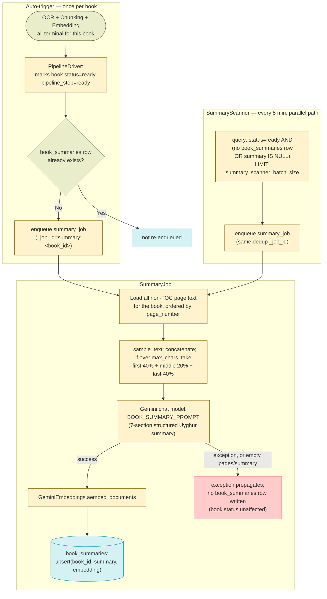

# Summary Generation — Design

See also: [WORKER_DESIGN.md](WORKER_DESIGN.md) for the full pipeline overview and [BOOK_PROCESSING_DIAGRAM.md](BOOK_PROCESSING_DIAGRAM.md) for the cross-stage diagram (summary generation is the last node of the mandatory-adjacent pipeline it depicts). Prior stages: [OCR_DESIGN.md](OCR_DESIGN.md), [CHUNKING_DESIGN.md](CHUNKING_DESIGN.md), [EMBEDDING_DESIGN.md](EMBEDDING_DESIGN.md), [SPELLCHECK_DESIGN.md](SPELLCHECK_DESIGN.md). Next stage: [CHAT_RAG_DESIGN.md](CHAT_RAG_DESIGN.md).

## Overview

Summary generation is a post-pipeline, book-level (not page-level) stage: once a book's mandatory pipeline (OCR → chunking → embedding) is fully terminal and `PipelineDriver` marks it `status = 'ready'`, exactly one `SummaryJob` is auto-enqueued to produce a single LLM-written, structured Uyghur summary of the entire book plus its embedding, stored in the `book_summaries` table. This summary is not used for page-level chat retrieval — it exists purely to help the RAG layer decide *which book(s)* a user's question is about ("book routing"/"identity"/"summary" intents), as a cheaper and more targeted alternative to running full chunk-level vector search across the whole library.

- **Trigger is `PipelineDriver`, not spellcheck or any single mandatory step.** `services/worker/scanners/pipeline_driver.py` computes `newly_ready_ids` as book IDs that (a) have just become fully terminal on OCR/chunking/embedding (`fully_ready_ids`, no failures), (b) are not already `pipeline_step == 'ready'` **and** `status == 'ready'` simultaneously, and (c) have **no existing row in `book_summaries`** (`BookSummary.book_id IS NULL` via an outer join) — this last condition is what prevents `summary_job` from being re-enqueued every time a `ready` book's `pipeline_step`/`status` briefly churns (e.g. during a spell-check-triggered re-chunk). `summary_job` is enqueued outside the DB session, once per book, via `redis.enqueue_job("summary_job", book_id=book_id, _job_id=f"summary:{book_id}")` — the deterministic ARQ job ID also naturally de-duplicates concurrent enqueues of the same book.
- **`SummaryScanner` is a parallel backfill/retry path, not the primary trigger.** It runs independently every 5 minutes and re-queries for the same underlying condition (`status = 'ready'` books with no `book_summaries` row, or a row whose `summary` is `NULL`) so it also catches books that were already `ready` before this feature existed, books whose `summary_job` failed outright (raised before writing a row), and books whose summary was deliberately cleared for regeneration (`summary IS NULL`, as migration `039_summary_v1_backfill.sql` did in bulk). It shares the same `_job_id=f"summary:{book_id}"` ARQ dedup key as `PipelineDriver`'s enqueue, so it never double-enqueues a book `PipelineDriver` already queued this cycle.
- **The whole book's text is sampled, not just a fixed excerpt.** `SummaryJob` loads every non-TOC page's `text` for the book (ordered by `page_number`), concatenates it, and only samples down if the result exceeds a character cap — see Configuration Reference. The sampling strategy (`_sample_text`) is first 40% + middle 20% + last 40% of the full concatenated text, not a naive head-truncation, specifically to preserve broad content coverage for very large books.
- **The output is a fixed 7-section structured Uyghur summary**, not free text. `BOOK_SUMMARY_PROMPT` (`packages/backend-core/app/core/prompts.py`) instructs the model to produce: domain/category tags, a 400–600 word overview, themes/concepts, named entities (people/places/organizations — explicitly excluding the book's own author/translator/editor/publisher), a topic-coverage paragraph, 20–30 hypothetical search queries, and 25–40 keywords — all embedded as a single vector, since the whole point is to make the summary a rich target for semantic book-routing queries.
- **A summary failure never blocks book availability**, but the RAG-side consequence is more specific than "falls back to category-based search" (the phrasing in this stage's own `summary_job.py` module docstring) — see the corrected description in Related Docs below.

## Schema

### `book_summaries` table

| Column | Type | Description |
|---|---|---|
| `book_id` | `varchar(64)`, PK, FK → `books.id` (`ondelete=CASCADE`) | One row per book — no history of prior summaries is kept (`upsert` overwrites in place). |
| `summary` | `text`, not null | The full structured 7-section Uyghur summary text. |
| `embedding` | `vector(3072)`, not null | Embedding of the summary text (`GeminiEmbeddings`, same model as chunk embeddings via `gemini_embedding_model`), used for `summary_search`'s cosine-distance ranking. |
| `generated_at` | `timestamptz`, default/server-default `now()` | Set on every insert and on every `upsert` (both the initial write and any regeneration). |

`packages/backend-core/app/db/models.py`'s `BookSummary` model has only these four columns today. Two staging columns (`summary_v1`, `embedding_draft`) existed briefly for a resample/cutover migration (`039_summary_v1_backfill.sql` → `040_summary_embedding_cutover.sql`) and were dropped once the cutover completed; `BookSummariesRepository.upsert_draft()` (targets the now-dropped `embedding_draft` column) is dead code left over from that migration and is not called by `summary_job.py`, which uses `upsert()` exclusively.

## Architecture

| File | Purpose |
|---|---|
| `services/worker/scanners/pipeline_driver.py` | Computes book-ready/book-error state; auto-enqueues `summary_job` exactly once per book on its `ready` transition (see Overview for the exact condition). |
| `services/worker/scanners/summary_scanner.py` | `run_summary_scanner` — backfill/retry path for `ready` books missing a usable summary. |
| `services/worker/jobs/summary_job.py` | `summary_job` — loads page text, samples/truncates, calls the chat model, embeds the result, upserts `book_summaries`. |
| `packages/backend-core/app/core/prompts.py` | `BOOK_SUMMARY_PROMPT` — the 7-section structured-summary prompt template. |
| `packages/backend-core/app/db/repositories/book_summaries_repository.py` | `BookSummariesRepository` — `upsert`, `get_by_book_id`, `get_summaries_for_books`, and `summary_search` (pgvector cosine-similarity search over `book_summaries.embedding`, optionally scoped by `book_ids`/`categories`). |
| `packages/backend-core/app/services/rag/agent/tools.py` | Consumer side: `_run_search_books_by_summary` and `_run_get_book_summary` — the RAG agent tools that read `book_summaries` for book-routing (see Related Docs). |
| `services/backend/api/endpoints/books_router.py` | Hosts `POST /{book_id}/reprocess/summary` and `GET /{book_id}/summary`. |

## Data Flow



## Component Responsibilities

**1. PipelineDriver's summary-enqueue step — `run_pipeline_driver(ctx)` (excerpt; full driver documented in `WORKER_DESIGN.md`):**

```
1. Compute fully_ready_ids: books (not already in a v1-ready status) whose
   every page is pipeline-terminal on OCR/chunking/embedding with zero
   exhausted failures (see WORKER_DESIGN.md for the terminal_case logic).
2. newly_ready_ids = book_id IN fully_ready_ids WHERE
     (pipeline_step != 'ready' OR pipeline_step IS NULL OR status != 'ready')
     AND book_id NOT IN (SELECT book_id FROM book_summaries)
   (LEFT OUTER JOIN book_summaries, filtered to book_summaries.book_id IS NULL)
   — captured BEFORE the UPDATE below, from the pre-update pipeline_step/status.
3. UPDATE Book SET pipeline_step='ready', status='ready', graph_milestone='idle'
   WHERE book_id IN fully_ready_ids AND (same not-yet-ready condition).
4. Recompute book-level milestones for each book in fully_ready_ids.
5. Commit.
6. (outside the session) For each book_id in newly_ready_ids:
     redis.enqueue_job("summary_job", book_id=book_id,
                        _job_id=f"summary:{book_id}")
7. Log summary_jobs_enqueued=len(newly_ready_ids) alongside the rest of the
   driver's run summary.
```

**2. SummaryScanner — `run_summary_scanner(ctx)`:**

```
1. Fetch summary_scanner_batch_size (system_configs, default "5").
2. SELECT Book.id LEFT OUTER JOIN book_summaries ON book_summaries.book_id
   = books.id WHERE books.status = 'ready' AND
   (book_summaries.book_id IS NULL OR book_summaries.summary IS NULL)
   LIMIT batch_size.
3. IF no rows: return.
4. For each book_id: redis.enqueue_job("summary_job", book_id=book_id,
   _job_id=f"summary:{book_id}"). enqueue_job returns None when arq
   deduplicates an already-queued/running job with the same _job_id — only
   genuinely-new enqueues are counted/logged.
5. IF any newly enqueued: log count.
```

**3. SummaryJob — `summary_job(ctx, book_id)`:**

```
1. Open a session; fetch gemini_chat_model and gemini_embedding_model from
   system_configs (both required — no code-level fallback; raises
   RuntimeError if either is unset).
2. Load the Book row. IF not found: log warning, return (no exception).
3. SELECT Page.text WHERE book_id=... AND text IS NOT NULL AND
   is_toc = false, ORDER BY page_number. Close the session.
4. IF no page texts: log warning, return.
5. max_chars = settings.summary_max_chars (SUMMARY_MAX_CHARS env, default
   3,000,000). IF gemini_chat_model name does NOT match any of
   "1.5"/"2.0"/"flash"/"pro"/"ultra" (or does match "1.0"), cap
   max_chars = min(max_chars, 100_000) — a smaller-context-window safety net.
6. sampled_text = _sample_text(pages_text, max_chars) — see Overview for the
   40/20/40 sampling strategy; returns the full concatenation unchanged if
   under the cap.
7. Build a text chain with BOOK_SUMMARY_PROMPT bound to gemini_chat_model;
   ainvoke({title, author, text: sampled_text},
   timeout_config_key="gemini_summary_timeout"). Strip the result.
8. IF empty: log warning, return (no book_summaries row written).
9. Embed the summary via GeminiEmbeddings(gemini_embedding_model)
   .aembed_documents([summary]) — single-element batch.
10. Open a new session; BookSummariesRepository.upsert(book_id, summary,
    embedding); commit.
11. Log completion (summary_chars, text_chars=len(sampled_text)).
12. ON EXCEPTION anywhere in 1-11: log error, re-raise (arq will record the
    job as failed; no book_summaries row is written or left partially
    written — the upsert in step 10 is the only write, and it only runs on
    the success path).
```

## Error Handling & Retries

| Scenario | Behavior |
|---|---|
| `gemini_chat_model` or `gemini_embedding_model` not set in `system_configs` | `summary_job` raises `RuntimeError` immediately; no `book_summaries` row written. Job recorded as failed by arq; picked up again by the next `SummaryScanner` run (no row exists yet). |
| Book not found, or book has zero non-TOC pages with text | Logged as a warning; function returns normally (not an exception) — arq sees this as a successful job run with no output. `SummaryScanner` will re-select the book on its next pass since it still has no `book_summaries` row (this can loop indefinitely if the book genuinely has no page text — there is no permanent-failure/give-up state for summary generation). |
| LLM call raises (timeout, API error, etc.) | Exception propagates out of `summary_job`; arq marks the job failed. No row written. Retried only by the next `SummaryScanner` sweep (no dedicated retry-count/backoff mechanism specific to summaries — unlike OCR/chunking/embedding/spellcheck, there is no `retry_count` column or `PipelineDriver` reset step for this stage). |
| LLM returns an empty/whitespace-only summary | Logged as a warning; function returns normally, no row written — same re-pickup behavior as "no page text found." |
| `summary_job` succeeds end-to-end | `book_summaries` row is upserted; book is now excluded from both `PipelineDriver`'s and `SummaryScanner`'s "needs summary" query. |
| Two `summary_job` enqueues for the same book race (`PipelineDriver` and `SummaryScanner` in the same cycle, or `SummaryScanner` re-selecting a book mid-generation) | ARQ's `_job_id=f"summary:{book_id}"` deduplicates — `enqueue_job` returns `None` for the second attempt while the first is queued/running, so at most one `summary_job` instance runs per book at a time under normal operation. |
| A ready book's summary is manually deleted (`POST .../reprocess/summary`) or bulk-cleared (`summary IS NULL`, as migration 039 did) | Both `PipelineDriver` (only for books mid-transition to `ready`) and `SummaryScanner` (every 5 min, for any `ready` book) will re-enqueue it — `SummaryScanner` is the one that actually catches this case in steady state, since the book's `status`/`pipeline_step` aren't changing. |

## Configuration Reference

| Key | Default | Used by |
|---|---|---|
| `summary_max_chars` (env `SUMMARY_MAX_CHARS`, `packages/backend-core/app/core/config.py`) | `3,000,000` | `summary_job` — the character-sampling cap `_sample_text` truncates to when the concatenated book text exceeds it. Not `SUMMARY_MAX_CHARS` as a `system_configs`/DB key — it is a plain env-backed setting (`settings.summary_max_chars`). |
| (inline, hardcoded) 100,000-char cap for non-large-context models | `100_000` | `summary_job` — applied instead of `summary_max_chars` when `gemini_chat_model`'s name doesn't match `"1.5"`/`"2.0"`/`"flash"`/`"pro"`/`"ultra"` (or does match `"1.0"`). Not configurable via `system_configs` or env. |
| `summary_scanner_batch_size` (`system_configs`) | `"5"` (code fallback in `summary_scanner.py`; also documented as the intended steady-state value — can be raised temporarily for bulk regeneration per the scanner's own module docstring) | `summary_scanner` — books claimed per 5-minute run. |
| `gemini_chat_model` (`system_configs`) | `"gemini-3.1-flash-lite"` (seeded by `seed_system_configs()`) | `summary_job` — chat model used for summary generation; no code-level fallback if the key is unset, raises `RuntimeError`. |
| `gemini_embedding_model` (`system_configs`) | `"gemini-embedding-2"` (seeded by `seed_system_configs()`; see [EMBEDDING_DESIGN.md](EMBEDDING_DESIGN.md#configuration-reference)) | `summary_job` — embedding model for the summary vector; no code-level fallback if the key is unset, raises `RuntimeError`. |
| `gemini_summary_timeout` (`system_configs`) | `"300"` (seconds; seeded by migration `054_add_gemini_summary_timeout_config.sql`) | `build_text_chain(...).ainvoke(..., timeout_config_key="gemini_summary_timeout")` — per-call LLM timeout for summary generation specifically (separate budget from `gemini_chat_timeout`/`gemini_ocr_timeout`). |
| `summary_threshold` (env `SUMMARY_THRESHOLD`) | `0.30` | Not part of generation — read by the RAG agent's `search_books_by_summary` tool (`tools.py`) as the minimum cosine similarity for a book to be considered a routing match; included here since it's the other side of the `summary_search` cosine query defined in `book_summaries_repository.py`. |

## API Endpoints

| Endpoint | Role required | Effect |
|---|---|---|
| `POST /api/books/{book_id}/reprocess/summary` | `Depends(require_admin)` (ADMIN only) | Deletes the book's existing `book_summaries` row (if any), invalidates the `rag:summary_search:*` cache, and enqueues `summary_job` (same `_job_id=f"summary:{book_id}"` dedup key) via a short-lived ARQ pool created inline in the request handler. Returns `404` if the book doesn't exist. |
| `GET /api/books/{book_id}/summary` | `Depends(get_current_user_optional)` — optional auth; guests allowed only when the book is `status='ready'` AND `visibility='public'`, else `401` | Returns `{summary, generated_at}` for the book's `book_summaries` row, or `404` if none exists yet. |

## Testing

- `services/worker/tests/jobs/summary_job_test.py` — `test_summary_job_success`: mocks the DB session, `SystemConfigsRepository.get_value`, `build_text_chain`, `GeminiEmbeddings`, and `BookSummariesRepository`; asserts the chat chain is invoked with `timeout_config_key="gemini_summary_timeout"` and that `upsert` is called with the generated summary/embedding.
- `services/worker/tests/scanners/summary_scanner_test.py` — currently a placeholder scaffold (`test_summary_scanner_basic`, `assert True`); no behavioral coverage of `run_summary_scanner` exists in this file as of this writing.
- `packages/backend-core/tests/app/db/book_summaries_repository_test.py` — `test_summary_search`, `test_upsert`, `test_get_by_book_id` (does not cover `get_summaries_for_books` or `upsert_draft`).
- `packages/backend-core/tests/app/services/rag_agent_tools_test.py` — covers the consumer side in `tools.py`: `test_get_book_summary_expands_partial_ids_to_all_sister_volumes`, `test_get_book_summary_does_not_expand_unrelated_books`, `test_get_book_summary_falls_back_to_current_book_in_reader_mode`, `test_get_book_summary_falls_back_to_intro_excerpt_when_precomputed_summary_missing`, `test_get_book_summary_intro_fallback_when_initial_pages_are_empty` — this is the direct test evidence for the corrected fallback behavior described below.
- No dedicated test file exists for the `PipelineDriver` summary-enqueue condition or for the `/reprocess/summary` / `GET .../summary` endpoints specifically.

## Related Docs

- **Correction to a stale claim in this stage's own module docstring:** `summary_job.py`'s module docstring states that "books without summaries fall back to the existing category-based search in rag_service." (`WORKER_DESIGN.md` used to repeat this claim too, but Task 9's cleanup trimmed its `SummaryJob` coverage down to a one-line link to this doc, so it no longer asserts anything about the fallback behavior — the correction below applies only to the `summary_job.py` docstring.) As of current code, `rag_service.py` and `deterministic_handler.py` no longer exist — both were deleted during the ADK-chat consolidation (see `docs/superpowers/plans/2026-08-12-adk-chat-consolidation.md`); `character_categories` is used throughout retrieval as a general scoping filter, not as a summary-failure-specific fallback. The actual current fallback chain, verified against `packages/backend-core/app/services/rag/agent/tools.py`'s `_run_get_book_summary`/`_run_search_books_by_summary`: (1) `search_books_by_summary` (the tool wrapping `BookSummariesRepository.summary_search`) simply omits books with no `book_summaries` row from its vector-search results — no error, no special-case; (2) `get_book_summary`, if it finds zero summary rows for the requested book IDs, falls back to reading each book's first few pages via `PagesRepository.find_first_pages_with_text` and returns up to a 2,000-character "intro excerpt" per book as context instead (`test_get_book_summary_falls_back_to_intro_excerpt_when_precomputed_summary_missing` covers this). Both tools are called from `ChatOrchestrator`'s single retrieval agent (`KitabimRetrievalAgent`, `chat/retrieval_agent.py`) now, not from a deleted handler; if a summary-intent question still yields nothing useful after that, the agent's own multi-turn tool-calling loop (not a hardcoded fallback step) remains free to call `search_chunks` for ordinary chunk-level retrieval instead. So the claim "a summary failure never blocks book availability" still holds, but the mechanism is the intro-excerpt fallback inside `get_book_summary` plus the retrieval agent's own tool-choice flexibility, not a distinct "category-based search" path.
- [SPELLCHECK_DESIGN.md](SPELLCHECK_DESIGN.md) — the last mandatory-adjacent stage before a book reaches `ready`; spellcheck/auto-correct completion is not itself a dependency of this stage (only full OCR/chunking/embedding termination is).
- [CHAT_RAG_DESIGN.md](CHAT_RAG_DESIGN.md) documents the `search_books_by_summary`/`get_book_summary` RAG agent tools and the "summary"/"identity" intent routing that consumes `book_summaries` as described above.
- [WORKER_DESIGN.md](WORKER_DESIGN.md) — full pipeline, `PipelineDriver`, cron schedule, and shared conventions.
