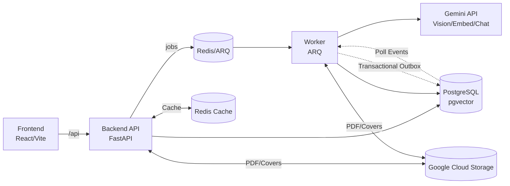

# System Design — Kitabim.AI

## 1) Overview
Kitabim.AI is a monorepo-based platform for OCR, curation, and RAG-powered reading of Uyghur books. The system uses the **Gemini 2.0 Flash** model for high-throughput OCR and embeddings, a FastAPI backend with an asynchronous processing pipeline, and a React/Vite frontend. Background orchestration is handled through a Redis-backed queue with a dedicated worker service. The backend API and worker share a common Python package (`packages/backend-core`).

## 2) Goals & Non‑Goals
**Goals**
- Efficient, per-page OCR and indexing of PDFs using Gemini API.
- High-quality RAG for book- and library-level Q&A.
- Maintainable, modular architecture with clear boundaries.
- Standardized file management (operational scripts in `scripts/`, deployment scripts in `deploy/`, docs in `docs/`).
- Observability (logging, health checks, detailed pipeline statistics).

**Non‑Goals (current)**
- Multi-tenant auth and billing.
- Use of Gemini Batch API (real-time/interactive API is preferred for lower latency).

## 3) Architecture (High-Level)

### Core Services
- **Backend API (`services/backend`)**
  - FastAPI application built on shared backend core.
  - Orchestrates upload, job management, and RAG chat.
  - Exposes REST endpoints for books, chat, and admin dashboard.
  - Uses PostgreSQL for metadata + embeddings (pgvector).
  - **Redis Caching Layer**: High-performance caching for books, categories, and RAG results.
  - **Circuit Breaker**: Resilient protection for Redis and external AI services.


- **Worker (`services/worker`)**
  - ARQ worker process for background orchestration.
  - **Scanners**: Poll for idle work (OCR, Chunking, Embedding, Spell Check).
  - **Jobs**: Focused executors that perform the actual AI or data processing in realtime.
  - **Event Dispatcher**: Reacts to `PipelineEvent` entries to trigger next-step jobs immediately.
  - **Maintenance**: Automated cleanup and staleness watchdog.

- **Frontend (`apps/frontend`)**
  - React 19 + Vite UI.
  - Real-time status updates for books and individual page milestones.

- **Gemini Infrastructure**
  - **Interactive API**: Real-time processing of OCR, Embedding, and Spell Check requests.
  - **File API**: Transient storage for input images during OCR.

- **Google Cloud Storage (GCS)**
  - Private bucket for original PDFs (source of truth).
  - Public bucket (CDN-enabled) for book covers.

### Architecture Diagram



## 4) Monorepo Structure
```
/apps/frontend       # UI Application
/services/backend    # API Service
/services/worker     # Pipeline Worker
/packages/backend-core # Shared logic & models
/scripts            # Diagnostic & operational scripts
/deploy             # Deployment infrastructure & local dev scripts
/docs               # Architecture & design docs
/docker-compose.yml # Primary local dev entry point
```

## 5) Data Model (PostgreSQL)
**Books**
- `status` statuses: `pending`, `ocr_processing`, `ocr_done`, `indexing`, `ready`, `error`
- `pipeline_step`: Active pipeline stage (`ocr`, `chunking`, `embedding`, `spell_check`, `ready`)
- `pipeline_stats`: JSONB blob containing page counts per milestone (e.g., `spell_check_active`, `ocr_failed`)

**Pages**
- **Milestones**: `ocr_milestone`, `chunking_milestone`, `embedding_milestone`, `spell_check_milestone`.
- Milestone States: `idle`, `in_progress`, `succeeded`, `failed`, `done`.
- `text`, `is_indexed`.

**Pipeline Events**
- Transactional outbox pattern: `page_id`, `event_type`, `processed`.
- Used to trigger downstream processing immediately after a milestone succeeds.

**Chunks**
- Semantic units with `pgvector(3072)` embeddings (Gemini Embedding v2 / `gemini-embedding-2`).

## 6) Key Flows

### A) PDF Processing Workflow (Realtime Pipeline)
1. **Upload**: User uploads PDF to Backend → Saved to GCS.
2. **OCR Submission**: Worker picks up `idle` pages, renders pdf to images, and calls Gemini Vision API.
3. **OCR Application**: Worker applies text to `pages`, sets `ocr_milestone` to `succeeded`.
4. **Local Chunking**: Worker cleans text and creates `chunks`. Sets `chunking_milestone` to `succeeded`.
5. **Embedding**: Worker generates and stores vectors for chunks. Sets `embedding_milestone` to `succeeded`.
6. **AI Polish**: Worker performs spell-check identification.
7. **Finalization**: Book marked `ready` when all pages reach their terminal milestones.

### B) RAG Chat

The RAG pipeline is intent-routed. Nine specialized handlers cover metadata queries, follow-ups, and catalog lookups. General questions go through the retrieval handler (fixed pipeline or agentic loop depending on the feature flag).

**Handler registry dispatch:**
1. `HandlerRegistry` matches the question to the highest-priority handler whose `can_handle()` returns True.
2. Specialized handlers (identity, author lookup, follow-up rewriting, etc.) answer directly without retrieval.
3. `AgentRAGHandler` (when `agentic_rag_enabled=true`) or `StandardRAGHandler` handles all other questions.

**Agentic retrieval loop (`agentic_rag_enabled=true`):**
1. Agent LLM decides which tools to call (up to 4 steps, stops at 8+ chunks). **(Gemini function calling)**
2. Tools: `search_books_by_summary` **(Level-3 cache)** → `search_chunks` **(Level-1 + Level-2 cache)** → `find_books_by_title` → `rewrite_query`
3. Accumulated context passed to answer LLM for final response generation.

**Fixed retrieval pipeline (`agentic_rag_enabled=false`, fallback):**
1. Backend embeds query. **(Level-1 Cache)**
2. Selects book scope via title match → summary search **(Level-3 Cache)** → context_book_ids → category fallback.
3. pgvector similarity search. **(Level-2 Cache)**
4. Context + prompt passed to answer LLM.

**Frontend context tracking:** After each response, `used_book_ids` is returned in metadata and sent back as `context_book_ids` in the next request, giving the agent/handler a reliable scope hint without LLM-based history parsing.


## 7) Gemini Integration Strategy
- **Official SDK (`google-genai`)**: Used for **File API** operations where LangChain support is limited or direct control is required.
- **LangChain**: Used for **Interactive Chat**, **Spell Check**, **Categorization**, and **Agentic RAG tool calling** (LCEL pipelines, structured output parsing, `bind_tools`).

## 8) Reliability & Observability
- **Idempotency**: All jobs use standardized identifiers (e.g., `ocr_{book}_{page}`) to ensure results are mapped correctly even if retried.
- **Cleanup**: Transient files in Gemini File API and local cache are deleted automatically after processing.
- **Circuit Breaker**: Protects interactive services from LLM outages and Redis failures.
- **Cache Service**: Centralized caching with lazy-loading and monitoring (`get_stats`).
- **Worker Tracking**: Admin dashboard allows monitoring of real-time job states and detailed page-level progress.
- **RAG Evaluations**: Every chat response writes a `rag_evaluations` row when `rag_eval_enabled=true`. Agent-path rows include `agent_steps` (LLM calls), `tools_called` (ordered tool sequence), `retry_count` (search_chunks invocations), and `final_chunk_count` (unique chunks after dedup). Standard-path rows leave these columns NULL.


## 9) Scalability
- **Concurrency**: ARQ worker processes handles page-level tasks in parallel, providing high throughput.
- **Cloud Storage**: GCS handles the heavy lifting for binary artifacts.
- **Vector Search**: pgvector in PostgreSQL allows scaling retrieval without a separate vector database (using HNSW indexes).

## 10) Security
- All AI keys and GCS credentials are kept server-side.
- JWT-based authentication with role-based access control (Admin, Editor, Reader).
- Private GCS buckets ensure book content isn't exposed directly.
