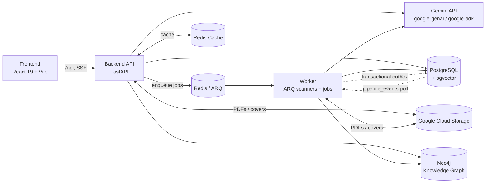

# System Design — Kitabim.AI

## 1) Overview

Kitabim.AI is a monorepo platform for OCR digitization, editorial curation, and RAG-powered conversational reading of Uyghur-language books. It combines a FastAPI backend, an asynchronous ARQ worker pipeline, a React/Vite frontend, PostgreSQL (with pgvector) for metadata and embeddings, and Neo4j for a GraphRAG knowledge graph of entities extracted from book text.

All AI calls — OCR, chat, embeddings, summarization, knowledge-graph extraction — go through **Google Gemini** models. Model names are never hardcoded: they are read from the `system_configs` table at request time (`ocr_gemini_model`, `rag_gemini_chat_model`, `embed_gemini_model`, `kg_gemini_extraction_model`, optionally `gemini_agent_loop_model`), so operators can change models without a deploy. If a required key is missing, the call fails loudly (`RuntimeError`) rather than silently falling back.

The AI layer is built on two Google first-party stacks:
- **`google-genai`** — direct generation, structured (Pydantic-schema) extraction, and embedding calls used throughout OCR, summarization, knowledge-graph extraction, and ChatOrchestrator's signal-extraction call.
- **`google-adk`** — powers `ChatOrchestrator`'s two-agent pipeline: a free-form ReAct retrieval agent, and a tool-less answer agent for synthesis.

The backend API and worker are two separate deployable services that share one Python package, `packages/backend-core`, for models, repositories, LLM clients, and business logic.

## 2) Goals & Non-Goals

**Goals**
- Efficient, page-level OCR and indexing of PDFs using Gemini Vision.
- High-quality, robust RAG for book- and library-level Q&A in Uyghur.
- A maintainable, modular architecture built entirely on the Google first-party AI stack (no LangChain, no third-party LLM SDKs).
- Observability: request telemetry, user thumbs-up/down feedback, and per-request tool-execution traces.

**Non-Goals (current)**
- Multi-tenant billing.
- Corpus-wide/batch RAG metrics scoring (e.g. a periodic Ragas run) — but each `ChatOrchestrator` turn does get an async, single-turn LLM-judge score (faithfulness/answer relevance/context precision, via `rag_eval_job`, gated by `rag_judge_scoring_enabled`, default `true`); user thumbs-up/down feedback (`POST /api/chat/feedback`) remains the primary immediate review signal.

## 3) Architecture (High-Level)

### Core Services

- **Backend API (`services/backend`)**
  - FastAPI application (Python 3.13) built on `packages/backend-core`.
  - Handles auth (JWT + OAuth), book/page CRUD, uploads, RAG chat (sync + SSE streaming), persisted chat conversation history, dictionary/proverb/Quran lookups, and admin/stats endpoints.
  - Enqueues pipeline jobs to Redis/ARQ; does not run any pipeline processing itself.
  - Uses PostgreSQL (via SQLAlchemy 2.0 async + asyncpg) for metadata, pgvector for embeddings.
  - Talks to Neo4j (Bolt protocol) for knowledge-graph reads.
  - Redis-backed response caching (books, categories, system configs, RAG query/embedding/rewrite results, stats) with per-key TTLs.
  - Circuit breakers around the Redis cache and each class of Gemini call (text, OCR, embedding) so LLM/cache outages degrade gracefully instead of cascading.

- **Worker (`services/worker`)**
  - ARQ worker process; runs the same `packages/backend-core` code as the backend.
  - **Scanners** (`services/worker/scanners/`): periodic pollers that atomically lease `idle`-milestone pages/books and enqueue the matching job — OCR, chunking, embedding, spell-check, summary, knowledge-graph, auto-correct, plus GCS discovery, a staleness watchdog, and maintenance cleanup.
  - **Event dispatcher**: reacts to `pipeline_events` (a transactional-outbox table) to trigger the next pipeline step immediately after a milestone succeeds, instead of waiting for the next scanner poll.
  - **Jobs** (`services/worker/jobs/`): the actual per-page/per-book AI or data-processing executors.

- **Frontend (`apps/frontend`)**
  - React 19 SPA built with Vite, served by Nginx.
  - Reader UI with real-time book/page milestone polling, curation/spell-check workspace, admin dashboard, and streaming chat UI (renders `planning`, `tool_call`, `agent_thinking`, `grading`, and `chunk` SSE events as they arrive).
  - Home page search is a paginated tab bar (`SearchTabBar`, 11 tabs per page with a More/Back toggle) covering chat, catalog browse, full-text content search, and independent reference lookups — see §6D.

- **Gemini Infrastructure**
  - Interactive (real-time) API for OCR, embeddings, chat, summarization, and entity extraction — the default path for all of these.
  - Gemini **Batch API** as an optional, feature-flagged alternative for OCR (`ocr_batch_enabled`) and embedding (`embed_batch_enabled`) generation, for lower-cost high-volume ingestion at the expense of latency (async submit + poll instead of an immediate response).
  - File API for transient image uploads during interactive OCR, and for uploading batch-job JSONL input files.

- **Google Cloud Storage (GCS)**
  - Private bucket for original PDFs (source of truth).
  - Public, CDN-fronted bucket for book cover images.

### Architecture Diagram

```mermaid
flowchart LR
  FE[Frontend<br/>React 19 + Vite] -->|/api, SSE| BE[Backend API<br/>FastAPI]
  BE -->|enqueue jobs| RQ[(Redis / ARQ)]
  RQ --> WK[Worker<br/>ARQ scanners + jobs]
  BE --> GEM[Gemini API<br/>google-genai / google-adk]
  WK --> GEM
  BE --> DB[(PostgreSQL<br/>+ pgvector)]
  WK --> DB
  WK -.->|transactional outbox| DB
  DB -.->|pipeline_events poll| WK
  BE <-->|PDFs / covers| GCS[(Google Cloud Storage)]
  WK <-->|PDFs / covers| GCS
  BE <--cache--> CACHE[(Redis Cache)]
  BE --> N4J[(Neo4j<br/>Knowledge Graph)]
  WK --> N4J
```

## 4) Monorepo Structure
```
apps/frontend          # React/Vite SPA
clients/kitabim-ocr      # Standalone local OCR client (currently Surya OCR; not deployed, not containerized)
packages/backend-core   # Shared models, repositories, LLM clients, services
packages/shared          # Generated OpenAPI TypeScript types, shared by the frontend
services/backend        # FastAPI HTTP API
services/worker         # ARQ scanners + background jobs
scripts/                 # Operational / diagnostic scripts
deploy/local             # Local Docker Compose rebuild scripts
deploy/gcp                # Production Docker Compose + deploy scripts
docs/                      # Architecture & design docs
docker-compose.yml          # Local dev entry point (Redis, backend, worker, frontend, Neo4j)
```
PostgreSQL itself is **not** containerized in local dev — it runs standalone on the host and containers reach it via `host.docker.internal:5432`.

## 5) Data Model

### PostgreSQL (30 tables)

**`books`**
- `status`: `pending`, `ocr_processing`, `ocr_done`, `indexing`, `ready`, `error`.
- `pipeline_step`: current active stage (`ocr`, `chunking`, `embedding`, `spell_check`).
- Book-level milestones, denormalized from pages for fast status reads: `ocr_milestone`, `chunking_milestone`, `embedding_milestone`, `spell_check_milestone`, `graph_milestone` — each one of `idle`, `in_progress`, `succeeded`/`complete`, `failed`, `error`/`partial_failure`.
- `has_graph` (surfaced to the frontend) is derived purely from `graph_milestone == "complete"` — there is no live Neo4j existence check.
- `visibility`: `public` / `private` — books are only public after editorial sign-off.

**`pages`**
- `status`: `pending`, `ocr_processing`, `ocr_done`, `chunked`, `indexing`, `indexed`, `error`.
- Per-page milestones mirroring the book-level ones: `ocr_milestone`, `chunking_milestone`, `embedding_milestone`, `spell_check_milestone`.
- `text`, `is_indexed`, `is_toc`, `retry_count`, `worker_id`/`claimed_at` (atomic page-leasing for parallel workers).

**`pipeline_events`**
- Transactional outbox: `page_id`, `event_type`, `processed`. Polled by the worker's event dispatcher to trigger the next pipeline step immediately after a milestone succeeds.

**`chunks`**
- Semantic passages with `pgvector(3072)` embeddings, unique per `(book_id, page_number, chunk_index)`.

**`book_summaries`**
- One LLM-generated summary + `pgvector(3072)` embedding per ready book, used for hierarchical/topic-level book discovery ahead of chunk-level search.

**`batch_ocr_jobs` / `batch_embedding_jobs` / `batch_history_extraction_jobs`**
- One row per Gemini Batch API submission (`gemini_batch_id`, `status` — `submitting | submitted | running | succeeded | failed | cancelled`, GCS input/output URIs, page/book/chunk ID arrays). Written by `batch_ocr_service.py`/`batch_embedding_service.py`/`batch_history_extraction_service.py` when the corresponding `gemini_batch_*_enabled` system config is on, and updated by the three dedicated poller scanners as Gemini's batch job progresses. Only exist when batch mode has been used at least once — all three flags default to `false`.

**`conversations` / `conversation_messages`**
- Persisted, resumable chat history: one `conversations` row per chat thread (`user_id`, optional `book_id`, `is_global`, `title` auto-derived from the book or first question, soft-deleted via `deleted_at`), and one `conversation_messages` row per turn (`role` — `user`/`model`, `content`, `agent_steps`/`used_book_ids` JSONB, optional `eval_id` linking to `rag_evaluations`). Backed by `ConversationRepository`; only populated for requests served by `ChatOrchestrator` (see §6B).

**Dictionary & reference tables**: `dictionary`, `words`, `synonyms`, `history_dictionary`, `names_dictionary`, `english_uyghur_dictionary`, `proverbs`, `quran` — power the retrieval agent's dedicated dictionary/Quran lookup tools independent of book content.

**`history_dictionary_staging`**
- Holds AI-extracted historical terms/facts pending admin review before publication into `history_dictionary`. Populated by `extract_book_history_terms_task` (admin-triggered per book, `history_extraction_service.py`), reviewed via the `/api/admin/history-dictionary/staging/*` endpoints (list, approve, bulk-approve, reject, resolve individual facts, synthesize a definition from collected facts). Gated by the `history_extraction_enabled` system config (default `true`); an optional Gemini Batch API mode (`history_batch_enabled`, default `false`) submits extraction as an async batch job instead, polled by `batch_history_poller_scanner`.

**Curation tables**: `page_spell_issues`, `auto_correct_rules` — per-page spell-check findings and reusable OCR auto-correction rules.

**Platform tables**: `users` (role: `admin` | `editor` | `reader`), `refresh_tokens`, `user_chat_usage` (daily chat-quota tracking), `rag_evaluations` (per-request RAG telemetry, now optionally linked to a `conversation_id`), `system_configs` (runtime-tunable settings, see below), `contact_submissions`.

**Graph resolution tables**: `graph_resolution_queue` (one row per extracted entity awaiting dedup, claimed by `graph_resolution_scanner`), `graph_resolution_reviews` (ambiguous merge decisions parked for a human admin), `graph_merge_log` (pre-delete snapshot of every merged node + its edges, enabling `unmerge`) — see [KNOWLEDGE_GRAPH_DESIGN.md](KNOWLEDGE_GRAPH_DESIGN.md) for the full resolution pipeline.

### `system_configs` — runtime configuration
A key/value table (seeded with defaults, editable via the admin dashboard) that drives model selection and pipeline tuning without a redeploy — including `rag_gemini_chat_model`, `ocr_gemini_model`, `embed_gemini_model`, `kg_gemini_extraction_model`, `gemini_agent_loop_model` (optional override, otherwise falls back to `rag_gemini_chat_model`), `history_gemini_model`, `rag_reranker_enabled`, `rag_judge_scoring_enabled`, `kg_enabled`, `history_extraction_enabled`, `ocr_batch_enabled` / `embed_batch_enabled` / `history_batch_enabled` (default `false`), and various batch-size/timeout/retention knobs.

### Neo4j (Knowledge Graph)
Stores only entities and their relationships extracted from book chunks — no `Book`, `Author`, or `Chunk` nodes live in the graph; those stay in PostgreSQL.

**Nodes**
- `Entity` — keyed by a stable `id` (uuid, unique constraint `entity_id_unique`), never by name. `canonical_name` (NFC-normalized display name, not unique) and `type` (Person, Location, Event, Organization, HistoricalEra, Concept, Other), optional `subtype`. See [NEO4J_CONNECTION.md](NEO4J_CONNECTION.md) for the full property schema.

**Relationships**
- `RELATED_TO` (directed, `Entity` → `Entity`) — `book_id` (the PostgreSQL book UUID the relationship was extracted from) and `rel_type` (the semantic relation, e.g. `LIVED_IN`, `BORN_IN`, `FRIEND_OF`). Multiple books can contribute independent `RELATED_TO` edges between the same two entities; edges are deleted per-`book_id` when a book is reprocessed or removed, and orphaned `Entity` nodes are cleaned up afterward.

Knowledge-graph extraction and ingestion are gated by the `kg_enabled` system config (disabled by default).

## 6) Key Flows

### A) PDF Processing Workflow (event-driven pipeline)
1. **Upload**: user uploads a PDF via the backend, which stores it in the private GCS bucket and creates `book`/`page` rows.
2. **OCR**: the OCR scanner leases `idle` pages, the OCR job renders each page to an image and calls Gemini Vision (via `google-genai`) using the `ocr_gemini_model` config. Text is written to `pages.text` and `ocr_milestone` set to `succeeded`. If `ocr_batch_enabled` is on, the job instead submits the claimed pages as a Gemini Batch API job (`batch_ocr_jobs` row) and returns immediately; a dedicated poller scanner picks up the result asynchronously (see [WORKER_DESIGN.md](WORKER_DESIGN.md)).
3. **Chunking**: triggered by the pipeline-event dispatcher immediately after OCR succeeds. The chunking job cleans OCR text and writes overlapping `chunks` rows; `chunking_milestone` → `succeeded`.
4. **Embedding**: the embedding job vectorizes each chunk with `embed_gemini_model` and stores it in `chunks.embedding`; `embedding_milestone` → `succeeded`. If `embed_batch_enabled` is on, the embedding scanner instead submits chunks as a Gemini Batch API job (`batch_embedding_jobs` row); a dedicated poller scanner writes vectors back once the batch completes.
5. **Spell-check**: an independent milestone — the spell-check job flags likely OCR errors per page against the dictionary and auto-correct rules; `spell_check_milestone` → `succeeded`.
6. **Finalization**: once every page has reached its terminal milestones for the pipeline steps, the book's `status` becomes `ready`.
7. **Summary ingestion**: once `ready`, the summary scanner enqueues `summary_job`, generating the book's summary embedding. Knowledge-graph extraction (`knowledge_graph_job`, entity/relationship upsert into Neo4j via `google-genai` structured extraction) is feature-flagged off by default (`kg_enabled=false`) and, even when enabled, its scanner (`graph_scanner`) is not currently wired into the worker's cron schedule — see [WORKER_DESIGN.md](WORKER_DESIGN.md#cron-schedule). Today it only runs via the manual admin "Reprocess Graph" action.
8. A staleness watchdog scanner and a maintenance scanner run continuously to recover stuck pages and clean up processed pipeline events.

### B) RAG Chat — `ChatOrchestrator`

One chat pipeline, `ChatOrchestrator` (`packages/backend-core/app/services/chat/orchestrator.py`), serves every request. Both `POST /api/chat/` (via its non-streaming `answer()` wrapper) and `POST /api/chat/stream` (via `stream_response()`) build one unconditionally — there is no feature flag and no alternate pipeline to select between. Per request it:

1. Gets-or-creates a `conversations` row (`ConversationRepository`), deriving a title from the current book or the first ~40 characters of the question. This happens on both endpoints now, including the non-streaming one and first-turn requests — a prior flag-gated design left some requests without conversation persistence (see the note at the end of this section).
2. Loads the last 6 messages of that conversation as pre-processing context, and runs a single-shot structured Gemini signal-extraction call (`analyze_query_signals`, `chat/query_signals.py`) that classifies intent (`catalog`, `dictionary`, `identity`, `summary`, `relationship`, `passage`, `quran`), pronoun-coreference needs, and volume-shift requests, alongside DB lookups for title/author matches. Only the extracted `intent` is read directly by the orchestrator; the rest feeds the retrieval agent's prompt hints.
3. Skips retrieval entirely for exact-phrase/quoted questions (`detect_phrase_intent`, `rag/phrase_intent.py`): a keyword-only leg (`chat/exact_phrase.py`, via `rag/retrieval.py`'s `exact_phrase_chunk_search` → `ChunksRepository.keyword_search`) answers directly from `pages.text_search` matches, rendering page-finding phrasing ("find pages with...") as raw page hits instead of an LLM-synthesized answer.
4. Otherwise, builds a **retrieval agent** (`chat/retrieval_agent.py`) — `AGENT_SYSTEM_PROMPT` over all 19 tools (`services/rag/agent/tools.py`: passage search, summary-based book discovery, knowledge-graph lookup, catalog/author/title/volume metadata tools, per-page retrieval, query rewriting, and dictionary/proverb/name/spelling/Quran lookups) — and runs it via an ADK `Runner` backed by a persistent `DatabaseSessionService` (wired in `services/backend/main.py`), streaming `tool_call`/`tool_result`/`agent_thinking` events.
5. Grades the collected context — by default via an LLM reranker (`rerank_context`, gated by `rag_reranker_enabled`, default `true`) that replaces the relative-score selection with real semantic reranking, falling back to `_grade_context` (`chat/context_grading.py`) if the reranker call fails, times out, or is disabled — then extracts used book IDs with `_extract_used_book_ids`.
6. Builds a separate, tools-less **answer agent** (`chat/answer_agent.py`) to stream the final answer, using its own citation-instruction prompt (`chat/answer_prompts.py`).
7. Persists both the user and model messages via `ConversationRepository.save_turn()`, writes a `rag_evaluations` row linked to the conversation, enqueues `rag_eval_job` for async LLM-judge scoring of the turn (gated by `rag_judge_scoring_enabled`, default `true`), and emits a `done` event carrying `conversationId` — on every turn, streaming or not.

The REST endpoints `POST/GET /api/chat/conversations`, `GET /api/chat/conversations/{id}/messages`, and `DELETE /api/chat/conversations/{id}` (all under `require_reader` auth) back the frontend's conversation-history sidebar (list, resume, delete).

> **Prior design note:** this stage used to run `ChatOrchestrator` alongside a legacy `RAGService`/`HandlerRegistry` pipeline (dispatching to a `DeterministicRAGHandler` or `LLMRoutedRAGHandler`), selected per-request by a `use_adk_chat_v2` flag and `conversationId` presence — with the non-streaming endpoint unable to reach `ChatOrchestrator` at all, and no conversation persistence on the legacy path. That pipeline has been deleted; see `docs/main/CHAT_RAG_DESIGN.md` for full current-state detail and `docs/superpowers/plans/2026-08-12-adk-chat-consolidation.md` for the migration.

### D) Home Search / Library Discovery

The home page's search box drives a single tab bar (`SearchTabBar`) covering 11 modes, paginated 11-per-page with a More/Back toggle (currently a dormant no-op, since all 11 tabs already fit on the one page): `ask` (routes to RAG chat, §6B), `books` (title/author/category catalog browse), `content` (full-text search over `pages.text_search` across the whole library), and eight reference-lookup tabs — dictionary, names, history terms, proverbs, synonyms, English↔Uyghur, Quran, and single-word spell-check. Only the active tab's hook performs a live, debounced fetch against its own existing lookup endpoint (dictionary/proverb/Quran/etc. — no LLM involved); the rest are cheap no-ops. The `content` tab is the one exception requiring pagination: `GET /api/books/content-search` (backed by `PagesRepository.search_content_pages`, an exact-phrase Postgres full-text match) returns snippet hits paginated for infinite scroll, page size 40 by default (matching, but not read from, the `sys_collection_page_size` system config).

### E) History Dictionary AI Extraction (admin-triggered)

An administrator can trigger AI-based extraction of historical terms/entities from a specific book's pages (`POST /api/admin/history-dictionary/books/{book_id}/extract-history`). `extract_book_history_terms_task` (`history_extraction_job.py`) reads the book's page text, runs a structured Gemini extraction + fact-classification pass (`history_extraction_service.py`), and stages the results in `history_dictionary_staging` rather than writing directly into the public `history_dictionary` table. An admin then reviews staged candidates — approve, bulk-approve, reject, resolve individual extracted facts, or trigger LLM synthesis of a definition from the collected facts — via `dictionary_staging_service.py` and the `/api/admin/history-dictionary/staging/*` endpoints. The whole feature is gated by `history_extraction_enabled` (default `true`); if `history_batch_enabled` is on (default `false`), extraction is instead submitted as a Gemini Batch API job (`batch_history_extraction_jobs` row via `batch_history_extraction_service.py`) and picked up asynchronously by `batch_history_poller_scanner`.

## 7) Gemini Integration Strategy
- **`google-genai` SDK** — used for every direct (non-agentic) AI call: the File API for OCR image uploads, OCR text extraction, book summarization, structured knowledge-graph entity/relation extraction (Pydantic schemas), history-term extraction and definition synthesis, embedding generation, and ChatOrchestrator's signal-extraction and query-rewrite calls.
- **Google ADK (`google-adk`)** — used for `ChatOrchestrator`'s two-agent pipeline: a free-form ReAct retrieval `Agent` over the 19-tool registry, and a tool-less answer `Agent` for synthesis, both run through an ADK `Runner`.

## 8) Reliability & Observability
- **Idempotency**: jobs use deterministic keys (e.g. `ocr_{book_id}_{page_number}`) so retries and concurrent workers converge on the same result.
- **Per-page locking**: `ocr_job`, `chunking_job`, `embedding_job`, and `spell_check_job` each wrap their claimed page IDs in a `MultiPageLock` (Redis `SET NX`, namespaced per pipeline stage) so the same page can't be double-processed even if a scanner double-claims it.
- **Batch job resilience**: `batch_ocr_jobs`/`batch_embedding_jobs` poller scanners enforce a wall-clock timeout (`gemini_batch_*_timeout_hours`, default 24h) and a retry budget (`gemini_batch_*_max_retry_count`, default 3) per job, falling back to marking affected pages failed rather than blocking indefinitely. `batch_history_extraction_jobs`/`batch_history_poller_scanner` reuse the same submit-then-poll shape but do not yet have equivalent timeout/retry-count system configs.
- **Cleanup**: transient Gemini File API uploads are deleted after each OCR call.
- **Circuit breakers**: independent breakers protect Redis and each class of Gemini call (text, OCR, embedding) so an outage in one degrades gracefully instead of cascading.
- **Caching**: Redis caches books, category lists, system configs, RAG query/embedding/rewrite/summary-search results, and stats, each with its own TTL.
- **Worker tracking**: the admin dashboard exposes live job state and per-page pipeline progress.
- **Feedback & telemetry**: `rag_evaluations` captures per-request metrics and thumbs-up/down feedback for manual review; `ChatOrchestrator` turns additionally get an async LLM-judge score (`rag_eval_job`) — there is no corpus-wide/batch offline evaluation job.

## 9) Scalability
- **Concurrency**: ARQ workers process pages/books in parallel; pages are leased atomically (`worker_id`/`claimed_at`) to avoid double-processing.
- **Storage**: GCS handles all binary artifacts (source PDFs, covers).
- **Vector search**: pgvector in PostgreSQL scales retrieval without a separate vector database — an HNSW index on `chunks.embedding` for passage search, an IVFFlat index on `book_summaries.embedding` for book-level discovery.
- **Graph queries**: Neo4j handles multi-hop Cypher traversals for GraphRAG subgraphs independently of the relational store.

## 10) Security
- All Gemini API keys and GCS credentials stay server-side; the frontend never talks to Google APIs directly.
- JWT-based authentication with role-based access control (`admin`, `editor`, `reader`); unauthenticated visitors get read-only/guest behavior in the frontend with no elevated DB role.
- OAuth login via Google, Facebook, Twitter/X, and Instagram, with PKCE for Twitter and an httpOnly refresh-token cookie.
- Private GCS bucket for source PDFs; only cover images are publicly served.
- Per-route rate limiting (`slowapi`) on the FastAPI app.
