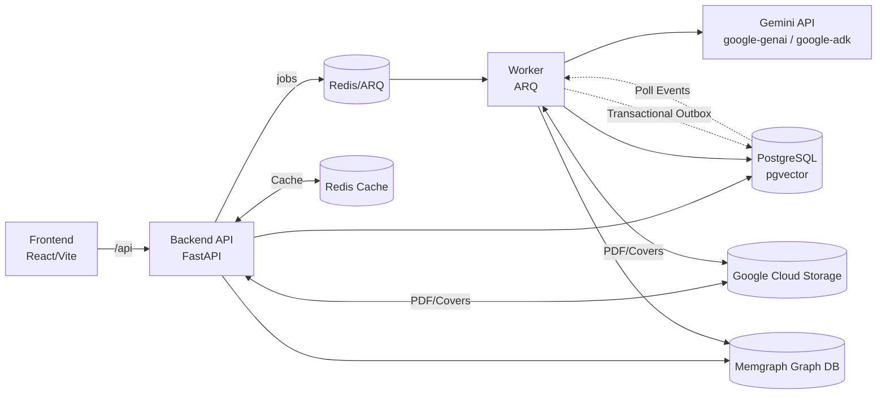

# System Design — Kitabim.AI (Google ADK Version)

## 1) Overview
Kitabim.AI is a monorepo-based platform for OCR, curation, and RAG-powered reading of Uyghur books. The system uses the **Gemini 2.0 Flash** model for high-throughput OCR, embeddings, and chat. It features a FastAPI backend with an asynchronous processing pipeline, a React/Vite frontend, and a Memgraph database for GraphRAG. 

The core AI layers are built using the first-party **google-genai SDK** (for direct generation/embedding calls) and **Google ADK** (for agentic retrieval loops). Background orchestration is handled through a Redis-backed queue with a dedicated worker service. The backend API and worker share a common Python package (`packages/backend-core`).

## 2) Goals & Non‑Goals
**Goals**
- Efficient, page-level OCR and indexing of PDFs using Gemini API.
- High-quality, robust RAG for book- and library-level Q&A.
- Maintainable, modular architecture using Google first-party AI stack only.
- Standardized file management (operational scripts in `scripts/`, deployment scripts in `deploy/`, docs in `docs/`).
- Observability (request telemetry, user feedback tracking, detailed pipeline statistics).

**Non‑Goals (current)**
- Multi-tenant auth and billing.
- Use of Gemini Batch API (real-time/interactive API is preferred for lower latency).
- Automated offline/background RAG metrics scoring (e.g. Ragas).

## 3) Architecture (High-Level)

### Core Services
- **Backend API (`services/backend`)**
   - FastAPI application built on shared backend core.
   - Orchestrates upload, job management, and RAG chat.
   - Exposes REST endpoints for books, chat, and admin dashboard.
   - Uses PostgreSQL for metadata + embeddings (pgvector).
   - **Redis Caching Layer**: High-performance caching for books, categories, and query rewrites (L0-L3 caching).
   - **Circuit Breaker**: Resilient protection for Redis and external Gemini API services.
   - **Memgraph Database**: Graph database (Bolt protocol, port 37687/7687) storing book semantic entities and relationships to support GraphRAG.

- **Worker (`services/worker`)**
   - ARQ worker process for background orchestration.
   - **Scanners**: Poll for idle work (OCR, Chunking, Embedding, Spell Check).
   - **Jobs**: Focused executors that perform the actual AI or data processing in real-time.
   - **Event Dispatcher**: Reacts to `PipelineEvent` entries to trigger next-step jobs immediately.
   - **Maintenance**: Automated cleanup and staleness watchdog.

- **Frontend (`apps/frontend`)**
   - React 19 + Vite UI.
   - Real-time status updates for books and individual page milestones.

- **Gemini Infrastructure**
   - **Interactive API**: Real-time processing of OCR, Embedding, and Chat requests.
   - **File API**: Transient storage for input images during OCR.

- **Google Cloud Storage (GCS)**
   - Private bucket for original PDFs (source of truth).
   - Public bucket (CDN-enabled) for book covers.

### Architecture Diagram

```mermaid
flowchart LR
  FE[Frontend<br/>React/Vite] -->|/api| BE[Backend API<br/>FastAPI]
  BE -->|jobs| RQ[(Redis/ARQ)]
  RQ --> WK[Worker<br/>ARQ]
  WK --> GEM[Gemini API<br/>google-genai / google-adk]
  BE --> DB[(PostgreSQL<br/>pgvector)]
  WK --> DB
  WK -.->|Transactional Outbox| DB
  DB -.->|Poll Events| WK
  BE <-->|PDF/Covers| GCS[(Google Cloud Storage)]
  WK <-->|PDF/Covers| GCS
  BE <--Cache--> CACHE[(Redis Cache)]
  BE --> MG[(Memgraph Graph DB)]
  WK --> MG
```

## 4) Monorepo Structure
```
/apps/frontend         # UI Application
/services/backend      # API Service
/services/worker       # Pipeline Worker
/packages/backend-core # Shared logic, db entities, repositories, & LLM services
/scripts               # Diagnostic & operational scripts
/deploy                # Deployment infrastructure & local dev scripts
/docs                  # Architecture & design docs
/docker-compose.yml   # Primary local dev entry point
```

## 5) Data Model

### PostgreSQL
**Books**
- `status` statuses: `pending`, `ocr_processing`, `ocr_done`, `indexing`, `ready`, `error`
- `pipeline_step`: Active pipeline stage (`ocr`, `chunking`, `embedding`, `spell_check`, `ready`)
- `pipeline_stats`: JSONB blob containing page counts per milestone (e.g., `spell_check_active`, `ocr_failed`)

**Pages**
- **Milestones**: `ocr_milestone`, `chunking_milestone`, `embedding_milestone`, `spell_check_milestone`.
- Milestone States: `idle`, `in_progress`, `succeeded`, `failed`, `done`.
- `text`, `is_indexed`.

**Pipeline Events**
- Transactional outbox pattern: `page_id`, `event_type`, `processed`.
- Used to trigger downstream processing immediately after a milestone succeeds.

**Chunks**
- Semantic units with `pgvector(3072)` embeddings (Gemini Embedding v2 / `text-embedding-004`).

### Memgraph (Knowledge Graph)
Memgraph stores entities and their semantic relationships extracted from book chunks.

**Nodes**
- `Book`: Represents a book in the library. Properties: `id`, `title`, `author`, `summary`.
- `Entity`: Represents a conceptual or concrete entity extracted from the text.
   - Subtypes/Labels: `Person`, `Location`, `Organization`, `Work`, `Event`.
   - Properties: `name`, `type`, `description`.

**Relationships**
- `MENTIONS`: From `Book` to an `Entity`. Properties: `chunk_ids` (array of chunk UUIDs where the entity is mentioned), `count`.
- `LIVES_IN` / `WRITTEN_BY` / `PARTICIPATED_IN` / `RELATED_TO` / etc.: Semantic relationships between `Entity` nodes. Properties: `description`, `source_chunk_ids`.

## 6) Key Flows

### A) PDF Processing Workflow (Realtime Pipeline)
1. **Upload**: User uploads PDF to Backend → Saved to GCS.
2. **OCR Submission**: Worker picks up `idle` pages, renders PDF to images, and calls Gemini Vision API via `google-genai` SDK.
3. **OCR Application**: Worker applies text to `pages`, sets `ocr_milestone` to `succeeded`.
4. **Local Chunking**: Worker cleans text and creates `chunks`. Sets `chunking_milestone` to `succeeded`.
5. **Embedding**: Worker generates and stores vectors for chunks. Sets `embedding_milestone` to `succeeded`.
6. **AI Polish**: Worker performs spell-check identification.
7. **Finalization**: Book marked `ready` when all pages reach their terminal milestones.
8. **Summary & Graph Ingestion**: Once marked ready, the worker triggers `summary_job` (generating book summary embeddings) and `knowledge_graph_job` (extracting entity relationships using the `google-genai` structured client and indexing them in Memgraph) concurrently.

### B) RAG Chat

All questions go directly to `AgentRAGHandler` (priority=998), which runs a Google ADK-based ReAct loop.

**Agentic retrieval loop:**
1. **Intent Detection & Query Decomposition** (Pre-processing):
   - Detects question scope (current page, catalog browse, content search).
   - If a multi-question query is identified, an LLM call splits it into up to 4 self-contained sub-questions.
2. **Context Injection**:
   - Pre-injects current book ID, context book IDs from conversation history, and category filters into a `[Context]` block to accelerate retrieval.
3. **ADK Agent Loop**:
   - Wires registered tools (11 tools total) and system instruction.
   - Runs a stateless `InMemoryRunner` to process tool calls dynamically (e.g. `search_chunks`, `query_knowledge_graph`, etc.) up to 4 steps.
4. **Deduplication and Grading** (Post-processing):
   - Collects tool observations.
   - Filters retrieved chunks using a relative-score threshold against the highest score.
5. **Answer Generation**:
   - Generates the final streaming answer (with inline citations) based on the graded context.
6. **Telemetry Logging**:
   - Inserts basic query metadata, agent execution steps, and tool lists into the `rag_evaluations` table for analytics and user feedback monitoring.

## 7) Gemini Integration Strategy
- **google-genai SDK**: Used for direct, non-agentic AI operations:
   - File API for uploading images during OCR.
   - Summarization, text generation, and entity extraction tasks (structured output with Pydantic schemas).
   - Vector embedding generation.
- **Google ADK**: Used for orchestration of the agentic RAG chat loop. Wires custom Python tools and executes the ReAct reasoning flow.


## 8) Reliability & Observability
- **Idempotency**: All jobs use standardized identifiers (e.g., `ocr_{book}_{page}`) to ensure results are mapped correctly even if retried.
- **Cleanup**: Transient files in Gemini File API and local cache are deleted automatically after processing.
- **Circuit Breaker**: Protects interactive services from LLM outages and Redis failures.
- **Cache Service**: Centralized caching with lazy-loading and monitoring (`get_stats`).
- **Worker Tracking**: Admin dashboard allows monitoring of real-time job states and detailed page-level progress.
- **User Feedback & Telemetry**: RAG requests write telemetry to `rag_evaluations`. Administrators monitor usage statistics and user thumbs-up/down feedback. Offline evaluation scoring is omitted for clean container execution.

## 9) Scalability
- **Concurrency**: ARQ worker processes handles page-level tasks in parallel, providing high throughput.
- **Cloud Storage**: GCS handles the heavy lifting for binary artifacts.
- **Vector Search**: pgvector in PostgreSQL allows scaling retrieval without a separate vector database (using HNSW indexes).
- **In-Memory Graph**: Memgraph handles fast Cypher queries for relational GraphRAG subgraphs.

## 10) Security
- All AI keys and GCS credentials are kept server-side.
- JWT-based authentication with role-based access control (Admin, Editor, Reader).
- Private GCS buckets ensure book content isn't exposed directly.
