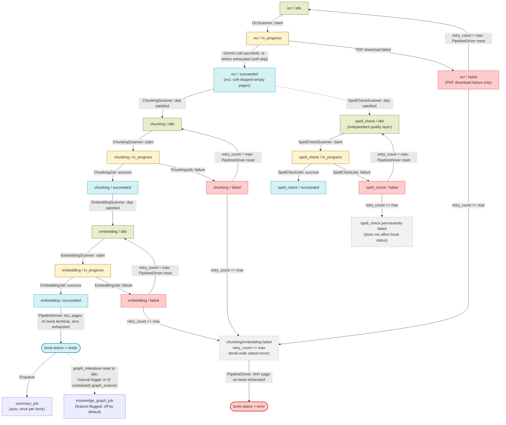

# Worker Design — Event-Driven Pipeline

See also: [book_processing_diagram.md](book_processing_diagram.md) for the visual pipeline diagram, admin recovery actions, and page-milestone transition diagrams.

## Overview

The Kitabim.AI processing pipeline is a **decoupled, event-driven architecture** built on the **Transactional Outbox Pattern**. Work is expressed as small, single-purpose ARQ jobs; scanners run on a cron schedule to find eligible work and dispatch jobs; an event dispatcher reacts to completed work and dispatches the next step immediately, without waiting for the next cron tick.

Key characteristics:

- **Milestone columns** — each pipeline step (`ocr`, `chunking`, `embedding`, `spell_check`) has its own state column on the `pages` table, denormalized onto `books` for fast listing/filtering.
- **States** — `idle | in_progress | succeeded | failed`, one per step, per page.
- **Mandatory pipeline** — `ocr → chunking → embedding` is sequential; embedding is the terminal mandatory step.
- **Spell check** — an independent quality layer. It only depends on OCR being done, runs in parallel with chunking/embedding, and does not block book readiness.
- **Knowledge graph extraction, spell check, and Gemini Batch API mode for OCR/embedding are all feature-flagged** — see [Feature Flags](#feature-flags).
- **Transactional Outbox** — the `pipeline_events` table records a row for every milestone transition, written in the same DB transaction as the result. The Event Dispatcher polls this table and immediately enqueues the next job, so most pages move `ocr → chunking → embedding` inside seconds rather than waiting for the next 1-minute scanner tick.
- **Per-page distributed locking** — `ocr_job`, `chunking_job`, `embedding_job`, and `spell_check_job` each wrap their claimed page IDs in a `MultiPageLock` (Redis `SET NX` per page, 1‑hour expiry, keyed as `lock:{prefix}:{page_id}` with each stage passing its own `prefix` — e.g. `ocr`, `chunking` — so the same page can be locked independently per pipeline stage) before processing, so the same page can never be worked on by two job instances concurrently even if a scanner double-claims it.
- **Optional Gemini Batch API mode** — OCR and embedding generation can each independently run through the Gemini Batch API instead of the interactive API (`gemini_batch_ocr_enabled` / `gemini_batch_embedding_enabled`, both `false` by default), trading latency (async submit + poll) for lower cost on high-volume ingestion. See [OCR_DESIGN.md](OCR_DESIGN.md#data-flow) and [EMBEDDING_DESIGN.md](EMBEDDING_DESIGN.md#data-flow) for the full batch-mode algorithm.

## Goals

- Clear, unambiguous page and book state at all times
- Per-page retry with exhausted-retry detection
- Uniform stale-page detection across all steps (one rule, worker-heartbeat aware)
- Each component has a single responsibility: scanners claim and dispatch, jobs execute
- Adding a new pipeline step only requires a new scanner + job

## Feature Flags

Several pipeline stages are gated by boolean flags in `system_configs` (checked at the top of the relevant scanner/job, default is what ships in `packages/backend-core/app/db/seeds.py`):

| Flag | Default | Gates |
|---|---|---|
| `spell_check_enabled` | `true` | `spell_check_scanner` — returns immediately if not `"true"` |
| `auto_correct_enabled` | `true` | `auto_correct_scanner` — returns immediately if not `"true"` |
| `knowledge_graph_enabled` | `false` | `graph_scanner` and `knowledge_graph_job` — both no-op (and reset `graph_milestone` back to `idle`) if not `"true"` |
| `gemini_batch_ocr_enabled` | `false` | `ocr_job` — submits a `batch_ocr_jobs` row via the Gemini Batch API instead of OCR'ing inline when `"true"` |
| `gemini_batch_embedding_enabled` | `false` | `embedding_scanner` — submits a `batch_embedding_jobs` row via the Gemini Batch API instead of dispatching `embedding_job` when `"true"` |

> **Knowledge graph extraction is off by default in a fresh environment.** It must be explicitly enabled via `system_configs` before `graph_scanner` or the "Reprocess Graph" admin action will do anything.

## Schema

### `pages` table

| Column | Type | Description |
|---|---|---|
| `ocr_milestone` | `varchar` | `idle \| in_progress \| succeeded \| failed` |
| `chunking_milestone` | `varchar` | `idle \| in_progress \| succeeded \| failed` |
| `embedding_milestone` | `varchar` | `idle \| in_progress \| succeeded \| failed` |
| `spell_check_milestone` | `varchar` | `idle \| in_progress \| succeeded \| failed` |
| `retry_count` | `integer` | Shared failure counter for the page — incremented by whichever step's job fails (OCR, chunking, embedding, or spell check all write to the same counter). |
| `worker_id` / `claimed_at` | `varchar` / `timestamptz` | Set by the scanner that claimed the page; used by `StaleWatchdog` to detect dead workers. |
| `pipeline_step` | `varchar` | Legacy/display field showing the step a page is currently associated with (`ocr`, `chunking`, `embedding`, `spell_check`). Not read by scanners to gate work — milestones are the source of truth. |

### `books` table

| Column | Type | Description |
|---|---|---|
| `pipeline_step` | `varchar` | Coarse progress indicator for the UI: `ocr \| chunking \| embedding \| spell_check \| ready \| failed` |
| `status` | `varchar` | `pending \| ready \| error` — the field that actually gates search visibility and further scanner eligibility |
| `ocr_milestone` / `chunking_milestone` / `embedding_milestone` / `spell_check_milestone` | `varchar` | Book-level rollups of the page milestones (`idle \| in_progress \| complete \| partial_failure \| failed`), maintained by `BookMilestoneService` for fast listing without joining `pages`. |
| `graph_milestone` | `varchar` | `idle \| in_progress \| complete \| partial \| failed`. `has_graph` in the API is derived as `graph_milestone == 'complete'` — there is no separate Neo4j lookup. |

## Architecture

```
worker/
  scanners/
    gcs_discovery_scanner.py   ← lists GCS uploads/, registers new books in DB
    pipeline_driver.py         ← state machine: initializes pages, resets retryable failures, marks book ready/error, enqueues summary_job
    ocr_scanner.py             ← claims idle ocr pages (grouped by book), dispatches OcrJob per book
    batch_ocr_poller_scanner.py ← polls in-flight batch_ocr_jobs, ingests results (feature-flagged path)
    chunking_scanner.py        ← claims idle chunking pages across all books, dispatches one ChunkingJob
    embedding_scanner.py       ← claims idle embedding pages across all books, dispatches one EmbeddingJob
                                  (or submits a batch_embedding_job inline if gemini_batch_embedding_enabled)
    batch_embedding_poller_scanner.py ← polls in-flight batch_embedding_jobs, writes vectors back (feature-flagged path)
    spell_check_scanner.py     ← claims idle spell_check pages, dispatches SpellCheckJob (feature-flagged)
    event_dispatcher.py        ← polls the outbox, immediately dispatches the next job
    auto_correct_scanner.py    ← finds pages with auto-correctable spell issues, dispatches AutoCorrectJob in batches (feature-flagged)
    stale_watchdog_scanner.py  ← resets pages/books stuck in_progress using worker-heartbeat detection
    summary_scanner.py         ← backfills/retries missing book_summaries for ready books
    graph_scanner.py           ← backfills/retries missing knowledge graphs for ready books (feature-flagged; see note below)
    maintenance_scanner.py     ← deletes old processed pipeline_events rows
  jobs/
    ocr_job.py                 ← downloads PDF, OCRs pages via Gemini Vision (google-genai)
    chunking_job.py            ← splits page text into chunks, upserts into the chunks table
    embedding_job.py           ← generates and stores chunk embeddings (google-genai)
    spell_check_job.py         ← identifies unknown words and suggests corrections
    auto_correct_job.py        ← applies auto-correction rules to open spell issues
    summary_job.py             ← generates a semantic book summary + embedding for RAG routing
    knowledge_graph_job.py     ← extracts entities/relationships and indexes them in Neo4j
  worker.py                    ← ARQ WorkerSettings: registers the 7 jobs and 13 of the 14 scanners as cron jobs
```

**Job and scanner count:** 7 job functions are registered in `WorkerSettings.functions`. 14 scanner modules exist under `services/worker/scanners/` (including the two batch-API poller scanners), but only **13** are wired into `WorkerSettings.cron_jobs` in `worker.py` — `graph_scanner.py` is fully implemented and tested but is **not currently scheduled** (see [Cron Schedule](#cron-schedule)).

Batch OCR/embedding submission itself is **not** a separate ARQ job — it happens inline inside `ocr_job.py` and `embedding_scanner.py` respectively, gated by the feature flags above (see [OCR_DESIGN.md](OCR_DESIGN.md#data-flow) and [EMBEDDING_DESIGN.md](EMBEDDING_DESIGN.md#data-flow)).

## Component Responsibilities

### GcsDiscoveryScanner

See [DOCUMENT_DISCOVERY_DESIGN.md](DOCUMENT_DISCOVERY_DESIGN.md) for the full document discovery algorithm.

`PipelineDriver` picks up the new pages on its next run and initializes them into `ocr / idle`.

### PipelineDriver

The core state-machine bookkeeper. On every run:

1. **Initialize** — for pages with `ocr_milestone = 'idle'` on non-terminal books, ensures `pipeline_step` starts at `'ocr'`.
2. **Reset** — for any page where a step milestone is `failed`/`error` and `retry_count < ocr_max_retry_count`, resets that milestone back to `idle` so the owning scanner retries it. `retry_count` is **not** reset here — it keeps accumulating across steps until the page either succeeds or hits the max.
3. **Book ready / error** — for every book where **all** of its pages are terminal (each page's `embedding_milestone = 'succeeded'`, OR one of its mandatory steps failed with `retry_count >= ocr_max_retry_count`):
   - If **zero** pages on the book have an exhausted mandatory-step failure → book is marked `status='ready'`, `pipeline_step='ready'`.
   - If **any** page on the book has an exhausted mandatory-step failure → the whole book is marked `status='error'`, `pipeline_step='failed'`.

   In practice this rarely blocks a book: `ocr_job` treats an exhausted per-page OCR failure as a **soft skip** — it marks that page `ocr_milestone='succeeded'` with empty text rather than `'failed'` (see [OCR_DESIGN.md](OCR_DESIGN.md) for `OcrJob`'s full algorithm), so it flows through chunking/embedding as an empty, harmless page instead of ever counting as an exhausted mandatory failure. A book only lands in `status='error'` if `chunking_job` or `embedding_job` itself exhausts retries on a page, or if the OCR job can't even download the book's PDF.

4. `book.status='error'` removes the book from `chunking_scanner`/`embedding_scanner` eligibility (both explicitly exclude `Book.status == 'error'`) until an admin action resets it: either a pipeline recovery action (`/retry-failed`, a step reprocess, etc.) back to `pending`, or — unconditionally, without reprocessing anything — an editor setting the book's `visibility` to `public` via `PUT /books/{book_id}` (`update_book_details` in `books_router.py`), which clears it straight to `status='ready'`, `pipeline_step='ready'` on the assumption that publishing an errored book is an explicit signal it's actually usable. `scripts/retrofit_public_book_status.py` applies this same override retroactively to books that were already public before this behavior existed.
5. For books newly transitioning to `ready` (and that don't already have a `book_summaries` row, to avoid re-enqueuing during unrelated spell-check updates), enqueues `summary_job`. It does **not** enqueue `knowledge_graph_job` — graph generation is picked up separately by `graph_scanner` (currently unscheduled — see below) or triggered manually via the admin "Reprocess Graph" action.

### OcrScanner / ChunkingScanner / EmbeddingScanner / SpellCheckScanner

Each claims idle pages atomically (`SELECT ... FOR UPDATE SKIP LOCKED`, or an atomic `UPDATE` for OCR), flips the milestone to `in_progress`, and dispatches a job.

- See [OCR_DESIGN.md](OCR_DESIGN.md) for the full OCR algorithm (`OcrScanner`).
- See [CHUNKING_DESIGN.md](CHUNKING_DESIGN.md) for the full chunking algorithm (`ChunkingScanner`).
- See [EMBEDDING_DESIGN.md](EMBEDDING_DESIGN.md) for the full embedding algorithm (`EmbeddingScanner`).
- See [SPELLCHECK_DESIGN.md](SPELLCHECK_DESIGN.md) for the full spell-check algorithm (`SpellCheckScanner`).

### Jobs

- See [OCR_DESIGN.md](OCR_DESIGN.md) for the full OCR algorithm (`OcrJob`).
- See [CHUNKING_DESIGN.md](CHUNKING_DESIGN.md) for the full chunking algorithm (`ChunkingJob`).
- See [EMBEDDING_DESIGN.md](EMBEDDING_DESIGN.md) for the full embedding algorithm (`EmbeddingJob`).
- See [SPELLCHECK_DESIGN.md](SPELLCHECK_DESIGN.md) for the full spellcheck/auto-correct algorithm (`SpellCheckJob`, `AutoCorrectJob`).
- See [SUMMARY_DESIGN.md](SUMMARY_DESIGN.md) for the full summary algorithm (`SummaryJob`).
- See [KNOWLEDGE_GRAPH_DESIGN.md](KNOWLEDGE_GRAPH_DESIGN.md) for the full knowledge-graph algorithm (`KnowledgeGraphJob`).

### StaleWatchdog

Recovers pages (and books) stuck `in_progress` after a worker crash or restart. Unlike a flat timeout, it cross-references active worker heartbeats in Redis (`worker:heartbeat:*`) to reset stuck work faster when the owning worker is confirmed dead:

```
For every page with any milestone == 'in_progress':
  - No worker_id recorded, or worker_id == 'unknown':
      stale if claimed_at is older than 30 minutes (or missing)
  - worker_id has no active heartbeat key in Redis (worker is dead):
      stale if claimed_at is older than 2 minutes
  - worker_id has an active heartbeat (worker is alive, just slow):
      stale if claimed_at is older than 30 minutes

For each stale page: reset the in_progress milestone(s) back to idle
(including the legacy singular `milestone` column, kept in sync for
backward compatibility), clear worker_id/claimed_at, and recompute the
book's rolled-up milestones.

Separately: any book with graph_milestone='in_progress' for more than
1 hour is reset to graph_milestone='idle' so graph_scanner (or a manual
retry) can pick it up again.
```

### EventDispatcher

Polls up to 100 unprocessed rows from `pipeline_events` (`FOR UPDATE SKIP LOCKED`) per run and reacts immediately, rather than waiting for the next per-step scanner tick:

| Event | Action |
|---|---|
| `ocr_succeeded` | Enqueue `chunking_job` for that single page |
| `chunking_succeeded` | Enqueue `embedding_job` for that single page |
| `embedding_succeeded` | No-op — `PipelineDriver` handles book-ready detection on its own schedule |

Processed events are marked `processed=true`; `MaintenanceScanner` deletes them later.

### MaintenanceScanner

Deletes `pipeline_events` rows where `processed=true` and `created_at` is older than `maintenance_retention_days` (system_configs, default 7).

### AutoCorrectScanner

See [SPELLCHECK_DESIGN.md](SPELLCHECK_DESIGN.md) for the full auto-correct algorithm.

## Cron Schedule

Authoritative source: `WorkerSettings.cron_jobs` in `services/worker/worker.py`.

| Scanner | Interval | Notes |
|---|---|---|
| `gcs_discovery_scanner` | Every 5 min | List GCS bucket, register new books |
| `pipeline_driver` | Every 1 min (+ at startup) | Initialize, reset retryable failures, mark ready/error, enqueue summary jobs |
| `ocr_scanner` | Every 1 min | Groups claimed pages by book |
| `batch_ocr_poller_scanner` | Every 1 min | Polls in-flight `batch_ocr_jobs` (no-op unless `gemini_batch_ocr_enabled` has been used) |
| `chunking_scanner` | Every 1 min | Cross-book |
| `embedding_scanner` | Every 1 min | Cross-book |
| `batch_embedding_poller_scanner` | Every 1 min | Polls in-flight `batch_embedding_jobs` (no-op unless `gemini_batch_embedding_enabled` has been used) |
| `spell_check_scanner` | Every 1 min | Cross-book; no-op unless `spell_check_enabled` |
| `event_dispatcher` | Every 1 min (+ at startup) | Reactive low-latency progression via the outbox |
| `stale_watchdog` | Minute 0 and 30 (i.e. every 30 min) | Worker-heartbeat-aware reset |
| `summary_scanner` | Every 5 min | Backfill/retry missing book summaries |
| `auto_correct_scanner` | Daily at 3:00 AM | Loops through all eligible pages in batches |
| `maintenance_scanner` | Daily at 3:00 AM | Deletes old processed outbox events |

**`graph_scanner` is not in this list.** The module (`services/worker/scanners/graph_scanner.py`) and its unit tests exist, and `worker.py`'s own module docstring claims it runs every 5 minutes, but it is never imported or added to `cron_jobs`. With `knowledge_graph_enabled` also defaulting to `false`, knowledge-graph generation today only runs via the manual admin "Reprocess Graph" action (`POST /api/books/{book_id}/reprocess/graph`), which enqueues `knowledge_graph_job` directly.

## State Machine



## Retry Logic

`retry_count` is a single counter per page, shared across all four steps.

| Scenario | Behavior |
|---|---|
| A step's job sets `milestone = failed` | `retry_count++` |
| `PipelineDriver` finds `milestone = failed AND retry_count < max` | Resets that milestone to `idle` — the owning scanner retries it |
| `PipelineDriver` finds `milestone = failed AND retry_count >= max` | Leaves it `failed`; if the exhausted step is a mandatory one (OCR/chunking/embedding), the whole book is marked `status='error'` |
| `StaleWatchdog` fires | Resets `in_progress → idle` without incrementing `retry_count` (a timeout is not a failure) |

`ocr_max_retry_count` (system_configs, default `10`) is the pipeline-level retry budget used by all four steps. It is distinct from `OCR_MAX_RETRIES` (env var, default `4`), which only bounds the inner transient-error retry loop of a single Gemini Vision call inside `ocr_service`, before that call is even counted as one pipeline-level failure.

## Configuration Reference

All batch sizes, concurrency limits, and model names below are `system_configs` values (hot-reloadable without a deploy) unless marked "env" (`packages/backend-core/app/core/config.py`, requires a restart to change).

| Key | Default | Used by |
|---|---|---|
| `ocr_max_retry_count` | `10` | All scanners/`PipelineDriver` — pipeline-level retry budget |
| `ocr_max_parallel_pages` | `1` | `ocr_job` — pages OCR'd concurrently within one job |
| `ocr_scanner_batch_size` | `10` | `ocr_scanner` — pages claimed per book per run |
| `scanner_book_limit` | `2` | `ocr_scanner` — books dispatched per run |
| `scanner_page_limit` | `100` | `chunking_scanner` / `embedding_scanner` / `spell_check_scanner` — pages claimed per run |
| `gemini_ocr_timeout` | `300` (sec) | `ocr_job` — per-page Gemini Vision call timeout |
| `auto_correct_batch_size` | `500` | `auto_correct_scanner` — pages per dispatched batch |
| `summary_scanner_batch_size` | `5` | `summary_scanner` — books backfilled per run |
| `graph_scanner_batch_size` | `5` | `graph_scanner` — books backfilled per run (scanner currently unscheduled) |
| `kg_chunk_batch_size` | `5` | `knowledge_graph_job` — chunks combined per LLM call |
| `kg_max_parallel_chunks` | `5` | `knowledge_graph_job` — concurrent batch LLM calls |
| `maintenance_retention_days` | `7` | `maintenance_scanner` — processed-event retention |
| `gemini_batch_ocr_enabled` | `false` | `ocr_job` — routes OCR through the Gemini Batch API instead of inline |
| `gemini_batch_ocr_batch_size` | `50` | `ocr_job` — pages per submitted batch-OCR sub-job |
| `gemini_batch_embedding_enabled` | `false` | `embedding_scanner` — routes embedding through the Gemini Batch API instead of `embedding_job` |
| `gemini_batch_embedding_max_chunks_per_job` | `100` | `batch_embedding_service` — chunks per submitted batch-embedding sub-job |
| `gemini_batch_ocr_timeout_hours` / `gemini_batch_embedding_timeout_hours` | `24` | Poller scanners — wall-clock timeout before marking a stuck batch job's pages failed |
| `gemini_batch_ocr_max_retry_count` / `gemini_batch_embedding_max_retry_count` | `3` | Poller scanners — per-item retry budget before giving up on that page |
| `MAX_PARALLEL_SPELL_CHECK` (env) | `6` | `spell_check_job` — pages spell-checked concurrently |
| `MAX_CONCURRENT_SPELL_CHECK_BOOKS` (env) | `3` | `spell_check_scanner` — books actively spell-checked at once |
| `MAX_PARALLEL_AUTO_CORRECT` (env) | `10` | `auto_correct_job` — pages corrected concurrently |
| `EMBED_BATCH_SIZE` (env) | `50` | `embedding_job` — chunks per embedding API call |
| `CHUNK_SIZE` / `CHUNK_OVERLAP` (env) | `1500` / `300` | `chunking_service` — recursive character splitter |
| `OCR_PAGE_ZOOM_FACTOR` (env) | `1.5` | `ocr_job` — PDF page render resolution |
| `OCR_MAX_RETRIES` (env) | `4` | `ocr_service` — inner transient-error retry loop per Gemini call |

Note: `.env.template` also defines `MAX_PARALLEL_PAGES=6`, but no setting in `config.py` reads that variable — OCR page concurrency is actually controlled by the `ocr_max_parallel_pages` system_config above (default `1`). Treat `MAX_PARALLEL_PAGES` in the env template as unused.
