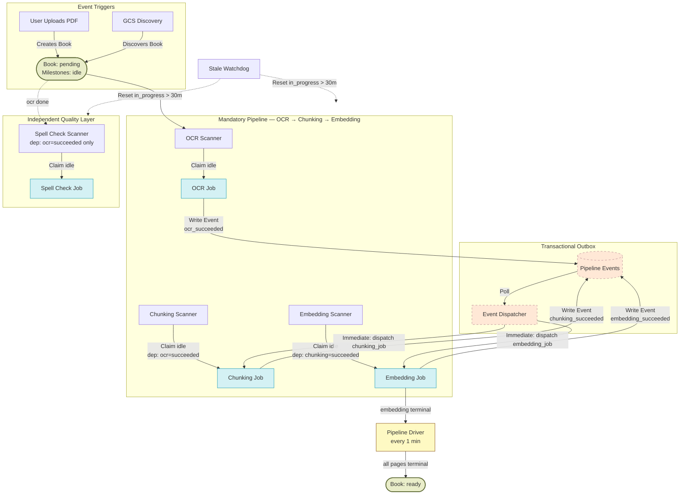
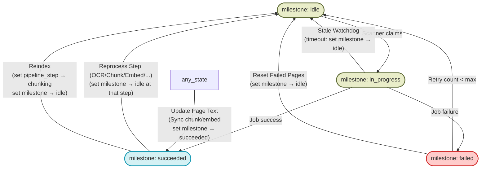
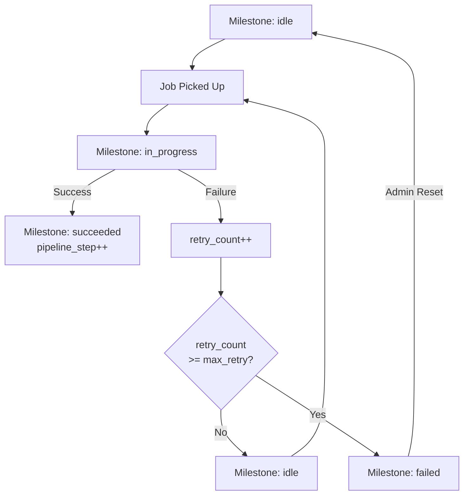

# Book Processing Pipeline Diagram

Visual representation of the book processing pipeline, including triggers, stage transitions, admin recovery actions, and outputs. All processing is synchronous/realtime — no Gemini Batch API is used.

---

## Full Pipeline

---

## Admin Recovery Actions

Actions available from the admin management table when a book is stuck or failed. These actions work by resetting page-level milestones to `idle`, allowing scanners to pick them up.

---

## Page Milestone Transitions

When a page repeatedly fails OCR, it is automatically marked as `failed` after `ocr_max_retry_count` attempts. Admin can then use "Reset Failed Pages" to try again if needed.

---

### Book Statuses

| Status | Meaning |
|---|---|
| `pending` | Waiting for processing to begin |
| `ready` | Fully processed; all pages reached final milestone |
| `error` | Terminal failure at book level (rare; usually page-level) |

### Page Milestones

| Milestone | Meaning |
|---|---|
| `idle` | Awaiting processing by the relevant scanner |
| `in_progress` | Currently being processed by a worker job |
| `succeeded` | Successfully completed current pipeline step |
| `failed` | Max retries reached; manual intervention required |

### Page Pipeline Steps

| Step | Goal | Terminal Success |
|---|---|---|
| `ocr` | Extraction of text from image/PDF | `succeeded` |
| `chunking` | Recursive character splitting of text into overlapping chunks | `succeeded` |
| `embedding` | Generation of vector embeddings | `succeeded` |
| `spell_check` | Identifying unknown words | `done` |

---

### Reprocess Step
| Field | Value |
|---|---|
| Trigger | Admin context menu step reprocess (OCR, Chunking, Embedding, or Spell Check) |
| Effect | Target step milestone → `idle`. Downstream steps reset. |
| Logic | Preserves existing data until newer results are applied page-by-page. |

### Reindex
| Field | Value |
|---|---|
| Trigger | Admin "Reindex" button (legacy) or Step Reprocess: chunking |
| Effect | Target pages → `chunking_milestone: idle`. New chunks/embeddings will be generated. |

### Reset Failed Pages
| Field | Value |
|---|---|
| Trigger | Admin "Reset Failed" button |
| Effect | Pages with `milestone: failed` → `milestone: idle`, `retry_count: 0` |

### Manual Page Update
| Field | Value |
|---|---|
| Trigger | Editor saves text changes |
| Effect | Synchronous re-chunk (always). Synchronous re-embed attempted — if it succeeds, `embedding_milestone: succeeded`; if it fails, `embedding_milestone: idle` and the worker picks it up. If text changed, stale spell issues are deleted and `spell_check_milestone` is reset to `idle`. |

---

## Key Infrastructure

| Component | Role |
|---|---|
| **ARQ Worker** | Runs the scanners and specific jobs (via Redis queue) |
| **Pipeline Driver** | Initializes pages, resets retryable failures, marks books `ready` when embedding is terminal |
| **Scanners** | Poll for `idle` pages, enforce their own upstream dependency, dispatch jobs |
| **Event Dispatcher** | Polls the outbox and immediately dispatches the next job (bypasses the 1-min cron delay) |
| **Stale Watchdog** | Recovers `in_progress` pages that timed out |
