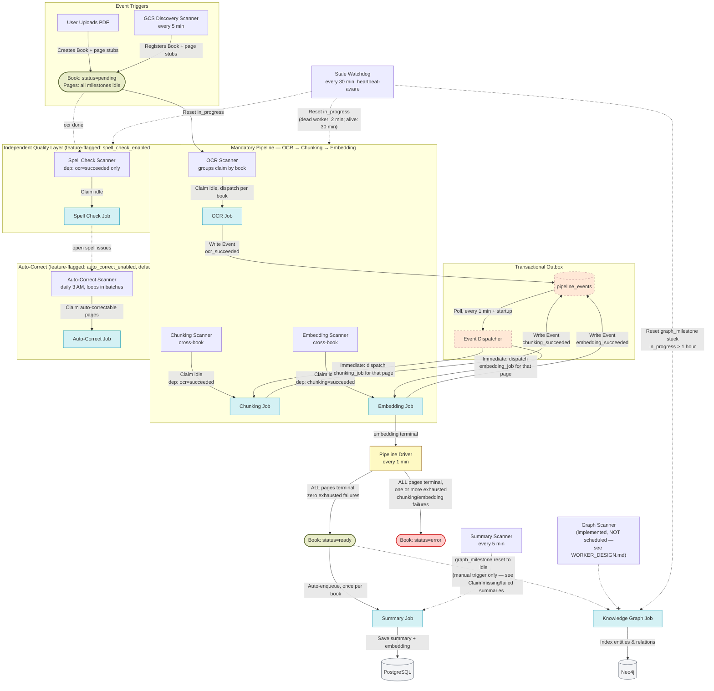
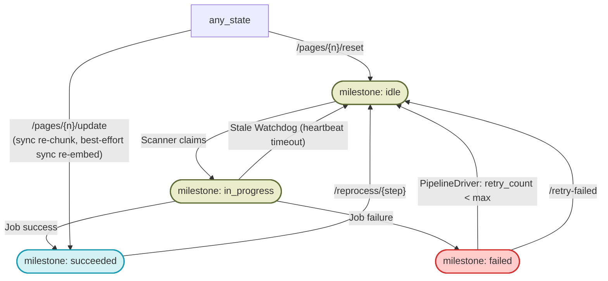
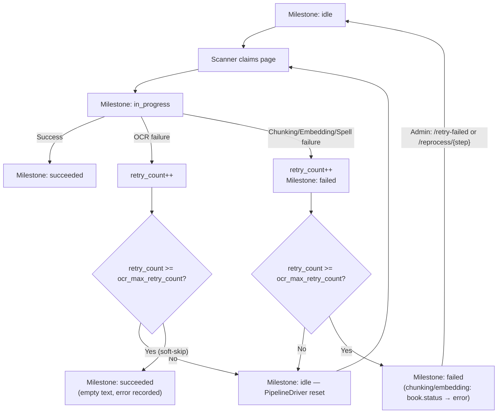

# Book Processing Pipeline Diagram

Visual companion to [WORKER_DESIGN.md](WORKER_DESIGN.md). Gemini API calls are synchronous/real-time by default. OCR and embedding can each optionally run through the Gemini Batch API instead (`gemini_batch_ocr_enabled` / `gemini_batch_embedding_enabled`, both `false` by default) — see [OCR_DESIGN.md](OCR_DESIGN.md#data-flow) and [EMBEDDING_DESIGN.md](EMBEDDING_DESIGN.md#data-flow) for the batch-mode diagrams.

---

## Full Pipeline

```mermaid
flowchart TD
    %% Triggers
    subgraph Triggers [Event Triggers]
        T1[User Uploads PDF] -->|Creates Book + page stubs| InitDB
        T2[GCS Discovery Scanner<br/>every 5 min] -->|Registers Book + page stubs| InitDB
    end

    InitDB(["Book: status=pending<br/>Pages: all milestones idle"])

    %% Mandatory sequential pipeline
    subgraph Pipeline ["Mandatory Pipeline — OCR → Chunking → Embedding"]
        S_OCR["OCR Scanner<br/>groups claim by book"] -->|Claim idle, dispatch per book| J_OCR[OCR Job]
        S_CH["Chunking Scanner<br/>cross-book"] -->|"Claim idle<br/>dep: ocr=succeeded"| J_CH[Chunking Job]
        S_EM["Embedding Scanner<br/>cross-book"] -->|"Claim idle<br/>dep: chunking=succeeded"| J_EM[Embedding Job]
    end

    InitDB --> S_OCR

    %% Event Bus / Outbox — reactive low-latency triggers
    subgraph Outbox [Transactional Outbox]
        J_OCR -->|"Write Event<br/>ocr_succeeded"| OB[(pipeline_events)]
        J_CH -->|"Write Event<br/>chunking_succeeded"| OB
        J_EM -->|"Write Event<br/>embedding_succeeded"| OB

        OB -->|Poll, every 1 min + startup| ED[Event Dispatcher]

        ED -->|Immediate: dispatch chunking_job for that page| J_CH
        ED -->|Immediate: dispatch embedding_job for that page| J_EM
    end

    %% Book readiness — driven by PipelineDriver
    J_EM -->|embedding terminal| PD["Pipeline Driver<br/>every 1 min"]
    PD -->|"ALL pages terminal,<br/>zero exhausted failures"| Ready([Book: status=ready])
    PD -->|"ALL pages terminal,<br/>one or more exhausted<br/>chunking/embedding failures"| BookErr([Book: status=error])

    Ready -->|Auto-enqueue, once per book| J_SUM[Summary Job]
    Ready -.->|"graph_milestone reset to idle<br/>(manual trigger only — see note)"| J_KG[Knowledge Graph Job]

    %% Backfill Scanners
    S_SUM["Summary Scanner<br/>every 5 min"] -.->|Claim missing/failed summaries| J_SUM
    S_KG["Graph Scanner<br/>(implemented, NOT scheduled —<br/>see WORKER_DESIGN.md)"] -.-x J_KG

    J_SUM -->|Save summary + embedding| PG[(PostgreSQL)]
    J_KG -->|Index entities & relations| N4J[(Neo4j)]

    %% Independent quality layer — runs in parallel, does NOT block readiness
    subgraph SpellCheck ["Independent Quality Layer (feature-flagged: spell_check_enabled, default true)"]
        S_SC["Spell Check Scanner<br/>dep: ocr=succeeded only"] -->|Claim idle| J_SC[Spell Check Job]
    end
    InitDB -.->|ocr done| S_SC

    subgraph AutoCorrect ["Auto-Correct (feature-flagged: auto_correct_enabled, default true)"]
        S_AC["Auto-Correct Scanner<br/>daily 3 AM, loops in batches"] -->|Claim auto-correctable pages| J_AC[Auto-Correct Job]
    end
    J_SC -.->|open spell issues| S_AC

    %% Monitoring
    Watchdog["Stale Watchdog<br/>every 30 min, heartbeat-aware"] -.->|"Reset in_progress<br/>(dead worker: 2 min; alive: 30 min)"| Pipeline
    Watchdog -.->|"Reset in_progress"| SpellCheck
    Watchdog -.->|"Reset graph_milestone stuck<br/>in_progress > 1 hour"| J_KG

    classDef stage fill:#e9edc9,stroke:#606c38,stroke-width:2px
    classDef job fill:#d4f1f4,stroke:#189ab4,stroke-width:1px
    classDef event fill:#ffe8d6,stroke:#b5838d,stroke-dasharray: 5 5
    classDef driver fill:#fef9c3,stroke:#854d0e,stroke-width:1px
    classDef db fill:#f3f4f6,stroke:#4b5563,stroke-width:1px
    classDef errStage fill:#ffcccb,stroke:#d32f2f,stroke-width:2px

    class InitDB,Ready stage
    class J_OCR,J_CH,J_EM,J_SC,J_SUM,J_KG,J_AC job
    class OB,ED event
    class PD driver
    class PG,N4J db
    class BookErr errStage
```

> **Knowledge graph note:** `graph_scanner.py` exists and is unit-tested, but `services/worker/worker.py` does not register it in `WorkerSettings.cron_jobs`, so it never runs on a schedule today. Combined with `knowledge_graph_enabled` defaulting to `false` in `system_configs`, knowledge-graph generation currently only happens via the manual admin "Reprocess Graph" action, which enqueues `knowledge_graph_job` directly.

---

## Batch OCR & Batch Embedding (optional)

Both feature-flagged off by default. When enabled, they replace the interactive-API branch of `OCR Job`/`Embedding Scanner` with an async submit-then-poll cycle against the Gemini Batch API. See [OCR_DESIGN.md](OCR_DESIGN.md#data-flow) for the batch-OCR diagram and [EMBEDDING_DESIGN.md](EMBEDDING_DESIGN.md#data-flow) for the batch-embedding diagram.

---

## Admin Recovery Actions

Actions available to admins/editors on a book for recovering from a stuck or failed pipeline state. All of them work by resetting milestone columns and letting the existing scanners pick the pages back up — none of them run processing synchronously except "Update Page Text".

| Endpoint | Role required | Effect |
|---|---|---|
| `POST /api/books/{book_id}/reprocess/ocr` | admin | Resets OCR + all downstream milestones to `idle`, `status='pending'`, `pipeline_step='ocr'`. Text/chunks/embeddings are preserved until the scanners overwrite them. |
| `POST /api/books/{book_id}/reprocess/chunking` | editor | Resets chunking + downstream milestones to `idle`. OCR text is untouched; chunks are recreated in place by `chunking_scanner`. |
| `POST /api/books/{book_id}/reprocess/embedding` | editor | Resets embedding milestone to `idle` and clears existing chunk embeddings (`embedding=NULL`) so `embedding_scanner` regenerates vectors. Chunk text is preserved. |
| `POST /api/books/{book_id}/reprocess/spell-check` | editor | Resets `spell_check_milestone` to `idle` only. All other data untouched. |
| `POST /api/books/{book_id}/reprocess/graph` | admin | Enqueues `knowledge_graph_job` directly (bypasses `graph_scanner`). Returns `400` if `knowledge_graph_enabled != 'true'`. |
| `POST /api/books/{book_id}/reprocess/summary` | admin | Deletes the existing `book_summaries` row and enqueues `summary_job`. |
| `POST /api/books/{book_id}/retry-failed` | editor | Resets every `failed`/`error` milestone on the book back to `idle`, resets `retry_count=0`, sets `status='pending'` — the standard way to un-stick a book that landed in `status='error'`. |
| `POST /api/books/{book_id}/pages/{page_num}/reset` | editor | Resets a single page's `status`, text, and all milestones so OCR reprocesses it from scratch. |
| `POST /api/books/{book_id}/pages/{page_num}/update` | editor | Manual text edit — see [Manual Page Update](#manual-page-update) below. |
| `POST /api/books/admin/bulk-reset-incomplete-ocr` | admin | Resets OCR + downstream milestones for every book where `ocr_milestone != 'succeeded'`; `include_error=true` also includes books already in `status='error'`. Used to recover from a worker outage. |

```mermaid
flowchart TD
    idle([milestone: idle])
    in_proc([milestone: in_progress])
    succ([milestone: succeeded])
    fail([milestone: failed])

    %% Normal flow (Scanners)
    idle -->|Scanner claims| in_proc
    in_proc -->|Job success| succ
    in_proc -->|Job failure| fail
    fail -->|"PipelineDriver: retry_count < max"| idle

    %% Admin actions
    fail -->|"/retry-failed"| idle
    succ -->|"/reprocess/{step}"| idle
    in_proc -->|"Stale Watchdog (heartbeat timeout)"| idle
    any_state -->|"/pages/{n}/reset"| idle
    any_state -->|"/pages/{n}/update<br/>(sync re-chunk, best-effort sync re-embed)"| succ

    classDef state fill:#e9edc9,stroke:#606c38,stroke-width:2px
    classDef errState fill:#ffcccb,stroke:#d32f2f,stroke-width:2px
    classDef succState fill:#d4f1f4,stroke:#189ab4,stroke-width:2px

    class idle,in_proc state
    class fail errState
    class succ succState
```

---

## Page Milestone Transitions

The exhaustion behavior differs by step — see [WORKER_DESIGN.md § PipelineDriver](WORKER_DESIGN.md#pipelinedriver) for the full rationale:

- **OCR**: a page that keeps failing the Gemini Vision call is **soft-skipped** once `retry_count >= ocr_max_retry_count` — it's marked `ocr_milestone='succeeded'` with empty text (not `failed`), so it doesn't block the book. Only a failure to download the book's PDF at all can leave OCR genuinely `failed`.
- **Chunking / Embedding / Spell check**: each job sets `failed` on every exception; `PipelineDriver` resets it to `idle` while `retry_count < max`, or leaves it `failed` once exhausted. An exhausted chunking or embedding failure marks the **entire book** `status='error'` (not just that page) — spell check exhaustion never affects book status.

```mermaid
flowchart TD
    A[Milestone: idle] --> B[Scanner claims page]
    B --> C[Milestone: in_progress]
    C -->|Success| D[Milestone: succeeded]
    C -->|OCR failure| E1["retry_count++"]
    C -->|Chunking/Embedding/Spell failure| E2["retry_count++<br/>Milestone: failed"]
    E1 --> F1{"retry_count >= ocr_max_retry_count?"}
    F1 -->|No| G[Milestone: idle — PipelineDriver reset]
    F1 -->|"Yes (soft-skip)"| D2["Milestone: succeeded<br/>(empty text, error recorded)"]
    G --> B
    E2 --> F2{"retry_count >= ocr_max_retry_count?"}
    F2 -->|No| G
    F2 -->|Yes| H["Milestone: failed<br/>(chunking/embedding: book.status → error)"]
    H -->|"Admin: /retry-failed or /reprocess/{step}"| A
```

---

### Book Statuses

| Status | Meaning |
|---|---|
| `pending` | Registered but the mandatory pipeline (OCR/chunking/embedding) hasn't fully completed yet |
| `ready` | Every page reached `embedding_milestone='succeeded'` — searchable, appears in the library |
| `error` | At least one page has an exhausted OCR-PDF, chunking, or embedding failure — needs admin intervention (`/retry-failed`) |

### Page Milestones

| Milestone | Meaning |
|---|---|
| `idle` | Awaiting processing by the relevant scanner |
| `in_progress` | Claimed by a scanner and currently being processed by a job |
| `succeeded` | Step complete for this page (OCR may reach this via a soft-skip with empty text) |
| `failed` | Job raised an exception on this attempt; retried automatically while `retry_count` remains under the configured max |

### Manual Page Update

`POST /api/books/{book_id}/pages/{page_num}/update` — editor saves text changes in the reader/admin UI:

1. Text is normalized (markdown + Uyghur character normalization) and saved.
2. If the text actually changed, existing spell-check issues for the page are deleted and `spell_check_milestone` is reset to `idle`.
3. Chunks are re-split and upserted **synchronously** in the request.
4. Embeddings are generated **synchronously** in the same request if possible; on success `embedding_milestone='succeeded'` immediately. If the embedding call fails, the page is left at `chunking_milestone='succeeded'`/`embedding_milestone='idle'` and `embedding_scanner` picks it up on its next run.
5. Book-level milestones are recomputed before the response returns.

---

## Key Infrastructure

| Component | Role |
|---|---|
| **ARQ Worker** | Executes the 7 registered jobs and 13 scheduled scanners (of 14 total; `graph_scanner` unscheduled) via the Redis-backed queue |
| **Pipeline Driver** | Initializes new pages, resets retryable failures, computes book `ready`/`error`, auto-enqueues `summary_job` |
| **Scanners** | Poll for eligible `idle` pages/books, enforce their own upstream dependency, dispatch jobs |
| **Event Dispatcher** | Polls `pipeline_events` and immediately dispatches the next job, bypassing the 1-minute cron cadence |
| **Stale Watchdog** | Recovers `in_progress` pages/books using Redis worker-heartbeat state, not just a flat timeout |
| **MultiPageLock** | Redis-backed per-page lock (1‑hour expiry, namespaced per pipeline stage) used by `ocr_job`, `chunking_job`, `embedding_job`, and `spell_check_job` to prevent double-processing of a claimed page |
| **Batch pollers** | `batch_ocr_poller_scanner` / `batch_embedding_poller_scanner` — poll Gemini Batch API jobs and ingest results when the corresponding batch mode is enabled |
